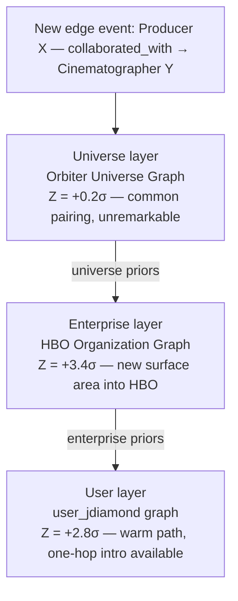

## Overview

Scheduled cron tasks continuously generate and update statistical analyses across each graph type, producing the **General Intelligence Layer** from the **Orbiter Universe Graph**, an **Enterprise Intelligence Layer** for each **Organization Graph**, and a **User Intelligence Layer** for each **User Graph**.

The statistics fall into roughly six families. Each family is computed at every layer, but the interpretation and the actionable surface changes depending on scope.

## The six metric families

### Centrality and influence

PageRank, eigenvector, degree, and HITS-style hub/authority scores. At the universe level these surface globally significant nodes — industry-defining people, organizations, and works. Inside an organization graph they reveal who carries the most relational weight against that company's specific surface area. Inside a user graph they identify the user's personal power players.

### Brokerage and pathfinding

Betweenness centrality, structural-hole metrics (constraint, effective size), and shortest-path / k-shortest-path computations. This is the substrate for warm-path discovery and introduction routing — both across organizational silos (who bridges teams, accounts, or markets) and inside a user's ego network (how do I reach X, and through whom).

### Community and cohesion

Louvain / Leiden modularity, clustering coefficient, triadic closure rate, and clique enumeration. Identifies natural sub-graphs: cohorts, deal teams, repeat-collaboration crews, friend circles. Universe-level communities act as baselines; enterprise communities map to functional or market segments; user communities map to social and professional clusters.

### Temporal dynamics

Edge-creation velocity, recency-weighted variants of every centrality score, relationship decay curves, and trajectory metrics on career and credit nodes (promotion cadence, project rhythm, award accumulation rate). This is what separates a static address book from a live intelligence system, and what lets the graph distinguish a relationship that's compounding from one that's drifting.

### Semantic and domain composition

Distribution statistics across the 70+ domain expertise taxonomy, vertical concentration indices, award density per domain, and credit/role mix on film and TV nodes. At the universe level these are global priors — how rare a given expertise actually is in the wild. Enterprise and user layers use them as the baseline against which their own composition is scored ("you over-index on X relative to the universe by 4.3×").

### Affinity and similarity

pgvector cosine similarity across node embeddings, Jaccard and neighborhood-overlap measures on the graph side, and hybrid scores that combine both. Powers people-like-this, account-like-this, lookalike account expansion, and the dedup confidence layer. Universe-level affinity is the population distribution; enterprise affinity is org-scoped lookalike; user affinity captures personal taste and fit.

## How the layers compose

The three intelligence layers are not parallel computations over the same data; they form a hierarchical sequence in which each layer's outputs serve as inputs — specifically, as baseline priors — to the layers beneath it. The system implements this composition through a defined pass-through of statistical baselines from the broadest scope (the Orbiter Universe Graph) to the narrowest scope (an individual User Graph), allowing every metric at the narrower scope to be interpreted relative to, and normalized against, the statistical distribution observed at the broader scope.

When the General Intelligence Layer is computed across the Universe Graph, the scheduled task persists not only the raw scores (centrality, brokerage, community membership, taxonomy frequency, embedding-similarity distributions, edge-velocity distributions, and the other families enumerated above) but also the parameterized distributions themselves — means, variances, percentile cutoffs, and per-category frequency tables across each node type and edge type in the ontology. These persisted parameters constitute the *universe priors*.

When the Enterprise Intelligence Layer is subsequently computed for a given Organization Graph, the same family of metrics is recomputed over that organization's scoped sub-graph, and each metric is paired with the corresponding universe prior. The output is a two-channel score per node and per edge: an absolute value within the organization, and a normalized value expressing the deviation of that absolute value from the universe baseline — implemented variously as a z-score against the universe-fitted distribution, a log-likelihood ratio, or an over-/under-indexing ratio against the universe frequency table, depending on the metric family. The Enterprise Intelligence Layer in turn persists both its own scores and its own derived distribution parameters, which become *enterprise priors*.

The User Intelligence Layer is then computed against each per-user named graph — each isolated under a `user_{userId}` namespace in the underlying graph store — and is paired with the enterprise priors of the user's parent organization, or with universe priors directly when no organization scope applies. The same two-channel structure repeats: each user-level metric carries both an absolute value within the user's ego network and a normalized value against the next-broader scope's prior distribution.

The composite result is that a single observed relationship event — for example, the creation of a new edge between two nodes — produces three distinct scored interpretations, each generated by an independent scheduled job against a different graph scope, each normalized against a different prior distribution, and each refreshed on an independent cadence. A relationship that registers as statistically unremarkable at universe scope may simultaneously register as a high-percentile outlier at enterprise scope and as a low-percentile event within the user's personal ego network, or any combination thereof.

Because the universe priors themselves drift over time as the Universe Graph expands and as edge-velocity distributions shift, the normalization at every lower layer is recomputed continuously rather than fixed at the time of ingestion. Each scheduled recomputation cycle therefore propagates updated population statistics downward, causing previously persisted enterprise and user scores to be re-interpreted against current priors without manual reconfiguration. The system thereby maintains a continuously-refreshed, three-level, context-aware interpretation of every node, edge, and event in the graph as the underlying graphs grow.

<Info>
**Notes for patent counsel.** Three claim hooks surface from this section:
- The **two-channel score** (absolute + normalized-against-prior) per node and per edge is the cleanest atomic claim element — concrete, measurable, and not obvious from prior art that does one or the other.
- The **per-user named-graph isolation** combined with cross-layer prior propagation is a useful structural claim — multi-tenant graph isolation exists in the wild, but propagating statistical priors *across* tenancy boundaries while keeping the underlying graphs isolated is the unusual bit.
- The **continuous re-normalization loop** (priors drift → downstream scores re-interpret) is worth claiming as a method claim distinct from the system claim — it covers the temporal/operational dimension that a static system claim would miss.

Multiple normalization implementations (z-score, log-likelihood, over-/under-indexing) are listed so the claim language can be drafted broadly without locking to one mathematical form.
</Info>

## Worked example

A worked example using a single new edge in the entertainment vertical. The same event produces three very different statistical readings depending on which prior it's normalised against.



A new `collaborated_with` edge is created between Producer X and Cinematographer Y. The General Intelligence Layer scores it against the universe prior for that edge type and sees a perfectly ordinary industry pairing — `Z = +0.2σ`, statistically uninteresting. The Enterprise Intelligence Layer recomputes the same metric inside HBO's organization graph, paired with the universe prior, and registers `Z = +3.4σ`: relative to the cinematographers HBO has previously connected to through known producers, this one is a high-percentile outlier. The User Intelligence Layer recomputes again inside `user_jdiamond`'s namespace, paired with the HBO enterprise prior, and registers `Z = +2.8σ` because Josh has a strong, recent edge to Producer X — meaning the new cinematographer is now one warm hop away.

One event, three readings, none of them derivable from the other two without the prior-propagation step.

## Sample data

What the persisted data and computed scores might look like across the three layers.

### Universe-layer priors

Sample of what `universe_priors_recompute` persists. Each row is one parameterized distribution stored at the end of the cron cycle. These are the inputs that every enterprise- and user-level normalisation references.

| Family | Metric | Distribution form | Parameters | Last refresh |
|---|---|---|---|---|
| Centrality | PageRank (Person nodes) | Log-normal | μ_log = −4.21, σ_log = 1.78 | 2026-05-10 06:00 UTC |
| Centrality | Betweenness (Person nodes) | Log-normal | μ_log = −6.14, σ_log = 2.31 | 2026-05-10 06:00 UTC |
| Brokerage | Effective size (Burt) | Normal | μ = 3.4, σ = 2.7 | 2026-05-10 06:00 UTC |
| Community | Clustering coefficient | Normal | μ = 0.182, σ = 0.094 | 2026-05-10 06:00 UTC |
| Temporal | Edge creation rate per node·day | Log-normal | μ_log = −2.18, σ_log = 1.42 | 2026-05-10 06:00 UTC |
| Composition | `Producer—collaborated_with→Cinematographer` | Frequency | 0.34% of all edges (n = 168,420) | 2026-05-10 06:00 UTC |
| Composition | Expertise: cinematography | Frequency | 0.81% of Person nodes (n = 41,205) | 2026-05-10 06:00 UTC |
| Composition | Award density: Emmy / cinematography | Frequency | 0.62% of cinematographer nodes | 2026-05-10 06:00 UTC |
| Affinity | Endpoint embedding cosine (connected pairs) | Normal | μ = 0.47, σ = 0.12 | 2026-05-10 06:00 UTC |

### Same edge, six families, three layers

Continuing the Producer X → Cinematographer Y example from the diagram. Each cell is the normalised reading of *that* metric family against *that* layer's prior. The composite row is the weighted aggregate the application surfaces to the user.

| Metric family | Universe | Enterprise (HBO) | User (Josh) |
|---|---|---|---|
| Centrality | +0.6σ | +2.1σ | +1.8σ |
| Brokerage | +0.4σ | +2.9σ | +3.1σ |
| Community | −0.2σ | +1.4σ | +2.4σ |
| Temporal | +0.3σ | +3.4σ | +2.8σ |
| Composition | 0.0σ | +4.1σ | +3.2σ |
| Affinity | +0.4σ | +2.7σ | +1.9σ |
| **Composite (weighted)** | **+0.2σ** | **+3.4σ** | **+2.8σ** |

The composite row matches the three readings shown in the diagram. The breakdown explains *why* the readings differ: at enterprise scope the dominant contribution is Composition (HBO has historically under-indexed on this cinematographer cohort), while at user scope the dominant contribution shifts to Brokerage and Community (Josh's strong tie to Producer X makes the new node a structurally valuable neighbour).

### Cron schedule and refresh cadence

The propagation mechanism in operational form. Broader scopes refresh more slowly because their priors are more stable; narrower scopes refresh more aggressively because the actionable signal lives there.

| Cron job | Layer | Cadence | Scope | Persisted output |
|---|---|---|---|---|
| `universe_priors_recompute` | General | Every 12h | Orbiter Universe Graph | Distribution parameters per metric (μ, σ, percentile cutoffs, frequency tables) |
| `universe_scores_recompute` | General | Every 24h | Orbiter Universe Graph | Absolute + normalised score per node, per edge |
| `enterprise_priors_recompute` | Enterprise | Every 6h | Per Organization Graph | Org-scoped distribution parameters, paired with universe priors |
| `enterprise_scores_recompute` | Enterprise | Every 1h | Per Organization Graph | Absolute + normalised score per node, per edge in org |
| `user_scores_recompute` | User | Every 15m | Per User Graph (`user_{userId}`) | Absolute + normalised score per node, per edge in user graph |

## Computation and persistence

The input substrate varies by family. Some families need only graph topology; others reach into vector embeddings, edge timestamps, or node properties.

### What each family is calculated on

| Family | Calculated on | Primary algorithms | Output shape |
|---|---|---|---|
| Centrality and influence | Graph topology only (nodes + edges) | PageRank, eigenvector, degree, HITS authority/hub | Float per node, per metric |
| Brokerage and pathfinding | Graph topology + edge weights | Betweenness (sampled at universe scale, full at org/user scale), Burt's effective size and constraint, k-shortest paths | Float per node; path objects per (source, target) pair |
| Community and cohesion | Graph topology | Louvain / Leiden modularity, local + global clustering coefficient, triadic closure rate, clique enumeration | Integer `community_id` + float clustering coefficient per node; scalar modularity per scope |
| Temporal dynamics | Edge `created_at` + `last_touched_at` timestamps, recency-weighted edge strengths | Sliding-window edge-creation rate, exp-decay-weighted variants of every centrality score, decay-curve fitting per (source, target) pair | Float per node (velocity); float per edge (decayed strength); fitted decay parameters per relationship |
| Semantic and domain composition | Node properties (`expertise[]`, `industry`, `role`, `award.subdomain`), edge type distribution | Frequency counts, GROUP BY aggregations, KL-divergence vs baseline, over-/under-indexing ratios | Frequency tables keyed by `(node_type, property_value)`; scalar over/under-index per scope |
| Affinity and similarity | Vector embeddings (AlloyDB pgvector) + graph neighborhoods (FalkorDB) | Cosine similarity via ScaNN (two-stage: top-500 candidates → full rerank), Jaccard / neighborhood overlap, hybrid weighted score | Pairwise similarity matrix (sparse, top-K per node); float per node (avg similarity to scope) |

The same algorithms run at all three scopes — only the underlying subgraph changes:

- **Universe scope:** the full Orbiter Universe Graph in FalkorDB.
- **Enterprise scope:** a filtered traversal of the universe graph constrained to nodes and edges belonging to that organisation's named graph.
- **User scope:** the `user_{userId}` named graph, which is independently materialised per user.

Most metrics (PageRank, Louvain, degree, eigenvector, clustering coefficient, effective size, all composition and temporal statistics) run as exact computations at every scope. Sampling applies only to the algorithms whose exact form scales poorly: betweenness centrality uses Brandes–Pich source-node sampling at universe scope, with sample size `k` chosen by error bound rather than fixed; triangle counting uses wedge sampling at universe scope; vector affinity uses ScaNN approximate top-K with tuned recall (~0.97). Enterprise and user scopes use exact computation throughout — those subgraphs are small enough that the cost is in single-digit minutes for the largest organisations and milliseconds for individual user graphs.

### Coverage and cadence

Coverage (which nodes and edges get touched) and cadence (how often) vary by metric. The cron cadences in the priors-recompute schedule represent how often the *aggregate distribution parameters* are refreshed — not how often each underlying metric is computed. Some metrics maintain incrementally on edge writes; others batch on a stratified schedule.

| Metric | Coverage at universe scope | Recompute cadence | Notes |
|---|---|---|---|
| Degree centrality | Every node | Every 1h | Maintained incrementally on edge writes. |
| PageRank | Every node | Every 24h | Power iteration; warm-started from previous cycle. |
| Eigenvector / HITS | Every node | Every 24h | Same shape as PageRank. |
| Louvain community | Every node | Every 24h | Each node receives a `community_id`; refines from prior assignment. |
| Local clustering coefficient | Every node with `degree ≥ 2` | Every 24h | Skipped for leaf nodes (clustering trivially 0). |
| Effective size (Burt) | Every node with `degree ≥ 3` | Every 24h | Threshold avoids degenerate computation on small egos. |
| Betweenness | `k` sampled pivot nodes | Every 12h | `k` chosen by error bound. Results interpolated over all nodes via incident-edge contribution. |
| Triangle / triadic closure | Every node (approximate) | Every 24h | Wedge sampling at universe scope; full enumeration at enterprise/user. |
| Edge creation velocity | Every node | Every 1h | Rolling-window aggregation over edge `created_at`. |
| Recency-weighted PageRank | Every node | Every 6h | Faster cadence than base PageRank because recency drift is what makes it actionable. |
| Decay curve fitting | Only edges with `≥ 5` historical interactions | Every 6h | Parametric fit; falls back to default decay below threshold. |
| Composition / frequency | Scans every node and every edge; **output is ~50–200 aggregate rows per scope** | Every 12h | Pure counting. Per-node over/under-index ratios are derived on demand from the frequency table — not materialised. |
| Endpoint embedding cosine | Every edge | Every 24h | Computed on the two endpoint embeddings; no sampling. |
| Vector affinity (node → node) | Every node × top-500 ScaNN candidates | Every 24h | `O(V × K)`, not `O(V²)`. |
| Jaccard on neighborhoods | Only pairs surfaced by ScaNN | Every 24h | Piggybacks on the affinity candidate set. |

Cadence is stratified into tiers; not every cron cycle recomputes every metric.

| Tier | Refresh rate | Metrics |
|---|---|---|
| Hot | 1h or faster | Degree, edge velocity, recency-weighted edge strength, composite score |
| Warm | 6h | Recency-weighted PageRank, decay curve fits |
| Cool | 24h | PageRank, Louvain, clustering coefficient, effective size, betweenness, affinity, embedding cosine |
| Cold | Weekly | Triangle / clustering global aggregates, modularity benchmarks |

Universe priors are recomputed every 12h because that is the window over which the aggregate distribution parameters (means, variances, percentile cutoffs) shift meaningfully — not because every underlying metric refreshes every 12h.

### Storage selectivity

The schemas in the next section describe the maximum-fidelity case. In practice, persistence is selective:

- **Composite scores** are written for every node at every scope (the hot-path lookup).
- **Per-family scores** are persisted only where `|normalized_z| ≥ 0.5` — i.e., scores statistically distinguishable from baseline. The flat middle of the distribution is not materialised.
- **Composition scores** are not materialised per-node at all. The frequency tables in `intelligence_priors` are authoritative; per-node over/under-index ratios are computed on demand by joining node properties against the frequency table.
- **Edge scores** are persisted only where the edge itself is fresh (`created_at` within 90 days OR `last_touched_at` within 30 days). Older inactive edges retain stale scores until promoted.

These rules keep the AlloyDB intelligence tables in the tens of millions of rows rather than hundreds of millions, which matters for index performance and re-normalisation runtime.

### Where the scores get saved

The persistence layer splits across FalkorDB and AlloyDB by access pattern, not by data type. A score may live in both stores simultaneously, with the two copies serving different consumers.

**FalkorDB** holds the scores that need to be available *during graph traversal* — i.e., when the application is walking the graph to answer a query and needs to make ranking decisions inline. These are written back as node and edge properties on the same nodes the algorithm computed them for. Specifically:

- `composite_score` (the weighted aggregate) on every node
- Top-tier per-family scores: `pagerank`, `betweenness`, `community_id`, `clustering_coefficient`, `effective_size`, `recency_decay_weight`
- Z-score channels for the same metrics: `pagerank_z_universe`, `pagerank_z_enterprise`, `pagerank_z_user`
- A `last_intelligence_update` timestamp per node for staleness tracking

These properties are what the RAG traversal stage uses to bias the random walk. They have to be co-resident with the graph because the alternative — a per-hop join against AlloyDB — would dominate query latency.

**AlloyDB** holds everything else: the full score history, the family decomposition, the distribution parameters that constitute the priors, and any analytical aggregates. This is where dashboards, drift detection, and re-normalisation jobs read from.

### AlloyDB schema

The four tables that carry the persistent intelligence data:

```sql
-- 1. Distribution parameters (the priors themselves)
CREATE TABLE intelligence_priors (
  id              BIGSERIAL PRIMARY KEY,
  layer           TEXT NOT NULL,            -- 'universe' | 'enterprise' | 'user'
  scope_id        TEXT,                     -- NULL for universe; org_id or user_id otherwise
  family          TEXT NOT NULL,            -- 'centrality' | 'brokerage' | ...
  metric          TEXT NOT NULL,            -- 'pagerank' | 'betweenness' | ...
  node_type       TEXT,                     -- 'Person' | 'Company' | 'FilmTVCredit' | ...
  edge_type       TEXT,                     -- for edge-scoped metrics
  distribution    TEXT NOT NULL,            -- 'log_normal' | 'normal' | 'frequency'
  parameters      JSONB NOT NULL,           -- {mu_log: -4.21, sigma_log: 1.78}
  percentiles     JSONB,                    -- {p50: ..., p95: ..., p99: ...}
  sample_size     BIGINT,
  computed_at     TIMESTAMPTZ NOT NULL,
  job_run_id      UUID NOT NULL,
  UNIQUE (layer, scope_id, family, metric, node_type, edge_type)
);
CREATE INDEX idx_priors_lookup ON intelligence_priors (layer, scope_id, family, metric);

-- 2. Per-node scores (two-channel: absolute + normalised)
CREATE TABLE intelligence_node_scores (
  id              BIGSERIAL PRIMARY KEY,
  layer           TEXT NOT NULL,
  scope_id        TEXT,
  node_id         TEXT NOT NULL,            -- FalkorDB node UUID
  family          TEXT NOT NULL,
  metric          TEXT NOT NULL,
  absolute_value  DOUBLE PRECISION NOT NULL,
  normalized_z    DOUBLE PRECISION NOT NULL, -- z-score vs prior at this layer
  prior_ref_id    BIGINT REFERENCES intelligence_priors(id),
  computed_at     TIMESTAMPTZ NOT NULL,
  job_run_id      UUID NOT NULL,
  UNIQUE (layer, scope_id, node_id, family, metric)
);
CREATE INDEX idx_node_scores_topk
  ON intelligence_node_scores (layer, scope_id, family, metric, normalized_z DESC);
CREATE INDEX idx_node_scores_node
  ON intelligence_node_scores (node_id, layer);

-- 3. Per-edge scores (same two-channel structure)
CREATE TABLE intelligence_edge_scores (
  id              BIGSERIAL PRIMARY KEY,
  layer           TEXT NOT NULL,
  scope_id        TEXT,
  edge_id         TEXT NOT NULL,
  source_node_id  TEXT NOT NULL,
  target_node_id  TEXT NOT NULL,
  edge_type       TEXT NOT NULL,
  family          TEXT NOT NULL,
  metric          TEXT NOT NULL,
  absolute_value  DOUBLE PRECISION NOT NULL,
  normalized_z    DOUBLE PRECISION NOT NULL,
  prior_ref_id    BIGINT REFERENCES intelligence_priors(id),
  computed_at     TIMESTAMPTZ NOT NULL,
  job_run_id      UUID NOT NULL,
  UNIQUE (layer, scope_id, edge_id, family, metric)
);

-- 4. Composite scores (denormalised for fast lookup; also mirrored to FalkorDB)
CREATE TABLE intelligence_composite_scores (
  node_id            TEXT NOT NULL,
  scope_id           TEXT,                  -- enterprise org_id or user_id
  scope_layer        TEXT NOT NULL,         -- which layer this composite is from
  universe_z         DOUBLE PRECISION,
  enterprise_z       DOUBLE PRECISION,
  user_z             DOUBLE PRECISION,
  composite_z        DOUBLE PRECISION NOT NULL,
  family_breakdown   JSONB NOT NULL,        -- {centrality: 2.1, brokerage: 2.9, ...}
  computed_at        TIMESTAMPTZ NOT NULL,
  PRIMARY KEY (node_id, scope_layer, scope_id)
);
CREATE INDEX idx_composite_topk
  ON intelligence_composite_scores (scope_layer, scope_id, composite_z DESC);
```

### What flows where

Each cron job follows the same six-step pattern:

<Steps>
  <Step title="Read">
    Pull the source subgraph from FalkorDB — full graph for universe scope, scoped traversal for enterprise/user.
  </Step>
  <Step title="Compute">
    Run the metric family — using FalkorDB's built-in procedures (`algo.pageRank`, `algo.bfs`, etc.) for what it supports, or by exporting the subgraph to a Python worker (currently in a Xano lambda, post-migration in Cloud Run) for everything else.
  </Step>
  <Step title="Pair">
    Pair computed values with the corresponding prior from `intelligence_priors` (the next-broader layer) to derive the two-channel score.
  </Step>
  <Step title="Write">
    Write the long-form score record to `intelligence_node_scores` / `intelligence_edge_scores` in AlloyDB.
  </Step>
  <Step title="Mirror">
    Mirror the composite back to FalkorDB as node/edge properties, so the next graph traversal can use it without crossing into AlloyDB.
  </Step>
  <Step title="Aggregate">
    Update `intelligence_composite_scores` with the denormalised version for the application's hot path (top-K queries, dashboards).
  </Step>
</Steps>

The mirror in step 5 is the operational reason the architecture works at query time. Without it, every RAG traversal would need to join FalkorDB and AlloyDB on every hop, which is fatal at the universe scale. With it, traversal stays inside FalkorDB and only crosses into AlloyDB when the application wants the full family decomposition or the prior parameters themselves (e.g., for explainability: "show me *why* this node ranked +3.4σ").

<Info>
**The two-channel persistence pattern.** Every score row carries both `absolute_value` and `normalized_z`, and `normalized_z` references the specific prior it was computed against via `prior_ref_id`. This is the implementation of the two-channel claim. Because the reference is by ID rather than by recomputation, a prior drift event (next universe cron cycle) does not invalidate the historical scores — they remain queryable against their original priors, and the re-normalisation produces new rows with new `prior_ref_id` values. That is also what makes the continuous re-normalisation loop auditable.
</Info>

## What the layers buy you

A scenario that shows what the three-layer composition actually delivers — a moment where flat ranking systems and single-layer scoring all fail in different, useful-to-illustrate ways.

**The scenario.** Monday morning. The user opens the Orbiter copilot and asks a deceptively simple question:

> *"What's my highest-leverage relationship move this week?"*

There are three plausible single-layer answers, each unsatisfying on its own. The composed answer is the fourth — and it's the only one that's actually actionable.

### How each system would answer

| System | Output | Why it falls short |
|---|---|---|
| Universe layer only | "Sarah Chen at Northbridge Ventures has the highest domain-weighted PageRank in your category." | Globally important, but no path to her and no reason she matters specifically to your organisation. |
| Enterprise layer only | "Northbridge has zero coverage in your organisation's graph — known gap." | Identifies the gap. Offers no route to close it. |
| User layer only | "Your three highest-affinity contacts this week are A, B, and C." | Echo chamber. Surfaces people the user already talks to. |
| **Three-layer composition** | **"Request a warm intro to Sarah Chen via John this week. Northbridge's portfolio is the closest GTM analog to yours. John's tie is decaying — three weeks past your typical contact cadence."** | Strategically valuable, structurally feasible, and temporally urgent. None of the single-layer answers contains all three. |

### Where each piece of the recommendation came from

The composed output isn't a heuristic over a flat list — every clause traces back to a specific layer's signal.

| Layer | Specific contribution |
|---|---|
| Universe | Sarah Chen's domain authority in early-stage AI infrastructure (`+2.4σ`); her edge-creation velocity indicates she is currently deploying capital (`+1.8σ`). |
| Enterprise (org graph) | Zero historical coverage of Northbridge in the organisation graph (composition `+3.8σ`); seven portfolio-company overlaps with the organisation's GTM category (affinity `+2.9σ`). |
| User (ego graph) | John is the shortest warm path to Sarah, with prior successful intro history (brokerage `+3.4σ`); the John–user tie has decayed past the user's typical recontact cadence (temporal `+2.1σ` — "act now"). |

### The synthesised copilot output

> **This week's priority move**
>
> Request a warm intro to **Sarah Chen** (Partner, Northbridge Ventures) via **John**.
>
> **Why now:** Tie to John has decayed three weeks past typical cadence. Sarah is actively deploying into the organisation's category — seven portfolio overlaps.
>
> **Opening:** Lead with Northbridge's position in [PortfolioCo], the closest GTM analog.
>
> **Confidence:** Composite `+3.4σ` across enterprise and user layers.

### Why the composition is the value, not the individual layers

The single-layer outputs in the comparison table aren't wrong — they're just incomplete in characteristic ways. Universe-only systems produce *celebrity rankings* (well-connected people you'll never reach). Enterprise-only systems produce *gap reports* (problems with no proposed solution). User-only systems produce *recency lists* (people you already know to talk to). All three exist as products in the market today; that's roughly the state of the art.

The composition makes the recommendation actionable because each layer rules out the failure mode of the others:

- The **enterprise prior** filters universe-level celebrity bias — Sarah surfaces not because she's globally important, but because she's strategically important to *this* organisation.
- The **user prior** filters enterprise-level "we have no relationship" pessimism — even though the org has zero coverage of Northbridge, the user's personal graph contains a one-hop path.
- The **universe prior** filters user-level echo chamber — among the user's strong ties, John is elevated because the *destination* (Sarah) has globally-significant signal, not because John is the user's favourite person to talk to.

Each layer corrects a different failure mode that the others would otherwise lock the user into. The composite isn't a sum of three weak signals — it's a directional vector that none of the three could produce alone.

### Second example: a staffing decision in the entertainment vertical

The first example showed the three-layer composition converging on a single best move. The second shows it stratifying a portfolio of candidates — same architecture, different shape of output.

**The scenario.** An executive producer at HBO is staffing a new limited series — period drama, mid-tier budget, shooting in six months. They ask the copilot:

> *"Who should I be talking to for DP on this?"*

This is the staffing version of the relationship question, and the single-layer systems fail in different ways than they did in the fundraising scenario.

#### How each system would answer

| System | Output | Why it falls short |
|---|---|---|
| Universe layer only | "The top five cinematographers by Emmy count globally." | Booked solid two years out, top-of-market rates. Globally ranked, locally untouchable. |
| Enterprise layer only | "HBO's most-used cinematographers in the last three years." | Surfaces incumbents but offers no expansion path. Pure repeat-collaboration. |
| User layer only | "The cinematographers the EP has personally worked with." | Doesn't account for fit-to-project. Surfaces the EP's last three calls, not their best next call. |
| **Three-layer composition** | **Three candidates, stratified by relationship shape, each with a different actionable thesis.** | The portfolio *is* the answer, not any single name. |

#### The three candidates and where each layer's signal placed them

| Candidate | Universe | Enterprise (HBO) | User (EP) | Shape of recommendation |
|---|---|---|---|---|
| Kira Patel | `+2.8σ` in prestige period drama; three Emmy noms in last five years | `+3.1σ` under-deployed (one HBO pilot four years ago; profile fit but not redeployed) | `+2.6σ` warm path via the EP's prior showrunner collaborator | Under-deployed enterprise asset |
| Marcus Yeung | `+1.9σ` rising velocity; Emmy-nominated, adjacent-genre track record | `+4.2σ` pure white space (HBO has zero historical coverage) | `0σ` no warm path | Net-new discovery |
| Sandra Olabisi | `+2.1σ` career velocity; budget-tier fit | `+1.6σ` moderate history (three HBO projects over six years) | `+3.4σ` direct prior collaboration with the EP, twice in recent memory | Known quantity, trusted hand |

#### The synthesised copilot output

> **Three candidates for DP, each a different shape of recommendation:**
>
> **Safe and immediate — Sandra Olabisi.** You've shipped with her twice. Recent strong tie. Fits the budget and the prestige profile. Lowest execution risk if your timeline is tight.
>
> **Signal-rich and under-deployed — Kira Patel.** HBO knows her but hasn't deployed her in the right context. She over-indexes on prestige period drama specifically — exactly your project's subgenre. Warm path through `[showrunner collaborator]`; one-step intro feasible this week.
>
> **Net-new discovery — Marcus Yeung.** HBO has zero coverage. Strongest composition novelty in the candidate set. Worth a cold outreach if your timeline tolerates a discovery process; his career velocity is high enough that he won't be uncommitted six months from now.
>
> **Confidence:** Composite scores `+3.0σ` (Sandra), `+2.8σ` (Kira), `+2.1σ` (Marcus). The ordering depends on what you're optimising for.

#### Why this case is architecturally different from the first

The fundraising example produced **one best answer**. The staffing example produces **a stratified portfolio**. Same underlying architecture; what changes is how the composition is consumed.

When the three layer scores agree directionally (one candidate scores high everywhere), the system collapses to a single recommendation. When the scores create tension against each other — Sandra is high-user but moderate-enterprise, Marcus is high-enterprise but zero-user, Kira sits between — the system surfaces the tension itself as the value. Three named shapes of "the answer," each calibrated to a different goal the user might be optimising for.

This is what flat-ranking systems cannot do. A single composite score collapses the tension; the per-family decomposition preserves it. The decomposition is the architectural feature that turns "who's the best DP" into "what kind of best are you looking for."

## Integration with graph RAG

Naive graph RAG pulls a *k*-hop subgraph around the anchor entity and dumps it into the LLM context. That works for tiny graphs and unambitious questions. For a graph the size of the Orbiter Universe Graph, naive expansion returns thousands of edges of which the vast majority is noise — and the LLM has no way to know which of the remaining edges the user actually cares about.

The intelligence layers solve this by injecting at six distinct points in the RAG pipeline. They serve two architecturally separate roles: a **retrieval signal** that biases what gets pulled in, and **interpretive metadata** that annotates what gets shown to the model.

### The six injection points

| # | Pipeline stage | What the intelligence layer contributes |
|---|---|---|
| 1 | Entity resolution | Universe-level node importance disambiguates the anchor when the query is ambiguous (multiple `Frame.io` matches → canonical node wins by universe centrality). |
| 2 | Subgraph traversal | The traversal is a personalised random-walk-with-restart whose teleport vector is a composition of the three layers' scores, not uniform. High-noise edges get probabilistically pruned before expansion. |
| 3 | Candidate ranking | After expansion, the candidate set is ranked by composite z-score with family-level decomposition available for type-aware filtering ("only return brokerage signals," "only return warm paths"). |
| 4 | Context annotation | Each retrieved node and edge is decorated with its three-layer score vector, attached as structured metadata, not collapsed to a single number. |
| 5 | Prompt rendering | The annotated subgraph is serialised into the LLM context with layer scores rendered alongside the entity facts — so the model sees not just "Frame.io is owned by Adobe" but "Frame.io is owned by Adobe (universe +5.2σ, user 0σ)." |
| 6 | Generation | The LLM uses the layer scores as reasoning inputs, not just retrieval signals — they let it produce a *calibrated* output ("from your organisation's perspective…", "from your personal network…") that single-layer systems cannot. |

### Worked example: query `tell me about Frame.io`

Running through the pipeline for this query, authenticated as Josh in the Orbiter organisation context.

<Steps>
  <Step title="Entity resolution">
    The string `Frame.io` resolves to a `Company` node. Universe-level PageRank is `+2.4σ` (top-tier in the video collaboration cluster) which is the disambiguation signal — the canonical node wins over any near-matches.
  </Step>
  <Step title="Biased subgraph traversal">
    A 2-hop expansion from the canonical Frame.io node would touch ~6,400 nodes uniformly. With the composite-score-weighted walk, the traversal converges on ~80 high-signal nodes: Adobe (parent), the founding team, the cap-table (FirstMark, Accel, SignalFire), former employees with strong user-layer ties, and a handful of category-adjacent companies. Everything else gets probabilistically dropped at expansion time.
  </Step>
  <Step title="Ranking and pruning">
    The 80 candidates are sorted by composite score and the top 30 retained. Family decomposition is preserved on each one — so the prompt builder can render them grouped by *why* they're relevant (structural / temporal / semantic / affinity).
  </Step>
  <Step title="Annotated context (stages 4 + 5)">
    The retrieved subgraph is rendered as structured context for the model. A compressed view of what actually lands in the prompt is shown below.
  </Step>
  <Step title="Synthesis">
    The LLM doesn't write a Wikipedia summary. The presence of the layer scores in context allows it to produce a stratified briefing.
  </Step>
</Steps>

A compressed view of what actually lands in the prompt at stages 4 + 5:

```yaml
entity: Frame.io
universe:
  pagerank: +2.4σ
  category: video_collaboration
  acquired_by: Adobe (2021, $1.275B)
enterprise: # Orbiter Inc.
  coverage_gap: +3.8σ        # no direct relationships
  shared_investors: [FirstMark, Accel, SignalFire]
  gtm_category_adjacency: +2.9σ
user: # Josh
  warm_paths:
    - person: John
      tie_strength: strong (recency-decayed, 3 weeks)
      role: former Frame.io operator
      brokerage_score: +3.4σ
      historical_bridge_to: [FirstMark]
  direct_relationships: 0    # composition novelty +3.2σ

connected_entities:
  - id: adobe
    relation: parent_company
    universe: +5.2σ
    enterprise: +2.1σ
    user: 0.0σ
  - id: firstmark_capital
    relation: lead_investor_series_a
    universe: +3.1σ
    enterprise: +3.4σ        # active fundraising target
    user: +2.8σ              # John = bridge
  - id: emery_wells
    relation: founder
    universe: +1.8σ
    enterprise: +1.7σ
    user: 0.0σ
  # … ~27 more, score-ordered
```

The LLM's synthesised output (stage 6):

> **Frame.io** — video collaboration platform, acquired by Adobe in 2021 for $1.275B. Founded by Emery Wells.
>
> **From your organisation's perspective:** strategically adjacent. Three of your active fundraising targets (FirstMark, Accel, SignalFire) are on the cap table, and your organisation currently has zero direct coverage of Frame.io or its alumni network — a high-novelty surface.
>
> **From your personal network:** your strongest warm path is **John**, former operator at Frame.io. Last contact was three weeks ago, inside the actionable window. John was also your historical bridge to FirstMark, making him a double-leverage tie.
>
> **Suggested move:** reconnect with John this week. The conversation threads naturally through your Series A timing and through Frame.io as a category analog.

### The architectural punchline

The non-obvious part — and the part worth flagging to patent counsel separately from the prior-propagation claim — is that the layer scores play **two distinct roles in a single pipeline**:

1. As a **retrieval signal**, they bias the subgraph that gets pulled. This is a recognisable application of node scoring to RAG; the novelty is the three-layer compositionality of the teleport vector, not the use of scoring itself.
2. As **interpretive metadata**, they remain attached to the retrieved entities all the way into the LLM's prompt context. The model reasons *with* the scores, not just *over* the retrieved entities. This is the part that produces stratified output ("from your org…", "from your personal network…") which no single-layer system can produce regardless of how good its retrieval is.

The second role is the harder one to derive from prior art and is probably the cleaner method-claim. A competitor could implement layered scoring purely as a re-ranking step over a naive RAG pipeline and get partway to the experience — but without surfacing the scores into the LLM context as first-class signal, they couldn't generate the stratified output that's the user-visible value.
