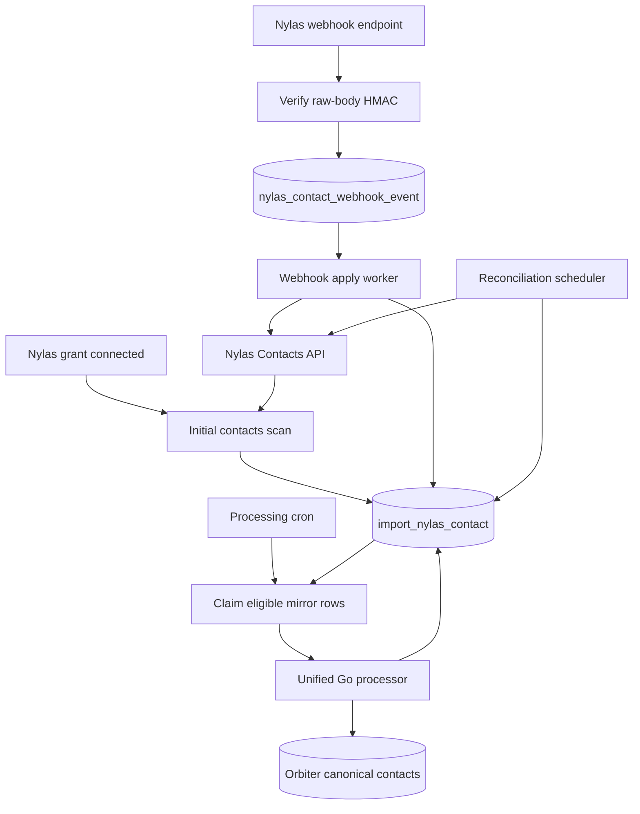

**Status: open work / build from scratch in Go.** This design creates a persistent PostgreSQL mirror of every user's Nylas address-book contacts. Initial pagination and later reconciliation populate the same table; Nylas notifications keep existing records current; a separate cron-driven Go worker processes new, changed, and deleted mirror rows into Orbiter.

<Note>
  This is a new Go implementation. It does not call or reuse the existing Xano Nylas contact-import function. Nylas remains the source of truth for the connected account; `import_nylas_contact` is Orbiter's durable, queryable source mirror and work queue.
</Note>

Official references:

- [Nylas Contacts API](https://developer.nylas.com/docs/reference/api/contacts/)
- [Return all contacts](https://developer.nylas.com/docs/reference/api/contacts/list-contact/)
- [Contact notification schemas](https://developer.nylas.com/docs/reference/notifications/contacts/)
- [Using webhooks with Nylas](https://developer.nylas.com/docs/v3/notifications/)

## Important Nylas v3 constraint

The current Contacts API documents two contact notification triggers:

- `contact.updated`
- `contact.deleted`

It does **not** promise a `contact.created` trigger. Do not make correctness depend on one. New provider contacts must be discovered by a periodic cursor-paginated reconciliation scan. The webhook path provides low-latency updates/deletes; reconciliation provides creation discovery and repairs missed, stale, or out-of-order notifications.

<Warning>
  Existing legacy code and older Nylas material may refer to `contact.created`. This Go design targets the current Nylas v3 contract and must subscribe only to triggers returned by the current application/API configuration.
</Warning>

## Architecture



There are two durable data concerns:

1. `import_nylas_contact` is the long-lived current-state mirror and Orbiter-processing queue.
2. `nylas_contact_webhook_event` is a short-retention inbox that makes at-least-once webhook delivery idempotent and allows the HTTP endpoint to acknowledge quickly.

The webhook inbox is not a second contact table. It stores delivery state; the mirror stores contact state.

## Mirror table

### `import_nylas_contact`

One row represents one Nylas contact within one user's grant. It remains after processing because future Nylas notifications update the same row.

#### Identity and source

| Field | PostgreSQL type | Required | Purpose |
| --- | --- | --- | --- |
| `id` | `bigint` identity | generated | Local primary key. |
| `created_at` | `timestamptz` | generated | First mirror insertion time. |
| `updated_at` | `timestamptz` | generated | Last local mirror change. |
| `user_id` | `bigint` | yes | Orbiter user who owns the Nylas grant and contact mirror. |
| `nylas_grant_id` | text | yes | Nylas grant that owns the contact. |
| `nylas_contact_id` | text | yes | Provider-backed contact ID returned by Nylas. Preserve exactly and URL-escape when used in paths. |
| `nylas_object` | text | yes | Nylas object label. Default `contact`. |
| `source` | text | yes | Nylas contact source, initially `address_book`. |
| `raw_contact` | `jsonb` | yes | Complete last authoritative Contact object returned by Nylas. |
| `payload_hash` | text | yes | SHA-256 of a deterministic typed projection used for no-op detection. |
| `nylas_updated_at` | `timestamptz` | no | Provider/Nylas update time when the response includes `updated_at`. |

#### Contact fields

| Field | PostgreSQL type | Required | Nylas field |
| --- | --- | --- | --- |
| `given_name` | text | no | `given_name` |
| `middle_name` | text | no | `middle_name` |
| `surname` | text | no | `surname` |
| `suffix` | text | no | `suffix` |
| `nickname` | text | no | `nickname` |
| `birthday_raw` | text | no | `birthday`; preserve before validation. |
| `company_name` | text | no | `company_name` |
| `job_title` | text | no | `job_title` |
| `manager_name` | text | no | `manager_name` |
| `office_location` | text | no | `office_location` |
| `notes` | text | no | `notes` |
| `emails` | `jsonb` | yes | Complete ordered `emails[]`. Default `[]`. |
| `phone_numbers` | `jsonb` | yes | Complete ordered `phone_numbers[]`. Default `[]`. |
| `physical_addresses` | `jsonb` | yes | Complete ordered `physical_addresses[]`. Default `[]`. |
| `im_addresses` | `jsonb` | yes | Complete ordered `im_addresses[]`. Default `[]`. |
| `web_pages` | `jsonb` | yes | Complete ordered `web_pages[]`. Default `[]`. |
| `groups` | `jsonb` | yes | Complete ordered `groups[]`. Default `[]`. |
| `picture_url` | text | no | Nylas `picture_url`; do not request base64 profile data during mirroring. |

Repeatable fields must retain the complete Nylas object rather than flattening values into numbered columns.

```json
{
  "emails": [
    {"email": "jane@example.com", "type": "work"}
  ],
  "phone_numbers": [
    {"number": "+14155550123", "type": "mobile"}
  ],
  "physical_addresses": [
    {
      "type": "work",
      "street_address": "123 Main Street",
      "city": "San Francisco",
      "state": "CA",
      "postal_code": "94107",
      "country": "US"
    }
  ]
}
```

#### Mirror lifecycle and reconciliation

| Field | PostgreSQL type | Required | Purpose |
| --- | --- | --- | --- |
| `mirror_status` | text | yes | `active` or `deleted`. Default `active`. |
| `mirror_revision` | `bigint` | yes | Increment on every material source change. Default `1`. |
| `last_seen_sync_id` | `uuid` | no | Reconciliation run that most recently observed the contact. |
| `last_seen_at` | `timestamptz` | no | Last successful API observation. |
| `last_webhook_id` | text | no | Most recent applied Nylas notification ID. |
| `last_webhook_at` | `timestamptz` | no | Nylas event time for the last applied notification. |
| `deleted_at` | `timestamptz` | no | Provider deletion/tombstone time. Never hard-delete on webhook receipt. |
| `delete_event_id` | text | no | Notification or reconciliation run responsible for the tombstone. |

#### Orbiter processing state

| Field | PostgreSQL type | Required | Purpose |
| --- | --- | --- | --- |
| `processed_by_orbiter` | boolean | yes | Whether Orbiter has successfully applied at least one revision. Default `false`. |
| `update_required` | boolean | yes | Whether the current revision differs from the last Orbiter-applied revision. Default `false`. |
| `processing_status` | text | yes | `pending`, `processing`, `processed`, or `failed`. Default `pending`. |
| `processing_attempts` | integer | yes | Claim count for retry/dead-letter decisions. Default `0`. |
| `processing_locked_at` | `timestamptz` | no | Start of the active worker lease. |
| `processing_locked_by` | text | no | Stable worker identifier holding the lease. |
| `next_attempt_at` | `timestamptz` | no | Earliest retry time after a transient failure. |
| `processing_error` | text | no | Bounded error code/detail without contact PII. |
| `processed_revision` | `bigint` | no | Last `mirror_revision` successfully applied to Orbiter. |
| `processed_payload_hash` | text | no | Last payload hash successfully applied to Orbiter. |
| `processed_at` | `timestamptz` | no | Most recent successful Orbiter application time. |
| `master_person_id` | `bigint` | no | Canonical Orbiter person matched or created by the processor. |

### Boolean semantics

The required booleans are intentionally simple selectors; `processing_status`, revisions, leases, and hashes make them safe under concurrency.

| `processed_by_orbiter` | `update_required` | Meaning |
| --- | --- | --- |
| `false` | `false` | Newly mirrored contact waiting for first processing. |
| `true` | `false` | Orbiter is current with the mirrored revision. |
| `true` | `true` | Previously processed contact changed or was deleted and needs reprocessing. |
| `false` | `true` | Contact changed again before its first successful processing; still eligible. |

On success, set `processed_by_orbiter = true` and `update_required = false` only if the row still has the revision the worker claimed.

## Constraints and indexes

```sql
ALTER TABLE import_nylas_contact
  ADD CONSTRAINT import_nylas_contact_identity_uq
  UNIQUE (user_id, nylas_grant_id, nylas_contact_id);

CREATE INDEX import_nylas_contact_work_idx
  ON import_nylas_contact (
    processing_status,
    next_attempt_at,
    updated_at,
    id
  )
  WHERE processed_by_orbiter = false OR update_required = true;

CREATE INDEX import_nylas_contact_reconcile_idx
  ON import_nylas_contact (
    nylas_grant_id,
    source,
    last_seen_sync_id
  );

CREATE INDEX import_nylas_contact_user_status_idx
  ON import_nylas_contact (user_id, mirror_status);
```

Do not add a general GIN index to `raw_contact` until a measured query requires one. Common lookups should use typed columns; raw JSON is fidelity and forward-compatibility storage.

## Initial import

The first successful grant connection should enqueue an initial address-book scan:

```http
GET /v3/grants/{grant_id}/contacts?source=address_book&limit={configured_limit}
```

The endpoint uses cursor pagination: send the response's `next_cursor` back as `page_token` until `next_cursor` is null.

<Note>
  Keep v1 scoped to `source=address_book`, which represents contacts explicitly stored in the user's account. Nylas also supports `domain` and `inbox`, but those sources have different scope requirements and product semantics and should not be silently mixed into this mirror.
</Note>

For every page:

1. Validate that the grant belongs to `user_id` and is active.
2. Decode the typed contact while also retaining the complete object as `raw_contact`.
3. Compute `payload_hash` from a deterministic typed representation, not arbitrary JSON key order.
4. Upsert on `(user_id, nylas_grant_id, nylas_contact_id)`.
5. For a new row, set `processed_by_orbiter = false`, `update_required = false`, `mirror_revision = 1`, and `processing_status = pending`.
6. For an existing changed row, increment `mirror_revision`, set `update_required = true`, reset `processing_status = pending`, and clear retry/lease state.
7. For an unchanged row, update only `last_seen_sync_id` and `last_seen_at`; do not create processing churn.
8. Commit in bounded page-sized or sub-page batches.

Only after every page succeeds may reconciliation tombstone previously active address-book rows that were not observed in the completed `sync_id`. A failed or partial scan must never infer deletions.

### Grant-level sync state

Keep these fields on the existing Nylas grant record or an equivalent grant-sync record:

| Field | Purpose |
| --- | --- |
| `contacts_sync_status` | `pending`, `running`, `completed`, or `failed`. |
| `contacts_sync_id` | UUID for the active/full scan. |
| `contacts_sync_cursor` | Last committed `next_cursor` for diagnostics/resume. |
| `contacts_sync_started_at` | Start time. |
| `contacts_sync_completed_at` | Successful EOF time. |
| `contacts_last_reconciled_at` | Most recent successful complete scan. |
| `contacts_next_reconcile_at` | Jittered next scan time. |
| `contacts_sync_error` | Bounded failure code/detail. |

If a saved cursor expires or becomes invalid, restart the full scan with a new `sync_id`. Never perform missing-row deletion from a resumed run unless the complete scan is known to be coherent.

## Webhook inbox

### `nylas_contact_webhook_event`

Nylas notifications use a CloudEvents envelope and at-least-once delivery. Deduplicate by the top-level notification `id`, which stays stable across delivery attempts.

| Field | PostgreSQL type | Required | Purpose |
| --- | --- | --- | --- |
| `id` | `bigint` identity | generated | Local primary key. |
| `nylas_notification_id` | text | yes | Top-level CloudEvent `id`; unique dedupe key. |
| `event_type` | text | yes | `contact.updated` or `contact.deleted`. |
| `event_source` | text | no | Top-level CloudEvent `source`. |
| `event_time` | `timestamptz` | yes | Converted top-level Unix `time`. |
| `delivery_attempt` | integer | no | Nylas `webhook_delivery_attempt`. |
| `application_id` | text | no | Nylas application identifier from `data`. |
| `nylas_grant_id` | text | yes | Grant extracted from `data.object`. |
| `nylas_contact_id` | text | yes | Contact identifier extracted from `data.object`. |
| `user_id` | `bigint` | no | Resolved owner; nullable only for unknown/orphan grants. |
| `signature_verified` | boolean | yes | Must be true before processing. |
| `body_sha256` | text | yes | Audit hash of exact received body bytes. |
| `payload` | `jsonb` | yes | Parsed notification after signature verification. |
| `status` | text | yes | `received`, `processing`, `processed`, `ignored`, or `failed`. |
| `attempts` | integer | yes | Inbox worker attempts. Default `0`. |
| `locked_at` | `timestamptz` | no | Inbox worker lease time. |
| `locked_by` | text | no | Inbox worker identifier. |
| `next_attempt_at` | `timestamptz` | no | Earliest retry. |
| `error` | text | no | Bounded processing error. |
| `created_at` | `timestamptz` | generated | Receipt time. |
| `processed_at` | `timestamptz` | no | Completion time. |

```sql
CREATE UNIQUE INDEX nylas_contact_webhook_event_notification_uq
  ON nylas_contact_webhook_event (nylas_notification_id);
```

Apply a short retention policy after events are processed; the mirror and its provenance fields are the durable contact record.

## Webhook HTTP behavior

The public Go endpoint has two paths:

### Endpoint verification

When Nylas supplies a `challenge` query parameter, return its exact value as the response body within the required timeout. Do not add JSON quoting or other content, and do not use chunked transfer encoding for the verification response.

### Notification receipt

1. Read the request body through a strict size limit and retain the exact bytes.
2. Verify `X-Nylas-Signature` as hex-encoded HMAC-SHA256 using the destination's webhook secret.
3. Use constant-time comparison.
4. Only after verification, decompress if compressed delivery is enabled and then parse JSON.
5. Validate the CloudEvents envelope and allowlist the two contact event types.
6. Insert the inbox row with `ON CONFLICT (nylas_notification_id) DO NOTHING`.
7. Return `200 OK` immediately after the durable insert; never call Nylas or Orbiter in the request path.

```go
func verifyNylasSignature(raw []byte, signature string, secret []byte) bool {
    supplied, err := hex.DecodeString(signature)
    if err != nil {
        return false
    }

    mac := hmac.New(sha256.New, secret)
    _, _ = mac.Write(raw)
    expected := mac.Sum(nil)

    return subtle.ConstantTimeCompare(supplied, expected) == 1
}
```

If compressed webhook delivery is enabled, verify the signature against the raw compressed body before decompression.

## Applying contact notifications

Treat a notification as an invalidation signal, then fetch the current authoritative object. This avoids trusting an incomplete payload and makes out-of-order delivery safer.

### `contact.updated`

1. Claim the inbox event idempotently.
2. Resolve `nylas_grant_id` to `user_id`; orphan grants are retained as `ignored` with an alertable reason.
3. URL-escape the contact ID and call `GET /v3/grants/{grant_id}/contacts/{contact_id}`.
4. On `200`, upsert the full current Contact object into `import_nylas_contact`.
5. If `payload_hash` changed, increment `mirror_revision`, set `mirror_status = active`, clear `deleted_at`, and set `update_required = true`.
6. If the payload is unchanged, update webhook provenance only.

### `contact.deleted`

Do not hard-delete the mirror row. Re-fetch the contact once:

- If Nylas returns `404`, set `mirror_status = deleted`, set `deleted_at`, increment `mirror_revision`, and set `update_required = true`.
- If Nylas returns the contact, the delete notification was stale or out of order; upsert the returned active state instead.
- If Nylas returns a transient error or rate limit, retry the inbox event without changing the mirror.

This preserves a tombstone so the unified Orbiter processor can retire Nylas-derived data. Deletion must never delete a canonical person or facts supported by another source.

## Reconciliation

Because the current v3 contract does not include `contact.created`, run a complete address-book reconciliation for every active grant.

Recommended starting policy:

- Run immediately after a new grant is ready.
- Reconcile active grants every 15–60 minutes with deterministic jitter; tune from API volume and freshness measurements.
- Do not schedule faster than the upstream provider/Nylas freshness can support. Nylas documents that Google contact changes can be observed on a roughly five-minute polling cycle rather than instant push.
- Run a slower daily audit even if webhook health appears perfect.
- Pause and surface reconnect state for expired or invalid grants.

Each full scan uses a new `sync_id`. Upserts mark `last_seen_sync_id`; only successful EOF allows missing active rows from that same grant and source to become tombstones.

## Processing cron

Run one Cloud Run job or service loop on a short cadence. Start every minute, claim a bounded batch, and loop until the batch is empty or the invocation time budget is nearly exhausted.

Eligible rows satisfy:

```sql
processed_by_orbiter = false OR update_required = true
```

Claim work with a lease and `FOR UPDATE SKIP LOCKED`:

```sql
WITH picked AS (
  SELECT id
  FROM import_nylas_contact
  WHERE (processed_by_orbiter = false OR update_required = true)
    AND (next_attempt_at IS NULL OR next_attempt_at <= now())
    AND (
      processing_status <> 'processing'
      OR processing_locked_at < now() - interval '10 minutes'
    )
  ORDER BY
    (mirror_status = 'deleted') DESC,
    COALESCE(nylas_updated_at, updated_at),
    id
  FOR UPDATE SKIP LOCKED
  LIMIT $1
)
UPDATE import_nylas_contact AS c
SET processing_status = 'processing',
    processing_attempts = processing_attempts + 1,
    processing_locked_at = now(),
    processing_locked_by = $2
FROM picked
WHERE c.id = picked.id
RETURNING c.*;
```

The cron and webhook workers may run concurrently. A webhook update resets the row to `pending`, increments `mirror_revision`, and preserves `update_required = true`.

## Unified Go processing function

Every eligible row uses one function; lifecycle state determines the operation.

```go
func (s *Service) ProcessMirrorRow(
    ctx context.Context,
    claimed MirrorContact,
) error {
    return s.db.WithTx(ctx, func(tx pgx.Tx) error {
        current, err := s.repo.GetForUpdate(ctx, tx, claimed.ID)
        if err != nil {
            return err
        }

        if current.MirrorRevision != claimed.MirrorRevision {
            return ErrSupersededRevision
        }

        switch current.MirrorStatus {
        case "active":
            if err := s.applyActiveContact(ctx, tx, current); err != nil {
                return err
            }
        case "deleted":
            if err := s.retireNylasSource(ctx, tx, current); err != nil {
                return err
            }
        default:
            return ErrUnknownMirrorStatus
        }

        return s.repo.CompleteRevision(ctx, tx, current.ID, current.MirrorRevision)
    })
}
```

`CompleteRevision` must use the revision guard:

```sql
UPDATE import_nylas_contact
SET processed_by_orbiter = true,
    update_required = false,
    processing_status = 'processed',
    processed_revision = mirror_revision,
    processed_payload_hash = payload_hash,
    processed_at = now(),
    processing_locked_at = NULL,
    processing_locked_by = NULL,
    processing_error = NULL
WHERE id = $1
  AND mirror_revision = $2;
```

If the guarded update affects zero rows, a newer mirror revision arrived. Do not mark the row complete; let the next claim process the new state.

### Active-row processing

The unified function should:

1. Normalize names, email addresses, phone numbers, URLs, and dates without overwriting the mirrored source value.
2. Match or create the canonical person using existing Orbiter identity rules.
3. Upsert Nylas-sourced email, phone, address, link, organization, and profile facts with source provenance.
4. Retire only earlier Nylas-sourced facts that are absent from the new revision and are not locked/user-authored.
5. Save `master_person_id` on the mirror row.

### Deleted-row processing

The function should retire the Nylas source link and Nylas-only facts for this contact. It must not delete the canonical `master_person` or facts supported by vCard, enrichment, manual edits, another grant, or another user.

## Go developer notes

### HTTP client

- Keep the Nylas API base URI configurable for the application's US/EU region.
- Pass `context.Context` through every API, database, and worker call.
- Configure connect, response-header, and total request timeouts.
- URL-escape `nylas_contact_id`; provider IDs can contain path-sensitive characters.
- Respect `Retry-After` for `429` responses and apply bounded exponential backoff with jitter for retryable provider failures.
- Never log the API key, full request/response body, contact PII, or grant credentials.
- Use bounded concurrency per grant and globally; do not create one goroutine per contact.

### Mirror writes

- Decode into a typed struct and retain `json.RawMessage`/the full object for `raw_contact`.
- Preserve unknown JSON fields through `raw_contact` so Nylas can add fields without data loss.
- Build `payload_hash` from the stable typed projection; exclude local timestamps, webhook IDs, and processing fields.
- Skip updates when the payload hash is unchanged.
- Use page-sized multi-row upserts or PostgreSQL bulk-copy into a temporary batch followed by one set-based upsert for large grants.
- Keep API pagination separate from Orbiter processing. The initial scan should mirror quickly and let the processing cron absorb downstream work with backpressure.

### Race safety

- Never hold a database transaction open during Nylas HTTP calls.
- Claim rows in a short transaction, do normalization outside the transaction, then lock and re-check `mirror_revision` immediately before canonical writes.
- Write canonical changes and the guarded mirror completion in the same transaction.
- Reclaim stale processing leases after a configured timeout.
- Increment attempts on claims, use `next_attempt_at` for retry backoff, and dead-letter after a bounded maximum.

### Images

The list response can contain `picture_url`. Mirror that URL only. Do not request `profile_picture=true` during the initial scan because that response can include base64 image data and would require one contact request at a time. If Orbiter later needs durable profile images, enqueue a separate bounded image pipeline and use the same private-GCS principles documented in [Apple vCard Import](/guides/open-work/apple-vcard-import).

### Suggested package boundaries

```text
internal/nylascontacts/
  client.go          # authenticated Nylas Contacts API client
  pager.go           # next_cursor/page_token pagination
  model.go           # typed API, mirror, and webhook models
  hash.go            # deterministic source projection hash
  initial_sync.go    # first address-book scan
  reconcile.go       # periodic complete scan and tombstones
  webhook_http.go    # challenge + raw signature verification + durable receipt
  webhook_worker.go  # contact.updated/deleted hydration and mirror upsert
  repository.go      # upserts, claims, leases, revisions, and completion
  processor.go       # unified active/deleted Orbiter function
```

## Operational behavior

| Condition | Required behavior |
| --- | --- |
| Nylas `429` | Respect `Retry-After`, reduce grant concurrency, and retry without flipping mirror state. |
| Nylas/provider `504` | Retry with jitter; preserve cursor and completed pages. |
| Grant expired | Pause import/reconciliation, retain mirror, and surface re-authentication. |
| Duplicate webhook | Unique notification insert is a no-op; return `200`. |
| Out-of-order webhook | Re-fetch current contact; API state wins over arrival order. |
| Webhook endpoint down | Reconciliation repairs missed updates/deletes/creates. |
| Partial initial scan | Keep rows already mirrored, but do not infer deletions. Resume or restart. |
| Contact deleted | Keep a tombstone and process source retirement. |
| Worker crash | Lease expires and another worker reclaims the row. |
| Webhook during processing | Revision changes; stale completion is rejected. |

## Testing

- Test pagination across zero, one, and many pages, including repeated/expired cursors and `next_cursor = null`.
- Test every documented contact field, null/missing fields, unknown JSON fields, empty arrays, and provider-specific type values.
- Test identical payload no-ops and material payload hash changes.
- Test a failed final page never causes missing-row tombstones.
- Test initial sync racing with `contact.updated` and `contact.deleted`.
- Test duplicate notification IDs, all delivery attempts, invalid hex signatures, wrong secrets, modified bodies, compressed bodies, and challenge responses.
- Test stale/out-of-order deletes by returning both `200` and `404` from the hydration request.
- Test concurrent cron claims with `FOR UPDATE SKIP LOCKED`, expired leases, retry backoff, and dead-letter transitions.
- Test the revision guard by delivering a webhook between claim and canonical commit.
- Test deletion removes only Nylas-derived provenance and never deletes a shared canonical person.
- Use synthetic contacts and secrets in fixtures; never commit production Nylas payloads.

## Recommended rollout

1. Create `import_nylas_contact`, its indexes, and grant sync-state fields.
2. Build initial `address_book` pagination and prove idempotent re-runs.
3. Build the unified active/deleted processor and processing cron.
4. Add the webhook inbox, signature verification, and `contact.updated`/`contact.deleted` workers.
5. Add periodic reconciliation before treating webhook sync as production-complete.
6. Add metrics, alerts, retention, and failure-replay tooling.

Success means any active Nylas grant can be scanned repeatedly without duplicate contacts, notification redelivery is harmless, creations appear through reconciliation, updates/deletes converge through either path, and every mirror revision is applied to Orbiter at most once logically—even when workers and webhooks race.
