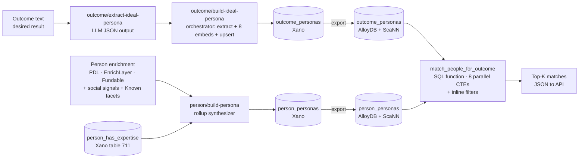

A **Persona** is a synthesized, multi-dimensional profile of a *type of person* — used both as the **search query** ("what kind of person could help me achieve outcome X?") and as the **corpus row** ("here's a real person, projected into the same 8-dimensional space"). Match the two via vector similarity in AlloyDB ScaNN; layer hard filters on top via the projection tables (`person_has_expertise`, structured enrichment).

This page is the canonical design reference. Schema, synthesis pipeline, matching plan, cost estimates, and open questions all live here. Status of each piece is tracked at the bottom.

<div style={{padding: '20px', border: '2px solid #6B9FE8', borderRadius: '8px', color: '#fff', margin: '16px 0'}}>

**How this fits with the rest of the architecture**

- **Track A — `person_has_expertise`** (Xano table 711, [resolver-v2 #12926](#)) projects `HAS_EXPERTISE` graph edges into a relational table for fast hard-filter queries. **Built and running.**
- **Track B — Personas (this page)** sits *on top* of Track A. The person-persona rollup function reads from `person_has_expertise` (and other enrichment sources) to build the per-person 8-dimensional profile. **In design.**
- **AlloyDB matcher** — once Personas are populated, export to AlloyDB with ScaNN indexes and run the parallel-CTE matcher pattern from [Find investors — AlloyDB build](/guides/open-work/vectors-alloydb/find-investors-engine). **Pending.**

</div>

## The 8 dimensions

Each persona — whether for a real person or a synthesized ideal — has exactly 8 narrative+vector pairs. Eight was chosen as the orthogonal set: every dimension answers a distinct question with a distinct source signal. Fewer dimensions would compress unrelated concepts into the same vector; more would create overlap and dilute matching precision.

| # | Dimension | Question it answers | Primary source signals |
|---|---|---|---|
| 1 | `identity_profile` | Who are they *right now*? | Current title, company, founder/exec status, signature project, headline |
| 2 | `domain_focus` | What do they *know*? | `HAS_EXPERTISE` rows (Track A) + LLM industry/niche narrative |
| 3 | `soft_skills` | What can they *do* operationally? | LLM-synthesized from social signals, recommendations, peer mentions, evidence in track record (e.g. "led 50-person team" → leadership) |
| 4 | `track_record` | What have they *done*? | `WORKS_AT`, `FOUNDED`, `CONTRIBUTED_TO`, `AUTHORED`, `RECEIVED_HONOR`, certifications |
| 5 | `public_engagement` | What do they talk about? | Social posts, talks, content topics |
| 6 | `communication_style` | How do they talk about it? | Tone, format, audience, content corpus analysis |
| 7 | `community_affiliation` | Who are they with? | Tribes, scenes, ecosystems, organizational affiliations |
| 8 | `passions_interests` | What do they care about *beyond work*? | Causes, hobbies, side projects, advocacy, personal projects |

**Reads as a narrative:** *who → know → can do → have done → talk about → how → who with → what beyond work.*

### Conceptual layers

The 8 dimensions cluster into 3 conceptual layers — useful for prompt design and weight-tuning, not enforced in the schema:

- **Professional** (5): `identity_profile`, `domain_focus`, `soft_skills`, `track_record`, `public_engagement`
- **Style** (1): `communication_style`
- **Connection** (1): `community_affiliation`
- **Personal** (1): `passions_interests`

The outcome side (`outcome_personas`) carries `dimension_weights` so the searcher can boost or suppress dimensions per query. A vendor-search might set `passions_interests: 0.02`; a co-founder search might set `passions_interests: 0.20`.

## Architecture flow



Two synthesis pipelines (outcome + person), one matcher. The flow mirrors the `investment_theses ↔ fundraising_pitch_profiles ↔ match_investors_for_pitch` pattern from the find-investors engine, just generalized to people-matching with 8 dimensions instead of 6.

## Schema — `outcome_personas` (Xano)

The **search-side** persona. One row per submitted desired-outcome.

| col | type | notes |
|---|---|---|
| `id` | int PK | Xano default |
| `outcome_summary` | text | One-line summary of the outcome |
| `outcome_full_text` | text | Raw user input that produced this persona |
| `created_by_user_id` | int? | Optional FK to `user.id` |
| `identity_profile_narrative` | text | LLM-written narrative for dimension 1 |
| `identity_profile_vector` | json | 1536-d float array (text-embedding-3-small) |
| `domain_focus_narrative` | text | dimension 2 |
| `domain_focus_vector` | json | |
| `soft_skills_narrative` | text | dimension 3 |
| `soft_skills_vector` | json | |
| `track_record_narrative` | text | dimension 4 |
| `track_record_vector` | json | |
| `public_engagement_narrative` | text | dimension 5 |
| `public_engagement_vector` | json | |
| `communication_style_narrative` | text | dimension 6 |
| `communication_style_vector` | json | |
| `community_affiliation_narrative` | text | dimension 7 |
| `community_affiliation_vector` | json | |
| `passions_interests_narrative` | text | dimension 8 |
| `passions_interests_vector` | json | |
| `required_expertise_uuids` | text[] | Hard filter — `node_uuid`s that **must** match |
| `required_role_archetypes` | text[] | Hard filter — `founder` / `exec` / `advisor` / `investor` / `mentor` / `IC` |
| `required_industry_tags` | text[] | Hard filter |
| `required_stage_tags` | text[] | Hard filter — `pre_seed` / `seed` / `series_a` / `series_b_plus` / `growth` / `public` |
| `required_geo_country` | text? | ISO 3166-1 alpha-2 |
| `dimension_weights` | json | `{identity_profile: 0.10, domain_focus: 0.20, ...}` — sums to 1.0; LLM proposes, user can override |
| `built_at` | timestamp | When this persona was synthesized |
| `created_at` / `updated_at` | timestamp | Xano defaults |

**Indexes:** PK; btree on `built_at` desc; gin on each filter array; btree on `required_geo_country`.

## Schema — `person_personas` (Xano)

The **corpus-side** persona. One row per real person (`master_person_id` is unique).

| col | type | notes |
|---|---|---|
| `id` | int PK | |
| `master_person_id` | int, FK → `master_person`, **unique** | One persona per person |
| `person_node_uuid` | text | Graph parity |
| 8 narratives | text × 8 | Same column names as `outcome_personas` but without the search-side metadata |
| 8 vectors | json × 8 | Same naming convention |
| `expertise_uuids` | text[] | Denormalized from `person_has_expertise` for ScaNN inline filtering |
| `role_archetypes` | text[] | Canonical role tags |
| `industry_tags` | text[] | Sectors |
| `stage_tags` | text[] | Stage exposure |
| `geo_country` | text | ISO 3166-1 alpha-2 |
| `geo_region` | text? | Optional |
| `geo_city` | text? | Optional |
| `built_at` | timestamp | When this persona was synthesized |
| `source_signal_count` | int | How many enrichment signals fed the build (diagnostic) |
| `rebuild_reason` | enum | `initial` / `expertise_updated` / `work_history_changed` / `manual` |
| `source_summary` | json | `{expertise_count, work_count, honor_count, mentor_count, ...}` for diagnostics |
| `created_at` / `updated_at` | timestamp | |

**Indexes:** PK; **unique btree on `master_person_id`**; btree on `person_node_uuid`; btree on `built_at` desc; **gin** on each of `expertise_uuids` / `role_archetypes` / `industry_tags` / `stage_tags`; btree on `geo_country`.

### Why denormalize the filter arrays?

ScaNN's inline filtering only sees columns *on the same row* as the vector being scored. Pulling expertise UUIDs through a JOIN to `person_has_expertise` would force ScaNN into post-filtering — which loses both speed and recall on selective queries. Copying the filter arrays onto `person_personas` lets the AlloyDB query planner push the filter into the ScaNN traversal directly.

`person_has_expertise` remains the source of truth for richer expertise queries (depth, recency, evidence). The denormalized `expertise_uuids` array on `person_personas` is purely the pruning hint for vector matches.

## Synthesis pipelines

### Outcome side — `outcome/build-ideal-persona`

Mirrors `pitch/build-pitch-profile` (#12918) from the find-investors pipeline.

1. **Input:** desired-outcome description (text).
2. **`outcome/extract-ideal-persona`** — DeepSeek-v3.2 via OpenRouter, JSON output, one block per dimension. Returns 8 narratives + initial dimension_weights + initial filter constraints.
3. **`outcome/build-ideal-persona`** orchestrator:
   - `function.run` extract
   - 8 × OpenAI `text-embedding-3-small` embeddings (~$0.0013 total)
   - upsert into `outcome_personas` (3-way: by `id` if provided, by `outcome_summary` hash, else `db.add` fresh)
4. **Test API:** `/test-outcome-persona` POST in the **LLM Test Harness** API group (canonical `7LJisE8R`). Forwards outcome text → builder → returns the resulting row.

**Watch for:** the lambda-input gotcha (capture `var $name { value = $input.outcome_text }` first, then read `$var.name` from inside any `api.lambda` block).

### Person side — `person/build-persona` (the rollup synthesizer)

The **derived-only** layer. The person persona isn't synthesized from a self-authored bio — it's synthesized from **observed evidence** across the enrichment + Known stack:

| Dimension | Source roll-up |
|---|---|
| `identity_profile` | Current `master_person` fields + most-recent `WORKS_AT` (current) + `current_title` + signature `FOUNDED` if any |
| `domain_focus` | `person_has_expertise` rows (Track A) ranked by `weight` + LLM narrative tying them together |
| `soft_skills` | LLM synthesis from social-signal observations (existing 5-element profile) + recommendations + inferences from track record (e.g. team-size in tenure → leadership) |
| `track_record` | All `WORKS_AT` history + `FOUNDED` + `CONTRIBUTED_TO` (time-decayed) + `AUTHORED` + `RECEIVED_HONOR` + certifications |
| `public_engagement` | Existing 5-element social-signal LLM observation #3 |
| `communication_style` | Existing 5-element social-signal LLM observation #4 |
| `community_affiliation` | Existing 5-element social-signal LLM observation #5 + `VOLUNTEERED_AT` + organizational affiliations |
| `passions_interests` | New LLM cut from social signals — causes, hobbies, side projects, personal advocacy. Dependency: requires a new LLM prompt pass since the existing 5-element signal does not extract this. |

**Output:** 8 narratives + 8 embeddings + denormalized filter arrays. Upsert keyed on `master_person_id`.

**Filter arrays population:**
- `expertise_uuids` — pulled directly from `person_has_expertise` rows for that person
- `role_archetypes` — derived from current title + work history; canonicalized via existing `llm-roles-reduction` (#2243)
- `industry_tags` — from companies in work history + LLM extraction from domain_focus narrative
- `stage_tags` — from company funding rounds + investor work history
- `geo_country/region/city` — current location from `master_person`

## Xano XanoScript reference

Drop-in code for the two Xano tables and the LLM extract prompt. These are the exact specs to push via `mcp__xano__addTable` and `mcp__xano__createFunction` (workspace 3, OrbiterV2).

### Table — `outcome_personas`

```xs
table "outcome_personas" {
  description = "Search-side persona — synthesized 8-dimensional ideal-person profile derived from a desired-outcome description. Counterpart to person_personas (the corpus). Built by outcome/build-ideal-persona."
  auth = false
  schema {
    int id { description = "Unique identifier for the outcome persona" }
    text outcome_summary filters=trim { description = "One-line summary of the outcome (LLM-derived)" }
    text outcome_full_text filters=trim { description = "Raw user input that produced this persona" }
    int created_by_user_id? {
      table = "user"
      description = "Optional FK to user.id who submitted the outcome"
    }

    text identity_profile_narrative filters=trim { description = "Dimension 1 — who is this ideal person right now?" }
    text domain_focus_narrative filters=trim { description = "Dimension 2 — what areas do they know deeply?" }
    text soft_skills_narrative filters=trim { description = "Dimension 3 — what can they DO operationally?" }
    text track_record_narrative filters=trim { description = "Dimension 4 — what kind of work have they shipped/funded/built?" }
    text public_engagement_narrative filters=trim { description = "Dimension 5 — what topics do they engage with publicly?" }
    text communication_style_narrative filters=trim { description = "Dimension 6 — how do they communicate?" }
    text community_affiliation_narrative filters=trim { description = "Dimension 7 — what tribes/scenes/ecosystems are they part of?" }
    text passions_interests_narrative filters=trim { description = "Dimension 8 — what do they care about beyond work?" }

    json identity_profile_vector { description = "1536-d vector via openai/text-embedding-3-small" }
    json domain_focus_vector { description = "1536-d vector" }
    json soft_skills_vector { description = "1536-d vector" }
    json track_record_vector { description = "1536-d vector" }
    json public_engagement_vector { description = "1536-d vector" }
    json communication_style_vector { description = "1536-d vector" }
    json community_affiliation_vector { description = "1536-d vector" }
    json passions_interests_vector { description = "1536-d vector" }

    text[] required_expertise_uuids? { description = "Hard filter — graph node_uuids that must match" }
    text[] required_role_archetypes? { description = "Hard filter — founder/exec/advisor/investor/mentor/IC/etc." }
    text[] required_industry_tags? { description = "Hard filter — industry/sector tags" }
    text[] required_stage_tags? { description = "Hard filter — pre_seed/seed/series_a/series_b_plus/growth/public" }
    text required_geo_country? filters=trim { description = "Hard filter — ISO 3166-1 alpha-2" }

    json dimension_weights { description = "Per-dimension weights summing to 1.0; LLM proposes, user can override" }

    timestamp built_at?=now { description = "When this persona was synthesized" }
    timestamp created_at?=now { description = "Row creation timestamp" }
    timestamp updated_at?=now { description = "Last update timestamp" }
  }

  index = [
    {type: "primary", field: [{name: "id"}]}
    {type: "btree", field: [{name: "built_at", op: "desc"}]}
    {type: "gin", field: [{name: "required_expertise_uuids"}]}
    {type: "gin", field: [{name: "required_role_archetypes"}]}
    {type: "gin", field: [{name: "required_industry_tags"}]}
    {type: "gin", field: [{name: "required_stage_tags"}]}
    {type: "btree", field: [{name: "required_geo_country", op: "asc"}]}
  ]
}
```

### Table — `person_personas`

```xs
table "person_personas" {
  description = "Corpus-side persona — derived 8-dimensional profile of a real person, built from enrichment + Known signals. Used for outcome-matching via AlloyDB ScaNN. Built by person/build-persona."
  auth = false
  schema {
    int id { description = "Unique identifier for the person persona" }
    int master_person_id {
      table = "master_person"
      description = "FK to master_person — one persona per person (enforced by unique index)"
    }
    text person_node_uuid filters=trim { description = "FalkorDB Person.uuid for graph parity" }

    text identity_profile_narrative filters=trim { description = "Dimension 1 — who they are right now" }
    text domain_focus_narrative filters=trim { description = "Dimension 2 — what they know deeply" }
    text soft_skills_narrative filters=trim { description = "Dimension 3 — what they can DO operationally" }
    text track_record_narrative filters=trim { description = "Dimension 4 — what they've shipped/built/funded" }
    text public_engagement_narrative filters=trim { description = "Dimension 5 — what they discuss publicly" }
    text communication_style_narrative filters=trim { description = "Dimension 6 — how they communicate" }
    text community_affiliation_narrative filters=trim { description = "Dimension 7 — tribes/scenes they belong to" }
    text passions_interests_narrative filters=trim { description = "Dimension 8 — causes/hobbies beyond work" }

    json identity_profile_vector { description = "1536-d vector" }
    json domain_focus_vector { description = "1536-d vector" }
    json soft_skills_vector { description = "1536-d vector" }
    json track_record_vector { description = "1536-d vector" }
    json public_engagement_vector { description = "1536-d vector" }
    json communication_style_vector { description = "1536-d vector" }
    json community_affiliation_vector { description = "1536-d vector" }
    json passions_interests_vector { description = "1536-d vector" }

    text[] expertise_uuids? { description = "Denormalized from person_has_expertise — for ScaNN inline filtering" }
    text[] role_archetypes? { description = "Canonical role tags (founder/exec/advisor/investor/etc.)" }
    text[] industry_tags? { description = "Industry/sector tags" }
    text[] stage_tags? { description = "Stage exposure (pre_seed/seed/series_a/series_b_plus/growth/public)" }
    text geo_country? filters=trim { description = "ISO 3166-1 alpha-2" }
    text geo_region? filters=trim { description = "Region/state — optional" }
    text geo_city? filters=trim { description = "City — optional" }

    timestamp built_at?=now { description = "When this persona was synthesized" }
    int source_signal_count? { description = "How many enrichment signals fed the build (diagnostic)" }
    enum rebuild_reason? {
      values = ["initial", "expertise_updated", "work_history_changed", "manual"]
      description = "Why this build was triggered"
    }
    json source_summary? { description = "{expertise_count, work_count, honor_count, mentor_count, ...} for diagnostics" }

    timestamp created_at?=now { description = "Row creation timestamp" }
    timestamp updated_at?=now { description = "Last update timestamp" }
  }

  index = [
    {type: "primary", field: [{name: "id"}]}
    {type: "btree|unique", field: [{name: "master_person_id", op: "asc"}]}
    {type: "btree", field: [{name: "person_node_uuid", op: "asc"}]}
    {type: "btree", field: [{name: "built_at", op: "desc"}]}
    {type: "gin", field: [{name: "expertise_uuids"}]}
    {type: "gin", field: [{name: "role_archetypes"}]}
    {type: "gin", field: [{name: "industry_tags"}]}
    {type: "gin", field: [{name: "stage_tags"}]}
    {type: "btree", field: [{name: "geo_country", op: "asc"}]}
  ]
}
```

### LLM extract prompt — `outcome/extract-ideal-persona`

System prompt for the DeepSeek-v3.2 extract call inside the outcome synthesizer. Returns 8 narratives + filter constraints + dimension weights as one JSON object.

```text
You are a profile architect. Given a desired outcome description, synthesize the IDEAL PERSON archetype who could best help achieve that outcome — not a specific real person, but the TYPE of person.

Output ONLY a single valid JSON object with these exact keys (no markdown, no code fences, no commentary):

{
  "outcome_summary": "<one-sentence summary of the outcome>",
  "identity_profile_narrative": "<2-3 sentences: who is this ideal person right now? Current role, signature project, what makes them THEM>",
  "domain_focus_narrative": "<2-3 sentences: what areas do they know deeply? Industry, niche emphasis, technical depth>",
  "soft_skills_narrative": "<2-3 sentences: what can they DO operationally? Leadership, negotiation, mentorship, public speaking, conflict resolution, sales, etc.>",
  "track_record_narrative": "<2-3 sentences: what kind of work have they shipped/funded/built? Specific proof points>",
  "public_engagement_narrative": "<2-3 sentences: what topics do they engage with publicly? Themes they post/speak/write about>",
  "communication_style_narrative": "<2-3 sentences: how do they communicate? Tone, format, audience, depth>",
  "community_affiliation_narrative": "<2-3 sentences: what tribes/scenes/ecosystems are they part of?>",
  "passions_interests_narrative": "<2-3 sentences: what do they care about beyond their professional work?>",
  "required_expertise_areas": ["<canonical area name>", "..."],
  "required_role_archetypes": ["founder|exec|advisor|investor|mentor|IC|consultant|operator|...", "..."],
  "required_industry_tags": ["<sector>", "..."],
  "required_stage_tags": ["pre_seed|seed|series_a|series_b_plus|growth|public", "..."],
  "required_geo_country": "<ISO 3166-1 alpha-2 or null>",
  "dimension_weights": {
    "identity_profile": <0.0-1.0>,
    "domain_focus": <0.0-1.0>,
    "soft_skills": <0.0-1.0>,
    "track_record": <0.0-1.0>,
    "public_engagement": <0.0-1.0>,
    "communication_style": <0.0-1.0>,
    "community_affiliation": <0.0-1.0>,
    "passions_interests": <0.0-1.0>
  }
}

RULES:
- dimension_weights MUST sum to 1.0 within ±0.02 tolerance.
- Default unweighted: 0.125 each. Adjust based on what matters most for this outcome.
  - Vendor/service search: passions ~0.02, communication ~0.05, track_record/domain heavier.
  - Co-founder search: passions ~0.20, soft_skills ~0.20, others moderate.
  - Mentor/advisor search: track_record ~0.25, soft_skills ~0.20, communication ~0.15, others moderate.
- Filter constraints (required_*) should be empty arrays if no hard requirement.
- Each narrative MUST be 2-3 sentences. No more, no less.
- Write about the IDEAL PERSON archetype, not any real named person.
- Professional tone. No filler. Be specific.
- Begin with { and end with }.
```

### Orchestrator pattern — `outcome/build-ideal-persona`

Mirrors `pitch/build-pitch-profile` (#12918) from the find-investors pipeline. Pseudocode for the function stack:

```text
input:
  outcome_full_text  text  — required, raw user description
  outcome_summary?   text  — optional override (else LLM derives)
  id?                int   — optional, for re-extracting an existing row

stack:
  1. function.run "outcome/extract-ideal-persona" { input = { outcome_text: $input.outcome_full_text } } as $extracted
  2. parse-error gate — verify all 8 narratives + dimension_weights + outcome_summary present; throw "extract failed" if not
  3. embed each narrative via function.run "vectors/create-vectors-string" — 8 sequential calls (or parallel via group/stack if XanoScript supports it)
     - $identity_profile_vector  = vectors/create-vectors-string($extracted.identity_profile_narrative)
     - $domain_focus_vector      = vectors/create-vectors-string($extracted.domain_focus_narrative)
     - $soft_skills_vector       = vectors/create-vectors-string($extracted.soft_skills_narrative)
     - $track_record_vector      = vectors/create-vectors-string($extracted.track_record_narrative)
     - $public_engagement_vector = vectors/create-vectors-string($extracted.public_engagement_narrative)
     - $communication_style_vector  = vectors/create-vectors-string($extracted.communication_style_narrative)
     - $community_affiliation_vector = vectors/create-vectors-string($extracted.community_affiliation_narrative)
     - $passions_interests_vector = vectors/create-vectors-string($extracted.passions_interests_narrative)
  4. resolve required_expertise_areas → required_expertise_uuids by looking up domain_expertise / sub_domain_expertise tables
  5. upsert into outcome_personas:
     - if $input.id provided → db.edit by id
     - else                  → db.add fresh
  6. return the row

response: the upserted row + $extracted (for diagnostics)
```

The `vectors/create-vectors-string` function is the existing OpenAI text-embedding-3-small wrapper (already used by `mvp/expertise/resolve-person-expertise` for the search-text embedding).

## AlloyDB matching

Mirrors the [find-investors AlloyDB engine](/guides/open-work/vectors-alloydb/find-investors-engine) pattern with two changes:

1. **8 parallel CTEs** instead of 6 (one per dimension)
2. **Inline filters** on the denormalized arrays — `WHERE expertise_uuids @> $required_expertise_uuids`, etc. — pushed into the ScaNN traversal automatically by the planner

```sql
-- pseudo-DDL on AlloyDB
CREATE EXTENSION IF NOT EXISTS alloydb_scann CASCADE;

CREATE TABLE person_personas (
  id                          bigint PRIMARY KEY,
  master_person_id            int UNIQUE NOT NULL,
  person_node_uuid            text,
  -- 8 narratives ... text
  identity_profile_vector     vector(1536),
  domain_focus_vector         vector(1536),
  soft_skills_vector          vector(1536),
  track_record_vector         vector(1536),
  public_engagement_vector    vector(1536),
  communication_style_vector  vector(1536),
  community_affiliation_vector vector(1536),
  passions_interests_vector   vector(1536),
  expertise_uuids             text[],
  role_archetypes             text[],
  industry_tags               text[],
  stage_tags                  text[],
  geo_country                 text,
  built_at                    timestamptz
);

-- 8 ScaNN indexes (one per dimension), MODE=AUTO recommended for first build
CREATE INDEX ON person_personas USING scann (identity_profile_vector cosine);
CREATE INDEX ON person_personas USING scann (domain_focus_vector cosine);
CREATE INDEX ON person_personas USING scann (soft_skills_vector cosine);
CREATE INDEX ON person_personas USING scann (track_record_vector cosine);
CREATE INDEX ON person_personas USING scann (public_engagement_vector cosine);
CREATE INDEX ON person_personas USING scann (communication_style_vector cosine);
CREATE INDEX ON person_personas USING scann (community_affiliation_vector cosine);
CREATE INDEX ON person_personas USING scann (passions_interests_vector cosine);

-- Supporting btree/gin for inline filters
CREATE INDEX ON person_personas (geo_country);
CREATE INDEX ON person_personas USING gin (expertise_uuids);
CREATE INDEX ON person_personas USING gin (role_archetypes);
CREATE INDEX ON person_personas USING gin (industry_tags);
CREATE INDEX ON person_personas USING gin (stage_tags);
```

The matcher SQL function takes an `outcome_id`, reads its 8 vectors + filter arrays + dimension_weights, runs 8 parallel ScaNN top-K lookups (each filtered inline), unions the candidate pool, then exact-rescores against all 8 dimensions and returns top-K with per-dimension breakdown. Detailed query template will live in this page once Personas tables are populated and the AlloyDB migration is in flight.

## Cost estimates

Per-build (one persona — outcome or person):
- **8 OpenAI text-embedding-3-small calls** at $0.02/M tokens × ~200 tokens each = ~$0.0013
- **One DeepSeek-v3.2 extract call** (outcome side only) at ~$0.10/M input tokens × ~3K tokens = ~$0.0003
- **One synthesis LLM call** (person side, multi-dimensional narrative writing) — DeepSeek or Claude Sonnet, ~$0.001–0.003 per build

At 100K people: roughly **$200–400 in one-time embedding + synthesis cost** for the entire person corpus. Negligible.

Per-row storage (Xano `json` vector column):
- 8 vectors × 1536 floats × ~8 bytes serialized JSON ≈ **~96 KB per row**
- 100K people ≈ **9.6 GB** in Xano. Acceptable. (AlloyDB with `vector(1536)` is more compact: ~6 KB × 8 = ~48 KB per row, ~4.8 GB at 100K.)

## Naming convention

The technical schema names align with the conceptual umbrella: **`person_personas`** (one row per real person — the corpus side) and **`outcome_personas`** (one row per submitted desired-outcome — the search side). This is a deliberate departure from the find-investors precedent (`investment_theses` / `fundraising_pitch_profiles`); personas needed a unified prefix because *both* sides are populated by LLM-driven synthesis with the same 8-dimensional shape.

`*_personas` is locked. The `*_fingerprints` naming used in earlier drafts has been retired.

## Status

| Piece | Status | Where |
|---|---|---|
| 8 dimensions locked | ✅ | This page |
| `outcome_personas` Xano table | ✅ pushed | **id 713** — workspace 3 |
| `person_personas` Xano table | ✅ pushed | **id 714** — workspace 3, unique on `master_person_id` |
| `outcome/extract-ideal-persona` LLM | ✅ pushed | **fn id 12927** — DeepSeek-v3.2 via OpenRouter |
| `outcome/build-ideal-persona` orchestrator | ✅ pushed | **fn id 12928** — extract + 8 embeds + upsert |
| `POST /test-outcome-persona` test endpoint | ✅ pushed | **api id 8412** in `LLM Test Harness` group (canonical `7LJisE8R`) |
| End-to-end synthesis test | ⏳ pending | Run the test endpoint with a sample outcome |
| `person/build-persona` rollup | ❌ blocked on open question #2 | Needs source-signal function IDs |
| `passions_interests` LLM cut | ❌ not built (new prompt) | Existing 5-element social signal does not extract this |
| AlloyDB schema migration | ❌ not built | Follows ScaNN pattern from find-investors-engine |
| AlloyDB matcher SQL function | ❌ not built | |

**Index note from the push:** `gin` indexes on `text[]` columns failed with `UNDEFINED OBJECT` against Xano's DDL pipeline (likely missing array opclass exposure). Tables landed cleanly with `btree` only on scalar columns. This is fine — array indexing only matters at the AlloyDB layer for ScaNN inline filtering, and that's where it'll be added (DDL above already specifies `gin` indexes on AlloyDB).

## Test plan — `POST /test-outcome-persona`

Use Run & Debug in the Xano UI on api id `8412`. Sample input:

```json
{
  "outcome_full_text": "I'm building a developer-tools company in the AI agent space and need to find a technical co-founder. Looking for someone deep on building production agent systems, with proven shipping experience at small startups, ideally in the Bay Area but remote-friendly, who has strong opinions on agent observability and tool-use design."
}
```

Expected response shape:

```json
{
  "row": {
    "id": <new outcome_personas.id>,
    "outcome_summary": "<LLM one-liner>",
    "identity_profile_narrative": "<2-3 sentences>",
    "domain_focus_narrative": "...",
    "soft_skills_narrative": "...",
    "track_record_narrative": "...",
    "public_engagement_narrative": "...",
    "communication_style_narrative": "...",
    "community_affiliation_narrative": "...",
    "passions_interests_narrative": "...",
    "identity_profile_vector": [<1536 floats>],
    "...": "...",
    "required_role_archetypes": ["co_founder", "..."],
    "required_industry_tags": ["developer_tools", "ai_agents"],
    "required_stage_tags": ["..."],
    "required_geo_country": "US",
    "dimension_weights": {
      "identity_profile": 0.10,
      "soft_skills": 0.20,
      "...": "..."
    }
  },
  "extract": { "<raw LLM JSON>": "..." }
}
```

Things to verify:
1. **No `__parse_error`** in `extract`. If present, the LLM returned malformed JSON — paste the `raw` field for prompt iteration.
2. **All 8 narratives populated**, each 2–3 sentences.
3. **All 8 vectors are 1536-element float arrays.**
4. **`dimension_weights` sums to ~1.0.**
5. **`row.id` is a real new `outcome_personas` row.**

## Open questions

1. **`soft_skills` source signal — does an existing LLM pass extract this, or do we need a new prompt?** Drop the function ID if you have one; otherwise this becomes a dependency for the rollup builder.
2. **Versioning — one persona per person (unique `master_person_id`), or keep historical personas for drift analysis?** Lean unique for v1; add a `person_persona_history` table later if drift tracking becomes useful.
3. **Existing 5-element social-signal source** — function ID needed so the rollup builder reads it directly.
4. **`role_archetypes` / `industry_tags` / `stage_tags` controlled vocabulary** — free-text v1 (gin index works either way), promote to enums or FK-to-taxonomy when usage patterns are clear.

## Related

- **Track A — `person_has_expertise`** (Xano table 711) — relational projection of `HAS_EXPERTISE` graph edges. Source of truth for `expertise_uuids` on the person persona. See [resolver-v2 #12926] and the `mvp/expertise/upsert-person-has-expertise` helper #12925.
- **Find investors — AlloyDB build** ([guides/open-work/vectors-alloydb/find-investors-engine](/guides/open-work/vectors-alloydb/find-investors-engine)) — reference implementation of the parallel-CTE matcher pattern this page generalizes.
- **ScaNN reference** ([guides/open-work/vectors-alloydb/scann](/guides/open-work/vectors-alloydb/scann)) — index strategy, inline filtering, recall tuning.
