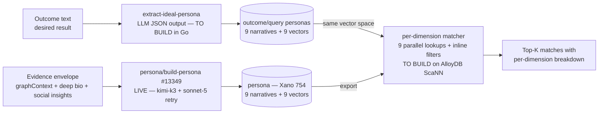

A **Persona** is a synthesized, multi-dimensional profile of a person — used both as the **corpus row** ("here is a real person, projected into nine narrative \+ vector dimensions") and as the **search query** ("here is the _ideal_ person for this outcome, projected into the same nine dimensions"). Matching runs **dimension-by-dimension** — a query's `domain_focus` vector is scored only against candidates' `domain_focus` vectors, never flat across the whole profile — with hard filters layered on top.

<Note>
  **Dimension 9 locked (2026-08-15).** `current_needs` — introduced as experimental in the build workshop — is now part of the canonical set. This page describes all nine. The live builder is `persona/build-persona` (#13349, v0.6): kimi-k3 primary with Claude Sonnet 5 retry, hard eligibility gate (deep bio AND social insights required), persisting to the `persona` table (754). The full working prompt, table specs, model bake-off, and production-trigger design live on [**Persona Build Design**](/guides/open-work/personas/persona-build-design) — that page plus this one are what a Go developer needs.
</Note>

## The 9 dimensions

Each persona — whether for a real person or a synthesized ideal — has exactly 9 narrative \+ vector pairs. Nine is the orthogonal set: every dimension answers a distinct question from a distinct source signal. Fewer would compress unrelated concepts into one vector; more would overlap and dilute matching precision. The ninth, `current_needs`, is the only **strictly time-anchored** dimension — present-tense goals from dated recent evidence (roughly the last twelve months), with a hard evidence floor: no dated recent activity, no narrative.

| # | Dimension | Question it answers | Primary source signals |
| --- | --- | --- | --- |
| 1 | `identity_profile` | Who are they _right now_? | Current title, company, founder/exec status, signature project, headline |
| 2 | `domain_focus` | What do they _know_? | `HAS_EXPERTISE` edges \+ industry/niche narrative |
| 3 | `soft_skills` | What can they _do_ operationally? | Peer mentions, collaboration patterns, evidence in track record (e.g. "led 50-person team" → leadership) |
| 4 | `track_record` | What have they _done_? | `WORKS_AT`, `FOUNDED`, `CONTRIBUTED_TO`, `AUTHORED`, `RECEIVED_HONOR`, certifications |
| 5 | `public_engagement` | What do they talk about? | Social posts, talks, content topics |
| 6 | `communication_style` | How do they talk about it? | Tone, format, audience — **hard floor: first-party words required** (their own posts, quotes, talks) |
| 7 | `community_affiliation` | Who are they with? | Tribes, scenes, ecosystems, organizational affiliations, named relationships |
| 8 | `passions_interests` | What do they care about _beyond work_? | Causes, hobbies, side projects, advocacy, personal content |
| 9 | `current_needs` | What are they focused on and seeking _right now_? | Recent posts, stated asks, current-role initiatives, funding activity, hiring signals, career transitions — **hard floor: dated recent activity required** |

**Reads as a narrative:** _who → know → can do → have done → talk about → how → who with → what beyond work → what now._

### Conceptual layers

The 9 dimensions cluster into conceptual layers — useful for prompt design and weight-tuning, not enforced in the schema:

- **Professional** (5): `identity_profile`, `domain_focus`, `soft_skills`, `track_record`, `public_engagement`
- **Style** (1): `communication_style`
- **Connection** (1): `community_affiliation`
- **Personal** (1): `passions_interests`
- **Temporal** (1): `current_needs`

Scoring roles per dimension (driver / valence / modifier / structural) and the aggregation math live in [Suggestion Recipes — loop\_generic](/guides/open-work/suggestion-recipes/loop-generic): with nine dimensions the drivers are `domain_focus`, `public_engagement`, `passions_interests`, and `current_needs`. The search side carries `dimension_weights` so a query can boost or suppress dimensions — a vendor search might weight `passions_interests` at 0.02, a co-founder search at 0.20.

## Architecture flow


```mermaid
flowchart LR
    O[Outcome text<br/>desired result] --> X[extract-ideal-persona<br/>LLM JSON output — TO BUILD in Go]
    X --> OF[(outcome/query personas<br/>9 narratives + 9 vectors)]

    E[Evidence envelope<br/>graphContext + deep bio + social insights] --> R[persona/build-persona #13349<br/>LIVE — kimi-k3 + sonnet-5 retry]
    R --> PF[(persona — Xano 754<br/>9 narratives + 9 vectors)]

    OF -->|same vector space| M[per-dimension matcher<br/>9 parallel lookups + inline filters<br/>TO BUILD on AlloyDB ScaNN]
    PF -->|export| M
    M --> RES[Top-K matches with<br/>per-dimension breakdown]
```

Two synthesis paths (query side \+ corpus side), one matcher, all nine dimensions compared channel-aligned. The pattern generalizes the `investment_theses ↔ fundraising_pitch_profiles ↔ match_investors_for_pitch` flow from the [find-investors engine](/guides/open-work/vectors-alloydb/find-investors-engine) (6 dimensions there, 9 here).

## What exists today

| Piece | Status | Where |
| --- | --- | --- |
| 9 dimensions locked | ✅ 2026-08-15 | This page — `current_needs` promoted from experimental after the 21-person workshop validation |
| Person-side builder | ✅ **live prototype v0.6** | `persona/build-persona` **#13349** — evidence gate, hard floors, evidence\_coverage grades; rename to `person/build-persona` at promotion |
| Persona store | ✅ live | `persona` table **754** — 9 narratives \+ lazily-backfilled 1536-d vectors, unique `master_person_id`, 21/21 sandbox corpus built |
| Pairwise compare cache | ✅ live | `compare_persona` **778** \+ `persona/compare-personas` **#13350** — canonical unordered pair, per-dimension cosine, cache-first |
| Production trigger queue | ✅ table built | `queue_persona` **779** — POST trigger endpoint \+ CRON drain designed, **not yet built** (callout on [Persona Build Design](/guides/open-work/personas/persona-build-design)) |
| Outcome-side prototype | ⚠️ built 2026-05, **never used** | `outcome_personas` **713** (0 rows) \+ `outcome/extract-ideal-persona` **#12927** \+ `outcome/build-ideal-persona` **#12928** \+ test API **8412** — 8-dimensional as-built; see next section |
| `person_personas` (714) | ⚠️ empty legacy target | 0 rows — the live corpus lands in **754**; the long-term store is AlloyDB. Decide at promotion whether 714 ever gets used or is dropped |
| AlloyDB store \+ matcher | ☐ **the Go build** | Pattern proven by the find-investors engine; 9-dimension DDL below, scoring spec in [developer-requirements](/guides/open-work/suggestion-recipes/developer-requirements) |

## The outcome side — the search-side persona

The **query half** of the matcher. A user states a desired outcome ("I need a technical co-founder deep on production agent systems"); an LLM synthesizes the **ideal person** for that outcome — not a real person, the _type_ — as a persona in the same nine dimensions, embedded into the same vector space, plus `dimension_weights` and hard-filter constraints. The matcher then scores that ideal against every real persona, dimension by dimension.

**Current state, honestly:** the Xano prototype (`outcome_personas` 713, extract #12927, orchestrator #12928, test endpoint 8412) was pushed and end-to-end tested in May 2026 and has never been called since — the table has zero rows and nothing in product reads or writes it. It is also still 8-dimensional. Treat it as a **reference prototype**: the Go implementation should produce the nine-dimension equivalent (add `current_needs` — for a query persona this is "what should the ideal person be seeking right now," often the sharpest matching signal against a real person's `current_needs`), and the Xano artifacts can be retired at promotion.

<Accordion title="Outcome-side extract prompt (updated to 9 dimensions — spec for the Go port)">
  ```text
  You are a profile architect. Given a desired outcome description, synthesize the IDEAL PERSON archetype who could best help achieve that outcome — not a specific real person, but the TYPE of person.
  
  Output ONLY a single valid JSON object with these exact keys (no markdown, no code fences, no commentary):
  
  {
    "outcome_summary": "<one-sentence summary of the outcome>",
    "identity_profile_narrative": "<2-3 sentences: who is this ideal person right now? Current role, signature project, what makes them THEM>",
    "domain_focus_narrative": "<2-3 sentences: what areas do they know deeply? Industry, niche emphasis, technical depth>",
    "soft_skills_narrative": "<2-3 sentences: what can they DO operationally? Leadership, negotiation, mentorship, public speaking, conflict resolution, sales, etc.>",
    "track_record_narrative": "<2-3 sentences: what kind of work have they shipped/funded/built? Specific proof points>",
    "public_engagement_narrative": "<2-3 sentences: what topics do they engage with publicly? Themes they post/speak/write about>",
    "communication_style_narrative": "<2-3 sentences: how do they communicate? Tone, format, audience, depth>",
    "community_affiliation_narrative": "<2-3 sentences: what tribes/scenes/ecosystems are they part of?>",
    "passions_interests_narrative": "<2-3 sentences: what do they care about beyond their professional work?>",
    "current_needs_narrative": "<2-3 sentences: what should this ideal person be focused on and seeking right now, such that the outcome is mutually valuable? Present-tense goals — building, raising, hiring, seeking>",
    "required_expertise_areas": ["<canonical area name>", "..."],
    "required_role_archetypes": ["founder|exec|advisor|investor|mentor|IC|consultant|operator|...", "..."],
    "required_industry_tags": ["<sector>", "..."],
    "required_stage_tags": ["pre_seed|seed|series_a|series_b_plus|growth|public", "..."],
    "required_geo_country": "<ISO 3166-1 alpha-2 or null>",
    "dimension_weights": {
      "identity_profile": <0.0-1.0>,
      "domain_focus": <0.0-1.0>,
      "soft_skills": <0.0-1.0>,
      "track_record": <0.0-1.0>,
      "public_engagement": <0.0-1.0>,
      "communication_style": <0.0-1.0>,
      "community_affiliation": <0.0-1.0>,
      "passions_interests": <0.0-1.0>,
      "current_needs": <0.0-1.0>
    }
  }
  
  RULES:
  - dimension_weights MUST sum to 1.0 within ±0.02 tolerance.
  - Default unweighted: ~0.111 each. Adjust based on what matters most for this outcome.
    - Vendor/service search: passions ~0.02, communication ~0.05, track_record/domain heavier.
    - Co-founder search: passions ~0.20, soft_skills ~0.20, others moderate.
    - Mentor/advisor search: track_record ~0.25, soft_skills ~0.20, communication ~0.15, others moderate.
    - Fundraising/hiring outcomes: current_needs heavy — the match IS the need alignment.
  - Filter constraints (required_*) should be empty arrays if no hard requirement.
  - Each narrative MUST be 2-3 sentences. No more, no less.
  - Write about the IDEAL PERSON archetype, not any real named person.
  - Professional tone. No filler. Be specific.
  - Begin with { and end with }.
  ```
</Accordion>

## Target schema — AlloyDB (the Go build)

Personas live long-term in one AlloyDB table with per-dimension ScaNN indexes. The corpus-side row carries denormalized filter arrays so ScaNN's **inline filtering** can prune during traversal — pulling filters through a JOIN would force post-filtering and lose both speed and recall (`person_has_expertise` 711 stays the source of truth for rich expertise queries; the array on the persona row is purely the pruning hint).

```sql
-- pseudo-DDL on AlloyDB
CREATE EXTENSION IF NOT EXISTS alloydb_scann CASCADE;

CREATE TABLE person_personas (
  id                            bigint PRIMARY KEY,
  master_person_id              int UNIQUE NOT NULL,
  person_node_uuid              text,
  -- 9 narratives ... text
  identity_profile_vector       vector(1536),
  domain_focus_vector           vector(1536),
  soft_skills_vector            vector(1536),
  track_record_vector           vector(1536),
  public_engagement_vector      vector(1536),
  communication_style_vector    vector(1536),
  community_affiliation_vector  vector(1536),
  passions_interests_vector     vector(1536),
  current_needs_vector          vector(1536),
  expertise_uuids               text[],
  role_archetypes               text[],
  industry_tags                 text[],
  stage_tags                    text[],
  geo_country                   text,
  built_at                      timestamptz
);

-- 9 ScaNN indexes (one per dimension), MODE=AUTO recommended for first build
CREATE INDEX ON person_personas USING scann (identity_profile_vector cosine);
CREATE INDEX ON person_personas USING scann (domain_focus_vector cosine);
CREATE INDEX ON person_personas USING scann (soft_skills_vector cosine);
CREATE INDEX ON person_personas USING scann (track_record_vector cosine);
CREATE INDEX ON person_personas USING scann (public_engagement_vector cosine);
CREATE INDEX ON person_personas USING scann (communication_style_vector cosine);
CREATE INDEX ON person_personas USING scann (community_affiliation_vector cosine);
CREATE INDEX ON person_personas USING scann (passions_interests_vector cosine);
CREATE INDEX ON person_personas USING scann (current_needs_vector cosine);

-- Supporting btree/gin for inline filters
CREATE INDEX ON person_personas (geo_country);
CREATE INDEX ON person_personas USING gin (expertise_uuids);
CREATE INDEX ON person_personas USING gin (role_archetypes);
CREATE INDEX ON person_personas USING gin (industry_tags);
CREATE INDEX ON person_personas USING gin (stage_tags);
```

<Warning>
  **Vector dimensionality is an open decision for the AlloyDB build.** The live prototype embeds at **1536-d** (`gemini-embedding-001`, `dimensions:1536`, L2-normalized — matching `vectors/create-gemini-vectors` #13114 v2 and the compare-cache backfill). The house AlloyDB standard elsewhere is 3072-d. The DDL above uses 1536 to match what exists; if the Go build standardizes on 3072, every stored narrative must be re-embedded — decide once, before the corpus build.
</Warning>

The matcher takes a query persona, reads its 9 vectors \+ filter arrays \+ `dimension_weights`, runs 9 parallel ScaNN top-K lookups (each filtered inline), unions the candidate pool, exact-rescores against all 9 dimensions, and returns top-K with the per-dimension breakdown. Scoring semantics (driver/valence/modifier/structural roles, z-scoring, aggregation) are specced in [loop\_generic](/guides/open-work/suggestion-recipes/loop-generic) and [developer-requirements](/guides/open-work/suggestion-recipes/developer-requirements).

## Cost estimates

Per persona build: one synthesis LLM call (kimi-k3 ~\$0.08 measured across the fleet; Sonnet 5 retry ~\$0.10 when triggered) \+ 9 Gemini embedding calls. At 100K people: roughly **\$8–12K in synthesis** at current kimi pricing — the workshop's measured \$0.079/person average is the planning number. Storage: 9 vectors × 1536 floats ≈ ~55 KB serialized per row in Xano json (~5.5 GB at 100K); AlloyDB `vector(1536)` is ~6 KB × 9 ≈ ~55 KB per row.

## Promotion path — what's left to do

1. **Production trigger** — POST endpoint (90-day freshness check) \+ `queue_persona` (779) CRON drain, per the callout on [Persona Build Design](/guides/open-work/personas/persona-build-design).
2. **Outcome side at 9 dimensions** — implement the extract prompt above (Go or Xano); retire the unused 8-dim prototype (713 / #12927 / #12928 / 8412).
3. **AlloyDB store \+ matcher** — DDL above; settle the 1536-vs-3072 embedding decision first.
4. **Rename** `persona/build-persona` → `person/build-persona`; decide the fate of empty legacy `person_personas` (714); delete temp QA endpoints 8988–8991.
5. **`HAS_EXPERTISE` description back-fill** (#13046, Task #177 inactive) before any live-corpus persona build — see [New Build Plan](/guides/open-work/personas/new-build-plan).

## Open questions

1. **Controlled vocabulary** for `role_archetypes` / `industry_tags` / `stage_tags` — free-text v1, promote to a taxonomy when usage patterns are clear.
2. **Persona versioning** — one row per person (unique `master_person_id`, the live behavior). Add a history table later if drift analysis becomes useful.

## Related

- [Persona Build Design](/guides/open-work/personas/persona-build-design) — the live build: v0.6 prompt, `persona` 754 / `compare_persona` 778 / `queue_persona` 779 specs, model bake-off, production-trigger design
- [New Build Plan](/guides/open-work/personas/new-build-plan) — evidence sourcing: the three-layer context pull, per-dimension coverage, gaps
- [loop\_generic](/guides/open-work/suggestion-recipes/loop-generic) — scoring architecture: roles, z-scoring, aggregation
- [Developer requirements](/guides/open-work/suggestion-recipes/developer-requirements) — the Go/GCP scoring pipeline contract
- [Find investors — AlloyDB build](/guides/open-work/vectors-alloydb/find-investors-engine) — the 6-dimension reference implementation this generalizes
- [ScaNN reference](/guides/open-work/vectors-alloydb/scann) — index strategy, inline filtering, recall tuning