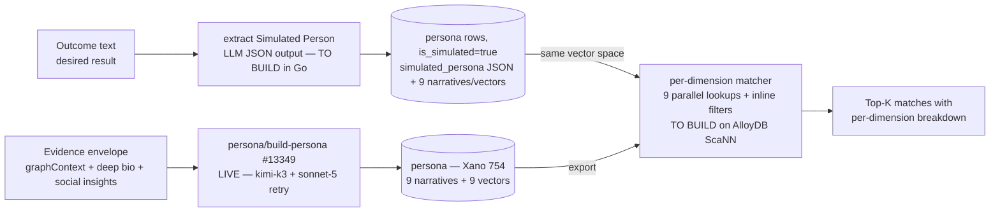

A **Persona** is a synthesized, multi-dimensional profile of a person — used both as the **corpus row** ("here is a real person, projected into nine narrative \+ vector dimensions") and as the **search query** (a **Simulated Person** — the ideal profile for an outcome, projected into the same nine dimensions). Matching runs **dimension-by-dimension** — a query's `domain_focus` vector is scored only against candidates' `domain_focus` vectors, never flat across the whole profile — with hard filters layered on top.

<Note>
  **Dimension 9 locked (2026-08-15).** `current_needs` — introduced as experimental in the build workshop — is now part of the canonical set. This page describes all nine. The live builder is `persona/build-persona` (#13349, v0.6): kimi-k3 primary with Claude Sonnet 5 retry, hard eligibility gate (deep bio AND social insights required), persisting to the `persona` table (754). The full working prompt, table specs, model bake-off, and production-trigger design live on [**Persona Build Design**](/guides/open-work/personas/persona-build-design) — that page plus this one are what a Go developer needs.
</Note>

## A real persona — sandbox Richard Kerris

The actual first row of `persona` (754), built by `persona/build-persona` #13349 from sandbox Richard Kerris (`master_person` #9) — vectors and graph evidence elided, everything else verbatim:

```json
{
  "id": 1,
  "created_at": 1786750814816,
  "updated_at": 1786754884324,
  "master_person_id": 9,
  "node_uuid": "e496bca3-4129-483d-9c12-c3d1b4c66783",

  "identity_profile_narrative": "Richard Kerris is General Manager of Media & Entertainment and Head of Worldwide Developer Relations at NVIDIA, a role he has held since February 2019. He drives industry strategy, business development, product management, developer relations, and marketing across content creation, AI foundry, and streaming verticals, and represents NVIDIA on stages like GTC, SIGGRAPH, and the Runway AI Summit. Based in San Francisco, he presents himself as a bridge between engineering and the creative industries.",
  "identity_profile_vector": "[… 1536 floats …]",

  "domain_focus_narrative": "His deepest expertise sits at the intersection of developer relations and media & entertainment technology: building developer ecosystems (Nokia, HP webOS, Apple, NVIDIA), 3D software product strategy (Director of Maya Technologies at Alias|Wavefront), VFX technology leadership (CTO at Lucasfilm overseeing Industrial Light & Magic and Skywalker Sound), and professional video tools (technical marketing for Final Cut Pro, Shake, Logic, and Aperture at Apple). He also carries practitioner-level knowledge of cloud rendering through his advisory role at OTOY, and current focus areas include AI-driven content creation, graphics, simulation, and streaming.",
  "domain_focus_vector": "[… 1536 floats …]",

  "soft_skills_narrative": "A career-long pattern of ecosystem building suggests strong partnership and evangelism skills: he grew Nokia's developer ecosystem by 122% in 18 months, built global evangelist teams across China, Finland, London, and Silicon Valley, and was one of the few Apple executives permitted to speak publicly about products, appearing in eight Steve Jobs keynotes. His stated philosophy — \"It's not an Apps numbers game, it's about a developers success\" — reflects a relationship-first approach to developer communities, and his Avegant tenure shows he can operate hands-on at startup scale, from fundraising to shipping hardware.",
  "soft_skills_vector": "[… 1536 floats …]",

  "track_record_narrative": "Over three decades he has held senior roles at Alias|Wavefront (Director of Maya Technologies, 1995–2001, where he brought Maya to Macintosh and built OEM deals with Quantel), Apple (Senior Director, 2001–2007), Lucasfilm (CTO, 2007–2011), HP (VP of Worldwide Developer Relations for webOS, 2011), Nokia (Global Head of Developer Relations & VP, 2011–2013), Avegant (CMO and board member, 2015–2016, where he helped secure a $35M B-round and ship 35,000+ units of the CES Editors Choice-winning Glyph), AWS (Principal, New Product Development, 2017–2019), and NVIDIA (2019–present). He was named one of Variety's \"Top 10 Innovators to Watch\" during his Lucasfilm tenure and appeared in eight Steve Jobs keynotes.",
  "track_record_vector": "[… 1536 floats …]",

  "public_engagement_narrative": "He speaks and posts consistently about AI in media and entertainment: NVIDIA's AI compute model for media, agent-lifecycle security via the Open Secure AI Alliance, SIGGRAPH 2026 graphics and simulation research, and Omniverse streaming to Apple Vision Pro, which he called \"game changing.\" A multi-year thread is AI-driven filmmaking — he has championed Runway's generative AI tools since 2023, shared the stage with Runway co-founder Cristóbal Valenzuela at the AI Film Festival in Tokyo (July 2026), and keynotes events including GTC, Asia Broadcast, China Joy Expo, the Runway AI Summit, and VIEW Conference 2026.",
  "public_engagement_vector": "[… 1536 floats …]",

  "communication_style_narrative": "His public voice is enthusiastic and promotional but grounded in an insider's credibility — short, punchy posts amplifying NVIDIA announcements and partner wins, punctuated by personal anecdotes like bringing iPods to the Rolling Stones. His X bio (\"Family, photos & music... All views mine\") signals an informal, first-person register, and his Threads and Instagram presence mixes conference appearances with casual travel and music content. His audience spans developers, film and VFX professionals, and the broader AI-creative community.",
  "communication_style_vector": "[… 1536 floats …]",

  "community_affiliation_narrative": "He serves on the Bay Area Board of the Visual Effects Society and is an active member of the Society of Motion Picture and Television Engineers, anchoring him in the professional VFX and motion-picture engineering communities. His strongest documented relationships include Steve Jobs and Ron Okamoto at Apple (he reported to Okamoto and appeared in eight Jobs keynotes), Jules Urbach, whose cloud-rendering company OTOY he advised (2018–2019), and Runway co-founder Cristóbal Valenzuela, with whom he has shared stages in 2026. His career network spans the Apple, Lucasfilm, Nokia, HP, AWS, and NVIDIA ecosystems.",
  "community_affiliation_vector": "[… 1536 floats …]",

  "passions_interests_narrative": "Music and photography are his clearest off-duty pursuits: he is an accomplished photographer and musician who played drums and percussion on a Richard Barone record (2017) and posts about the Beatles, including Sgt. Pepper outtakes. His interests also include Star Trek — his Roddenberry Archive share drew 187 likes — plus family, film, travel, and food, with frequent personal travel posts from Japan on Threads.",
  "passions_interests_vector": "[… 1536 floats …]",

  "current_needs_narrative": "His current focus is advancing NVIDIA's media & entertainment platform agenda: promoting its AI compute model for media (August 2026), amplifying SIGGRAPH 2026 graphics and simulation research, and pushing AI-driven filmmaking through a visible partnership with Runway — including the AI Film Festival Tokyo kickoff with Cristóbal Valenzuela (July 2026) and a confirmed fireside keynote at VIEW Conference 2026. He is also publicly boosting ecosystem-security work via the Open Secure AI Alliance.",
  "current_needs_vector": "[… 1536 floats …]",

  "persona_sequence_summary": "Richard Kerris is General Manager of Media & Entertainment and Head of Worldwide Developer Relations at NVIDIA, where since 2019 he has driven platform strategy and developer engagement across content creation, AI foundry, and streaming. His expertise spans developer ecosystems, 3D software (Maya at Alias|Wavefront), VFX technology leadership (CTO at Lucasfilm), and professional video tools (Final Cut Pro, Shake at Apple), backed by a track record that includes growing Nokia's developer ecosystem 122% in 18 months, shipping Avegant's CES-winning Glyph, appearing in eight Steve Jobs keynotes, and a Variety \"Top 10 Innovators to Watch\" honor. He talks publicly about AI in media — NVIDIA's AI compute model, SIGGRAPH research, and Runway's generative filmmaking tools — in an enthusiastic, anecdote-laced voice aimed at developers and creative professionals. He sits on the Bay Area Board of the Visual Effects Society, is active in SMPTE, and counts Steve Jobs, Ron Okamoto, Jules Urbach, and Cristóbal Valenzuela among his strongest documented relationships; outside work he is a photographer, drummer, Beatles and Star Trek fan, and frequent Japan traveler. Right now he is focused on NVIDIA's AI-media platform push and a visible Runway partnership, with keynotes at VIEW Conference 2026 and the AI Film Festival Tokyo.",

  "synthesis": {
    "model": "moonshotai/kimi-k3",
    "valid": true,
    "reason": "valid",
    "usage": { "cost": 0.08706, "prompt_tokens": 19025, "completion_tokens": 1999 },
    "coverage": {
      "identity_profile": "rich", "domain_focus": "rich", "soft_skills": "moderate",
      "track_record": "rich", "public_engagement": "rich", "communication_style": "moderate",
      "community_affiliation": "rich", "passions_interests": "moderate", "current_needs": "moderate"
    },
    "coverage_note": "His professional identity, career history, expertise, public speaking, and industry affiliations are richly documented, while his personal interests and current initiatives are moderately covered and formal evidence of interpersonal skills is thinner, inferred mainly from track record.",
    "non_null_narratives": 9
  },

  "graph_context": "{ person node + 26 one-hop connections — elided }"
}
```

## The 9 dimensions

Each persona — whether for a real person or a synthesized ideal — has exactly 9 narrative \+ vector pairs. Nine is the orthogonal set: every dimension answers a distinct question from a distinct source signal. Fewer would compress unrelated concepts into one vector; more would overlap and dilute matching precision. The ninth, `current_needs`, is the only **strictly time-anchored** dimension — present-tense goals from dated recent evidence (roughly the last twelve months), with a hard evidence floor: no dated recent activity, no narrative.

| # | Dimension | Question it answers | Primary source signals |
| --- | --- | --- | --- |
| 1 | `identity_profile` | Who are they _right now_? | Current title, company, founder/exec status, signature project, headline |
| 2 | `domain_focus` | What do they _know_? | `HAS_EXPERTISE` edges \+ industry/niche narrative |
| 3 | `soft_skills` | What can they _do_ operationally? | Peer mentions, collaboration patterns, evidence in track record (e.g. "led 50-person team" → leadership) |
| 4 | `track_record` | What have they _done_? | `WORKS_AT`, `FOUNDED`, `CONTRIBUTED_TO`, `AUTHORED`, `RECEIVED_HONOR`, certifications |
| 5 | `public_engagement` | What do they talk about? | Social posts, talks, content topics |
| 6 | `communication_style` | How do they talk about it? | Tone, format, audience — **hard floor: first-party words required** (their own posts, quotes, talks) |
| 7 | `community_affiliation` | Who are they with? | Tribes, scenes, ecosystems, organizational affiliations, named relationships |
| 8 | `passions_interests` | What do they care about _beyond work_? | Causes, hobbies, side projects, advocacy, personal content |
| 9 | `current_needs` | What are they focused on and seeking _right now_? | Recent posts, stated asks, current-role initiatives, funding activity, hiring signals, career transitions — **hard floor: dated recent activity required** |

**Reads as a narrative:** _who → know → can do → have done → talk about → how → who with → what beyond work → what now._

### Conceptual layers

The 9 dimensions cluster into conceptual layers — useful for prompt design and weight-tuning, not enforced in the schema:

- **Professional** (5): `identity_profile`, `domain_focus`, `soft_skills`, `track_record`, `public_engagement`
- **Style** (1): `communication_style`
- **Connection** (1): `community_affiliation`
- **Personal** (1): `passions_interests`
- **Temporal** (1): `current_needs`

Scoring roles per dimension (driver / valence / modifier / structural) and the aggregation math live in [Suggestion Recipes — loop\_generic](/guides/open-work/suggestion-recipes/loop-generic): with nine dimensions the drivers are `domain_focus`, `public_engagement`, `passions_interests`, and `current_needs`. The search side carries `dimension_weights` so a query can boost or suppress dimensions — a vendor search might weight `passions_interests` at 0.02, a co-founder search at 0.20.

## Architecture flow


```mermaid
flowchart LR
    O[Outcome text<br/>desired result] --> X[extract Simulated Person<br/>LLM JSON output — TO BUILD in Go]
    X --> OF[(persona rows, is_simulated=true<br/>simulated_persona JSON + 9 narratives/vectors)]

    E[Evidence envelope<br/>graphContext + deep bio + social insights] --> R[persona/build-persona #13349<br/>LIVE — kimi-k3 + sonnet-5 retry]
    R --> PF[(persona — Xano 754<br/>9 narratives + 9 vectors)]

    OF -->|same vector space| M[per-dimension matcher<br/>9 parallel lookups + inline filters<br/>TO BUILD on AlloyDB ScaNN]
    PF -->|export| M
    M --> RES[Top-K matches with<br/>per-dimension breakdown]
```

Two synthesis paths (query side \+ corpus side), one matcher, all nine dimensions compared channel-aligned. The pattern generalizes the `investment_theses ↔ fundraising_pitch_profiles ↔ match_investors_for_pitch` flow from the [find-investors engine](/guides/open-work/vectors-alloydb/find-investors-engine) (6 dimensions there, 9 here).

## How scoring stacks

Three layers, strictly separated: **build once** (nine narratives \+ vectors into `persona` 754) → **compare once** (raw per-dimension cosines saved in `compare_persona` 778, cache-first, no weighting baked in) → **match many ways** (weights, z-scores, role-typed aggregation over the saved scores — pure arithmetic, zero recompute). The full walkthrough of all three layers is [**Persona Scoring**](/guides/open-work/personas/scoring).

## What exists today

| Piece | Status | Where |
| --- | --- | --- |
| 9 dimensions locked | ✅ 2026-08-15 | This page — `current_needs` promoted from experimental after the 21-person workshop validation |
| Person-side builder | ✅ **live prototype v0.6** | `persona/build-persona` **#13349** — evidence gate, hard floors, evidence\_coverage grades; rename to `person/build-persona` at promotion |
| Persona store | ✅ live | `persona` table **754** — 9 narratives \+ lazily-backfilled 1536-d vectors, unique `master_person_id`, 21/21 sandbox corpus built |
| Pairwise compare cache | ✅ live | `compare_persona` **778** \+ `persona/compare-personas` **#13350** — canonical unordered pair, per-dimension cosine, cache-first |
| Production trigger queue | ✅ table built | `queue_persona` **779** — POST trigger endpoint \+ CRON drain designed, **not yet built** (callout on [Persona Build Design](/guides/open-work/personas/persona-build-design)) |
| Simulated Person builder (person-driven) | ✅ **live test prototype** | `persona/build-simulated-person` **#13372** (v0.3, kimi-k3) → `simulated_persona` table **783** — imagines the ideal helper for a persona's `current_needs`; spec \+ results on [Persona Build Design](/guides/open-work/personas/persona-build-design) |
| Simulated Person builder (outcome-driven) | ☐ **to build in Go** | User outcome text → Simulated Person; the 9-dimension extract prompt below is the spec. The deprecated Xano prototype is slated for deletion (see promotion path) |
| `person_personas` (714) | ⚠️ empty legacy target | 0 rows — the live corpus lands in **754**; the long-term store is AlloyDB. Decide at promotion whether 714 ever gets used or is dropped |
| AlloyDB store \+ matcher | ☐ **the Go build** | Pattern proven by the find-investors engine; 9-dimension DDL below, scoring spec in [developer-requirements](/guides/open-work/suggestion-recipes/developer-requirements) |

## The Simulated Person — to build in Go

The **query half** of the matcher. A user states a desired outcome ("I need a technical co-founder deep on production agent systems"); an LLM synthesizes the **Simulated Person** for that outcome — not a real person, the _type_ — in the same nine dimensions, embedded into the same vector space, plus `dimension_weights` and hard-filter constraints. The matcher then scores the Simulated Person against every real persona, dimension by dimension.

**Storage (built 2026-08-18):** Simulated People live in their own table, **`simulated_persona` (783)** — a column-for-column mirror of `persona` (754): the nine narrative/vector columns (vectors present but null until the embedding stage), `persona_sequence_summary`, and a `synthesis` receipt, so matching stays channel-aligned. **`master_person_id` on this table is the REAL person the loop was run for** (the leverage-loop target; unique, upserted on regeneration), and the verbatim LLM profile — the nine-object array plus `dimension_weights` — is kept in the **`simulated_persona`** JSON field. The record is created the moment the narratives are created.

**Status:** the person-driven flavor is **live as a Xano test builder** — `persona/build-simulated-person` (#13372, v0.3): it reads one completed persona row and imagines the ideal _helper_ for that person's `current_needs` (kimi-k3; full spec, prompt, and test results on [Persona Build Design](/guides/open-work/personas/persona-build-design)). For a Simulated Person, `current_needs` mirrors: it describes what the helper is seeking such that the real person is the natural answer — mutual timing is the strongest match signal. The _outcome-text_ flavor (user states a desired outcome → Simulated Person) remains a **Go build target**; the extract prompt below is its spec. The early Xano prototype of that query side is **deprecated** — see the promotion path for its deletion.

<Accordion title="Simulated Person extract prompt (9 dimensions — spec for the Go build)">
  ```text
  You are a profile architect. Given a desired outcome description, synthesize the IDEAL PERSON archetype who could best help achieve that outcome — not a specific real person, but the TYPE of person.
  
  Output ONLY a single valid JSON object with these exact keys (no markdown, no code fences, no commentary):
  
  {
    "outcome_summary": "<one-sentence summary of the outcome>",
    "identity_profile_narrative": "<2-3 sentences: who is this ideal person right now? Current role, signature project, what makes them THEM>",
    "domain_focus_narrative": "<2-3 sentences: what areas do they know deeply? Industry, niche emphasis, technical depth>",
    "soft_skills_narrative": "<2-3 sentences: what can they DO operationally? Leadership, negotiation, mentorship, public speaking, conflict resolution, sales, etc.>",
    "track_record_narrative": "<2-3 sentences: what kind of work have they shipped/funded/built? Specific proof points>",
    "public_engagement_narrative": "<2-3 sentences: what topics do they engage with publicly? Themes they post/speak/write about>",
    "communication_style_narrative": "<2-3 sentences: how do they communicate? Tone, format, audience, depth>",
    "community_affiliation_narrative": "<2-3 sentences: what tribes/scenes/ecosystems are they part of?>",
    "passions_interests_narrative": "<2-3 sentences: what do they care about beyond their professional work?>",
    "current_needs_narrative": "<2-3 sentences: what should this ideal person be focused on and seeking right now, such that the outcome is mutually valuable? Present-tense goals — building, raising, hiring, seeking>",
    "required_expertise_areas": ["<canonical area name>", "..."],
    "required_role_archetypes": ["founder|exec|advisor|investor|mentor|IC|consultant|operator|...", "..."],
    "required_industry_tags": ["<sector>", "..."],
    "required_stage_tags": ["pre_seed|seed|series_a|series_b_plus|growth|public", "..."],
    "required_geo_country": "<ISO 3166-1 alpha-2 or null>",
    "dimension_weights": {
      "identity_profile": <0.0-1.0>,
      "domain_focus": <0.0-1.0>,
      "soft_skills": <0.0-1.0>,
      "track_record": <0.0-1.0>,
      "public_engagement": <0.0-1.0>,
      "communication_style": <0.0-1.0>,
      "community_affiliation": <0.0-1.0>,
      "passions_interests": <0.0-1.0>,
      "current_needs": <0.0-1.0>
    }
  }
  
  RULES:
  - dimension_weights MUST sum to 1.0 within ±0.02 tolerance.
  - Default unweighted: ~0.111 each. Adjust based on what matters most for this outcome.
    - Vendor/service search: passions ~0.02, communication ~0.05, track_record/domain heavier.
    - Co-founder search: passions ~0.20, soft_skills ~0.20, others moderate.
    - Mentor/advisor search: track_record ~0.25, soft_skills ~0.20, communication ~0.15, others moderate.
    - Fundraising/hiring outcomes: current_needs heavy — the match IS the need alignment.
  - Filter constraints (required_*) should be empty arrays if no hard requirement.
  - Each narrative MUST be 2-3 sentences. No more, no less.
  - Write about the IDEAL PERSON archetype, not any real named person.
  - Professional tone. No filler. Be specific.
  - Begin with { and end with }.
  ```
</Accordion>

## Target schema — AlloyDB (the Go build)

Personas live long-term in one AlloyDB table with per-dimension ScaNN indexes. The corpus-side row carries denormalized filter arrays so ScaNN's **inline filtering** can prune during traversal — pulling filters through a JOIN would force post-filtering and lose both speed and recall (`person_has_expertise` 711 stays the source of truth for rich expertise queries; the array on the persona row is purely the pruning hint).

```sql
-- pseudo-DDL on AlloyDB
CREATE EXTENSION IF NOT EXISTS alloydb_scann CASCADE;

CREATE TABLE person_personas (
  id                            bigint PRIMARY KEY,
  master_person_id              int UNIQUE NOT NULL,   -- real people only; Simulated People live in the mirror simulated_persona table
  person_node_uuid              text,
  -- 9 narratives ... text
  identity_profile_vector       vector(1536),
  domain_focus_vector           vector(1536),
  soft_skills_vector            vector(1536),
  track_record_vector           vector(1536),
  public_engagement_vector      vector(1536),
  communication_style_vector    vector(1536),
  community_affiliation_vector  vector(1536),
  passions_interests_vector     vector(1536),
  current_needs_vector          vector(1536),
  expertise_uuids               text[],
  role_archetypes               text[],
  industry_tags                 text[],
  stage_tags                    text[],
  geo_country                   text,
  built_at                      timestamptz
);

-- 9 ScaNN indexes (one per dimension), MODE=AUTO recommended for first build
CREATE INDEX ON person_personas USING scann (identity_profile_vector cosine);
CREATE INDEX ON person_personas USING scann (domain_focus_vector cosine);
CREATE INDEX ON person_personas USING scann (soft_skills_vector cosine);
CREATE INDEX ON person_personas USING scann (track_record_vector cosine);
CREATE INDEX ON person_personas USING scann (public_engagement_vector cosine);
CREATE INDEX ON person_personas USING scann (communication_style_vector cosine);
CREATE INDEX ON person_personas USING scann (community_affiliation_vector cosine);
CREATE INDEX ON person_personas USING scann (passions_interests_vector cosine);
CREATE INDEX ON person_personas USING scann (current_needs_vector cosine);

-- Supporting btree/gin for inline filters
CREATE INDEX ON person_personas (geo_country);
CREATE INDEX ON person_personas USING gin (expertise_uuids);
CREATE INDEX ON person_personas USING gin (role_archetypes);
CREATE INDEX ON person_personas USING gin (industry_tags);
CREATE INDEX ON person_personas USING gin (stage_tags);
```

<Warning>
  **Vector dimensionality is an open decision for the AlloyDB build.** The live prototype embeds at **1536-d** (`gemini-embedding-001`, `dimensions:1536`, L2-normalized — matching `vectors/create-gemini-vectors` #13114 v2 and the compare-cache backfill). The house AlloyDB standard elsewhere is 3072-d. The DDL above uses 1536 to match what exists; if the Go build standardizes on 3072, every stored narrative must be re-embedded — decide once, before the corpus build.
</Warning>

The matcher takes a query persona, reads its 9 vectors \+ filter arrays \+ `dimension_weights`, runs 9 parallel ScaNN top-K lookups (each filtered inline), unions the candidate pool, exact-rescores against all 9 dimensions, and returns top-K with the per-dimension breakdown. Scoring semantics (driver/valence/modifier/structural roles, z-scoring, aggregation) are specced in [loop\_generic](/guides/open-work/suggestion-recipes/loop-generic) and [developer-requirements](/guides/open-work/suggestion-recipes/developer-requirements).

## Cost estimates

Per persona build: one synthesis LLM call (kimi-k3 ~\$0.08 measured across the fleet; Sonnet 5 retry ~\$0.10 when triggered) \+ 9 Gemini embedding calls. At 100K people: roughly **\$8–12K in synthesis** at current kimi pricing — the workshop's measured \$0.079/person average is the planning number. Storage: 9 vectors × 1536 floats ≈ ~55 KB serialized per row in Xano json (~5.5 GB at 100K); AlloyDB `vector(1536)` is ~6 KB × 9 ≈ ~55 KB per row.

## Promotion path — what's left to do

1. **Production trigger** — POST endpoint (90-day freshness check) \+ `queue_persona` (779) CRON drain, per the callout on [Persona Build Design](/guides/open-work/personas/persona-build-design).
2. **Simulated Person in Go** — port the live person-driven builder (#13372 → `simulated_persona` mirror table, spec on [Persona Build Design](/guides/open-work/personas/persona-build-design)) and implement the outcome-driven flavor from the extract prompt above. Add the embedding stage for `simulated_persona` (783) vectors. Then **delete the deprecated Xano prototype**: table `outcome_personas` (713), fns `outcome/extract-ideal-persona` (#12927) and `outcome/build-ideal-persona` (#12928), test API 8412 — all unused, 0 rows.
3. **AlloyDB store \+ matcher** — DDL above; settle the 1536-vs-3072 embedding decision first.
4. **Rename** `persona/build-persona` → `person/build-persona`; decide the fate of empty legacy `person_personas` (714); delete temp QA endpoints 8988–8991.
5. **`HAS_EXPERTISE` description back-fill** (#13046, Task #177 inactive) before any live-corpus persona build — see [New Build Plan](/guides/open-work/personas/new-build-plan).

## Open questions

1. **Controlled vocabulary** for `role_archetypes` / `industry_tags` / `stage_tags` — free-text v1, promote to a taxonomy when usage patterns are clear.
2. **Persona versioning** — one row per person (unique `master_person_id`, the live behavior). Add a history table later if drift analysis becomes useful.

## Related

- [Persona Scoring](/guides/open-work/personas/scoring) — the three scoring layers: build → saved raw scores → match strategies
- [Persona Build Design](/guides/open-work/personas/persona-build-design) — the live build: v0.6 prompt, `persona` 754 / `compare_persona` 778 / `queue_persona` 779 specs, model bake-off, production-trigger design
- [New Build Plan](/guides/open-work/personas/new-build-plan) — evidence sourcing: the three-layer context pull, per-dimension coverage, gaps
- [loop\_generic](/guides/open-work/suggestion-recipes/loop-generic) — scoring architecture: roles, z-scoring, aggregation
- [Developer requirements](/guides/open-work/suggestion-recipes/developer-requirements) — the Go/GCP scoring pipeline contract
- [Find investors — AlloyDB build](/guides/open-work/vectors-alloydb/find-investors-engine) — the 6-dimension reference implementation this generalizes
- [ScaNN reference](/guides/open-work/vectors-alloydb/scann) — index strategy, inline filtering, recall tuning