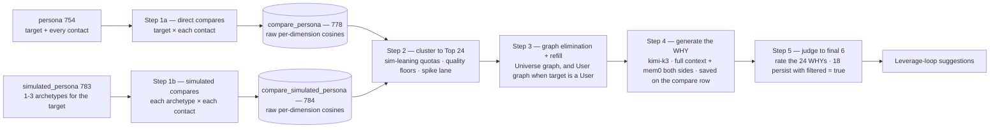

How persona scores are produced and consumed for a leverage loop, in two operational steps on top of one principle: **the expensive things run once and persist; interpretation is re-tunable arithmetic over saved rows.** Building the personas themselves (narratives \+ vectors) is the [Personas group](/guides/open-work/personas); this page starts where a loop starts — a target with a persona, a user with contacts, and 1–3 [Simulated Personas](/guides/open-work/personas#the-simulated-person--to-build-in-go) for the target.



**The stores.** `persona` (754) — one row per real person, nine narrative/vector pairs. `simulated_persona` (783) — 1–3 archetype rows per loop target, same nine columns. `compare_persona` (778) — direct pairwise scores. `compare_simulated_persona` (784) — archetype-vs-contact scores. All four keep **raw cosines only**: no weighting, no normalization, no mode is ever persisted.

## Step 1 — Save comparison scores

Two compare families run for a loop on target **T** for user **U**, both cache-first, both persisted before any ranking happens:

1. **Direct (T × contacts):** T's persona against the persona of **every contact of U** — excluding T themself, and excluding the [pool exclusion sets](/guides/open-work/suggestion-recipes/developer-requirements#pool-exclusions-the-negative-space) (already-connected, shared employer, target's own contacts). One row per unordered pair in `compare_persona` (778): `pair_key = "lowId:highId"` under a unique index, so A↔B in either order is the same row.
2. **Simulated (archetypes × contacts):** **each** of T's 1–3 Simulated Persona archetypes against every contact in the same pool. One row per `(simulated_persona_id, candidate_master_person_id)` in `compare_simulated_persona` (784) — directional (the simulated side is not a master\_person), with the loop target's `master_person_id` denormalized on the row so one query reads a whole loop's simulated scores.

Contract for every saved row: `scores` is the raw `{dimension: cosine | null}` across the nine dimensions — **null passthrough** (a null narrative on either side never fakes a score; `dims_compared` records how many scored); `overall_score` is the unweighted mean of non-null dims, stored for eyeballing and **never the ranker**; both sides' `updated_at` are snapshotted so a rebuilt persona or re-simulated archetype makes cached rows detectably stale (recompute with `force`).

### Computing the scores (Go)

Cosine on the house-standard vectors is a plain dot product — `gemini-embedding-001`, `dimensions: 1536`, **L2-normalized at write time**, so no norm division at compare time:

```go
// Cosine on L2-normalized vectors == dot product.
func cosine(a, b []float32) float64 {
	var dot float64
	for i := range a {
		dot += float64(a[i]) * float64(b[i])
	}
	return dot
}

var dims = [9]string{
	"identity_profile", "domain_focus", "soft_skills", "track_record",
	"public_engagement", "communication_style", "community_affiliation",
	"passions_interests", "current_needs",
}

// Either side is a persona row (target/contact) or a simulated_persona archetype
// row — the shape is identical: nine optional vectors, nil when the narrative is null.
type NineVectors map[string][]float32

func compareScores(a, b NineVectors) (scores map[string]*float64, overall float64, dimsCompared int) {
	scores = make(map[string]*float64, 9)
	var sum float64
	for _, d := range dims {
		va, vb := a[d], b[d]
		if len(va) == 0 || len(vb) == 0 || len(va) != len(vb) {
			scores[d] = nil // null passthrough — never fake a score
			continue
		}
		c := round4(cosine(va, vb))
		scores[d] = &c
		sum += c
		dimsCompared++
	}
	if dimsCompared > 0 {
		overall = round4(sum / float64(dimsCompared)) // stored convenience — never the ranker
	}
	return
}

// Persist raw, interpret later:
//   direct    -> compare_persona (778):           upsert on pair_key "lowId:highId"
//   simulated -> compare_simulated_persona (784): upsert on (simulated_persona_id, candidate_master_person_id)
// Snapshot both sides' updated_at on the row. Never persist weights, z-scores, or modes.
```

Expect raw cosines in a **~0.45–0.85 band** — even unrelated professionals rarely score below ~0.45 (embedding compression), which is why Step 2 standardizes per pool instead of trusting absolutes.

**Simulated response of a saved direct compare** — the exact row shape (`persona/compare-personas` #13350 is the Xano reference implementation, QA endpoint 8991):

```json
{
  "id": 7,
  "created_at": 1786815203441,
  "updated_at": 1786815203441,
  "master_person_a_id": 9,
  "master_person_b_id": 14,
  "pair_key": "9:14",
  "scores": {
    "identity_profile":      0.6104,
    "domain_focus":          0.7132,
    "soft_skills":           0.5817,
    "track_record":          0.6389,
    "public_engagement":     0.7794,
    "communication_style":   0.7401,
    "community_affiliation": 0.6577,
    "passions_interests":    0.4922,
    "current_needs":         0.7215
  },
  "overall_score": 0.6589,
  "dims_compared": 9,
  "embedding_model": "google/gemini-embedding-001 @1536 L2-normalized via OpenRouter",
  "persona_a_id": 3,
  "persona_b_id": 11,
  "persona_a_updated_at": 1786738921870,
  "persona_b_updated_at": 1786741666204,
  "cached": false
}
```

A `compare_simulated_persona` (784) row is the same idea with the directional key: `master_person_id` (loop target), `simulated_persona_id` \+ `archetype_slot`, `candidate_master_person_id`, the same `scores`/`overall_score`/`dims_compared`, and both staleness snapshots.

### Table specs — copy/paste (Go port)

`compare_persona` (table **778**):

```text
table "compare_persona" {
  description = "Pairwise persona compare cache — per-dimension cosine similarity between two people's persona narratives (table 754 vectors). One row per UNORDERED pair: master_person_a_id/master_person_b_id are stored canonically (a = lower id, b = higher id) and pair_key = 'lowId:highId' carries the unique index, so an A>B or B>A lookup is one query. ALWAYS check this table before running a compare. persona_*_updated_at snapshot the persona rows at compare time so a cached score can be detected as stale after a persona rebuild."
  auth = false
  schema {
    int id { description = "Unique identifier for the compare row" }
    timestamp created_at?=now { description = "First compare timestamp" }
    timestamp updated_at?=now { description = "Last recompute timestamp" }
    int master_person_a_id {
      table = "master_person"
      description = "Lower master_person id of the pair (canonical ordering)"
    }
    int master_person_b_id {
      table = "master_person"
      description = "Higher master_person id of the pair (canonical ordering)"
    }
    text pair_key filters=trim { description = "'lowId:highId' — unique key for the unordered pair" }
    json scores { description = "Per-dimension cosine similarity {dimension: number|null} across the 9 persona narratives; null when either side's narrative is null" }
    decimal overall_score? { description = "Unweighted mean of non-null dimension scores (tune weights downstream — that is why per-dim scores are stored)" }
    int dims_compared? { description = "Count of dimensions with a non-null score" }
    text embedding_model? filters=trim { description = "Embedding standard used, e.g. google/gemini-embedding-001 @1536 L2-normalized via OpenRouter" }
    int persona_a_id? { description = "persona (754) row id for person A at compare time" }
    int persona_b_id? { description = "persona (754) row id for person B at compare time" }
    timestamp persona_a_updated_at? { description = "persona row A updated_at snapshot — staleness detection" }
    timestamp persona_b_updated_at? { description = "persona row B updated_at snapshot — staleness detection" }
    text? why? { description = "Step 4 output — LLM-written case for the introduction (why + win-win), from full context of both people w/ mem0 + match provenance. Null until generated" }
    timestamp why_generated_at? { description = "When the WHY was generated — staleness signal after persona rebuilds" }
  }

  index = [
    {type: "primary", field: [{name: "id"}]}
    {type: "btree|unique", field: [{name: "pair_key", op: "asc"}]}
    {type: "btree", field: [{name: "master_person_a_id", op: "asc"}]}
    {type: "btree", field: [{name: "master_person_b_id", op: "asc"}]}
  ]
}
```

`compare_simulated_persona` (table **784** — built 2026-08-18):

```text
table "compare_simulated_persona" {
  description = "Simulated-compare cache — per-dimension cosine similarity between one Simulated Persona archetype (a simulated_persona 783 row) and one candidate contact's persona (754). One row per (simulated_persona_id, candidate_master_person_id) pair — directional, unlike compare_persona: the simulated side is not a master_person. master_person_id = the leverage-loop TARGET the archetype was built for, denormalized so one query reads every simulated compare for a loop. ALWAYS check this table before computing; staleness via the two updated_at snapshots. Raw scores only — no weighting baked in (Step 2 clustering interprets them)."
  auth = false
  schema {
    int id { description = "Unique identifier for the simulated-compare row" }
    timestamp created_at?=now { description = "First compare timestamp" }
    timestamp updated_at?=now { description = "Last recompute timestamp" }
    int master_person_id {
      table = "master_person"
      description = "The leverage-loop TARGET this archetype was simulated for (denormalized from simulated_persona)"
    }
    int simulated_persona_id {
      table = "simulated_persona"
      description = "The archetype row (783) whose nine vectors were compared"
    }
    int archetype_slot?=1 { description = "1-3, denormalized from the archetype row for cheap filtering" }
    int candidate_master_person_id {
      table = "master_person"
      description = "The contact being scored against the archetype"
    }
    json scores { description = "Per-dimension cosine similarity {dimension: number|null} across the 9 narratives; null when either side's narrative is null" }
    decimal overall_score? { description = "Unweighted mean of non-null dimension scores — convenience only, never the ranker" }
    int dims_compared? { description = "Count of dimensions with a non-null score" }
    text embedding_model? filters=trim { description = "Embedding standard used, e.g. google/gemini-embedding-001 @1536 L2-normalized via OpenRouter" }
    int candidate_persona_id? { description = "persona (754) row id of the candidate at compare time" }
    timestamp candidate_persona_updated_at? { description = "Candidate persona updated_at snapshot — staleness detection" }
    timestamp simulated_persona_updated_at? { description = "Archetype row updated_at snapshot — staleness detection after a re-simulation" }
    text? why? { description = "Step 4 output — LLM-written case for the introduction (why + win-win), from full context of both people w/ mem0 + match provenance. Null until generated" }
    timestamp why_generated_at? { description = "When the WHY was generated — staleness signal after persona/archetype rebuilds" }
  }

  index = [
    {type: "primary", field: [{name: "id"}]}
    {type: "unique", field: [{name: "simulated_persona_id", op: "asc"}, {name: "candidate_master_person_id", op: "asc"}]}
    {type: "btree", field: [{name: "master_person_id", op: "asc"}]}
    {type: "btree", field: [{name: "candidate_master_person_id", op: "asc"}]}
    {type: "btree", field: [{name: "created_at", op: "desc"}]}
  ]
}
```

## Step 2 — Cluster to the Top 24

Everything below is arithmetic over the saved rows — **zero recompute**, endlessly re-tunable.

**Why the lean toward simulated matches.** A direct score answers "how _similar_ is this contact to the target?" — a peer signal. A simulated score answers "how close is this contact to the **helper we imagined** for the target's needs?" — the archetype already encodes the help direction: its `current_needs` mirrors the target, its domain is the helper's world, its whole profile is the answer to the brief. A contact who scores high against an archetype _is that archetype made real_. So the Top 24 leans on simulated matches, keeps a seat for direct (peer) matches — great intros are sometimes "you two are the same kind of person" — and adapts when an archetype turns out weak.

**Normalize per source first.** Z-score each dimension **within its source column across the candidate pool** — the direct column and each archetype's column separately. Each archetype has its own baseline (a generically-phrased archetype inflates every cosine against it); per-source standardization makes "standout for _this_ archetype" comparable across sources, which is what quota-filling needs. Per-source composite: harness-owned weights over the dimension z's (defaults from [loop\_generic](/guides/open-work/suggestion-recipes/loop-generic) — soft-maxed drivers, valence by mode).

**The proposed cut (recommended plan):**

| Archetypes (K) | From each archetype | From direct | Spike lane | Total |
| --- | --- | --- | --- | --- |
| 3 | 5 | 5 | 4 | 24 |
| 2 | 7 | 6 | 4 | 24 |
| 1 | 12 | 8 | 4 | 24 |
| 0 (no simulation) | — | 20 | 4 | 24 |

1. **Quality floor per archetype.** An archetype's quota slots only fill while the candidate's composite z clears a floor (`z_floor`, default ~0.5 — harness-tuned). **Unfilled slots backfill: first to the other archetypes (next-best above floor), then to direct.** This is the adaptive rule mechanized — a weak archetype cedes its seats to straight matches automatically, because in z-space a weak archetype simply produces fewer candidates above the floor.
2. **Spike lane (~4 seats).** Reserved for candidates whose **single best dimension is near-perfect** — raw cosine ≥ ~0.85 or dimension-z ≥ ~2.5 within its source — but who didn't make an overall cut. One extraordinary thread ("their `domain_focus` is a 0.91 against archetype 2") is often the best intro hook in the whole set. Spike picks come from any source, must clear a sanity floor on their composite (z ≥ 0) so a single-dimension artifact can't ride in alone, and carry provenance: source, dimension, raw score.
3. **Dedupe with corroboration.** A candidate can surface via several sources; they occupy **one** seat — their best source — with the other qualifying sources recorded as provenance. A candidate clearing the floor on **2\+ archetypes** is corroborated (they match the helper _pattern_, not one archetype's phrasing) — worth a corroboration bonus on the final composite (tunable, e.g. \+0.25 z).
4. **One interleaved list.** Per the decided shelf convention: quotas and lanes are metadata under the hood, the user sees a single ranked list — min-max normalize each lane's composites and merge. Every seat carries its explanation: which archetype (and its `for_need`), or peer-match, or spike (dimension \+ score).

<Note>
  **Relationship to the earlier portfolio.** The peer/complement × diagonal/serendipity top-24 on [developer-requirements](/guides/open-work/suggestion-recipes/developer-requirements) predates Simulated Personas. When archetypes exist for the target, **this sim-leaning cut is the recommended plan** — the archetype axis subsumes most of what the serendipity cross-cells were reaching for (non-obvious helpers), and the K=0 row is the fallback when no simulation exists. Quotas, floors, the spike thresholds, and the corroboration bonus are **harness-owned tunables**; nothing here is baked into storage.
</Note>

## Step 3 — Graph elimination and refill

The Top 24 are candidates, not results — each must be verified against the graph(s) for an existing direct connection to the target before it can be suggested:

1. **Universe graph check.** One batched membership query with the target's `node_uuid` and all 24 candidate `node_uuid`s: any candidate with a **direct edge to the target** (untyped `(c)--(t)` — any edge type counts, so new edge types are covered automatically) is **eliminated**.
2. **User graph check (conditional).** When the leverage-loop target **is an Orbiter User**, also check the target's own User graph for a direct target↔candidate connection — a relationship that exists only in their personal graph still disqualifies the introduction. Eliminate those too.
3. **Refill and repeat.** However many were eliminated, pull the **next-best matches** from the Step 2 ranked remainder (same lane logic — an eliminated archetype pick refills from that archetype's next candidate above the floor, then cascades), run the new picks through the same graph check(s), and **repeat until 24 matches stand with no known direct connection**. Batch each wave into one membership query per graph; pools are pre-shrunk so this converges in one or two waves.

<Note>
  This composes with the [pool exclusions](/guides/open-work/suggestion-recipes/developer-requirements#pool-exclusions-the-negative-space) (E1–E3), which run **before** scoring: when the pool was properly excluded, Step 3 removals are rare. Step 3 is the authoritative **post-selection verification** — it catches connections formed after the compare rows were cached, pools scored before exclusions existed, and the User-graph case for user-targets.
</Note>

## Step 4 — Generate the WHY

Each verified match is carried as a **qualified-match object** that knows its provenance:

```json
{ "master_person_id": 1234, "compare_persona_id": 87, "compare_simulated_persona_id": null }
```

— exactly **one of the two compare ids is set** (a straight compare or a simulated compare), and that row is where the WHY is saved: both `compare_persona` (778) and `compare_simulated_persona` (784) now carry **`why`** (text) and **`why_generated_at`** (staleness — regenerate after either side's persona/archetype rebuilds).

The WHY is written by **kimi-k3** from the **full context of the leverage-loop target w/ mem0** plus the **full context of the suggested match w/ mem0** plus the match provenance. System prompt (spec, copy-paste):

```text
You are Why, the introduction writer for a relationship platform. You receive full context on two real people — the PERSON (the leverage-loop target) and the MATCH (a suggested introduction from the user's network) — plus the matching provenance that surfaced the match. You write the case for introducing them.

Input sections
- person: persona narratives (nine dimensions), mem0 memories (notes, interactions, stated goals), profile facts.
- match: the same sections for the suggested match.
- provenance: how the match surfaced — a direct persona match (peer signal) or a match against a Simulated Persona archetype (helper signal, including the archetype's for_need), plus the strongest scoring dimensions and any near-perfect single-dimension spike.

Rules
- Ground every claim in the provided context. Never invent facts, shared history, or intentions that are not in the input. If the input only supports a modest case, write the honest modest case.
- Use both people's real names naturally.
- Lead with the reason that would make the USER (the introducer) nod immediately — the sharpest overlap or complementarity, never a summary of two bios.
- Mutual value is the test: what does each side get? Timing outranks static similarity — current needs on either side are the strongest material.
- When the provenance is the story, tell it (the match answers the person's current need for X; one dimension aligns near-perfectly on Y).
- 2-4 sentences for why. 1-3 win_win_outcomes, each one sentence, each naming who wins what.
- No hedging boilerplate, no "may potentially" chains, no restating the input.

Output ONLY JSON:
{
  "why": "<2-4 sentences: why introduce these two people now>",
  "win_win_outcomes": ["<one concrete sentence naming who wins what>", "..."],
  "provenance_used": "<one clause: the thread the case is built on>"
}
```

## Step 5 — Judge to the final 6

A second LLM pass (kimi-k3 primary; judge model is a tunable) **rates the 24 WHYs** and picks the six with the biggest expected impact. All 24 persist as leverage-loop suggestions — the other 18 with **`filtered = true`** on the suggestion row, hidden by default and revealed when the user asks for more. Judge system prompt (spec, copy-paste):

```text
You are the introduction judge. You receive up to 24 candidate introductions for one person — each with its why, win_win_outcomes, and provenance (direct peer match or Simulated-Persona archetype match, with its scores). Rank them by expected impact.

Criteria, in order
1. Mutual, concrete value — both sides visibly win; specific beats generic.
2. Timing — cases built on both sides' CURRENT needs outrank static similarity.
3. Actionability — the first meeting writes itself; the why implies the agenda.
4. Credibility — grounded specifics, not similarity vibes.
5. Diversity — among near-ties, prefer a final set spanning different archetypes and needs over six variants of the same introduction.

Output ONLY JSON, ranking ALL candidates:
{ "ranked": [ { "master_person_id": <id>, "rank": 1, "reason": "<one line>" }, ... ] }
```

The top 6 become visible suggestions (`filtered = false`); ranks 7–24 persist with `filtered = true`.

---

**To build:** the simulated-compare runner (mirror `persona/compare-personas` #13350 against 784), the Step 3 graph-verification pass (one batched membership query per graph per wave), the Step 4 WHY generator, the Step 5 judge, and the `filtered` bool on the leverage-loop suggestion rows. Temp QA endpoints until promotion: `qa/run-compare-persona` (8991) for direct pairs. First compute for a pair ~9s including lazy embedding backfill; cached reads instant.

## Related

- [loop\_generic](/guides/open-work/suggestion-recipes/loop-generic) — the scoring theory: roles, z-scoring, aggregation, serendipity
- [get-scores Contract](/guides/open-work/suggestion-recipes/get-scores-contract) — the call contract \+ the compare\_persona save flow
- [Developer Requirements](/guides/open-work/suggestion-recipes/developer-requirements) — pool resolution, exclusions, SQL/Go, the pre-simulation portfolio
- [Personas](/guides/open-work/personas) — building the personas: nine dimensions, evidence, the builders
- [Persona Build Design](/guides/open-work/personas/persona-build-design) — both LLM prompts verbatim \+ `persona` 754 / `queue_persona` 779 / `simulated_persona` 783 specs