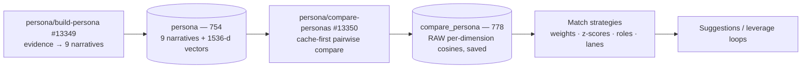

Everything about how personas turn into match scores, in one place. The design has **three strictly separated layers** — and the separation is the point: the expensive layers run **once**, and the layer where opinions live (weights, modes, lanes) can be re-tuned forever for free.



## Layer 1 — Build: narratives and vectors (runs once per person)

`persona/build-persona` (#13349) turns one `master_person`'s evidence (graphContext \+ deep bio \+ social insights) into the **nine narratives**, persisted to `persona` (754). Each narrative gets its own **1536-d vector** (`gemini-embedding-001`, `dimensions:1536`, **L2-normalized** — so cosine similarity is a plain dot product). Vectors are backfilled **lazily**: the first compare that needs a missing vector computes it and writes it back to 754, so the embedding layer builds itself as compares run.

This is the only layer that costs LLM tokens. Full build spec: [Persona Build Design](/guides/open-work/personas/persona-build-design).

**Simulated `persona` (754) record** — a representative row with placeholder values (`<name>` / `<company>`; vectors elided). Exact live column set:

```json
{
  "id": 22,
  "created_at": 1786738921870,
  "updated_at": 1786738921870,
  "master_person_id": 9999,
  "node_uuid": "b7e2c4f1-6a0d-4c3e-9a52-1d8f0e7b2a91",

  "identity_profile_narrative": "<name> is co-founder and CEO of <company>, a Series B developer-tools company bringing AI-agent infrastructure to enterprise engineering teams — a staff engineer turned product leader who still works hands-on in the platform.",
  "identity_profile_vector": [0.0132, -0.0287, 0.0411, "… 1536 L2-normalized floats …"],

  "domain_focus_narrative": "Deep in developer tooling, distributed systems, and applied LLM-agent orchestration, with working fluency in enterprise security and platform reliability — known for turning frontier AI research into shippable developer products.",
  "domain_focus_vector": [0.0219, 0.0088, -0.0342, "…"],

  "soft_skills_narrative": "Appears to be a hands-on technical recruiter-founder: builds and leads senior engineering teams, runs enterprise design partnerships, and closes complex multi-stakeholder deals — the pattern across their roles suggests they turn ambiguous problems into shipped roadmaps.",
  "soft_skills_vector": [-0.0075, 0.0304, 0.0129, "…"],

  "track_record_narrative": "Scaled <company> from zero to roughly 80 people and eight-figure ARR; earlier shipped a widely adopted open-source CI framework and was an early engineer at two startups that were acquired.",
  "track_record_vector": [0.0188, -0.0116, 0.0273, "…"],

  "public_engagement_narrative": "Writes and speaks regularly on agentic developer workflows, the economics of inference, and engineering-org design — a frequent conference keynote and podcast guest.",
  "public_engagement_vector": [0.0301, 0.0057, -0.0198, "…"],

  "communication_style_narrative": "Direct, technically precise, and demo-driven — their posts favor concrete examples and written memos over slideware, and their register is warm but concise in one-to-one exchanges.",
  "communication_style_vector": [-0.0043, 0.0221, 0.0166, "…"],

  "community_affiliation_narrative": "Active in the open-source developer-tools and applied-AI scenes; an alum of a 2019 accelerator cohort, and mentors across two founder networks.",
  "community_affiliation_vector": [0.0154, -0.0092, 0.0338, "…"],

  "passions_interests_narrative": "Trail running, mentoring first-time technical founders, and supporting computer-science-education-access nonprofits.",
  "passions_interests_vector": [0.0097, 0.0263, -0.0141, "…"],

  "current_needs_narrative": "Currently raising a Series C (announced June 2026), hiring a VP of Engineering and senior infrastructure engineers, and actively seeking design-partner introductions in regulated industries.",
  "current_needs_vector": null,

  "persona_sequence_summary": "<name> is a founder-CEO building AI-agent infrastructure for enterprise engineering teams, with deep expertise in developer tooling, distributed systems, and LLM-agent orchestration. They lead senior teams and enterprise partnerships hands-on, backed by a track record of scaling <company> to ~80 people and eight-figure ARR after shipping a widely adopted CI framework. Publicly they speak on agentic workflows and the economics of inference in a direct, demo-driven style, move in the open-source and applied-AI scenes, and beyond work run trails and mentor first-time founders. Right now they are raising a Series C, hiring engineering leadership, and seeking regulated-industry design partners.",

  "synthesis": {
    "valid": true,
    "reason": null,
    "attempt": "primary",
    "model": "moonshotai/kimi-k3",
    "usage": { "prompt_tokens": 21384, "completion_tokens": 1988, "cost": 0.0781 },
    "preview": null,
    "coverage": {
      "identity_profile": "rich", "domain_focus": "rich", "soft_skills": "moderate",
      "track_record": "rich", "public_engagement": "rich", "communication_style": "moderate",
      "community_affiliation": "moderate", "passions_interests": "thin", "current_needs": "moderate"
    }
  },

  "graph_context": {
    "person": { "labels": ["Entity", "Person"], "uuid": "b7e2c4f1-…", "name": "<name>", "current_title": "Co-founder & CEO", "…": "…" },
    "connections": [
      { "edge_type": "FOUNDED", "direction": "outbound", "edge_properties": { "description": "<name> co-founded <company> in March 2021…", "valid_from": "2021-03", "valid_to": null }, "neighbor": { "labels": ["Entity", "Company"], "name": "<company>" } },
      "… 33 more 1-hop edges …"
    ]
  }
}
```

Reading it:

- **One row per person** (`master_person_id` unique — the upsert key); `node_uuid` ties the row to the graph node the evidence came from.
- **Narrative first, vector second.** Each dimension is stored twice: the human-readable narrative (the LLM artifact) and its embedding (what every match runs on). `current_needs_vector: null` here shows **lazy backfill** in action — the vector gets computed and written back the first time a compare needs it.
- **Nulls are honest.** A person with no first-party content would carry `"communication_style_narrative": null` (hard floor) with coverage grade `"none"` — and that dimension simply drops out of every compare (`dims_compared` shrinks).
- **`synthesis` is the build receipt** — which model produced the row (`attempt: "primary"` = kimi-k3; a Sonnet 5 rescue shows `attempt: "diverse_retry"`), what it cost, and the per-dimension `coverage` grades (`rich | moderate | thin | none`) the prompt self-reports.
- **`graph_context` is the evidence audit trail** — exactly what the LLM saw from the graph (telemetry and embeddings stripped), so any narrative claim can be traced back to an edge.

## Layer 2 — Compare: raw semantic scores, saved once (runs once per pair)

`persona/compare-personas` (#13350) computes the **diagonal semantic comparison** between two people — dimension k against dimension k, nine cosines — and **saves the raw scores** in `compare_persona` (778). The contract:

- **One row per unordered pair.** `master_person_a_id` = lower id, `master_person_b_id` = higher id, `pair_key` = `"lowId:highId"` (unique index). A↔B and B↔A are the same row, one lookup.
- **Cache-first, always.** Check `compare_persona` before computing; a hit returns instantly (`cached: true`). `force` recomputes. First compute is ~9s (embedding backfill included); every later read is a row fetch.
- **`scores` is raw material, not an opinion.** A json of `{dimension: cosine|null}` across all nine dimensions — null when either side's narrative is null. **No weighting, no normalization, no mode is baked in at this layer.**
- **`overall_score` is only a convenience.** The unweighted mean of non-null dimensions, stored for eyeballing. Real matching should ignore it and re-aggregate from `scores`.
- **Staleness is detectable, not enforced.** `persona_a_updated_at` / `persona_b_updated_at` snapshot the persona rows at compare time; if a persona is rebuilt later, the snapshots no longer match and the cached row is known-stale (recompute with `force`).

**Simulated response** — the exact shape `persona/compare-personas` (#13350, and QA endpoint 8991) returns, with realistic values:

```json
{
  "id": 7,
  "created_at": 1786815203441,
  "updated_at": 1786815203441,
  "master_person_a_id": 9,
  "master_person_b_id": 14,
  "pair_key": "9:14",
  "scores": {
    "identity_profile":      0.6104,
    "domain_focus":          0.7132,
    "soft_skills":           0.5817,
    "track_record":          0.6389,
    "public_engagement":     0.7794,
    "communication_style":   0.7401,
    "community_affiliation": 0.6577,
    "passions_interests":    0.4922,
    "current_needs":         0.7215
  },
  "overall_score": 0.6589,
  "dims_compared": 9,
  "embedding_model": "google/gemini-embedding-001 @1536 L2-normalized via OpenRouter",
  "persona_a_id": 3,
  "persona_b_id": 11,
  "persona_a_updated_at": 1786738921870,
  "persona_b_updated_at": 1786741666204,
  "cached": false
}
```

Reading it:

- **Expect cosines in a ~0.45–0.85 band.** Even unrelated professionals rarely score below ~0.45 (embedding compression) — which is exactly why Layer 3 z-scores per candidate pool instead of trusting absolutes. This pair reads as: strong public-voice and style alignment (.78/.74), solid domain overlap (.71), aligned present-tense needs (.72), weak personal-passions overlap (.49).
- **Same row, different verdicts.** A _fundraise_ weighting (`current_needs` .30, `domain_focus` .20, `track_record` .15, …) re-aggregates these scores to **≈ 0.69** — promoted; a _co-founder_ weighting (`passions_interests` .20, `soft_skills` .20, …) gives **≈ 0.58** — demoted. Zero recompute either way.
- **Null variant:** if either side's `current_needs` narrative were null, the response would carry `"current_needs": null` and `"dims_compared": 8`, with the mean over the eight non-null dims — nulls narrow the match surface, they never fake a score.
- **Cache variant:** a repeat call in either order — `(9,14)` or `(14,9)` — returns this same row instantly with `"cached": true`; only `force: true` recomputes.

Table spec (copy-paste for Go) lives on [Persona Build Design](/guides/open-work/personas/persona-build-design).

## Layer 3 — Match: interpret the saved scores (runs as often as you like)

Because layers 1–2 are persisted, every matching idea is **pure arithmetic over stored rows** — iterate on suggestion recipes with zero LLM or embedding cost. This is where all tuning lives:

- **Weighting.** Boost or suppress dimensions per outcome — a vendor search weights `passions_interests` ~0.02, a co-founder search ~0.20; fundraising/hiring outcomes weight `current_needs` heavily. Change the weights, re-rank the same saved scores.
- **Standardization.** Raw cosines are compressed and baseline-shifted per dimension — z-score each dimension **across the candidate pool** before aggregating, so a high value means "standout for that facet in this network," not "embeddings run hot here."
- **Role-typed aggregation.** The nine dimensions play roles, not equal parts: **four drivers** (`domain_focus`, `public_engagement`, `passions_interests`, `current_needs`) soft-maxed so one strong thread can carry a match; **two valence** dims (`identity_profile`, `track_record`) whose sign flips between peer and complement mode; **two modifiers** (`soft_skills`, `communication_style`) near zero; **one structural** (`community_affiliation`) belonging to the graph, not the embedding space.
- **Serendipity (off-diagonal).** Cross-dimension driver cells — the target's `domain_focus` against a candidate's `public_engagement`, and so on across the 4×4 driver family — surface non-obvious intros. Note these are computed **from the stored vectors**, not from the cached diagonal scores: `compare_persona` deliberately caches the diagonal, and cross-cells are query-time arithmetic (the Go contract computes them in SQL).

### Null dimensions — the three ranking rules

_(Added 2026-08-15.)_ Nulls are common and legitimate — the evidence floors guarantee them — and the flat mean over available dims, **which is exactly what `overall_score` is**, must never be the ranker. Dimensions live in different cosine bands, so an "average of 8" and an "average of 9" are means over different scales: drop a low-baseline dim like `passions_interests` and the average flatters; drop a high-baseline one like `communication_style` and it punishes. A flat mean also gives the 0.02-weight tiebreaker the same vote as a driver, and ranks diffusely-alike over one-strong-thread — the opposite of the soft-max decision. The rules instead:

1. **Null → z = 0, after standardization.** Pool μ/σ are computed over the non-null values; a null then lands exactly at the pool average — no evidence neither rewards nor penalizes. Never renormalize a mean over the available dims; that recreates the baseline bias in z-space.
2. **Rankability floor: ≥ 2 of the 4 driver dims non-null.** Below it a candidate has no basis for a driver score — excluded from ranking and *counted* (`below_driver_floor`), never silently dropped.
3. **Coverage de-weighting (deferred to the harness — decided 2026-08-15).** The `synthesis` coverage grades (`rich | moderate | thin`) exist for match time: shrink `thin` dims toward 0 before aggregating. v1 ranks without it; the grades ride along in the response so the harness can prove the multiplier helps before it ships. `dims_compared` doubles as a free UI signal ("matched on 6 of 9 facets").

A pleasant corollary: if the **target** is missing a dim, every candidate's cosine for it is null, the whole column standardizes to z = 0, and the dimension silently drops out of the ranking — which is the correct behavior, for free.

### The top-24 cut

Production surfaces **24** results per loop run. The composition (decided 2026-08-15) is a **portfolio of four shelves** — mode × lane: peer-diagonal ("people like you"), peer-serendipity, complement-diagonal ("the missing piece"), complement-serendipity — **6 slots each, with per-shelf quality floors and backfill**, deduped so each candidate appears only on their best shelf. The shelves run **under the hood**: the UI shows one interleaved ranked list with per-card explanations, no shelf labels. Both modes are pure arithmetic over the same saved scores, so the portfolio costs nothing extra. Full mechanics, the mutuality `min()` combine, and the 20–30K-pool scaling plan: [developer-requirements](/guides/open-work/suggestion-recipes/developer-requirements#composing-the-top-24).

<Note>
  **Where each piece of the deep math is specced:** the scoring theory (roles, z-scores, aggregator trade-offs, interactive demonstrator) is [loop\_generic](/guides/open-work/suggestion-recipes/loop-generic); the executable Go/AlloyDB contract (`persona/get-scores` — SQL \+ Go, params, two-lane ranking) is [developer-requirements](/guides/open-work/suggestion-recipes/developer-requirements); the evaluation harness for tuning it is [harness-suggestions](/guides/open-work/suggestion-recipes/harness-suggestions); the vector store DDL and matcher shape are on [Personas](/guides/open-work/personas).
</Note>

## How the layers compose for the Go build

The production matcher (`persona/get-scores`, Go on AlloyDB) computes diagonal cosines **in-database at query time**, z-scored per candidate pool — the same numbers Layer 2 caches. The two are complementary, and the design principle is shared: **raw semantic scores are computed from stored vectors and never entangled with weighting.** Whether the Go matcher reads through `compare_persona` as a cache or always computes in SQL (and optionally writes back) is an implementation decision for the Go build — either way the saved-raw-scores contract holds: `compare_persona` remains the durable pairwise record that suggestion tuning iterates on.

## Live validation (sandbox)

- Kerris × Huang: overall **0.6692**, peaks `public_engagement` .78 / `communication_style` .74; cached and reversed-order lookups both hit the same row.
- Kerris × Njenga: overall **0.6225**, troughs `track_record` .52 / `identity_profile` .53.
- First compute ~9s (18 lazy embeddings written back to 754); cached reads instant.

Temp QA endpoint until promotion: `qa/run-compare-persona` (8991) — `{master_person_a_id, master_person_b_id, force?}`.