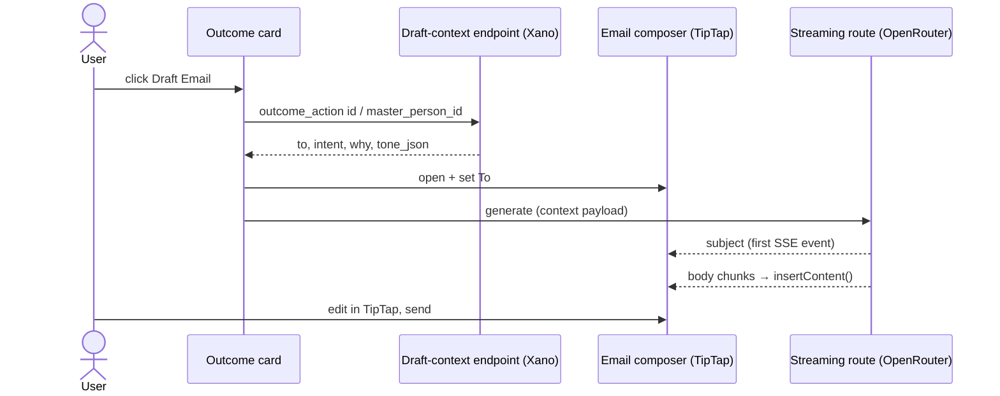

One-click **Draft Email** on outcome suggestions. The user clicks the action, the email composer opens already addressed to the contact, a subject line derived from the outcome's intent and the "why" appears, and an AI-drafted body — written in the user's per-contact email tone — streams into the composer's TipTap editor. The user edits the draft with the full editor (including the existing Tiptap AI menu for tone adjustments) and sends through the normal composer path. Nothing is ever sent automatically.

<Info>
  Scoped 2026-08-11 against the live frontend (`orbiter-frontend`) and Xano workspace `3`. The data model already anticipates this feature — `outcome_action.draft_email` exists and the frontend renders it as an inert badge today. This page is the plan for making it real.
</Info>

## User flow

<Steps>
  <Step title="Click Draft Email">
    On an outcome suggestion that carries a `draft_email` action, the user clicks the **Draft email** action (today an inert badge on `OutcomeAction`; also added to the ContactCard dropdown and the person-card menu — see Surfaces).
  </Step>
  <Step title="Composer opens, addressed">
    The email composer modal opens with the **To** field pre-filled with the contact's email address, resolved from the card's `master_person_id`.
  </Step>
  <Step title="Subject appears">
    A subject line generated from the **intent of the outcome** (`suggestion_request.request_context` / `request_header_title`) plus the **why** (`outcome_suggestion.suggestion_context` / the card's `why`) lands in the subject input.
  </Step>
  <Step title="Body streams in">
    The AI-drafted body — grounded in the requested outcome and the why, voiced with the contact's `email_draft_tone` profile — streams token-by-token into the TipTap editor.
  </Step>
  <Step title="User edits and sends">
    The draft is fully editable in the TipTap editor (Tiptap AI menu included). The composer's existing 2s-debounce autosave persists it via `POST /email-drafts`; sending goes through the normal `POST /email/send` (Nylas) path. The user always sends — never the system.
  </Step>
</Steps>



## What already exists

The feature is half-built into the data model and the composer — the missing pieces are the click handler, one context endpoint, and one streaming generation route.

### Xano

<Card icon="database">

```
outcome_action — 533
```

**The suggested-action row.** Keyed by `outcome_suggestion_id`, with `action_context` (text) and boolean flags `draft_email`, `warm_intro`, `in_app_chat`, `create_outcome`. Served by `GET /outcome-actions` (endpoint `3057`, V2 Suggestions group `MkA4QsNh`). This scope activates the `draft_email` flag; the sibling flags stay separate scopes.

</Card>

<Card icon="database">

```
outcome_suggestion — 531
```

**The suggestion the action hangs off.** Carries the persisted **why** (`suggestion_context`), `panel_description`, `badge`, and `person_node_uuid` → the person. Parent `suggestion_request` (`529`) carries the **intent**: `request_context`, `request_header_title`, `request_panel_title`, and `class_slug` (e.g. `find_investors`).

</Card>

<Card icon="database">

```
email_draft_tone — 752
```

**The per-contact email tone profile**: `contacts_id` + `email_tone_json`. Written today only by the optional `run_email_tone` stage of `mem0/create-memories-from-contact-id-v2` (#13149, `anthropic/claude-opus-4.8`) — user-triggered, dry-run by default, so **coverage is sparse**. Nothing in the frontend reads it yet; this feature is its first consumer. See R8 on [AI Email Features](/guides/open-work/ai-email-features) for where tone capture is headed in the import rebuild.

</Card>

<Card icon="globe">

```
POST /email-drafts — 8157 · POST /email/send — 683
```

**The composer's existing persistence and send path** (Email Composer & Inbox group `58PjJ6J9`). The streamed draft rides the composer's existing autosave (`useCreateDraft`/`useUpdateDraft`, 2s debounce) and the user sends via the normal Nylas send. No new send infrastructure.

</Card>

### Frontend

| Piece | Where | State today |
|---|---|---|
| Inert "Draft email" badge | `src/features/outcomes/components/response-section/outcome-action.tsx`, fed by `use-outcome-actions.ts` (`GET /outcome-actions`) and `outcome-action.ts` schema (`draft_email: z.boolean()`) | Rendered, display-only, no `onClick` — **this becomes the button** |
| OpenUI ContactCard | `src/features/outcomes/openui/components.tsx` — props include `master_person_id`, `person_id`, `why`; dropdown menu (gated on `master_person_id != null`) currently holds only Add to Collection | Second surface for the action |
| Person-card menu | `src/components/global/card-actions-dropdown/active-views/open-work-card-menu-items.tsx` (Add Contact / Add to Collection / Create Leverage Loop / …) | Third surface, same gating pattern as [Outcomes View Menus](/guides/open-work/contextual-menus/outcomes-view-menus) |
| Email composer | `src/features/email-composer/` — `EmailComposerManager` modal opened via `window.postMessage({ target: "EmailComposer", data: { action: "open", activity } })`; zustand singleton `useEmailComposerStore` with `setSubject`, `addManualEmail`, `toggleRecipient`, `restoreFromDraft`, `setOpen` | Open contract has **no `to`/`subject`/`body` payload today** — needs a small extension |
| TipTap editor instance | `composerRefs.editor` (module-level singleton in `use-email-composer-store.ts`) → `NotionEditor`; `ComposerEditor` has a `pendingContentRef` pattern for content that arrives before mount | `editor.commands.insertContent(chunk)` works from anywhere — the streaming insert point |
| Streaming infra | `src/lib/sse-stream.ts`, TanStack AI chat server route (`src/routes/api/tanstack-ai-chat.ts`, `@tanstack/ai` + `@tanstack/ai-openrouter`), copilot fetch-streams | Transport building blocks exist; none wired to email |
| Email resolution | `useMasterEmails(masterPersonId)` → `GET /master-emails` (`{ id, email_address, email_type }[]`); or `myPersonSchema.my_person_emails` (`primary` flag); `adaptContactCard` already normalizes an inline `email ?? email_address ?? primary_email` when the payload carries one | Resolution paths exist |
| Tone in the editor | Tiptap Pro AI menu (`ai-menu.tsx` — `aiTextPrompt({ insert: true, stream: true, tone })`) | Tiptap's canned tones only; **no `email_draft_tone` usage anywhere in the repo** |

## Generation inputs

| Composer field | Source |
|---|---|
| **To** | `master_person_id` → `GET /master-emails`, preferring the contact's primary (`my_person_emails` `primary` flag) when the person is a contact; card-inline `email` as fast path |
| **Subject** | LLM-generated from intent (`request_context` + `request_header_title`) + why (`suggestion_context` / card `why`, run through `splitWhyTag` to strip `[portfolio]`/`[thesis]`-style tags) — emitted as the **first SSE event**, before body chunks |
| **Tone** | `email_draft_tone.email_tone_json` for the contact (`contacts_id`), with a fallback ladder when absent (D5) |
| **Body** | LLM-drafted from: requested outcome (intent), the why, `action_context`, contact identity (name/role/company from the card), sender identity (user name + signature) |

## Build scope

### D1 — Activate the action on three surfaces

Wire the click on: **(a)** the `OutcomeAction` "Draft email" badge (primary — it is the literal one-click action the data model describes), **(b)** a `Draft Email` item in the ContactCard dropdown, **(c)** a `Draft Email` item in `OpenWorkCardMenuItems`. Gating: shown when a resolvable email address exists for the person; disabled with a tooltip ("no email address") otherwise. Follows the same contact-gating conventions as the [Outcomes view menus](/guides/open-work/contextual-menus/outcomes-view-menus).

### D2 — Composer pre-fill contract

Extend the composer's open contract rather than reaching into the store from call sites: `postMessage({ target: "EmailComposer", data: { action: "open", compose: { to, subject, generation } } })`, handled in `EmailComposerManager`, which calls a new batched store action (modeled on `restoreFromDraft`) — `addManualEmail` for the address, `setSubject`, then arms the body stream. Body chunks that arrive before the editor mounts go through the existing `pendingContentRef` pattern so the pre-fill is race-free.

### D3 — Draft-context endpoint (Xano)

One new endpoint in the V2 Suggestions group: given an `outcome_action_id` (or `outcome_suggestion_id` + `master_person_id`), return the full generation payload in one call — resolved email address, contact name/role/company, intent fields off `suggestion_request`, `suggestion_context`, `action_context`, and `email_tone_json` (with which rung of the fallback ladder was used). Keeps the frontend free of join logic and gives the streaming route a single input shape.

### D4 — Streaming generation route

A server route in the frontend (pattern: `src/routes/api/tanstack-ai-chat.ts`) that takes the D3 payload, calls OpenRouter with streaming, and emits SSE: first event = `subject`, then body chunks. The client inserts chunks with `composerRefs.editor.commands.insertContent(chunk)`. **Deliberately not Tiptap Cloud AI** (`aiTextPrompt`) for the generation itself — that streams from Tiptap's cloud with canned tones and would ship outcome context to a third party; the Tiptap AI menu remains available to the user *after* generation for edits. Model choice open (see Open questions); the [copilot AI SDK migration](/guides/archive/ai-sdk-migration) direction makes the TanStack/OpenRouter server-route shape the forward-compatible one.

### D5 — Tone integration with a fallback ladder

First consumer of `email_draft_tone`. Ladder: **(1)** contact's `email_tone_json` when a row exists → **(2)** a neutral, professional default tone spec baked into the prompt. Coverage is sparse today (the tone stage is user-triggered and dry-run by default), so rung 2 is the common path at launch; the [AI Email Features R8 rebuild](/guides/open-work/ai-email-features) moves tone capture into the import pipeline and grows rung-1 coverage over time. The draft-context endpoint reports which rung was used so the UI can (optionally) label the draft "in your tone with `{name}`".

### D6 — Prompt file

The generation prompt lives as a markdown file following the existing convention — `prompts/_shared/draft_email.md`, synced to Xano via `pnpm sync-prompts`. Inputs: intent, why, action context, contact identity, sender identity, tone JSON, plus guardrails (no invented facts, no placeholder brackets left in the body, length target in **words** not characters — LLMs ignore character counts).

## Non-goals (v1)

- **No auto-send.** The system never sends; the user always reviews and clicks send.
- **Single recipient.** One contact per draft; no campaign/bulk drafting (that's `email-outreach`'s lane).
- **`warm_intro` and `in_app_chat`** are sibling flags on `outcome_action` with their own scopes — not built here, but D2–D4 are designed so they can reuse the composer contract and streaming route shape.
- **Leverage loops.** `leverage_loop_action` mirrors the same flags; wiring it up is a fast-follow once the outcomes path works, not part of v1.
- **No new tone-generation pipeline.** v1 only *reads* `email_draft_tone`; growing coverage belongs to the AI Email Features rebuild.

## Open questions

- **Trigger tone on demand?** When a contact has no `email_draft_tone` row, should Draft Email fire the #13149 tone stage in the background so the *next* draft has it — or is that too heavyweight per click?
- **Which address when several?** `GET /master-emails` returns typed addresses (`email_type`); default = contact primary, else first work address? Needs a rule.
- **Non-contact drafting.** The person has a `master_email` but isn't a contact (`my_person` null): draft anyway, or require Add Contact first (the card menus already make that distinction)?
- **Model.** Draft quality vs latency — subject + ~150-word body wants a fast model; tone fidelity may want a stronger one. Decide with a bake-off against real tone profiles.
- **Regenerate affordance.** A "regenerate" button in the composer after the first stream, or is edit-in-editor (plus the Tiptap AI menu) enough for v1?
- **Telemetry.** Mark drafts as AI-generated on the `email-drafts` row (sent-rate of AI drafts is the success metric)?
