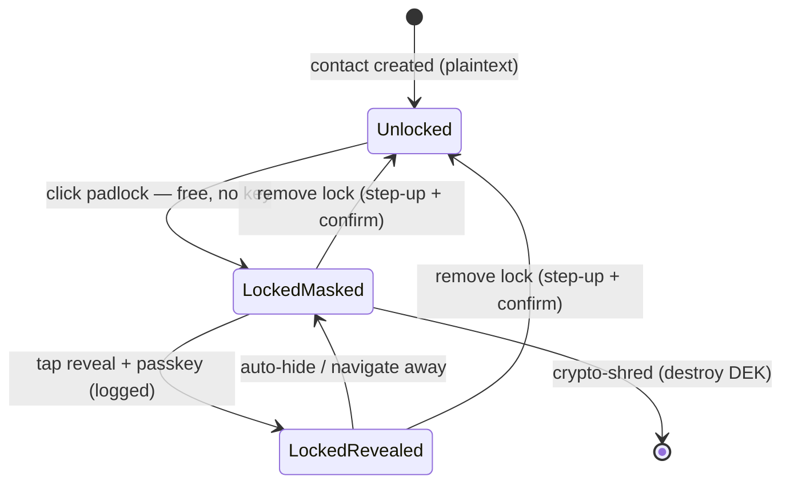

<Note>
  **Status — Open Work.** Design is settled; build is phased (see [Phasing](#phasing)). This page is the working spec for the data layer, backend, and the TanStack/React surface. Naming and the session-window default are still open (see [Open decisions](#open-decisions)).
</Note>

## The problem

The contacts that matter most to a power operator — celebrity cell numbers, private direct lines earned over years — are the ones that end a career if they leak with the operator named as the source. Standard "encrypted at rest" does nothing for this: AlloyDB decrypts transparently for any authorized query, so an attacker with valid app or DB credentials gets plaintext. At-rest encryption protects against a stolen disk, not a breached application.

The fix is **application-layer field encryption plus tokenization**, gated by step-up auth, applied selectively to the crown-jewel fields — not a blanket control that taxes every contact.

## What it does

For a contact field marked sensitive (a VIP phone or email), Orbiter:

- Stores the value as **ciphertext**, never as a readable number in the database.
- Keeps a **token** (not the number) on the graph node, so relationship intelligence keeps working without the live value ever being exposed.
- Requires a **passkey-confirmed reveal** to show the real value — one field, one access, one audit record.
- Supports **crypto-shred**: destroy the key, the value becomes permanently unreadable.

The operator-facing claim: *if Orbiter is breached, your celebrity numbers are ciphertext, not a spreadsheet — and every reveal is logged, so nobody browses your book, not even Orbiter.*

<Info>
  **This is the operator claim, not BYOK.** The solo operator does **not** hold their own key — "only you hold the key" is the enterprise (Atlas) claim. The operator's claim is gated, logged, encrypted, no bulk-read. Keep the two separate; a security reviewer will catch drift. See [the BYOK boundary](#open-decisions).
</Info>

## The padlock — a three-state model

The control is a padlock icon on the contact side panel. A real padlock is **asymmetric** — you snap it shut with no key, but need the key to open it — and that asymmetry *is* the security model. There are three states, not two:



<CardGroup cols={3}>
  <Card title="Locked + masked" icon="lock">
    Closed padlock, value hidden (`•••• ••••`). The resting state for a crown jewel.
  </Card>
  <Card title="Locked + revealed" icon="eye">
    Passkey-confirmed peek. Value shows for that moment, logged. **Padlock stays closed** — data is still tokenized, you just looked through the window.
  </Card>
  <Card title="Unlocked" icon="lock-open">
    Protection actually removed; plaintext returns to the field. Rare, deliberate, gated.
  </Card>
</CardGroup>

<Warning>
  **The footgun: reveal ≠ unlock.** Clicking the closed padlock must **reveal** (state 2), not **unlock** (state 3). If a single click strips protection, an attacker in a live session clicks every padlock open and walks out with the book — the leaked-spreadsheet outcome, delivered by our own UI.

  The rule that matches the physical padlock: **closing is free; peeking needs the key but stays locked; removing the lock is gated and confirmed.** Unlock lives behind a menu action with step-up + a "you sure?" confirm.
</Warning>

## Tiering

Gating is reserved for the crown jewels. If friction bleeds onto ordinary contacts, the product feels broken.

<CardGroup cols={3}>
  <Card title="Tier 0 / 1 — the 95%" icon="address-book">
    Normal contacts and business numbers. **Not tokenized.** Zero friction, zero reveals, renders like any CRM field. Backed by AlloyDB CMEK + TLS + RBAC.
  </Card>
  <Card title="Tier 2 — VIP lines" icon="shield-halved">
    Celebrity / private numbers. Tokenized + field-encrypted + reveal-gated. This page is about Tier 2.
  </Card>
  <Card title="Enterprise — BYOK" icon="key">
    Same crypto spine, but the **tenant** holds the KEK (EKM-backed). Atlas upsell, separate claim. Out of scope here; tracked separately.
  </Card>
</CardGroup>

## Architecture

### Where the data lives

<Tabs>
  <Tab title="AlloyDB">
    Authoritative store for the encrypted field. Holds **ciphertext**, the **wrapped DEK**, the **GCM nonce**, and the **blind index** (HMAC for dedup/linking). The plaintext column on `contacts` is nulled when a field is locked and replaced with a reference to the secret row.
  </Tab>
  <Tab title="FalkorDB">
    Stores only the **token / blind index** on the contact node — never the raw value. Graph traversal, shared-number edges, and suggestions all operate on the token. A breach of the graph yields nothing recoverable.
  </Tab>
  <Tab title="Cloud KMS">
    Holds the **KEK** (key-encrypting key) that wraps per-record DEKs. Separately holds the **blind-index key** (Orbiter-managed, distinct from the KEK — see below). For the enterprise tier, the KEK is EKM-backed.
  </Tab>
  <Tab title="WorkOS">
    Mints the short-lived **step-up session** on a passkey/MFA challenge. The backend demands a valid step-up before it will call KMS unwrap or return plaintext.
  </Tab>
</Tabs>

### Key hierarchy

Two levels. A **per-tenant KEK** lives in Cloud KMS and is the encryption boundary. **Per-record DEKs** (AES-256-GCM via Tink) encrypt each field, are wrapped by the KEK, and stored alongside the ciphertext. The unwrapped DEK caches in app memory with a short TTL; wrap/unwrap is the only operation that touches KMS.

<Info>
  **The blind-index key is decoupled from the KEK — deliberately.** Dedup and shared-number graph linking run on `HMAC(normalize(value))`. If that HMAC used the tenant KEK, revoking the KEK would stall dedup and enrichment. So the blind-index key is **Orbiter-managed in Cloud KMS, separate from the encryption KEK**. Consequence: when a key is revoked the value is unreadable but HMAC matching still works structurally — Orbiter can *confirm two records share a phone* but cannot *recover the phone*. For Tier 2 threat models that's the right trade; it's also the one place the "Orbiter can derive nothing" claim carries an asterisk.
</Info>

Phone numbers are low-entropy, so a deterministic blind index is dictionary-attackable if that column leaks. Mitigate by truncating the HMAC to force collisions, or by treating the index column itself as Tier-2 sensitive and KMS-gating reads.

### The reveal flow

```mermaid
sequenceDiagram
    actor U as Operator
    participant FE as TanStack/React
    participant API as Go Backend
    participant WOS as WorkOS
    participant KMS as Cloud KMS
    participant DB as AlloyDB

    U->>FE: Tap reveal on locked field
    FE->>API: POST /vip/reveal (contact_id, field)
    API->>API: Check active step-up session
    alt No valid step-up
        API-->>FE: 401 step_up_required
        FE->>WOS: Trigger passkey / MFA challenge
        WOS-->>FE: Step-up token
        FE->>API: Retry reveal + step-up token
        API->>WOS: Verify step-up token
    end
    API->>DB: Fetch ciphertext + wrapped_dek + nonce
    API->>KMS: Unwrap DEK (tenant KEK)
    KMS-->>API: Plaintext DEK (cached, short TTL)
    API->>API: AES-256-GCM decrypt
    API->>DB: Write reveal audit row
    API-->>FE: Plaintext — single field, single use
    FE->>U: Display value; padlock stays closed
```

**Step-up session window.** A passkey tap mints a short elevated session (default proposed 5–15 min). Inside the window, reveals don't re-prompt — so working a list of ten artists isn't ten passkey challenges — but **each reveal is still individually logged**. This is the answer to "auth once, get everything": not unlock-all-forever, but a bounded working session, with per-field audit intact. Mental model is Face ID, not a vault you crank open each time.

### What stays intact

Locking does **not** break the graph. On lock, the field moves to ciphertext + blind index; dedup and shared-number edges keep running on the HMAC. A locked contact still links, still dedupes, still surfaces in suggestions — the only change is the field is reveal-gated. Locking is cheap: no intelligence lost.

Locking does **not** scrub the past. If a contact lived as plaintext before being locked, prior backups still hold the plaintext until they age out. Lock protects forward in the live system. The fully-clean version is contacts **born locked** — tokenized at ingestion when the source is a known VIP (see [Open decisions](#open-decisions)).

## Build plan

### 1 — Data layer (AlloyDB)

Two new tables. The secret store and the audit log. `sqlc` + `pgx` per the Go migration.

<CodeGroup>

```sql schema.sql
-- Encrypted VIP field storage
CREATE TABLE vip_contact_secrets (
    id           UUID PRIMARY KEY DEFAULT gen_random_uuid(),
    contact_id   UUID NOT NULL REFERENCES contacts(id) ON DELETE CASCADE,
    tenant_id    UUID NOT NULL,
    field_type   TEXT NOT NULL,            -- 'phone' | 'email'
    ciphertext   BYTEA NOT NULL,           -- AES-256-GCM payload
    wrapped_dek  BYTEA,                    -- DEK wrapped by tenant KEK; NULL = shredded
    nonce        BYTEA NOT NULL,           -- GCM nonce (96-bit, unique per encrypt)
    blind_index  BYTEA NOT NULL,           -- HMAC-SHA256(normalize(value), index_key)
    kek_uri      TEXT NOT NULL,            -- KMS key resource URI used to wrap
    lock_state   TEXT NOT NULL DEFAULT 'locked',  -- 'locked' | 'unlocked'
    locked_at    TIMESTAMPTZ,
    locked_by    UUID,
    created_at   TIMESTAMPTZ NOT NULL DEFAULT now()
);

-- Blind index drives dedup + shared-number linking
CREATE INDEX idx_vip_secrets_blind
    ON vip_contact_secrets (tenant_id, field_type, blind_index);
CREATE INDEX idx_vip_secrets_contact
    ON vip_contact_secrets (contact_id);

-- Append-only reveal / lifecycle audit
CREATE TABLE vip_reveal_audit (
    id          UUID PRIMARY KEY DEFAULT gen_random_uuid(),
    secret_id   UUID NOT NULL,
    contact_id  UUID NOT NULL,
    tenant_id   UUID NOT NULL,
    user_id     UUID NOT NULL,
    action      TEXT NOT NULL,            -- 'reveal' | 'lock' | 'unlock' | 'shred'
    step_up_id  TEXT,                     -- WorkOS step-up session reference
    ip_address  INET,
    user_agent  TEXT,
    occurred_at TIMESTAMPTZ NOT NULL DEFAULT now()
);

CREATE INDEX idx_vip_audit_contact ON vip_reveal_audit (contact_id, occurred_at DESC);
```

```sql contacts-patch.sql
-- Reference from the contact row to its encrypted field(s).
-- Plaintext column is nulled when the field is locked.
ALTER TABLE contacts
    ADD COLUMN phone_secret_id UUID REFERENCES vip_contact_secrets(id),
    ADD COLUMN phone_locked    BOOLEAN NOT NULL DEFAULT false;
```

</CodeGroup>

**Crypto-shred semantics**

- **Per-record (live):** null `wrapped_dek` on the secret row → the DEK is gone, ciphertext is unrecoverable in the live DB. Orbiter does this unilaterally — clean GDPR erasure, no tenant involvement. Does **not** cover backups (the wrapped DEK still sits in snapshots until they age out).
- **Per-tenant (everywhere):** destroy the KEK → every record under it goes dark, *including backups*, because the wrapped DEKs inside them can never be unwrapped again. This is the only mechanism that makes "erased everywhere, including backups" literally true.

Default topology: **per-tenant KEK + per-record DEK** gives both live per-subject shred and tenant-wide backup shred. Per-VIP KEKs are reserved for tenants who contractually demand subject-level *backup* erasure (key sprawl is the cost).

### 2 — Backend (Go)

Use `tink-go` + `tink-go-gcpkms`. Don't hand-roll GCM — nonce-reuse bugs live there. `KmsEnvelopeAead` wraps DEKs through KMS; EKM routing is transparent once the key URI points at an EKM-backed key.

```go service.go (sketch)
// Lock: plaintext field -> ciphertext + blind index + token. No key needed to lock.
func (s *VIPService) Lock(ctx context.Context, contactID uuid.UUID, field, plaintext string) error {
    norm := normalize(plaintext)                       // E.164 for phone
    bi   := s.blindIndex.HMAC(norm)                    // Orbiter-managed index key
    ct, dek, nonce, err := s.envelope.Encrypt(ctx, []byte(plaintext), s.kekURI(tenantOf(ctx)))
    // ... persist secret row, null contacts.phone, set phone_locked=true,
    //     write token (blind index) to FalkorDB node, audit 'lock'
}

// Reveal: requires a valid step-up session. Single field, single use, always audited.
func (s *VIPService) Reveal(ctx context.Context, contactID uuid.UUID, field string) (string, error) {
    if !s.stepUp.Valid(ctx) {
        return "", ErrStepUpRequired                   // -> 401 step_up_required
    }
    sec := s.repo.GetSecret(ctx, contactID, field)
    if sec.WrappedDEK == nil {
        return "", ErrShredded                          // crypto-shredded
    }
    pt, err := s.envelope.Decrypt(ctx, sec.Ciphertext, sec.WrappedDEK, sec.Nonce, sec.KEKURI)
    s.audit.Write(ctx, sec.ID, "reveal", s.stepUp.ID(ctx))
    return string(pt), err
}

// Shred (live): destroy the DEK. Unlock: deliberate, step-up + confirm, re-materializes plaintext.
```

Endpoint surface:

<ResponseField name="POST /vip/lock" type="auth: session">
  Encrypts and tokenizes a field. Free — no step-up required to lock.
</ResponseField>
<ResponseField name="POST /vip/reveal" type="auth: step-up">
  Returns plaintext for one field. `401 step_up_required` if no valid elevated session. Always writes an audit row.
</ResponseField>
<ResponseField name="POST /vip/unlock" type="auth: step-up + confirm">
  Removes protection, returns the field to plaintext. Rare, gated, confirmed.
</ResponseField>
<ResponseField name="POST /vip/shred" type="auth: step-up + confirm">
  Destroys the per-record DEK. Irreversible in the live store.
</ResponseField>

**Operational guardrails.** Rate-limit and alert on decrypt volume — anomalous bulk decrypt is the breach signal. Cache the unwrapped DEK with a short TTL only. The enrichment waterfall (PDL → Proxycurl → …) needs plaintext transiently; make the enrichment service the sole component authorized to dereference and call external APIs, and never write plaintext back to the primary store — rather than widening decrypt rights across general workers.

### 3 — Frontend (TanStack / React)

Component tree on the contact side panel:

```
<VIPField>                     // wraps a sensitive field; renders masked or revealed
 ├─ <PadlockToggle/>           // three-state icon: open / closed-masked / closed-revealed
 ├─ <MaskedValue/>             // •••• rendering when locked + not revealed
 └─ <RevealedValue/>           // shown value + auto-hide timer

Hooks:
  useReveal()                  // TanStack mutation: reveal + step-up challenge handling
  useStepUpSession()           // elevated-session state: isElevated, elevate(), msRemaining
  useLockField() / useUnlockField() / useShredField()
```

Key behaviors:

<Steps>
  <Step title="Padlock click = reveal, not unlock">
    On a closed padlock, the click fires `useReveal()`. **Never** demote to plaintext on a single click. Unlock is a separate menu item wired to `useUnlockField()` behind a confirm dialog.
  </Step>
  <Step title="Reveal handles the step-up round-trip">
    `useReveal()` calls `/vip/reveal`. On `401 step_up_required`, it triggers the WorkOS passkey challenge, then retries with the step-up token. On success, the value renders and an auto-hide timer starts (returns to masked on timeout or navigation).
  </Step>
  <Step title="Session window suppresses re-prompts, not logging">
    `useStepUpSession()` tracks the elevated window. While `isElevated`, subsequent reveals skip the challenge — but each still hits `/vip/reveal` and writes its own audit row. Surface `msRemaining` as a subtle countdown so the operator knows the window is open.
  </Step>
  <Step title="Masked by default, locked is sticky">
    A locked field renders masked on every load. The component never holds plaintext beyond the reveal lifecycle — no plaintext in component state after auto-hide, no plaintext persisted to any client cache.
  </Step>
</Steps>

<Warning>
  **No client-side bulk reveal.** Do not build a "reveal all" affordance, a copy-all, or anything that batches reveals into an export. That capability *is* the breach this feature exists to prevent. The absence is intentional and is itself part of the trust story.
</Warning>

### Phasing

| Phase | Scope | Operator claim |
|-------|-------|----------------|
| **P1** | Manual padlock, per-tenant KEK (Orbiter-managed in Cloud KMS), reveal-on-demand, step-up session, per-record + per-tenant shred, audit log | "Tokenized, encrypted, gated, logged — nobody browses your book, not even Orbiter." |
| **P2** | Born-locked ingestion: auto-tokenize known VIPs at ingest; "this looks high-profile — lock it?" auto-suggest | Forward + backward clean for VIPs onboarded after P2. |
| **P3** | Per-VIP external keys + customer-facing key-lifecycle / reveal-audit dashboard | Subject-level backup erasure; provable access history. |

Rotation is cheap throughout — rotating a KEK rewraps DEKs, it does not re-encrypt data; Tink handles KEK versioning, so it's a background rewrap job, not a migration.

## Open decisions

<AccordionGroup>
  <Accordion title="Session window length — the UX-critical dial">
    Too short and a power operator working a list feels nagged; too long and "step-up" becomes theater. Proposed default 5–15 min; tune from pilot feedback rather than fixing it now. This is the single parameter that determines whether the feature feels secure-normal or clunky.
  </Accordion>
  <Accordion title="Blind-index key ownership">
    Confirmed Orbiter-managed (separate from KEK) so dedup survives KEK revocation. Accept the asterisk: Orbiter can confirm two records share a value but cannot recover it. Decide how literal the marketing claim must be before locking copy.
  </Accordion>
  <Accordion title="Born-locked ingestion (P2)">
    Auto-tokenize at ingest when the source flags a known VIP, avoiding the "plaintext lived in yesterday's backup" gap. Needs a VIP-detection signal — roster match, manual flag, or an enrichment heuristic. Manual padlock ships first; assisted later.
  </Accordion>
  <Accordion title="KEK granularity — per-tenant vs per-VIP">
    Per-tenant KEK + per-record DEK is the default (both live and backup shred covered at their respective levels). Per-VIP KEKs only for tenants who contractually require subject-level *backup* erasure. Don't pay the key-sprawl cost by default.
  </Accordion>
  <Accordion title="BYOK boundary (operator vs enterprise)">
    The operator tier is **not** BYOK — the operator does not hold a key. "Only you hold the key, Orbiter literally cannot decrypt" is the **enterprise/Atlas** claim (EKM-backed tenant KEK). Same crypto spine, two narratives: enterprise buys control of the *key*; the operator buys control of the *reveal*. Keep copy disciplined so the gap never appears on the $100 tier.
  </Accordion>
</AccordionGroup>

## Out of scope (deliberate non-features)

- **Bulk reveal / export of VIP fields** — the capability this feature exists to prevent.
- **At-rest CMEK as the differentiator** — CMEK is the Tier 0/1 baseline; it is instance-scoped and decrypts transparently, so it is not the "Orbiter can't decrypt" control.
- **Enterprise BYOK/HYOK** — tracked separately as the Atlas upsell; this page is the Tier 2 operator surface.
