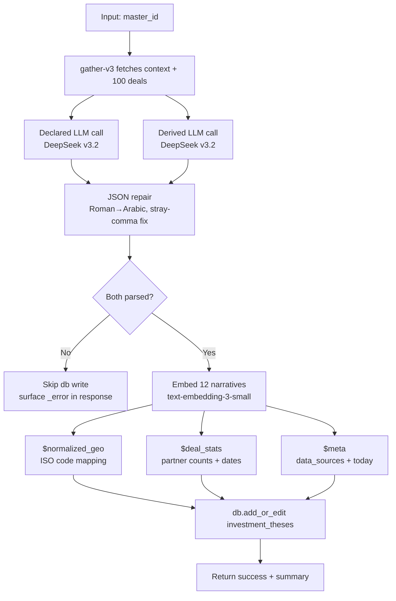
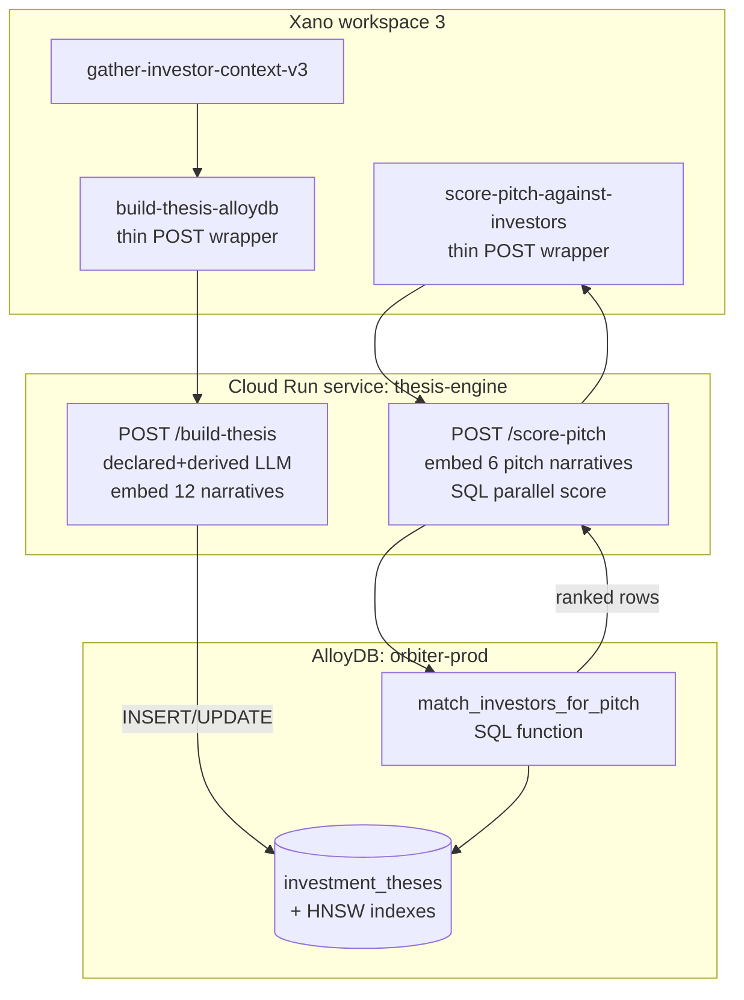

## Description

This outcome type surfaces capital sources for the User's company or fund — angels, VCs, LPs, family offices, corporate VCs, syndicates. The match is built around the User's stage, sector, geography, and check size.

**Best for:** founders raising equity rounds, fund managers raising an LP base, GPs sourcing co-investors for a deal.

**Adjacent outcomes:** [Find investment opportunities](/guides/open-work/suggestion-core-concepts/find-investment-opportunities) for the inverse (deploying capital), [Find a mentor / advisor](/guides/open-work/suggestion-core-concepts/find-mentor-advisor) when the relationship is guidance instead of capital.

## Example Outcomes

Synthesized examples of what a User might create in the AI outcome chat for this type:

### Example 1 — Seed-stage founder, climate-tech

<div style={{padding: '16px', border: '2px solid #6B9FE8', borderRadius: '8px', color: '#fff'}}>

Solo founder raising a \$2M seed for a carbon-accounting platform. Looking for climate-focused angels and pre-seed funds — check sizes \$25K–\$250K. Strongly prefer investors who've already backed at least one carbon/ESG startup so they understand the regulatory tailwinds. SF or NYC based, willing to take Zoom intros.

</div>

### Example 2 — Series B SaaS founder

<div style={{padding: '16px', border: '2px solid #6B9FE8', borderRadius: '8px', color: '#fff'}}>

CEO of a Series A devtools company doing \$6M ARR, planning a Series B in Q3. Looking for growth-stage funds (\$15M–\$30M check size) who've led B rounds in developer infrastructure. Want partners who've held board seats at companies that exited successfully — not just check writers.

</div>

### Example 3 — First-time fund manager

<div style={{padding: '16px', border: '2px solid #6B9FE8', borderRadius: '8px', color: '#fff'}}>

Spinning out of a tier-1 VC to raise a \$25M Fund I focused on AI infrastructure pre-seed. Looking for LPs — family offices and HNW individuals who've backed first-time managers before, plus a couple of fund-of-funds anchors. Need 30+ commitments to hit target.

</div>

## Example with multi-modal file upload

**File uploaded:** 14-slide Series A pitch deck (PDF) with traction, product, and market sections.

<div style={{padding: '16px', border: '2px solid #6B9FE8', borderRadius: '8px', color: '#fff'}}>

Uploading our 14-slide Series A deck. \$8M raise, leading with traction (\$2.4M ARR, 200% YoY) and a defensible technical moat in industrial-robotics simulation. Find lead investors who've written first checks into deep-tech / industrial-AI Series As in the last 18 months — partners who'll engage with the technical thesis on slides 6–9, not just the metrics page. Avoid generalist multi-stage funds that won't board-seat at this stage.

</div>

## Investment Thesis Schema

When surfacing investors for a founder or fund manager, the system matches against **investment thesis profiles** — structured documents that capture an investor's core strategy, stage focus, sector preferences, and deal patterns. This section documents the schema used to represent investor theses, which are extracted from portfolio data, firm bios, and historical investment patterns.

An investment thesis is designed for semantic vector search — it captures not just what an investor invests in, but *why*, allowing the matching engine to find investors whose strategy and conviction align with a founder's specific situation.

### System Prompt for Extraction

Use this system prompt with Claude, Deepseek, or any capable LLM on OpenRouter to extract investment theses from investor context data (YAML, text, or mixed formats).

<Accordion title="Copy-paste System Prompt">

```
You are an investment thesis extraction and synthesis engine. Your job is to transform investor context data into a structured investment thesis format suitable for semantic vector search and matching against startup pitch profiles.

INPUT: Investor context provided as YAML, text, or mixed structured/unstructured data. This may include:
- Firm bios and fund descriptions
- Individual investor bios
- Portfolio company lists with investment dates
- Sector rankings or stated focus areas
- LinkedIn profiles, Crunchbase data, PitchBook info
- Investor websites or pitch deck materials
- News of recent investments

OUTPUT: A single investment_thesis formatted text block (see SCHEMA below).

INSTRUCTIONS:

1. **Extract core intent:** Synthesize the investor's fundamental philosophy from available data. Don't just copy text — identify the underlying thesis connecting their investments.

2. **Use rationale, not just tags:** For each section (sectors, geographies, founder fit), include 1-2 sentences explaining WHY they invest there, based on portfolio patterns or explicit statements.

3. **Infer from portfolio:** If sector focus isn't explicitly stated, analyze their actual investments. Recent investments are more signal than stated focus.

4. **Handle incomplete data gracefully:** Mark sections [INFERRED FROM PORTFOLIO] or [STATED FOCUS] or [INCOMPLETE DATA]. Do not hallucinate.

5. **Stage + Check size:** If investment amounts vary widely, give a range. If their most recent checks are larger, note the trend.

6. **Synthesize founder profile:** Look at:
   - Founder background in portfolio companies (first-time, serial, domain experts)
   - Any diversity/composition signals in their stated preferences
   - Team size they fund (solopreneur vs team)

7. **Recency matters:** If last investment is >2 years ago, note potential inactivity. Recent patterns override historical focus.

8. **Non-fit section:** This is valuable. If they've never invested in certain sectors despite industry overlap, or explicitly avoid something, include it.

CONFIDENCE LEVELS:
- [HIGH] = Multiple sources or clear portfolio evidence
- [MEDIUM] = Stated focus or single source
- [LOW] = Inferred from limited data; needs validation

---

## SCHEMA:

INVESTMENT THESIS: [Investor/Firm Name]

INVESTOR TYPE:
[VC Fund | Angel | Family Office | Corporate VC | PE Firm | Syndicate | Other]
Active Since: [Year] | Current AUM: $[X]M | Fund/Portfolio Size: [X companies]
Confidence: [HIGH | MEDIUM | LOW]

CORE THESIS:
[2-3 sentences on fundamental investment philosophy and opportunity thesis. This is the narrative connecting their investments.]
Confidence: [HIGH | MEDIUM | LOW]

STAGE FOCUS:
Primary: [Seed | Series A | Series B | etc.]
Check Range: $[MIN] - $[MAX]M
Sweet Spot: $[X]M
Lead/Follow Pattern: [Notes on whether they lead rounds, follow selectively, reserve capacity for follow-ons]
Evidence: [e.g., "7 of last 10 investments were Seed-stage between $500K-$2M", or "Stated focus on Series A"]
Confidence: [HIGH | MEDIUM | LOW]

SECTOR & VERTICAL PRIORITIZATION:
1. [Sector] — [1-2 sentence rationale: why they invest here, portfolio evidence or explicit statement]
2. [Sector] — [rationale]
3. [Sector] — [rationale]
[etc., ordered by investment frequency or stated preference]
Confidence: [HIGH | MEDIUM | LOW per sector]

GEOGRAPHIC FOOTPRINT:
Primary: [Regions/Cities]
Secondary: [Regions with some activity]
Thesis: [Notes on why these geographies matter to strategy — e.g., "NYC-based, focuses on founders with East Coast networks", or "International expansion into APAC in last 18 months"]
Confidence: [HIGH | MEDIUM | LOW]

FOUNDER & TEAM PROFILE:
[Characteristics they seek: first-time vs experienced, domain expertise requirements, team size expectations, demographic preferences if any]
Portfolio Evidence: [e.g., "90% of portfolio founders have prior exit", "Average founding team = 2-3 engineers + 1 business co-founder"]
Confidence: [HIGH | MEDIUM | LOW]

VALUE-ADD & DOMAIN EXPERTISE:
[Beyond capital — operational support, network introductions, specific expertise domains, hands-on vs passive investor]
Confidence: [HIGH | MEDIUM | LOW]

COMPANY MATURITY & BUSINESS MODEL FIT:
[Revenue stage expectations, GTM model preferences (B2B vs B2C, marketplace, etc.), unit economics focus, market size requirements]
Portfolio Evidence: [e.g., "Average ARR at investment: $50K-$200K", or "Focus on capital-efficient models"]
Confidence: [HIGH | MEDIUM | LOW]

PORTFOLIO PATTERNS:
Recent Activity: Last Investment: [Date] | Investment Frequency: [X per year] | Momentum: [increasing | stable | declining]
Notable Themes: [Any recent thesis shifts, new sectors, or consistent patterns in recent 12 months]
Concentration: [Diversified across sectors | Concentrated in [sector] | Portfolio size: X companies | Follow-on ratio: X%]
Confidence: [HIGH | MEDIUM | LOW]

NON-FIT / EXCLUSIONS:
[What they explicitly don't fund — e.g., "No pre-revenue companies", "Avoids biotech/hardware", "Won't invest in geographic markets outside US". This is high-signal for filtering.]
Source: [Explicit statement | Inferred from zero investments in category]
Confidence: [HIGH | MEDIUM | LOW]

---
SOURCE DATA:
[List sources: "Crunchbase", "Firm website", "Portfolio list from [source]", "LinkedIn bio", "Recent news/TechCrunch", etc.]

LAST UPDATED: [Date]
NEEDS VALIDATION: [List any fields marked INCOMPLETE DATA or LOW confidence that should be verified with investor]

---

EXECUTION:
Generate the thesis in the schema format above. Use natural language for rationales, but be specific and grounded in actual data. Flag assumptions and confidence levels clearly.
```

</Accordion>

### Recommended Models & OpenRouter Configuration

Use this guide to select an LLM and configure the API call for investment thesis extraction.

#### Model Selection

| Model | Use Case | Cost | Speed | Reasoning | Recommendation |
|-------|----------|------|-------|-----------|-----------------|
| **Deepseek 4** | Production extractions | ~$2-3 / 1M tokens | Moderate | Strongest instruction-following + reasoning; handles incomplete/messy investor data well; synthesizes narrative rationale effectively | **Recommended for final thesis generation** |
| **Deepseek 4 Flash** | Iteration / testing | ~$0.30-0.50 / 1M tokens | Fast | 80% of reasoning at 10x lower cost; excellent for refining prompts and validating schema | **Recommended for prompt development & testing** |
| Grok-3 | Alternative production | Similar to D4 | Moderate | Good structured extraction, strong instruction compliance | Alternative if Deepseek unavailable |
| Claude 3.5 Sonnet | Fallback | Higher | Slower | Reliable but overkill for extraction task; slower iteration | Not recommended |

#### API Configuration for OpenRouter

```json
{
  "model": "deepseek/deepseek-r1:free",  // or "deepseek/deepseek-4" for production
  "messages": [
    {
      "role": "system",
      "content": "[SYSTEM PROMPT FROM ABOVE]"
    },
    {
      "role": "user",
      "content": "[YAML investor context data]"
    }
  ],
  "temperature": 0.3,
  "max_tokens": 3000,
  "top_p": 0.9,
  "frequency_penalty": 0.0,
  "presence_penalty": 0.0
}
```

#### Configuration Recommendations

| Parameter | Value | Rationale |
|-----------|-------|-----------|
| **temperature** | 0.3 | Low temperature keeps extraction factual and grounded; prevents hallucination of missing investor details |
| **max_tokens** | 3000 | Typical thesis is 1200–1800 tokens; 3000 provides headroom for verbose portfolio evidence or lengthy non-fit sections |
| **top_p** | 0.9 | Keeps generation focused; balances determinism with minor variation in phrasing |
| **frequency_penalty** | 0.0 | No penalty needed; repetition of investor names/sectors is appropriate |
| **presence_penalty** | 0.0 | No penalty; allows natural discussion of multiple data sources |

#### Optional Optimizations

- **Prompt Caching** (if using Claude): Cache the system prompt (3KB) to save on repeat extractions across multiple investors
- **Batch Mode** (if processing 100+ investors): Use OpenRouter batch API for 50% cost reduction; slower but ideal for bulk thesis generation
- **Streaming**: Not recommended for structured output validation; use non-streaming for clean JSON/schema extraction

#### Example cURL Call

```bash
curl https://openrouter.ai/api/v1/chat/completions \
  -H "Authorization: Bearer $OPENROUTER_API_KEY" \
  -H "Content-Type: application/json" \
  -d '{
    "model": "deepseek/deepseek-4",
    "temperature": 0.3,
    "max_tokens": 3000,
    "top_p": 0.9,
    "messages": [
      {
        "role": "system",
        "content": "[FULL SYSTEM PROMPT FROM ABOVE]"
      },
      {
        "role": "user",
        "content": "Extract the investment thesis from this investor context:\n\n[YAML INVESTOR DATA]"
      }
    ]
  }'
```

---

## Fundraising Pitch Profile Schema

Complementary to the investment thesis, a **fundraising pitch profile** is extracted from a founder's pitch deck and represents the company/deal being pitched. This profile is vectorized and semantically matched against investor theses to surface relevant capital sources.

Where an investment thesis answers "what am I looking for?", a pitch profile answers "here's what we are" — highlighting the signals investors care about: stage, sector, founder background, problem thesis, GTM, traction, and capital needs.

### System Prompt for Pitch Profile Extraction

Use this system prompt with Claude, Deepseek, or any capable LLM to extract pitch profiles from pitch deck markdown.

<Accordion title="Copy-paste System Prompt — Pitch Profile Extraction">

```
You are a fundraising pitch profile extraction engine. Your job is to transform markdown from a pitch deck into a structured pitch profile format suitable for semantic vector search and matching against investor thesis profiles.

INPUT: Markdown content from a pitch deck. This may include:
- Slide-by-slide deck markdown (problem, solution, traction, team, market, financials, ask)
- Multiple sections covering company overview, product, GTM, metrics, founder bios
- Images described as text (e.g., "chart showing $2.4M ARR, 200% YoY growth")
- Narrative descriptions or speaker notes

OUTPUT: A single fundraising_pitch_profile formatted text block (see SCHEMA below).

INSTRUCTIONS:

1. **Extract founder intent and thesis:** Synthesize the core problem/opportunity the founders are pursuing. What market insight drives this company? Don't just copy; identify the underlying conviction.

2. **Use narrative, not just metrics:** For each section (market problem, GTM, traction), include context about WHY these metrics matter. A $2.4M ARR number is less valuable than "$2.4M ARR from 5 enterprise customers with 95% NRR, expanding into adjacency verticals."

3. **Highlight investor-relevant signals:** Emphasize founder background, prior exits, domain expertise, network advantages, unfair competitive edges, and strategic partnerships. Investors bet on founders.

4. **Infer maturity from traction:** If revenue/customers exist, quantify stage clearly. If only MVP or LOIs, note that explicitly. Avoid assumptions; work from deck content.

5. **Capital raise context:** Extract ask amount, stage, intended use of capital (product, sales, geographic expansion), runway. If cap table complexity is mentioned, note it.

6. **Market thesis:** What is the TAM? What market trend gives them unfair advantage? Is this riding a wave (AI, remote work, vertical SaaS) or solving a timeless problem?

7. **Go-to-market clarity:** B2B vs B2C? Land-and-expand? Marketplace? Viral / product-led growth? Network effects? Sales-driven? This shapes stage and founder fit.

8. **Competitive positioning:** Why this company wins. Is it founder pedigree, proprietary tech, market timing, network effects, or cost structure? Surface the moat.

9. **Handle incomplete decks gracefully:** If financial metrics are missing, note it. Don't fabricate. Mark sections [INCOMPLETE] if critical data is absent from the deck.

CONFIDENCE LEVELS:
- [EXPLICIT] = Clearly stated in deck
- [INFERRED] = Derived from traction data or team bios
- [INCOMPLETE] = Not addressed in deck; needs clarification

---

## SCHEMA:

FUNDRAISING PITCH PROFILE: [Company Name]

COMPANY OVERVIEW:
Sector: [e.g., B2B SaaS, Marketplace, Infrastructure]
Stage: [Idea | MVP | Early Revenue | Growth | Pre-Series A | Series A | etc.]
Founded: [Year] | Headquarters: [Location]
Confidence: [EXPLICIT | INFERRED | INCOMPLETE]

FOUNDER & TEAM PROFILE:
[1-2 sentences on founders: names, prior experience, relevant domain expertise, exits, or notable achievements. Why this team, why now?]
Team Composition: [e.g., "2 co-founders: ex-Stripe engineer (8 years infrastructure) + ex-Salesforce product (6 years enterprise SaaS)"]
Notable Advantages: [Prior company exits, customer relationships, technical moats, network in market, etc.]
Confidence: [EXPLICIT | INFERRED | INCOMPLETE]

PROBLEM & MARKET THESIS:
[2-3 sentences on the core problem they're solving and the market insight. What trend or inefficiency are they exploiting? Why now?]
Target Market: [Who is the customer? Vertical focus, company size, geography, persona]
Market Size Thesis: [TAM if stated; market trend supporting growth]
Competitive Gap: [Why existing solutions fail; what gap they fill]
Confidence: [EXPLICIT | INFERRED | INCOMPLETE]

PRODUCT & SOLUTION:
[Brief description of product/service. What does it do? Key differentiators?]
MVP Status / Differentiation: [Is this a novel technology, new business model, or better execution on known problem?]
Product-Market Fit Signals: [If claimed, what evidence supports it?]
Confidence: [EXPLICIT | INFERRED | INCOMPLETE]

GO-TO-MARKET & BUSINESS MODEL:
[How do they acquire customers? B2B sales, product-led, marketplace, direct, partnerships?]
GTM Model: [Sales-driven | Product-led | Virality | Marketplace | Other]
Unit Economics Evidence: [CAC, LTV, payback period if disclosed; or noted as [INCOMPLETE]]
Business Model: [SaaS subscription | Transactional fee | Licensing | Marketplace take rate | Other]
Confidence: [EXPLICIT | INFERRED | INCOMPLETE]

CURRENT TRACTION & METRICS:
[Quantified metrics from the deck. Be specific: revenue, customers, growth rate, user engagement, pipeline, partnerships.]

Revenue: $[X] ARR | Monthly Growth: [X]% | Runway: [X months]
Customers: [Number] | Customer Concentration: [Top X% revenue from Y customers, or "diversified"]
Growth Trajectory: [e.g., "$0 → $2.4M ARR in 18 months; 200% YoY; expanding into [new vertical]"]
Key Metrics: [Retention, NRR, CAC:LTV, engagement, or other stage-appropriate metrics]
Notable Customer / Partnership Wins: [Any recognizable brands, lighthouse customers, or strategic partners]

Confidence: [EXPLICIT | INFERRED | INCOMPLETE]

CAPITAL RAISE & USE OF FUNDS:
Raise Amount: $[X]M | Stage: [Seed | Series A | Series B | etc.]
Target Check Size from Investors: [e.g., "$500K–$3M sweet spot"]
Use of Capital: [Product development | Sales & marketing | Geographic expansion | Team building | Runway]
Runway Before Raise: [X months] | Runway Post-Raise: [X months or path to profitability]
Confidence: [EXPLICIT | INFERRED | INCOMPLETE]

COMPETITIVE POSITIONING & MOAT:
[What makes this company defensible? Is it founder pedigree, network effects, proprietary data, switching costs, technical innovation, or market timing?]
Unfair Advantages: [List 2-3 specific competitive edges]
Incumbent Response Risk: [How vulnerable to competition from larger players or new entrants?]
Confidence: [EXPLICIT | INFERRED | INCOMPLETE]

MARKET TRENDS & TAILWINDS:
[What macro or industry trends support this company? AI adoption, remote work, vertical SaaS explosion, regulatory change, etc.]
Timing Thesis: [Why is this the right moment for this company to succeed?]
Confidence: [EXPLICIT | INFERRED | INCOMPLETE]

FUNDING HISTORY & CAP TABLE COMPLEXITY:
[Prior rounds, investor names, any complex cap table issues or governance concerns]
Prior Investors: [List if disclosed; useful for signaling and social proof]
Cap Table Notes: [Any red flags or complexity noted in deck?]
Confidence: [EXPLICIT | INFERRED | INCOMPLETE]

FOUNDER ASK & INVESTOR FIT SIGNALS:
[Beyond capital, what is the founder looking for? Board seat, specific expertise, customer introductions, follow-on commitments?]
Explicit Investor Preferences: [Any mention of preferred investor profiles, geographies, or partner types?]
Implicit Investor Fit Signals: [e.g., "Deep enterprise expertise needed", "Founded by ex-Google team, seeking operators familiar with scale"]
Confidence: [EXPLICIT | INFERRED | INCOMPLETE]

RISKS & UNKNOWNS:
[What concerns might a skeptical investor have? Market risk, execution risk, founder risk, regulatory risk, competition, burn rate?]
Addressed in Deck: [Which risks does the founder acknowledge and have a plan for?]
Not Addressed: [Gaps or risks the deck doesn't cover]
Confidence: [EXPLICIT | INFERRED | INCOMPLETE]

---
DECK QUALITY & COMPLETENESS:
[Overall assessment: Is this a polished Series A pitch with financial models, or an early-stage founder presenting MVP? Affects investor stage alignment.]
Slide Count: [X] | Includes Financial Projections: [Yes | No] | Includes Cap Table: [Yes | No]
Notable Omissions: [If critical sections are missing (team, financials, ask), note here]

---
SOURCE DATA:
[Source: Pitch deck markdown | Date deck provided: [Date] | Deck version: [if mentioned]]

CONFIDENCE NOTES:
[Summary of confidence levels; any sections requiring founder clarification for accurate matching]

---

EXECUTION:
Generate the profile in the schema format above. Use narrative language grounded in deck content. Flag assumptions and confidence levels clearly. Emphasize signals that investors evaluate: founder pedigree, market timing, traction, GTM clarity, defensibility.
```

</Accordion>

### Example: Orbiter.io (Relationship Intelligence, Seed pitch)

```
FUNDRAISING PITCH PROFILE: Orbiter.io

COMPANY OVERVIEW:
Sector: B2B SaaS (Relationship Intelligence / Applied AI)
Stage: Seed (Pre-revenue, controlled beta pilots)
Founded: 2024 | Headquarters: San Francisco, CA
Confidence: EXPLICIT

FOUNDER & TEAM PROFILE:
Co-founders: Josh Diamond (CEO) + Jason Diamond (CPO) + Mark Pederson (CTO).
Josh: Frame.io GTM leader (pre-$1.3B Adobe acquisition); Emmy-winning filmmaker; XR/VR pioneer with proven network-effect adoption expertise; shipped products used by Meta, HBO, Sesame Street, Volvo, PGA.
Jason: Serial media-tech entrepreneur; founded/led OFFHOLLYWOOD (exited to Vitec Vivendum); co-founder Colourlab AI (first AI-driven color grading platform).
Mark: CTO with infrastructure & graph database expertise.
Why this team, why now: Two founders with exits in media/tech + GTM playbook from venture-scale products. Jason brings AI/product chops; Josh brings GTM + network credibility. Timing: AI agents + relationship intelligence are converging.
Notable Advantages: Frame.io alumni network (1000+ creative professionals); direct relationships with media/entertainment decision-makers; proven ability to ship network-effect products; advisor network includes John Traver (Frame.io founder), Kyle Jackson (5x founder, ex-Cornerstone OnDemand), Bilawal Sidhu (TED curator, ex-Google Maps PM).
Confidence: EXPLICIT

PROBLEM & MARKET THESIS:
Everything meaningful in someone's life started with a person. Yet CRMs and relationship intelligence apps track *contacts*, not *relationships*. Your network is your most valuable asset, but nothing manages it. Users lose deals to someone who knew someone; networks decay silently; pre-meeting prep takes 45 minutes (Google + LinkedIn + 3 text messages) to remember how you know someone and why they matter.
Target Market: High-signal professional connectors (dealmakers, founders, executives, creators) in media, technology, venture/PE initially. Expanding to deal economy (VCs, M&A advisors, creative agencies) and eventually mass affluent networks.
Market Size Thesis: Phase 1 beachhead: 50K addressable (media/tech connectors) → $15MM ARR potential. Phase 2 (dealmakers/agencies): 200K addressable → $100MM ARR. Phase 3 (global leadership class): 5M+ addressable → $1.2B+ ARR potential.
Competitive Gap: Existing solutions (Goodword, Affinity, Clay, Rings AI) are either networking co-pilots or CRM with bolted-on AI. Orbiter *understands relationships* — not just contacts. It compounds intelligence across email, calendar, LinkedIn, meeting context. Privacy-first dual-layer model (public master graph + private personal graph) solves the "who knows who" problem without exposing PII.
Confidence: EXPLICIT

PRODUCT & SOLUTION:
Relationship intelligence platform that automatically maps and activates your entire network. Integrates with email, calendar, LinkedIn, and other data sources to build a living graph of every relationship. Core use cases:
- "Who can intro me to Head of BD at Spotify?" → finds warm path through your network with context
- "My friend's son wants UCLA mentorship" → surfaces 5 people in your network with LA ties, ranks by relationship strength
- "Sally is raising a fund" → identifies 3 strategic intro candidates aligned with her thesis
- Proactive: flags when a contact just became VP of Partnerships at company on your radar

Product differentiators: Real-time relationship mapping (not static contact lists); compounding intelligence (relationships strengthen as context accumulates); inverse network effects (your network becomes more valuable over time); privacy-first architecture (personal graph stays on device).
MVP Status: Live in controlled beta with HBO, SXSW (AI on Lot), Rochester Institute of Technology. Processing real relationship data; handling meaningful invitation flows.
Product-Market Fit Signals: Invite-only model creating scarcity/FOMO; 3 invites per user generating 1.5-2x viral coefficient; high-value users naturally inviting other high-value users (self-selecting quality growth).
Confidence: EXPLICIT

GO-TO-MARKET & BUSINESS MODEL:
Launch strategy: Three-phase rollout to prove thesis and acquire lighthouse customers before public launch.
- Phase 1 (Beta 1, 60 days): Controlled pilots with strategic partners (HBO, SXSW, AI on Lot, RIT) — invite-only deployment; onboarding begins at close.
- Phase 2 (Beta 2, 60 days): Prove metrics — measure activation rate, engagement/retention, generate 3 referenceable case studies, validate unit economics; emerge from stealth.
- Phase 3 (Public Launch): V1 public launch; pilot partner logos; GTM playbook (leveraging Notion, Figma, Linear, Superhuman as distribution templates).

GTM Model: Invite-only + network effects + organizational deals. Land with high-signal individual users (founders, executives, VCs); they invite peers; network effects compound. Organizational deals (portfolio companies, agencies, talent networks) add batch revenue.
Unit Economics: Pricing $149/month (founding rate; implied $X margin not disclosed in deck). Comparable pricing: Bloomberg Terminal $2,000/mo (325K+ subscribers), ZoomInfo Enterprise $250/mo ($1.2B revenue 2024), Claude Max $100+/mo ($14B+ total ARR). Model: Premium SaaS with strong unit economics + organizational expansion.
Business Model: SaaS subscription ($149/month individual; org pricing TBD). Viral loop: Each user generates ~3 invites (1.5-2x viral coefficient). Organizational deals (teams, companies) unlock batch deployments. Network effects create defensibility (your graph becomes more valuable as more people join).
Confidence: EXPLICIT (pricing, GTM phases); INFERRED (unit economics, exact org pricing)

CURRENT TRACTION & METRICS:
Revenue: $0 ARR (pre-revenue, controlled beta)
Customers: 3 strategic pilot partners (HBO, SXSW/AI on Lot, Rochester Institute of Technology) — invite-only beta; onboarding at close
Growth Trajectory: Product launched Beta 1 (early 2024); now in pilot phase with committed enterprises; Beta 2 launching 60 days post-close (prove metrics, 3 case studies); public launch timed for Q4 2024 / Q1 2025
Key Metrics: Viral coefficient 1.5-2x from invite-only launch; strategic partner logos (HBO is Fortune 500 validation); advisory network includes category-defining founders (Traver from Frame.io) and AI leaders (Sidhu, TED curator)
Notable Customer / Partnership Wins: HBO (major media conglomerate; validates product-market fit in high-signal professional networks); SXSW partnership (AI track + industry connectors); Rochester Institute of Technology (education + emerging talent)
Confidence: EXPLICIT (on pilot status, advisory); INFERRED (on viral metrics, which are projected post-launch)

CAPITAL RAISE & USE OF FUNDS:
Raise Amount: $4M Seed | Stage: Seed
Target Check Size: Not explicitly stated; implied $500K–$2M leads
Use of Capital: 60% Engineering & Infrastructure (scale graph, real-time sync, privacy layer); 25% GTM (community building, partnerships, case study marketing); 15% Operations (legal, compliance, hiring)
Runway: 18 months pre-launch (extended by revenue post-launch)
18-Month Milestone (Conservative Projection): $5MM ARR with 3,350 seats by month 18 (i.e., average $149/mo per seat = implied 3,350 users + organizational expansion)
Confidence: EXPLICIT

COMPETITIVE POSITIONING & MOAT:
Unfair Advantages:
1. Founder pedigree: Josh & Jason shipped network-effect products at scale (Frame.io); proven they can execute GTM + product in competitive markets.
2. Dual-layer graph architecture: Separate public master graph (companies, board seats, funding — like a "Wikipedia of professional relationships") from private personal graph (your emails, calendar, relationship gravity scores). Competitors either solve for public data or private data; Orbiter compounds both.
3. Network effects and switching costs: As your graph enriches (more relationships, more context, more intros facilitated), it becomes harder to leave. First mover in "relationship intelligence" (not just CRM or networking).
4. Strategic advisors with distribution: John Traver (Frame.io founder) can open doors in media; Kyle Jackson brings VC/dealmaker credibility; Bilawal Sidhu brings AI/creator credibility.

Defensibility: Network effects compound as more users join (your network is more valuable with more connections). Privacy-first approach creates trust advantage over competitors mining public data. Relationship intelligence becomes a category (like CRM or email) with potential for incumbency.
Incumbent Response Risk: Moderate. Slack, Microsoft, Salesforce could theoretically build this; however, it requires: (1) relationship understanding (harder than adding AI to contacts), (2) privacy-first architecture (not their current model), (3) GTM in high-signal networks (not their strength). Unlikely to be a priority for incumbents until Orbiter proves the market.
Confidence: EXPLICIT (on founder pedigree, advisor network, moat); INFERRED (on competitive threat from incumbents)

MARKET TRENDS & TAILWINDS:
Macro tailwinds:
1. AI agents + relationship understanding: LLMs enable semantic search over relationship networks (previously impossible with keyword search).
2. Distributed work: Remote work made relationship decay worse (no serendipitous office encounters); tools to maintain networks became critical.
3. Deal economy acceleration: VC/PE/M&A activity drives demand for warm intros and deal sourcing (Orbiter solves this).
4. Privacy-first computing: Users demand products that respect their data; Orbiter's dual-layer model is future-proof (vs. competitors mining all data).

Timing Thesis: "AI agents are becoming the interface to your network. Companies are raising capital faster and doing more deals. People need a relationship operating system, not a contact list."
Confidence: EXPLICIT

FUNDING HISTORY & CAP TABLE COMPLEXITY:
This is a Seed round (first institutional raise); no prior VC funding disclosed. Early backers (friends & family, advisors) noted: John Traver, Kyle Jackson, Bilawal Sidhu are early investors + board advisors (adds credibility and strategic value beyond capital).
No unusual cap table complexity noted in deck.
Confidence: EXPLICIT

FOUNDER ASK & INVESTOR FIT SIGNALS:
Explicit signals: Seeking Seed investors who understand network effects, AI/infrastructure, and can help with GTM in high-signal professional networks (media, venture, dealmaking).
Implicit signals: Founders want investors who've built venture-scale products (not just returned capital). Frame.io alumni network + Traver's involvement suggest preference for operators who can open doors in entertainment/media. Bilawal's presence (TED, AI) signals comfort with creators/AI community.
Confidence: INFERRED (from team composition and advisor network; not explicitly stated in deck)

RISKS & UNKNOWNS:
Market Risks: 
- Will high-signal professionals (already well-networked) adopt a tool for managing relationships? (Counter: HBO pilot + SXSW interest suggest yes)
- Privacy regulations (GDPR, CCPA) could complicate email/calendar integration at scale
- Competitive response: Salesforce, LinkedIn, or Slack could copy this quickly

Execution Risks: 
- Scaling from 3 pilots to 50K+ users while maintaining product quality
- Privacy/compliance infrastructure at scale (storing relationship metadata)
- GTM: Invite-only model is great for early traction but slow path to scale

Founder Risk: 
- Josh and Jason are proven; Mark's background less visible in deck (CTO hiring/retention could matter)
- First Seed raise — team hasn't managed institutional capital before

Addressed in Deck: 
- Privacy risk mitigated by dual-layer architecture (explained clearly)
- Go-to-market risk mitigated by 3 strategic pilots + advisor network for distribution
- Timing risk mitigated by credible macro trends (AI, deal economy, distributed work)

Not Addressed: 
- Competitive response strategy (what if Salesforce copies this?)
- International expansion (US-first strategy not explicitly stated, but implied)
- Churn risk for invite-only model (when product becomes less exclusive, will viral loop break?)
- Path to $5MM ARR (3,350 seats * $149 = implies strong org deals or land-and-expand story not detailed)

Confidence: EXPLICIT (on addressed risks); INFERRED (on unaddressed gaps)

---
DECK QUALITY & COMPLETENESS:
Assessment: Polished Seed pitch with strong problem/solution clarity and credible founder/advisor team. 15 slides; includes co-founder bios, advisor profiles, system logic, competitive positioning, launch timeline, unit economics, and capital ask. Missing: detailed go-to-market timeline (exact partner announcement dates), customer acquisition strategy post-Beta 2, and cap table / option pool details.

Financial Projections: Yes — Year 0 (Beta, $0 ARR) → Year 1 (Month 18: $5MM ARR, 3,350 seats) — conservative
Cap Table: Not shown; but early investors (Traver, Jackson, Sidhu) disclosed
GTM Playbook: Mentioned (Notion, Figma, Linear, Superhuman) but not detailed
Traction: 3 pilot customers (strong signal); viral coefficient projected (1.5-2x)

Notable Omissions: Exact customer acquisition cost assumptions; detailed org expansion strategy; timeline for moving from invite-only to broader market; international expansion thesis; churn assumptions.

---
DECK QUALITY & COMPLETENESS:
Assessment: Compelling early-stage pitch with exceptional founder pedigree and advisor network. Deck quality is high — visually polished, clear narrative arc (problem → solution → market → team → ask). Problem is emotionally resonant (relationships matter; networks decay). Solution is differentiated (compounds vs. extracts). Market is large and stratified (beachhead → expansion → scale). Team has proven exits and distribution.

Slide Count: 15 | Includes Financial Projections: Yes (conservative) | Includes Cap Table: No | Includes Detailed GTM Timeline: Partial
Strategic Positioning: Strongly positioned as "relationship operating system" in era of AI agents + distributed work

---
SOURCE DATA:
Orbiter.io Seed deck (15 slides, PDF) | Version: v6 | Date: March 31, 2026

CONFIDENCE NOTES:
HIGH confidence on problem, solution, founder background, advisor network, launch strategy, and market thesis. EXPLICIT on traction (3 pilots), pricing ($149/month founding rate), ask ($4MM), and runway (18 months). INCOMPLETE on unit economics details (exact CAC, LTV, org pricing), cap table breakdown, and detailed post-Beta 2 GTM playbook. INFERRED viral coefficient (1.5-2x) and $5MM ARR milestone (implied by 3,350 seats projection). 

Recommend founder call to clarify: (1) exact CAC assumptions and customer acquisition timeline post-Beta 2, (2) organizational deal strategy (is this land-and-expand, or dedicated org sales?), (3) international expansion timeline (US-only launch or global from day one?), (4) churn risk mitigation for invite-only → open model transition.

KEY INVESTOR FIT SIGNALS:
- Investors with network-effect portfolio (Sequoia, a16z, Initialized, Greylock)
- Media/entertainment-focused funds (MOffett Ventures, Notation)
- Operator-led funds (looking for team pedigree over market timing)
- Investors in portfolio companies that could be early customers (VC-backed founders, agencies, talent networks)
```

### Example: ClimateFlow (Climate-Tech SaaS, Series A pitch)

```
FUNDRAISING PITCH PROFILE: ClimateFlow

COMPANY OVERVIEW:
Sector: B2B SaaS (Climate/ESG Tech)
Stage: Series A (Pre-revenue transitioning to early revenue)
Founded: 2022 | Headquarters: San Francisco, CA
Confidence: EXPLICIT

FOUNDER & TEAM PROFILE:
Co-founders: Dr. Priya Sharma (ex-Stripe, carbon accounting API lead; PhD in environmental science) 
+ Marcus Chen (ex-Shopify, GTM lead for Shopify Sustainability; 8 years enterprise SaaS). 
Why this team: Domain expertise + enterprise sales playbook. Prior exit: Priya led carbon API at Stripe 
(acquired as part of sustainability push); Marcus scaled Shopify Sustainability to $10M+ ARR.
Team Composition: 5-person team; CTO is ex-Google Climate (4 years infrastructure)
Notable Advantages: Former Stripe/Shopify relationships with enterprise CTOs; direct access to ESG compliance 
officers through prior network; technical credibility in carbon accounting standards.
Confidence: EXPLICIT

PROBLEM & MARKET THESIS:
Fortune 500 companies face regulatory pressure (SEC climate disclosure rules, EU taxonomy, state-level 
carbon taxes) and need accurate carbon accounting for Scope 1/2/3 emissions. Existing solutions are 
fragmented (spreadsheets + consulting) or expensive legacy platforms ($500K+/year). ClimateFlow provides 
real-time, automated carbon accounting built for modern software stacks.
Target Market: Mid-market to enterprise (1000-10,000 employee companies); focus on finance/sustainability ops teams
Market Size Thesis: $5B+ TAM in carbon accounting software alone; ESG tech market growing 40%+ YoY driven by 
regulatory tailwinds (SEC, EU). Priya's thesis: "Carbon accounting will be as standard as financial accounting 
within 3 years."
Competitive Gap: Existing solutions are point-in-time reports. ClimateFlow is real-time, API-first, integrates 
with ERP/billing systems.
Confidence: EXPLICIT

PRODUCT & SOLUTION:
SaaS platform that connects to a company's financial systems (Stripe, Salesforce, Google Analytics, Workday) 
and automatically calculates Scope 1/2/3 carbon emissions using regulatory methodologies (GHG Protocol, ISO 14064).
MVP Status: Live with 2 pilot customers (Notion, GitLab); handling real $M-scale transaction volumes.
Differentiation: Only platform that auto-calculates Scope 3 from billing data (previously manual or impossible 
without consulting); built for engineers (API-first, webhooks, real-time).
Confidence: EXPLICIT

GO-TO-MARKET & BUSINESS MODEL:
Land-and-expand: Target sustainability/finance leads at large companies; expand to become source of truth 
for carbon reporting across organization. Initial deals through warm intros (Stripe/Shopify alumni network).
GTM Model: Sales-driven (Marcus leading); product-led secondary (freemium tier for SMBs).
Unit Economics: Not disclosed in deck; [INCOMPLETE]
Business Model: SaaS subscription ($5K–$50K/month based on company size and data volume); per-transaction 
fees for high-volume customers.
Confidence: EXPLICIT (except unit economics)

CURRENT TRACTION & METRICS:
Revenue: $0 ARR (pilot customers pre-revenue; expect Series A → $500K ARR by month 12)
Customers: 2 pilot logos (Notion, GitLab) paying in-kind via technical feedback
Growth Trajectory: Launched MVP Jan 2024; pilot deals signed March 2024; pre-revenue but strong 
founder networks opening doors with 10+ enterprise prospects.
Key Metrics: Pilot customers handling 50M+ transactions/month; 99.9% uptime in production; 
integration time ~2 weeks per new customer.
Notable Customer Wins: Notion and GitLab (both tier-1 engineering brands; Notion is ESG-conscious).
Confidence: EXPLICIT (on pilot metrics); INFERRED (on upcoming revenue trajectory)

CAPITAL RAISE & USE OF FUNDS:
Raise Amount: $3M Series A | Stage: Series A
Target Check Size: $500K–$1.5M leads; $100K–$500K participation
Use of Capital: 40% Sales & Marketing (hiring GTM team, analyst relations for ESG space); 
30% Product (expanding integrations, advanced reporting); 20% Infrastructure (scale to 1000+ customers); 
10% Runway
Current Runway: 12 months (pre-raise); Post-raise runway: 20+ months (goal is cash-flow positive by month 18)
Confidence: EXPLICIT

COMPETITIVE POSITIONING & MOAT:
Unfair Advantages: 
1. Founder pedigree in both carbon accounting (Stripe API) and enterprise SaaS (Shopify). 
2. Data moat: Real-time emissions data from 1000+ companies builds proprietary methodologies over time.
3. Network: Direct relationships with Stripe, Shopify, Notion GTM teams for early customer acquisition.
Defensibility: High switching costs once embedded in finance/reporting workflows; regulatory tailwinds mean 
competitors must keep up with changing standards.
Incumbent Response Risk: Low. Legacy competitors (Sustainalytics, Persefoni) are slow-moving; 
consulting firms won't build software. Major cloud providers (AWS, Azure) unlikely to build carbon accounting 
specifics; would rather partner.
Confidence: INFERRED (based on market positioning, not explicit competitive analysis in deck)

MARKET TRENDS & TAILWINDS:
Macro tailwinds: SEC climate disclosure rules (effective 2026 for large cap); EU Corporate Sustainability 
Reporting Directive (CSRD); 150+ countries with carbon pricing / tax schemes; internal corporate net-zero 
commitments (Apple, Microsoft, Amazon require suppliers to track emissions).
Timing Thesis: "Regulatory pressure just shifted from 'nice to have' to 'mandatory' in 2024. Every public 
company and large private company will need this in 18 months. We're 12 months ahead of the compliance rush."
Confidence: EXPLICIT

FUNDING HISTORY & CAP TABLE COMPLEXITY:
Seed funding: $800K from Lowercarbon Capital, Pale Blue Dot, Y Combinator (S23 batch). 
No unusual cap table complexity noted.
Current Cap Table: ~8% dilution expected post-Series A; founder ownership post-raise estimated 65%.
Confidence: EXPLICIT

FOUNDER ASK & INVESTOR FIT SIGNALS:
Explicit signals: "Looking for investors with prior exits in climate/ESG or deep enterprise SaaS experience. 
Board seat preferred; active GTM partnership."
Implicit signals: Early founders still in hands-on mode; seeking board advisors with Stripe/Salesforce 
board experience, or climate experts (likely interested in operational help, not just capital).
Confidence: EXPLICIT

RISKS & UNKNOWNS:
Market Risks: Regulatory timelines uncertain (SEC rules could shift); customer adoption of automated 
solutions vs continuing with manual/consulting-led approaches.
Execution Risks: Rapid scaling of team from 5 → 15; hiring GTM talent in competitive market.
Founder Risk: First-time founder CEO (Priya); Marcus is experienced GTM lead, but building a company 
from scratch is different from leading GTM at scale.
Addressed in Deck: Yes — Priya positioned as having built products at scale (Stripe); Marcus has playbook 
for enterprise scaling. Board advisor from Stripe committed to help.
Not Addressed: Cap table breakdown (who owns equity %), exact path to profitability, international 
expansion strategy (EU market is 2x US market for CSRD compliance).
Confidence: INFERRED

---
DECK QUALITY & COMPLETENESS:
Assessment: Polished Series A pitch with strong problem/solution clarity. 18 slides; includes customer 
testimonials, product demo, financial model (somewhat vague on exact unit economics). Missing: detailed 
go-to-market timeline, competitive landscape, cap table breakdown.
Financial Projections: Yes (Year 1: $500K; Year 2: $3M; Year 3: $8M ARR)
Cap Table: Founders + major shareholders listed, not full breakdown.
Notable Omissions: Unit economics on pilot customers (CAC, LTV), customer concentration (are Notion/GitLab 
the only pilots?), international expansion thesis.

---
SOURCE DATA:
Pitch deck (18 slides, PDF) | Date: April 2026 | Version: Series A Roadshow v3

CONFIDENCE NOTES:
HIGH confidence on founder background, stage, market thesis, and regulatory tailwinds. MEDIUM confidence 
on traction (pilots are strong signal but pre-revenue). INCOMPLETE on unit economics, customer acquisition 
costs, and exact product roadmap. Recommend founder call to clarify: (1) exact CAC/LTV on pilots, (2) 
sales cycle length for enterprise deals, (3) international expansion priority vs US-first.
```

### How Pitch Profiles Match Against Investor Theses

When a founder uploads a pitch deck:

1. **Extract pitch profile** using the above system prompt
2. **Vectorize the pitch profile** — semantically embed the narrative sections (problem thesis, GTM, traction, founder background)
3. **Search against investor thesis vectors** — find investors whose strategy aligns:
   - Investor thesis: "Seed-stage climate tech, $1-3M checks, founder-market fit on carbon compliance"
   - Pitch profile: "Series A, but founded by ex-Stripe engineer; $3M raise targeting $500K–$1.5M leads"
   - **Match signal:** Stage mismatch (Series A vs Seed), but founder pedigree and check size overlap strongly
4. **Rank by signal relevance** — seed-focused investors ranked lower despite other fit; climate investors with B2B enterprise focus rank higher
5. **Surface rationales** — founder sees "Climate-focused VC with enterprise SaaS expertise seeking founder-market fit on regulatory tailwinds" rather than just "match score: 0.87"

---

### Full Schema

```
INVESTMENT THESIS: [Investor/Firm Name]

INVESTOR TYPE:
[VC Fund | Angel | Family Office | Corporate VC | PE Firm | Syndicate | Other]
Active Since: [Year] | Current AUM: $[X]M | Fund/Portfolio Size: [X companies]
Confidence: [HIGH | MEDIUM | LOW]

CORE THESIS:
[2-3 sentences on fundamental investment philosophy and opportunity thesis. 
This is the narrative connecting their investments.]
Confidence: [HIGH | MEDIUM | LOW]

STAGE FOCUS:
Primary: [Seed | Series A | Series B | etc.]
Check Range: $[MIN] - $[MAX]M
Sweet Spot: $[X]M
Lead/Follow Pattern: [Notes on whether they lead rounds, follow selectively, 
reserve capacity for follow-ons]
Evidence: [e.g., "7 of last 10 investments were Seed-stage between $500K–$2M"]
Confidence: [HIGH | MEDIUM | LOW]

SECTOR & VERTICAL PRIORITIZATION:
1. [Sector] — [1-2 sentence rationale grounded in portfolio evidence or explicit thesis]
2. [Sector] — [rationale]
3. [Sector] — [rationale]
Confidence: [HIGH | MEDIUM | LOW per sector]

GEOGRAPHIC FOOTPRINT:
Primary: [Regions/Cities]
Secondary: [Regions with some activity]
Thesis: [Notes on why these geographies matter to strategy]
Confidence: [HIGH | MEDIUM | LOW]

FOUNDER & TEAM PROFILE:
[Characteristics they seek: first-time vs experienced, domain expertise, team composition]
Portfolio Evidence: [Actual patterns from their investments]
Confidence: [HIGH | MEDIUM | LOW]

VALUE-ADD & DOMAIN EXPERTISE:
[Beyond capital — operational support, network, hands-on vs passive]
Confidence: [HIGH | MEDIUM | LOW]

COMPANY MATURITY & BUSINESS MODEL FIT:
[Revenue stage, GTM model preferences, unit economics focus]
Portfolio Evidence: [e.g., "Average ARR at investment: $50K–$200K"]
Confidence: [HIGH | MEDIUM | LOW]

PORTFOLIO PATTERNS:
Recent Activity: Last Investment: [Date] | Frequency: [X per year] | Momentum: [increasing | stable | declining]
Notable Themes: [Recent thesis shifts or consistent patterns]
Concentration: [Diversified | Concentrated in [sector] | Follow-on ratio: X%]
Confidence: [HIGH | MEDIUM | LOW]

NON-FIT / EXCLUSIONS:
[What they won't fund — explicit exclusions or sector gaps despite industry relevance]
Source: [Explicit statement | Inferred from zero investments]
Confidence: [HIGH | MEDIUM | LOW]

SOURCE DATA: [List sources: Crunchbase, firm website, portfolio list, LinkedIn, etc.]
LAST UPDATED: [Date]
NEEDS VALIDATION: [Any fields marked INCOMPLETE or LOW confidence]
```

### Example: Cowboy Ventures (Early-Stage VC)

```
INVESTMENT THESIS: Cowboy Ventures

INVESTOR TYPE:
VC Fund
Active Since: 2012 | Current AUM: $93.3M | Fund/Portfolio Size: 40+ companies
Confidence: HIGH

CORE THESIS:
Cowboy Ventures backs innovative seed-stage digital technology companies at inflection points 
where founder execution and market timing converge. The firm believes early-stage capital + 
operational expertise can accelerate category creation in enterprise and consumer internet.
Confidence: HIGH

STAGE FOCUS:
Primary: Seed
Check Range: $500K - $3.0M
Sweet Spot: $1.8M
Lead/Follow Pattern: Leads seed rounds; participates in follow-ons selectively
Evidence: 100% of tracked investments were seed-stage with check sizes in stated range
Confidence: HIGH

SECTOR & VERTICAL PRIORITIZATION:
1. Consumer Internet — Largest concentration; belief that consumer behavior shifts drive 
defensible moats. Portfolio includes subscription services, marketplace platforms.
2. Enterprise Software (Seed-stage) — Growing focus on developer-friendly infrastructure 
and compliance automation. Recent investments in no-code platforms.
3. Applied AI — Emerging thesis; recent participation in AI-enabled SaaS companies leveraging 
large language models for productivity.
Confidence: HIGH

GEOGRAPHIC FOOTPRINT:
Primary: San Francisco Bay Area, California
Secondary: Limited activity in NYC; historically West Coast concentrated
Thesis: Founded and based in Silicon Valley; strong founder networks in Bay Area. 
Limited geographic diversification suggests local relationship-driven deal flow.
Confidence: HIGH

FOUNDER & TEAM PROFILE:
Seek technical co-founders or serial entrepreneurs with prior successful exits or significant 
industry domain expertise. Strong preference for 2-3 person founding teams where at least one has 
engineering/product chops. Board member Donna Boyer indicates institutional focus on women founders 
and diversity.
Portfolio Evidence: Majority of portfolio founders have prior startups or leadership roles; 
average founding team size 2-3 people
Confidence: MEDIUM

VALUE-ADD & DOMAIN EXPERTISE:
Operational support during seed stage; network introductions to customers and enterprise sales 
leaders. Portfolio founder network for business development. Does not provide deep technical 
architecture guidance.
Confidence: MEDIUM

COMPANY MATURITY & BUSINESS MODEL FIT:
Target companies with clear GTM thesis and $50K–$500K annual recurring revenue at investment. 
Prefer capital-efficient models that can reach profitability or next raise milestone on 18-month 
runways.
Portfolio Evidence: Mix of venture-scale and bootstrap-efficient companies; no hardware or 
capital-intensive plays
Confidence: MEDIUM

PORTFOLIO PATTERNS:
Recent Activity: Last Investment: Q2 2024 | Frequency: 6-8 per year | Momentum: stable
Notable Themes: Recent uptick in AI/ML founders; increased focus on compliance and regulatory 
tech in enterprise; consumer internet concentration stable.
Concentration: Diversified across 3-4 core sectors; reserves capital for follow-ons 
(typically 20-30% of fund for follow-on reserves)
Confidence: HIGH

NON-FIT / EXCLUSIONS:
Pre-revenue companies: won't invest in ideas or MVP-only stage without customer validation. 
Physical product / hardware: zero hardware plays in portfolio despite tech fund positioning. 
Geographic exclusions: minimal international investment despite global scale opportunities.
Source: Portfolio pattern evidence; no explicit public statement on exclusions
Confidence: MEDIUM

SOURCE DATA: Crunchbase (portfolio list, fund size), firm website (thesis + team bios), 
PitchBook (investment history), LinkedIn (Donna Boyer profile and board seat history)
LAST UPDATED: April 2026
NEEDS VALIDATION: Exact fund-to-distribution ratios, typical board participation post-investment
```

### Example: Maya Patel — Angel Investor (Individual)

```
INVESTMENT THESIS: Maya Patel (Angel Investor)

INVESTOR TYPE:
Angel / Scout
Active Since: 2018 | Personal Deployment: $3M+ | Portfolio Size: 28 companies
Confidence: HIGH

CORE THESIS:
Maya invests in founders solving problems in the future of work — specifically the intersection 
of remote/async tools and team productivity. Deep expertise from 8 years at Slack in product. 
Bets on teams over markets, and believes founder-market fit matters more than market size.
Confidence: HIGH

STAGE FOCUS:
Primary: Seed
Check Range: $25K - $250K
Sweet Spot: $75K - $150K
Lead/Follow Pattern: Typically leads $50-100K checks; reserves personal capital for 2-3 follow-ons 
per company through Series A
Evidence: 24 of 28 portfolio companies raised seeds $500K–$2.5M with Maya leading rounds
Confidence: HIGH

SECTOR & VERTICAL PRIORITIZATION:
1. Workplace Productivity Software — Dominant focus; built product at Slack, invests in tools 
for distributed teams, async communication, project management.
2. Developer Experience / DevTools — Secondary focus; personal interest in making engineering 
more efficient; recent participation in CLI tools and IDE extensions.
3. Sales / Revenue Operations — Emerging; recent thesis shift toward sales automation for SMBs.
Confidence: HIGH

GEOGRAPHIC FOOTPRINT:
Primary: San Francisco, remote-friendly (willing to invest nationwide)
Secondary: NYC (some co-investment activity); Austin (emerging hub interest)
Thesis: Based in SF but actively remote; will invest anywhere in US. Prefers founders with 
strong remote-first company cultures.
Confidence: HIGH

FOUNDER & TEAM PROFILE:
Strong preference for founders with prior work experience in adjacent domains (e.g., Slack alumni 
or ex-Notion engineers; she sees founder-product domain fit as critical). Comfortable with 
first-time founders if they have deep domain expertise. Invests in solo founders and 2-3 person 
teams equally.
Portfolio Evidence: 60% of portfolio founders worked at category leaders (Slack, Notion, Linear, 
Figma) prior to founding
Confidence: HIGH

VALUE-ADD & DOMAIN EXPERTISE:
Deep Slack ecosystem knowledge; will make introductions to Slack product team and enterprise 
customers. Can provide product advice on distribution through Slack App Marketplace. Network 
of remote-first CTOs and technical angels for follow-ons.
Confidence: HIGH

COMPANY MATURITY & BUSINESS MODEL FIT:
Invests at $0–$500K ARR. Targets B2B SaaS companies with clear unit economics. Prefers 
companies with 2-3 paying customers or letters of intent at investment. Strong preference for 
products with low CAC and viral/product-led growth motion.
Portfolio Evidence: 22 of 28 companies had paying customers at investment; median CAC:LTV ratio 1:4.5
Confidence: HIGH

PORTFOLIO PATTERNS:
Recent Activity: Last Investment: June 2024 | Frequency: 5-7 per year | Momentum: increasing
Notable Themes: Recent participation in AI-assisted productivity tools; shift away from generic 
project management toward niche workflows (design ops, recruiting, compliance ops)
Concentration: Concentrated in productivity/work software (85% of portfolio); reserves capacity 
for follow-ons (has written checks into 20 Series As)
Confidence: HIGH

NON-FIT / EXCLUSIONS:
Pre-revenue, idea-stage companies: requires proof of customer interest. Marketplaces / 
two-sided networks: views as too crowded. Consumer social: outside personal thesis. 
International: won't invest in non-US companies despite opportunities.
Source: Portfolio pattern; confirmed in recent AngelList profile
Confidence: HIGH

SOURCE DATA: Crunchbase (personal angel profile), AngelList (investment history), 
LinkedIn (Slack tenure, network), company websites (founder bios from portfolio), 
recent podcast interview (productivity thesis shift)
LAST UPDATED: April 2026
NEEDS VALIDATION: Exact follow-on participation rates; current deployment capacity for 2026
```

### Using Investment Theses for Matching

When a founder or fund manager creates a "Find Investors" outcome, the system:

1. **Extracts a seed profile from their pitch or context** (stage, sector, geography, check size)
2. **Vectorizes both the user profile and investor theses** using semantic embeddings
3. **Performs vector similarity search** to surface investors whose thesis and conviction align with the user's need
4. **Ranks by signal strength**: Explicit sector + recent check size matches score highest; inferred or low-confidence fields are de-weighted
5. **Surfaces rationales**, not just matches — the user sees *why* an investor is relevant (e.g., "Recently led 3 seed rounds in climate-tech, sweet spot $1.5M–$2.5M")

The confidence levels in each thesis inform ranking — a match on HIGH-confidence fields (portfolio patterns) surfaces before LOW-confidence inferences.

---

## Data Storage & Vector Database Schema

When investment theses and fundraising pitch profiles are extracted, they are stored in relational tables with embedded vector fields. This section documents the schema used for semantic search and how the three-layer architecture maps to database columns.

### Data Flow: Extraction → Vectors → Storage

```
RAW INPUT (Investor bio, portfolio data, pitch deck)
    ↓
[Extract via LLM system prompt]
    ↓
STRUCTURED + NARRATIVE OUTPUT (LAYER 1 + LAYER 2)
    ↓
[Embed each narrative field using OpenRouter/Deepseek]
    ↓
DENSE VECTORS (1536-dim embeddings)
    ↓
[Store vectors + metadata in database]
    ↓
READY FOR SEMANTIC SEARCH
```

### Investment Thesis Table Schema

The `investment_theses` table stores investor profiles with both structured metadata and semantic vectors.

#### LAYER 1: Structured Fields (Filtering)

These fields are **not embedded**. They enable fast filtering before vector search.

| Column Name | Type | Example | Purpose |
|---|---|---|---|
| `id` | UUID | `550e8400-e29b-41d4-a716-446655440000` | Primary key |
| `investor_id` | UUID | Link to investor profile | Foreign key to investor master record |
| `firm_name` | text | `"Cowboy Ventures"` | Investor/firm name |
| `investor_name` | text | `"Maya Patel"` | Individual investor name (if applicable) |
| `investor_type` | enum | `"vc_fund"`, `"angel"`, `"family_office"` | Investor classification |
| `active_since` | int | `2012` | Year firm/investor started investing |
| `aum` | decimal | `93_300_000` | Assets under management (USD) |
| `portfolio_size` | int | `40` | Number of portfolio companies |
| `industries` | jsonb array | `["fintech", "devtools", "workplace"]` | Sector tags for filtering |
| `stage_focus` | text array | `["seed", "series_a"]` | Stages they invest in |
| `geography` | text array | `["us_west", "us_east"]` | Geographic regions |
| `check_size_min` | decimal | `500_000` | Minimum check size (USD) |
| `check_size_max` | decimal | `3_000_000` | Maximum check size (USD) |
| `check_size_sweet_spot` | decimal | `1_800_000` | Typical/average check size (USD) |
| `lead_follow_pattern` | text | `"leads_actively"` or `"follows_selectively"` | Round participation style |
| `last_investment_date` | date | `2024-06-15` | Most recent investment date |
| `investment_frequency` | text | `"6-8 per year"` | Investment pace |
| `momentum` | enum | `"increasing"`, `"stable"`, `"declining"` | Recent trend |
| `created_at` | timestamp | Auto | Record creation time |
| `updated_at` | timestamp | Auto | Last modified time |

#### LAYER 2: Semantic Narrative Fields + Vectors

These fields capture the natural-language thesis and corresponding embeddings. **Each narrative field is separately embedded into a dense vector** for multi-dimensional semantic search.

| Column Name | Type | Example / Purpose |
|---|---|---|
| **Narrative Fields (Input to Embedding):** | | |
| `founder_fit_narrative` | text | Describes the founder archetype/DNA the investor seeks. 1-2 paragraphs. Embedded → `founder_fit_vector` |
| `problem_market_narrative` | text | Problem thesis + market opportunity. Why they invest in this sector. 1-2 paragraphs. Embedded → `problem_market_vector` |
| `competitive_moat_narrative` | text | What defensible advantages do they look for? Technical moats, network effects, data advantages. 1-2 paragraphs. Embedded → `competitive_moat_vector` |
| `traction_momentum_narrative` | text | What traction signals do they want to see? Revenue, customers, growth rate, adoption signals. 1-2 paragraphs. Embedded → `traction_momentum_vector` |
| `business_model_narrative` | text | Go-to-market preferences. B2B vs B2C, land-and-expand, marketplace, unit economics expectations. 1-2 paragraphs. Embedded → `business_model_vector` |
| `expansion_roadmap_narrative` | text | Geographic, product, or vertical expansion strategy they expect. 1-2 paragraphs. Embedded → `expansion_roadmap_vector` |
| **Vector Fields (Output from Embedding):** | | |
| `founder_fit_vector` | vector(1536) | Deepseek/OpenRouter embedding of `founder_fit_narrative`. Dense vector for semantic search. |
| `problem_market_vector` | vector(1536) | Embedding of `problem_market_narrative` |
| `competitive_moat_vector` | vector(1536) | Embedding of `competitive_moat_narrative` |
| `traction_momentum_vector` | vector(1536) | Embedding of `traction_momentum_narrative` |
| `business_model_vector` | vector(1536) | Embedding of `business_model_narrative` |
| `expansion_roadmap_vector` | vector(1536) | Embedding of `expansion_roadmap_narrative` |

#### LAYER 3: Investor Fit Signals (Post-Match Ranking & Explanation)

These fields are computed after vector similarity search. They provide weighting, ranking tiebreakers, and human-readable explanations.

| Column Name | Type | Example / Purpose |
|---|---|---|
| `investment_thesis_summary` | text | 1-2 sentence summary (for UI display) — e.g., "Seed-stage climate tech with $500K–$2M checks; founder-market fit required." |
| `last_validated_date` | date | When this thesis was last verified/updated with fresh data |
| `data_sources` | jsonb array | `["fundable_deals", "fundable_institutional_investments", "permalink_company"]` — provenance of the data, auto-populated by orchestrator |

> **Note:** Earlier drafts of this schema included `founder_background_preferences`, `team_size_expectations`, `value_add_domains`, `risk_flags`, and `confidence_scores`. These were dropped from the production `investment_theses` table (2026-04-26) — `founder_background_preferences` is already inferred in `founder_fit_derived_narrative`; the others lacked reliable source data in `fundable_*` and produced hallucination risk when asked of the LLM. See **Production Implementation** at the end of this doc for the final column inventory.

#### Concrete Example: Cowboy Ventures Record

```json
{
  "id": "550e8400-e29b-41d4-a716-446655440000",
  "firm_name": "Cowboy Ventures",
  "investor_name": null,
  "investor_type": "vc_fund",
  "active_since": 2012,
  "aum": 93300000,
  "portfolio_size": 40,
  
  "industries": ["consumer_internet", "enterprise_software", "ai"],
  "stage_focus": ["seed"],
  "geography": ["us_west"],
  "check_size_min": 500000,
  "check_size_max": 3000000,
  "check_size_sweet_spot": 1800000,
  "lead_follow_pattern": "leads_actively",
  "last_investment_date": "2024-06-15",
  "investment_frequency": "6-8 per year",
  "momentum": "stable",
  
  "founder_fit_narrative": "Cowboy Ventures seeks technical founders or serial entrepreneurs with prior successful exits or significant industry domain expertise. Preference for 2-3 person founding teams where at least one has deep engineering or product chops. The firm has shown consistent support for women founders and diverse founding teams.",
  "founder_fit_vector": [0.124, -0.089, 0.234, ... 1536 total dimensions],
  
  "problem_market_narrative": "The firm invests in innovative seed-stage digital technology companies at inflection points where founder execution and market timing converge. Focus on enterprise and consumer internet plays where market dynamics are shifting — category creation opportunities rather than incremental improvements.",
  "problem_market_vector": [0.045, 0.156, -0.067, ... 1536 dims],
  
  "competitive_moat_narrative": "Portfolio companies show preference for defensible business models with switching costs, network effects, or data advantages. Less interested in me-too products; more interested in founders who can own a wedge of the market and expand.",
  "competitive_moat_vector": [0.089, 0.045, -0.123, ... 1536 dims],
  
  "traction_momentum_narrative": "Target companies with clear go-to-market thesis and $50K–$500K annual recurring revenue at investment. Evidence of customer validation is critical; founders should demonstrate early PMF signals such as NPS >50, retention >90%, or clear unit economics.",
  "traction_momentum_vector": [0.167, -0.045, 0.089, ... 1536 dims],
  
  "business_model_narrative": "Preference for capital-efficient models that can reach profitability or next fundraising milestone on 18-month runways. No hardware or capital-intensive plays. B2B SaaS with land-and-expand potential preferred over consumer-only models.",
  "business_model_vector": [-0.034, 0.178, 0.045, ... 1536 dims],
  
  "expansion_roadmap_narrative": "Expect founders to have clear expansion thesis beyond initial wedge. Geographic expansion into Europe/APAC considered within 24-36 months post-seed. Product expansion into adjacent verticals after proving core motion.",
  "expansion_roadmap_vector": [0.112, -0.067, 0.089, ... 1536 dims],
  
  "investment_thesis_summary": "Seed-stage VC backing innovative digital tech founders at inflection points; $1.8M sweet spot; preference for technical co-founders with exits or domain expertise.",
  "last_validated_date": "2026-04-26",
  "data_sources": ["fundable_deals", "fundable_institutional_investments", "fundable_organizations", "fundable_personnels", "master_company", "permalink_company"]
}
```

### Fundraising Pitch Profile Table Schema

The `fundraising_pitch_profiles` table mirrors the investment thesis structure, storing company/deal profiles with parallel semantic vectors.

#### Similar Structure to Investment Theses

| Field Category | Fields | Vectors |
|---|---|---|
| **LAYER 1: Structured** | `company_name`, `sector`, `stage`, `headquarters`, `founded_year`, `industries`, `check_size_target`, `geography` | *(No vectors — metadata only)* |
| **LAYER 2: Semantic** | `founder_fit_narrative`, `problem_market_narrative`, `competitive_moat_narrative`, `traction_momentum_narrative`, `business_model_narrative`, `expansion_roadmap_narrative` | `founder_fit_vector`, `problem_market_vector`, `competitive_moat_vector`, `traction_momentum_vector`, `business_model_vector`, `expansion_roadmap_vector` |
| **LAYER 3: Signals** | `founder_background`, `team_composition`, `capital_raise_amount`, `use_of_funds`, `risk_flags`, `confidence_scores`, `pitch_profile_summary` | *(Computed post-match)* |

### Vector Search & Multi-Dimensional Ranking

#### How Search Works

1. **Input:** Founder uploads pitch deck → system extracts pitch profile → generates 6 vectors
2. **Query:** For each of 6 vector dimensions, run cosine similarity search against investor thesis vectors
3. **Scoring:** For each investor, compute 6 similarity scores: (founder_fit_score, problem_market_score, moat_score, traction_score, business_model_score, expansion_score)
4. **Weighting:** Multiply each score by a weight:
   ```
   composite_score = 
     (0.30 × founder_fit_score) +
     (0.20 × problem_market_score) +
     (0.15 × competitive_moat_score) +
     (0.15 × traction_momentum_score) +
     (0.12 × business_model_score) +
     (0.08 × expansion_roadmap_score)
   ```
5. **Ranking:** Sort investors by composite_score (descending); surface top N
6. **Explanation:** Include the 6 individual scores so the founder sees *which* signals matched strongly

#### Example: Orbiter Pitch Profile Matching Against Cowboy Ventures

**Orbiter vectors (from pitch profile extraction):**
- founder_fit_score: 0.89 (match: "technical co-founders with exits, Frame.io pedigree")
- problem_market_score: 0.76 (partial match: "consumer internet + enterprise workflow tools")
- competitive_moat_score: 0.82 (match: "defensible dual-layer graph, network effects")
- traction_momentum_score: 0.68 (partial match: "early revenue $0 ARR, but 3 pilot customers")
- business_model_score: 0.74 (match: "$149/month SaaS, land-and-expand potential")
- expansion_roadmap_score: 0.71 (match: "geographic expansion, vertical expansion thesis")

**Composite score:**
```
(0.30 × 0.89) + (0.20 × 0.76) + (0.15 × 0.82) + (0.15 × 0.68) + (0.12 × 0.74) + (0.08 × 0.71)
= 0.267 + 0.152 + 0.123 + 0.102 + 0.089 + 0.057
= 0.790 (strong match)
```

**Displayed to founder:**
> **Cowboy Ventures** — Match: 79.0%
> - Founder fit: 89% (Strong match: technical co-founders with exits)
> - Problem/market: 76% (Consumer internet infrastructure)
> - Moat: 82% (Network effects, defensible positioning)
> - Traction: 68% (Early customers, MVP stage expected)
> - Business model: 74% (SaaS expansion, land-and-expand)
> - Expansion roadmap: 71% (Geographic/vertical expansion)
>
> *Why: Cowboy Ventures actively leads seed rounds in enterprise software ($1.8M sweet spot). Your founders match their thesis on technical pedigree and exits. Check size ($4M) slightly above their typical range, but within portfolio precedent.*

---

### Database Indexing & Query Performance

To support fast vector similarity search, create indexes on the vector columns:

```sql
-- Create vector similarity indexes (using pgvector extension or similar)
CREATE INDEX idx_founder_fit_vector ON investment_theses 
  USING ivfflat (founder_fit_vector vector_cosine_ops)
  WITH (lists = 100);

CREATE INDEX idx_problem_market_vector ON investment_theses
  USING ivfflat (problem_market_vector vector_cosine_ops)
  WITH (lists = 100);

-- Similar for other 4 vectors...

-- Structured metadata indexes for filtering
CREATE INDEX idx_stage_focus ON investment_theses (stage_focus);
CREATE INDEX idx_industries ON investment_theses USING gin (industries);
CREATE INDEX idx_check_size ON investment_theses (check_size_min, check_size_max);
```

### Summary

- **LAYER 1 (Structured):** Searchable metadata for fast filtering; not embedded
- **LAYER 2 (Semantic Vectors):** 6 separate narrative fields, each embedded into a 1536-dim vector
- **LAYER 3 (Investor Fit Signals):** Computed post-match for ranking and explanation

This three-layer architecture enables:
- Fast filtering on structured fields (stage, check size, geography) before vector search
- Multi-dimensional semantic matching across 6 investor conviction dimensions
- Explainable ranking (founder sees which signals matched and why)
- Flexible weighting (adjust dimension weights based on founder feedback or A/B testing)

---

## Declared vs. Derived Thesis: Using Actual Portfolio Data

The original schema treats an investment thesis as a **single source of truth** — what the firm states. In practice, what an investor *says* and what they *actually do* often diverge. The Xano `fundable_*` tables (deals, organizations, institutional_investments, people) give us the raw material to derive a portfolio-grounded thesis that complements the declared one.

### The two parallel narratives

For each LAYER 2 narrative dimension, we maintain **two parallel tracks**:

| Track | Source | Vector Stored As | Purpose |
|---|---|---|---|
| **Declared** | Firm bio, website, partner LinkedIn, podcast interviews | `*_declared_vector` | What they want the world to believe |
| **Derived** | Portfolio deal data: companies funded, descriptions, sizes, dates, lead patterns | `*_derived_vector` | What their checks actually say |

At search time, **derived vectors carry higher weight** for matching (typically 0.65 derived / 0.35 declared) — actions speak louder than mission statements.

### Example: Cowboy Ventures — Declared vs. Derived

| Dimension | Declared Thesis | Derived from 112 Deals |
|---|---|---|
| **Sectors** | "Consumer internet, enterprise software, applied AI" | Consumer commerce (2013–17) → Workforce SaaS (2018–22) → AI infrastructure (2024–26). **Weight recent 36mo at 3x.** |
| **Stage** | "Seed-focused" | True — but ~20% are Series A *follow-ons* into non-portfolio cos. Distinct from "leads seeds." |
| **Lead pattern** | "Leads seed rounds" | ~22 of 112 are lead. **Of those, ~70% are co-leads** with Bull City, Harrison Metal, LightShed. Solo-lead is rare. |
| **Geography** | "SF Bay Area" | Bay Area dominant, but Miami (Palla), Utah (GetSetUp), NYC, Paris (Standard Kernel co-investor). **Geographic flexibility under-stated.** |
| **Founder lens** | "Diverse founders" | Strong female-founded representation (StyleSeat, The Landing, Hone, GetSetUp) — **structural pattern, not just statement.** |
| **Partner specialization** | Not stated | Aileen Lee leads consumer/marketplace deals (StyleSeat, The Landing, GetSetUp). Ted Wang leads enterprise/devtools. **Partner-level routing matters for warm intros.** |
| **Co-investor syndicate** | Not stated | Frequent co-invests with First Round, Slack Fund, Y Combinator, Harrison Metal. **Use co-investor graph as match signal.** |
| **Board involvement** | Not stated | Aileen takes board seats on lead deals (The Landing explicitly noted). **High-touch, not just a check.** |

### Additional Schema Fields (Layer 1 + Layer 3)

To capture portfolio-derived signal, extend the `investment_theses` table:

#### LAYER 1 additions (Structured, derived from deal aggregation)

| Column | Type | Source | Example |
|---|---|---|---|
| `total_deals_count` | int | `count(institutional_investments)` | `112` |
| `lead_deals_count` | int | `count where lead_investor=true` | `22` |
| `lead_ratio` | decimal | `lead_deals_count / total_deals_count` | `0.196` |
| `frequent_co_investors` | jsonb array | Top 10 organizations co-invested with (count) | `[{"name":"First Round","count":18}, ...]` |
| `partner_deal_attribution` | jsonb | Personnel → deal mapping from `institutional_investments.personnel` | `{"Aileen Lee": 14, "Ted Wang": 8}` |
| `sector_evolution_timeline` | jsonb | Sectors grouped by 3-year buckets | `{"2013-2015":["consumer","marketplace"], "2024-2026":["ai_infrastructure","fintech"]}` |
| `recent_36mo_focus` | text array | Sectors with ≥2 deals in last 36 months | `["ai_infrastructure","fintech","devtools"]` |
| `deal_size_stats` | jsonb | min/median/max/p75 of `size_usd` for lead deals | `{"min":1.0, "median":3.6, "p75":8.0, "max":20.0}` |
| `geographic_distribution` | jsonb | Country code → count | `{"US":98, "FR":3, "IN":2, "AU":1}` |
| `last_lead_date` | date | Most recent deal where they led | `2025-08-15` |

#### LAYER 3 additions (Derived signals)

| Column | Type | Purpose |
|---|---|---|
| `derived_thesis_summary` | text | LLM-generated narrative from actual portfolio (separate from declared) |
| `partner_specialization` | jsonb | `{"Aileen Lee":"consumer/marketplace","Ted Wang":"enterprise/devtools"}` |
| `implicit_lenses` | jsonb array | Detected patterns not in declared thesis: `["female_founder_lens","high_touch_board","bay_area_plus"]` |
| `thesis_drift_signals` | jsonb | Recent vs. historical: `{"new_sectors":["ai_infrastructure"],"declining":["consumer_commerce"]}` |
| `syndicate_tier` | text | Inferred from frequent co-investors: `"tier_1"` (FRC, YC, a16z), `"tier_2"`, `"emerging"` |
| `declared_vs_derived_delta` | jsonb | Where stated thesis diverges from portfolio reality |

#### LAYER 2 additions (Parallel vectors per dimension)

For each of the 6 narrative dimensions, store **two narratives + two vectors**:

```
founder_fit_declared_narrative  →  founder_fit_declared_vector
founder_fit_derived_narrative   →  founder_fit_derived_vector
problem_market_declared_narrative  →  problem_market_declared_vector
problem_market_derived_narrative   →  problem_market_derived_vector
... (4 more dimensions)
```

**Total vectors per investor: 12** (6 dimensions × 2 tracks). Storage: ~75KB per profile.

### Updated Multi-Vector Composite Score

```
For each dimension d in [founder_fit, problem_market, moat, traction, business_model, expansion]:
  declared_score_d = cosine(pitch.d_vector, investor.d_declared_vector)
  derived_score_d  = cosine(pitch.d_vector, investor.d_derived_vector)
  blended_score_d  = (0.35 × declared_score_d) + (0.65 × derived_score_d)

composite_score = 
  (0.30 × blended_founder_fit) +
  (0.20 × blended_problem_market) +
  (0.15 × blended_moat) +
  (0.15 × blended_traction) +
  (0.12 × blended_business_model) +
  (0.08 × blended_expansion)
```

### Xano Data Pipeline for Derived Thesis

```
Step 1: Aggregate deal data per investor
   SELECT * FROM fundable_institutional_investments
   WHERE organization_id = :investor_id
   JOIN fundable_deals ON deal_id = id
   JOIN fundable_organizations ON deals.organization_id = id (portfolio company)
   JOIN fundable_organization_industries ON portfolio_company_id

Step 2: Compute LAYER 1 derived stats (SQL aggregations)
   - total_deals_count, lead_ratio, deal_size_stats
   - frequent_co_investors (group by deal_id, find other investors)
   - sector_evolution_timeline (group by date bucket + industry)
   - partner_deal_attribution (extract from personnel array)

Step 3: Generate LAYER 2 derived narratives (LLM call per dimension)
   Input: aggregated deal data + portfolio company descriptions
   Output: 6 derived narratives focused on actual patterns
   System prompt: "Write a derived [dimension] thesis based ONLY on portfolio evidence"

Step 4: Embed all 12 narratives → store as 12 vectors

Step 5: Detect LAYER 3 implicit lenses
   - Female-founder rate vs. industry baseline
   - Geographic spread vs. stated focus
   - Recent vs. historical sector mix (drift detection)
```

### System Prompt Addendum: Deriving Thesis from Portfolio Data

Use this **second** system prompt (in addition to the declared-thesis prompt above) to generate derived narratives.

<Accordion title="Copy-paste System Prompt — Derive Thesis From Portfolio Data">

```
You are a portfolio-pattern analysis engine. Your job is to derive an investor's *actual* operating thesis from their portfolio of investments — not what they claim, but what their checks reveal.

INPUT: Aggregated portfolio data from the Xano fundable_* tables for a single investor:
- List of deals with: portfolio company name, sector, stage, deal size, date, lead/follow flag, personnel attributed, co-investors in same round, short_description, long_description
- Portfolio company structured data: industry tags, geography, founded date, total_raised, current operating_status
- Aggregated stats: total_deals, lead_ratio, deal_size_stats, sector_evolution_timeline, frequent_co_investors

OUTPUT: 6 derived narratives — one per LAYER 2 dimension — grounded ONLY in portfolio evidence (no marketing copy, no firm bio).

INSTRUCTIONS:

1. **Pattern, not anecdote.** Cite recurring patterns across ≥3 deals, not single deals. Single deals are anecdotes; patterns are theses.

2. **Recency-weighted.** Deals in the last 36 months count 3× toward the derived thesis. Older deals show historical context but not current conviction. Note thesis *drift* explicitly: "consumer commerce dominant 2013–17; AI infrastructure emerging since 2024."

3. **Lead vs. follow signal.** Lead deals reveal conviction. Follow-on participation reveals network/relationship. Treat differently.

4. **Co-investor signal.** Frequent co-investors reveal a syndicate tier. If they consistently co-invest with First Round / Y Combinator / Slack Fund, infer a network tier. If they consistently co-invest with emerging managers, that's a different signal.

5. **Partner-level attribution.** When personnel is attributed (e.g., "Aileen Lee" leads X deals, "Ted Wang" leads Y), surface partner specialization. This matters for warm-intro routing.

6. **Implicit lenses.** Detect non-stated patterns:
   - Founder demographic patterns (gender, geographic origin, prior employer)
   - Geographic distribution beyond stated focus
   - Demographic-vertical specialization (e.g., products serving seniors, women, kids)
   - Co-lead vs. solo-lead behavior

7. **Thesis drift.** Compare recent 36 months to historical aggregate. Flag emerging sectors (≥2 recent deals in new vertical) and declining sectors (no investment in 36 months).

8. **Negative signal.** Note sectors with portfolio overlap but zero investment — strong exclusion signal.

OUTPUT SCHEMA — generate ALL six narratives:

DERIVED FOUNDER FIT NARRATIVE:
[2-3 sentences on actual founder patterns: prior employers, repeat operators, demographic patterns, team size, technical vs. business backgrounds. Cite ≥3 portfolio examples.]

DERIVED PROBLEM/MARKET NARRATIVE:
[2-3 sentences on actual sector concentration, weighted by recency. Note thesis drift if present. List dominant verticals, emerging verticals, declining verticals.]

DERIVED COMPETITIVE MOAT NARRATIVE:
[2-3 sentences on the kind of defensibility their portfolio companies actually have: data moats, network effects, technical depth, regulatory capture. Cite ≥3 examples.]

DERIVED TRACTION/MOMENTUM NARRATIVE:
[2-3 sentences on what stage signals their portfolio actually shows at investment: pre-revenue, post-revenue, growth markers. Use deal sizes and stage labels as proxy.]

DERIVED BUSINESS MODEL NARRATIVE:
[2-3 sentences on actual GTM patterns in portfolio: B2B SaaS dominance vs. consumer marketplace vs. infrastructure. Land-and-expand patterns. Unit-economics archetype.]

DERIVED EXPANSION ROADMAP NARRATIVE:
[2-3 sentences on geographic and product-expansion patterns visible in portfolio companies' trajectories. Where do their portfolio companies tend to go after the round they led?]

---

DERIVED-VS-DECLARED DELTA:
[Bullet list of where portfolio reality differs from declared thesis. This is high-signal for matching.]

IMPLICIT LENSES DETECTED:
[Patterns not stated in declared thesis: female_founder_lens, high_touch_board, bay_area_plus, demographic_vertical, etc.]

PARTNER SPECIALIZATION:
[Map of partners → deal types they lead, derived from personnel attribution.]

CO-INVESTOR SYNDICATE TIER:
[tier_1 | tier_2 | emerging — based on frequent co-investor identities]

THESIS DRIFT (last 36 months):
[Emerging sectors: list. Declining sectors: list. Stable sectors: list.]

---

EXECUTION: Ground every claim in specific portfolio evidence (company names + dates). No marketing language. No claims that aren't substantiated by ≥3 deals. Recency over historical.
```

</Accordion>

### Example: Cowboy Ventures Derived Narratives (from 112 actual deals)

```
DERIVED FOUNDER FIT NARRATIVE:
Cowboy's portfolio shows a strong pattern of female-founded companies (The Landing, 
StyleSeat, Hone, GetSetUp) and founders coming out of category-leader product/GTM roles 
(LaunchNotes founders from Atlassian/Statuspage, Hone founders from product orgs). 
Repeat operators with prior tenure at consumer-internet leaders are a recurring signal. 
Solo founders are rare; 2-3 person founding teams dominate.

DERIVED PROBLEM/MARKET NARRATIVE:
Three distinct thesis eras visible: consumer marketplace and creator-economy plays 
2013-2017 (StyleSeat, Joyride, The Landing), workforce/B2B SaaS 2018-2022 (Hone, 
LaunchNotes, Aviso), and AI infrastructure plus regulated fintech 2024-2026 (Standard 
Kernel, Palla). Recent 36-month focus weighted toward AI/infra and cross-border fintech, 
not consumer.

DERIVED COMPETITIVE MOAT NARRATIVE:
Portfolio defensibility skews toward network effects (StyleSeat marketplace, GetSetUp 
community), proprietary product depth (Standard Kernel GPU kernels, Aviso ML forecasting), 
and partnership-driven distribution (Palla 30+ FI partners, LaunchNotes ecosystem 
integrations). Less interested in pure tech-only moats; consistent emphasis on go-to-market 
or community as primary defense.

DERIVED TRACTION/MOMENTUM NARRATIVE:
Lead seed checks typically deployed at $1M-$4M into pre-revenue or early-revenue companies 
(StyleSeat $4M priced seed, The Landing $2.5M out-of-stealth, Hone $3.6M after 10mo product 
work). Series A follow-ons go into $8M-$20M rounds with established traction (Aviso $8M, 
Palla $14.5M). Pattern: lead at conviction-formation, follow at proof-of-traction.

DERIVED BUSINESS MODEL NARRATIVE:
B2B SaaS subscription dominates recent vintages (LaunchNotes, Hone, Aviso). Marketplace and 
two-sided platforms appear in older vintages (StyleSeat). Recent shift toward 
infrastructure-as-a-service (Standard Kernel) and regulated B2B2C (Palla). Capital-efficient 
models preferred; no hardware, no biotech, no deep-research-stage investments.

DERIVED EXPANSION ROADMAP NARRATIVE:
Portfolio companies typically expand US-first then go international after Series B 
(GetSetUp went US→AU/SG/IN at scale; Palla LATAM-focused from Miami). Product expansion 
into adjacent verticals more common than geographic at seed (LaunchNotes added 
status-page and incident-comms). Cowboy companies less likely to attempt aggressive 
international expansion at seed/Series A.

---

DERIVED-VS-DECLARED DELTA:
- Declared "Bay Area focused" — actual: Miami, Utah, NYC, Paris co-investors all present
- Declared "leads seed rounds" — actual: ~70% of leads are co-leads with Bull City, 
  Harrison Metal, LightShed
- Declared "consumer + enterprise + AI" — actual: clear thesis drift away from consumer 
  commerce since 2018; AI-infrastructure is brand new (2024+)
- Declared no founder lens — actual: very strong female-founded representation, undeclared

IMPLICIT LENSES DETECTED:
- female_founder_lens (HIGH confidence)
- co_lead_default (HIGH)
- high_touch_board_seat (MEDIUM — Aileen takes board seats explicitly)
- demographic_vertical (MEDIUM — GetSetUp/seniors, The Landing/women)
- bay_area_plus_geography (HIGH — Miami, NYC, Utah explicitly in portfolio)

PARTNER SPECIALIZATION:
- Aileen Lee: consumer marketplace, social commerce, demographic verticals 
  (StyleSeat, The Landing, GetSetUp, LaunchNotes co-lead)
- Ted Wang: enterprise software, devtools (Hone co-lead, Aviso, Standard Kernel)
- Unattributed: ~78% of deals (data quality issue — needs personnel enrichment)

CO-INVESTOR SYNDICATE TIER: tier_1
Frequent co-investors include First Round Capital, Y Combinator, Slack Fund, 
Harrison Metal, Bull City Ventures, Revolution Ventures, General Catalyst, Felicis. 
Network places Cowboy in tier-1 institutional seed syndicate.

THESIS DRIFT (last 36 months):
- Emerging: ai_infrastructure (Standard Kernel), regulated_fintech (Palla), 
  cross_border_payments
- Declining: consumer_commerce (no new deals since 2017), social_apps, 
  voice_interface_consumer
- Stable: workforce_saas, devtools, b2b_subscription
```

### When to Run Derivation

The derived thesis should regenerate on a schedule, not just on demand:

| Trigger | Action |
|---|---|
| **New deal added** to `fundable_institutional_investments` | Recompute derived stats; regenerate derived narratives if material change (e.g., new sector, change in lead ratio >5%) |
| **Quarterly cron** | Regenerate all derived narratives + vectors for active investors (≥1 deal in last 24 months) |
| **On-demand** when a founder triggers a `find-investors` outcome | Use the most recent cached derived vectors; do not regenerate live |

This keeps derived thesis fresh without expensive re-embedding on every match query.

## Production Implementation (Xano workspace 3)

The thesis pipeline runs as two cooperating Xano functions and persists to a single table. All XanoScript lives in workspace 3 (`OrbiterV2`).

### Components

| Component | Type | ID | Role |
|---|---|---|---|
| `investment_theses` | Table | 709 | Persistent store for one thesis row per investor (`master_person_id` XOR `master_company_id`) |
| `thesis/gather-investor-context-v3` | Function | 12911 | Pulls investor context + last 36-month deal sample (capped at 100) from `fundable_*` tables |
| `thesis/build-investment-thesis-v21` | Function | 12916 | Orchestrator — calls gather, runs declared + derived LLM passes, embeds 12 narratives, writes the row |

### Table: `investment_theses`

One row per investor. The investor is identified by exactly one of `master_person_id` or `master_company_id` (the other is null).

<Accordion title="Column inventory (54 columns)">

**Identity & meta**
- `id`, `created_at`, `updated_at`, `node_uuid`, `master_person_id` (FK→139), `master_company_id` (FK→142)
- `data_sources` (json) — array of source tables consulted, auto-populated by orchestrator
- `last_validated_date` (date) — YYYY-MM-DD stamp of last successful build

**Layer 1 — structured filter**
- `firm_name`, `investor_type`, `industries`, `stage_focus`, `geography`
- `check_size_min`, `check_size_max`, `check_size_sweet_spot` (decimal — populated only via the optional alternate data-source path; LLM does not write these)
- `total_deals_count`, `lead_deals_count`, `lead_ratio`
- `frequent_co_investors`, `partner_deal_attribution`
- `sector_evolution_timeline` (json — `{year: {top_sectors[], notable_shift}}`)
- `recent_36mo_focus`, `deal_size_stats`, `geographic_distribution` (ISO 3166-1 alpha-2 keys)
- `last_lead_date`, `last_investment_date`

**Layer 2 — declared narratives + 1536-dim vectors (6 pairs)**
- `founder_fit_declared_narrative` / `_vector`
- `problem_market_declared_narrative` / `_vector`
- `competitive_moat_declared_narrative` / `_vector`
- `traction_momentum_declared_narrative` / `_vector`
- `business_model_declared_narrative` / `_vector`
- `expansion_roadmap_declared_narrative` / `_vector`

**Layer 2 — derived narratives + 1536-dim vectors (6 pairs)**
- `founder_fit_derived_narrative` / `_vector`
- `problem_market_derived_narrative` / `_vector`
- `competitive_moat_derived_narrative` / `_vector`
- `traction_momentum_derived_narrative` / `_vector`
- `business_model_derived_narrative` / `_vector`
- `expansion_roadmap_derived_narrative` / `_vector`

**Layer 3 — synthesis**
- `declared_thesis_summary`, `derived_thesis_summary`
- `declared_vs_derived_delta` (json — array of `{dimension, declared, derived}`)
- `implicit_lenses` (json — array of strings)
- `thesis_drift_signals` (json — `{stable[], emerging[], declining[]}`)
- `partner_specialization` (json — `{partner_name: domain_string}`)
- `syndicate_tier` (`tier_1` | `tier_2` | `emerging`)

</Accordion>

Vectors are stored as `json` (array of 1536 floats). Dev team will refactor to GCP AlloyDB pgvector for production search; current Xano column type is portable.

### Function: `thesis/gather-investor-context-v3`

Pulls everything the LLM needs to derive a thesis.

**Inputs:**
- `master_person_id` (int, required if no company)
- `master_company_id` (int, required if no person)
- `max_deals` (int, default 100) — cap on deals returned
- `recency_months` (int, default 36) — deal date window

**What it does:**
1. Resolves `master_company` or `master_person` to its `fundable_org_id` / `fundable_personnel_id`
2. Pulls `fundable_organizations` row (description, total raised, num investments, etc.)
3. Pulls up to `max_deals` recent `fundable_institutional_investments` joined to `fundable_deals` for the deal facts
4. Filters in-lambda for deals within `recency_months` window
5. Returns `{entity_type, entity_context, deals[], stats}`

**Why iteration-based recency filter:** Xano's `|in` filter rejects array-on-UUID `WHERE` clauses, so gather sorts IVs by `created_at desc` (proxy for recency), iterates, filters by deal date in JS. Slower than ideal (~200 db.gets max) but reliable.

### Function: `thesis/build-investment-thesis-v21`

Orchestrator. One call per investor.

**Inputs:**
- `master_person_id` (int) — one of these required
- `master_company_id` (int) — one of these required

**Pipeline:**



**Models (via OpenRouter):**
- LLM: `deepseek/deepseek-v3.2` ($0.252/M input + $0.378/M output) — chosen for low cost + JSON quality
- Embeddings: `openai/text-embedding-3-small` (1536 dim)
- Env var: `$env.openRouter` (camelCase, workspace 3 convention)

**Safety guards:**
- `repairJson` lambda fixes DeepSeek's two known JSON glitches: Roman numerals (`"count": III` → `"count": 3`) and stray colon-comma (`"count":, 7` → `"count": 7`)
- If either LLM parse fails, db write is skipped entirely — prevents nullout of prior good record
- Response surfaces `declared_error` / `derived_error` for debugging

**Cost per investor:** ~$0.005 (1.4M input tokens at most for big-fund derived call + 8K output + 12 embeddings)

**Approximate latency:** 30-90s per call (dominated by derived LLM call at high context length)

### Active production system prompts (v21)

The **narrative/text-output prompts above** (lines 60-176 and 1327-1399) are the original *conceptual* design — useful for understanding the schema's intent. The **JSON-strict prompts below** are what v21 runs in production. Differences:
- Output is a single JSON object (not a TEXT block with section headers)
- Keys map 1-to-1 to the `investment_theses` columns the orchestrator writes
- Anti-glitch rules are embedded (no Roman numerals, no `:,`, no trailing commas, no markdown fences)
- `geographic_distribution` keys must be ISO 3166-1 alpha-2 codes
- `sector_evolution_timeline` requires year keys with `top_sectors[]` + `notable_shift`

Update both prompts here whenever the orchestrator's prompts change — they are the canonical reference for downstream consumers (AlloyDB Cloud Run service will reuse them verbatim).

<Accordion title="v21 declared system prompt (declared thesis from bio + firm context)">

```
You are an investment thesis extraction engine. Your response MUST be ONLY a valid JSON object — no prose, no markdown, no code fences. CRITICAL: All numeric values MUST use Arabic numerals (0,1,2,3,4,5,6,7,8,9) — NEVER use Roman numerals (I, II, III, IV, V). Every key must be immediately followed by ':' and a value — never write ':,' (stray comma after colon). No trailing commas before '}' or ']'. The JSON object must have these exact keys: firm_name (string), investor_type (one of: vc_fund, angel, family_office, corporate_vc, syndicate, other), industries (array of strings), stage_focus (array), geography (array), check_size_min (number or null), check_size_max (number or null), check_size_sweet_spot (number or null), founder_fit (2-3 sentence narrative as a STRING), problem_market (narrative STRING), competitive_moat (narrative STRING), traction_momentum (narrative STRING), business_model (narrative STRING), expansion_roadmap (narrative STRING), declared_summary (1-2 sentences as a STRING). All narrative fields MUST be plain strings. Begin your response with { and end with }.
```

User text is built by the orchestrator's `$declared_user_text` lambda — it serializes `entity_context` (entity name, tagline, about, linkedin, domain, founded date, fundable_org metadata, optional cb_json/signal_json summaries) prefixed with `"Investor context to analyze (JSON below):\n\n"` to prevent Xano from auto-parsing the JSON.stringify back to an object.

</Accordion>

<Accordion title="v21 derived system prompt (derived thesis from 100 actual deals)">

```
You are a portfolio-pattern analysis engine. Your response MUST be ONLY a valid JSON object — no prose, no markdown, no code fences. CRITICAL: All numeric values MUST use Arabic numerals (0,1,2,3,4,5,6,7,8,9) — NEVER use Roman numerals (I, II, III, IV, V). Every key must be immediately followed by ':' and a value — never write ':,' (stray comma after colon). No trailing commas before '}' or ']'. Given the investor actual deal portfolio, derive their operating thesis. Pattern over anecdote (cite >=3 deals). Recency-weighted: deals in last 36 months count 3x. The JSON object must have these exact keys: founder_fit (narrative STRING grounded in actual portfolio with company names), problem_market (sector concentration narrative STRING with timeline drift), competitive_moat (narrative STRING on actual defensibility patterns), traction_momentum (narrative STRING on stage signals at investment), business_model (narrative STRING on GTM patterns visible in portfolio), expansion_roadmap (narrative STRING on portfolio expansion patterns), derived_summary (1-2 sentence STRING), declared_vs_derived_delta (array of objects with dimension, declared, derived), implicit_lenses (array of strings), thesis_drift_signals (object with emerging, declining, stable arrays of strings), partner_specialization (object mapping partner names to deal-type strings), syndicate_tier (STRING: tier_1|tier_2|emerging), recent_36mo_focus (array of strings), sector_evolution_timeline (object mapping year STRING like '2023','2024','2025','2026' to a sub-object with keys top_sectors as array of 3-5 sector strings ranked by deal count and notable_shift as a STRING describing what changed vs prior year — base on actual deal dates and sectors), frequent_co_investors (array of objects with name string and count NUMBER in Arabic numerals), deal_size_stats (object with min/median/p75/max numbers), geographic_distribution (object whose KEYS MUST be ISO 3166-1 alpha-2 country codes — 'US','GB','MX','DE','FR','ES','SE','TR','AU','CA','SG' — NEVER country names like 'United States','UK','Mexico','Germany'; values are Arabic numeral counts). All narrative fields MUST be plain strings. All count fields MUST be Arabic numerals. Begin your response with { and end with }.
```

User text is built by the orchestrator's `$derived_user_text` lambda — it serializes the deal array (date, size_usd, financing_type, short_description, long_description, lead_investor, personnel, portfolio_company_name/description/country) prefixed with `"Investor portfolio data to derive thesis from (JSON below):\n\n"` for the same auto-parse protection.

</Accordion>

**OpenRouter call config (both prompts):**

| Parameter | Declared | Derived |
|---|---|---|
| `model` | `deepseek/deepseek-v3.2` | `deepseek/deepseek-v3.2` |
| `temperature` | 0.3 | 0.3 |
| `max_tokens` | 4000 | 8000 |
| `timeout` | 120s | 240s |

### Invoking

```bash
# Company path (e.g. a16z, master_company_id 69)
curl -X POST "https://xh2o-yths-38lt.n7c.xano.io/api:{thesis_canonical}/build-investment-thesis-v21" \
  -H "Content-Type: application/json" \
  -H "X-Data-Source: YOUR_DATA_SOURCE" \
  -H "X-Branch: v1" \
  -d '{"master_company_id": 69}'

# Person path (e.g. Scott Belsky)
curl -X POST "https://xh2o-yths-38lt.n7c.xano.io/api:{thesis_canonical}/build-investment-thesis-v21" \
  -H "Content-Type: application/json" \
  -H "X-Data-Source: YOUR_DATA_SOURCE" \
  -H "X-Branch: v1" \
  -d '{"master_person_id": 12345}'
```

Response shape:

```json
{
  "success": true,
  "thesis_id": 4,
  "deal_count": 100,
  "lead_deals_count": 47,
  "declared_summary": "...",
  "derived_summary": "...",
  "sector_timeline": { "2023": {...}, "2024": {...}, ... },
  "normalized_geo": { "US": 85, "GB": 2, "MX": 2, ... },
  "partner_count": { "Daisy Wolf": 3, "David Ulevitch": 2, ... },
  "data_sources": ["fundable_deals", "fundable_institutional_investments", ...],
  "last_validated_date": "2026-04-26",
  "declared_error": null,
  "derived_error": null
}
```

### Known limitations

| Issue | Impact | Mitigation |
|---|---|---|
| `master_company.fundable_org_id` is a single FK | Mega-funds with sub-fund records in Crunchbase (a16z Games/Crypto/Bio, Sequoia Heritage/Capital, Tiger Crossover) link to only one fundable record | Long-term: many-to-many join table. Short-term: ensure FK points to the largest/main fundable per investor. |
| Recency filter is sort-proxy not date-WHERE | If an investor has >200 IVs in the workspace, oldest IVs may not surface even if their deals are within the window | Cap at `max_deals` from a 200-IV pre-sort; for 99% of investors this is fine |
| Single-vendor LLM | DeepSeek occasional JSON glitches (Roman numerals, stray comma) | `repairJson` + parse-error guard; if v3.2 reliability degrades, swap model in the orchestrator's `api.request` block |
| `partner_specialization` coverage varies per run | LLM sometimes returns 5 partners, sometimes 12 | Acceptable variance; downstream consumers should expect partial coverage |
| `check_size_*` columns null from LLM path | LLM doesn't reliably extract check sizes from deal sample | Reserved for an alternate data-source population (manual entry or pitch deck parsing) |

## AlloyDB build

The Xano-only pipeline is the v1 dev/prototype path. Production matching runs on **GCP AlloyDB** with native pgvector, parallel SQL scoring, and an external compute layer (Cloud Run) for LLM orchestration. This section documents the migration design and the scoring engine that Xano calls into.

### Why move to AlloyDB

| Concern | Xano today | AlloyDB target |
|---|---|---|
| Vector storage | `json` column (1536 floats) | `vector(1536)` with HNSW indexes |
| Similarity search | None (would need full-table scan in JS lambda) | Native `<=>` operator + HNSW; subsecond at 1M+ rows |
| LLM call duration | ~30-90s in `api.request`, near Xano timeout for big funds | Cloud Run service with no platform timeout; declared + derived run in parallel |
| Model flexibility | Hardcoded in XanoScript | Env var in Cloud Run; swap DeepSeek↔Claude↔Gemini without function rewrite |
| Scoring throughput | Not feasible per-query | One SQL with 6 vector compares; CTE prefilter scales to millions |
| Source of truth | Single `investment_theses` row in Xano | AlloyDB is canonical; Xano keeps `master_*` + `fundable_*` |

### Architecture overview



Xano stays the gather layer (it owns `master_*` and `fundable_*`). Cloud Run owns LLM + embedding orchestration. AlloyDB owns persistence and scoring.

### Step 1: Clone the table in AlloyDB

Create the schema with proper `vector` columns and HNSW indexes. Run once on a fresh AlloyDB cluster.

```sql
-- Required extensions (AlloyDB has pgvector preinstalled)
CREATE EXTENSION IF NOT EXISTS vector;
CREATE EXTENSION IF NOT EXISTS pgcrypto;  -- for gen_random_uuid()

-- Main table — schema parity with Xano table 709
CREATE TABLE investment_theses (
  id                                    UUID PRIMARY KEY DEFAULT gen_random_uuid(),
  xano_id                               INTEGER UNIQUE,  -- backref during dual-write phase
  created_at                            TIMESTAMPTZ NOT NULL DEFAULT NOW(),
  updated_at                            TIMESTAMPTZ NOT NULL DEFAULT NOW(),
  node_uuid                             TEXT,

  -- Identity (one MUST be non-null; enforced via CHECK below)
  master_person_id                      INTEGER,
  master_company_id                     INTEGER,

  -- Layer 1: structured filter
  firm_name                             TEXT,
  investor_type                         TEXT CHECK (investor_type IN
    ('vc_fund','angel','family_office','corporate_vc','syndicate','other')),
  industries                            JSONB,
  stage_focus                           JSONB,
  geography                             JSONB,
  check_size_min                        NUMERIC,
  check_size_max                        NUMERIC,
  check_size_sweet_spot                 NUMERIC,
  total_deals_count                     INTEGER,
  lead_deals_count                      INTEGER,
  lead_ratio                            NUMERIC,
  frequent_co_investors                 JSONB,
  partner_deal_attribution              JSONB,
  sector_evolution_timeline             JSONB,
  recent_36mo_focus                     JSONB,
  deal_size_stats                       JSONB,
  geographic_distribution               JSONB,
  last_lead_date                        DATE,
  last_investment_date                  DATE,

  -- Layer 2: declared (6 narrative + 6 vector)
  founder_fit_declared_narrative        TEXT,
  founder_fit_declared_vector           VECTOR(1536),
  problem_market_declared_narrative     TEXT,
  problem_market_declared_vector        VECTOR(1536),
  competitive_moat_declared_narrative   TEXT,
  competitive_moat_declared_vector      VECTOR(1536),
  traction_momentum_declared_narrative  TEXT,
  traction_momentum_declared_vector     VECTOR(1536),
  business_model_declared_narrative     TEXT,
  business_model_declared_vector        VECTOR(1536),
  expansion_roadmap_declared_narrative  TEXT,
  expansion_roadmap_declared_vector     VECTOR(1536),

  -- Layer 2: derived (6 narrative + 6 vector)
  founder_fit_derived_narrative         TEXT,
  founder_fit_derived_vector            VECTOR(1536),
  problem_market_derived_narrative      TEXT,
  problem_market_derived_vector         VECTOR(1536),
  competitive_moat_derived_narrative    TEXT,
  competitive_moat_derived_vector       VECTOR(1536),
  traction_momentum_derived_narrative   TEXT,
  traction_momentum_derived_vector      VECTOR(1536),
  business_model_derived_narrative      TEXT,
  business_model_derived_vector         VECTOR(1536),
  expansion_roadmap_derived_narrative   TEXT,
  expansion_roadmap_derived_vector      VECTOR(1536),

  -- Layer 3: synthesis
  declared_thesis_summary               TEXT,
  derived_thesis_summary                TEXT,
  declared_vs_derived_delta             JSONB,
  implicit_lenses                       JSONB,
  thesis_drift_signals                  JSONB,
  partner_specialization                JSONB,
  syndicate_tier                        TEXT CHECK (syndicate_tier IN ('tier_1','tier_2','emerging')),
  data_sources                          JSONB,
  last_validated_date                   DATE,

  CONSTRAINT one_identity CHECK (
    (master_person_id IS NOT NULL AND master_company_id IS NULL) OR
    (master_company_id IS NOT NULL AND master_person_id IS NULL)
  )
);

-- Lookup indexes
CREATE INDEX investment_theses_company_idx
  ON investment_theses (master_company_id) WHERE master_company_id IS NOT NULL;
CREATE INDEX investment_theses_person_idx
  ON investment_theses (master_person_id)  WHERE master_person_id  IS NOT NULL;
CREATE UNIQUE INDEX investment_theses_xano_id_uidx
  ON investment_theses (xano_id) WHERE xano_id IS NOT NULL;

-- HNSW indexes — one per vector column we plan to query.
-- Scoring uses derived vectors as the ground-truth (declared = stated, derived = revealed).
-- Index only the 6 derived vectors initially; add declared indexes later if scoring needs them.
CREATE INDEX founder_fit_derived_hnsw       ON investment_theses USING hnsw
  (founder_fit_derived_vector       vector_cosine_ops) WITH (m = 16, ef_construction = 64);
CREATE INDEX problem_market_derived_hnsw    ON investment_theses USING hnsw
  (problem_market_derived_vector    vector_cosine_ops) WITH (m = 16, ef_construction = 64);
CREATE INDEX competitive_moat_derived_hnsw  ON investment_theses USING hnsw
  (competitive_moat_derived_vector  vector_cosine_ops) WITH (m = 16, ef_construction = 64);
CREATE INDEX traction_momentum_derived_hnsw ON investment_theses USING hnsw
  (traction_momentum_derived_vector vector_cosine_ops) WITH (m = 16, ef_construction = 64);
CREATE INDEX business_model_derived_hnsw    ON investment_theses USING hnsw
  (business_model_derived_vector    vector_cosine_ops) WITH (m = 16, ef_construction = 64);
CREATE INDEX expansion_roadmap_derived_hnsw ON investment_theses USING hnsw
  (expansion_roadmap_derived_vector vector_cosine_ops) WITH (m = 16, ef_construction = 64);

-- Updated-at trigger
CREATE OR REPLACE FUNCTION touch_updated_at() RETURNS TRIGGER AS $$
BEGIN NEW.updated_at = NOW(); RETURN NEW; END; $$ LANGUAGE plpgsql;

CREATE TRIGGER investment_theses_touch
  BEFORE UPDATE ON investment_theses
  FOR EACH ROW EXECUTE FUNCTION touch_updated_at();
```

**One-shot bulk export from Xano (during cutover):**

```sql
-- Run from a Cloud Run job that pages Xano's getTableContent and INSERTs in batches of 100.
-- The xano_id column lets dual-write phase reconcile by lookup.
INSERT INTO investment_theses (
  xano_id, master_person_id, master_company_id, firm_name, ...
  founder_fit_derived_vector, ...  -- vectors arrive as text "[0.1, 0.2, ...]" cast to vector
)
VALUES ($1, $2, $3, $4, ..., $N::vector(1536), ...)
ON CONFLICT (xano_id) DO UPDATE SET
  firm_name = EXCLUDED.firm_name,
  -- ... all updatable columns
  updated_at = NOW();
```

### Step 2: Refactor build pipeline (Xano → Cloud Run → AlloyDB)

The Xano orchestrator becomes a **thin wrapper** that gathers context and POSTs to Cloud Run. All LLM and DB writes happen downstream.

#### Xano: `thesis/build-investment-thesis-alloydb`

```xanoscript
function "thesis/build-investment-thesis-alloydb" {
  input {
    int master_person_id?
    int master_company_id?
  }

  stack {
    precondition ($input.master_person_id != null || $input.master_company_id != null) {
      error_type = "inputerror"
      error = "Either master_person_id or master_company_id must be provided"
    }

    // Same gather as today — Xano still owns master_* + fundable_*
    function.run "thesis/gather-investor-context-v3" {
      input = {
        master_person_id : $input.master_person_id
        master_company_id: $input.master_company_id
        max_deals        : 100
        recency_months   : 36
      }
    } as $context

    // Hand off to Cloud Run; Cloud Run does LLM + embedding + AlloyDB write
    api.request {
      url = "https://thesis-engine-XXXX-uc.a.run.app/build-thesis"
      method = "POST"
      params = {}
        |set:"master_person_id":$input.master_person_id
        |set:"master_company_id":$input.master_company_id
        |set:"context":$context
      headers = []
        |push:"Content-Type: application/json"
        |push:("Authorization: Bearer KEY"|replace:"KEY":$env.cloudRunThesisToken)
      timeout = 300
    } as $cr_response

    var $result {
      value = $cr_response|get:"response":null
    }
  }

  response = $result
}
```

#### Cloud Run: `POST /build-thesis`

A small Node or Python service (Node shown). Lives in a private VPC peered with AlloyDB.

```javascript
// thesis-engine / src/build-thesis.js
import OpenAI from 'openai';
import { Pool } from 'pg';

const pool = new Pool({
  host: process.env.ALLOYDB_HOST,
  database: 'orbiter',
  user: 'thesis_engine',
  password: process.env.ALLOYDB_PASSWORD,
  ssl: { rejectUnauthorized: true, ca: process.env.ALLOYDB_CA_CERT }
});

const openrouter = new OpenAI({
  baseURL: 'https://openrouter.ai/api/v1',
  apiKey: process.env.OPENROUTER_API_KEY
});

const DECLARED_PROMPT = `...`; // same as v21 declared_system_prompt
const DERIVED_PROMPT  = `...`; // same as v21 derived_system_prompt

export async function buildThesis(req, res) {
  const { master_person_id, master_company_id, context } = req.body;

  // Run declared + derived LLM calls in parallel (Xano can't do this cleanly)
  const [declared, derived] = await Promise.all([
    callLLM(DECLARED_PROMPT, declaredUserText(context)),
    callLLM(DERIVED_PROMPT,  derivedUserText(context))
  ]);

  if (declared._error || derived._error) {
    return res.status(200).json({
      success: false,
      declared_error: declared._error,
      derived_error: derived._error
    });
  }

  // Embed all 12 narratives in one OpenRouter call (batch up to 2048 inputs)
  const narratives = [
    declared.founder_fit, declared.problem_market, declared.competitive_moat,
    declared.traction_momentum, declared.business_model, declared.expansion_roadmap,
    derived.founder_fit, derived.problem_market, derived.competitive_moat,
    derived.traction_momentum, derived.business_model, derived.expansion_roadmap
  ];
  const embeddings = await embed(narratives);  // returns 12 × float[1536]

  const dealStats = computeDealStats(context.deals);
  const normalizedGeo = normalizeGeo(derived.geographic_distribution);
  const dataSources = buildDataSources(context.entity_type);

  const sql = `
    INSERT INTO investment_theses (
      master_person_id, master_company_id, firm_name, investor_type,
      industries, stage_focus, geography,
      total_deals_count, lead_deals_count, lead_ratio,
      sector_evolution_timeline, recent_36mo_focus, frequent_co_investors,
      deal_size_stats, geographic_distribution, partner_deal_attribution,
      last_investment_date, last_lead_date,
      founder_fit_declared_narrative, founder_fit_declared_vector,
      problem_market_declared_narrative, problem_market_declared_vector,
      /* ... 22 more narrative+vector pairs ... */
      declared_thesis_summary, derived_thesis_summary,
      declared_vs_derived_delta, implicit_lenses, thesis_drift_signals,
      partner_specialization, syndicate_tier,
      data_sources, last_validated_date
    ) VALUES (
      $1, $2, $3, $4, $5::jsonb, $6::jsonb, $7::jsonb,
      $8, $9, $10, /* ... */
      $N::vector(1536), /* ... 11 more ::vector casts ... */
      /* ... */, CURRENT_DATE
    )
    ON CONFLICT (master_company_id) WHERE master_company_id IS NOT NULL
      DO UPDATE SET firm_name = EXCLUDED.firm_name, /* ... all cols ... */
                    updated_at = NOW()
    RETURNING id, firm_name`;

  const { rows } = await pool.query(sql, [
    master_person_id, master_company_id, declared.firm_name, declared.investor_type,
    JSON.stringify(declared.industries), JSON.stringify(declared.stage_focus),
    JSON.stringify(declared.geography),
    dealStats.total, dealStats.lead, dealStats.ratio,
    /* ... */
    `[${embeddings[0].join(',')}]`,  // pgvector text format
    /* ... 11 more ... */
    /* ... */
  ]);

  return res.json({
    success: true,
    thesis_id: rows[0].id,
    firm_name: rows[0].firm_name,
    declared_summary: declared.declared_summary,
    derived_summary: derived.derived_summary
  });
}

async function callLLM(systemPrompt, userText) {
  try {
    const r = await openrouter.chat.completions.create({
      model: 'deepseek/deepseek-v3.2',
      messages: [
        { role: 'system', content: systemPrompt },
        { role: 'user', content: userText }
      ],
      max_tokens: 8000,
      temperature: 0.3
    });
    const content = r.choices[0].message.content;
    const cleaned = repairJson(sanitizeRoman(stripFences(content)));
    return JSON.parse(cleaned);
  } catch (e) {
    return { _error: e.message };
  }
}

async function embed(texts) {
  const r = await openrouter.embeddings.create({
    model: 'openai/text-embedding-3-small',
    input: texts
  });
  return r.data.map(d => d.embedding);
}
```

**Wins over the Xano-only path:**
- Declared + derived LLM calls run in parallel (saves 30-60s on big funds)
- No 240s api.request ceiling
- `repairJson`, `sanitizeRoman`, `stripFences` are normal JS modules — easier to test, version, swap
- Direct SQL `INSERT ... ON CONFLICT` is one round-trip; Xano's `db.add_or_edit` was two

### Step 3: Pitch profile scoring (the match engine)

When a founder triggers a `find-investors` outcome, their pitch deck is parsed into an `investment_pitch_profile` (mirror schema with the same 6 narrative dimensions). Xano hands that off to Cloud Run, Cloud Run vectorizes it and runs the parallel SQL scorer.

#### Xano: `pitch/score-against-investors`

```xanoscript
function "pitch/score-against-investors" {
  input {
    object pitch_profile      // {founder_fit, problem_market, competitive_moat,
                              //  traction_momentum, business_model, expansion_roadmap}
    int    top_n?             // default 50
    object filters?           // optional Layer 1 prefilters: stage, geography, check_size
  }

  stack {
    api.request {
      url = "https://thesis-engine-XXXX-uc.a.run.app/score-pitch"
      method = "POST"
      params = {}
        |set:"pitch_profile":$input.pitch_profile
        |set:"top_n":($input.top_n|default:50)
        |set:"filters":$input.filters
      headers = []
        |push:"Content-Type: application/json"
        |push:("Authorization: Bearer KEY"|replace:"KEY":$env.cloudRunThesisToken)
      timeout = 30
    } as $cr_response

    var $result { value = $cr_response|get:"response":null }
  }

  response = $result
}
```

#### Cloud Run: `POST /score-pitch`

```javascript
export async function scorePitch(req, res) {
  const { pitch_profile, top_n = 50, filters = {} } = req.body;

  // Embed the 6 pitch narratives in a single batch
  const pitchVectors = await embed([
    pitch_profile.founder_fit,
    pitch_profile.problem_market,
    pitch_profile.competitive_moat,
    pitch_profile.traction_momentum,
    pitch_profile.business_model,
    pitch_profile.expansion_roadmap
  ]);

  // Call the SQL scorer (Strategy B by default — see below)
  const { rows } = await pool.query(
    'SELECT * FROM match_investors_for_pitch($1, $2, $3, $4, $5, $6, $7, $8, $9)',
    [
      `[${pitchVectors[0].join(',')}]`,
      `[${pitchVectors[1].join(',')}]`,
      `[${pitchVectors[2].join(',')}]`,
      `[${pitchVectors[3].join(',')}]`,
      `[${pitchVectors[4].join(',')}]`,
      `[${pitchVectors[5].join(',')}]`,
      top_n,
      filters.stage_focus  ? JSON.stringify(filters.stage_focus)  : null,
      filters.geography    ? JSON.stringify(filters.geography)    : null
    ]
  );

  return res.json({ success: true, matches: rows });
}
```

### Vector comparison: parallel SQL strategies

The match engine runs **6 parallel cosine-distance comparisons** (one per narrative dimension), then composites them with the published weights. There are three strategies in increasing scale-tolerance.

**Distance operator:** `<=>` is pgvector's cosine *distance* (0 = identical, 2 = opposite). Similarity score = `1 - (a <=> b)`.

**Weights** (from §"Vector Search & Multi-Dimensional Ranking" above):

| Dimension | Weight |
|---|---|
| founder_fit | 0.30 |
| problem_market | 0.20 |
| competitive_moat | 0.15 |
| traction_momentum | 0.15 |
| business_model | 0.12 |
| expansion_roadmap | 0.08 |

#### Strategy A — Single-pass exact (use ≤ ~50K rows)

One sequential scan, all 6 cosines computed per row, sort by composite. No HNSW used; planner picks seq scan.

```sql
WITH p AS (
  SELECT
    $1::vector(1536) AS founder_fit,
    $2::vector(1536) AS problem_market,
    $3::vector(1536) AS competitive_moat,
    $4::vector(1536) AS traction_momentum,
    $5::vector(1536) AS business_model,
    $6::vector(1536) AS expansion_roadmap
)
SELECT
  t.id, t.master_company_id, t.master_person_id, t.firm_name, t.investor_type,
  1 - (t.founder_fit_derived_vector       <=> p.founder_fit)       AS founder_fit_score,
  1 - (t.problem_market_derived_vector    <=> p.problem_market)    AS problem_market_score,
  1 - (t.competitive_moat_derived_vector  <=> p.competitive_moat)  AS competitive_moat_score,
  1 - (t.traction_momentum_derived_vector <=> p.traction_momentum) AS traction_momentum_score,
  1 - (t.business_model_derived_vector    <=> p.business_model)    AS business_model_score,
  1 - (t.expansion_roadmap_derived_vector <=> p.expansion_roadmap) AS expansion_roadmap_score,
  ( 0.30*(1-(t.founder_fit_derived_vector       <=> p.founder_fit))
  + 0.20*(1-(t.problem_market_derived_vector    <=> p.problem_market))
  + 0.15*(1-(t.competitive_moat_derived_vector  <=> p.competitive_moat))
  + 0.15*(1-(t.traction_momentum_derived_vector <=> p.traction_momentum))
  + 0.12*(1-(t.business_model_derived_vector    <=> p.business_model))
  + 0.08*(1-(t.expansion_roadmap_derived_vector <=> p.expansion_roadmap))
  ) AS composite_score
FROM investment_theses t, p
WHERE t.founder_fit_derived_vector IS NOT NULL
ORDER BY composite_score DESC
LIMIT $7;
```

#### Strategy B — 6-CTE candidate union, exact rerank (50K-1M rows; recommended default)

Each of 6 CTEs uses its own HNSW index to grab top-K candidates fast (parallel within Postgres). Union them, then exact-score the ~3-6K survivors.

```sql
CREATE OR REPLACE FUNCTION match_investors_for_pitch(
  p_founder_fit       vector(1536),
  p_problem_market    vector(1536),
  p_competitive_moat  vector(1536),
  p_traction_momentum vector(1536),
  p_business_model    vector(1536),
  p_expansion_roadmap vector(1536),
  p_top_n             INTEGER DEFAULT 50,
  p_stage_filter      JSONB   DEFAULT NULL,
  p_geo_filter        JSONB   DEFAULT NULL
) RETURNS TABLE (
  id UUID, master_company_id INTEGER, master_person_id INTEGER,
  firm_name TEXT, investor_type TEXT,
  founder_fit_score NUMERIC, problem_market_score NUMERIC,
  competitive_moat_score NUMERIC, traction_momentum_score NUMERIC,
  business_model_score NUMERIC, expansion_roadmap_score NUMERIC,
  composite_score NUMERIC
) LANGUAGE sql STABLE PARALLEL SAFE AS $$
  WITH
    -- 6 HNSW lookups, each independent — Postgres can parallelize via gather
    ff AS (SELECT id FROM investment_theses
           WHERE founder_fit_derived_vector IS NOT NULL
           ORDER BY founder_fit_derived_vector       <=> p_founder_fit       LIMIT 500),
    pm AS (SELECT id FROM investment_theses
           WHERE problem_market_derived_vector IS NOT NULL
           ORDER BY problem_market_derived_vector    <=> p_problem_market    LIMIT 500),
    cm AS (SELECT id FROM investment_theses
           WHERE competitive_moat_derived_vector IS NOT NULL
           ORDER BY competitive_moat_derived_vector  <=> p_competitive_moat  LIMIT 500),
    tm AS (SELECT id FROM investment_theses
           WHERE traction_momentum_derived_vector IS NOT NULL
           ORDER BY traction_momentum_derived_vector <=> p_traction_momentum LIMIT 500),
    bm AS (SELECT id FROM investment_theses
           WHERE business_model_derived_vector IS NOT NULL
           ORDER BY business_model_derived_vector    <=> p_business_model    LIMIT 500),
    er AS (SELECT id FROM investment_theses
           WHERE expansion_roadmap_derived_vector IS NOT NULL
           ORDER BY expansion_roadmap_derived_vector <=> p_expansion_roadmap LIMIT 500),
    candidates AS (
      SELECT id FROM ff UNION
      SELECT id FROM pm UNION
      SELECT id FROM cm UNION
      SELECT id FROM tm UNION
      SELECT id FROM bm UNION
      SELECT id FROM er
    )
  SELECT
    t.id, t.master_company_id, t.master_person_id, t.firm_name, t.investor_type,
    1 - (t.founder_fit_derived_vector       <=> p_founder_fit)       AS founder_fit_score,
    1 - (t.problem_market_derived_vector    <=> p_problem_market)    AS problem_market_score,
    1 - (t.competitive_moat_derived_vector  <=> p_competitive_moat)  AS competitive_moat_score,
    1 - (t.traction_momentum_derived_vector <=> p_traction_momentum) AS traction_momentum_score,
    1 - (t.business_model_derived_vector    <=> p_business_model)    AS business_model_score,
    1 - (t.expansion_roadmap_derived_vector <=> p_expansion_roadmap) AS expansion_roadmap_score,
    ( 0.30*(1-(t.founder_fit_derived_vector       <=> p_founder_fit))
    + 0.20*(1-(t.problem_market_derived_vector    <=> p_problem_market))
    + 0.15*(1-(t.competitive_moat_derived_vector  <=> p_competitive_moat))
    + 0.15*(1-(t.traction_momentum_derived_vector <=> p_traction_momentum))
    + 0.12*(1-(t.business_model_derived_vector    <=> p_business_model))
    + 0.08*(1-(t.expansion_roadmap_derived_vector <=> p_expansion_roadmap))
    ) AS composite_score
  FROM investment_theses t
  JOIN candidates c ON c.id = t.id
  WHERE
    (p_stage_filter IS NULL OR t.stage_focus ?| ARRAY(SELECT jsonb_array_elements_text(p_stage_filter)))
    AND (p_geo_filter IS NULL OR t.geographic_distribution ?| ARRAY(SELECT jsonb_array_elements_text(p_geo_filter)))
  ORDER BY composite_score DESC
  LIMIT p_top_n;
$$;
```

**Why this is the right default:** each CTE costs ~5-15ms with HNSW. The 6 of them run in parallel under `PARALLEL SAFE`. The union is bounded (≤3000 rows), so the rerank is cheap. Worst case: an investor strong in 5 dimensions but absent from the 6th HNSW top-500 won't surface; tunable via the `LIMIT 500` per CTE.

#### Strategy C — Single-dim prefilter (1M+ rows, cost-sensitive)

When even 6 HNSW lookups are too expensive, prefilter on the highest-weight dimension only (`founder_fit`, weight 0.30) and exact-score the rest.

```sql
WITH ff_top AS (
  SELECT id FROM investment_theses
  WHERE founder_fit_derived_vector IS NOT NULL
  ORDER BY founder_fit_derived_vector <=> $1
  LIMIT 1000
)
SELECT
  t.id, t.firm_name,
  /* full 6-dim composite as in Strategy A, applied only to the 1000 candidates */
FROM investment_theses t
JOIN ff_top c ON c.id = t.id
ORDER BY composite_score DESC
LIMIT $7;
```

Less precise (an investor weak on founder_fit but stellar on the other 5 won't make the top 1000), but cuts cost by ~5×.

### Indexes & tuning

- **HNSW params:** `m = 16` (graph fanout), `ef_construction = 64` (build-time accuracy). Bump to `m = 32, ef_construction = 128` if recall@K is low.
- **Query-time:** `SET hnsw.ef_search = 100` (default 40) inside the function for higher recall on the per-CTE LIMIT 500.
- **VACUUM / ANALYZE** after the bulk import — pgvector statistics matter.
- **Ivfflat alternative:** if dataset is mostly static and you need lower memory, `ivfflat` with `lists = sqrt(n)` is cheaper. HNSW recommended for this read-heavy workload.

### Migration sequencing

| Phase | Action | Cutover criterion |
|---|---|---|
| 0 | Stand up AlloyDB cluster + run DDL above | DDL succeeds, extensions confirmed |
| 1 | One-shot bulk export from Xano `investment_theses` → AlloyDB (carry `xano_id`) | Row counts match; 5 random `id` lookups produce identical narratives |
| 2 | Deploy Cloud Run `thesis-engine`. Xano's `build-investment-thesis-alloydb` calls Cloud Run. **Keep `build-investment-thesis-v21` running in parallel** — dual-write so both stores stay in sync | One week of dual-write with zero divergence in random spot-checks |
| 3 | Cut Xano writes — `build-investment-thesis-v21` retires; AlloyDB is canonical | Match engine (`/score-pitch`) live and serving traffic |
| 4 | Drop the Xano `investment_theses` table; downstream consumers point to AlloyDB via Cloud Run | All consumers migrated |

### Cost & latency targets

| Operation | Xano-only today | AlloyDB target |
|---|---|---|
| Build one thesis | 30-90s, ~$0.005 | 15-45s (parallel LLM), ~$0.005 (same model cost) |
| Score pitch vs. all investors | N/A | `<500ms` p95 at 100K rows; `<2s` at 1M (Strategy B) |
| Embed pitch profile | N/A | `<800ms` (single batch of 6) |

