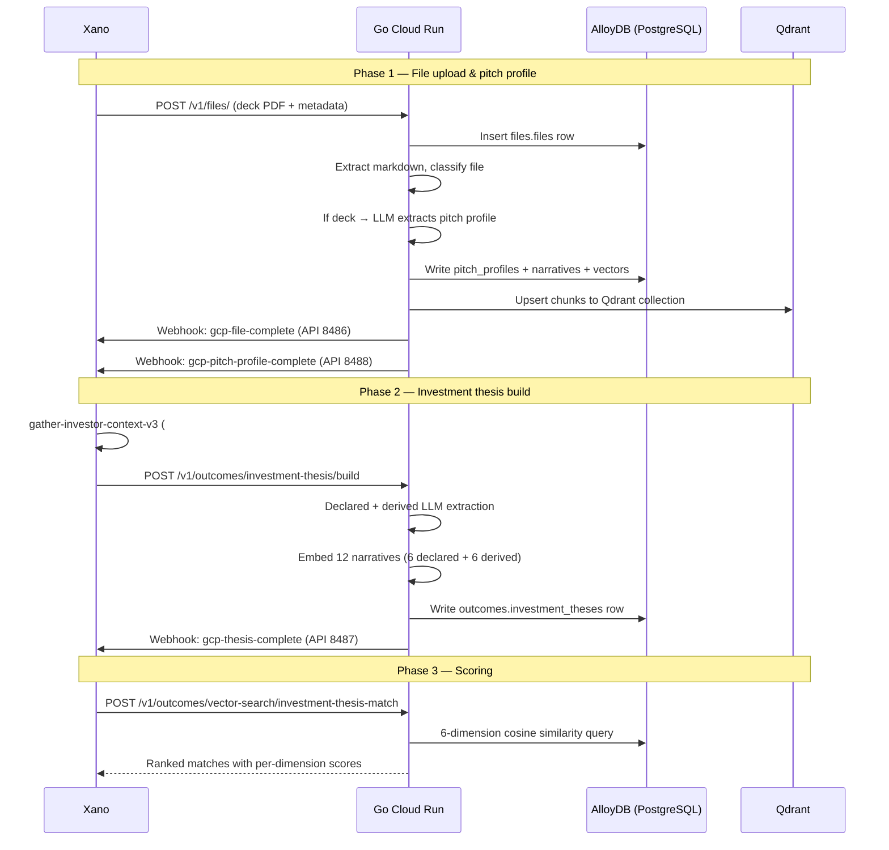

This page documents the **current production pipeline** that powers the find-investors outcome. It spans two systems — the **Go Cloud Run backend** (file processing, embeddings, vector scoring) and **Xano workspace 3** (orchestration, context gathering, persistent storage, webhooks). For the schema design, see [thesis schema](./thesis-schema). For the original Xano-only v1 path, see [Xano pipeline](./xano-pipeline). For the AlloyDB migration design, see [design rationale](./design-rationale).

---

## Architecture overview



---

## Phase 1 — File upload and pitch profile extraction

### Step 1: Upload file

Xano calls the Go backend to upload a file (typically a pitch deck PDF).

**Xano function:** `mvp/file/upload-and-create` (`#12920`)

This function:
1. Reads the GCP backend URL from the `env_variable` table via `mvp/file/get-gcp-url-key`
2. POSTs the file to the Go backend with routing metadata

**Go endpoint:** `POST /v1/files/`

| Field | Type | Description |
|---|---|---|
| `file` | multipart | The uploaded file (PDF, image, etc.) |
| `xano_user_id` | int | Xano user FK for routing webhooks back |
| `xano_file_id` | int | Xano file table FK for webhook upsert |
| `data_source` | string | `"staging"` or `"live"` — controls which Xano datasource the webhook writes to |
| `file_source` | string | Origin tag, e.g. `"email_attachment"`, `"deck_upload"` |

### Step 2: Go processes the file

The Go worker pipeline runs automatically after upload:

1. **Store** — uploads the file to GCS (`gs://orbiter-staging/...`)
2. **Extract markdown** — converts PDF/image to markdown text
3. **Classify** — LLM classifies the file type (e.g. `pitch_deck`, `financial_model`, `other`)
4. **Chunk** — splits markdown into chunks, upserts to Qdrant
5. **Pitch profile extraction** (decks only) — if classification is `pitch_deck`:
   - LLM extracts structured metadata (Layer 1: company name, sector, stage, raise amount, etc.)
   - LLM extracts 6 narrative dimensions (Layer 2: founder fit, problem/market, competitive moat, traction/momentum, business model, expansion roadmap)
   - Embeds each narrative as a 1536-dim vector via `text-embedding-3-small`
   - Writes to three PostgreSQL tables: `files.pitch_profiles`, `files.pitch_profile_narratives`, `files.pitch_profile_synthesis`

### Step 3: Webhooks notify Xano

On completion, the Go backend sends two webhooks:

**Webhook 1:** `POST webhook/gcp-file-complete` (Xano API 8486)

Updates the existing Xano file row (table 587) with:
- `markdown`, `classification`, `description`, `preview_image_url`
- `chunk_count`, `qdrant_collection`
- Routes to the correct Xano datasource via `data_source` field

**Webhook 2:** `POST webhook/gcp-pitch-profile-complete` (Xano API 8488)

Upserts to the `fundraising_pitch_profiles` table (710) using `db.add_or_edit` keyed on `file_id`. Writes all Layer 1 metadata + 6 narrative dimensions + pitch summary.

<Check>
**Important:** The `pitch_profile_id` used for scoring is the **PostgreSQL UUID** from `files.pitch_profiles`, not the Xano integer ID. The scoring endpoint validates it as a UUID.
</Check>

---

## Phase 2 — Investment thesis build

### Step 1: Gather investor context

**Xano function:** `thesis/gather-investor-context-v3` (`#12911`)

| Input | Type | Default | Description |
|---|---|---|---|
| `master_person_id` | int | — | Angel investor (one of person/company required) |
| `master_company_id` | int | — | VC fund (one of person/company required) |
| `max_deals` | int | 100 | Cap on deals returned |
| `recency_months` | int | 36 | Deal date window |

This function:
1. Resolves the investor to their `fundable_org_id` or `fundable_personnel_id`
2. Pulls the `fundable_organizations` row (description, total raised, investment count)
3. Fetches up to 100 recent `fundable_institutional_investments` joined to `fundable_deals`
4. Filters by recency window
5. Returns `{entity_type, entity_context, deals[], stats}`

### Step 2: Send to Go for thesis build

**Xano function:** `thesis/build-investment-thesis-in-gcp` (`#12978`)

This function:
1. Calls `gather-investor-context-v3` with the investor IDs
2. POSTs the context payload to the Go backend

**Go endpoint:** `POST /v1/outcomes/investment-thesis/build`

The Go backend then:
1. Runs two parallel LLM calls (declared thesis from bio/firm context + derived thesis from deal portfolio)
2. Embeds 12 narratives (6 declared + 6 derived) as 1536-dim vectors
3. Writes to `outcomes.investment_theses` in PostgreSQL
4. Sends a webhook back to Xano

### Step 3: Webhook notifies Xano

**Webhook:** `POST webhook/gcp-thesis-complete` (Xano API 8487)

Upserts to the `investment_theses` table (709) using `db.add_or_edit`. The upsert key depends on investor type:
- **VC fund** — keyed on `master_company_id`
- **Angel investor** — keyed on `master_person_id`

Writes all 54 columns: identity, Layer 1 structured filters, Layer 2 declared + derived narratives and vectors, Layer 3 synthesis (summaries, delta, drift signals, partner specialization).

---

## Phase 3 — Scoring (vector search)

**Go endpoint:** `POST /v1/outcomes/vector-search/investment-thesis-match`

Matches a founder's pitch profile against all investment theses using 6-dimension cosine similarity.

### Request

```json
{
  "pitch_profile_id": "019e10f5-3d7d-7839-b645-ed4621cf4d57",
  "top_n": 50,
  "filters": {
    "stage_focus": ["seed", "series_a"],
    "geography": ["US", "GB"]
  }
}
```

| Field | Type | Required | Description |
|---|---|---|---|
| `pitch_profile_id` | UUID | Yes | PostgreSQL UUID from `files.pitch_profiles` (not Xano ID) |
| `top_n` | int | No | Results to return, 1-200, default 50 |
| `filters.stage_focus` | string[] | No | Case-insensitive any-of filter on thesis stage_focus |
| `filters.geography` | string[] | No | Case-insensitive any-of filter on thesis geography |

### Scoring dimensions

The matcher computes cosine similarity on each of 6 narrative dimensions between the pitch profile's **declared** vectors and each thesis's **derived** vectors (i.e. "which investors actually *fund* things like this pitch?"):

| Dimension | Weight | What it captures |
|---|---|---|
| Founder fit | 0.30 | Team composition, why-this-team-now |
| Problem/market | 0.20 | Core problem and target market alignment |
| Competitive moat | 0.15 | Defensibility and unfair advantages |
| Traction/momentum | 0.15 | Current traction and growth signals |
| Business model | 0.12 | GTM motion and unit economics |
| Expansion roadmap | 0.08 | Capital plan, milestones, growth path |

The **composite score** is the weighted sum of all 6 dimension scores. Results are returned in descending composite score order.

### Response

```json
{
  "matches": [
    {
      "thesis_id": "019e0abc-1234-7000-b000-000000000001",
      "master_company_id": 69,
      "master_person_id": null,
      "firm_name": "Andreessen Horowitz",
      "investor_type": "vc_fund",
      "scores": {
        "founder_fit": 0.85,
        "problem_market": 0.72,
        "competitive_moat": 0.68,
        "traction_momentum": 0.91,
        "business_model": 0.77,
        "expansion_roadmap": 0.63
      },
      "composite_score": 0.79,
      "environment": "production"
    }
  ],
  "pitch_profile_id": "019e10f5-3d7d-7839-b645-ed4621cf4d57",
  "total_evaluated": 150
}
```

| Field | Description |
|---|---|
| `matches[]` | Ranked investor matches, descending by composite score |
| `thesis_id` | PostgreSQL UUID of the investment thesis row |
| `master_company_id` / `master_person_id` | Xano FKs — exactly one is non-null per match |
| `scores` | Per-dimension cosine similarities (0-1) |
| `composite_score` | Weighted sum of dimension scores |
| `total_evaluated` | Count of theses with status=completed before filtering |

---

## Data flow summary

| Step | System | Function / endpoint | Writes to |
|---|---|---|---|
| Upload file | Xano → Go | `mvp/file/upload-and-create` → `POST /v1/files/` | `files.files` (PostgreSQL), GCS |
| Process file | Go (worker) | Internal pipeline | `files.files`, `files.file_chunks`, Qdrant |
| Extract pitch profile | Go (worker) | Internal pipeline (deck only) | `files.pitch_profiles`, `files.pitch_profile_narratives`, `files.pitch_profile_synthesis` |
| Webhook: file done | Go → Xano | `POST webhook/gcp-file-complete` | `file` table 587 (Xano) |
| Webhook: pitch done | Go → Xano | `POST webhook/gcp-pitch-profile-complete` | `fundraising_pitch_profiles` table 710 (Xano) |
| Gather context | Xano | `thesis/gather-investor-context-v3` (#12911) | — (read only) |
| Build thesis | Xano → Go | `thesis/build-investment-thesis-in-gcp` (#12978) → `POST /v1/outcomes/investment-thesis/build` | `outcomes.investment_theses` (PostgreSQL) |
| Webhook: thesis done | Go → Xano | `POST webhook/gcp-thesis-complete` | `investment_theses` table 709 (Xano) |
| Score investors | Xano → Go | `POST /v1/outcomes/vector-search/investment-thesis-match` | — (read only) |

---

## Datasource routing

Every request from Xano to Go includes a `data_source` field (`"staging"` or `"live"`). This value:
1. Gets stored on the file/thesis row in PostgreSQL
2. Gets echoed back in webhooks
3. Controls which Xano datasource the webhook writes to via `db.set_datasource`

<Warning>
If a file is uploaded with the wrong `data_source`, the webhooks will write to the wrong Xano datasource. Fixing it requires updating **both** the PostgreSQL row and the Xano row, since the webhook has already fired.
</Warning>

---

## Key IDs and tables

### Go (PostgreSQL / AlloyDB)

| Table | Schema | Primary key | Description |
|---|---|---|---|
| `files.files` | `files` | UUID | Uploaded files with GCS URI, markdown, classification |
| `files.pitch_profiles` | `files` | UUID | Extracted pitch profile metadata + narratives |
| `files.pitch_profile_narratives` | `files` | UUID | Individual narrative dimensions with vectors |
| `files.pitch_profile_synthesis` | `files` | UUID | Composite synthesis of pitch |
| `files.file_chunks` | `files` | UUID | Chunked markdown for RAG |
| `outcomes.investment_theses` | `outcomes` | UUID | Investment thesis with 12 narrative vectors |

### Xano (workspace 3)

| Table | ID | Description |
|---|---|---|
| `file` | 587 | Mirror of file metadata from Go |
| `investment_theses` | 709 | Mirror of thesis data from Go |
| `fundraising_pitch_profiles` | 710 | Mirror of pitch profile data from Go |

### Xano functions

| Function | ID | Description |
|---|---|---|
| `mvp/file/upload-and-create` | 12920 | Uploads file to Go backend |
| `mvp/file/get-gcp-url-key` | — | Reads GCP backend URL from env_variable table |
| `thesis/gather-investor-context-v3` | 12911 | Gathers investor context + deals from fundable tables |
| `thesis/build-investment-thesis-in-gcp` | 12978 | Orchestrates thesis build via Go backend |

### Xano webhook APIs (api group 346)

| Webhook | API ID | Description |
|---|---|---|
| `webhook/gcp-file-complete` | 8486 | File processing results → file table 587 |
| `webhook/gcp-pitch-profile-complete` | 8488 | Pitch profile results → fundraising_pitch_profiles table 710 |
| `webhook/gcp-thesis-complete` | 8487 | Thesis build results → investment_theses table 709 |

---

## Related pages

<CardGroup cols={3}>
  <Card title="Thesis schema" icon="sitemap" href="/guides/open-work/suggestion-core-concepts/find-investors/thesis-schema">
    Data model, system prompts (declared + derived), worked examples.
  </Card>
  <Card title="Xano v1 pipeline" icon="server" href="/guides/open-work/suggestion-core-concepts/find-investors/xano-pipeline">
    Original Xano-only path (now partially superseded by Go backend).
  </Card>
  <Card title="Design rationale" icon="lightbulb" href="/guides/open-work/suggestion-core-concepts/find-investors/design-rationale">
    Architecture decisions behind the AlloyDB rewrite.
  </Card>
</CardGroup>
