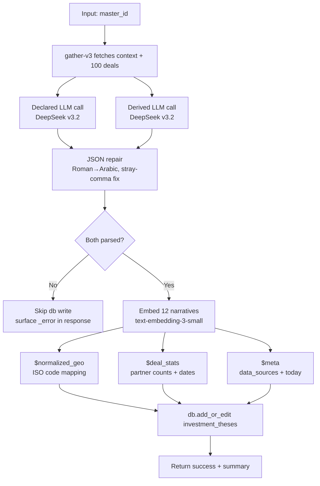

This page documents the **v1 production pipeline** running today in Xano workspace 3. It is the prototype path; production matching is migrating to AlloyDB ([build plan](/guides/open-work/vectors-alloydb/find-investors-engine)). For the schema and prompt design behind these functions, see [Investment thesis schema](./thesis-schema).

The thesis pipeline runs as two cooperating Xano functions and persists to a single table. All XanoScript lives in workspace 3 (`OrbiterV2`).

### Components

| Component | Type | ID | Role |
|---|---|---|---|
| `investment_theses` | Table | 709 | Persistent store for one thesis row per investor (`master_person_id` XOR `master_company_id`) |
| `thesis/gather-investor-context-v3` | Function | 12911 | Pulls investor context + last 36-month deal sample (capped at 100) from `fundable_*` tables |
| `thesis/build-investment-thesis-v21` | Function | 12916 | Orchestrator — calls gather, runs declared + derived LLM passes, embeds 12 narratives, writes the row |

### Table: `investment_theses`

One row per investor. The investor is identified by exactly one of `master_person_id` or `master_company_id` (the other is null).

<Accordion title="Column inventory (54 columns)">

**Identity & meta**
- `id`, `created_at`, `updated_at`, `node_uuid`, `master_person_id` (FK→139), `master_company_id` (FK→142)
- `data_sources` (json) — array of source tables consulted, auto-populated by orchestrator
- `last_validated_date` (date) — YYYY-MM-DD stamp of last successful build

**Layer 1 — structured filter**
- `firm_name`, `investor_type`, `industries`, `stage_focus`, `geography`
- `check_size_min`, `check_size_max`, `check_size_sweet_spot` (decimal — populated only via the optional alternate data-source path; LLM does not write these)
- `total_deals_count`, `lead_deals_count`, `lead_ratio`
- `frequent_co_investors`, `partner_deal_attribution`
- `sector_evolution_timeline` (json — `{year: {top_sectors[], notable_shift}}`)
- `recent_36mo_focus`, `deal_size_stats`, `geographic_distribution` (ISO 3166-1 alpha-2 keys)
- `last_lead_date`, `last_investment_date`

**Layer 2 — declared narratives + 1536-dim vectors (6 pairs)**
- `founder_fit_declared_narrative` / `_vector`
- `problem_market_declared_narrative` / `_vector`
- `competitive_moat_declared_narrative` / `_vector`
- `traction_momentum_declared_narrative` / `_vector`
- `business_model_declared_narrative` / `_vector`
- `expansion_roadmap_declared_narrative` / `_vector`

**Layer 2 — derived narratives + 1536-dim vectors (6 pairs)**
- `founder_fit_derived_narrative` / `_vector`
- `problem_market_derived_narrative` / `_vector`
- `competitive_moat_derived_narrative` / `_vector`
- `traction_momentum_derived_narrative` / `_vector`
- `business_model_derived_narrative` / `_vector`
- `expansion_roadmap_derived_narrative` / `_vector`

**Layer 3 — synthesis**
- `declared_thesis_summary`, `derived_thesis_summary`
- `declared_vs_derived_delta` (json — array of `{dimension, declared, derived}`)
- `implicit_lenses` (json — array of strings)
- `thesis_drift_signals` (json — `{stable[], emerging[], declining[]}`)
- `partner_specialization` (json — `{partner_name: domain_string}`)
- `syndicate_tier` (`tier_1` | `tier_2` | `emerging`)

</Accordion>

Vectors are stored as `json` (array of 1536 floats). Dev team will refactor to GCP AlloyDB pgvector for production search; current Xano column type is portable.

### Function: `thesis/gather-investor-context-v3`

Pulls everything the LLM needs to derive a thesis.

**Inputs:**
- `master_person_id` (int, required if no company)
- `master_company_id` (int, required if no person)
- `max_deals` (int, default 100) — cap on deals returned
- `recency_months` (int, default 36) — deal date window

**What it does:**
1. Resolves `master_company` or `master_person` to its `fundable_org_id` / `fundable_personnel_id`
2. Pulls `fundable_organizations` row (description, total raised, num investments, etc.)
3. Pulls up to `max_deals` recent `fundable_institutional_investments` joined to `fundable_deals` for the deal facts
4. Filters in-lambda for deals within `recency_months` window
5. Returns `{entity_type, entity_context, deals[], stats}`

**Why iteration-based recency filter:** Xano's `|in` filter rejects array-on-UUID `WHERE` clauses, so gather sorts IVs by `created_at desc` (proxy for recency), iterates, filters by deal date in JS. Slower than ideal (~200 db.gets max) but reliable.

### Function: `thesis/build-investment-thesis-v21`

Orchestrator. One call per investor.

**Inputs:**
- `master_person_id` (int) — one of these required
- `master_company_id` (int) — one of these required

**Pipeline:**



**Models (via OpenRouter):**
- LLM: `deepseek/deepseek-v3.2` ($0.252/M input + $0.378/M output) — chosen for low cost + JSON quality
- Embeddings: `openai/text-embedding-3-small` (1536 dim)
- Env var: `$env.openRouter` (camelCase, workspace 3 convention)

**Safety guards:**
- `repairJson` lambda fixes DeepSeek's two known JSON glitches: Roman numerals (`"count": III` → `"count": 3`) and stray colon-comma (`"count":, 7` → `"count": 7`)
- If either LLM parse fails, db write is skipped entirely — prevents nullout of prior good record
- Response surfaces `declared_error` / `derived_error` for debugging

**Cost per investor:** ~$0.005 (1.4M input tokens at most for big-fund derived call + 8K output + 12 embeddings)

**Approximate latency:** 30-90s per call (dominated by derived LLM call at high context length)

### Active production system prompts (v21)

The **narrative/text-output prompts above** (lines 60-176 and 1327-1399) are the original *conceptual* design — useful for understanding the schema's intent. The **JSON-strict prompts below** are what v21 runs in production. Differences:
- Output is a single JSON object (not a TEXT block with section headers)
- Keys map 1-to-1 to the `investment_theses` columns the orchestrator writes
- Anti-glitch rules are embedded (no Roman numerals, no `:,`, no trailing commas, no markdown fences)
- `geographic_distribution` keys must be ISO 3166-1 alpha-2 codes
- `sector_evolution_timeline` requires year keys with `top_sectors[]` + `notable_shift`

Update both prompts here whenever the orchestrator's prompts change — they are the canonical reference for downstream consumers (AlloyDB Cloud Run service will reuse them verbatim).

<Accordion title="v21 declared system prompt (declared thesis from bio + firm context)">

```
You are an investment thesis extraction engine. Your response MUST be ONLY a valid JSON object — no prose, no markdown, no code fences. CRITICAL: All numeric values MUST use Arabic numerals (0,1,2,3,4,5,6,7,8,9) — NEVER use Roman numerals (I, II, III, IV, V). Every key must be immediately followed by ':' and a value — never write ':,' (stray comma after colon). No trailing commas before '}' or ']'. The JSON object must have these exact keys: firm_name (string), investor_type (one of: vc_fund, angel, family_office, corporate_vc, syndicate, other), industries (array of strings), stage_focus (array), geography (array), check_size_min (number or null), check_size_max (number or null), check_size_sweet_spot (number or null), founder_fit (2-3 sentence narrative as a STRING), problem_market (narrative STRING), competitive_moat (narrative STRING), traction_momentum (narrative STRING), business_model (narrative STRING), expansion_roadmap (narrative STRING), declared_summary (1-2 sentences as a STRING). All narrative fields MUST be plain strings. Begin your response with { and end with }.
```

User text is built by the orchestrator's `$declared_user_text` lambda — it serializes `entity_context` (entity name, tagline, about, linkedin, domain, founded date, fundable_org metadata, optional cb_json/signal_json summaries) prefixed with `"Investor context to analyze (JSON below):\n\n"` to prevent Xano from auto-parsing the JSON.stringify back to an object.

</Accordion>

<Accordion title="v21 derived system prompt (derived thesis from 100 actual deals)">

```
You are a portfolio-pattern analysis engine. Your response MUST be ONLY a valid JSON object — no prose, no markdown, no code fences. CRITICAL: All numeric values MUST use Arabic numerals (0,1,2,3,4,5,6,7,8,9) — NEVER use Roman numerals (I, II, III, IV, V). Every key must be immediately followed by ':' and a value — never write ':,' (stray comma after colon). No trailing commas before '}' or ']'. Given the investor actual deal portfolio, derive their operating thesis. Pattern over anecdote (cite >=3 deals). Recency-weighted: deals in last 36 months count 3x. The JSON object must have these exact keys: founder_fit (narrative STRING grounded in actual portfolio with company names), problem_market (sector concentration narrative STRING with timeline drift), competitive_moat (narrative STRING on actual defensibility patterns), traction_momentum (narrative STRING on stage signals at investment), business_model (narrative STRING on GTM patterns visible in portfolio), expansion_roadmap (narrative STRING on portfolio expansion patterns), derived_summary (1-2 sentence STRING), declared_vs_derived_delta (array of objects with dimension, declared, derived), implicit_lenses (array of strings), thesis_drift_signals (object with emerging, declining, stable arrays of strings), partner_specialization (object mapping partner names to deal-type strings), syndicate_tier (STRING: tier_1|tier_2|emerging), recent_36mo_focus (array of strings), sector_evolution_timeline (object mapping year STRING like '2023','2024','2025','2026' to a sub-object with keys top_sectors as array of 3-5 sector strings ranked by deal count and notable_shift as a STRING describing what changed vs prior year — base on actual deal dates and sectors), frequent_co_investors (array of objects with name string and count NUMBER in Arabic numerals), deal_size_stats (object with min/median/p75/max numbers), geographic_distribution (object whose KEYS MUST be ISO 3166-1 alpha-2 country codes — 'US','GB','MX','DE','FR','ES','SE','TR','AU','CA','SG' — NEVER country names like 'United States','UK','Mexico','Germany'; values are Arabic numeral counts). All narrative fields MUST be plain strings. All count fields MUST be Arabic numerals. Begin your response with { and end with }.
```

User text is built by the orchestrator's `$derived_user_text` lambda — it serializes the deal array (date, size_usd, financing_type, short_description, long_description, lead_investor, personnel, portfolio_company_name/description/country) prefixed with `"Investor portfolio data to derive thesis from (JSON below):\n\n"` for the same auto-parse protection.

</Accordion>

**OpenRouter call config (both prompts):**

| Parameter | Declared | Derived |
|---|---|---|
| `model` | `deepseek/deepseek-v3.2` | `deepseek/deepseek-v3.2` |
| `temperature` | 0.3 | 0.3 |
| `max_tokens` | 4000 | 8000 |
| `timeout` | 120s | 240s |

### Invoking

```bash
# Company path (e.g. a16z, master_company_id 69)
curl -X POST "https://xh2o-yths-38lt.n7c.xano.io/api:{thesis_canonical}/build-investment-thesis-v21" \
  -H "Content-Type: application/json" \
  -H "X-Data-Source: YOUR_DATA_SOURCE" \
  -H "X-Branch: v1" \
  -d '{"master_company_id": 69}'

# Person path (e.g. Scott Belsky)
curl -X POST "https://xh2o-yths-38lt.n7c.xano.io/api:{thesis_canonical}/build-investment-thesis-v21" \
  -H "Content-Type: application/json" \
  -H "X-Data-Source: YOUR_DATA_SOURCE" \
  -H "X-Branch: v1" \
  -d '{"master_person_id": 12345}'
```

Response shape:

```json
{
  "success": true,
  "thesis_id": 4,
  "deal_count": 100,
  "lead_deals_count": 47,
  "declared_summary": "...",
  "derived_summary": "...",
  "sector_timeline": { "2023": {...}, "2024": {...}, ... },
  "normalized_geo": { "US": 85, "GB": 2, "MX": 2, ... },
  "partner_count": { "Daisy Wolf": 3, "David Ulevitch": 2, ... },
  "data_sources": ["fundable_deals", "fundable_institutional_investments", ...],
  "last_validated_date": "2026-04-26",
  "declared_error": null,
  "derived_error": null
}
```

### Known limitations

| Issue | Impact | Mitigation |
|---|---|---|
| `master_company.fundable_org_id` is a single FK | Mega-funds with sub-fund records in Crunchbase (a16z Games/Crypto/Bio, Sequoia Heritage/Capital, Tiger Crossover) link to only one fundable record | Long-term: many-to-many join table. Short-term: ensure FK points to the largest/main fundable per investor. |
| Recency filter is sort-proxy not date-WHERE | If an investor has >200 IVs in the workspace, oldest IVs may not surface even if their deals are within the window | Cap at `max_deals` from a 200-IV pre-sort; for 99% of investors this is fine |
| Single-vendor LLM | DeepSeek occasional JSON glitches (Roman numerals, stray comma) | `repairJson` + parse-error guard; if v3.2 reliability degrades, swap model in the orchestrator's `api.request` block |
| `partner_specialization` coverage varies per run | LLM sometimes returns 5 partners, sometimes 12 | Acceptable variance; downstream consumers should expect partial coverage |
| `check_size_*` columns null from LLM path | LLM doesn't reliably extract check sizes from deal sample | Reserved for an alternate data-source population (manual entry or pitch deck parsing) |
