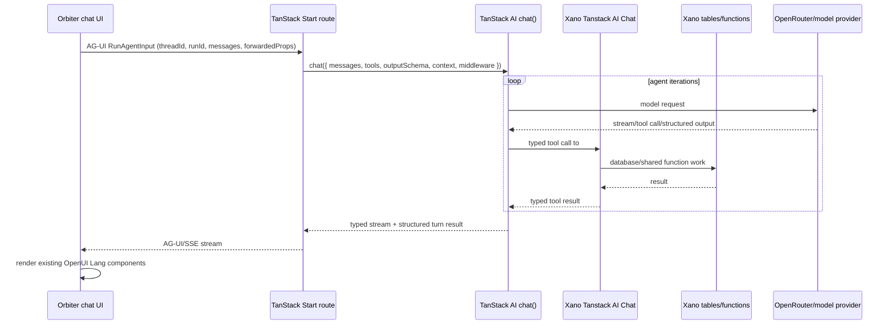

<Note>
  This is build plan to refactor to Tanstack AI for chat instead of AI-SDK.
</Note>

<Warning>
  This page is a plan only. Do not build frontend code, do not create Xano
  endpoints, and do not edit or delete existing Xano endpoints while using this
  page as the starting point.
</Warning>

## Build Status

<Info>
  Update this section immediately after each phase or blocking sub-step is
  executed. If implementation work happens without a matching status update
  here, the build is not ready for review or cutover.
</Info>

Current state: Phase 10 QA Verification And Cutover Gate is complete, and
Phase 11 Cutover And Rollback Window is ready for PR/deploy execution but has
not been executed. No PR has been opened from this session, no production
deploy flags have been changed, and the Phase 11 cutover/rollback runbook is
captured in `dogfood-output/tanstack-ai-chat-phase11/cutover-runbook.md`.
Phase 11 local read-only hydrate smoke now passes with all four local TanStack
flags enabled for Outcomes, Leverage Loops, Meeting Prep, and How I Know, with
evidence in
`dogfood-output/tanstack-ai-chat-phase11/local-readonly-hydrate-smoke-result.json`;
this did not open a PR, change production deploy flags, or click final
side-effect actions.
Phase 11 approved local non-final live chat smoke now passes for all four
migrated surfaces with all four local TanStack flags enabled: Outcomes used
#1286 `8771`, Leverage Loops used #1286 `8762`, Meeting Prep used #1286
`8759` while event loading stayed page-data via `useCalendarEvents()`, and
How I Know used #1286 `8754` from the `Add more` chat path without clicking
`Save & Close` or `Done`; evidence is in
`dogfood-output/tanstack-ai-chat-phase11/nonfinal-live-chat-smoke-result.json`.
Phase 11 local PR-readiness gates now pass for full frontend tests (109 files /
1664 tests), `CI=true pnpm build` with existing Vite/Nitro third-party warning
noise, scoped TanStack Biome (29 files), frontend/docs `git diff --check`,
Phase 11 JSON parse, runtime TanStack legacy/AI SDK guard searches, the Meeting
Prep event-loading boundary guard, and Mintlify validate. Full-repo
`pnpm biome check` is not a clean gate in this checkout because it reports
unrelated existing app-wide formatting/import diagnostics outside the Phase 11
evidence scope.
Phase 9 Shadow And Compare is complete: How I Know read-only and approved
live-write TanStack checks are captured against #1286, Meeting Prep flag-on
live chat renders kickoff plus follow-up turns while preserving event list
loading via existing page-data `useCalendarEvents()`, Leverage Loops flag-on
live chat renders a usable first interview turn, and approved live Outcomes UI
interview verification renders through the traced #1286 interview route
without submitting or dispatching. Latest validation includes focused tests
(8 files / 71 tests), full frontend tests (109 files / 1664 tests), scoped
Biome, frontend/docs `git diff --check`, guard searches, Mintlify validate,
and `CI=true pnpm build` with existing third-party warning noise.
Phase 10 desktop in-app browser
hydration checks plus mobile/narrow smoke are now captured for Outcomes, How I
Know, Meeting Prep, and Leverage Loops. Read-only per-surface flag-off rollback
smoke is captured with no TanStack route ingress logs observed. Existing-state
reload/resume smoke is captured for How I Know, Meeting Prep, and Leverage
Loops. Leverage Loops settled chat-turn reload/resume now passes after the
canonical `leverage_loops:<suggestion_request_id>` thread fix plus #1286
shared thread/draft endpoints `8739`, `8741`, `8742`, `8761`, and `8763`.
Meeting Prep settled chat-turn reload/resume now passes through the same shared
thread endpoints with a compact storage key for long Nylas event ids while the
TanStack runtime keeps the full `meeting_prep:<nylasEventId>` thread id.
Meeting Prep abort/retry is captured with TanStack stop/retry
controls while preserving existing page-data event loading, and Outcomes
browser stop/retry is captured on existing draft `suggestion-request-id=219`
with JSON evidence after CDP screenshot capture timed out. How I Know browser
stop/retry now passes after #1286 `8754`/`8755`/`8756` implementation on the
existing Njogu Kimondo relationship: Stop exposed the retryable state,
`Retry last message` completed to the follow-up `How often do you two connect
these days, and what usually sparks the conversation?`, and no Save & Close,
Done, inline edit/save, Submit Outcome, upload, dispatch, or contact-card
action was clicked. The earlier blocked attempt remains documented.
Post-How I Know stop/retry validation passed: JSON parse, focused tests
(4 files / 39 tests), scoped Biome (5 files), frontend/docs `git diff --check`,
and Mintlify validate. The true How I Know chat-thread reload/resume check
initially failed before backend
read/upsert existed; after implementing #1286 APIs `8755` and `8756`, the same
authenticated in-app browser path restored a non-final Njogu prompt and
assistant follow-up after page reload and modal reopen. #1286 API `8754` is
now implemented and smoke-verified: the authenticated in-app browser reached
`POST how-i-know/interview` with status 200, rendered a non-final follow-up,
persisted through `8756`, and restored after reload/reopen through `8755`.
How I Know deeper mobile workflow evidence is captured in
`dogfood-output/tanstack-ai-chat-phase10/howiknow-mobile-workflow-turn-result.json`
plus screenshots
`dogfood-output/tanstack-ai-chat-phase10/screenshots/mobile-workflow/howiknow-mobile-workflow-before-turn.png`
and
`dogfood-output/tanstack-ai-chat-phase10/screenshots/mobile-workflow/howiknow-mobile-workflow-after-turn.png`;
at 390x844, the existing Njogu Kimondo relationship modal accepted one
non-final composer answer and rendered the next assistant question `Where does
Njogu tend to struggle or have a blind spot?` without clicking Save & Close,
Done, inline edit/save, Submit Outcome, upload, dispatch, or contact-card
actions.
Post-How I Know mobile workflow validation passed: JSON parse, focused tests
(4 files / 39 tests), scoped Biome (5 files), frontend/docs `git diff --check`,
and Mintlify validate.
Bridge-level controlled failure recovery is captured for How I Know, Meeting
Prep, Leverage Loops, and Outcomes. How I Know also has browser/UI controlled
failure recovery evidence: a dev-only route-level failure returned the
retryable 502 UI, exposed `Retry last message`, and retry recovered to a new
follow-up in
`dogfood-output/tanstack-ai-chat-phase10/browser-ui-controlled-failure-howiknow-result.json`
with screenshots under
`dogfood-output/tanstack-ai-chat-phase10/screenshots/failure-injection/`.
Post-browser/UI controlled failure validation passed: JSON parse, focused
tests (4 files / 28 tests), scoped Biome (10 files), frontend/docs
`git diff --check`, Mintlify validate, `CI=true pnpm build` with existing
third-party warning noise, narrowed TanStack route/wrapper legacy/AI SDK guard,
and the Meeting Prep event-loading guard.
How I Know final Save & Close passed with explicit user approval on the
existing Njogu Kimondo relationship. Evidence is captured in
`dogfood-output/tanstack-ai-chat-phase10/howiknow-final-save-and-close-result.json`
plus screenshots under
`dogfood-output/tanstack-ai-chat-phase10/screenshots/final-actions/`: the
completed modal exposed `Save & Close`, the click closed the modal, a page
reload kept the Njogu summary visible, and reopening How I Know showed
completed reflection state instead of an in-progress composer. Leverage Loops
final dispatch now passes by visible browser-side #1286 readout evidence on
request `226` after the `8764` implementation. Outcomes Submit Outcome /
dispatch browser-side readout prep is implemented for #1286 `8774` and `8775`
in `dogfood-output/tanstack-ai-chat-phase10/outcomes-final-browser-side-qa-readout-prep-result.json`;
the first approved manual Outcomes dispatch click reached #1286 `8775` from a
draft-without-request-id path (`requestId: 0`) with `stage:
dispatch-returned`, but the raw backend response was `ok:false
NOT_IMPLEMENTED` with request id `fe8f2f1e-200c-4c65-97eb-0c795165dabb`, so
`dogfood-output/tanstack-ai-chat-phase10/outcomes-final-dispatch-implementation-blocked-result.json`
is not accepted as pass evidence. #1286 `8774` and `8775` are now implemented
and published, and the frontend now fails closed before dispatch when no
positive `suggestion_request_id` exists. The approved/manual persisted-request
retry now passes for `suggestion-request-id=219`: visible browser-side readout
reported #1286 `8774` submit-metadata `ok:true` plus #1286 `8775`,
`stage: dispatch-returned`, `result: success`, raw/mapped `ok:true`,
`dispatch_started:true`, `status: processing`,
`suggestion_request_id: 219`, trace
`44cb9383-f8b3-4fa9-b079-2aa52d5c2ace`; see
`dogfood-output/tanstack-ai-chat-phase10/outcomes-final-browser-side-qa-readout-result.json`.
No Outcomes upload or contact-card action has been clicked.
Post-final-action/readout-prep validation passed: JSON parse, focused Outcomes
tests, the focused Phase 10 test set, scoped Biome, frontend/docs
`git diff --check`, Mintlify validate, and rerun `CI=true pnpm build` with
existing third-party warning noise.
Leverage Loops browser stop/retry is captured on the existing Ian Bloom draft
before backend implementation; retry rendered the #1286
`leverage-loops/interview` backend-not-implemented shell message. #1286 API
`8762` is now implemented in the Tanstack AI Chat group, post-implementation
browser smoke passes after restarting the stale `localhost:3000` dev server
with current route code, and post-implementation stop/retry now passes against
`8762` with the authenticated in-app browser.
Shared #1286 thread/draft persistence endpoints `8739`, `8741`, `8742`,
`8761`, and `8763` are now implemented and published; the authenticated
in-app browser restored a non-final Ian Bloom Leverage Loops prompt,
assistant question, options, and summary after browser reload with no
activation or dispatch clicked.
Post-implementation Leverage Loops stop/retry evidence is captured in
`dogfood-output/tanstack-ai-chat-phase10/abort-retry-leverage-loops-post-8762-result.json`
plus screenshots
`dogfood-output/tanstack-ai-chat-phase10/screenshots/abort-retry/leverage-loops-stop-visible-post-8762.png`,
`dogfood-output/tanstack-ai-chat-phase10/screenshots/abort-retry/leverage-loops-retry-visible-post-8762.png`,
and
`dogfood-output/tanstack-ai-chat-phase10/screenshots/abort-retry/leverage-loops-retry-complete-post-8762.png`;
Xano history `2609612`, `2609613`, `2609615`, and `2609616` returned status
200 for run `run-1782647179311-lawbt1`, and no activation or dispatch action
was clicked.
Leverage Loops deeper mobile workflow evidence is captured in
`dogfood-output/tanstack-ai-chat-phase10/leverage-loops-mobile-workflow-option-result.json`
plus screenshots
`dogfood-output/tanstack-ai-chat-phase10/screenshots/mobile-workflow/leverage-loops-mobile-workflow-before-option.png`
and
`dogfood-output/tanstack-ai-chat-phase10/screenshots/mobile-workflow/leverage-loops-mobile-workflow-after-option.png`;
at 390x844, selecting the non-final `Post-production houses` option rendered
the next assistant question and option buttons without backend-not-implemented,
activation, or dispatch state.
Meeting Prep deeper mobile workflow now passes. Event list loading remained
page-data via `useCalendarEvents()`: the topmost Tomorrow All Hands row was
selected from the page-data event rail, then the 390x844 mobile layout sent one
non-final answer and rendered the follow-up `What specific challenges or
blockers do you anticipate discussing around team capacity or roadmap risks?`.
Evidence is captured in
`dogfood-output/tanstack-ai-chat-phase10/meeting-prep-mobile-workflow-retry-result.json`
plus screenshots
`dogfood-output/tanstack-ai-chat-phase10/screenshots/mobile-workflow/meeting-prep-mobile-workflow-before-turn-retry.png`
and
`dogfood-output/tanstack-ai-chat-phase10/screenshots/mobile-workflow/meeting-prep-mobile-workflow-after-turn-retry.png`.
No final action, create, schedule, dispatch, upload, or external send was
clicked; the earlier blocked artifact remains for traceability.
Post-Meeting Prep mobile workflow validation passed: JSON parse, frontend/docs
`git diff --check`, Mintlify validate, and the Meeting Prep event-loading guard.
Outcomes deeper mobile workflow evidence is captured in
`dogfood-output/tanstack-ai-chat-phase10/outcomes-mobile-workflow-option-result.json`
plus screenshots
`dogfood-output/tanstack-ai-chat-phase10/screenshots/mobile-workflow/outcomes-mobile-debug-after-nav.png`
and
`dogfood-output/tanstack-ai-chat-phase10/screenshots/mobile-workflow/outcomes-mobile-workflow-after-option.png`;
at 390x844, selecting the non-final `Early users or beta signups` option
rendered the next prompt `Say that one more way?` without clicking Submit
Outcome, dispatch, upload, or contact-card actions.
Clean empty/new-thread draft smoke is now captured for Leverage Loops and
Outcomes. Leverage Loops used the supported `Add Leverage Loops` / `mode=create`
picker path after direct create-mode navigation restored the last draft; Charles
Njenga was selected, one non-final prompt was submitted, and the follow-up
`What is the most pressing challenge Charles needs advice on for this rollout?`
rendered. Evidence is captured in
`dogfood-output/tanstack-ai-chat-phase10/leverage-empty-new-thread-result.json`
plus screenshots under
`dogfood-output/tanstack-ai-chat-phase10/screenshots/empty-new-thread/`;
dev-server trace logged `/api/tanstack-ai-chat`, `surface: leverage_loops`,
`runId: run-1782654974783-74cy9j`, trace
`04dae84b-5c20-4255-bbf6-e081acdbb6d5`, and #1286
`leverage-loops/interview` `8762` status 200. Outcomes used a clean
`outcome-mode=new` route, submitted one non-final prompt, and rendered the
follow-up question about the kind of partnership desired. Evidence is captured in
`dogfood-output/tanstack-ai-chat-phase10/outcomes-empty-new-thread-result.json`
plus matching empty-new-thread screenshots; dev-server trace logged
`/api/tanstack-ai-chat`, `surface: outcomes`,
`runId: run-1782654826725-t8p6bp`, trace
`07435d5a-9fc6-4592-95b7-5a20259fc64c`, and #1286 `outcomes/interview`
`8771` status 200. No activation, Submit Outcome, dispatch, upload,
contact-card, external send, or Save & Close action was clicked.
Post-clean empty/new-thread validation passed: the new JSON artifacts parse
with `jq empty`, frontend/docs `git diff --check` passes, Mintlify validate
passes, the Meeting Prep event-loading guard has no matches, and the narrowed
TanStack route/client/server legacy endpoint and AI SDK guard has no matches.
#1286 Leverage Loops dispatch API `8764` is now implemented and published as a
self-contained status transition on the existing `suggestion_request` row with
ownership, loop-mode, and archived-row guards. Evidence is captured in
`dogfood-output/tanstack-ai-chat-phase10/xano-8764-leverage-loops-dispatch.xs`
and
`dogfood-output/tanstack-ai-chat-phase10/leverage-final-dispatch-implementation-blocked-result.json`.
Post-implementation app-click has now been user-reported: after browser
automation was blocked by localhost policy, the user manually clicked the
visible Leverage Loops submit/activation control. Evidence is captured in
`dogfood-output/tanstack-ai-chat-phase10/leverage-final-manual-click-pending-xano-result.json`.
Xano MCP history verification is still blocked by the Codex usage limit until
`2026-06-29 16:04`; a dev-only browser-side `phase10` dispatch log was added
as an alternate immediate proof path for a new explicitly approved/manual
click. After the user could not retrieve the browser-console localStorage
command output, a dev-only visible Phase 10 readout was added to the Leverage
Loops canvas for `phase10=leverage...` URLs; it reads the same sanitized
browser-side record without triggering another Xano call or final-action side
effect. Evidence is captured in
`dogfood-output/tanstack-ai-chat-phase10/leverage-final-browser-side-qa-readout-result.json`.
After a subsequent manual submit still left the readout at `n/a` with Copy
disabled, the readout was extended to record sanitized rail/inline-dispatch
attempt and failure stages (`rail-activate-*`, `inline-dispatch-*`,
`dispatch-returned`) so the next refresh/click can show whether the control
failed before dispatch or #1286 `8764` returned.
The next user-reported readout stopped at `rail-activate-dispatching` with
`requestId: 225`, proving the right-rail activation had a concrete draft id but
did not advance to the inline dispatch or #1286 response stages. The right-rail
handler now invokes the shared activation dispatch helper directly, the readout
shows `source` and `useTanstack`, and `phase10=leverage...` URLs fail closed
with `activation-dispatch-tanstack-disabled` if the running dev bundle does not
have `VITE_TANSTACK_AI_CHAT_LOOPS=true`.
After restarting localhost with `VITE_TANSTACK_AI_CHAT_LOOPS=true`, the next
approved/manual Leverage Loops final action passed through the visible
browser-side readout: `stage=dispatch-returned`, `result=success`,
`requestId: 226`, raw #1286 `ok:true`, `dispatch_started:true`,
`status: processing`, trace `24a1b647-c6a1-4509-989d-60227996d786`, and mapped
`success:true`, `mode: loop`, `suggestion_request_id: 226`.
Manual QA still needs the remaining final-action checks; How I Know final Save
& Close is passed, Leverage Loops `8764` final verification is passed, Meeting
Prep deeper mobile workflow is passed, and post-implementation non-final browser
smokes now pass for Leverage Loops `8762`, Outcomes `8771`, and Outcomes
find-talent `8772`.
Post-Outcomes browser stop/retry
and docs update validation passed with focused tests
(6 files / 35 tests), scoped Biome (12 files), frontend/docs `git diff --check`,
`CI=true pnpm build`, Mintlify validate, narrowed legacy/TanStack guard
searches, and the Meeting Prep event-loading guard. Post-How I Know `8755`/`8756`
read/upsert artifact and docs validation also passed: the new JSON evidence
parses with `jq empty`, frontend/docs `git diff --check` passes, and Mintlify
validate passes. Post-How I Know `8754` implementation evidence is captured in
`dogfood-output/tanstack-ai-chat-phase10/xano-8754-howiknow-interview.xs` and
`dogfood-output/tanstack-ai-chat-phase10/howiknow-8754-interview-implementation-result.json`.
Post-Leverage Loops `8762` implementation evidence is captured in
`dogfood-output/tanstack-ai-chat-phase10/xano-8762-leverage-loops-interview.xs`
and
`dogfood-output/tanstack-ai-chat-phase10/leverage-loops-8762-interview-implementation-result.json`.
Post-shared-thread Leverage Loops reload evidence is captured in
`dogfood-output/tanstack-ai-chat-phase10/xano-8739-threads-ensure.xs`,
`dogfood-output/tanstack-ai-chat-phase10/xano-8741-threads-messages-get.xs`,
`dogfood-output/tanstack-ai-chat-phase10/xano-8742-threads-messages-post.xs`,
`dogfood-output/tanstack-ai-chat-phase10/xano-8761-leverage-loops-drafts.xs`,
`dogfood-output/tanstack-ai-chat-phase10/xano-8763-leverage-loops-draft-context.xs`,
and
`dogfood-output/tanstack-ai-chat-phase10/leverage-loops-canonical-reload-after-8741-8742-result.json`.
Post-shared-thread validation passed: JSON parse, focused tests (3 files /
31 tests), scoped Biome, frontend/docs `git diff --check`, Mintlify validate,
and `CI=true pnpm build` with existing third-party Vite/Nitro warning noise.
Post-shared-thread Meeting Prep reload evidence is captured in
`dogfood-output/tanstack-ai-chat-phase10/meeting-prep-canonical-reload-after-8741-8742-result.json`
and
`dogfood-output/tanstack-ai-chat-phase10/screenshots/meeting-prep-canonical-reload-after-8741-8742.png`;
Xano history shows `2609511` GET `8741`, `2609461` POST user `8742`, and
`2609466` POST assistant `8742` returned 200 for storage thread
`meeting_prep:trzl0n-198`. Post-shared-thread Meeting Prep validation passed:
JSON parse, focused tests (3 files / 37 tests), scoped Biome, narrowed
legacy/TanStack guard search, frontend/docs `git diff --check`, Mintlify
validate, and `CI=true pnpm build` with existing third-party Vite/Nitro warning
noise.
Post-Outcomes `8771`/`8772` implementation evidence is captured in
`dogfood-output/tanstack-ai-chat-phase10/xano-8771-outcomes-interview.xs`,
`dogfood-output/tanstack-ai-chat-phase10/xano-8772-outcomes-find-talent-interview.xs`,
and
`dogfood-output/tanstack-ai-chat-phase10/outcomes-8771-8772-interview-implementation-result.json`.
Follow-up source validation found that live model-visible #1286 endpoint
history can return raw data while the current server-side Xano client also
supports the documented `{ok, data, request_id}` envelope. The client now keeps
envelope unwrapping and falls back to validating raw endpoint data against the
same endpoint schema; focused `route-guards.test.ts`, scoped Biome, and
frontend `git diff --check` pass for that fix. Broader follow-up validation
also passes: focused tests (6 files / 51 tests), scoped Biome (20 files), and
`CI=true pnpm build` with existing third-party Vite/Nitro warning noise.
Follow-up browser automation recovery is documented in
`dogfood-output/tanstack-ai-chat-phase10/browser-control-blocked-after-backend-implementation.json`:
the fresh flag-on dev server started on `localhost:3001` because an existing
Orbiter Vite process held `localhost:3000`, isolated `agent-browser` reached
WorkOS sign-in, profile-backed `agent-browser` hung without page state, and
the in-app browser selected-tab call timed out/reset again. No final Save &
Close, Submit Outcome, dispatch, upload, activation, or contact-card action
was clicked. A later authenticated in-app browser smoke passed after restarting
the stale `localhost:3000` dev server with current code, which loaded the
raw-response fallback. Follow-up #1286 request-history check is documented in
`dogfood-output/tanstack-ai-chat-phase10/post-implementation-request-history-check.json`:
`8762` post-publish browser smoke now passes with Xano history `2607848` at
`2026-06-28 10:07:46+0000` and screenshot
`dogfood-output/tanstack-ai-chat-phase10/screenshots/leverage-loops-post-8762-browser-smoke.png`;
`8771` post-publish browser smoke passes with Xano history `2607603` at
`2026-06-28 10:00:19+0000` and screenshot
`dogfood-output/tanstack-ai-chat-phase10/screenshots/outcomes-post-8771-browser-smoke.png`,
and `8772` post-publish browser smoke passes with Xano history `2608579` at
`2026-06-28 10:38:54+0000` and screenshot
`dogfood-output/tanstack-ai-chat-phase10/screenshots/outcomes-find-talent-post-8772-browser-smoke.png`.
The required classifier prerequisite is implemented in #1286 API `8768`, with
latest validation history `2608578` returning `class_slug=find_talent`.

### Next Session Handoff

Stop point for this session: Phase 10 remains in progress. Do not start Phase
11 until the remaining final-action checks are complete and recorded here.

Resume from these repos:

- Frontend: `/Users/markpederson/Documents/Projects/orbiter-frontend`, branch
  `tanstack-ai-chat`.
- Docs/Mintlify worktree:
  `/Users/markpederson/docs`, branch `main`.

Completed before stopping:

- #1286 Leverage Loops dispatch API `8764` is implemented and published as a
  self-contained `suggestion_request` status transition with ownership,
  loop-mode, and archived-row guards.
- Local evidence is captured in
  `dogfood-output/tanstack-ai-chat-phase10/xano-8764-leverage-loops-dispatch.xs`
  and
  `dogfood-output/tanstack-ai-chat-phase10/leverage-final-dispatch-implementation-blocked-result.json`.
- User-reported manual click evidence is captured in
  `dogfood-output/tanstack-ai-chat-phase10/leverage-final-manual-click-pending-xano-result.json`.
- To avoid waiting on the Xano MCP request-history usage window, a dev-only
  `phase10` browser-side dispatch log was added for the direct #1286
  `/leverage-loops/dispatch` helper. A new approved/manual click can now write
  sanitized response evidence to localStorage key
  `orbiter:phase10:leverage-dispatch:last`; see
  `dogfood-output/tanstack-ai-chat-phase10/leverage-final-browser-side-qa-log-result.json`.
- Because the user could not retrieve the browser-console localStorage command
  output, a dev-only visible Phase 10 readout was added to the Leverage Loops
  canvas for `phase10=leverage...` URLs. It reads the same sanitized record,
  shows the #1286 `8764` status/success fields, and does not trigger any Xano
  call or final-action side effect; see
  `dogfood-output/tanstack-ai-chat-phase10/leverage-final-browser-side-qa-readout-result.json`.
- After a later manual submit left the readout at `n/a` with Copy disabled,
  the same dev-only readout was extended to record sanitized rail/inline
  dispatch attempt and failure stages before another final-action click is
  accepted as pass evidence.
- User-reported readout after that diagnostic patch stopped at
  `rail-activate-dispatching` with `requestId: 225`, `result: attempt`,
  `runId: leverage_loops:draft:react-_r_lo_:ui`, and
  `threadId: leverage_loops:draft:react-_r_lo_`. This proves the right-rail
  activation click had a concrete draft id but did not advance to
  `inline-dispatch-before-dispatch` or `dispatch-returned`.
- The right-rail activation handler now invokes the shared activation dispatch
  helper directly instead of relying on the `inline-dispatch-confirmed` window
  event hop. The event path remains for existing in-chat activation. The
  readout now includes `source` and `useTanstack`; on `phase10=leverage...`
  URLs it fails closed with `activation-dispatch-tanstack-disabled` if the
  running bundle does not have `VITE_TANSTACK_AI_CHAT_LOOPS=true`.
- Mintlify Build Status and the Phase 10 QA matrix have been updated to record
  that the earlier approved `Submit Leverage Loop` click hit the old shell and
  returned `ok:false NOT_IMPLEMENTED`, so it is not accepted as final-action
  pass evidence, and that the post-implementation final action still requires
  the visible browser-side readout, browser-side #1286 response evidence from
  a new approved/manual click, or Xano history before it is accepted as pass
  evidence.
- Local validation after the handoff update passed: JSON parse for the new
  manual-click artifact, focused tests (8 files / 71 tests), full frontend
  tests (109 files / 1661 tests), scoped Biome (30 files), frontend
  `git diff --check`, docs `git diff --check`, Mintlify validate, the Meeting
  Prep event-loading guard, and the narrowed legacy/AI SDK guard.
- Additional validation for the browser-side QA log/readout passed: JSON
  parse, focused Leverage helper tests (1 file / 6 tests), scoped Biome (3
  files), frontend `git diff --check`, filtered TypeScript for touched files,
  and `pnpm build` for the original readout implementation with existing
  third-party Vite/Nitro warning noise.
- Additional validation for the right-rail direct-dispatch follow-up passed:
  focused Leverage helper tests (1 file / 6 tests), scoped Biome (3 files),
  filtered TypeScript for touched Leverage Loops files, and `pnpm build` with
  existing third-party Vite/Nitro warning noise.

Blocked or pending:

- Browser automation must not attempt another `localhost:3000` final-action
  click from this session because the in-app browser automation was blocked by
  policy on that localhost action.
- Xano MCP request-history verification is blocked by the Codex usage limit
  until `2026-06-29 16:04`.
- Leverage Loops final verification is passed by visible browser-side #1286
  `8764` readout evidence (`requestId: 226`, `status: processing`,
  `success: true`, trace `24a1b647-c6a1-4509-989d-60227996d786`).

First action in the next session: reopen this Mintlify page, confirm these
handoff notes are still current, then continue Phase 10 with the remaining
final-action checks only after explicit action-time approval. Continue updating
Build Status after each sub-step.

| Phase | Status | Last updated | Evidence | Next action |
| --- | --- | --- | --- | --- |
| Blueprint prep | Complete | 2026-06-26 | Gold-standard audit added dependency/request/thread/runtime contracts, server-only #1286 Xano client rules, tool registry, client adapter rules, retention log, endpoint mini-spec template, and docs checks passed. | Use this page as the implementation source of truth. |
| Phase 0 - Freeze The Baseline | Complete | 2026-06-26 | Frontend `tanstack-ai-chat` is clean with no `dev...tanstack-ai-chat` diff or `dev..tanstack-ai-chat` commits; `pnpm why @tanstack/ai @tanstack/ai-client @tanstack/ai-react @tanstack/ai-openrouter` produced no installed package output, as expected before Phase 1; Xano MCP confirmed group #1286 `Tanstack AI Chat` canonical `6TC-_sTf` has zero APIs; all retention rows below are resolved. | Start Phase 1 by installing TanStack AI packages and adding shared contracts. |
| Phase 1 - Define Shared Contracts | Complete | 2026-06-26 | Installed `@tanstack/ai`, `@tanstack/ai-client`, `@tanstack/ai-react`, and `@tanstack/ai-openrouter`; `pnpm why` shows all four installed; Node import probe confirmed `chat`, `toolDefinition`, `toServerSentEventsResponse`, `chatParamsFromRequest`, `useChat`, and `openRouterText`; added strict shared Zod contracts and 17 contract tests; `pnpm test src/features/tanstack-ai-chat/tests/contracts.test.ts`, `pnpm biome check src/features/tanstack-ai-chat`, full `pnpm test`, and `pnpm build` pass. Full `pnpm check` is blocked by pre-existing unrelated formatting/import-order issues outside the Phase 1 files. | Start Phase 2 by writing #1286 endpoint contract mini-specs before creating any Xano endpoints. |
| Phase 2 - Design #1286 Xano Contracts | Complete | 2026-06-26 | Added Phase 2 mini-specs for all 48 retained #1286 endpoint rows; created all retained #1286 contract shells with auth `user` and synced descriptions: shared foundation `8739`-`8753`, How I Know `8754`-`8756`, Meeting Prep `8757`-`8759`, Leverage Loops `8760`-`8767`, and Outcomes `8768`-`8786`; retained-ID audit shows `retained_with_real_ids=48`, `missing_retained=0`, `not_retained_with_id=0`; `git diff --check -- guides/open-work/tanstack-ai-chat.mdx` passes; `PATH=/opt/homebrew/opt/node@22/bin:$PATH /opt/homebrew/bin/mintlify validate` passes; no `meeting-prep/events`, `GET outcomes/files`, or `DELETE outcomes/files/{suggestion_request_file_id}` endpoint was created. | Start Phase 3 by adding `/api/tanstack-ai-chat` route after verifying the contract shell docs remain clean. |
| Phase 3 - Build The TanStack AI Route | Complete | 2026-06-26 | Added `/api/tanstack-ai-chat` TanStack Start route, server-only #1286 Xano client, route error helpers, strict forwarded-props parsing, OpenRouter chat execution, OTel middleware, typed tool registry for retained #1286 endpoint families, and `OPENROUTER_API_KEY` / `TANSTACK_AI_CHAT_MODEL` / `XANO_API_URL` env wiring; `src/routeTree.gen.ts` includes the API route; targeted Phase 3 tests pass with 22 tests; scoped Biome passes; guard search for AI SDK imports, legacy group slugs, and `@/integrations/xano/fetch` in new route/server code returns no matches; `pnpm build` passes with existing Vite/Nitro warning noise; full `pnpm test` passes with 103 files / 1612 tests. | Start Phase 4 by adding `API_GROUPS.TANSTACK_AI_CHAT`, feature flags, and the shared `useTanstackAiChat` adapter. |
| Phase 4 - Implement Shared Client Adapter | Complete | 2026-06-26 | Added `API_GROUPS.TANSTACK_AI_CHAT = "6TC-_sTf"`; added off-by-default `VITE_TANSTACK_AI_CHAT_OUTCOMES`, `VITE_TANSTACK_AI_CHAT_LOOPS`, `VITE_TANSTACK_AI_CHAT_MEETING_PREP`, and `VITE_TANSTACK_AI_CHAT_HOW_I_KNOW` flags that only parse literal `"true"` as enabled; added shared `useTanstackAiChat` adapter using TanStack `useChat` + `/api/tanstack-ai-chat`, forwarding Xano bearer auth plus `X-Data-Source` and optional `X-Branch`; adapter provides stable/persisted `threadId`, `abort`, `retry`, and validated forwarded props without migrating any surface yet; added 6 client-adapter tests and targeted Phase suite passes with 28 tests; scoped Biome passes; guard searches find no legacy group slugs, AI SDK chat imports, or `xanoFetch` in new chat client/server code; `git diff --check` passes; `pnpm build` passes with existing Vite/Nitro third-party warning noise. | Start Phase 5 by migrating How I Know behind `VITE_TANSTACK_AI_CHAT_HOW_I_KNOW`. |
| Phase 5 - Migrate How I Know First | Complete | 2026-06-26 | Added #1286 How I Know relationship wrappers for `GET/PUT how-i-know/relationships/{master_person_id}`, a TanStack interview bridge using shared `useTanstackAiChat` and `/api/tanstack-ai-chat`, and flag-gated profile/relationship tab reads plus summary saves to #1286 while flag-off legacy behavior remains unchanged; flag-on chat skips old Auth #27/context bootstrap and uses #1286 runtime/tools; server injects `thread_id`, `run_id`, and `turn_id` into How I Know tool calls; final completion save is user-initiated via Save & Close; added 4 How I Know helper tests; `pnpm test src/features/master-persons/api/how-i-know-tanstack.test.ts src/features/tanstack-ai-chat/tests/contracts.test.ts src/features/tanstack-ai-chat/tests/route-guards.test.ts src/features/tanstack-ai-chat/tests/client-adapter.test.ts` passes with 4 files / 32 tests; scoped `pnpm biome check`, `git diff --check`, legacy/AI SDK guard search, and `pnpm build` pass with existing Vite/Nitro third-party warning noise. | Stop here per Mark; next computer/thread starts Phase 6 Meeting Prep. Keep Meeting Prep event loading on existing page-data `useCalendarEvents()` and outside the TanStack chat/#1286 tool path. |
| Phase 6 - Migrate Meeting Prep | Complete | 2026-06-26 | Added #1286 Meeting Prep context create/load + status wrappers, a TanStack Meeting Prep interview bridge using shared `useTanstackAiChat`, flag-gated Meeting Prep canvas context/turn/kickoff calls, and server-side runtime injection of `thread_id`, `run_id`, `turn_id`, and `nylas_event_id` into Meeting Prep tools; event list loading remains existing page-data via `useCalendarEvents()`; focused `pnpm test src/features/meeting-prep/api/meeting-prep-tanstack.test.ts src/features/tanstack-ai-chat/tests/contracts.test.ts src/features/tanstack-ai-chat/tests/route-guards.test.ts src/features/tanstack-ai-chat/tests/client-adapter.test.ts` passes with 4 files / 33 tests; scoped `pnpm biome check`, `git diff --check`, legacy/AI SDK guard search, `meeting-prep/events` guard search, and `pnpm build` pass with existing Vite/Nitro third-party warning noise. | Start Phase 7 by migrating Leverage Loops behind `VITE_TANSTACK_AI_CHAT_LOOPS`. |
| Phase 7 - Migrate Leverage Loops | Complete | 2026-06-27 | Added #1286 Leverage Loops wrappers for classify, draft create/update, context save, dispatch, quick leverage, thread ensure/messages, and conversation read; added a TanStack Leverage Loops interview bridge using shared `useTanstackAiChat`; flag-gated Leverage Loops classify/draft/save/interview/quick leverage/activation/conversation-message paths behind `VITE_TANSTACK_AI_CHAT_LOOPS`; relationship context now uses the #1286-capable How I Know wrapper; server-side Leverage Loops tools inject runtime `thread_id`, `run_id`, `turn_id`, and forwarded target/request ids instead of accepting them from the model; focused `pnpm test src/features/leverage-loops/api/leverage-loops-tanstack.test.ts src/features/meeting-prep/api/meeting-prep-tanstack.test.ts src/features/tanstack-ai-chat/tests/contracts.test.ts src/features/tanstack-ai-chat/tests/route-guards.test.ts src/features/tanstack-ai-chat/tests/client-adapter.test.ts` passes with 5 files / 36 tests; scoped `pnpm biome check`, `git diff --check`, legacy/AI SDK guard search, `meeting-prep/events` guard search, and `pnpm build` pass with existing Vite/Nitro third-party warning noise. | Start Phase 8 by migrating Outcomes last behind `VITE_TANSTACK_AI_CHAT_OUTCOMES`. |
| Phase 8 - Migrate Outcomes Last | Complete | 2026-06-27 | Current Outcomes canvas path inventoried: classify/clarify/start draft/save context/submit metadata/file upload use OpenUI05; normal interview, find-talent interview, most-recent pitch profile, pitch profile polling, and dispatch use Anything Engine; conversation history uses Robert helper rows plus outcome-conversation rows; right-rail ownership remains in the canvas and route-level rail events. Added #1286 Outcomes wrappers for classify, clarify, draft create, context save, submit metadata, dispatch, pitch profile latest/polling, file upload, contact-card actions, thread ensure/messages, and conversation read; added a TanStack Outcomes interview bridge for normal and `find_talent` turns; flag-gated the active Outcomes canvas classify/clarify/draft/save/interview/find_talent/pitch/file/submit/dispatch/thread-message/contact-card-add paths behind `VITE_TANSTACK_AI_CHAT_OUTCOMES`; server-side Outcomes tools now inject runtime `thread_id`, `run_id`, `turn_id`, and forwarded request/class/target/pitch ids instead of accepting them from the model; focused `CI=true pnpm test src/features/outcomes/api/outcomes-tanstack.test.ts src/features/tanstack-ai-chat/tests/contracts.test.ts src/features/tanstack-ai-chat/tests/route-guards.test.ts src/features/tanstack-ai-chat/tests/client-adapter.test.ts src/features/meeting-prep/api/meeting-prep-tanstack.test.ts src/features/leverage-loops/api/leverage-loops-tanstack.test.ts` passes with 6 files / 41 tests; scoped `pnpm biome check`, `CI=true pnpm build`, `git diff --check`, legacy/AI SDK guard search, #1286 wrapper group guard search, `meeting-prep/events` guard search, docs `git diff --check`, and Mintlify validate pass with only existing third-party Vite/Nitro warning noise. | Start Phase 9 by running legacy-vs-TanStack shadow comparisons before any cutover. |
| Phase 9 - Shadow And Compare | Complete | 2026-06-28 | Manual WorkOS/Google auth completed in the `tanstack-phase9-auth` browser session; local flag-on dev server runs on `http://localhost:3000` with all four `VITE_TANSTACK_AI_CHAT_*` flags enabled. Local `node_modules` needed cache/tarball repair after `pnpm install --offline --frozen-lockfile` was blocked by private `@tiptap-pro/ai-toolkit-tool-definitions`; no source or package files were changed for that repair. How I Know read-only comparison captured: legacy HAR `dogfood-output/tanstack-ai-chat-phase9/har/legacy-howiknow-relationship-read.har` shows `GET api:Bd_dCiOz/relationships/80` 200; flag-on HAR `dogfood-output/tanstack-ai-chat-phase9/har/flagon-howiknow-relationship-read-reauth.har` and screenshot `dogfood-output/tanstack-ai-chat-phase9/screenshots/flagon-howiknow-relationship-tab-click-reauth.png` show the Relationship panel and `GET api:6TC-_sTf/how-i-know/relationships/80` 200, with no legacy `api:Bd_dCiOz/relationships/80` call. User approved live relationship writes, and live flag-on How I Know chat/write is captured in `dogfood-output/tanstack-ai-chat-phase9/har/flagon-howiknow-live-write-success.har`: two `POST /api/tanstack-ai-chat` calls returned 200, two `PUT api:6TC-_sTf/how-i-know/relationships/4` calls returned 200, and follow-up #1286 relationship reads returned 200. Guard search found no `openui05/how-i-know-interview`, `api:Bd_dCiOz/relationships/4`, or `api:Bd_dCiOz/relationships` in the success HAR. Verification fixed #1286 read nullability, pending structured-output resolution, actionless/stringified How I Know tool input handling, provider-safe per-surface structured output schemas, sanitized TanStack error logging, and #1286 pending-shell tool output tolerance; focused tests pass with 4 files / 38 tests and scoped Biome passes. After local duplicate `.pnpm/*/node_modules 2` payloads were merged back into active dependency payloads without source or package-file changes, `CI=true pnpm build` passes again. Static flag-on guard prep remains complete from the auth handoff: focused tests pass with 6 files / 43 tests; frontend `git diff --check`, docs `git diff --check`, Mintlify validate, legacy/AI SDK guard search, and `meeting-prep/events` guard passed. Meeting Prep flag-on live verification is captured in `dogfood-output/tanstack-ai-chat-phase9/screenshots/flagon-meetingprep-inapp-live-turn.png`: authenticated in-app browser reload on the selected All Hands meeting rendered a TanStack/#1286 kickoff question, accepted a manual follow-up, and rendered the next assistant question with no `trouble initializing` fallback; event list loading remains existing page-data via `useCalendarEvents()`. This verification fixed the Meeting Prep kickoff empty-message path, canonical `next_question` rendering, actionless Meeting Prep tool input normalization, and deterministic Meeting Prep tool choice; focused tests pass with 4 files / 39 tests and scoped Biome passes. Final Meeting Prep sub-step validation passes: `CI=true pnpm build`, frontend/docs `git diff --check`, Mintlify validate, and the runtime Meeting Prep legacy/AI SDK guard search all pass with only existing Vite/Nitro third-party warning noise. Leverage Loops flag-on live verification is captured in `dogfood-output/tanstack-ai-chat-phase9/screenshots/flagon-leverage-loops-inapp-live-turn.png`: after restarting the local dev server so the patched route code was active, the authenticated in-app browser selected Njogu Kimondo, submitted `Help Njogu Kimondo meet engineering managers hiring full-stack React and TypeScript developers.`, and rendered a usable first interview turn asking `What company stage should these engineering managers be at?` with option buttons plus a populated summary rail and no tool-parameter validation text. This verification fixed the Leverage Loops TanStack bridge to send explicit transcript-derived messages in the client payload, made the model-visible Leverage Loops tool interview-only, removed `messages` from the model-facing tool input schema, derived the #1286 request body server-side from runtime/latest-user payload context, and required the single Leverage Loops tool after route restart. Focused tests pass with 5 files / 43 tests, scoped Biome passes, and rerun `CI=true pnpm build` passes with only existing Vite/Nitro third-party warning noise. Xano MCP inspection confirms #1286 `leverage-loops/interview` `8762` is still the Phase 2 contract shell, so backend implementation of that endpoint remains a cutover blocker unless completed before Phase 11. Outcomes flag-on read-only prep is captured in `dogfood-output/tanstack-ai-chat-phase9/screenshots/flagon-outcomes-readonly-home.png`: the authenticated in-app browser loaded Outcomes with the empty composer and summary rail after the patched dev server restart, without sending a prompt. This prep tightened the Outcomes TanStack bridge to send transcript-derived messages, made missing structured output reject instead of hang, required an Outcomes tool call, derived Outcomes interview/find_talent #1286 request bodies server-side from runtime/latest-user payload context, removed shared context from the Outcomes tool list, made the model-visible `orbiter_outcomes` tool schema interview-only (`interview` / `find_talent_interview`), and kept the runtime guard that rejects draft/context/submit/dispatch/file/read/contact side-effect actions before any #1286 call. Focused tests pass with 6 files / 50 tests, scoped Biome passes, `CI=true pnpm build` passes with only existing Vite/Nitro third-party warning noise, frontend `git diff --check` passes, and the Outcomes flag-on legacy/AI SDK guard search is empty. Xano MCP inspection confirms #1286 `outcomes/interview` `8771` and `outcomes/find-talent/interview` `8772` are still Phase 2 contract shells, so their backend implementations remain cutover blockers unless completed before Phase 11. User approved live Outcomes interview-write verification. The authenticated in-app browser submitted `Find warm introductions to seed-stage AI investors interested in developer tools.`, opened `conversation-id=67`, and rendered the first interview question asking whether the user targets named investors or a category; screenshot `dogfood-output/tanstack-ai-chat-phase9/screenshots/flagon-outcomes-live-interview-turn.png`. Selecting `Category: seed AI investors in dev tools` rendered the next interview question asking whether the introductions are for fundraising, partnership, hiring, advisory, or other; screenshot `dogfood-output/tanstack-ai-chat-phase9/screenshots/flagon-outcomes-live-second-interview-turn.png`. No `Submit Outcome`, dispatch, file upload, or contact action was clicked. Additional approved no-dispatch steps selected `Fundraising`, `Find investors to pitch and close`, and `Skip — interview me instead`, which rendered the investor-profile question `How much are you raising?`; screenshot `dogfood-output/tanstack-ai-chat-phase9/screenshots/flagon-outcomes-live-no-deck-investor-profile-question.png`. No `Submit Outcome`, dispatch, file upload, or contact action was clicked. Added a sanitized `tanstack-ai-chat.request` route ingress log carrying only `surface`, `threadId`, `runId`, `modelId`, and `traceId`; focused route/client/Outcomes tests pass with 3 files / 20 tests and scoped route Biome passes. After restarting the flag-on dev server so the sanitized route ingress log was active, selecting the restored draft `suggestion-request-id=219` captured trace-level evidence for the Outcomes TanStack route: `tanstack-ai-chat.request` logged `surface: outcomes`, `runId: run-1782611933274-f5dxvg`, `threadId: outcomes:draft:react-_r_ju_`, `traceId: 3fc49e18-6e9d-4623-b17f-7773d830054b`, and `modelId: anthropic/claude-sonnet-4.5`; `tanstack-ai-chat.xano-tool` logged #1286 `outcomes/interview` `apiId: 8771` with 200 statuses and request ids `8d98a618-bfc2-49ab-9543-31305c78acb9`, `9131e788-d02a-4633-9f07-09ac991d5556`, `d86f6614-a0c5-463c-8e40-6076eede507c`, `4068a5a8-d2d2-42a9-bef4-fed943a46f54`, and `1b45d051-e7c9-48a9-80e4-9d64c33b240e`; evidence artifact `dogfood-output/tanstack-ai-chat-phase9/logs/flagon-outcomes-route-trace.txt` and screenshot `dogfood-output/tanstack-ai-chat-phase9/screenshots/flagon-outcomes-traced-route-evidence.png`. No `Submit Outcome`, dispatch, file upload, or contact action was clicked. | Start Phase 10 QA Verification And Cutover Gate; keep #1286 How I Know APIs `8754`-`8756`, `leverage-loops/interview`, `outcomes/interview`, and `outcomes/find-talent/interview` implementation status on the cutover gate. |
| Phase 10 - QA Verification And Cutover Gate | Complete | 2026-06-28 | Phase 10 QA matrix is current in `dogfood-output/tanstack-ai-chat-phase10/qa-matrix.md`. Captured desktop hydration, mobile/narrow smoke, read-only flag-off rollback, route traces, Meeting Prep abort/retry, Meeting Prep deeper mobile workflow, How I Know deeper mobile workflow, How I Know post-implementation stop/retry, How I Know browser/UI controlled failure recovery, How I Know final Save & Close, Leverage Loops final dispatch, Outcomes final dispatch, Leverage Loops pre- and post-implementation stop/retry, Leverage Loops deeper mobile workflow, Leverage Loops clean empty/new-thread draft smoke, Outcomes stop/retry JSON evidence, Outcomes deeper mobile workflow, Outcomes clean empty/new-thread draft smoke, and bridge-level controlled failure recovery. True How I Know chat-thread reload/resume first failed before backend read/upsert existed (`howiknow-reload-resume-blocked-result.json`); after implementing #1286 APIs `8755` and `8756`, the authenticated in-app browser restored a non-final Njogu prompt and assistant follow-up after page reload and modal reopen (`howiknow-reload-resume-after-8755-8756.json`). #1286 API `8754` is implemented and smoke-verified (`xano-8754-howiknow-interview.xs`, `howiknow-8754-interview-implementation-result.json`). How I Know deeper mobile workflow passes (`howiknow-mobile-workflow-turn-result.json`, screenshots `screenshots/mobile-workflow/howiknow-mobile-workflow-before-turn.png` and `screenshots/mobile-workflow/howiknow-mobile-workflow-after-turn.png`) after the existing Njogu relationship modal rendered the follow-up `Where does Njogu tend to struggle or have a blind spot?` at 390x844 with no final Save & Close clicked. How I Know browser stop/retry now passes (`abort-retry-howiknow-mobile-post-8754-result.json`, screenshots `screenshots/abort-retry/howiknow-stop-visible-mobile-post-8754.png`, `screenshots/abort-retry/howiknow-retry-visible-mobile-post-8754.png`, and `screenshots/abort-retry/howiknow-retry-complete-mobile-post-8754.png`): Stop exposed the retryable state, `Retry last message` completed to the follow-up `How often do you two connect these days, and what usually sparks the conversation?`, and no final Save & Close clicked. How I Know browser/UI controlled route failure now passes (`browser-ui-controlled-failure-howiknow-result.json`, screenshots `screenshots/failure-injection/howiknow-controlled-route-failure-retry-visible.png` and `screenshots/failure-injection/howiknow-controlled-route-failure-retry-complete.png`): a dev-only route-level failure returned a retryable 502 before a real #1286 endpoint call, exposed the icon-only `Retry last message` control, and retry recovered to a new follow-up. How I Know final Save & Close now passes (`howiknow-final-save-and-close-result.json`, screenshots `screenshots/final-actions/howiknow-final-save-before-click.png`, `screenshots/final-actions/howiknow-final-save-after-click.png`, `screenshots/final-actions/howiknow-final-save-after-reload.png`, and `screenshots/final-actions/howiknow-final-save-reopen-complete.png`): with explicit user approval, the completed modal exposed `Save & Close`, the click closed the modal, reload kept the Njogu summary visible, and reopen showed completed reflection state. #1286 API `8762` is implemented and published (`xano-8762-leverage-loops-interview.xs`, `leverage-loops-8762-interview-implementation-result.json`); post-publish browser smoke passed (`screenshots/leverage-loops-post-8762-browser-smoke.png`, `leverage-loops-post-8762-browser-smoke-result.json`, Xano history `2607848`), post-implementation stop/retry passes (`abort-retry-leverage-loops-post-8762-result.json`, screenshots `screenshots/abort-retry/leverage-loops-stop-visible-post-8762.png`, `screenshots/abort-retry/leverage-loops-retry-visible-post-8762.png`, `screenshots/abort-retry/leverage-loops-retry-complete-post-8762.png`, Xano history `2609612`, `2609613`, `2609615`, and `2609616`), deeper mobile workflow passes (`leverage-loops-mobile-workflow-option-result.json`, screenshots `screenshots/mobile-workflow/leverage-loops-mobile-workflow-before-option.png` and `screenshots/mobile-workflow/leverage-loops-mobile-workflow-after-option.png`), and clean empty/new-thread smoke passes (`leverage-empty-new-thread-result.json`, screenshots `screenshots/empty-new-thread/leverage-empty-new-thread-before.png` and `screenshots/empty-new-thread/leverage-empty-new-thread-after.png`, run `run-1782654974783-74cy9j`, trace `04dae84b-5c20-4255-bbf6-e081acdbb6d5`). Outcomes deeper mobile workflow passes (`outcomes-mobile-workflow-option-result.json`, screenshots `screenshots/mobile-workflow/outcomes-mobile-debug-after-nav.png` and `screenshots/mobile-workflow/outcomes-mobile-workflow-after-option.png`), and clean empty/new-thread smoke passes (`outcomes-empty-new-thread-result.json`, screenshots `screenshots/empty-new-thread/outcomes-empty-new-thread-before.png` and `screenshots/empty-new-thread/outcomes-empty-new-thread-after.png`, run `run-1782654826725-t8p6bp`, trace `07435d5a-9fc6-4592-95b7-5a20259fc64c`). Meeting Prep deeper mobile workflow now passes (`meeting-prep-mobile-workflow-retry-result.json`, screenshots `screenshots/mobile-workflow/meeting-prep-mobile-workflow-before-turn-retry.png` and `screenshots/mobile-workflow/meeting-prep-mobile-workflow-after-turn-retry.png`): event list loading remained page-data via `useCalendarEvents()`, the topmost Tomorrow All Hands row was selected from the page-data event rail, and the 390x844 mobile layout rendered the next follow-up after one non-final answer. Shared #1286 thread/draft endpoints `8739`, `8741`, `8742`, `8761`, and `8763` are implemented and published (`xano-8739-threads-ensure.xs`, `xano-8741-threads-messages-get.xs`, `xano-8742-threads-messages-post.xs`, `xano-8761-leverage-loops-drafts.xs`, `xano-8763-leverage-loops-draft-context.xs`); authenticated in-app browser Leverage Loops settled reload/resume passed on Ian Bloom draft `179` (`screenshots/leverage-loops-canonical-reload-after-8741-8742.png`, `leverage-loops-canonical-reload-after-8741-8742-result.json`), and Meeting Prep settled reload/resume passed with compact storage thread `meeting_prep:trzl0n-198` while event loading stayed page-data via `useCalendarEvents()` (`screenshots/meeting-prep-canonical-reload-after-8741-8742.png`, `meeting-prep-canonical-reload-after-8741-8742-result.json`, Xano history `2609511`, `2609461`, `2609466`). #1286 Outcomes APIs `8768`, `8771`, `8772`, `8774`, and `8775` are implemented and published (`xano-8768-outcomes-classify.xs`, `xano-8771-outcomes-interview.xs`, `xano-8772-outcomes-find-talent-interview.xs`, `xano-8774-outcomes-submit-metadata.xs`, `xano-8775-outcomes-dispatch.xs`, `outcomes-8768-classify-implementation-result.json`, `outcomes-8771-8772-interview-implementation-result.json`, and `outcomes-8774-8775-final-action-implementation-result.json`), with post-publish browser smokes for `8771` and `8772` recorded in `post-implementation-request-history-check.json`. #1286 API `8764` is implemented and published for Leverage Loops dispatch/activation (`xano-8764-leverage-loops-dispatch.xs`); one approved pre-implementation final-action click reached the old shell and returned `ok:false NOT_IMPLEMENTED`, so it is not accepted as pass. After a browser-side QA readout/rail-dispatch diagnostic pass and restarting localhost with `VITE_TANSTACK_AI_CHAT_LOOPS=true`, the approved/manual final action now passes with visible #1286 readout evidence: `stage=dispatch-returned`, raw `ok:true`, `dispatch_started:true`, `status: processing`, trace `24a1b647-c6a1-4509-989d-60227996d786`, mapped `success:true`, `mode: loop`, and `suggestion_request_id: 226` (`leverage-final-manual-click-pending-xano-result.json`, `leverage-final-dispatch-implementation-blocked-result.json`, `leverage-final-browser-side-qa-log-result.json`, `leverage-final-browser-side-qa-readout-result.json`). Outcomes final dispatch now passes after #1286 `8774`/`8775` implementation and frontend missing-id guard: explicit action-time approved persisted-request retry on request `219` returned visible browser-side readout `stage=dispatch-returned`, raw/mapped `ok:true`, `dispatch_started:true`, `status: processing`, trace `44cb9383-f8b3-4fa9-b079-2aa52d5c2ace`, and `suggestion_request_id: 219` (`outcomes-final-browser-side-qa-readout-result.json`). Earlier Outcomes requestId `0` evidence remains in `outcomes-final-dispatch-implementation-blocked-result.json` and is not pass evidence. The server-side Xano client validates both documented #1286 envelopes and raw endpoint data for model-visible tools. Post-sub-step validation passed with JSON parse, focused tests, scoped Biome/build checks where listed in artifacts, frontend/docs `git diff --check`, and Mintlify validate. Follow-up browser automation recovery is documented in `browser-control-blocked-after-backend-implementation.json`. How I Know final Save & Close has now been clicked with explicit user approval and persisted after reload/reopen. No Outcomes upload or contact-card action was clicked. | Start Phase 11 cutover execution from `dogfood-output/tanstack-ai-chat-phase11/cutover-runbook.md`; keep Outcomes upload/contact-card actions separate unless explicitly approved. |
| Phase 11 - Cutover And Rollback Window | Ready | 2026-06-29 | Cutover/rollback runbook created in `dogfood-output/tanstack-ai-chat-phase11/cutover-runbook.md`, PR-readiness checklist created in `dogfood-output/tanstack-ai-chat-phase11/pr-readiness-checklist.md`, and local read-only hydrate smoke recorded in `dogfood-output/tanstack-ai-chat-phase11/local-readonly-hydrate-smoke-result.json`: with all four local TanStack flags enabled, Outcomes restored request `219` after a short loading state, Leverage Loops restored draft `179`, Meeting Prep loaded the event rail and selected meeting details from page-data, and How I Know rendered Ryan Reynolds relationship content in Person Details. Approved local non-final live chat smoke is recorded in `dogfood-output/tanstack-ai-chat-phase11/nonfinal-live-chat-smoke-result.json`: Outcomes request `219` reached #1286 `8771`, Leverage Loops draft `179` reached #1286 `8762`, Meeting Prep reached #1286 `8759` while event loading stayed page-data via `useCalendarEvents()`, and How I Know reached #1286 `8754` from the `Add more` chat path without clicking `Save & Close` or `Done`. Phase 10 core chat/final dispatch QA is passed, rollback remains per-surface through `VITE_TANSTACK_AI_CHAT_HOW_I_KNOW`, `VITE_TANSTACK_AI_CHAT_MEETING_PREP`, `VITE_TANSTACK_AI_CHAT_LOOPS`, and `VITE_TANSTACK_AI_CHAT_OUTCOMES`, no PR has been opened, no production deploy flags have been changed, no final side-effect actions were clicked in the local smokes, and no legacy code has been removed. | Continue manual QA, then execute the runbook in the intended deploy environment later: open PR, enable flags in proven rollout order, capture production/dogfood traces after each surface, and rollback-smoke at least one surface before closing the window. |
| Phase 12 - Cleanup Stale Code | Not started | 2026-06-26 | None yet. | Remove stale code only after rollback window closes. |
| Phase 13 - Deprecation And GCP Handoff | Not started | 2026-06-26 | None yet. | Document #1286 as the GCP rebuild scope. |

Status values must be one of: `Not started`, `Ready`, `In progress`,
`Blocked`, `Complete`. Each completed row must include evidence: command output,
PR link, trace link, screenshot, QA artifact, or Xano endpoint/export reference.

When updating status:

1. Change only the row for the phase or sub-step just executed.
2. Update `Last updated` to the current date.
3. Replace `Evidence` with a concrete artifact, not a vague note.
4. Set `Next action` to the next executable step or `None`.
5. If a phase is `Blocked`, name the blocker and owner in `Next action`.

## Non-negotiables

- Start from the clean `dev` branch state, not the `ai-sdk-chat` branch.
- Do not include or port changes from `ai-sdk-chat`.
- Do not edit, delete, rename, or repurpose any endpoint in **Robert API**.
- Final chat paths must not call **Robert API** (`#1261`, canonical `Bd_dCiOz`).
- Every endpoint used by the refactored chat flows must live in **Tanstack AI Chat** (`#1286`, canonical `6TC-_sTf`).
- Xano API group **Tanstack AI Chat #1286** is the GCP migration boundary. When Orbiter moves to GCP, rebuild only this group for chat.
- Existing Robert/OpenUI05/OpenLang/Anything Engine endpoints remain live for rollback and parity checks only. They are not the target backend.
- Final #1286 endpoints must be self-contained Xano implementations or shared-function/database implementations. Do not make #1286 a thin HTTP wrapper around Robert API in the final state.
- #1286 endpoint names must be new, logical, and consistent. Do not copy old
  names just because legacy endpoints used them. Use this inventory to preserve
  behavior, not to preserve naming.
- The final #1286 group must contain only endpoints still used after the
  refactor. Do not create placeholder, parity-only, speculative, or rollback-only
  endpoints in #1286.

## Source Audit

This plan is based on the current `dev` code in:

| Surface | Primary files checked |
| --- | --- |
| Outcomes | `src/features/outcomes/openui/outcomes-canvas-openui.tsx`, `src/features/outcomes/api/*`, `src/features/outcomes/openui/components.tsx` |
| Leverage Loops | `src/features/leverage-loops/components/leverage-loops-canvas.tsx`, `src/features/leverage-loops/api/use-leverage-loop-interview.ts` |
| Meeting Prep | `src/features/meeting-prep/components/meeting-prep-canvas.tsx`, `src/features/events/api/use-events.ts`, `src/features/copilot/lib/xano-copilot.ts` |
| How I Know | `src/features/master-persons/components/how-i-know-chat.tsx`, `src/features/master-persons/api/use-how-i-know-interview.ts` |
| Shared Xano client | `src/features/copilot/lib/xano-copilot.ts`, `src/constants/api-groups.ts`, `src/integrations/xano/fetch.ts` |

<Info>
  The original AI SDK scope doc was centered on the global copilot `/chat`
  route. This plan is broader: it explicitly includes Outcomes, Leverage
  Loops, Meeting Prep, and the newer **How I Know** relationship interview
  chat that was added after that original scope.
</Info>

## TanStack AI Features To Use

Use TanStack AI as the chat runtime, not Vercel AI SDK. The current official
TanStack AI docs call out the pieces this plan should optimize for:

| Feature | How to use it in Orbiter |
| --- | --- |
| `@tanstack/ai` `chat()` | Server-side agent loop for each chat turn. |
| `@tanstack/ai-react` `useChat` | Client chat state, streaming, typed UI messages, and retry/abort hooks. |
| `toolDefinition()` | Define each Xano #1286 call as a typed server tool with Zod input and output schemas. |
| Isomorphic tools | Keep server tools for Xano reads/writes; reserve client tools for UI-only actions such as scroll, focus, toast, or approval UI. |
| `outputSchema` structured outputs | Replace hand-parsed JSON/OpenUI Lang metadata with typed turn results, then render the existing OpenUI Lang components from validated data. |
| AG-UI request shape | Use `threadId`, `runId`, `forwardedProps`, and tool metadata as the standard wire shape. |
| Runtime context | Pass auth, data source, branch, user ids, feature flags, and trace ids into tools without exposing them to the model. |
| Approval flow | Gate destructive or user-visible actions such as submit/dispatch, save final relationship, or create request rows. |
| OpenRouter adapter | Keep model routing flexible with `@tanstack/ai-openrouter` unless product decides on a direct provider. |
| OpenTelemetry middleware | Trace each chat call, agent iteration, tool call, token usage, latency, and cost. |

Official docs checked:

- [TanStack AI overview](https://tanstack.com/ai/latest/docs/getting-started/overview)
- [Tools guide](https://tanstack.com/ai/latest/docs/tools/tools)
- [Structured outputs overview](https://tanstack.com/ai/latest/docs/structured-outputs/overview)
- [Runtime context](https://tanstack.com/ai/latest/docs/advanced/runtime-context)
- [OpenTelemetry](https://tanstack.com/ai/latest/docs/advanced/otel)
- [AG-UI compliance](https://tanstack.com/ai/latest/docs/migration/ag-ui-compliance)
- [OpenRouter adapter](https://tanstack.com/ai/latest/docs/adapters/openrouter)

## Resolved Implementation Defaults

These defaults are intentionally fixed so the AI builder does not pause on
architecture choices while implementing.

| Decision | Default for this build |
| --- | --- |
| Source branch | `tanstack-ai-chat`, created clean from `dev`. No `ai-sdk-chat` commits or code. |
| Chat runtime | TanStack AI `chat()` on the server. No Vercel AI SDK imports in new chat code. |
| Route primitive | TanStack Start server route with `createFileRoute(...).server.handlers.POST`, not `createServerFn`, because this path needs raw AG-UI/SSE request and response control. |
| Route path | `src/routes/api/tanstack-ai-chat.ts` exporting `createFileRoute("/api/tanstack-ai-chat")`. |
| Client hook | `@tanstack/ai-react` `useChat` with AG-UI `threadId`, `runId`, `forwardedProps`, and abort/retry support. |
| Provider | `@tanstack/ai-openrouter`. |
| Default model | `anthropic/claude-sonnet-4.5`, configurable by a server-only env var after the baseline works. |
| Renderer | Preserve the existing OpenUI Lang `Renderer` and `anythingEngineLibrary` until all four chat flows are migrated. |
| Xano target | `API_GROUPS.TANSTACK_AI_CHAT = "6TC-_sTf"` only. This maps to Xano API group **Tanstack AI Chat #1286**. |
| Auth | Require the existing authenticated app session and require a Xano bearer token on the chat request. Forward the Xano bearer token, `X-Data-Source`, and `X-Branch` to #1286 tools. Never accept `user_id` from the client. |
| Streaming protocol | AG-UI-compatible SSE from the TanStack Start route. Do not invent custom event names unless TanStack AI requires them. |
| Tool style | One `toolDefinition()` per capability family, backed by #1286 only, with Zod input and output schemas. |
| Structured output | Every chat turn returns a typed `TurnResult` envelope. OpenUI Lang is a rendered field inside that envelope, not the source of truth. |
| Side effects | Submit, dispatch, final relationship save, memory writes, and file uploads require explicit intent or TanStack AI approval flow. |
| Rollout order | How I Know, Meeting Prep, Leverage Loops, Outcomes. |
| Rollback | Per-surface feature flags. Flag off must preserve current `dev` behavior until deprecation. |

## Implementation Contracts

These contracts remove builder discretion. If the installed TanStack AI API,
current frontend shape, or Xano behavior conflicts with a contract here, stop
and update this page before writing implementation code.

### Dependency Contract

- Phase 1 starts by adding the TanStack AI packages the route actually imports:
  `@tanstack/ai`, `@tanstack/ai-client`, `@tanstack/ai-react`, and
  `@tanstack/ai-openrouter`.
- Commit the lockfile changes with the Phase 1 contract work. Do not borrow code
  from the `ai-sdk-chat` branch.
- Verify the installed exports before route work begins:
  - `chat`, `toolDefinition`, `toServerSentEventsResponse`, and
    `chatParamsFromRequest` from `@tanstack/ai`.
  - `useChat` from `@tanstack/ai-react`.
  - `openRouterText` from `@tanstack/ai-openrouter`.
- If an export has changed, use the installed official package API, update this
  page with the exact import names, then continue. Do not guess during the build.
- A compile failure on any expected TanStack AI import blocks Phase 1. Resolve
  the import name in this page before writing Phase 3 route code.
- The current `dev` branch has `ai` and `@ai-sdk/*` dependencies for unrelated
  non-chat code. Do not import them from new TanStack chat code. Do not remove
  them until Phase 12 proves every remaining usage is stale or separately out of
  scope.

### Request Contract

The TanStack Start route accepts `POST /api/tanstack-ai-chat` only. It reads one
AG-UI run request, validates the body before calling `chat()`, and rejects
unknown `forwardedProps` keys.

Allowed `forwardedProps`:

```ts
type TanstackAiChatForwardedProps =
  | {
      surface: "how_i_know";
      targetMasterPersonId: number;
    }
  | {
      surface: "meeting_prep";
      nylasEventId: string;
      meetingPrepContextId?: number;
      attendeeMasterPersonId?: number;
      timezone?: string;
    }
  | {
      surface: "leverage_loops";
      suggestionRequestId?: number;
      targetMasterPersonId?: number;
      mode?: "quick_leverage" | "activation" | "interview";
    }
  | {
      surface: "outcomes";
      suggestionRequestId?: number;
      outcomeClass?: string;
      targetMasterPersonId?: number;
      pitchProfileRequestId?: number;
      mode?: "interview" | "submit" | "contact_card";
    };
```

Forbidden in `forwardedProps`: `user_id`, `team_id`, `workos_id`, Xano canonical
slug, endpoint path, model id, provider id, system prompt, API key, or tool list.
The route derives auth, model, provider, tool registry, and Xano group
server-side.

Do not pass client-declared tools into `chat()`. The server chooses the tool
registry from the validated `surface`; client-side UI helpers such as focus,
scroll, toast, or approval button state stay outside the model tool registry.

### Thread Identity

The client adapter creates or receives `threadId` before the first send and the
server passes it through to `chat({ threadId })`. Do not let TanStack AI
auto-generate a new cross-request thread id for these surfaces.

| Surface | Stable `threadId` rule | Entity link rule |
| --- | --- | --- |
| How I Know | `how_i_know:${targetMasterPersonId}` | Link to `master_person_id`. |
| Meeting Prep | `meeting_prep:${nylasEventId}` | Link to `nylas_event_id` and the #1286 context id after create/load. |
| Leverage Loops | `leverage_loops:${suggestionRequestId}` when a draft exists; otherwise `leverage_loops:draft:${clientUuid}`. | Preserve the original `threadId` after draft creation and attach `suggestion_request_id` via `threads/ensure`. |
| Outcomes | `outcomes:${suggestionRequestId}` when a draft exists; otherwise `outcomes:draft:${clientUuid}`. | Preserve the original `threadId` after draft creation and attach `suggestion_request_id` via `threads/ensure`. |

For draft UUIDs, create the UUID once in the surface adapter and keep it stable
for the mounted flow. Do not replace visible message history when a draft row is
created.

### Runtime Context

Build TanStack AI runtime context explicitly from validated sources:

| Context field | Source | Rule |
| --- | --- | --- |
| `workosUserId` | `getAuth()` / existing server auth helper | Required before any model or tool call. |
| `xanoBearerToken` | `Authorization: Bearer ...` header | Required for #1286; never log the token. |
| `dataSource` | `X-Data-Source` header or server default | Validate as a non-empty string and pass only to Xano. |
| `branch` | `X-Branch` header or server default | Validate as optional non-empty string and pass only to Xano. |
| `surface` and entity ids | Validated `forwardedProps` | Select server tool registry and idempotency keys. |
| `threadId`, `runId`, `traceId` | AG-UI body plus server-generated fallback trace id | Include in traces and #1286 idempotency where relevant. |
| `modelId` | `TANSTACK_AI_CHAT_MODEL` server env or code default | Never accept from the client. |

Validation/auth failures return JSON errors before streaming starts. Successful
chat turns return `toServerSentEventsResponse(stream)` or the installed
TanStack AI equivalent.

Route pre-stream errors use this envelope:

```ts
type ChatRouteErrorCode =
  | "BAD_REQUEST"
  | "UNAUTHENTICATED"
  | "FORBIDDEN"
  | "TOOL_FAILED"
  | "INTERNAL_ERROR";

type ChatRouteError = {
  ok: false;
  error: {
    code: ChatRouteErrorCode;
    message: string;
    retryable: boolean;
  };
  request_id: string;
};
```

Never return stack traces, environment dumps, provider payloads, prompts, bearer
tokens, or raw Xano error objects in this envelope.

### Xano Client Contract

Implement a new server-only #1286 client in
`src/features/tanstack-ai-chat/server/xano-client.server.ts`.

- Do not import `@/integrations/xano/fetch` in server route/tool code; that
  client reads browser/localStorage-oriented auth state.
- Build URLs from validated server config and the final #1286 canonical slug:
  `${xanoApiUrl}:6TC-_sTf/${endpointPath}`.
- Attach only these outbound headers:
  - `Authorization: Bearer ${xanoBearerToken}`
  - `X-Data-Source: ${dataSource}`
  - `X-Branch: ${branch}` when present
  - `Content-Type: application/json` for JSON bodies only
- Forward the route abort signal into every Xano `fetch`.
- Parse every response through `XanoToolResponse<T>` plus the tool's output Zod
  schema before returning to TanStack AI.
- Convert non-2xx, invalid envelopes, and schema failures into sanitized
  `ToolError` instances with `code`, `status`, `retryable`, `request_id`, and
  `endpointPath`.
- Log full diagnostic detail server-side with `traceId`, `runId`, endpoint path,
  and Xano request id, but never log bearer tokens or full prompt text.
- No server tool may construct a URL containing `Bd_dCiOz`, `C5i2nPpF`,
  `CgebkNIJ`, or `UgP1h6uR`.

### Tool Registry Contract

The route builds tools from server modules only. Tool names describe final
capabilities, not legacy endpoint names. Each tool module exports factory
functions that accept `TanstackAiRuntimeContext` and return `toolDefinition()`
instances with Zod input/output schemas.

| Tool module | Exposes #1286 endpoint families | Surface access |
| --- | --- | --- |
| `chat-context.server.ts` | `context/self`, `context/people/{master_person_id}`, `context/companies/{master_company_id}`, `people/search`, `network/summary`, retained `network/connection-path` | All surfaces only as needed by validated `surface`. |
| `threads.server.ts` | `threads/ensure`, `threads/{thread_id}/messages`, retained `threads` list/rename/delete | Adapter/server persistence; do not expose list/delete tools to the model unless the UI action requires it. |
| `how-i-know.server.ts` | `how-i-know/interview`, `how-i-know/relationships/{master_person_id}` | How I Know only. |
| `meeting-prep.server.ts` | `meeting-prep/contexts`, `meeting-prep/interview`, retained meeting-prep context/event helpers | Meeting Prep only. |
| `leverage-loops.server.ts` | `leverage-loops/classify`, `leverage-loops/drafts`, `leverage-loops/interview`, `leverage-loops/dispatch`, retained loop result/job helpers | Leverage Loops only. |
| `outcomes.server.ts` | `outcomes/classify`, `outcomes/clarifications`, `outcomes/drafts`, `outcomes/interview`, `outcomes/find-talent/interview`, `outcomes/dispatch`, pitch profile, file, request/result helpers | Outcomes only. |
| `memory.server.ts` | retained `memories` endpoints | Only surfaces that Phase 0 proves still render memory UI. |

Tool registry by surface:

| Surface | Required tool modules | Optional only after retention evidence |
| --- | --- | --- |
| `how_i_know` | `chat-context.server.ts`, `how-i-know.server.ts` | none. |
| `meeting_prep` | `meeting-prep.server.ts`, selected context tools | Context attachments/email/prior-meeting helpers and standalone `meeting-prep/generate` only if Phase 0 retains them. Meeting event list loading stays existing page-data outside the chat tool registry. |
| `leverage_loops` | `chat-context.server.ts`, `how-i-know.server.ts` relationship read, `leverage-loops.server.ts`, retained thread persistence | loop result/job helpers, memories. |
| `outcomes` | `chat-context.server.ts`, `outcomes.server.ts`, retained thread persistence | outcome result readers, file delete/read, memories. |

Mutation tools must require approval before writing user-visible state unless
the phase explicitly says the write is an idempotent draft/context save.

### Client Adapter Contract

`useTanstackAiChat` is the only client hook that talks to
`/api/tanstack-ai-chat`.

- The hook reads the Xano bearer token using the existing client auth mechanism
  and passes it as an `Authorization` header. It never exposes the token to the
  model or stores it in messages.
- The hook sends only the validated `forwardedProps` shape for the active
  surface. It does not send raw component state, endpoint paths, model ids, or
  legacy Xano group slugs.
- The hook owns `threadId`, `runId`, abort, retry, reload, and hydration glue.
- Surface components keep UI-specific state such as selected row, right-rail
  tab, composer contents, and OpenUI renderer state. The model does not own
  navigation or right-rail state.
- Flag-off code paths must keep calling the current `dev` hooks unchanged.
  Flag-on code paths must not call Robert/OpenUI05/OpenLang/Anything Engine for
  chat turns.

## Target Architecture



The frontend should gain one chat-owned Xano group constant:

```ts
TANSTACK_AI_CHAT: "6TC-_sTf" // Xano API group #1286
```

All chat-specific Xano calls must move behind this constant. The refactor is
complete only when chat code paths no longer reach these legacy canonical
groups:

| Legacy group | Group id | Canonical | Target status |
| --- | ---: | --- | --- |
| Robert API | `1261` | `Bd_dCiOz` | No calls from refactored chat paths |
| Robert OpenUI 0.5 | `1276` | `C5i2nPpF` | Rebuilt into #1286 |
| OpenLang Native | `1278` | `CgebkNIJ` | Rebuilt into #1286 |
| Anything Engine | `1270` | `UgP1h6uR` | Rebuilt into #1286 where used by chat |

## Builder Rules

These rules are for the AI agent that implements the plan. They are part of the
build contract, not suggestions.

### TypeScript Rules

- Use `strict` TypeScript patterns already present in the repo.
- Use Zod schemas at every network boundary: route body, `forwardedProps`, tool
  inputs, tool outputs, #1286 response payloads, and structured turn results.
- Prefer `unknown` plus schema narrowing over `any`. Do not introduce new `any`
  in chat code.
- Export inferred types from schemas with `z.infer`. Do not duplicate hand-written
  interfaces when a schema is the source of truth.
- Use discriminated unions for surface-specific turn state and approval events.
- Use exhaustive `switch` checks for `ChatSurface`, `approval_request.kind`, and
  tool result kinds. Add a `never` guard so future surface additions fail loudly.
- Keep ids as numbers once parsed. Keep Xano canonical slugs and endpoint paths
  as string constants.
- Use `import type` for type-only imports.
- Avoid non-null assertions except immediately after a local validation branch
  that proves the value exists.
- Cap user/model supplied strings before sending to Xano or the model. Preserve
  the existing caps where current code already protects transcript/context size.
- No client-controlled field may decide auth, ownership, model provider, model
  id, endpoint group, or tool list.

### TanStack Start Rules

- Use a server route for `/api/tanstack-ai-chat` because streaming requires raw
  `Request` and `Response` control.
- Use `createServerFn` only for non-streaming internal RPC helpers, never for
  the AG-UI chat stream.
- Parse the route body once with `chatParamsFromRequest`. If the installed
  TanStack AI version no longer exports that helper, update
  [Dependency Contract](#dependency-contract) with the official replacement
  before writing parser code.
- Validate only the specific `forwardedProps` keys this app supports. Never
  spread `forwardedProps` into `chat()`.
- Return clean 400/401/403/500 responses with stable error codes. Log internal
  detail server-side; send sanitized messages to the client.
- Keep server-only code in `.server.ts`; keep client-only adapters in
  `.client.ts`; keep schemas and constants in plain `.ts`.
- Add every new env var to both the `createEnv` schema and `runtimeEnv` mapping
  in `src/env.ts`.
- Server-only secrets must not use the `VITE_` prefix. Client feature flags must
  use `VITE_`.
- Keep `beforeLoad`/session behavior intact for authed app routes. The chat API
  route must still enforce auth server-side; do not rely only on UI route
  protection.

### TanStack AI Rules

- Use `chat()` with `tools`, typed runtime `context`, `outputSchema`, and
  OpenTelemetry middleware.
- Set a max iteration/step guard for every agent loop.
- Add request timeout and abort handling so closing a chat, navigating away, or
  retrying does not leave dangling tool calls.
- Put #1286 calls behind server tools. Do not call Xano directly from surface
  components for turn execution.
- Name tools by capability, not legacy endpoint, for example
  `outcomes_create_draft`, `how_i_know_interview_turn`, `relationships_upsert`.
- Tool implementations must return typed data only. They must not return raw
  `Response`, unvalidated JSON, or full Xano error blobs.
- Use runtime context for auth token, data source, branch, surface, trace id,
  and thread id. Runtime context is not prompt context.
- Use approval flow for every tool that can create rows, submit work, upload
  files, write memory, or mark a relationship interview complete.
- Preserve the existing OpenUI rendering during this migration. Do not replace
  renderer components while changing orchestration.

### Xano #1286 Rules

- Every #1286 endpoint must derive ownership from auth. Never accept client
  `user_id`, `team_id`, or owner ids for authorization.
- Every #1286 endpoint must document the legacy endpoint ids it replaces.
- Every #1286 endpoint must have a short, user-readable Xano description before
  creation or publish. Use one concise sentence that explains what the endpoint
  does for the final TanStack AI chat surface.
- Every mutation endpoint must be idempotent where retry is possible. Use
  `thread_id`, `run_id`, `suggestion_request_id`, `nylas_event_id`, or
  `master_person_id` as the natural key depending on surface.
- Use one response envelope across #1286:

```ts
type XanoToolResponse<T> =
  | { ok: true; data: T; request_id: string }
  | {
      ok: false;
      error: { code: string; message: string; retryable: boolean };
      request_id: string;
    };
```

- Do not expose raw model prompts, raw provider errors, stack traces, or secrets
  through #1286 responses.
- Final #1286 endpoints must not HTTP-call Robert API. Temporary parity scripts
  may compare against Robert, but production #1286 must own its implementation.
- Treat every #1286 endpoint as a new contract. It may reuse lower-level Xano
  functions or database logic, but the endpoint path, request schema, and
  response schema must be designed for the final TanStack AI chat surface.
- Never create a #1286 endpoint for a row marked `Rebuild if retained` until
  Phase 0 proves the flag-on refactor still needs that capability. If it is not
  retained, leave no endpoint behind in #1286.
- The register's `Short description` column anchors the Xano endpoint
  description. Keep both in sync when an endpoint is created or changed.

### Commenting Rules

- Prefer clear names and small functions over comments.
- Add comments only where they explain a non-obvious invariant, migration
  boundary, retry/idempotency rule, auth rule, or legacy compatibility behavior.
- Every exported server tool should have a short JSDoc comment naming the #1286
  endpoint and the legacy endpoint ids it replaces.
- Do not add comments that restate the next line of code.
- When deleting a legacy call site, leave no "temporary" comments unless there
  is an issue, date, owner, and removal condition.

### Suggested File Layout

```txt
src/features/tanstack-ai-chat/
  client/
    use-tanstack-ai-chat.client.ts
    feature-flags.ts
  contracts/
    approvals.ts
    context.ts
    messages.ts
    surfaces.ts
    turn-result.ts
    xano-responses.ts
  server/
    auth.server.ts
    env.server.ts
    errors.server.ts
    openrouter.server.ts
    route-utils.server.ts
    tanstack-ai-chat.server.ts
    xano-client.server.ts
    tools/
      chat-context.server.ts
      how-i-know.server.ts
      leverage-loops.server.ts
      meeting-prep.server.ts
      memory.server.ts
      outcomes.server.ts
      threads.server.ts
  tests/
    contracts.test.ts
    no-legacy-endpoints.test.ts
    route-smoke.test.ts
```

Route file:

```txt
src/routes/api/tanstack-ai-chat.ts
```

Surface adapters should stay close to their current features, but they should
import shared contracts and the shared `useTanstackAiChat` client adapter rather
than creating four separate chat runtimes.

## Current Xano Endpoint Inventory

This is the source-of-truth inventory for existing Xano APIs currently involved
in the four audited chat surfaces. Every row that remains part of the refactored
chat experience needs a new contract in **Tanstack AI Chat #1286**.

If implementation discovers another live Xano call in Outcomes, Leverage Loops,
Meeting Prep, How I Know, or their shared chat helpers, stop and add it to this
inventory before writing refactor code. If a row is later proven stale or
unreachable, do not delete it silently. Mark the refactor action as
`Not retained after Phase 0 audit`, and link the evidence in Build Status.

Use the code call site and Xano API URL together when documenting or rebuilding an
endpoint. The API URL format is:

```txt
https://xh2o-yths-38lt.n7c.xano.io/api:<canonical>/<endpoint-name>
```

Example: `GET https://xh2o-yths-38lt.n7c.xano.io/api:MkA4QsNh/suggestion-requests`
is V2 Suggestions `#345`, endpoint `#3054`.

Endpoint IDs in this inventory were cross-referenced from frontend code,
Mintlify API-reference pages, and read-only Xano workspace 3 API listings. The
builder must use the same standard for any new row: code call site plus Xano
endpoint ID plus canonical API URL.

The API path column uses the shorthand `METHOD api:<canonical>/<path>`. Expand
it to the full URL with the host above when testing or documenting the
endpoint.

Key audited code call sites:

| Area | Code evidence |
| --- | --- |
| Shared chat helpers | `src/features/copilot/lib/xano-copilot.ts` |
| Outcomes chat | `src/features/outcomes/openui/outcomes-canvas-openui.tsx`, `src/features/outcomes/components/chat-shell.tsx`, `src/features/outcomes/api/*` |
| Leverage Loops chat | `src/features/leverage-loops/components/leverage-loops-canvas.tsx`, `src/features/leverage-loops/api/*` |
| Meeting Prep chat | `src/features/meeting-prep/components/meeting-prep-canvas.tsx`, `src/features/events/api/use-events.ts` |
| How I Know chat | `src/features/master-persons/components/how-i-know-chat.tsx`, `src/features/master-persons/api/use-how-i-know-interview.ts` |

### Shared Chat Context, Search, Memory, And History

| Current group | API path | Xano endpoint ID | Current role | #1286 refactor action |
| --- | --- | ---: | --- | --- |
| Auth `#27` (`qMCc0ojP`) | `GET api:qMCc0ojP/auth/me` | `642` | Reads the authenticated user and self ids used by chat context. | Prefer server auth context in the TanStack route; expose #1286 `context/self` only if the chat turn still needs a bootstrap tool. |
| V2 Master Persons `#350` (`WKgay2AU`) | `GET api:WKgay2AU/master-persons/{master_person_id}` | `3081` | How I Know resolves the user's `master_company_id`. | Move lookup into #1286 context assembly. |
| Robert API `#1261` (`Bd_dCiOz`) | `POST api:Bd_dCiOz/chat` | `8064` | Legacy global copilot turn endpoint; older Outcomes code can still call it. | Do not retain as a #1286 endpoint. Replace turn execution with `/api/tanstack-ai-chat` plus #1286 tools. |
| Robert API `#1261` (`Bd_dCiOz`) | `GET api:Bd_dCiOz/search` | `8071` | Person picker/search in Outcomes and Leverage Loops. | Rebuild as #1286 people search. |
| Robert API `#1261` (`Bd_dCiOz`) | `GET api:Bd_dCiOz/person-search` | `8053` | Fallback person search when `/search` fails. | Merge into #1286 people search or rebuild as fallback behavior. |
| Robert API `#1261` (`Bd_dCiOz`) | `GET api:Bd_dCiOz/network` | `8066` | Network summary and opening context for Outcomes and Leverage Loops. | Rebuild as #1286 bounded network summary. |
| Robert API `#1261` (`Bd_dCiOz`) | `GET api:Bd_dCiOz/connection-path` | `8075` | Warm path lookup for selected people. | Rebuild as #1286 connection path tool if retained. |
| Robert API `#1261` (`Bd_dCiOz`) | `GET api:Bd_dCiOz/person-context/{master_person_id}` | `8047` | Rich prose person context for pickers and starter grounding. | Rebuild as #1286 person context. |
| Robert API `#1261` (`Bd_dCiOz`) | `GET api:Bd_dCiOz/context-check/{master_person_id}` | `8200` | Context-completeness check exported by the shared copilot client. | Rebuild if Phase 0 proves a flag-on chat path still reaches it; otherwise mark not retained. |
| Robert API `#1261` (`Bd_dCiOz`) | `GET api:Bd_dCiOz/master-context-person/{master_person_id}` | `8573` | YAML person context for Outcomes, Leverage Loops, and How I Know. | Rebuild as #1286 YAML/prose person context. |
| Robert API `#1261` (`Bd_dCiOz`) | `GET api:Bd_dCiOz/master-context-company/{master_company_id}` | `8579` | YAML company context for user, target, and self-company grounding. | Rebuild as #1286 company context. |
| Robert API `#1261` (`Bd_dCiOz`) | `GET api:Bd_dCiOz/memory` | `8222` | User memory side panel in chat-adjacent Outcomes/copilot UI. | Rebuild if memory remains in the chat surface. |
| Robert API `#1261` (`Bd_dCiOz`) | `POST api:Bd_dCiOz/memory` | `8223` | Create memory from chat UI. | Rebuild with auth-derived ownership and approval rules where needed. |
| Robert API `#1261` (`Bd_dCiOz`) | `PATCH api:Bd_dCiOz/memory/{memory_id}` | `8229` | Update chat memory. | Rebuild with ownership checks if retained. |
| Robert API `#1261` (`Bd_dCiOz`) | `DELETE api:Bd_dCiOz/memory/{memory_id}` | `8230` | Delete chat memory. | Rebuild with ownership checks if retained. |
| Robert API `#1261` (`Bd_dCiOz`) | `POST api:Bd_dCiOz/conversations` | `8152` | Global conversation create. | Rebuild as #1286 thread create/ensure. |
| Robert API `#1261` (`Bd_dCiOz`) | `GET api:Bd_dCiOz/conversations` | `8153` | Global conversation list. | Rebuild as #1286 thread list if history remains in chat. |
| Robert API `#1261` (`Bd_dCiOz`) | `POST api:Bd_dCiOz/conversations/{conversation_id}/messages` | `8154` | Persist global message/card items. | Rebuild as normalized #1286 message append. |
| Robert API `#1261` (`Bd_dCiOz`) | `GET api:Bd_dCiOz/conversations/{conversation_id}/messages` | `8155` | Hydrate global message history. | Rebuild as normalized #1286 message hydrate. |
| Robert API `#1261` (`Bd_dCiOz`) | `DELETE api:Bd_dCiOz/conversations/{conversation_id}` | `8156` | Delete conversation. | Rebuild if exposed after chat-history audit. |
| Robert API `#1261` (`Bd_dCiOz`) | `PATCH api:Bd_dCiOz/conversations/{conversation_id}` | `8574` | Rename conversation. | Rebuild if exposed after chat-history audit. |

<Warning>
  Robert API `/chat` (`#8064`) is listed for baseline completeness only. It is
  not replaced by a #1286 chat endpoint. It is replaced by the TanStack Start
  `/api/tanstack-ai-chat` route, which may call only typed #1286 tools.
</Warning>

### V2 Suggestions Result And Draft Data

These endpoints are not in Robert API, but they are used by the current Outcomes
and Leverage Loops chat surfaces for sidebars, draft hydration, result cards,
actions, and trajectories. If flag-on chat UI still reads this data directly,
the call must move into #1286.

| Current group | API path | Xano endpoint ID | Current role | #1286 refactor action |
| --- | --- | ---: | --- | --- |
| V2 Suggestions `#345` (`MkA4QsNh`) | `GET api:MkA4QsNh/suggestion-requests` | `3054` | Lists active Outcomes/Loops and hydrates selected draft metadata. | Rebuild as #1286 Outcomes/Loops request lookup where chat-owned. |
| V2 Suggestions `#345` (`MkA4QsNh`) | `GET api:MkA4QsNh/suggestion-requests/archived` | `8729` | Archived Outcomes fallback for selected draft lookup. | Rebuild as #1286 archived lookup if chat still opens archived drafts. |
| V2 Suggestions `#345` (`MkA4QsNh`) | `GET api:MkA4QsNh/outcome-suggestions` | `3038` | Reads generated Outcome result cards by `suggestion_request_id`. | Rebuild as #1286 Outcomes result read if the chat surface renders submitted results. |
| V2 Suggestions `#345` (`MkA4QsNh`) | `GET api:MkA4QsNh/outcome-suggestion-nodes` | `3044` | Reads nodes attached to an Outcome suggestion result. | Rebuild as #1286 Outcome nodes read if rendered in chat/results panel. |
| V2 Suggestions `#345` (`MkA4QsNh`) | `GET api:MkA4QsNh/outcome-actions` | `3057` | Reads actions for an Outcome suggestion. | Rebuild as #1286 Outcomes actions read if rendered in chat/results panel. |
| V2 Suggestions `#345` (`MkA4QsNh`) | `GET api:MkA4QsNh/outcome-trajectories` | `3058` | Reads trajectories for an Outcome suggestion. | Rebuild as #1286 Outcomes trajectories read if rendered in chat/results panel. |
| V2 Suggestions `#345` (`MkA4QsNh`) | `GET api:MkA4QsNh/leverage-loop-suggestions` | `3037` | Reads generated Leverage Loop suggestions by `suggestion_request_id`. | Rebuild as #1286 Loop suggestions read if the chat surface renders submitted results. |
| V2 Suggestions `#345` (`MkA4QsNh`) | `GET api:MkA4QsNh/leverage-loop-actions` | `3060` | Reads actions for a Leverage Loop suggestion. | Rebuild as #1286 Loop actions read if rendered in chat/results panel. |
| V2 Suggestions `#345` (`MkA4QsNh`) | `GET api:MkA4QsNh/leverage-loop-trajectories` | `3061` | Reads trajectories for a Leverage Loop suggestion. | Rebuild as #1286 Loop trajectories read if rendered in chat/results panel. |
| V2 Suggestions `#345` (`MkA4QsNh`) | `GET api:MkA4QsNh/suggestion-request-files` | `8413` | Reads files attached to a suggestion request. | Rebuild as #1286 file read if chat upload/reopen UI needs file hydration. |
| V2 Suggestions `#345` (`MkA4QsNh`) | `POST api:MkA4QsNh/suggestion-request-files` | `8414` | Uploads files to a suggestion request; current OpenUI05 upload path wraps this pipeline. | Rebuild or call a shared upload function inside #1286; final chat UI must not call #345 directly. |
| V2 Suggestions `#345` (`MkA4QsNh`) | `DELETE api:MkA4QsNh/suggestion-request-files/{suggestion_request_file_id}` | `8415` | Deletes attached suggestion request files. | Rebuild in #1286 if chat exposes file removal. |

### Outcomes Chat

| Current group | API path | Xano endpoint ID | Current role | #1286 refactor action |
| --- | --- | ---: | --- | --- |
| OpenUI05 `#1276` (`C5i2nPpF`) | `POST api:C5i2nPpF/openui05/classify` | `8490` | Classifies the first Outcomes turn and the Leverage Loop goal. | Rebuild as #1286 classify tools or fold into TanStack AI structured turns. |
| OpenUI05 `#1276` (`C5i2nPpF`) | `POST api:C5i2nPpF/openui05/clarify-class` | `8507` | Generates clarification options for ambiguous Outcomes classes. | Rebuild as #1286 clarify tool. |
| OpenUI05 `#1276` (`C5i2nPpF`) | `POST api:C5i2nPpF/openui05/start-outcome` | `8502` | Creates draft `suggestion_request` rows for Outcomes and Loops. | Rebuild as #1286 draft create/update. |
| OpenUI05 `#1276` (`C5i2nPpF`) | `POST api:C5i2nPpF/openui05/save-request-context` | `8635` | Saves running interview summary into `request_context`. | Rebuild as #1286 request-context save. |
| OpenUI05 `#1276` (`C5i2nPpF`) | `POST api:C5i2nPpF/openui05/submit-request-meta` | `8617` | Persists `number_of_results` and `deliver_format` before submit. | Rebuild as #1286 submit metadata. |
| OpenUI05 `#1276` (`C5i2nPpF`) | `POST api:C5i2nPpF/openui05/dispatch` | `8497` | Promotes/submits Outcomes requests and returns OpenUI Lang. | Rebuild as #1286 dispatch/submit. |
| OpenUI05 `#1276` (`C5i2nPpF`) | `GET api:C5i2nPpF/openui05/pitch-profile` | `8498` | Reads pitch profile for fundraising flows. | Rebuild as #1286 pitch profile read. |
| OpenUI05 `#1276` (`C5i2nPpF`) | `POST api:C5i2nPpF/openui05/pitch-profile` | `8499` | Writes pitch profile fields. | Rebuild as #1286 pitch profile write. |
| OpenUI05 `#1276` (`C5i2nPpF`) | `POST api:C5i2nPpF/openui05/upload-files` | `8504` | Uploads decks/files attached to a draft. | Rebuild as #1286 file upload. |
| Anything Engine `#1270` (`UgP1h6uR`) | `POST api:UgP1h6uR/anything-engine/dispatch` | `8399` | Legacy Outcomes dispatch/classify route used by `useDispatchAnythingEngine`. | Rebuild as #1286 Outcomes submit/dispatch if still reachable. |
| Anything Engine `#1270` (`UgP1h6uR`) | `POST api:UgP1h6uR/anything-engine/interview` | `8411` | Main Outcomes per-class interview turn. | Replace with TanStack AI agent turn plus #1286 tools. |
| Anything Engine `#1270` (`UgP1h6uR`) | `POST api:UgP1h6uR/anything-engine/find-talent/interview` | `8484` | Specialized `find_talent` interview. | Rebuild as #1286 specialized tool or class-specific prompt. |
| Anything Engine `#1270` (`UgP1h6uR`) | `GET api:UgP1h6uR/anything-engine/pitch-profile` | `8420` | Pitch profile poll/read path. | Rebuild if still reached after audit; otherwise remove chat call site. |
| Anything Engine `#1270` (`UgP1h6uR`) | `POST api:UgP1h6uR/anything-engine/summarize-pitch-profile` | `8545` | Rewrites pitch summary after edits. | Rebuild as #1286 structured summary tool. |
| Anything Engine `#1270` (`UgP1h6uR`) | `POST api:UgP1h6uR/summarize` | `8545` | Frontend `useSummarize` call path; Xano listing resolves the related live endpoint family to `anything-engine/summarize-pitch-profile` #8545. | Reconcile alias in Phase 0, then rebuild as one #1286 summary endpoint. |
| Anything Engine `#1270` (`UgP1h6uR`) | `GET api:UgP1h6uR/anything-engine/pitch-profile/most-recent` | `8548` | "Use existing pitch profile" lane. | Rebuild as #1286 most-recent pitch profile. |
| Robert API `#1261` (`Bd_dCiOz`) | `GET api:Bd_dCiOz/outcomes` | `8067` | Legacy Outcomes list helper in shared copilot code. | Rebuild only if a flag-on chat panel still reaches this helper; otherwise mark not retained. |
| Robert API `#1261` (`Bd_dCiOz`) | `POST api:Bd_dCiOz/outcome` | `8068` | Contact-card/serendipity helper creates an Outcome row. | Rebuild as #1286 contact-card draft/create only if retained in chat-owned UI. |
| Robert API `#1261` (`Bd_dCiOz`) | `POST api:Bd_dCiOz/outcome-conversations` | `8307` | Persists Outcomes per-turn thread messages. | Rebuild as #1286 Outcomes thread append. |
| Robert API `#1261` (`Bd_dCiOz`) | `GET api:Bd_dCiOz/outcome-conversations` | `8308` | Hydrates Outcomes per-draft messages. | Rebuild as #1286 Outcomes thread hydrate. |
| Robert API `#1261` (`Bd_dCiOz`) | `GET api:Bd_dCiOz/suggestion-requests` | `8129` | Contact card dedupe before "Add to Outcomes". | Rebuild as #1286 suggestion request lookup. |
| Robert API `#1261` (`Bd_dCiOz`) | `POST api:Bd_dCiOz/dispatch` | `8084` | OpenUI contact-card action can add an Outcome; Loops use the same endpoint for dispatch. | Rebuild as #1286 contact-card/dispatch action with approval. |

### Leverage Loops Chat

| Current group | API path | Xano endpoint ID | Current role | #1286 refactor action |
| --- | --- | ---: | --- | --- |
| OpenUI05 `#1276` (`C5i2nPpF`) | `POST api:C5i2nPpF/openui05/classify` | `8490` | Classifies the Leverage Loop user goal. | Rebuild as #1286 loop classify tool or structured TanStack step. |
| OpenUI05 `#1276` (`C5i2nPpF`) | `POST api:C5i2nPpF/openui05/start-outcome` | `8502` | Creates draft row with `copilot_mode="loop"`. | Rebuild as #1286 loop draft create/update. |
| OpenUI05 `#1276` (`C5i2nPpF`) | `POST api:C5i2nPpF/openui05/leverage-loop-interview` | `8580` | Legacy Leverage Loop interview hook; current canvas prefers OpenLang #8584. | Rebuild only if Phase 0 proves a live flag-off/rollback path needs parity; do not call in final flag-on chat. |
| OpenLang Native `#1278` (`CgebkNIJ`) | `POST api:CgebkNIJ/interview` | `8584` | Active Leverage Loop interview turn returning OpenUI Lang. | Rebuild as TanStack AI chat turn and #1286 structured output. |
| OpenUI05 `#1276` (`C5i2nPpF`) | `POST api:C5i2nPpF/openui05/save-request-context` | `8635` | Saves running summary for the draft row. | Rebuild as #1286 loop request-context save. |
| Robert API `#1261` (`Bd_dCiOz`) | `POST api:Bd_dCiOz/leverage-loop-conversations` | `8305` | Persists Leverage Loop per-turn messages. | Rebuild as #1286 loop thread append. |
| Robert API `#1261` (`Bd_dCiOz`) | `GET api:Bd_dCiOz/leverage-loop-conversations` | `8306` | Hydrates Leverage Loop messages. | Rebuild as #1286 loop thread hydrate. |
| Robert API `#1261` (`Bd_dCiOz`) | `POST api:Bd_dCiOz/dispatch` | `8084` | Quick leverage and activation dispatch, including async memory write path. | Rebuild as #1286 loop dispatch with explicit approval. |
| Robert API `#1261` (`Bd_dCiOz`) | `GET api:Bd_dCiOz/leverage-loops` | `8049` | Lists active loops in the UI. | Rebuild in #1286 if used by the chat panel after refactor. |
| Robert API `#1261` (`Bd_dCiOz`) | `POST api:Bd_dCiOz/leverage-loop` | `8048` | Legacy loop create path. | Rebuild only if still reached after Phase 0 audit. |
| Robert API `#1261` (`Bd_dCiOz`) | `PATCH api:Bd_dCiOz/leverage-loop/{suggestion_request_id}/dispatch` | `8052` | Legacy loop dispatch path. | Rebuild only if still reached after Phase 0 audit. |
| Robert API `#1261` (`Bd_dCiOz`) | `POST api:Bd_dCiOz/generate-leverage-loop` | `8127` | Async suggestion generation after dispatch. | Rebuild or replace with #1286 job creation if chat triggers it. |
| Robert API `#1261` (`Bd_dCiOz`) | `GET api:Bd_dCiOz/process-status` | `8094` | Polls async process status. | Rebuild as #1286 job status if chat still polls. |
| Robert API `#1261` (`Bd_dCiOz`) | `POST api:Bd_dCiOz/process-cancel` | `8095` | Cancels async process. | Rebuild as #1286 job cancel if exposed. |
| Robert API `#1261` (`Bd_dCiOz`) | `GET api:Bd_dCiOz/relationships/{master_person_id}` | `8582` | Pulls "How I Know" summary for the target. | Rebuild as #1286 relationship context read. |

<Info>
  `openui05/leverage-loop-interview` (`#8580`) exists in OpenUI05, but the
  active Leverage Loops canvas uses OpenLang Native `interview` (`#8584`).
  Recheck before implementation and migrate only live call sites.
</Info>

### Meeting Prep Chat

| Current group | API path | Xano endpoint ID | Current role | #1286 refactor action |
| --- | --- | ---: | --- | --- |
| V2 Calendar Events `#505` (`LR2ywW7R`) | `GET api:LR2ywW7R/calendar-events` | `4329` | Lists upcoming events for meeting selection. | Rebuild as #1286 minimal event list if the refactored chat surface owns the sidebar/list; otherwise pass only selected `nylas_event_id` from non-chat page data. |
| Robert API `#1261` (`Bd_dCiOz`) | `POST api:Bd_dCiOz/meeting-prep-context/create` | `8325` | Create/load `meeting_prep_context` row by event. | Rebuild as #1286 meeting context create/load. |
| Robert API `#1261` (`Bd_dCiOz`) | `GET api:Bd_dCiOz/meeting-prep-context` | `8322` | Existing context read path. | Rebuild in #1286 if needed by chat. |
| Robert API `#1261` (`Bd_dCiOz`) | `PATCH api:Bd_dCiOz/meeting-prep-context/update` | `8326` | Updates desired outcome/checklist/research state. | Rebuild in #1286 if retained. |
| Robert API `#1261` (`Bd_dCiOz`) | `GET api:Bd_dCiOz/meeting-prep-context/status` | `8329` | Lightweight context status. | Rebuild as #1286 context status. |
| Robert API `#1261` (`Bd_dCiOz`) | `POST api:Bd_dCiOz/meeting-prep-context/email-threads` | `8331` | Adds email thread context. | Rebuild in #1286 if retained. |
| Robert API `#1261` (`Bd_dCiOz`) | `POST api:Bd_dCiOz/meeting-prep-context/prior-meetings` | `8332` | Adds prior meeting context. | Rebuild in #1286 if retained. |
| Robert API `#1261` (`Bd_dCiOz`) | `POST api:Bd_dCiOz/meeting-prep-context/upload` | `8333` | Uploads meeting prep attachment. | Rebuild in #1286 if retained. |
| Robert API `#1261` (`Bd_dCiOz`) | `POST api:Bd_dCiOz/meeting-prep` | `8098` | Legacy meeting prep generation. | Do not call from target. Rebuild logic in #1286. |
| OpenLang Native `#1278` (`CgebkNIJ`) | `POST api:CgebkNIJ/meeting-prep` | `8585` | Active Meeting Prep OpenUI Lang turn. | Rebuild as TanStack AI chat turn and #1286 structured output. |

### How I Know Chat

<Info>
  How I Know is a first-class chat surface in this plan. It was added after the
  original AI SDK scope and must not be skipped.
</Info>

| Current group | API path | Xano endpoint ID | Current role | #1286 refactor action |
| --- | --- | ---: | --- | --- |
| OpenUI05 `#1276` (`C5i2nPpF`) | `POST api:C5i2nPpF/openui05/how-i-know-interview` | `8581` | 8-14 turn relationship interview returning `ready`, `summary`, `next_question`, `exchange_count`, and nuggets. | Rebuild as #1286 `how-i-know/interview` powered by TanStack AI. |
| Robert API `#1261` (`Bd_dCiOz`) | `GET api:Bd_dCiOz/relationships/{master_person_id}` | `8582` | Rehydrates existing relationship transcript and summary. | Rebuild as #1286 relationship read. |
| Robert API `#1261` (`Bd_dCiOz`) | `POST api:Bd_dCiOz/relationships` | `8583` | Persists running and final transcript, summary, completion flag, and nuggets. | Rebuild as #1286 relationship upsert with approval for final save. |
| Robert API `#1261` (`Bd_dCiOz`) | `GET api:Bd_dCiOz/master-context-person/{master_person_id}` | `8573` | Fetches self and target YAML context. | Rebuild as #1286 person context tool. |
| Robert API `#1261` (`Bd_dCiOz`) | `GET api:Bd_dCiOz/master-context-company/{master_company_id}` | `8579` | Fetches self company YAML context. | Rebuild as #1286 company context tool. |
| Auth `#27` (`qMCc0ojP`) | `GET api:qMCc0ojP/auth/me` | `642` | Provides `currentUser.master_person_id`. | Prefer server runtime context; expose #1286 self context instead of UI calling auth directly. |
| V2 Master Persons `#350` (`WKgay2AU`) | `GET api:WKgay2AU/master-persons/{master_person_id}` | `3081` | Resolves the user's `master_company_id`. | Move lookup into #1286 context assembly. |

## New #1286 Endpoint Register

Create a deliberately small, chat-owned API family in **Tanstack AI Chat #1286**.
This table is the source of truth for newly designed endpoints. It is not a
copy list for legacy Xano paths.

Endpoint ID rule: **Xano assigns the numeric endpoint ID only after the endpoint
is created.** Until then, the `#1286 ID` cell must remain
`Not created yet`. Immediately after creating or cloning an endpoint, update this
table with the actual Xano endpoint ID, update Build Status, and link evidence.
No frontend code may call a #1286 endpoint until its row has a real ID, method,
path, replacement list, and short description.

Description rule: the `Short description` cell is mandatory. When an endpoint is
created in Xano, copy or adapt that sentence into the Xano endpoint description
so every new API is understandable from the #1286 group listing.

Naming convention:

- Use capability/resource names, not legacy implementation names. Avoid
  `openui05`, `anything-engine`, `conversations`, `suggestion-requests`, and
  singular legacy names such as `leverage-loop`.
- Use stable families: `threads`, `context`, `people`, `network`, `memories`,
  `outcomes`, `leverage-loops`, `meeting-prep`, and `how-i-know`.
- Use plural nouns for resources and verbs for commands, for example
  `outcomes/drafts`, `outcomes/dispatch`, and `meeting-prep/contexts`.
- A `Rebuild if retained` row is a planning candidate, not permission to create
  a placeholder. Create it only after Phase 0 proves the final refactor still
  calls it.

Build mode meanings:

- `Create`: a new #1286-only capability with no single legacy endpoint to clone.
- `Rebuild`: rebuild the behavior of the listed legacy endpoint ids inside
  #1286 while leaving the legacy endpoints untouched for rollback/parity.
- `Rebuild if retained`: do not create the endpoint until Phase 0 proves a
  flag-on final chat path still needs it. If not retained, update the row to
  `Not retained after Phase 0 audit` and leave no endpoint in #1286.

| Method | Final #1286 endpoint name | #1286 ID | Build mode | Replaces current endpoint IDs | Short description |
| --- | --- | --- | --- | --- | --- |
| POST | `threads/ensure` | `8739` | Create | `8152` | Create or resume a normalized chat thread by `surface`, `thread_id`, and optional surface entity id. |
| GET | `threads` | `8740` | Rebuild | `8153` | List normalized chat threads if chat history remains in the UI. |
| GET | `threads/{thread_id}/messages` | `8741` | Create | `8155`, `8308`, `8306` | Hydrate normalized chat messages for global, Outcomes, and Leverage Loop threads. |
| POST | `threads/{thread_id}/messages` | `8742` | Create | `8154`, `8307`, `8305` | Append normalized user, assistant, tool, and rendered-card messages. |
| PATCH | `threads/{thread_id}` | `8743` | Rebuild | `8574` | Rename or update thread metadata if chat history keeps this UI. |
| DELETE | `threads/{thread_id}` | `8744` | Rebuild | `8156` | Delete/archive a thread if chat history keeps this UI. |
| GET | `context/self` | `8745` | Create | `642`, `3081` | Return authenticated user's self person/company ids and minimal context. |
| GET | `context/people/{master_person_id}` | `8746` | Rebuild | `8047`, `8573` | Return validated prose/YAML person context for TanStack AI tools. |
| GET | `context/companies/{master_company_id}` | `8747` | Rebuild | `8579` | Return validated YAML company context for TanStack AI tools. |
| GET | `context/people/{master_person_id}/readiness` | Not created yet | Not retained after Phase 0 audit | `8200` | Not retained: `getContextCheck` is exported in `src/features/copilot/lib/xano-copilot.ts`, but no frontend call site imports or calls it. |
| GET | `people/search` | `8748` | Rebuild | `8071`, `8053` | Search network/universe people for chat person pickers. |
| GET | `network/summary` | `8749` | Rebuild | `8066` | Return bounded network context for opening prompts and grounding. |
| GET | `network/connection-path` | Not created yet | Not retained after Phase 0 audit | `8075` | Not retained: `getConnectionPath` is exported in `src/features/copilot/lib/xano-copilot.ts`, but no frontend call site imports or calls it. |
| GET | `memories` | `8750` | Rebuild | `8222` | Read user/team memory if the memory panel remains in chat. |
| POST | `memories` | `8751` | Rebuild | `8223` | Create a memory with auth-derived ownership. |
| PATCH | `memories/{memory_id}` | `8752` | Rebuild | `8229` | Update memory fields with ownership checks. |
| DELETE | `memories/{memory_id}` | `8753` | Rebuild | `8230` | Delete or deactivate a memory with ownership checks. |
| POST | `outcomes/classify` | `8768` | Rebuild | `8490` | Classify Outcomes intent and return confidence/ambiguity metadata. |
| POST | `outcomes/clarifications` | `8769` | Rebuild | `8507` | Generate clarification options for ambiguous Outcomes prompts. |
| POST | `outcomes/drafts` | `8770` | Rebuild | `8502`, `8068` | Create/update draft Outcome request rows. |
| POST | `outcomes/interview` | `8771` | Rebuild | `8411` | Run a structured Outcomes interview turn through TanStack AI. |
| POST | `outcomes/find-talent/interview` | `8772` | Rebuild | `8484` | Run the specialized `find_talent` interview path. |
| PATCH | `outcomes/drafts/{request_id}/context` | `8773` | Rebuild | `8635` | Persist running summary, title, and request context. |
| PATCH | `outcomes/drafts/{request_id}/submit-metadata` | `8774` | Rebuild | `8617` | Persist result count and delivery format before submit. |
| POST | `outcomes/dispatch` | `8775` | Rebuild | `8399`, `8497`, `8084` | Submit/dispatch an Outcomes request after approval. |
| GET | `outcomes/pitch-profiles/{request_id}` | `8776` | Rebuild | `8420`, `8498` | Read pitch profile readiness and profile fields. |
| PATCH | `outcomes/pitch-profiles/{request_id}` | `8777` | Rebuild | `8499` | Write/update pitch profile fields. |
| GET | `outcomes/pitch-profiles/latest` | `8778` | Rebuild | `8548` | Read the authenticated user's most recent pitch profile. |
| POST | `outcomes/pitch-profiles/summarize` | `8779` | Rebuild | `8545` | Rewrite pitch summary after Modify-tab edits; replaces both `/summarize` and `summarize-pitch-profile` naming. |
| GET | `outcomes/files` | Not created yet | Not retained after Phase 0 audit | `8413` | Not retained: active Outcomes upload code posts files, but no chat-owned code reads `suggestion-request-files` or hydrates attachments from endpoint `8413`. |
| POST | `outcomes/files` | `8780` | Rebuild | `8504`, `8414` | Upload and attach bounded file/deck content to an Outcomes draft. |
| DELETE | `outcomes/files/{suggestion_request_file_id}` | Not created yet | Not retained after Phase 0 audit | `8415` | Not retained: attachment removal in `src/features/outcomes/components/chat-shell.tsx` only removes local staged state and no server delete call exists. |
| GET | `outcomes/requests` | `8781` | Rebuild | `3054`, `8729`, `8129`, `8067` | Lookup active/archived Outcome requests and contact-card dedupe records. |
| GET | `outcomes/results` | `8782` | Rebuild | `3038` | Read generated Outcome result cards by request id. |
| GET | `outcomes/results/{result_id}/nodes` | `8783` | Rebuild | `3044` | Read nodes attached to generated Outcome result cards. |
| GET | `outcomes/results/{result_id}/actions` | `8784` | Rebuild | `3057` | Read actions attached to Outcome result cards. |
| GET | `outcomes/results/{result_id}/trajectories` | `8785` | Rebuild | `3058` | Read trajectories attached to Outcome result cards. |
| POST | `outcomes/contact-actions` | `8786` | Rebuild | `8084` | Add an Outcome from a rendered contact-card action. |
| POST | `leverage-loops/classify` | `8760` | Rebuild | `8490` | Classify Leverage Loop intent using loop-specific context. |
| POST | `leverage-loops/drafts` | `8761` | Rebuild | `8502` | Create/update Leverage Loop draft rows. |
| POST | `leverage-loops/interview` | `8762` | Rebuild | `8584`, `8580` | Run Leverage Loop interview turns and return structured output/OpenUI Lang. |
| PATCH | `leverage-loops/drafts/{request_id}/context` | `8763` | Rebuild | `8635` | Persist running Leverage Loop summary and title. |
| POST | `leverage-loops/dispatch` | `8764` | Rebuild | `8084`, `8052` | Dispatch quick leverage or activation after approval. |
| GET | `leverage-loops/requests` | `8765` | Rebuild | `3054`, `8049` | Lookup Leverage Loop drafts/list rows. |
| GET | `leverage-loops/results` | Not created yet | Not retained after Phase 0 audit | `3037` | Not retained as a standalone endpoint: active Leverage Loops renders embedded `leverage_loop_suggestions` from the request list and only legacy global copilot code calls `/leverage-loop-suggestions` directly. |
| GET | `leverage-loops/results/{result_id}/actions` | `8766` | Rebuild | `3060` | Read actions attached to Leverage Loop suggestions. |
| GET | `leverage-loops/results/{result_id}/trajectories` | `8767` | Rebuild | `3061` | Read trajectories attached to Leverage Loop suggestions. |
| POST | `leverage-loops` | Not created yet | Not retained after Phase 0 audit | `8048` | Not retained: legacy loop create is only called by global copilot Crayon cards; the dedicated Leverage Loops surface creates drafts through the OpenUI05 start-outcome path that will become `leverage-loops/drafts`. |
| POST | `leverage-loops/jobs/generate` | Not created yet | Not retained after Phase 0 audit | `8127` | Not retained: no active Leverage Loops surface call site starts async generation directly; the final dispatch path owns downstream generation. |
| GET | `leverage-loops/jobs/{job_id}` | Not created yet | Not retained after Phase 0 audit | `8094` | Not retained: process status polling is used by legacy global copilot result panels, not the dedicated Leverage Loops chat surface. |
| POST | `leverage-loops/jobs/{job_id}/cancel` | Not created yet | Not retained after Phase 0 audit | `8095` | Not retained: process cancellation is used by legacy global copilot result panels, not the dedicated Leverage Loops chat surface. |
| GET | `meeting-prep/events` | Not created yet | Not retained after Phase 0 audit | `4329` | Not retained: product decision is to keep Meeting Prep event loading as existing page-data outside the TanStack chat/#1286 tool path. |
| POST | `meeting-prep/contexts` | `8757` | Rebuild | `8325` | Create or load meeting prep context by auth user and `nylas_event_id`. |
| GET | `meeting-prep/contexts/{context_id}` | Not created yet | Not retained after Phase 0 audit | `8322` | Not retained: code search found only the create/load path `/meeting-prep-context/create`; no separate context read call exists in the Meeting Prep surface. |
| PATCH | `meeting-prep/contexts/{context_id}` | Not created yet | Not retained after Phase 0 audit | `8326` | Not retained: code search found no meeting-prep context update call site in the current Meeting Prep surface. |
| GET | `meeting-prep/contexts/{context_id}/status` | `8758` | Rebuild | `8329` | Return lightweight context status. |
| POST | `meeting-prep/contexts/{context_id}/email-threads` | Not created yet | Not retained after Phase 0 audit | `8331` | Not retained: code search found no Meeting Prep call site for attaching email thread context. |
| POST | `meeting-prep/contexts/{context_id}/prior-meetings` | Not created yet | Not retained after Phase 0 audit | `8332` | Not retained: code search found no Meeting Prep call site for attaching prior-meeting context. |
| POST | `meeting-prep/contexts/{context_id}/attachments` | Not created yet | Not retained after Phase 0 audit | `8333` | Not retained: the Meeting Prep composer exposes an attachment control, but no upload endpoint call exists in the current surface. |
| POST | `meeting-prep/generate` | Not created yet | Not retained after Phase 0 audit | `8098` | Not retained: standalone `getMeetingPrep` is only called by the legacy global copilot app; the active Meeting Prep canvas calls OpenLang `meeting-prep` #8585 for conversational turns. |
| POST | `meeting-prep/interview` | `8759` | Rebuild | `8585` | Run conversational Meeting Prep turn and final brief output. |
| POST | `how-i-know/interview` | `8754` | Rebuild | `8581` | Run the 8-14 turn relationship interview and emit summary/nuggets. |
| GET | `how-i-know/relationships/{master_person_id}` | `8755` | Rebuild | `8582` | Read relationship transcript, summary, completion flag, and nuggets. |
| PUT | `how-i-know/relationships/{master_person_id}` | `8756` | Rebuild | `8583` | Upsert running/final relationship interview state with approval for final save. |

## Phase 2 Endpoint Contract Mini-Specs

These mini-specs are required before any #1286 endpoint is created. They apply
only to retained rows in the register above. Rows marked
`Not retained after Phase 0 audit` intentionally have no #1286 contract.

Shared defaults for every retained #1286 endpoint:

- Auth: bearer required; owner and team scope are derived server-side from auth.
  Requests must reject client `user_id`, `team_id`, or owner ids.
- Response schema using `XanoToolResponse<T>`: every endpoint returns the shared
  `{ ok, data, request_id }` or `{ ok, error, request_id }` envelope. The
  endpoint-specific `data` schema is listed below.
- Error codes: `BAD_REQUEST`, `UNAUTHENTICATED`, `FORBIDDEN`, `NOT_FOUND`,
  `CONFLICT`, `RATE_LIMITED`, `UPSTREAM_FAILED`, and `INTERNAL_ERROR`.
  Mutation endpoints may also return `APPROVAL_REQUIRED`.
- Retry behavior: GET requests are safe to retry; mutation retries are safe only
  with the listed idempotency key; model-turn retries must reuse the same
  `run_id` and `turn_id`.
- Trace fields: `request_id`, `trace_id`, `run_id`, `thread_id`, `surface`,
  `endpoint`, `xano_api_id`, `legacy_endpoint_ids`, `workos_user_id`,
  `data_source`, `branch`, `status`, `latency_ms`, and sanitized retry metadata.
- Contract tests: auth is required, extra owner/auth fields are rejected, request
  and response schemas parse strictly, bounded payload limits are enforced, the
  short description is non-empty, the response envelope is stable, idempotent
  replay is covered for mutations, and no final XanoScript contains legacy group
  canonicals or HTTP calls to legacy groups.

### Shared Foundation Contracts

| Endpoint | Short Xano description | Surface owner | Legacy ids | Final call path | Idempotency key | Request schema | Response data schema | Side effects | Approval requirement |
| --- | --- | --- | --- | --- | --- | --- | --- | --- | --- |
| `POST threads/ensure` | Create or resume a normalized chat thread by `surface`, `thread_id`, and optional surface entity id. | Shared chat runtime | `8152` | server adapter | `surface + thread_id + surface_entity_id` | body `{ surface, thread_id, surface_entity_id?, title?, metadata? }` | `{ thread_id, surface, surface_entity_id?, title?, created, resumed, updated_at }` | Creates or resumes a thread row. | No explicit approval; authenticated user chat start is the action. |
| `GET threads` | List normalized chat threads if chat history remains in the UI. | Shared chat history | `8153` | direct UI #1286 page-data call | none | query `{ surface?, limit?, cursor? }` | `{ threads: ThreadSummary[], next_cursor? }` | None. | None. |
| `GET threads/{thread_id}/messages` | Hydrate normalized chat messages for global, Outcomes, and Leverage Loop threads. | Shared chat history | `8155`, `8308`, `8306` | direct UI #1286 page-data call | none | path `{ thread_id }`, query `{ limit?, cursor? }` | `{ thread_id, messages: ChatMessage[], next_cursor? }` | None. | None. |
| `POST threads/{thread_id}/messages` | Append normalized user, assistant, tool, and rendered-card messages. | Shared chat runtime | `8154`, `8307`, `8305` | server adapter | `thread_id + run_id + message_id` | path `{ thread_id }`, body `{ run_id, messages: PersistedThreadMessage[] }` | `{ thread_id, stored_count, last_message_id }` | Appends chat messages. | No explicit approval; limited to chat persistence for the authenticated run. |
| `PATCH threads/{thread_id}` | Rename or update thread metadata if chat history keeps this UI. | Shared chat history | `8574` | direct UI #1286 page-data call | `thread_id + updated_at` | path `{ thread_id }`, body `{ title?, metadata?, archived? }` | `{ thread_id, title?, metadata?, archived, updated_at }` | Updates thread metadata. | Direct user edit or archive action required. |
| `DELETE threads/{thread_id}` | Delete/archive a thread if chat history keeps this UI. | Shared chat history | `8156` | direct UI #1286 page-data call | `thread_id + delete_request_id` | path `{ thread_id }`, body `{ delete_request_id }` | `{ thread_id, deleted, archived_at? }` | Deletes or archives a thread. | Direct user confirmation required. |
| `GET context/self` | Return authenticated user's self person/company ids and minimal context. | Shared context | `642`, `3081` | server adapter | none | query `{ include_company? }` | `{ workos_user_id, master_person_id, master_company_id?, display_name?, company_name? }` | None. | None. |
| `GET context/people/{master_person_id}` | Return validated prose/YAML person context for TanStack AI tools. | Shared context | `8047`, `8573` | model tool | none | path `{ master_person_id }`, query `{ include_yaml?, max_chars? }` | `{ master_person_id, display_name?, context_text, context_yaml?, source_ids[] }` | None. | None. |
| `GET context/companies/{master_company_id}` | Return validated YAML company context for TanStack AI tools. | Shared context | `8579` | model tool | none | path `{ master_company_id }`, query `{ include_yaml?, max_chars? }` | `{ master_company_id, company_name?, context_yaml, source_ids[] }` | None. | None. |
| `GET people/search` | Search network/universe people for chat person pickers. | Shared people picker | `8071`, `8053` | direct UI #1286 page-data call and model tool | none | query `{ q, scope?, limit?, cursor? }` | `{ people: PersonSearchResult[], next_cursor? }` | None. | None. |
| `GET network/summary` | Return bounded network context for opening prompts and grounding. | Shared context | `8066` | model tool | none | query `{ master_person_id?, max_chars? }` | `{ summary, source_counts, generated_at }` | None. | None. |
| `GET memories` | Read user/team memory if the memory panel remains in chat. | Shared memories | `8222` | direct UI #1286 page-data call and model tool | none | query `{ scope?, limit?, cursor? }` | `{ memories: Memory[], next_cursor? }` | None. | None. |
| `POST memories` | Create a memory with auth-derived ownership. | Shared memories | `8223` | model tool | `thread_id + run_id + memory_key` | body `{ thread_id, run_id, content, tags?, scope? }` | `{ memory_id, content, tags[], scope, created_at }` | Creates a memory row. | Required unless the memory is created by direct user UI action. |
| `PATCH memories/{memory_id}` | Update memory fields with ownership checks. | Shared memories | `8229` | model tool | `memory_id + run_id + updated_at` | path `{ memory_id }`, body `{ run_id, content?, tags?, active? }` | `{ memory_id, content, tags[], active, updated_at }` | Updates memory fields. | Required unless the edit is a direct user UI action. |
| `DELETE memories/{memory_id}` | Delete or deactivate a memory with ownership checks. | Shared memories | `8230` | model tool | `memory_id + delete_request_id` | path `{ memory_id }`, body `{ delete_request_id }` | `{ memory_id, deleted, deactivated_at? }` | Deletes or deactivates memory. | Required unless delete is a direct user UI action. |

### Outcomes Contracts

| Endpoint | Short Xano description | Surface owner | Legacy ids | Final call path | Idempotency key | Request schema | Response data schema | Side effects | Approval requirement |
| --- | --- | --- | --- | --- | --- | --- | --- | --- | --- |
| `POST outcomes/classify` | Classify Outcomes intent and return confidence/ambiguity metadata. | Outcomes | `8490` | model tool | `thread_id + run_id + message_hash` | body `{ thread_id, run_id, prompt, context? }` | `OutcomesClassification` | None. | None. |
| `POST outcomes/clarifications` | Generate clarification options for ambiguous Outcomes prompts. | Outcomes | `8507` | model tool | `thread_id + run_id + ambiguity_key` | body `{ thread_id, run_id, classification, prompt }` | `OutcomesClarification` | None. | None. |
| `POST outcomes/drafts` | Create/update draft Outcome request rows. | Outcomes | `8502`, `8068` | model tool | `thread_id + run_id + request_id?` | body `{ thread_id, run_id, request_id?, draft }` | `{ request_id, status, title?, draft, updated_at }` | Creates or updates an Outcome draft. | Required before durable create/update unless triggered by direct user draft action. |
| `POST outcomes/interview` | Run a structured Outcomes interview turn through TanStack AI. | Outcomes | `8411` | model tool | `thread_id + run_id + turn_id` | body `{ thread_id, run_id, turn_id, mode, messages, context? }` | `OutcomesInterviewOutput` | None; persistence uses draft endpoints. | None. |
| `POST outcomes/find-talent/interview` | Run the specialized `find_talent` interview path. | Outcomes | `8484` | model tool | `thread_id + run_id + turn_id` | body `{ thread_id, run_id, turn_id, messages, talent_context? }` | `OutcomesFindTalentInterviewOutput` | None; persistence uses draft endpoints. | None. |
| `PATCH outcomes/drafts/{request_id}/context` | Persist running summary, title, and request context. | Outcomes | `8635` | model tool | `request_id + run_id + context_version` | path `{ request_id }`, body `{ run_id, context_version, title?, running_summary?, request_context? }` | `{ request_id, context_version, title?, running_summary?, updated_at }` | Updates draft context fields. | Required for user-visible context/title changes; internal running-summary sync must be idempotent. |
| `PATCH outcomes/drafts/{request_id}/submit-metadata` | Persist result count and delivery format before submit. | Outcomes | `8617` | model tool | `request_id + run_id + submit_metadata_version` | path `{ request_id }`, body `{ run_id, result_count?, delivery_format?, constraints? }` | `{ request_id, result_count?, delivery_format?, constraints?, updated_at }` | Updates submit metadata. | Required before metadata is committed. |
| `POST outcomes/dispatch` | Submit/dispatch an Outcomes request after approval. | Outcomes | `8399`, `8497`, `8084` | model tool | `request_id + approval_id` | body `{ request_id, approval_id, dispatch_mode, contact_action_id? }` | `OutcomesSubmit` | Submits request and may enqueue downstream generation. | Required. |
| `GET outcomes/pitch-profiles/{request_id}` | Read pitch profile readiness and profile fields. | Outcomes | `8420`, `8498` | direct UI #1286 page-data call | none | path `{ request_id }` | `OutcomesPitchProfile` | None. | None. |
| `PATCH outcomes/pitch-profiles/{request_id}` | Write/update pitch profile fields. | Outcomes | `8499` | direct UI #1286 page-data call | `request_id + profile_version` | path `{ request_id }`, body `{ profile_version, fields }` | `OutcomesPitchProfile` | Updates pitch profile fields. | Direct user edit approval required. |
| `GET outcomes/pitch-profiles/latest` | Read the authenticated user's most recent pitch profile. | Outcomes | `8548` | direct UI #1286 page-data call | none | query `{ outcome_class? }` | `OutcomesPitchProfile` | None. | None. |
| `POST outcomes/pitch-profiles/summarize` | Rewrite pitch summary after Modify-tab edits; replaces both `/summarize` and `summarize-pitch-profile` naming. | Outcomes | `8545` | model tool | `request_id + run_id + profile_version` | body `{ request_id, run_id, profile_fields, max_chars? }` | `{ request_id, summary, source_fields[], generated_at }` | None; writing summary uses pitch-profile patch. | None. |
| `POST outcomes/files` | Upload and attach bounded file/deck content to an Outcomes draft. | Outcomes | `8504`, `8414` | direct UI #1286 page-data call | `request_id + file_hash` | multipart or body `{ request_id, file_name, mime_type, file_size, file_hash, extracted_text? }` | `{ file_id, request_id, file_name, mime_type, file_size, attached_at }` | Uploads and attaches file content. | Direct user attachment action required. |
| `GET outcomes/requests` | Lookup active/archived Outcome requests and contact-card dedupe records. | Outcomes | `3054`, `8729`, `8129`, `8067` | direct UI #1286 page-data call | none | query `{ status?, request_id?, contact_id?, limit?, cursor? }` | `{ requests: OutcomeRequest[], next_cursor? }` | None. | None. |
| `GET outcomes/results` | Read generated Outcome result cards by request id. | Outcomes | `3038` | direct UI #1286 page-data call | none | query `{ request_id, limit?, cursor? }` | `{ results: OutcomeResult[], next_cursor? }` | None. | None. |
| `GET outcomes/results/{result_id}/nodes` | Read nodes attached to generated Outcome result cards. | Outcomes | `3044` | direct UI #1286 page-data call | none | path `{ result_id }`, query `{ limit?, cursor? }` | `{ result_id, nodes: OutcomeNode[], next_cursor? }` | None. | None. |
| `GET outcomes/results/{result_id}/actions` | Read actions attached to Outcome result cards. | Outcomes | `3057` | direct UI #1286 page-data call | none | path `{ result_id }`, query `{ limit?, cursor? }` | `{ result_id, actions: OutcomeAction[], next_cursor? }` | None. | None. |
| `GET outcomes/results/{result_id}/trajectories` | Read trajectories attached to Outcome result cards. | Outcomes | `3058` | direct UI #1286 page-data call | none | path `{ result_id }`, query `{ limit?, cursor? }` | `{ result_id, trajectories: OutcomeTrajectory[], next_cursor? }` | None. | None. |
| `POST outcomes/contact-actions` | Add an Outcome from a rendered contact-card action. | Outcomes | `8084` | direct UI #1286 page-data call | `result_id + contact_id + action_type` | body `{ result_id, contact_id, action_type, metadata? }` | `{ action_id, result_id, contact_id, action_type, status }` | Creates or updates contact-card action state. | Direct user action required. |

### Leverage Loops Contracts

| Endpoint | Short Xano description | Surface owner | Legacy ids | Final call path | Idempotency key | Request schema | Response data schema | Side effects | Approval requirement |
| --- | --- | --- | --- | --- | --- | --- | --- | --- | --- |
| `POST leverage-loops/classify` | Classify Leverage Loop intent using loop-specific context. | Leverage Loops | `8490` | model tool | `thread_id + run_id + message_hash` | body `{ thread_id, run_id, prompt, target_master_person_id?, context? }` | `OutcomesClassification` with loop-specific mode | None. | None. |
| `POST leverage-loops/drafts` | Create/update Leverage Loop draft rows. | Leverage Loops | `8502` | model tool | `thread_id + run_id + request_id?` | body `{ thread_id, run_id, request_id?, draft }` | `{ request_id, status, title?, draft, updated_at }` | Creates or updates a loop draft. | Required before durable create/update unless triggered by direct user draft action. |
| `POST leverage-loops/interview` | Run Leverage Loop interview turns and return structured output/OpenUI Lang. | Leverage Loops | `8584`, `8580` | model tool | `thread_id + run_id + turn_id` | body `{ thread_id, run_id, turn_id, messages, target_context? }` | `LeverageLoopInterviewOutput` | None; persistence uses draft endpoints. | None. |
| `PATCH leverage-loops/drafts/{request_id}/context` | Persist running Leverage Loop summary and title. | Leverage Loops | `8635` | model tool | `request_id + run_id + context_version` | path `{ request_id }`, body `{ run_id, context_version, title?, running_summary?, request_context? }` | `{ request_id, context_version, title?, running_summary?, updated_at }` | Updates loop draft context fields. | Required for user-visible context/title changes; internal running-summary sync must be idempotent. |
| `POST leverage-loops/dispatch` | Dispatch quick leverage or activation after approval. | Leverage Loops | `8084`, `8052` | model tool | `request_id + approval_id` | body `{ request_id, approval_id, dispatch_mode, selected_result_ids? }` | `LeverageLoopDispatch` | Dispatches loop activation and may enqueue downstream work. | Required. |
| `GET leverage-loops/requests` | Lookup Leverage Loop drafts/list rows. | Leverage Loops | `3054`, `8049` | direct UI #1286 page-data call | none | query `{ status?, request_id?, limit?, cursor? }` | `{ requests: LeverageLoopRequest[], next_cursor? }` | None. | None. |
| `GET leverage-loops/results/{result_id}/actions` | Read actions attached to Leverage Loop suggestions. | Leverage Loops | `3060` | direct UI #1286 page-data call | none | path `{ result_id }`, query `{ limit?, cursor? }` | `{ result_id, actions: LeverageLoopAction[], next_cursor? }` | None. | None. |
| `GET leverage-loops/results/{result_id}/trajectories` | Read trajectories attached to Leverage Loop suggestions. | Leverage Loops | `3061` | direct UI #1286 page-data call | none | path `{ result_id }`, query `{ limit?, cursor? }` | `{ result_id, trajectories: LeverageLoopTrajectory[], next_cursor? }` | None. | None. |

### Meeting Prep Contracts

Meeting Prep event list loading stays the existing page-data path and must not
move into TanStack chat or #1286. The chat route receives the selected
`nylasEventId`.

| Endpoint | Short Xano description | Surface owner | Legacy ids | Final call path | Idempotency key | Request schema | Response data schema | Side effects | Approval requirement |
| --- | --- | --- | --- | --- | --- | --- | --- | --- | --- |
| `POST meeting-prep/contexts` | Create or load meeting prep context by auth user and `nylas_event_id`. | Meeting Prep | `8325` | server adapter | `workos_user_id + nylas_event_id` | body `{ thread_id, nylas_event_id, attendee_master_person_id?, timezone? }` | `MeetingPrepContext` | Creates or loads a meeting prep context row. | No model approval; user-selected calendar event is the initiating action. |
| `GET meeting-prep/contexts/{context_id}/status` | Return lightweight context status. | Meeting Prep | `8329` | direct UI #1286 page-data call | none | path `{ context_id }` | `{ context_id, status, last_generated_at?, missing_inputs[] }` | None. | None. |
| `POST meeting-prep/interview` | Run conversational Meeting Prep turn and final brief output. | Meeting Prep | `8585` | model tool | `thread_id + run_id + turn_id` | body `{ thread_id, run_id, turn_id, nylas_event_id, context_id?, messages, timezone? }` | `MeetingPrepInterviewOutput` or `MeetingPrepFinalBrief` | None; final brief persistence uses thread/message persistence unless separately approved. | Required only if the model proposes durable context writes outside chat messages. |

### How I Know Contracts

| Endpoint | Short Xano description | Surface owner | Legacy ids | Final call path | Idempotency key | Request schema | Response data schema | Side effects | Approval requirement |
| --- | --- | --- | --- | --- | --- | --- | --- | --- | --- |
| `POST how-i-know/interview` | Run the 8-14 turn relationship interview and emit summary/nuggets. | How I Know | `8581` | model tool | `thread_id + run_id + turn_id` | body `{ thread_id, run_id, turn_id, target_master_person_id, messages, existing_summary?, exchange_count? }` | `HowIKnowInterviewOutput` | None; relationship persistence uses the relationship endpoint. | None. |
| `GET how-i-know/relationships/{master_person_id}` | Read relationship transcript, summary, completion flag, and nuggets. | How I Know | `8582` | direct UI #1286 page-data call | none | path `{ master_person_id }` | `{ master_person_id, transcript: ChatMessage[], summary?, nuggets[], interview_complete, updated_at? }` | None. | None. |
| `PUT how-i-know/relationships/{master_person_id}` | Upsert running/final relationship interview state with approval for final save. | How I Know | `8583` | model tool | `master_person_id + run_id + transcript_version` | path `{ master_person_id }`, body `{ run_id, transcript_version, transcript, summary?, nuggets?, interview_complete? }` | `{ master_person_id, transcript_version, interview_complete, updated_at }` | Upserts running or final relationship interview state. | Required when marking complete or saving final summary/nuggets. |

Rows marked `Rebuild if retained` are not optional guesses. Phase 0 must either
prove the chat surface still needs them and then create #1286 replacements, or
mark them `Not retained after Phase 0 audit` with evidence in Build Status. A
row that is not retained must not be created in #1286.

## Phase 0 Retention Decision Log

Before Phase 2 creates any #1286 endpoint, resolve every row below. The
decision must be `Retain` or `Not retained after Phase 0 audit`, with a code
search result, network trace, or product note as evidence. Leave no row as
`Pending` when #1286 endpoint creation starts.

| Candidate #1286 endpoint | Current endpoint IDs | Decision | Evidence |
| --- | --- | --- | --- |
| `GET threads` | `8153` | Retain | `src/features/outcomes/api/use-anything-engine-conversations.ts` calls `getConversations({ per_page: 50 })`; `src/features/outcomes/components/outcomes-history-list.tsx` renders the Outcomes conversation history list. |
| `PATCH threads/{thread_id}` | `8574` | Retain | `src/features/outcomes/components/outcomes-conversation-context-menu.tsx` imports `renameConversation` and calls it from the visible Rename action. |
| `DELETE threads/{thread_id}` | `8156` | Retain | `src/features/outcomes/components/outcomes-conversation-context-menu.tsx` imports `deleteConversation` and calls it from the visible Delete action. |
| `GET context/people/{master_person_id}/readiness` | `8200` | Not retained after Phase 0 audit | `getContextCheck` is exported in `src/features/copilot/lib/xano-copilot.ts`, but `rg "getContextCheck|context-check|ContextCheck"` finds no active frontend call site. |
| `GET network/connection-path` | `8075` | Not retained after Phase 0 audit | `getConnectionPath` is exported in `src/features/copilot/lib/xano-copilot.ts`, but `rg "getConnectionPath|connection-path|ConnectionPath"` finds no active frontend call site. |
| `GET memories` | `8222` | Retain | `src/features/outcomes/components/chat-shell.tsx` and `src/features/outcomes/openui/outcomes-canvas-openui.tsx` render a Memory panel; the panel calls `fetchMemories()` through `getMemories`. |
| `POST memories` | `8223` | Retain | `src/features/outcomes/components/memory-panel.tsx` calls `createMemory({ key, value, source: "user_stated" })` from the Add memory UI. |
| `PATCH memories/{memory_id}` | `8229` | Retain | `src/features/outcomes/components/memory-panel.tsx` calls `updateMemory(id, { value })` from the edit memory UI. |
| `DELETE memories/{memory_id}` | `8230` | Retain | `src/features/outcomes/components/memory-panel.tsx` calls `deleteMemory(id)` from the forget/delete memory UI. |
| `GET outcomes/files` | `8413` | Not retained after Phase 0 audit | Active Outcomes upload code posts files, but `rg "suggestion-request-files|GET.*files"` found no chat-owned file hydration call; draft reopen uses request/result data instead. |
| `DELETE outcomes/files/{suggestion_request_file_id}` | `8415` | Not retained after Phase 0 audit | Attachment removal in `src/features/outcomes/components/chat-shell.tsx` filters local staged state via `removeAttachment`; no server delete call exists. |
| `GET outcomes/results` | `3038` | Retain | `src/features/outcomes/api/use-outcome-suggestions.ts` calls `/outcome-suggestions` by `suggestion_request_id`; `OutcomesCanvas` and `OutcomesItem` render those result cards. |
| `GET outcomes/results/{result_id}/nodes` | `3044` | Retain | `src/features/outcomes/api/use-outcome-suggestion-data.ts` calls `useOutcomeSuggestionNodes`; `OutcomeResponseSection` loads it when a result card expands. |
| `GET outcomes/results/{result_id}/actions` | `3057` | Retain | `src/features/outcomes/api/use-outcome-suggestion-data.ts` calls `useOutcomeActions`; `OutcomeResponseSection` renders those details on expand. |
| `GET outcomes/results/{result_id}/trajectories` | `3058` | Retain | `src/features/outcomes/api/use-outcome-suggestion-data.ts` calls `useOutcomeTrajectories`; `OutcomeResponseSection` renders those details on expand. |
| `GET leverage-loops/requests` | `3054`, `8049` | Retain | `src/features/leverage-loops/api/use-leverage-loops.ts` calls `/suggestion-requests?copilot_mode=loop`; the list and canvas both render these rows. |
| `GET leverage-loops/results` | `3037` | Not retained after Phase 0 audit | Dedicated Leverage Loops renders embedded `leverage_loop_suggestions` from the request list; only legacy global copilot result panels call `/leverage-loop-suggestions` directly. |
| `GET leverage-loops/results/{result_id}/actions` | `3060` | Retain | `src/features/leverage-loops/api/use-leverage-loop-actions.ts` is called by `LeverageLoopResponseSection` when a result expands. |
| `GET leverage-loops/results/{result_id}/trajectories` | `3061` | Retain | `src/features/leverage-loops/api/use-leverage-loop-trajectories.ts` is called by `LeverageLoopResponseSection` when a result expands. |
| `POST leverage-loops` | `8048` | Not retained after Phase 0 audit | Legacy loop create is only called by global copilot Crayon cards; the dedicated Leverage Loops surface creates drafts through the OpenUI05 start-outcome path that will become `leverage-loops/drafts`. |
| `POST leverage-loops/jobs/generate` | `8127` | Not retained after Phase 0 audit | No active Leverage Loops surface call site starts async generation directly; generation is owned by dispatch flow. |
| `GET leverage-loops/jobs/{job_id}` | `8094` | Not retained after Phase 0 audit | Process status polling is used by legacy global copilot result panels, not the dedicated Leverage Loops chat surface. |
| `POST leverage-loops/jobs/{job_id}/cancel` | `8095` | Not retained after Phase 0 audit | Process cancellation is used by legacy global copilot result panels, not the dedicated Leverage Loops chat surface. |
| `GET meeting-prep/events` | `4329` | Not retained after Phase 0 audit | Product decision: Meeting Prep event loading remains existing page-data and must not move into the TanStack chat/#1286 tool path. Code evidence: `MeetingPrepList` and `MeetingPrepCanvas` read `useCalendarEvents()` from `src/features/events/api/use-events.ts`. |
| `GET meeting-prep/contexts/{context_id}` | `8322` | Not retained after Phase 0 audit | Code search found only `/meeting-prep-context/create`; the active Meeting Prep surface has no separate context read call. |
| `PATCH meeting-prep/contexts/{context_id}` | `8326` | Not retained after Phase 0 audit | Code search found no Meeting Prep context update call site in the current Meeting Prep surface. |
| `POST meeting-prep/contexts/{context_id}/email-threads` | `8331` | Not retained after Phase 0 audit | Code search found no Meeting Prep call site for attaching email thread context. |
| `POST meeting-prep/contexts/{context_id}/prior-meetings` | `8332` | Not retained after Phase 0 audit | Code search found no Meeting Prep call site for attaching prior-meeting context. |
| `POST meeting-prep/contexts/{context_id}/attachments` | `8333` | Not retained after Phase 0 audit | The Meeting Prep composer exposes an attachment control, but no upload endpoint call exists in the current surface. |
| `POST meeting-prep/generate` | `8098` | Not retained after Phase 0 audit | Standalone `getMeetingPrep` is only called by the legacy global copilot app; the active Meeting Prep canvas calls OpenLang `meeting-prep` #8585 for conversational turns. |

Retention audit protocol:

1. Search code call sites with `rg` for the current endpoint id, path segment,
   hook/function name, and canonical slug.
2. Identify whether the call is in a flag-on target path, flag-off rollback
   path, page-data path outside chat, or dead/legacy code.
3. If retained, document which final surface uses it, whether it is a model
   tool or adapter/page-data call, and which #1286 endpoint row will be created.
4. If not retained, update the register row's build mode or action text to
   `Not retained after Phase 0 audit`, leave `#1286 ID` as `Not created yet`,
   and do not create it in Xano.
5. Update Build Status with the evidence before moving to Phase 2.

## Endpoint Contract Template

For every retained #1286 endpoint, write this mini-spec before creating or
editing Xano. Missing fields block creation.

```txt
Endpoint:
Method:
Short Xano description:
Surface owner:
Legacy endpoint ids replaced:
Final call path: model tool | server adapter | direct UI #1286 page-data call
Auth: bearer required; owner derived from auth
Idempotency key:
Request schema:
Response schema using XanoToolResponse<T>:
Error codes:
Retry behavior:
Side effects:
Approval requirement:
Trace fields:
Contract tests:
```

Do not create the endpoint until the mini-spec proves there is no client-owned
auth field, no legacy canonical slug in the final implementation, and no
unbounded model/file payload.

## Build Plan

### Execution Discipline

- Complete phases in order. Do not start a later surface migration while an
  earlier surface has failing checks.
- Keep each phase reviewable. Prefer small commits by contract, route, shared
  tooling, and one surface at a time.
- Do not perform opportunistic UI redesigns, renderer rewrites, dependency
  cleanup, or unrelated refactors.
- Preserve unrelated local work. If the implementation branch is dirty, inspect
  before editing and never revert user changes.
- After every phase, run the phase checks plus the global quality gates at the
  end of this page.
- If an implementation detail conflicts with this blueprint, stop and update
  this page first. Do not silently choose a third path.

### Phase 0 - Freeze The Baseline

1. Confirm `orbiter-frontend` is on branch `tanstack-ai-chat` from clean `dev`.
2. Confirm there is no diff against `dev` and no commits from `ai-sdk-chat`.
3. Confirm `docs` contains this page and only docs changes.
4. Capture a fresh `rg` endpoint audit before implementation starts.
5. Confirm #1286 is still the intended API group and canonical slug:
   `Tanstack AI Chat #1286`, canonical `6TC-_sTf`.
6. Confirm #1286 starts empty or contains only endpoints created for this
   refactor. Anything else must be inventoried before coding.
7. Produce a retention decision for every `Rebuild if retained` row in the
   endpoint register. Before Phase 2 starts, each such row must be either
   retained with evidence or changed to `Not retained after Phase 0 audit`.
8. Record current AI SDK usage as baseline-only. Existing non-chat imports, such
   as editor tooling, do not block this refactor; new chat code must not import
   them.

Acceptance checks:

```bash
git -C /Users/markl.pederson/Documents/Projects/orbiter-frontend status --short --branch
git -C /Users/markl.pederson/Documents/Projects/orbiter-frontend diff dev...tanstack-ai-chat --stat
git -C /Users/markl.pederson/Documents/Projects/orbiter-frontend log --oneline dev..tanstack-ai-chat
pnpm --dir /Users/markl.pederson/Documents/Projects/orbiter-frontend why @tanstack/ai @tanstack/ai-client @tanstack/ai-react @tanstack/ai-openrouter
rg "Bd_dCiOz|C5i2nPpF|CgebkNIJ|UgP1h6uR|openui05|anything-engine|api:CgebkNIJ|copilotFetch" \
  /Users/markl.pederson/Documents/Projects/orbiter-frontend/src/features/outcomes \
  /Users/markl.pederson/Documents/Projects/orbiter-frontend/src/features/leverage-loops \
  /Users/markl.pederson/Documents/Projects/orbiter-frontend/src/features/meeting-prep \
  /Users/markl.pederson/Documents/Projects/orbiter-frontend/src/features/master-persons
rg "@ai-sdk|from \"ai\"|from 'ai'" /Users/markl.pederson/Documents/Projects/orbiter-frontend/src
```

If `pnpm why` exits non-zero because TanStack AI is not installed yet, record
that as the expected Phase 0 baseline. Installation belongs to Phase 1.

### Phase 1 - Define Shared Contracts

1. Add TanStack AI dependencies with `pnpm add @tanstack/ai @tanstack/ai-client
   @tanstack/ai-react @tanstack/ai-openrouter`.
2. Verify installed import names against
   [Dependency Contract](#dependency-contract). If any export differs from this
   page, update the contract before writing route or tool code.
3. Add a shared contract package for chat messages, tool inputs, tool outputs,
   and structured turn results.
4. Use Zod schemas for all TanStack AI tools and `outputSchema` responses.
5. Normalize all four surfaces to a common turn envelope:

```ts
type ChatSurface = "outcomes" | "leverage_loops" | "meeting_prep" | "how_i_know";

type TurnResult = {
  surface: ChatSurface;
  ready: boolean;
  openui_lang?: string;
  summary?: string;
  next_question?: string;
  approval_request?: {
    kind: "submit" | "dispatch" | "save_final_relationship";
    label: string;
    payload: unknown;
  };
  metadata?: Record<string, unknown>;
};
```

6. Keep OpenUI Lang rendering as a compatibility target at first. The model and
   tools should produce structured data; the server should render or validate
   `openui_lang` before it reaches the existing `Renderer`.
7. Keep file separation: shared schemas in plain `.ts`, server tool
   implementations in `.server.ts`, and client hook adapters in `.client.ts`
   or feature folders.
8. Create surface-specific schemas for:
   - Outcomes classification, clarification, draft, pitch profile, submit.
   - Leverage Loop target context, interview turn, dispatch.
   - Meeting Prep context, interview turn, final brief.
   - How I Know interview turn, nuggets, final relationship save.
9. Create a typed `LegacyEndpointId` constant map used only in docs, tests, and
   endpoint replacement comments. Do not use it to call legacy groups.
10. Create the `TanstackAiChatForwardedProps` discriminated-union schema from
    [Request Contract](#request-contract), and reject unknown keys with the
    schema parser.

Acceptance checks:

- `pnpm why @tanstack/ai @tanstack/ai-client @tanstack/ai-react @tanstack/ai-openrouter`
  shows installed packages.
- A compile/check pass proves the chosen TanStack AI import names exist before
  Phase 3 route work begins.
- Every server tool has a Zod input schema and output schema.
- No schema imports server secrets into client bundles.
- `TanstackAiChatForwardedProps` rejects forbidden keys such as `user_id`,
  `modelId`, `endpointPath`, and Xano canonical slugs.
- How I Know has its own schema for `nuggets`, `exchange_count`, transcript,
  final `relationship_summary`, and `interview_complete`.
- `pnpm test` covers schema parse success/failure for every surface.
- `rg "any" src/features/tanstack-ai-chat` finds no new `any` usage except
  deliberate test-only fixtures with a comment explaining why.

### Phase 2 - Design #1286 Xano Contracts

1. Design endpoint contracts for every retained capability in the inventory
   above.
2. Use the endpoint register's naming convention. Group endpoints by capability
   and final surface behavior, not by the legacy Xano group or table name.
3. Do not create every register row blindly. First update every
   `Rebuild if retained` row with the Phase 0 retention decision.
4. Write the [Endpoint Contract Template](#endpoint-contract-template) mini-spec
   for each retained endpoint before creating or editing Xano.
5. Create retained #1286 endpoints in this order:
   - shared foundation: `threads`, `context`, `people`, `network`, `memories`
     where retained.
   - How I Know.
   - Meeting Prep.
   - Leverage Loops.
   - Outcomes.
6. Require bearer auth on all user-specific endpoints.
7. Derive user ownership server-side from auth, not from client `user_id`.
8. Move reusable logic into Xano functions where possible, then expose only
   #1286 endpoints to the frontend.
9. Do not edit Robert API, OpenUI05, OpenLang, or Anything Engine endpoints.
10. Do not make final #1286 endpoints perform HTTP requests to Robert API.
11. Use the response envelope defined in [Xano #1286 Rules](#xano-1286-rules).
12. Add endpoint-level docs that include:
   - Surface owner.
   - Legacy endpoint ids replaced.
   - Short description.
   - Auth requirement.
   - Idempotency key.
   - Request schema.
   - Response schema.
   - Retry behavior.
13. After Xano assigns an endpoint ID, immediately update the register row's
    `#1286 ID`, keep the short description synced, and update Build Status with
    the evidence.
14. Use Xano sandbox workflow for implementation. Publish only after endpoint
    contract tests pass against the sandbox.
15. Before creating anything in #1286, remove or mark every unretained candidate
    row. The #1286 group should contain only endpoints that the refactored
    frontend will still call.

Acceptance checks:

- Xano group `Tanstack AI Chat #1286` contains the new endpoints.
- Every retained endpoint row has a real #1286 endpoint ID.
- No row still marked `Rebuild if retained` lacks a Phase 0 decision.
- Robert API group `#1261` is unchanged.
- Each #1286 endpoint has docs that name the legacy endpoint(s) it replaces.
- Each retained endpoint has a completed mini-spec before its Xano ID is filled
  into the register.
- Each #1286 endpoint has a non-empty short description in both this register
  and Xano.
- The OpenAPI spec for #1286 can be exported and committed or linked for GCP.
- No #1286 XanoScript contains `api:Bd_dCiOz`, `api:C5i2nPpF`, `api:CgebkNIJ`,
  `api:UgP1h6uR`, or HTTP URLs pointing at those groups.

### Phase 3 - Build The TanStack AI Route

1. Add a TanStack Start server route for chat runs.
2. Use TanStack AI `chat()` with `@tanstack/ai-openrouter`.
3. Use `chatParamsFromRequest` from `@tanstack/ai` for AG-UI parsing. If the
   installed package no longer exports it, stop, update
   [Dependency Contract](#dependency-contract) with the official replacement,
   then continue. A local parser is allowed only after this page names it.
4. Implement the server-only #1286 client from
   [Xano Client Contract](#xano-client-contract) before implementing tools.
5. Validate `forwardedProps` explicitly. Do not spread client-controlled
   forwarded props into `chat()`.
6. Require WorkOS auth server-side with `getAuth()` or
   `requireAuthedUserId()` before starting the model stream.
7. Pass auth, Xano base URL, data source, branch, surface, thread id, and trace
   ids through TanStack AI runtime context.
8. Select the server tool registry from validated `surface`. Unknown or
   malformed surfaces return `BAD_REQUEST`.
9. Add `otelMiddleware` and redact prompt content by default.
10. Register one typed `toolDefinition()` per #1286 endpoint family.
11. Return AG-UI-compatible SSE so `useChat` can own streaming state.
12. Add server-only env vars to `src/env.ts` schema and `runtimeEnv`:
   - `OPENROUTER_API_KEY`
   - `TANSTACK_AI_CHAT_MODEL` defaulting in code to `anthropic/claude-sonnet-4.5`
   - `XANO_API_URL` if the route cannot safely reuse existing server config
13. Add route-specific error helpers:
    - `BAD_REQUEST` for invalid AG-UI body or forwarded props.
    - `UNAUTHENTICATED` for missing app session or Xano bearer token.
    - `FORBIDDEN` for auth/session mismatch.
    - `TOOL_FAILED` for sanitized #1286 failures.
    - `INTERNAL_ERROR` for unexpected failures.
14. Add abort handling. Client abort must cancel the model stream and stop
    issuing new Xano tool calls.

Acceptance checks:

- Route compiles without AI-SDK imports.
- The route cannot call `Bd_dCiOz`, `C5i2nPpF`, `CgebkNIJ`, or `UgP1h6uR`.
- Server route/tool code does not import `@/integrations/xano/fetch`.
- The #1286 server client parses `XanoToolResponse<T>` and tool output schemas
  before returning tool data.
- Tool traces include surface, endpoint, Xano API id, status, latency, and user-safe error metadata.
- Invalid or extra `forwardedProps` keys return `BAD_REQUEST` before model
  execution.
- Missing WorkOS auth or missing Xano bearer token returns `UNAUTHENTICATED`
  before model execution.
- `rg "@ai-sdk|from \"ai\"|from 'ai'" src/features/tanstack-ai-chat src/routes/api/tanstack-ai-chat.ts`
  returns nothing.
- Missing `OPENROUTER_API_KEY` returns a sanitized server error. It must not
  leak environment variable dumps or stack traces.

### Phase 4 - Implement Shared Client Adapter

1. Add `API_GROUPS.TANSTACK_AI_CHAT = "6TC-_sTf"` for #1286 API wrappers.
   Final chat turn execution must call `/api/tanstack-ai-chat`, not direct Xano.
2. Direct UI `xanoFetch` is allowed only for retained #1286 page-data reads or
   uploads that are explicitly listed in the endpoint register. It is never
   allowed to call Robert/OpenUI05/OpenLang/Anything Engine in flag-on chat
   paths.
3. Prefer the TanStack AI route for turn execution and tool orchestration.
4. Use `useChat` for streaming turn state.
5. Preserve current OpenUI `Renderer` and `anythingEngineLibrary`.
6. Keep existing composer components and right-rail state where possible.
7. Add a feature flag per surface:
   - `VITE_TANSTACK_AI_CHAT_OUTCOMES`
   - `VITE_TANSTACK_AI_CHAT_LOOPS`
   - `VITE_TANSTACK_AI_CHAT_MEETING_PREP`
   - `VITE_TANSTACK_AI_CHAT_HOW_I_KNOW`
8. Add each flag to both the `src/env.ts` client schema and `runtimeEnv`. Flags
   default off when absent; parse only `"true"` as enabled.
9. Build one shared `useTanstackAiChat` adapter that:
   - Creates stable `threadId`.
   - Sends `surface` through validated `forwardedProps`.
   - Sends Xano bearer token in `Authorization`.
   - Sends `X-Data-Source` and `X-Branch`.
   - Supports abort, retry, reload, and hydration.
10. Do not create four independent chat runtimes. Surface components should
   adapt their local UI state to the shared hook.

Acceptance checks:

- Flag off equals current dev behavior.
- Flag on routes chat turns through TanStack AI and #1286 only.
- The same `threadId` survives reload/resume.
- Surface components do not import server files.
- Route/server files do not import React components.

### Phase 5 - Migrate How I Know First

How I Know is the smallest full chat surface and should be the first migration.

1. Replace `useHowIKnowInterview` with a TanStack AI backed hook behind a flag.
2. Move opening turn, running transcript, summary, exchange count, nuggets, and
   final reflection into the shared contracts.
3. Use these #1286 endpoints only:
   - `GET how-i-know/relationships/{master_person_id}`
   - `PUT how-i-know/relationships/{master_person_id}`
   - `POST how-i-know/interview`
   - `GET context/self`
   - `GET context/people/{master_person_id}`
   - `GET context/companies/{master_company_id}` only if company grounding is
     still needed after the Phase 0 audit.
4. Keep the visible `Renderer` output identical.
5. Use approval flow for final "Save & Close" persistence if the model proposes
   a final relationship write.
6. Keep local optimistic UI, but reconcile from #1286 after every save.
7. Preserve current opener behavior: empty transcript auto-starts the interview.
8. Preserve current resume behavior: persisted transcript rehydrates visible
   user/assistant turns and pending next question.
9. Preserve current completion behavior: completed record shows final reflection
   and relationship nuggets without firing a new opener turn.

Acceptance checks:

- No How I Know network call hits Robert API `relationships/{master_person_id}` #8582 or `relationships` #8583.
- No How I Know network call hits OpenUI05 `openui05/how-i-know-interview` #8581.
- Rehydrating an in-progress interview still rebuilds visible turns.
- Completed interviews still show final relationship summary and nuggets.
- Tests cover opener, mid-interview resume, final save, and #1286 failure.

### Phase 6 - Migrate Meeting Prep

1. Keep event list behavior stable.
2. Move meeting context create/load/update into #1286.
3. Replace OpenLang `meeting-prep` #8585 with TanStack AI structured output.
4. Rebuild, do not call, Robert `meeting-prep` #8098 logic.
5. Use these #1286 endpoints only:
   - `POST meeting-prep/contexts`
   - `GET meeting-prep/contexts/{context_id}` if retained.
   - `PATCH meeting-prep/contexts/{context_id}` if retained.
   - `GET meeting-prep/contexts/{context_id}/status`
   - `POST meeting-prep/contexts/{context_id}/email-threads` if retained.
   - `POST meeting-prep/contexts/{context_id}/prior-meetings` if retained.
   - `POST meeting-prep/contexts/{context_id}/attachments` if retained.
   - `POST meeting-prep/generate` only if Phase 0 proves standalone generation
     is retained.
   - `POST meeting-prep/interview`
6. Preserve first-turn auto-start behavior when a meeting/person is selected.
7. Preserve `ready`, `summary`, `next_question`, `needs_user_goal`, and final
   Meeting Prep brief rendering.
8. Preserve selected event identity by `nylas_event_id`; do not key meeting prep
   chat by display title or attendee name.
9. Keep the calendar event list as existing page data outside the TanStack
   chat/#1286 tool path. The chat route receives the selected `nylasEventId`;
   it does not own event list loading.

Acceptance checks:

- No Meeting Prep chat call hits Robert `meeting-prep-context/create` #8325.
- No Meeting Prep chat call hits OpenLang `meeting-prep` #8585.
- The selected event and attendee remain stable across reload.
- Final brief renders with the existing OpenUI library.
- Tests cover no in-network attendee, first-turn auto-start, final brief, and
  #1286 context create/load idempotency.

### Phase 7 - Migrate Leverage Loops

1. Move classify, draft create, interview, summary save, conversation messages,
   relationship context read, and dispatch into #1286.
2. Replace OpenLang `interview` #8584 with TanStack AI structured turn output.
3. Rebuild Robert `dispatch` #8084 behavior in #1286 with explicit approval for
   activation and quick leverage.
4. Use these #1286 endpoints only:
   - `POST leverage-loops/classify`
   - `POST leverage-loops/drafts`
   - `POST leverage-loops/interview`
   - `PATCH leverage-loops/drafts/{request_id}/context`
   - `POST leverage-loops/dispatch`
   - `GET leverage-loops/requests` if retained.
   - `GET leverage-loops/results` if retained.
   - `GET leverage-loops/results/{result_id}/actions` if retained.
   - `GET leverage-loops/results/{result_id}/trajectories` if retained.
   - `POST leverage-loops/jobs/generate` if retained.
   - `GET leverage-loops/jobs/{job_id}` if retained.
   - `POST leverage-loops/jobs/{job_id}/cancel` if retained.
   - `GET how-i-know/relationships/{master_person_id}` for target relationship
     context.
   - `POST threads/ensure` for thread create/resume where retained.
   - `GET threads/{thread_id}/messages` and
     `POST threads/{thread_id}/messages` for persisted chat history where
     retained.
   - `GET threads`, `PATCH threads/{thread_id}`, and
     `DELETE threads/{thread_id}` only if the surface exposes list, rename, or
     delete history actions.
5. Preserve quick leverage's fast row creation and non-blocking memory write,
   but implement them as #1286 behavior.
6. Preserve target relationship summary injection from How I Know.
7. Preserve result count and right-rail state transitions.
8. Keep quick leverage idempotent. Retrying the same `runId` must not create
   duplicate submitted rows or duplicate memory writes.
9. Approval is required before any activation dispatch that changes a draft
   into submitted or starts downstream generation.

Acceptance checks:

- No Leverage Loops chat call hits Robert `dispatch` #8084.
- No Leverage Loops chat call hits OpenLang `interview` #8584.
- Quick leverage remains fast and does not block on memory extraction.
- Activation still produces the same submitted request state.
- Tests cover quick leverage retry, activation approval, target relationship
  summary injection, and failed dispatch rollback.

### Phase 8 - Migrate Outcomes Last

Outcomes has the largest branching surface. Move it after How I Know, Meeting
Prep, and Leverage Loops are proven.

1. Move classify and clarify into #1286.
2. Move draft creation, interview, specialized `find_talent`, summary save,
   request metadata, file upload, pitch profile, and dispatch into #1286.
3. Use these #1286 endpoints only:
   - `POST outcomes/classify`
   - `POST outcomes/clarifications`
   - `POST outcomes/drafts`
   - `POST outcomes/interview`
   - `POST outcomes/find-talent/interview`
   - `PATCH outcomes/drafts/{request_id}/context`
   - `PATCH outcomes/drafts/{request_id}/submit-metadata`
   - `POST outcomes/dispatch`
   - `GET outcomes/pitch-profiles/{request_id}`
   - `PATCH outcomes/pitch-profiles/{request_id}`
   - `GET outcomes/pitch-profiles/latest`
   - `POST outcomes/pitch-profiles/summarize`
   - `GET outcomes/files` if retained.
   - `POST outcomes/files`
   - `DELETE outcomes/files/{suggestion_request_file_id}` if retained.
   - `GET outcomes/requests`
   - `GET outcomes/results` if retained.
   - `GET outcomes/results/{result_id}/nodes` if retained.
   - `GET outcomes/results/{result_id}/actions` if retained.
   - `GET outcomes/results/{result_id}/trajectories` if retained.
   - `POST outcomes/contact-actions`
   - `POST threads/ensure` for thread create/resume where retained.
   - `GET threads/{thread_id}/messages` and
     `POST threads/{thread_id}/messages` for persisted chat history where
     retained.
   - `GET threads`, `PATCH threads/{thread_id}`, and
     `DELETE threads/{thread_id}` only if the surface exposes list, rename, or
     delete history actions.
4. Preserve OpenUI Lang output for every existing card state.
5. Rebuild contact-card "Add to Outcomes" action so it no longer calls Robert
   `suggestion-requests` #8129 or `dispatch` #8084.
6. Preserve pitch profile readiness checks and most-recent profile lane.
7. Preserve outcome conversation persistence keyed by `suggestion_request_id`.
8. Keep the current draft/summary/right-rail lifecycle stable. The chat refactor
   must not move right-rail ownership into the model.
9. Treat `find_talent` as a first-class class-specific path, not a fallback.
10. File uploads must stay out of model prompt context unless converted to a
   bounded, explicit extracted summary.

Acceptance checks:

- No Outcomes chat call hits OpenUI05, OpenLang, Anything Engine, or Robert API.
- Fundraising pitch profile flows still read, write, summarize, and reuse profiles.
- Draft reopen hydrates summary and prior messages.
- Submit still flips draft state and starts downstream work.
- Tests cover classify, clarify, normal interview, `find_talent`, pitch profile,
  file upload, submit, draft reopen, and contact-card add.

### Phase 9 - Shadow And Compare

1. For each surface, run flag-off legacy and flag-on TanStack AI paths against
   the same test prompts.
2. Log structured comparisons:
   - turn count
   - class
   - ready state
   - summary
   - requested result count
   - generated `openui_lang`
   - Xano rows written
3. Do not double-write user-visible data during shadow mode unless an endpoint
   is explicitly marked sandbox-only.
4. Roll out in this order:
   - How I Know
   - Meeting Prep
   - Leverage Loops
   - Outcomes
5. Keep rollback as a per-surface flag until all four surfaces are stable.
6. Add network-level verification for every surface with flag on. Browser/dev
   server traffic must not include legacy Xano canonical slugs for chat turns.
7. Add trace-level verification. Every chat run must have a `threadId`, `runId`,
   surface, model id, and #1286 tool spans.

Acceptance checks:

```bash
rg "Bd_dCiOz|C5i2nPpF|CgebkNIJ|UgP1h6uR|openui05|anything-engine|api:CgebkNIJ|copilotFetch" \
  /Users/markl.pederson/Documents/Projects/orbiter-frontend/src/features/outcomes \
  /Users/markl.pederson/Documents/Projects/orbiter-frontend/src/features/leverage-loops \
  /Users/markl.pederson/Documents/Projects/orbiter-frontend/src/features/meeting-prep \
  /Users/markl.pederson/Documents/Projects/orbiter-frontend/src/features/master-persons
```

The final result should be either empty for chat paths or limited to legacy
flag-off code scheduled for removal.

### Phase 10 - QA Verification And Cutover Gate

This phase is mandatory before cutover. Do not declare the refactor complete
from unit tests or happy-path demos alone.

1. Create a QA matrix with every surface, feature flag state, browser viewport,
   auth/data-source branch, and expected legacy/#1286 network behavior.
2. Run manual QA for each surface in this order:
   - How I Know
   - Meeting Prep
   - Leverage Loops
   - Outcomes
3. For every surface, verify:
   - Empty/new thread.
   - Existing thread hydration.
   - Mid-flow resume after reload.
   - Abort and retry.
   - Tool failure recovery.
   - Approval flow for writes.
   - Final submit/save/dispatch behavior.
   - Flag-off rollback behavior.
4. Capture browser network evidence with flags on. Chat turns must call
   `/api/tanstack-ai-chat` and #1286 only. They must not call Robert API,
   OpenUI05, OpenLang Native, or Anything Engine.
5. Capture trace evidence. Every chat run must show:
   - `threadId`
   - `runId`
   - surface
   - model id
   - #1286 endpoint/tool spans
   - latency
   - sanitized error state, if any
6. Verify database side effects in Xano for writes:
   - No duplicate rows on retry.
   - Correct owner/auth scoping.
   - Correct idempotency keys.
   - Correct final state transitions.
7. Run regression tests for old behavior with all TanStack chat flags off.
8. Run full quality gates from this page.
9. Record any gap as a blocking defect. Do not cut over with an undocumented
   gap or an unowned follow-up.

Acceptance checks:

- A QA artifact exists in the docs or PR that lists each scenario, result,
  evidence link/screenshot/log, owner, and date.
- All global quality gates pass.
- Network verification proves flag-on chat paths do not call legacy Xano groups.
- Trace verification proves each chat run uses TanStack AI and #1286 tools.
- Product-critical parity differences are either fixed or explicitly accepted
  before cutover.
- Rollback flags are tested and ready.

### Phase 11 - Cutover And Rollback Window

1. Enable the TanStack AI chat flag per surface in the proven rollout order:
   How I Know, Meeting Prep, Leverage Loops, Outcomes.
2. Monitor errors, latency, cost, token usage, #1286 failures, and user-visible
   completion rates after each surface cutover.
3. Keep per-surface rollback flags available until the rollback window closes.
4. Do not remove legacy code during the rollback window.
5. Do not mark the refactor complete until all four surfaces are cut over, stable,
   and verified with production traces.

Acceptance checks:

- All four surfaces are flag-on in the intended environment.
- Production traces show TanStack AI and #1286 for chat turns.
- No production chat turn calls Robert API, OpenUI05, OpenLang Native, or
  Anything Engine.
- Rollback procedure has been tested at least once before flags are removed.

Local PR-readiness status, 2026-06-29:

- Phase 11 local read-only hydrate smoke and approved non-final live chat smoke
  pass with all four local TanStack flags enabled.
- Full frontend tests and production build pass; scoped TanStack Biome and
  runtime guard searches pass.
- Full-repo Biome remains outside the Phase 11 evidence gate because unrelated
  existing app-wide formatting/import diagnostics are present in this checkout.

### Phase 12 - Cleanup Stale Code

Run this only after Phase 10 passes, Phase 11 cutover is stable, and the rollback
window has closed.

1. Remove stale frontend chat code that is no longer reachable:
   - legacy AI SDK experiment code, if any landed accidentally
   - legacy chat adapters replaced by `useTanstackAiChat`
   - obsolete surface-specific interview hooks
   - unused OpenUI05/OpenLang/Anything Engine chat clients
   - unused feature flags after rollout is permanent
   - dead tests and fixtures for removed legacy paths
2. Remove stale imports, constants, types, and helper functions that only served
   old chat paths.
3. Keep non-chat APIs and non-chat page data alone. Do not clean up unrelated
   Robert/OpenUI05/OpenLang/Anything Engine usage.
4. Do not delete Xano endpoints. Mark old chat-related endpoints as deprecated
   in docs only.
5. Re-run endpoint `rg` checks after cleanup to prove no stale chat call sites
   remain.
6. Update docs so the surviving implementation map matches the code.

Acceptance checks:

- `rg "@ai-sdk|from \"ai\"|from 'ai'" src` returns nothing except unrelated,
  documented non-chat code if any exists.
- `rg "Bd_dCiOz|C5i2nPpF|CgebkNIJ|UgP1h6uR|openui05|anything-engine|copilotFetch" src/features/outcomes src/features/leverage-loops src/features/meeting-prep src/features/master-persons src/features/tanstack-ai-chat src/routes/api/tanstack-ai-chat.ts`
  returns nothing for chat-owned code.
- TypeScript reports no unused exports/imports introduced by cleanup.
- Tests no longer depend on removed legacy chat paths.
- Docs no longer mention legacy paths as active implementation, only as
  historical replacement inventory.

### Phase 13 - Deprecation And GCP Handoff

1. Mark old chat-related Robert endpoints as deprecated in docs only.
2. Do not delete old endpoints.
3. Export or document #1286 OpenAPI as the single GCP rebuild scope.
4. Update app docs to state chat backend ownership is **Tanstack AI Chat #1286**.
5. Remove legacy feature flags only after production has run cleanly.
6. Remove any dead chat-only wrappers around Robert/OpenUI05/OpenLang/Anything
   Engine only after the flag-off rollback window is closed. Do not delete Xano
   endpoints.

## Global Quality Gates

Run these before declaring any phase complete:

```bash
pnpm check
pnpm test
pnpm build
git diff --check
```

Run these before declaring the full refactor complete:

```bash
rg "@ai-sdk|from \"ai\"|from 'ai'" src/features/tanstack-ai-chat src/routes/api/tanstack-ai-chat.ts
rg "Bd_dCiOz|C5i2nPpF|CgebkNIJ|UgP1h6uR|openui05|anything-engine|api:CgebkNIJ|copilotFetch" \
  src/features/tanstack-ai-chat \
  src/routes/api/tanstack-ai-chat.ts \
  src/features/outcomes \
  src/features/leverage-loops \
  src/features/meeting-prep \
  src/features/master-persons
```

The first `rg` must return nothing. The second `rg` must return nothing for
flag-on chat paths and may return only legacy flag-off code scheduled for
removal.

Required test coverage:

| Area | Required tests |
| --- | --- |
| Contracts | Zod parse success/failure for every request, tool output, and `TurnResult`. |
| Route | Valid AG-UI body, invalid body, missing auth, missing Xano bearer, abort, tool failure, structured output failure. |
| Xano client | Headers, data source, branch, response envelope parse, retryable vs non-retryable errors. |
| No legacy endpoints | A test or script that fails if flag-on chat code imports/calls legacy Xano groups. |
| Surfaces | One happy-path and one failure-path test for each of How I Know, Meeting Prep, Leverage Loops, Outcomes. |
| Shadow compare | Snapshot or structured logs comparing legacy vs #1286 for representative prompts before rollout. |

## Do Not Do

- Do not merge `ai-sdk-chat`.
- Do not copy the Vercel AI SDK route from the old branch.
- Do not modify Robert API endpoints.
- Do not use Robert API from the final TanStack AI path.
- Do not make #1286 a permanent proxy to Robert API.
- Do not replace OpenUI rendering and TanStack AI orchestration in the same pass.
- Do not skip How I Know because it was absent from the original scope doc.
- Do not write live user data during shadow tests without an explicit sandbox or approval gate.

## Final Definition Of Done

- Outcomes, Leverage Loops, Meeting Prep, and How I Know run through TanStack AI.
- All chat-owned Xano endpoints used by those surfaces live in **Tanstack AI Chat #1286**.
- No final chat path calls Robert API `#1261`.
- No final chat path calls OpenUI05 `#1276`, OpenLang Native `#1278`, or Anything Engine `#1270`.
- Existing endpoints remain untouched and available for rollback until deprecation is complete.
- The GCP migration inventory for chat is one API group: **Tanstack AI Chat #1286**.
