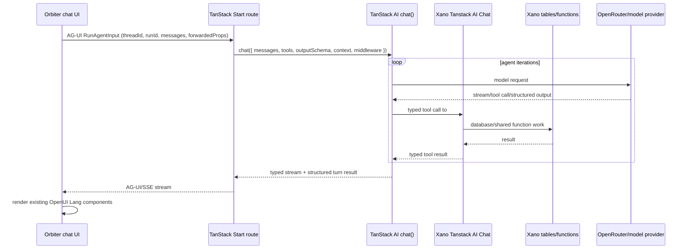

<Note>
  This is build plan to refactor to Tanstack AI for chat instead of AI-SDK.
</Note>

<Warning>
  This page is a plan only. Do not build frontend code, do not create Xano
  endpoints, and do not edit or delete existing Xano endpoints while using this
  page as the starting point.
</Warning>

## Build Status

<Info>
  Update this section immediately after each phase or blocking sub-step is
  executed. If implementation work happens without a matching status update
  here, the build is not ready for review or cutover.
</Info>

Current state: blueprint endpoint inventory and #1286 register are tightened;
frontend and Xano implementation have not started from this page yet.

| Phase | Status | Last updated | Evidence | Next action |
| --- | --- | --- | --- | --- |
| Blueprint prep | Complete | 2026-06-26 | Mintlify page/nav updated; endpoint inventory and #1286 register tightened with read-only Xano listings; docs checks passed. | Use this page as the implementation source of truth. |
| Phase 0 - Freeze The Baseline | Ready | 2026-06-26 | `tanstack-ai-chat` branch was created clean from `dev`; re-run checks before coding. | Run Phase 0 acceptance checks and record output. |
| Phase 1 - Define Shared Contracts | Not started | 2026-06-26 | None yet. | Add schemas, types, and contract tests. |
| Phase 2 - Design #1286 Xano Contracts | Ready | 2026-06-26 | New endpoint register uses unified #1286 names, replacement IDs, build modes, and mandatory short descriptions; #1286 group verified empty. | After Phase 0, create only retained #1286 endpoints with matching Xano descriptions. |
| Phase 3 - Build The TanStack AI Route | Not started | 2026-06-26 | None yet. | Add `/api/tanstack-ai-chat` route after #1286 contracts exist. |
| Phase 4 - Implement Shared Client Adapter | Not started | 2026-06-26 | None yet. | Add shared `useTanstackAiChat` adapter behind flags. |
| Phase 5 - Migrate How I Know First | Not started | 2026-06-26 | None yet. | Migrate How I Know behind its feature flag. |
| Phase 6 - Migrate Meeting Prep | Not started | 2026-06-26 | None yet. | Start only after How I Know passes checks. |
| Phase 7 - Migrate Leverage Loops | Not started | 2026-06-26 | None yet. | Start only after Meeting Prep passes checks. |
| Phase 8 - Migrate Outcomes Last | Not started | 2026-06-26 | None yet. | Start only after Leverage Loops passes checks. |
| Phase 9 - Shadow And Compare | Not started | 2026-06-26 | None yet. | Run legacy vs TanStack AI comparisons. |
| Phase 10 - QA Verification And Cutover Gate | Not started | 2026-06-26 | None yet. | Run the required QA matrix before cutover. |
| Phase 11 - Cutover And Rollback Window | Not started | 2026-06-26 | None yet. | Enable flags only after QA passes. |
| Phase 12 - Cleanup Stale Code | Not started | 2026-06-26 | None yet. | Remove stale code only after rollback window closes. |
| Phase 13 - Deprecation And GCP Handoff | Not started | 2026-06-26 | None yet. | Document #1286 as the GCP rebuild scope. |

Status values must be one of: `Not started`, `Ready`, `In progress`,
`Blocked`, `Complete`. Each completed row must include evidence: command output,
PR link, trace link, screenshot, QA artifact, or Xano endpoint/export reference.

When updating status:

1. Change only the row for the phase or sub-step just executed.
2. Update `Last updated` to the current date.
3. Replace `Evidence` with a concrete artifact, not a vague note.
4. Set `Next action` to the next executable step or `None`.
5. If a phase is `Blocked`, name the blocker and owner in `Next action`.

## Non-negotiables

- Start from the clean `dev` branch state, not the `ai-sdk-chat` branch.
- Do not include or port changes from `ai-sdk-chat`.
- Do not edit, delete, rename, or repurpose any endpoint in **Robert API**.
- Final chat paths must not call **Robert API** (`#1261`, canonical `Bd_dCiOz`).
- Every endpoint used by the refactored chat flows must live in **Tanstack AI Chat** (`#1286`, canonical `6TC-_sTf`).
- Xano API group **Tanstack AI Chat #1286** is the GCP migration boundary. When Orbiter moves to GCP, rebuild only this group for chat.
- Existing Robert/OpenUI05/OpenLang/Anything Engine endpoints remain live for rollback and parity checks only. They are not the target backend.
- Final #1286 endpoints must be self-contained Xano implementations or shared-function/database implementations. Do not make #1286 a thin HTTP wrapper around Robert API in the final state.
- #1286 endpoint names must be new, logical, and consistent. Do not copy old
  names just because legacy endpoints used them. Use this inventory to preserve
  behavior, not to preserve naming.
- The final #1286 group must contain only endpoints still used after the
  refactor. Do not create placeholder, parity-only, speculative, or rollback-only
  endpoints in #1286.

## Source Audit

This plan is based on the current `dev` code in:

| Surface | Primary files checked |
| --- | --- |
| Outcomes | `src/features/outcomes/openui/outcomes-canvas-openui.tsx`, `src/features/outcomes/api/*`, `src/features/outcomes/openui/components.tsx` |
| Leverage Loops | `src/features/leverage-loops/components/leverage-loops-canvas.tsx`, `src/features/leverage-loops/api/use-leverage-loop-interview.ts` |
| Meeting Prep | `src/features/meeting-prep/components/meeting-prep-canvas.tsx`, `src/features/events/api/use-events.ts`, `src/features/copilot/lib/xano-copilot.ts` |
| How I Know | `src/features/master-persons/components/how-i-know-chat.tsx`, `src/features/master-persons/api/use-how-i-know-interview.ts` |
| Shared Xano client | `src/features/copilot/lib/xano-copilot.ts`, `src/constants/api-groups.ts`, `src/integrations/xano/fetch.ts` |

<Info>
  The original AI SDK scope doc was centered on the global copilot `/chat`
  route. This plan is broader: it explicitly includes Outcomes, Leverage
  Loops, Meeting Prep, and the newer **How I Know** relationship interview
  chat that was added after that original scope.
</Info>

## TanStack AI Features To Use

Use TanStack AI as the chat runtime, not Vercel AI SDK. The current official
TanStack AI docs call out the pieces this plan should optimize for:

| Feature | How to use it in Orbiter |
| --- | --- |
| `@tanstack/ai` `chat()` | Server-side agent loop for each chat turn. |
| `@tanstack/ai-react` `useChat` | Client chat state, streaming, typed UI messages, and retry/abort hooks. |
| `toolDefinition()` | Define each Xano #1286 call as a typed server tool with Zod input and output schemas. |
| Isomorphic tools | Keep server tools for Xano reads/writes; reserve client tools for UI-only actions such as scroll, focus, toast, or approval UI. |
| `outputSchema` structured outputs | Replace hand-parsed JSON/OpenUI Lang metadata with typed turn results, then render the existing OpenUI Lang components from validated data. |
| AG-UI request shape | Use `threadId`, `runId`, `forwardedProps`, and tool metadata as the standard wire shape. |
| Runtime context | Pass auth, data source, branch, user ids, feature flags, and trace ids into tools without exposing them to the model. |
| Approval flow | Gate destructive or user-visible actions such as submit/dispatch, save final relationship, or create request rows. |
| OpenRouter adapter | Keep model routing flexible with `@tanstack/ai-openrouter` unless product decides on a direct provider. |
| OpenTelemetry middleware | Trace each chat call, agent iteration, tool call, token usage, latency, and cost. |

Official docs checked:

- [TanStack AI overview](https://tanstack.com/ai/latest/docs/getting-started/overview)
- [Tools guide](https://tanstack.com/ai/latest/docs/tools/tools)
- [Structured outputs overview](https://tanstack.com/ai/latest/docs/structured-outputs/overview)
- [Runtime context](https://tanstack.com/ai/latest/docs/advanced/runtime-context)
- [OpenTelemetry](https://tanstack.com/ai/latest/docs/advanced/otel)
- [AG-UI compliance](https://tanstack.com/ai/latest/docs/migration/ag-ui-compliance)
- [OpenRouter adapter](https://tanstack.com/ai/latest/docs/adapters/openrouter)

## Resolved Implementation Defaults

These defaults are intentionally fixed so the AI builder does not pause on
architecture choices while implementing.

| Decision | Default for this build |
| --- | --- |
| Source branch | `tanstack-ai-chat`, created clean from `dev`. No `ai-sdk-chat` commits or code. |
| Chat runtime | TanStack AI `chat()` on the server. No Vercel AI SDK imports in new chat code. |
| Route primitive | TanStack Start server route with `createFileRoute(...).server.handlers.POST`, not `createServerFn`, because this path needs raw AG-UI/SSE request and response control. |
| Route path | `src/routes/api/tanstack-ai-chat.ts` exporting `createFileRoute("/api/tanstack-ai-chat")`. |
| Client hook | `@tanstack/ai-react` `useChat` with AG-UI `threadId`, `runId`, `forwardedProps`, and abort/retry support. |
| Provider | `@tanstack/ai-openrouter`. |
| Default model | `anthropic/claude-sonnet-4.5`, configurable by a server-only env var after the baseline works. |
| Renderer | Preserve the existing OpenUI Lang `Renderer` and `anythingEngineLibrary` until all four chat flows are migrated. |
| Xano target | `API_GROUPS.TANSTACK_AI_CHAT = "6TC-_sTf"` only. This maps to Xano API group **Tanstack AI Chat #1286**. |
| Auth | Require the existing authenticated app session and require a Xano bearer token on the chat request. Forward the Xano bearer token, `X-Data-Source`, and `X-Branch` to #1286 tools. Never accept `user_id` from the client. |
| Streaming protocol | AG-UI-compatible SSE from the TanStack Start route. Do not invent custom event names unless TanStack AI requires them. |
| Tool style | One `toolDefinition()` per capability family, backed by #1286 only, with Zod input and output schemas. |
| Structured output | Every chat turn returns a typed `TurnResult` envelope. OpenUI Lang is a rendered field inside that envelope, not the source of truth. |
| Side effects | Submit, dispatch, final relationship save, memory writes, and file uploads require explicit intent or TanStack AI approval flow. |
| Rollout order | How I Know, Meeting Prep, Leverage Loops, Outcomes. |
| Rollback | Per-surface feature flags. Flag off must preserve current `dev` behavior until deprecation. |

## Target Architecture



The frontend should gain one chat-owned Xano group constant:

```ts
TANSTACK_AI_CHAT: "6TC-_sTf" // Xano API group #1286
```

All chat-specific Xano calls must move behind this constant. The refactor is
complete only when chat code paths no longer reach these legacy canonical
groups:

| Legacy group | Group id | Canonical | Target status |
| --- | ---: | --- | --- |
| Robert API | `1261` | `Bd_dCiOz` | No calls from refactored chat paths |
| Robert OpenUI 0.5 | `1276` | `C5i2nPpF` | Rebuilt into #1286 |
| OpenLang Native | `1278` | `CgebkNIJ` | Rebuilt into #1286 |
| Anything Engine | `1270` | `UgP1h6uR` | Rebuilt into #1286 where used by chat |

## Builder Rules

These rules are for the AI agent that implements the plan. They are part of the
build contract, not suggestions.

### TypeScript Rules

- Use `strict` TypeScript patterns already present in the repo.
- Use Zod schemas at every network boundary: route body, `forwardedProps`, tool
  inputs, tool outputs, #1286 response payloads, and structured turn results.
- Prefer `unknown` plus schema narrowing over `any`. Do not introduce new `any`
  in chat code.
- Export inferred types from schemas with `z.infer`. Do not duplicate hand-written
  interfaces when a schema is the source of truth.
- Use discriminated unions for surface-specific turn state and approval events.
- Use exhaustive `switch` checks for `ChatSurface`, `approval_request.kind`, and
  tool result kinds. Add a `never` guard so future surface additions fail loudly.
- Keep ids as numbers once parsed. Keep Xano canonical slugs and endpoint paths
  as string constants.
- Use `import type` for type-only imports.
- Avoid non-null assertions except immediately after a local validation branch
  that proves the value exists.
- Cap user/model supplied strings before sending to Xano or the model. Preserve
  the existing caps where current code already protects transcript/context size.
- No client-controlled field may decide auth, ownership, model provider, model
  id, endpoint group, or tool list.

### TanStack Start Rules

- Use a server route for `/api/tanstack-ai-chat` because streaming requires raw
  `Request` and `Response` control.
- Use `createServerFn` only for non-streaming internal RPC helpers, never for
  the AG-UI chat stream.
- Parse the route body once. Prefer `chatParamsFromRequest` if it is available
  in the installed TanStack AI version; otherwise build one local parser around
  the same AG-UI fields and Zod schemas.
- Validate only the specific `forwardedProps` keys this app supports. Never
  spread `forwardedProps` into `chat()`.
- Return clean 400/401/403/500 responses with stable error codes. Log internal
  detail server-side; send sanitized messages to the client.
- Keep server-only code in `.server.ts`; keep client-only adapters in
  `.client.ts`; keep schemas and constants in plain `.ts`.
- Add every new env var to both the `createEnv` schema and `runtimeEnv` mapping
  in `src/env.ts`.
- Server-only secrets must not use the `VITE_` prefix. Client feature flags must
  use `VITE_`.
- Keep `beforeLoad`/session behavior intact for authed app routes. The chat API
  route must still enforce auth server-side; do not rely only on UI route
  protection.

### TanStack AI Rules

- Use `chat()` with `tools`, typed runtime `context`, `outputSchema`, and
  OpenTelemetry middleware.
- Set a max iteration/step guard for every agent loop.
- Add request timeout and abort handling so closing a chat, navigating away, or
  retrying does not leave dangling tool calls.
- Put #1286 calls behind server tools. Do not call Xano directly from surface
  components for turn execution.
- Name tools by capability, not legacy endpoint, for example
  `outcomes_create_draft`, `how_i_know_interview_turn`, `relationships_upsert`.
- Tool implementations must return typed data only. They must not return raw
  `Response`, unvalidated JSON, or full Xano error blobs.
- Use runtime context for auth token, data source, branch, surface, trace id,
  and thread id. Runtime context is not prompt context.
- Use approval flow for every tool that can create rows, submit work, upload
  files, write memory, or mark a relationship interview complete.
- Preserve the existing OpenUI rendering during this migration. Do not replace
  renderer components while changing orchestration.

### Xano #1286 Rules

- Every #1286 endpoint must derive ownership from auth. Never accept client
  `user_id`, `team_id`, or owner ids for authorization.
- Every #1286 endpoint must document the legacy endpoint ids it replaces.
- Every #1286 endpoint must have a short, user-readable Xano description before
  creation or publish. Use one concise sentence that explains what the endpoint
  does for the final TanStack AI chat surface.
- Every mutation endpoint must be idempotent where retry is possible. Use
  `thread_id`, `run_id`, `suggestion_request_id`, `nylas_event_id`, or
  `master_person_id` as the natural key depending on surface.
- Use one response envelope across #1286:

```ts
type XanoToolResponse<T> =
  | { ok: true; data: T; request_id: string }
  | {
      ok: false;
      error: { code: string; message: string; retryable: boolean };
      request_id: string;
    };
```

- Do not expose raw model prompts, raw provider errors, stack traces, or secrets
  through #1286 responses.
- Final #1286 endpoints must not HTTP-call Robert API. Temporary parity scripts
  may compare against Robert, but production #1286 must own its implementation.
- Treat every #1286 endpoint as a new contract. It may reuse lower-level Xano
  functions or database logic, but the endpoint path, request schema, and
  response schema must be designed for the final TanStack AI chat surface.
- Never create a #1286 endpoint for a row marked `Rebuild if retained` until
  Phase 0 proves the flag-on refactor still needs that capability. If it is not
  retained, leave no endpoint behind in #1286.
- The register's `Short description` column anchors the Xano endpoint
  description. Keep both in sync when an endpoint is created or changed.

### Commenting Rules

- Prefer clear names and small functions over comments.
- Add comments only where they explain a non-obvious invariant, migration
  boundary, retry/idempotency rule, auth rule, or legacy compatibility behavior.
- Every exported server tool should have a short JSDoc comment naming the #1286
  endpoint and the legacy endpoint ids it replaces.
- Do not add comments that restate the next line of code.
- When deleting a legacy call site, leave no "temporary" comments unless there
  is an issue, date, owner, and removal condition.

### Suggested File Layout

```txt
src/features/tanstack-ai-chat/
  client/
    use-tanstack-ai-chat.client.ts
    feature-flags.ts
  contracts/
    approvals.ts
    context.ts
    messages.ts
    surfaces.ts
    turn-result.ts
    xano-responses.ts
  server/
    auth.server.ts
    env.server.ts
    errors.server.ts
    openrouter.server.ts
    route-utils.server.ts
    tanstack-ai-chat.server.ts
    xano-client.server.ts
    tools/
      chat-context.server.ts
      how-i-know.server.ts
      leverage-loops.server.ts
      meeting-prep.server.ts
      memory.server.ts
      outcomes.server.ts
      relationships.server.ts
  tests/
    contracts.test.ts
    no-legacy-endpoints.test.ts
    route-smoke.test.ts
```

Route file:

```txt
src/routes/api/tanstack-ai-chat.ts
```

Surface adapters should stay close to their current features, but they should
import shared contracts and the shared `useTanstackAiChat` client adapter rather
than creating four separate chat runtimes.

## Current Xano Endpoint Inventory

This is the source-of-truth inventory for existing Xano APIs currently involved
in the four audited chat surfaces. Every row that remains part of the refactored
chat experience needs a new contract in **Tanstack AI Chat #1286**.

If implementation discovers another live Xano call in Outcomes, Leverage Loops,
Meeting Prep, How I Know, or their shared chat helpers, stop and add it to this
inventory before writing refactor code. If a row is later proven stale or
unreachable, do not delete it silently. Mark the refactor action as
`Not retained after Phase 0 audit`, and link the evidence in Build Status.

Use the code call site and Xano API URL together when documenting or rebuilding an
endpoint. The API URL format is:

```txt
https://xh2o-yths-38lt.n7c.xano.io/api:<canonical>/<endpoint-name>
```

Example: `GET https://xh2o-yths-38lt.n7c.xano.io/api:MkA4QsNh/suggestion-requests`
is V2 Suggestions `#345`, endpoint `#3054`.

Endpoint IDs in this inventory were cross-referenced from frontend code,
Mintlify API-reference pages, and read-only Xano workspace 3 API listings. The
builder must use the same standard for any new row: code call site plus Xano
endpoint ID plus canonical API URL.

The API path column uses the shorthand `METHOD api:<canonical>/<path>`. Expand
it to the full URL with the host above when testing or documenting the
endpoint.

Key audited code call sites:

| Area | Code evidence |
| --- | --- |
| Shared chat helpers | `src/features/copilot/lib/xano-copilot.ts` |
| Outcomes chat | `src/features/outcomes/openui/outcomes-canvas-openui.tsx`, `src/features/outcomes/components/chat-shell.tsx`, `src/features/outcomes/api/*` |
| Leverage Loops chat | `src/features/leverage-loops/components/leverage-loops-canvas.tsx`, `src/features/leverage-loops/api/*` |
| Meeting Prep chat | `src/features/meeting-prep/components/meeting-prep-canvas.tsx`, `src/features/events/api/use-events.ts` |
| How I Know chat | `src/features/master-persons/components/how-i-know-chat.tsx`, `src/features/master-persons/api/use-how-i-know-interview.ts` |

### Shared Chat Context, Search, Memory, And History

| Current group | API path | Xano endpoint ID | Current role | #1286 refactor action |
| --- | --- | ---: | --- | --- |
| Auth `#27` (`qMCc0ojP`) | `GET api:qMCc0ojP/auth/me` | `642` | Reads the authenticated user and self ids used by chat context. | Prefer server auth context in the TanStack route; expose #1286 `chat/context/self` only if the chat turn still needs a bootstrap tool. |
| V2 Master Persons `#350` (`WKgay2AU`) | `GET api:WKgay2AU/master-persons/{master_person_id}` | `3081` | How I Know resolves the user's `master_company_id`. | Move lookup into #1286 context assembly. |
| Robert API `#1261` (`Bd_dCiOz`) | `POST api:Bd_dCiOz/chat` | `8064` | Legacy global copilot turn endpoint; older Outcomes code can still call it. | Do not retain as a #1286 endpoint. Replace turn execution with `/api/tanstack-ai-chat` plus #1286 tools. |
| Robert API `#1261` (`Bd_dCiOz`) | `GET api:Bd_dCiOz/search` | `8071` | Person picker/search in Outcomes and Leverage Loops. | Rebuild as #1286 people search. |
| Robert API `#1261` (`Bd_dCiOz`) | `GET api:Bd_dCiOz/person-search` | `8053` | Fallback person search when `/search` fails. | Merge into #1286 people search or rebuild as fallback behavior. |
| Robert API `#1261` (`Bd_dCiOz`) | `GET api:Bd_dCiOz/network` | `8066` | Network summary and opening context for Outcomes and Leverage Loops. | Rebuild as #1286 bounded network summary. |
| Robert API `#1261` (`Bd_dCiOz`) | `GET api:Bd_dCiOz/connection-path` | `8075` | Warm path lookup for selected people. | Rebuild as #1286 connection path tool if retained. |
| Robert API `#1261` (`Bd_dCiOz`) | `GET api:Bd_dCiOz/person-context/{master_person_id}` | `8047` | Rich prose person context for pickers and starter grounding. | Rebuild as #1286 person context. |
| Robert API `#1261` (`Bd_dCiOz`) | `GET api:Bd_dCiOz/context-check/{master_person_id}` | `8200` | Context-completeness check exported by the shared copilot client. | Rebuild if Phase 0 proves a flag-on chat path still reaches it; otherwise mark not retained. |
| Robert API `#1261` (`Bd_dCiOz`) | `GET api:Bd_dCiOz/master-context-person/{master_person_id}` | `8573` | YAML person context for Outcomes, Leverage Loops, and How I Know. | Rebuild as #1286 YAML/prose person context. |
| Robert API `#1261` (`Bd_dCiOz`) | `GET api:Bd_dCiOz/master-context-company/{master_company_id}` | `8579` | YAML company context for user, target, and self-company grounding. | Rebuild as #1286 company context. |
| Robert API `#1261` (`Bd_dCiOz`) | `GET api:Bd_dCiOz/memory` | `8222` | User memory side panel in chat-adjacent Outcomes/copilot UI. | Rebuild if memory remains in the chat surface. |
| Robert API `#1261` (`Bd_dCiOz`) | `POST api:Bd_dCiOz/memory` | `8223` | Create memory from chat UI. | Rebuild with auth-derived ownership and approval rules where needed. |
| Robert API `#1261` (`Bd_dCiOz`) | `PATCH api:Bd_dCiOz/memory/{memory_id}` | `8229` | Update chat memory. | Rebuild with ownership checks if retained. |
| Robert API `#1261` (`Bd_dCiOz`) | `DELETE api:Bd_dCiOz/memory/{memory_id}` | `8230` | Delete chat memory. | Rebuild with ownership checks if retained. |
| Robert API `#1261` (`Bd_dCiOz`) | `POST api:Bd_dCiOz/conversations` | `8152` | Global conversation create. | Rebuild as #1286 thread create/ensure. |
| Robert API `#1261` (`Bd_dCiOz`) | `GET api:Bd_dCiOz/conversations` | `8153` | Global conversation list. | Rebuild as #1286 thread list if history remains in chat. |
| Robert API `#1261` (`Bd_dCiOz`) | `POST api:Bd_dCiOz/conversations/{conversation_id}/messages` | `8154` | Persist global message/card items. | Rebuild as normalized #1286 message append. |
| Robert API `#1261` (`Bd_dCiOz`) | `GET api:Bd_dCiOz/conversations/{conversation_id}/messages` | `8155` | Hydrate global message history. | Rebuild as normalized #1286 message hydrate. |
| Robert API `#1261` (`Bd_dCiOz`) | `DELETE api:Bd_dCiOz/conversations/{conversation_id}` | `8156` | Delete conversation. | Rebuild if exposed after chat-history audit. |
| Robert API `#1261` (`Bd_dCiOz`) | `PATCH api:Bd_dCiOz/conversations/{conversation_id}` | `8574` | Rename conversation. | Rebuild if exposed after chat-history audit. |

<Warning>
  Robert API `/chat` (`#8064`) is listed for baseline completeness only. It is
  not replaced by a #1286 chat endpoint. It is replaced by the TanStack Start
  `/api/tanstack-ai-chat` route, which may call only typed #1286 tools.
</Warning>

### V2 Suggestions Result And Draft Data

These endpoints are not in Robert API, but they are used by the current Outcomes
and Leverage Loops chat surfaces for sidebars, draft hydration, result cards,
actions, and trajectories. If flag-on chat UI still reads this data directly,
the call must move into #1286.

| Current group | API path | Xano endpoint ID | Current role | #1286 refactor action |
| --- | --- | ---: | --- | --- |
| V2 Suggestions `#345` (`MkA4QsNh`) | `GET api:MkA4QsNh/suggestion-requests` | `3054` | Lists active Outcomes/Loops and hydrates selected draft metadata. | Rebuild as #1286 Outcomes/Loops request lookup where chat-owned. |
| V2 Suggestions `#345` (`MkA4QsNh`) | `GET api:MkA4QsNh/suggestion-requests/archived` | `8729` | Archived Outcomes fallback for selected draft lookup. | Rebuild as #1286 archived lookup if chat still opens archived drafts. |
| V2 Suggestions `#345` (`MkA4QsNh`) | `GET api:MkA4QsNh/outcome-suggestions` | `3038` | Reads generated Outcome result cards by `suggestion_request_id`. | Rebuild as #1286 Outcomes result read if the chat surface renders submitted results. |
| V2 Suggestions `#345` (`MkA4QsNh`) | `GET api:MkA4QsNh/outcome-suggestion-nodes` | `3044` | Reads nodes attached to an Outcome suggestion result. | Rebuild as #1286 Outcome nodes read if rendered in chat/results panel. |
| V2 Suggestions `#345` (`MkA4QsNh`) | `GET api:MkA4QsNh/outcome-actions` | `3057` | Reads actions for an Outcome suggestion. | Rebuild as #1286 Outcomes actions read if rendered in chat/results panel. |
| V2 Suggestions `#345` (`MkA4QsNh`) | `GET api:MkA4QsNh/outcome-trajectories` | `3058` | Reads trajectories for an Outcome suggestion. | Rebuild as #1286 Outcomes trajectories read if rendered in chat/results panel. |
| V2 Suggestions `#345` (`MkA4QsNh`) | `GET api:MkA4QsNh/leverage-loop-suggestions` | `3037` | Reads generated Leverage Loop suggestions by `suggestion_request_id`. | Rebuild as #1286 Loop suggestions read if the chat surface renders submitted results. |
| V2 Suggestions `#345` (`MkA4QsNh`) | `GET api:MkA4QsNh/leverage-loop-actions` | `3060` | Reads actions for a Leverage Loop suggestion. | Rebuild as #1286 Loop actions read if rendered in chat/results panel. |
| V2 Suggestions `#345` (`MkA4QsNh`) | `GET api:MkA4QsNh/leverage-loop-trajectories` | `3061` | Reads trajectories for a Leverage Loop suggestion. | Rebuild as #1286 Loop trajectories read if rendered in chat/results panel. |
| V2 Suggestions `#345` (`MkA4QsNh`) | `GET api:MkA4QsNh/suggestion-request-files` | `8413` | Reads files attached to a suggestion request. | Rebuild as #1286 file read if chat upload/reopen UI needs file hydration. |
| V2 Suggestions `#345` (`MkA4QsNh`) | `POST api:MkA4QsNh/suggestion-request-files` | `8414` | Uploads files to a suggestion request; current OpenUI05 upload path wraps this pipeline. | Rebuild or call a shared upload function inside #1286; final chat UI must not call #345 directly. |
| V2 Suggestions `#345` (`MkA4QsNh`) | `DELETE api:MkA4QsNh/suggestion-request-files/{suggestion_request_file_id}` | `8415` | Deletes attached suggestion request files. | Rebuild in #1286 if chat exposes file removal. |

### Outcomes Chat

| Current group | API path | Xano endpoint ID | Current role | #1286 refactor action |
| --- | --- | ---: | --- | --- |
| OpenUI05 `#1276` (`C5i2nPpF`) | `POST api:C5i2nPpF/openui05/classify` | `8490` | Classifies the first Outcomes turn and the Leverage Loop goal. | Rebuild as #1286 classify tools or fold into TanStack AI structured turns. |
| OpenUI05 `#1276` (`C5i2nPpF`) | `POST api:C5i2nPpF/openui05/clarify-class` | `8507` | Generates clarification options for ambiguous Outcomes classes. | Rebuild as #1286 clarify tool. |
| OpenUI05 `#1276` (`C5i2nPpF`) | `POST api:C5i2nPpF/openui05/start-outcome` | `8502` | Creates draft `suggestion_request` rows for Outcomes and Loops. | Rebuild as #1286 draft create/update. |
| OpenUI05 `#1276` (`C5i2nPpF`) | `POST api:C5i2nPpF/openui05/save-request-context` | `8635` | Saves running interview summary into `request_context`. | Rebuild as #1286 request-context save. |
| OpenUI05 `#1276` (`C5i2nPpF`) | `POST api:C5i2nPpF/openui05/submit-request-meta` | `8617` | Persists `number_of_results` and `deliver_format` before submit. | Rebuild as #1286 submit metadata. |
| OpenUI05 `#1276` (`C5i2nPpF`) | `POST api:C5i2nPpF/openui05/dispatch` | `8497` | Promotes/submits Outcomes requests and returns OpenUI Lang. | Rebuild as #1286 dispatch/submit. |
| OpenUI05 `#1276` (`C5i2nPpF`) | `GET api:C5i2nPpF/openui05/pitch-profile` | `8498` | Reads pitch profile for fundraising flows. | Rebuild as #1286 pitch profile read. |
| OpenUI05 `#1276` (`C5i2nPpF`) | `POST api:C5i2nPpF/openui05/pitch-profile` | `8499` | Writes pitch profile fields. | Rebuild as #1286 pitch profile write. |
| OpenUI05 `#1276` (`C5i2nPpF`) | `POST api:C5i2nPpF/openui05/upload-files` | `8504` | Uploads decks/files attached to a draft. | Rebuild as #1286 file upload. |
| Anything Engine `#1270` (`UgP1h6uR`) | `POST api:UgP1h6uR/anything-engine/dispatch` | `8399` | Legacy Outcomes dispatch/classify route used by `useDispatchAnythingEngine`. | Rebuild as #1286 Outcomes submit/dispatch if still reachable. |
| Anything Engine `#1270` (`UgP1h6uR`) | `POST api:UgP1h6uR/anything-engine/interview` | `8411` | Main Outcomes per-class interview turn. | Replace with TanStack AI agent turn plus #1286 tools. |
| Anything Engine `#1270` (`UgP1h6uR`) | `POST api:UgP1h6uR/anything-engine/find-talent/interview` | `8484` | Specialized `find_talent` interview. | Rebuild as #1286 specialized tool or class-specific prompt. |
| Anything Engine `#1270` (`UgP1h6uR`) | `GET api:UgP1h6uR/anything-engine/pitch-profile` | `8420` | Pitch profile poll/read path. | Rebuild if still reached after audit; otherwise remove chat call site. |
| Anything Engine `#1270` (`UgP1h6uR`) | `POST api:UgP1h6uR/anything-engine/summarize-pitch-profile` | `8545` | Rewrites pitch summary after edits. | Rebuild as #1286 structured summary tool. |
| Anything Engine `#1270` (`UgP1h6uR`) | `POST api:UgP1h6uR/summarize` | `8545` | Frontend `useSummarize` call path; Xano listing resolves the related live endpoint family to `anything-engine/summarize-pitch-profile` #8545. | Reconcile alias in Phase 0, then rebuild as one #1286 summary endpoint. |
| Anything Engine `#1270` (`UgP1h6uR`) | `GET api:UgP1h6uR/anything-engine/pitch-profile/most-recent` | `8548` | "Use existing pitch profile" lane. | Rebuild as #1286 most-recent pitch profile. |
| Robert API `#1261` (`Bd_dCiOz`) | `GET api:Bd_dCiOz/outcomes` | `8067` | Legacy Outcomes list helper in shared copilot code. | Rebuild only if a flag-on chat panel still reaches this helper; otherwise mark not retained. |
| Robert API `#1261` (`Bd_dCiOz`) | `POST api:Bd_dCiOz/outcome` | `8068` | Contact-card/serendipity helper creates an Outcome row. | Rebuild as #1286 contact-card draft/create only if retained in chat-owned UI. |
| Robert API `#1261` (`Bd_dCiOz`) | `POST api:Bd_dCiOz/outcome-conversations` | `8307` | Persists Outcomes per-turn thread messages. | Rebuild as #1286 Outcomes thread append. |
| Robert API `#1261` (`Bd_dCiOz`) | `GET api:Bd_dCiOz/outcome-conversations` | `8308` | Hydrates Outcomes per-draft messages. | Rebuild as #1286 Outcomes thread hydrate. |
| Robert API `#1261` (`Bd_dCiOz`) | `GET api:Bd_dCiOz/suggestion-requests` | `8129` | Contact card dedupe before "Add to Outcomes". | Rebuild as #1286 suggestion request lookup. |
| Robert API `#1261` (`Bd_dCiOz`) | `POST api:Bd_dCiOz/dispatch` | `8084` | OpenUI contact-card action can add an Outcome; Loops use the same endpoint for dispatch. | Rebuild as #1286 contact-card/dispatch action with approval. |

### Leverage Loops Chat

| Current group | API path | Xano endpoint ID | Current role | #1286 refactor action |
| --- | --- | ---: | --- | --- |
| OpenUI05 `#1276` (`C5i2nPpF`) | `POST api:C5i2nPpF/openui05/classify` | `8490` | Classifies the Leverage Loop user goal. | Rebuild as #1286 loop classify tool or structured TanStack step. |
| OpenUI05 `#1276` (`C5i2nPpF`) | `POST api:C5i2nPpF/openui05/start-outcome` | `8502` | Creates draft row with `copilot_mode="loop"`. | Rebuild as #1286 loop draft create/update. |
| OpenUI05 `#1276` (`C5i2nPpF`) | `POST api:C5i2nPpF/openui05/leverage-loop-interview` | `8580` | Legacy Leverage Loop interview hook; current canvas prefers OpenLang #8584. | Rebuild only if Phase 0 proves a live flag-off/rollback path needs parity; do not call in final flag-on chat. |
| OpenLang Native `#1278` (`CgebkNIJ`) | `POST api:CgebkNIJ/interview` | `8584` | Active Leverage Loop interview turn returning OpenUI Lang. | Rebuild as TanStack AI chat turn and #1286 structured output. |
| OpenUI05 `#1276` (`C5i2nPpF`) | `POST api:C5i2nPpF/openui05/save-request-context` | `8635` | Saves running summary for the draft row. | Rebuild as #1286 loop request-context save. |
| Robert API `#1261` (`Bd_dCiOz`) | `POST api:Bd_dCiOz/leverage-loop-conversations` | `8305` | Persists Leverage Loop per-turn messages. | Rebuild as #1286 loop thread append. |
| Robert API `#1261` (`Bd_dCiOz`) | `GET api:Bd_dCiOz/leverage-loop-conversations` | `8306` | Hydrates Leverage Loop messages. | Rebuild as #1286 loop thread hydrate. |
| Robert API `#1261` (`Bd_dCiOz`) | `POST api:Bd_dCiOz/dispatch` | `8084` | Quick leverage and activation dispatch, including async memory write path. | Rebuild as #1286 loop dispatch with explicit approval. |
| Robert API `#1261` (`Bd_dCiOz`) | `GET api:Bd_dCiOz/leverage-loops` | `8049` | Lists active loops in the UI. | Rebuild in #1286 if used by the chat panel after refactor. |
| Robert API `#1261` (`Bd_dCiOz`) | `POST api:Bd_dCiOz/leverage-loop` | `8048` | Legacy loop create path. | Rebuild only if still reached after Phase 0 audit. |
| Robert API `#1261` (`Bd_dCiOz`) | `PATCH api:Bd_dCiOz/leverage-loop/{suggestion_request_id}/dispatch` | `8052` | Legacy loop dispatch path. | Rebuild only if still reached after Phase 0 audit. |
| Robert API `#1261` (`Bd_dCiOz`) | `POST api:Bd_dCiOz/generate-leverage-loop` | `8127` | Async suggestion generation after dispatch. | Rebuild or replace with #1286 job creation if chat triggers it. |
| Robert API `#1261` (`Bd_dCiOz`) | `GET api:Bd_dCiOz/process-status` | `8094` | Polls async process status. | Rebuild as #1286 job status if chat still polls. |
| Robert API `#1261` (`Bd_dCiOz`) | `POST api:Bd_dCiOz/process-cancel` | `8095` | Cancels async process. | Rebuild as #1286 job cancel if exposed. |
| Robert API `#1261` (`Bd_dCiOz`) | `GET api:Bd_dCiOz/relationships/{master_person_id}` | `8582` | Pulls "How I Know" summary for the target. | Rebuild as #1286 relationship context read. |

<Info>
  `openui05/leverage-loop-interview` (`#8580`) exists in OpenUI05, but the
  active Leverage Loops canvas uses OpenLang Native `interview` (`#8584`).
  Recheck before implementation and migrate only live call sites.
</Info>

### Meeting Prep Chat

| Current group | API path | Xano endpoint ID | Current role | #1286 refactor action |
| --- | --- | ---: | --- | --- |
| V2 Calendar Events `#505` (`LR2ywW7R`) | `GET api:LR2ywW7R/calendar-events` | `4329` | Lists upcoming events for meeting selection. | Rebuild as #1286 minimal event list if the refactored chat surface owns the sidebar/list; otherwise pass only selected `nylas_event_id` from non-chat page data. |
| Robert API `#1261` (`Bd_dCiOz`) | `POST api:Bd_dCiOz/meeting-prep-context/create` | `8325` | Create/load `meeting_prep_context` row by event. | Rebuild as #1286 meeting context create/load. |
| Robert API `#1261` (`Bd_dCiOz`) | `GET api:Bd_dCiOz/meeting-prep-context` | `8322` | Existing context read path. | Rebuild in #1286 if needed by chat. |
| Robert API `#1261` (`Bd_dCiOz`) | `PATCH api:Bd_dCiOz/meeting-prep-context/update` | `8326` | Updates desired outcome/checklist/research state. | Rebuild in #1286 if retained. |
| Robert API `#1261` (`Bd_dCiOz`) | `GET api:Bd_dCiOz/meeting-prep-context/status` | `8329` | Lightweight context status. | Rebuild as #1286 context status. |
| Robert API `#1261` (`Bd_dCiOz`) | `POST api:Bd_dCiOz/meeting-prep-context/email-threads` | `8331` | Adds email thread context. | Rebuild in #1286 if retained. |
| Robert API `#1261` (`Bd_dCiOz`) | `POST api:Bd_dCiOz/meeting-prep-context/prior-meetings` | `8332` | Adds prior meeting context. | Rebuild in #1286 if retained. |
| Robert API `#1261` (`Bd_dCiOz`) | `POST api:Bd_dCiOz/meeting-prep-context/upload` | `8333` | Uploads meeting prep attachment. | Rebuild in #1286 if retained. |
| Robert API `#1261` (`Bd_dCiOz`) | `POST api:Bd_dCiOz/meeting-prep` | `8098` | Legacy meeting prep generation. | Do not call from target. Rebuild logic in #1286. |
| OpenLang Native `#1278` (`CgebkNIJ`) | `POST api:CgebkNIJ/meeting-prep` | `8585` | Active Meeting Prep OpenUI Lang turn. | Rebuild as TanStack AI chat turn and #1286 structured output. |

### How I Know Chat

<Info>
  How I Know is a first-class chat surface in this plan. It was added after the
  original AI SDK scope and must not be skipped.
</Info>

| Current group | API path | Xano endpoint ID | Current role | #1286 refactor action |
| --- | --- | ---: | --- | --- |
| OpenUI05 `#1276` (`C5i2nPpF`) | `POST api:C5i2nPpF/openui05/how-i-know-interview` | `8581` | 8-14 turn relationship interview returning `ready`, `summary`, `next_question`, `exchange_count`, and nuggets. | Rebuild as #1286 `how-i-know/interview` powered by TanStack AI. |
| Robert API `#1261` (`Bd_dCiOz`) | `GET api:Bd_dCiOz/relationships/{master_person_id}` | `8582` | Rehydrates existing relationship transcript and summary. | Rebuild as #1286 relationship read. |
| Robert API `#1261` (`Bd_dCiOz`) | `POST api:Bd_dCiOz/relationships` | `8583` | Persists running and final transcript, summary, completion flag, and nuggets. | Rebuild as #1286 relationship upsert with approval for final save. |
| Robert API `#1261` (`Bd_dCiOz`) | `GET api:Bd_dCiOz/master-context-person/{master_person_id}` | `8573` | Fetches self and target YAML context. | Rebuild as #1286 person context tool. |
| Robert API `#1261` (`Bd_dCiOz`) | `GET api:Bd_dCiOz/master-context-company/{master_company_id}` | `8579` | Fetches self company YAML context. | Rebuild as #1286 company context tool. |
| Auth `#27` (`qMCc0ojP`) | `GET api:qMCc0ojP/auth/me` | `642` | Provides `currentUser.master_person_id`. | Prefer server runtime context; expose #1286 self context instead of UI calling auth directly. |
| V2 Master Persons `#350` (`WKgay2AU`) | `GET api:WKgay2AU/master-persons/{master_person_id}` | `3081` | Resolves the user's `master_company_id`. | Move lookup into #1286 context assembly. |

## New #1286 Endpoint Register

Create a deliberately small, chat-owned API family in **Tanstack AI Chat #1286**.
This table is the source of truth for newly designed endpoints. It is not a
copy list for legacy Xano paths.

Endpoint ID rule: **Xano assigns the numeric endpoint ID only after the endpoint
is created.** Until then, the `#1286 ID` cell must remain
`Not created yet`. Immediately after creating or cloning an endpoint, update this
table with the actual Xano endpoint ID, update Build Status, and link evidence.
No frontend code may call a #1286 endpoint until its row has a real ID, method,
path, replacement list, and short description.

Description rule: the `Short description` cell is mandatory. When an endpoint is
created in Xano, copy or adapt that sentence into the Xano endpoint description
so every new API is understandable from the #1286 group listing.

Naming convention:

- Use capability/resource names, not legacy implementation names. Avoid
  `openui05`, `anything-engine`, `conversations`, `suggestion-requests`, and
  singular legacy names such as `leverage-loop`.
- Use stable families: `threads`, `context`, `people`, `network`, `memories`,
  `outcomes`, `leverage-loops`, `meeting-prep`, and `how-i-know`.
- Use plural nouns for resources and verbs for commands, for example
  `outcomes/drafts`, `outcomes/dispatch`, and `meeting-prep/contexts`.
- A `Rebuild if retained` row is a planning candidate, not permission to create
  a placeholder. Create it only after Phase 0 proves the final refactor still
  calls it.

| Method | Final #1286 endpoint name | #1286 ID | Build mode | Replaces current endpoint IDs | Short description |
| --- | --- | --- | --- | --- | --- |
| POST | `threads/ensure` | Not created yet | Create | `8152` | Create or resume a normalized chat thread by `surface`, `thread_id`, and optional surface entity id. |
| GET | `threads` | Not created yet | Create | `8153` | List normalized chat threads if chat history remains in the UI. |
| GET | `threads/{thread_id}/messages` | Not created yet | Create | `8155`, `8308`, `8306` | Hydrate normalized chat messages for global, Outcomes, and Leverage Loop threads. |
| POST | `threads/{thread_id}/messages` | Not created yet | Create | `8154`, `8307`, `8305` | Append normalized user, assistant, tool, and rendered-card messages. |
| PATCH | `threads/{thread_id}` | Not created yet | Create | `8574` | Rename or update thread metadata if chat history keeps this UI. |
| DELETE | `threads/{thread_id}` | Not created yet | Create | `8156` | Delete/archive a thread if chat history keeps this UI. |
| GET | `context/self` | Not created yet | Create | `642`, `3081` | Return authenticated user's self person/company ids and minimal context. |
| GET | `context/people/{master_person_id}` | Not created yet | Rebuild | `8047`, `8573` | Return validated prose/YAML person context for TanStack AI tools. |
| GET | `context/companies/{master_company_id}` | Not created yet | Rebuild | `8579` | Return validated YAML company context for TanStack AI tools. |
| GET | `context/people/{master_person_id}/readiness` | Not created yet | Rebuild if retained | `8200` | Return context-completeness state if a flag-on chat path still needs it. |
| GET | `people/search` | Not created yet | Rebuild | `8071`, `8053` | Search network/universe people for chat person pickers. |
| GET | `network/summary` | Not created yet | Rebuild | `8066` | Return bounded network context for opening prompts and grounding. |
| GET | `network/connection-path` | Not created yet | Rebuild if retained | `8075` | Return warm-path connection data for a target person. |
| GET | `memories` | Not created yet | Rebuild if retained | `8222` | Read user/team memory if the memory panel remains in chat. |
| POST | `memories` | Not created yet | Rebuild if retained | `8223` | Create a memory with auth-derived ownership. |
| PATCH | `memories/{memory_id}` | Not created yet | Rebuild if retained | `8229` | Update memory fields with ownership checks. |
| DELETE | `memories/{memory_id}` | Not created yet | Rebuild if retained | `8230` | Delete or deactivate a memory with ownership checks. |
| POST | `outcomes/classify` | Not created yet | Rebuild | `8490` | Classify Outcomes intent and return confidence/ambiguity metadata. |
| POST | `outcomes/clarifications` | Not created yet | Rebuild | `8507` | Generate clarification options for ambiguous Outcomes prompts. |
| POST | `outcomes/drafts` | Not created yet | Rebuild | `8502`, `8068` | Create/update draft Outcome request rows. |
| POST | `outcomes/interview` | Not created yet | Rebuild | `8411` | Run a structured Outcomes interview turn through TanStack AI. |
| POST | `outcomes/find-talent/interview` | Not created yet | Rebuild | `8484` | Run the specialized `find_talent` interview path. |
| PATCH | `outcomes/drafts/{request_id}/context` | Not created yet | Rebuild | `8635` | Persist running summary, title, and request context. |
| PATCH | `outcomes/drafts/{request_id}/submit-metadata` | Not created yet | Rebuild | `8617` | Persist result count and delivery format before submit. |
| POST | `outcomes/dispatch` | Not created yet | Rebuild | `8399`, `8497`, `8084` | Submit/dispatch an Outcomes request after approval. |
| GET | `outcomes/pitch-profiles/{request_id}` | Not created yet | Rebuild | `8420`, `8498` | Read pitch profile readiness and profile fields. |
| PATCH | `outcomes/pitch-profiles/{request_id}` | Not created yet | Rebuild | `8499` | Write/update pitch profile fields. |
| GET | `outcomes/pitch-profiles/latest` | Not created yet | Rebuild | `8548` | Read the authenticated user's most recent pitch profile. |
| POST | `outcomes/pitch-profiles/summarize` | Not created yet | Rebuild | `8545` | Rewrite pitch summary after Modify-tab edits; replaces both `/summarize` and `summarize-pitch-profile` naming. |
| GET | `outcomes/files` | Not created yet | Rebuild if retained | `8413` | Read file attachments for draft reopen and upload state. |
| POST | `outcomes/files` | Not created yet | Rebuild | `8504`, `8414` | Upload and attach bounded file/deck content to an Outcomes draft. |
| DELETE | `outcomes/files/{suggestion_request_file_id}` | Not created yet | Rebuild if retained | `8415` | Delete attached files if chat exposes file removal. |
| GET | `outcomes/requests` | Not created yet | Rebuild | `3054`, `8729`, `8129`, `8067` | Lookup active/archived Outcome requests and contact-card dedupe records. |
| GET | `outcomes/results` | Not created yet | Rebuild if retained | `3038` | Read generated Outcome result cards by request id. |
| GET | `outcomes/results/{result_id}/nodes` | Not created yet | Rebuild if retained | `3044` | Read nodes attached to generated Outcome result cards. |
| GET | `outcomes/results/{result_id}/actions` | Not created yet | Rebuild if retained | `3057` | Read actions attached to Outcome result cards. |
| GET | `outcomes/results/{result_id}/trajectories` | Not created yet | Rebuild if retained | `3058` | Read trajectories attached to Outcome result cards. |
| POST | `outcomes/contact-actions` | Not created yet | Rebuild | `8084` | Add an Outcome from a rendered contact-card action. |
| POST | `leverage-loops/classify` | Not created yet | Rebuild | `8490` | Classify Leverage Loop intent using loop-specific context. |
| POST | `leverage-loops/drafts` | Not created yet | Rebuild | `8502` | Create/update Leverage Loop draft rows. |
| POST | `leverage-loops/interview` | Not created yet | Rebuild | `8584`, `8580` | Run Leverage Loop interview turns and return structured output/OpenUI Lang. |
| PATCH | `leverage-loops/drafts/{request_id}/context` | Not created yet | Rebuild | `8635` | Persist running Leverage Loop summary and title. |
| POST | `leverage-loops/dispatch` | Not created yet | Rebuild | `8084`, `8052` | Dispatch quick leverage or activation after approval. |
| GET | `leverage-loops/requests` | Not created yet | Rebuild if retained | `3054`, `8049` | Lookup Leverage Loop drafts/list rows. |
| GET | `leverage-loops/results` | Not created yet | Rebuild if retained | `3037` | Read generated Leverage Loop suggestions by request id. |
| GET | `leverage-loops/results/{result_id}/actions` | Not created yet | Rebuild if retained | `3060` | Read actions attached to Leverage Loop suggestions. |
| GET | `leverage-loops/results/{result_id}/trajectories` | Not created yet | Rebuild if retained | `3061` | Read trajectories attached to Leverage Loop suggestions. |
| POST | `leverage-loops` | Not created yet | Rebuild if retained | `8048` | Legacy loop create compatibility if a live chat path still reaches it. |
| POST | `leverage-loops/jobs/generate` | Not created yet | Rebuild if retained | `8127` | Start async loop suggestion generation if still chat-triggered. |
| GET | `leverage-loops/jobs/{job_id}` | Not created yet | Rebuild if retained | `8094` | Poll async generation job status. |
| POST | `leverage-loops/jobs/{job_id}/cancel` | Not created yet | Rebuild if retained | `8095` | Cancel async generation jobs exposed to chat. |
| GET | `meeting-prep/events` | Not created yet | Rebuild if retained | `4329` | Return minimal upcoming events if the chat surface owns the meeting sidebar/list. |
| POST | `meeting-prep/contexts` | Not created yet | Rebuild | `8325` | Create or load meeting prep context by auth user and `nylas_event_id`. |
| GET | `meeting-prep/contexts/{context_id}` | Not created yet | Rebuild if retained | `8322` | Read existing meeting prep context. |
| PATCH | `meeting-prep/contexts/{context_id}` | Not created yet | Rebuild if retained | `8326` | Update desired outcome/checklist/research state. |
| GET | `meeting-prep/contexts/{context_id}/status` | Not created yet | Rebuild | `8329` | Return lightweight context status. |
| POST | `meeting-prep/contexts/{context_id}/email-threads` | Not created yet | Rebuild if retained | `8331` | Attach email thread context to meeting prep. |
| POST | `meeting-prep/contexts/{context_id}/prior-meetings` | Not created yet | Rebuild if retained | `8332` | Attach prior meeting context to meeting prep. |
| POST | `meeting-prep/contexts/{context_id}/attachments` | Not created yet | Rebuild if retained | `8333` | Upload meeting prep attachments. |
| POST | `meeting-prep/generate` | Not created yet | Rebuild if retained | `8098` | Rebuild legacy meeting prep generation logic only if final chat still needs a standalone non-interview generation command. |
| POST | `meeting-prep/interview` | Not created yet | Rebuild | `8585` | Run conversational Meeting Prep turn and final brief output. |
| POST | `how-i-know/interview` | Not created yet | Rebuild | `8581` | Run the 8-14 turn relationship interview and emit summary/nuggets. |
| GET | `how-i-know/relationships/{master_person_id}` | Not created yet | Rebuild | `8582` | Read relationship transcript, summary, completion flag, and nuggets. |
| PUT | `how-i-know/relationships/{master_person_id}` | Not created yet | Rebuild | `8583` | Upsert running/final relationship interview state with approval for final save. |

Rows marked `Rebuild if retained` are not optional guesses. Phase 0 must either
prove the chat surface still needs them and then create #1286 replacements, or
mark them `Not retained after Phase 0 audit` with evidence in Build Status. A
row that is not retained must not be created in #1286.

## Build Plan

### Execution Discipline

- Complete phases in order. Do not start a later surface migration while an
  earlier surface has failing checks.
- Keep each phase reviewable. Prefer small commits by contract, route, shared
  tooling, and one surface at a time.
- Do not perform opportunistic UI redesigns, renderer rewrites, dependency
  cleanup, or unrelated refactors.
- Preserve unrelated local work. If the implementation branch is dirty, inspect
  before editing and never revert user changes.
- After every phase, run the phase checks plus the global quality gates at the
  end of this page.
- If an implementation detail conflicts with this blueprint, stop and update
  this page first. Do not silently choose a third path.

### Phase 0 - Freeze The Baseline

1. Confirm `orbiter-frontend` is on branch `tanstack-ai-chat` from clean `dev`.
2. Confirm there is no diff against `dev` and no commits from `ai-sdk-chat`.
3. Confirm `docs` contains this page and only docs changes.
4. Capture a fresh `rg` endpoint audit before implementation starts.
5. Confirm #1286 is still the intended API group and canonical slug:
   `Tanstack AI Chat #1286`, canonical `6TC-_sTf`.
6. Confirm #1286 starts empty or contains only endpoints created for this
   refactor. Anything else must be inventoried before coding.

Acceptance checks:

```bash
git -C /Users/markl.pederson/Documents/Projects/orbiter-frontend status --short --branch
git -C /Users/markl.pederson/Documents/Projects/orbiter-frontend diff dev...tanstack-ai-chat --stat
rg "Bd_dCiOz|C5i2nPpF|CgebkNIJ|UgP1h6uR|openui05|anything-engine|api:CgebkNIJ|copilotFetch" \
  /Users/markl.pederson/Documents/Projects/orbiter-frontend/src/features/outcomes \
  /Users/markl.pederson/Documents/Projects/orbiter-frontend/src/features/leverage-loops \
  /Users/markl.pederson/Documents/Projects/orbiter-frontend/src/features/meeting-prep \
  /Users/markl.pederson/Documents/Projects/orbiter-frontend/src/features/master-persons
```

### Phase 1 - Define Shared Contracts

1. Add a shared contract package for chat messages, tool inputs, tool outputs,
   and structured turn results.
2. Use Zod schemas for all TanStack AI tools and `outputSchema` responses.
3. Normalize all four surfaces to a common turn envelope:

```ts
type ChatSurface = "outcomes" | "leverage_loops" | "meeting_prep" | "how_i_know";

type TurnResult = {
  surface: ChatSurface;
  ready: boolean;
  openui_lang?: string;
  summary?: string;
  next_question?: string;
  approval_request?: {
    kind: "submit" | "dispatch" | "save_final_relationship";
    label: string;
    payload: unknown;
  };
  metadata?: Record<string, unknown>;
};
```

4. Keep OpenUI Lang rendering as a compatibility target at first. The model and
   tools should produce structured data; the server should render or validate
   `openui_lang` before it reaches the existing `Renderer`.
5. Keep file separation: shared schemas in plain `.ts`, server tool
   implementations in `.server.ts`, and client hook adapters in `.client.ts`
   or feature folders.
6. Create surface-specific schemas for:
   - Outcomes classification, clarification, draft, pitch profile, submit.
   - Leverage Loop target context, interview turn, dispatch.
   - Meeting Prep context, interview turn, final brief.
   - How I Know interview turn, nuggets, final relationship save.
7. Create a typed `LegacyEndpointId` constant map used only in docs, tests, and
   endpoint replacement comments. Do not use it to call legacy groups.

Acceptance checks:

- Every server tool has a Zod input schema and output schema.
- No schema imports server secrets into client bundles.
- How I Know has its own schema for `nuggets`, `exchange_count`, transcript,
  final `relationship_summary`, and `interview_complete`.
- `pnpm test` covers schema parse success/failure for every surface.
- `rg "any" src/features/tanstack-ai-chat` finds no new `any` usage except
  deliberate test-only fixtures with a comment explaining why.

### Phase 2 - Design #1286 Xano Contracts

1. Design endpoint contracts for every retained capability in the inventory
   above.
2. Use the endpoint register's naming convention. Group endpoints by capability
   and final surface behavior, not by the legacy Xano group or table name.
3. Require bearer auth on all user-specific endpoints.
4. Derive user ownership server-side from auth, not from client `user_id`.
5. Move reusable logic into Xano functions where possible, then expose only
   #1286 endpoints to the frontend.
6. Do not edit Robert API, OpenUI05, OpenLang, or Anything Engine endpoints.
7. Do not make final #1286 endpoints perform HTTP requests to Robert API.
8. Use the response envelope defined in [Xano #1286 Rules](#xano-1286-rules).
9. Add endpoint-level docs that include:
   - Surface owner.
   - Legacy endpoint ids replaced.
   - Short description.
   - Auth requirement.
   - Idempotency key.
   - Request schema.
   - Response schema.
   - Retry behavior.
10. Use Xano sandbox workflow for implementation. Publish only after endpoint
    contract tests pass against the sandbox.
11. Before creating anything in #1286, remove or mark every unretained candidate
    row. The #1286 group should contain only endpoints that the refactored
    frontend will still call.

Acceptance checks:

- Xano group `Tanstack AI Chat #1286` contains the new endpoints.
- Robert API group `#1261` is unchanged.
- Each #1286 endpoint has docs that name the legacy endpoint(s) it replaces.
- Each #1286 endpoint has a non-empty short description in both this register
  and Xano.
- The OpenAPI spec for #1286 can be exported and committed or linked for GCP.
- No #1286 XanoScript contains `api:Bd_dCiOz`, `api:C5i2nPpF`, `api:CgebkNIJ`,
  `api:UgP1h6uR`, or HTTP URLs pointing at those groups.

### Phase 3 - Build The TanStack AI Route

1. Add a TanStack Start server route for chat runs.
2. Use TanStack AI `chat()` with `@tanstack/ai-openrouter`.
3. Use `chatParamsFromRequest` or equivalent AG-UI parsing so the route reads
   `threadId`, `runId`, `messages`, and `forwardedProps`.
4. Validate `forwardedProps` explicitly. Do not spread client-controlled
   forwarded props into `chat()`.
5. Pass auth, Xano base URL, data source, branch, surface, thread id, and trace
   ids through TanStack AI runtime context.
6. Add `otelMiddleware` and redact prompt content by default.
7. Register one typed `toolDefinition()` per #1286 endpoint family.
8. Return AG-UI-compatible SSE so `useChat` can own streaming state.
9. Add server-only env vars to `src/env.ts` schema and `runtimeEnv`:
   - `OPENROUTER_API_KEY`
   - `TANSTACK_AI_CHAT_MODEL` defaulting in code to `anthropic/claude-sonnet-4.5`
   - `XANO_API_URL` if the route cannot safely reuse existing server config
10. Add route-specific error helpers:
    - `BAD_REQUEST` for invalid AG-UI body or forwarded props.
    - `UNAUTHENTICATED` for missing app session or Xano bearer token.
    - `FORBIDDEN` for auth/session mismatch.
    - `TOOL_FAILED` for sanitized #1286 failures.
    - `INTERNAL_ERROR` for unexpected failures.
11. Add abort handling. Client abort must cancel the model stream and stop
    issuing new Xano tool calls.

Acceptance checks:

- Route compiles without AI-SDK imports.
- The route cannot call `Bd_dCiOz`, `C5i2nPpF`, `CgebkNIJ`, or `UgP1h6uR`.
- Tool traces include surface, endpoint, Xano API id, status, latency, and user-safe error metadata.
- `rg "@ai-sdk|from \"ai\"|from 'ai'" src/features/tanstack-ai-chat src/routes/api/tanstack-ai-chat.ts`
  returns nothing.
- Missing `OPENROUTER_API_KEY` returns a sanitized server error. It must not
  leak environment variable dumps or stack traces.

### Phase 4 - Implement Shared Client Adapter

1. Add `API_GROUPS.TANSTACK_AI_CHAT = "6TC-_sTf"` for Xano calls that remain
   direct from the UI.
2. Prefer the TanStack AI route for turn execution and tool orchestration.
3. Use `useChat` for streaming turn state.
4. Preserve current OpenUI `Renderer` and `anythingEngineLibrary`.
5. Keep existing composer components and right-rail state where possible.
6. Add a feature flag per surface:
   - `VITE_TANSTACK_AI_CHAT_OUTCOMES`
   - `VITE_TANSTACK_AI_CHAT_LOOPS`
   - `VITE_TANSTACK_AI_CHAT_MEETING_PREP`
   - `VITE_TANSTACK_AI_CHAT_HOW_I_KNOW`
7. Add each flag to both the `src/env.ts` client schema and `runtimeEnv`.
8. Build one shared `useTanstackAiChat` adapter that:
   - Creates stable `threadId`.
   - Sends `surface` through validated `forwardedProps`.
   - Sends Xano bearer token in `Authorization`.
   - Sends `X-Data-Source` and `X-Branch`.
   - Supports abort, retry, reload, and hydration.
9. Do not create four independent chat runtimes. Surface components should
   adapt their local UI state to the shared hook.

Acceptance checks:

- Flag off equals current dev behavior.
- Flag on routes chat turns through TanStack AI and #1286 only.
- The same `threadId` survives reload/resume.
- Surface components do not import server files.
- Route/server files do not import React components.

### Phase 5 - Migrate How I Know First

How I Know is the smallest full chat surface and should be the first migration.

1. Replace `useHowIKnowInterview` with a TanStack AI backed hook behind a flag.
2. Move opening turn, running transcript, summary, exchange count, nuggets, and
   final reflection into the shared contracts.
3. Use #1286 tools:
   - `relationships/read`
   - `relationships/upsert`
   - `how-i-know/interview`
   - `chat/context/self`
   - `chat/context/person`
   - `chat/context/company`
4. Keep the visible `Renderer` output identical.
5. Use approval flow for final "Save & Close" persistence if the model proposes
   a final relationship write.
6. Keep local optimistic UI, but reconcile from #1286 after every save.
7. Preserve current opener behavior: empty transcript auto-starts the interview.
8. Preserve current resume behavior: persisted transcript rehydrates visible
   user/assistant turns and pending next question.
9. Preserve current completion behavior: completed record shows final reflection
   and relationship nuggets without firing a new opener turn.

Acceptance checks:

- No How I Know network call hits Robert API `relationships/{master_person_id}` #8582 or `relationships` #8583.
- No How I Know network call hits OpenUI05 `openui05/how-i-know-interview` #8581.
- Rehydrating an in-progress interview still rebuilds visible turns.
- Completed interviews still show final relationship summary and nuggets.
- Tests cover opener, mid-interview resume, final save, and #1286 failure.

### Phase 6 - Migrate Meeting Prep

1. Keep event list behavior stable.
2. Move meeting context create/load/update into #1286.
3. Replace OpenLang `meeting-prep` #8585 with TanStack AI structured output.
4. Rebuild, do not call, Robert `meeting-prep` #8098 logic.
5. Preserve first-turn auto-start behavior when a meeting/person is selected.
6. Preserve `ready`, `summary`, `next_question`, `needs_user_goal`, and final
   Meeting Prep brief rendering.
7. Preserve selected event identity by `nylas_event_id`; do not key meeting prep
   chat by display title or attendee name.
8. Treat the calendar event list as page data unless the chat turn itself needs
   an event tool. If a chat tool is needed, expose only the minimal event shape
   through #1286.

Acceptance checks:

- No Meeting Prep chat call hits Robert `meeting-prep-context/create` #8325.
- No Meeting Prep chat call hits OpenLang `meeting-prep` #8585.
- The selected event and attendee remain stable across reload.
- Final brief renders with the existing OpenUI library.
- Tests cover no in-network attendee, first-turn auto-start, final brief, and
  #1286 context create/load idempotency.

### Phase 7 - Migrate Leverage Loops

1. Move classify, draft create, interview, summary save, conversation messages,
   relationship context read, and dispatch into #1286.
2. Replace OpenLang `interview` #8584 with TanStack AI structured turn output.
3. Rebuild Robert `dispatch` #8084 behavior in #1286 with explicit approval for
   activation and quick leverage.
4. Preserve quick leverage's fast row creation and non-blocking memory write,
   but implement them as #1286 behavior.
5. Preserve target relationship summary injection from How I Know.
6. Preserve result count and right-rail state transitions.
7. Keep quick leverage idempotent. Retrying the same `runId` must not create
   duplicate submitted rows or duplicate memory writes.
8. Approval is required before any activation dispatch that changes a draft
   into submitted or starts downstream generation.

Acceptance checks:

- No Leverage Loops chat call hits Robert `dispatch` #8084.
- No Leverage Loops chat call hits OpenLang `interview` #8584.
- Quick leverage remains fast and does not block on memory extraction.
- Activation still produces the same submitted request state.
- Tests cover quick leverage retry, activation approval, target relationship
  summary injection, and failed dispatch rollback.

### Phase 8 - Migrate Outcomes Last

Outcomes has the largest branching surface. Move it after How I Know, Meeting
Prep, and Leverage Loops are proven.

1. Move classify and clarify into #1286.
2. Move draft creation, interview, specialized `find_talent`, summary save,
   request metadata, file upload, pitch profile, and dispatch into #1286.
3. Preserve OpenUI Lang output for every existing card state.
4. Rebuild contact-card "Add to Outcomes" action so it no longer calls Robert
   `suggestion-requests` #8129 or `dispatch` #8084.
5. Preserve pitch profile readiness checks and most-recent profile lane.
6. Preserve outcome conversation persistence keyed by `suggestion_request_id`.
7. Keep the current draft/summary/right-rail lifecycle stable. The chat refactor
   must not move right-rail ownership into the model.
8. Treat `find_talent` as a first-class class-specific path, not a fallback.
9. File uploads must stay out of model prompt context unless converted to a
   bounded, explicit extracted summary.

Acceptance checks:

- No Outcomes chat call hits OpenUI05, OpenLang, Anything Engine, or Robert API.
- Fundraising pitch profile flows still read, write, summarize, and reuse profiles.
- Draft reopen hydrates summary and prior messages.
- Submit still flips draft state and starts downstream work.
- Tests cover classify, clarify, normal interview, `find_talent`, pitch profile,
  file upload, submit, draft reopen, and contact-card add.

### Phase 9 - Shadow And Compare

1. For each surface, run flag-off legacy and flag-on TanStack AI paths against
   the same test prompts.
2. Log structured comparisons:
   - turn count
   - class
   - ready state
   - summary
   - requested result count
   - generated `openui_lang`
   - Xano rows written
3. Do not double-write user-visible data during shadow mode unless an endpoint
   is explicitly marked sandbox-only.
4. Roll out in this order:
   - How I Know
   - Meeting Prep
   - Leverage Loops
   - Outcomes
5. Keep rollback as a per-surface flag until all four surfaces are stable.
6. Add network-level verification for every surface with flag on. Browser/dev
   server traffic must not include legacy Xano canonical slugs for chat turns.
7. Add trace-level verification. Every chat run must have a `threadId`, `runId`,
   surface, model id, and #1286 tool spans.

Acceptance checks:

```bash
rg "Bd_dCiOz|C5i2nPpF|CgebkNIJ|UgP1h6uR|openui05|anything-engine|api:CgebkNIJ|copilotFetch" \
  /Users/markl.pederson/Documents/Projects/orbiter-frontend/src/features/outcomes \
  /Users/markl.pederson/Documents/Projects/orbiter-frontend/src/features/leverage-loops \
  /Users/markl.pederson/Documents/Projects/orbiter-frontend/src/features/meeting-prep \
  /Users/markl.pederson/Documents/Projects/orbiter-frontend/src/features/master-persons
```

The final result should be either empty for chat paths or limited to legacy
flag-off code scheduled for removal.

### Phase 10 - QA Verification And Cutover Gate

This phase is mandatory before cutover. Do not declare the refactor complete
from unit tests or happy-path demos alone.

1. Create a QA matrix with every surface, feature flag state, browser viewport,
   auth/data-source branch, and expected legacy/#1286 network behavior.
2. Run manual QA for each surface in this order:
   - How I Know
   - Meeting Prep
   - Leverage Loops
   - Outcomes
3. For every surface, verify:
   - Empty/new thread.
   - Existing thread hydration.
   - Mid-flow resume after reload.
   - Abort and retry.
   - Tool failure recovery.
   - Approval flow for writes.
   - Final submit/save/dispatch behavior.
   - Flag-off rollback behavior.
4. Capture browser network evidence with flags on. Chat turns must call
   `/api/tanstack-ai-chat` and #1286 only. They must not call Robert API,
   OpenUI05, OpenLang Native, or Anything Engine.
5. Capture trace evidence. Every chat run must show:
   - `threadId`
   - `runId`
   - surface
   - model id
   - #1286 endpoint/tool spans
   - latency
   - sanitized error state, if any
6. Verify database side effects in Xano for writes:
   - No duplicate rows on retry.
   - Correct owner/auth scoping.
   - Correct idempotency keys.
   - Correct final state transitions.
7. Run regression tests for old behavior with all TanStack chat flags off.
8. Run full quality gates from this page.
9. Record any gap as a blocking defect. Do not cut over with an undocumented
   gap or an unowned follow-up.

Acceptance checks:

- A QA artifact exists in the docs or PR that lists each scenario, result,
  evidence link/screenshot/log, owner, and date.
- All global quality gates pass.
- Network verification proves flag-on chat paths do not call legacy Xano groups.
- Trace verification proves each chat run uses TanStack AI and #1286 tools.
- Product-critical parity differences are either fixed or explicitly accepted
  before cutover.
- Rollback flags are tested and ready.

### Phase 11 - Cutover And Rollback Window

1. Enable the TanStack AI chat flag per surface in the proven rollout order:
   How I Know, Meeting Prep, Leverage Loops, Outcomes.
2. Monitor errors, latency, cost, token usage, #1286 failures, and user-visible
   completion rates after each surface cutover.
3. Keep per-surface rollback flags available until the rollback window closes.
4. Do not remove legacy code during the rollback window.
5. Do not mark the refactor complete until all four surfaces are cut over, stable,
   and verified with production traces.

Acceptance checks:

- All four surfaces are flag-on in the intended environment.
- Production traces show TanStack AI and #1286 for chat turns.
- No production chat turn calls Robert API, OpenUI05, OpenLang Native, or
  Anything Engine.
- Rollback procedure has been tested at least once before flags are removed.

### Phase 12 - Cleanup Stale Code

Run this only after Phase 10 passes, Phase 11 cutover is stable, and the rollback
window has closed.

1. Remove stale frontend chat code that is no longer reachable:
   - legacy AI SDK experiment code, if any landed accidentally
   - legacy chat adapters replaced by `useTanstackAiChat`
   - obsolete surface-specific interview hooks
   - unused OpenUI05/OpenLang/Anything Engine chat clients
   - unused feature flags after rollout is permanent
   - dead tests and fixtures for removed legacy paths
2. Remove stale imports, constants, types, and helper functions that only served
   old chat paths.
3. Keep non-chat APIs and non-chat page data alone. Do not clean up unrelated
   Robert/OpenUI05/OpenLang/Anything Engine usage.
4. Do not delete Xano endpoints. Mark old chat-related endpoints as deprecated
   in docs only.
5. Re-run endpoint `rg` checks after cleanup to prove no stale chat call sites
   remain.
6. Update docs so the surviving implementation map matches the code.

Acceptance checks:

- `rg "@ai-sdk|from \"ai\"|from 'ai'" src` returns nothing except unrelated,
  documented non-chat code if any exists.
- `rg "Bd_dCiOz|C5i2nPpF|CgebkNIJ|UgP1h6uR|openui05|anything-engine|copilotFetch" src/features/outcomes src/features/leverage-loops src/features/meeting-prep src/features/master-persons src/features/tanstack-ai-chat src/routes/api/tanstack-ai-chat.ts`
  returns nothing for chat-owned code.
- TypeScript reports no unused exports/imports introduced by cleanup.
- Tests no longer depend on removed legacy chat paths.
- Docs no longer mention legacy paths as active implementation, only as
  historical replacement inventory.

### Phase 13 - Deprecation And GCP Handoff

1. Mark old chat-related Robert endpoints as deprecated in docs only.
2. Do not delete old endpoints.
3. Export or document #1286 OpenAPI as the single GCP rebuild scope.
4. Update app docs to state chat backend ownership is **Tanstack AI Chat #1286**.
5. Remove legacy feature flags only after production has run cleanly.
6. Remove any dead chat-only wrappers around Robert/OpenUI05/OpenLang/Anything
   Engine only after the flag-off rollback window is closed. Do not delete Xano
   endpoints.

## Global Quality Gates

Run these before declaring any phase complete:

```bash
pnpm check
pnpm test
pnpm build
git diff --check
```

Run these before declaring the full refactor complete:

```bash
rg "@ai-sdk|from \"ai\"|from 'ai'" src/features/tanstack-ai-chat src/routes/api/tanstack-ai-chat.ts
rg "Bd_dCiOz|C5i2nPpF|CgebkNIJ|UgP1h6uR|openui05|anything-engine|api:CgebkNIJ|copilotFetch" \
  src/features/tanstack-ai-chat \
  src/routes/api/tanstack-ai-chat.ts \
  src/features/outcomes \
  src/features/leverage-loops \
  src/features/meeting-prep \
  src/features/master-persons
```

The first `rg` must return nothing. The second `rg` must return nothing for
flag-on chat paths and may return only legacy flag-off code scheduled for
removal.

Required test coverage:

| Area | Required tests |
| --- | --- |
| Contracts | Zod parse success/failure for every request, tool output, and `TurnResult`. |
| Route | Valid AG-UI body, invalid body, missing auth, missing Xano bearer, abort, tool failure, structured output failure. |
| Xano client | Headers, data source, branch, response envelope parse, retryable vs non-retryable errors. |
| No legacy endpoints | A test or script that fails if flag-on chat code imports/calls legacy Xano groups. |
| Surfaces | One happy-path and one failure-path test for each of How I Know, Meeting Prep, Leverage Loops, Outcomes. |
| Shadow compare | Snapshot or structured logs comparing legacy vs #1286 for representative prompts before rollout. |

## Do Not Do

- Do not merge `ai-sdk-chat`.
- Do not copy the Vercel AI SDK route from the old branch.
- Do not modify Robert API endpoints.
- Do not use Robert API from the final TanStack AI path.
- Do not make #1286 a permanent proxy to Robert API.
- Do not replace OpenUI rendering and TanStack AI orchestration in the same pass.
- Do not skip How I Know because it was absent from the original scope doc.
- Do not write live user data during shadow tests without an explicit sandbox or approval gate.

## Final Definition Of Done

- Outcomes, Leverage Loops, Meeting Prep, and How I Know run through TanStack AI.
- All chat-owned Xano endpoints used by those surfaces live in **Tanstack AI Chat #1286**.
- No final chat path calls Robert API `#1261`.
- No final chat path calls OpenUI05 `#1276`, OpenLang Native `#1278`, or Anything Engine `#1270`.
- Existing endpoints remain untouched and available for rollback until deprecation is complete.
- The GCP migration inventory for chat is one API group: **Tanstack AI Chat #1286**.
