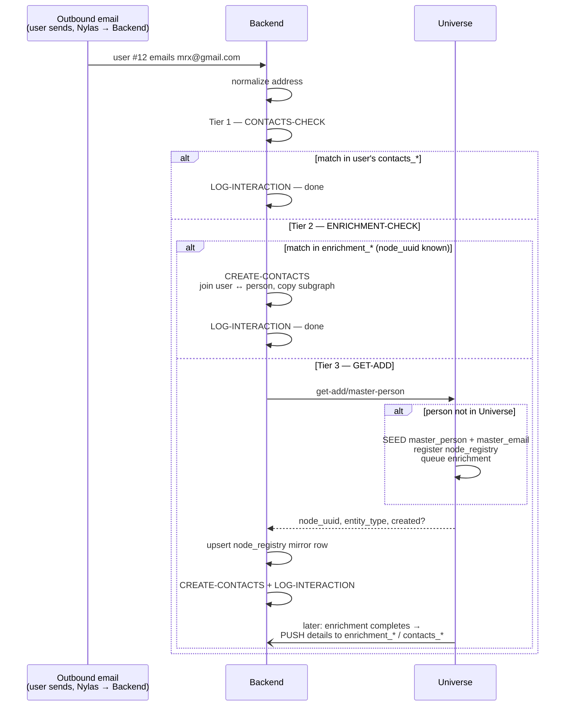

## Purpose

Working page for new concepts on how Orbiter Universe and the App backend stay in sync. Nothing here is committed design yet — this is where ideas get workshopped before graduating to a real spec.

## Architecture principles

- **Universe and Backend are separate environments on separate servers.** Universe is the standalone source-of-truth master graph. Backend is the per-user application server.
- **`master_*` tables live ONLY in Universe** — `master_person`, `master_email`, `master_link`, `master_phone`, `master_address`, etc. Backend never holds a `master_*` table.
- **Backend holds entity tables** — one table per node type, named without the prefix: `master_company` in Universe becomes `company` in Backend, `master_person` becomes `person`, etc.
- **`node_registry`** is the spine connecting the two environments. It lives in Universe and is mirrored to Backend. One unique-indexed row for every node that exists, carrying:
  - `node_uuid` — the global identity
  - `entity_type` — the EXACT name of the Backend table where the node's data lives (`company`, `person`, `film_tv`, …)

  It is the routing key: given any `node_uuid`, either environment knows exactly which table to look in.

## Two tiers of detail tables in Backend

Backend has **two parallel sets** of detail tables for links, emails, phones, and addresses:

| Tier | Tables | Sharing rule |
|---|---|---|
| Enrichment | `enrichment_email`, `enrichment_phone`, `enrichment_link`, `enrichment_address` | Freely shareable — non-user data |
| Contacts | `contacts_email`, `contacts_phone`, `contacts_link`, `contacts_address` | User-scoped — private to the user's contact graph |

The invariant for emails and phones: **the only values in `enrichment_*` tables are ones that came FROM enrichment, or were used to GET an enrichment result** (which means the provider echoed them back, so they exist in enrichment data independently).

### The promotion rule (worked example)

A user emails `mrx@gmail.com` (a new address for them):

1. The address goes to Universe with user provenance.
2. If the address is used for a PDL lookup and **PDL returns a result**, the address is now independently confirmed by enrichment: we null the user provenance on the master row and set `source = <enrichment name>`.
3. The address is now enrichment-tier and freely shareable.
4. If it never resolves via any enrichment, it stays user-provenance only — private.

### The push contract

**At the end of every enrichment process or update for a person, Universe pushes that person's details down to Backend.** The push routes each value by its provenance:

- Enrichment-resolved values (user provenance nulled) → written/updated in `enrichment_*`
- Values that never resolved via enrichment (user provenance intact) → written **only** into `contacts_*` for the observing user

The push gives Backend its completeness invariant: *if a detail lives in Universe, it also lives in Backend* — which is what allows the three-tier lookup to resolve locally without asking Universe.

<Note>
**Resolved (see Decisions):** Backend writes the `contacts_*` row itself at CREATE-CONTACTS; the push upserts/reconciles both tiers rather than being `contacts_*`'s sole writer.
</Note>

## The canonical flow: user emails a person

Named operations: **CONTACTS-CHECK**, **ENRICHMENT-CHECK**, **GET-ADD** (Universe `get-add/master-person` API), **CREATE-CONTACTS**, **LOG-INTERACTION**.

<Info>
**Contact creation is outbound-only** *(decided 2026-07-14)*. The flow below triggers when the USER emails a person — never on inbound email. An inbound sender who isn't already a contact creates nothing: no contact, no Universe seed. This makes contact creation an act of user intent, keeps spam/newsletter/no-reply senders from ever seeding stubs in Universe, and means re-adding a previously deleted contact only happens because the user deliberately emailed that person again.
</Info>

### Ingestion entry points

The same canonical flow runs from two entry points:

1. **Nylas webhook — new message** (live). Each new message hits the flow as it arrives.
2. **Historical log & parse** (onboarding). When a user first connects their email account(s), Backend walks the entire history and runs the same seed / CREATE-CONTACTS / LOG-INTERACTION processing over it.

Because both paths funnel through one shared pipeline, any per-address rule (normalization, the role-address gate below) is implemented once, ahead of the tier lookup, and covers both automatically.

Resolution is a **three-tier lookup** — cheapest first, Universe only as the last resort:

| Tier | Lookup | Hit means | Action |
|---|---|---|---|
| 1 | `contacts_email` / `contacts_phone` (this user) | User already has the contact, person in graph | LOG-INTERACTION — done |
| 2 | `enrichment_email` / `enrichment_phone` (shared) | Person IS in the graph (`node_uuid` known), but not yet this user's contact | CREATE-CONTACTS + LOG-INTERACTION — done |
| 3 | Universe GET-ADD | Unknown to Backend entirely | Resolve-or-seed on Universe, then CREATE-CONTACTS + LOG-INTERACTION |

Identity **resolution** still happens only on Universe — tiers 1 and 2 aren't Backend "resolving," they're Backend reading back the results of resolutions Universe already performed and pushed down.

### GET-ADD contract

**GET-ADD takes an array of emails, links, and phone numbers** *(decided 2026-07-14)* — it is a multi-detail resolver, not a single-email lookup:

```json
{
  "emails":  ["evanson@orbiter.io"],
  "links":   ["https://linkedin.com/in/evanson"],
  "phones":  ["+14155550123"]
}
```

One call covers every ingestion shape: the outbound-email flow passes one email; a LinkedIn import passes a link; a vCard import passes everything it has. Links are therefore first-class resolution keys — this resolves the earlier "links are data-only" question.

Get-add semantics (to confirm): match on **any** provided detail → return the existing person, and **attach** the other provided details that person didn't have yet (with user provenance); no match on anything → seed a new person carrying **all** provided details.

Sub-questions:

- **Cross-detail conflicts — return the strongest match** *(decided 2026-07-14)*. When the details in one call match different people, GET-ADD returns the strongest match, ranked **profile link > email > phone**. Details are never silently moved between people (moving a detail IS a merge, and merges only happen via the queue); instead the conflicting pair is logged as a **system merge proposal** (source: `get-add-conflict`), feeding the same queue as enrichment proposals and user votes. Open sub-detail: whether phone-involved conflicts generate proposals at all — lean: link↔email conflicts do, phone↔anything doesn't (shared phones — assistants, front desks — make phone conflicts weak evidence for "same human").

<Accordion title="Worked example — vCard conflict converging with a user merge">

1. Mark emails `evan@orbiter.io` → GET-ADD miss → seeds **stub person A**.
2. Universe separately holds **person B** ("Evan Sonstroem"), fully enriched via another user's LinkedIn import — `canonical_linkedin_url` + a PDL-sourced personal email. Nothing links A and B.
3. Mark imports his Apple vCard for Evan: `GET-ADD {emails: ["evan@orbiter.io"], links: ["linkedin.com/in/evansonstroem"]}`.
4. Email matches A, profile link matches B → conflict. GET-ADD returns **B** (link outranks email), does NOT move `evan@orbiter.io` onto B, and logs a system merge proposal (A → B).
5. Mark now sees two Evans (his old email contact on A, his vCard contact on B), merges them in the modal — and his user vote lands on the same (A → B) pair the system proposal already opened. The evidence layers converge.

Counter-example for why conflicts propose rather than auto-merge: a vCard with an exec's email but the assistant's phone matches two genuinely different people — fusing them automatically would corrupt both.

</Accordion>
- ~~Identity-grade vs. generic links.~~ **Resolved — already modeled**: `master_link` has a `profile` boolean, set `true` for accepted resolution URLs (LinkedIn, X, Instagram, Crunchbase, etc.). GET-ADD matches links only where `profile = true`; generic URLs are attach-only data.
- **Bulk variant.** The historical log & parse resolves an entire sent-history — the contract wants a bulk form (array of detail-sets, one per person) so onboarding isn't one round-trip per address.



**CREATE-CONTACTS** does four things:

1. Creates the join record linking user ↔ person (`user_id`, `node_uuid`)
2. Logs the activity
3. **Copies the person/company's nodes and edges into the user's graph**
4. **CREATE-HISTORICAL-MEM0** — processes the user's historical email & calendar involving this person into mem0 "memories" via the mem0 API. Memories key on the **contacts record ID** (decided 2026-07-14) — not on `node_uuid`. On a user merge, the survivor's memory set is **wiped and re-processed** from the archive (decided 2026-07-14) — mem0 is a derived store, always rebuildable from email/calendar source data, so no memory-set merging or provenance tagging is needed, and un-merge is handled the same way (wipe + re-process each restored contact). Because the contact ID survives a later Universe merge, Universe merges never touch mem0 for users who already merged.

It must be **idempotent** (get-or-create on `(user_id, node_uuid)`) — the tier checks race the Universe push, so a duplicate attempt is always possible. That includes CREATE-HISTORICAL-MEM0: a duplicate CREATE-CONTACTS attempt must not re-process the archive into duplicate memories.

CREATE-HISTORICAL-MEM0 is the one step that should run **async**: scanning a user's email/calendar history for a new contact is unbounded work (a years-long correspondent surfacing as a new contact could mean thousands of messages), and nothing downstream in the outbound-email flow depends on it. Note it needs only Backend-local data (the user's own archive) — it never waits on the Universe push, so it can start immediately even for a tier-3 brand-new person.

### The two invariants this flow depends on

1. **Presence in `contacts_*` ⇒ contact exists and person is in the graph.** Holds as long as contact records are only ever created via CREATE-CONTACTS after a tier-2 or tier-3 resolution, and never orphaned. Every ingestion path (outbound email, vCard import, Nylas contacts import, CSV upload) must go through the same gate.
2. **If a detail lives in Universe, it also lives in Backend.** Universe pushes all details down at the end of every enrichment process/update (see push contract below). This is what makes tier-2 sufficient — a Backend miss on both tiers genuinely means "unknown or mid-enrichment," and both of those correctly fall through to GET-ADD.

Invariant 2 has a **deliberate staleness window**: between GET-ADD seeding a person and the enrichment-completion push, the value exists in Universe but not yet in Backend tables. This is safe — a second lookup during the window falls through to GET-ADD, which idempotently returns the existing `node_uuid`. The cost of staleness is a redundant round-trip, never a duplicate person.

## Decisions

<Card icon="circle-check">

**Interactions live ONLY in Backend** *(decided 2026-07-14)*

The interactions table exists solely in Backend. Universe never receives interaction data — not raw events, not aggregates. Consequences:

- No upstream sync mechanism is needed for the LOG-INTERACTION path; the CONTACTS-CHECK short-circuit legitimately never touches Universe.
- Known-model scoring (evidence floor, peak watermarks, hysteresis) must run **Backend-side** — its evidence inputs never reach Universe.
- Any query needing interaction recency ("people you've talked to lately") is a Backend query, never a Universe graph query.
- The clean statement of the boundary: **Universe holds shared knowledge about the world; Backend holds everything about how a user relates to it.**

</Card>

<Card icon="circle-check">

**Backend writes `contacts_*` at CREATE-CONTACTS; the push is a reconciling upsert, not the sole writer** *(decided 2026-07-14)*

Every user-observed value arrives through Backend, so Backend writes the `contacts_*` row locally the moment it creates the contact. The Universe push still delivers both tiers, but upserts what Backend already wrote rather than being `contacts_*`'s only source. Consequences:

- Closes the **first-pass promotion gap** — a value enrichment resolves on its initial pass (user provenance nulled before the first push) still lands in the observing user's `contacts_*`.
- Closes the **multi-observer gap** — when two users observe the same unresolved value, each user's own Backend flow writes their own `contacts_*` row; the single `user_id` on the master row stops mattering for contacts completeness.
- Makes the **destructive provenance null safe** — the durable record of "user #12 knows this address" lives in Backend, where user data belongs. Universe keeps the value only for identity resolution, enrichment, and the shareability `source` flag.
- Repeat correspondents hit **tier 1 from their second email onward**, instead of waiting out enrichment latency at tier 2/3.

</Card>

<Card icon="circle-check">

**Two-layer merge model: user merges are Backend-only and non-destructive; Universe merges require human review or multi-user consensus** *(decided 2026-07-14)*

Duplicate people are an expected outcome, not a failure: a new email that doesn't resolve correctly creates a new person/node (identity resolution happens before `node_uuid` creation, so the dupe is a *person-level* dupe, never two nodes for one email).

**Worked example:** Mark gets email from `evanson@orbiter.io` → doesn't resolve → seeds stub `master_person` #1. Later, Mark's LinkedIn import fully enriches the real Evanson as `master_person` #2. Mark now has two Evansons in his graph.

- **User layer:** Mark merges in the merge modal. This is **non-destructive and user-scoped** — it merges only his user graph and repoints the `node_uuid` joins on his `contacts_*` rows to the winner. Universe is untouched; the stub node keeps existing.
- **Evidence layer:** every user merge is **logged**. Universe-level merges happen only via (a) human review, or (b) a consensus rule — if **3+ users merge the same contact details**, that counts as verification and the system accepts the merge into Universe. Users never control Universe merges directly, because users merge incorrectly.
- **Enrichment layer (already live):** enrichment itself proposes Universe merges — e.g. a later enrichment pass on a stub's email resolves to an existing person's identity. This mechanism already exists in the system today.

Why this works: stubs are **global** — every user who emails `evanson@orbiter.io` gets the same stub `node_uuid` back from GET-ADD, so merge votes from different users are directly comparable pairs (`stub → winner`).

Bonus property: a user merge is **reversible** (repoint back) for as long as the stub still exists in Universe — i.e., until an accepted Universe merge retires it.

**Registry semantics on Universe merge** *(decided 2026-07-14)*: `node_registry` only ever tracks nodes that exist — no tombstones, no `merged_into` column. An accepted Universe merge **deletes the losing node and deletes its `node_registry` row** (both sides, since the registry is mirrored). The durable loser → winner mapping therefore lives in the **merge log**, not the registry — the registry answers "what exists," the merge log answers "where did it go."

</Card>

## Recommendations

1. **GET-ADD must be atomic and idempotent.** A check-then-seed pair inside the endpoint has a race window: two emails from the same unknown sender (same user retrying, or two different users) double-seed. Upsert on the normalized address with a unique index on `master_email`, returning the winner's `node_uuid` on conflict. Same philosophy as the existing queue tables: upsert-only, never duplicate — and early-return paths must still record the observation.

2. ~~Backend should write `contacts_*` itself at CREATE-CONTACTS.~~ **Adopted — see Decisions.**

3. **After promotion, a value stays in `contacts_*` for users who observed it.** The two tiers answer different questions — `contacts_*`: *is this user entitled to see it?*; `enrichment_*`: *may we share it freely?* Promotion adds the second, it doesn't revoke the first. This also protects the CONTACTS-CHECK invariant: if promotion removed the row from `contacts_email`, the next email from that sender would miss the contacts check and re-enter the GET-ADD path for a contact the user already has.

4. **Write-through the registry mirror, reconcile async.** The GET-ADD response carries everything Backend needs for its `node_registry` row. Backend upserts it inline; a periodic reconciliation sync catches drift. Never make CREATE-CONTACTS wait on replication.

5. **Treat `entity_type` as a stable logical key.** It equals the Backend table name today, which is convenient — but that makes table renames a breaking cross-environment change. Fine as a convention; just never rename an entity table without a migration plan for the registry.

6. ~~LOG-INTERACTION should feed both environments.~~ **Superseded — see Decisions.** Interactions are Backend-only; nothing ships upstream. The short-circuit path being invisible to Universe is the privacy boundary working as intended, not a gap.

## Open questions / scoping

- **Universe-merge execution mechanics.** Registry semantics are decided (delete the loser's node + registry row — see Decisions). Remaining scope: the merge **push** must carry the (loser → winner) mapping so Backend repoints contact joins, user-graph copies, and mem0 keys; users who already merged locally must be a no-op; users who merged toward a *different* winner than the one Universe picked need a defined reconciliation (map loser → canonical winner, drop duplicate joins). And because the registry carries no redirect, **merge-push delivery must be reliable** — a Backend that misses the event holds dangling `node_uuid`s with no registry entry. Recovery path: on any registry miss, consult the merge log.
- **User-merge local mechanics.** What the merge modal touches: `contacts_*` joins repoint to winner (decided); mem0 wiped + re-processed against the survivor (decided — see CREATE-HISTORICAL-MEM0). Remaining: the contact join record itself (merge if a winner-join already exists) and the user-graph stub subgraph (absorb/delete).
- **Merge-evidence log schema.** The 3-user consensus rule needs a well-defined vote key. Counting distinct users per (`loser_node_uuid` → `winner_node_uuid`) pair is directly comparable since stubs are global. Define conflict handling: votes for (1→2) and (1→3) shouldn't sum — split votes go to human review.
- **Natural key for email.** Lowercase + trim, yes — but plus-addressing (`mark+x@gmail.com`), dots in gmail local parts, IDN domains? Decide the normalization once; it becomes the unique index and can't cheaply change.
- **Tier-3 CREATE-CONTACTS with nothing to copy.** On the GET-ADD path for a brand-new person, the subgraph copy has no source material — the person's nodes/edges don't exist in Backend until the enrichment push lands. Define the pending state: does CREATE-CONTACTS create a minimal contact from the GET-ADD response and let the push complete it, or does the push trigger the subgraph copy for contacts created during the window?
- **Enrichment-update fan-out to user graphs.** CREATE-CONTACTS copies a person's nodes/edges into the user's graph. When a later enrichment update pushes new/changed data for that person, every user graph containing a copy needs refreshing. Does the push handle fan-out itself (Universe would need to know nothing about users — so probably not), or does Backend propagate internally: push updates canonical entity/edge data → Backend fans out to all user graphs holding that `node_uuid`?
- **Is the user-graph copy a duplicate or a reference?** Copying nodes/edges per user is simple and isolation-friendly but multiplies storage and makes fan-out mandatory; referencing canonical rows with per-user overlay keeps one copy but complicates reads. (The existing leverage-loop/discover clones repoint via `node_uuid` per datasource — same shape of problem.)
- **Where does Known-model state live?** Interactions (its evidence) are Backend-only, so scoring runs Backend-side — but if any Known output (relationship-strength edges, tiers) was envisioned as living in the Universe graph, that part needs a rethink: Universe can't compute it and Backend would have to push derived scores up, which re-crosses the user-data boundary.
- **Does GET-ADD block on the outbound-email path, or queue?** Synchronous gives immediate contact creation; queued tolerates Universe downtime. If synchronous: what does Backend do when Universe is unreachable — buffer the event and replay?
- **Shared/ambiguous addresses.** `info@`, `team@`, shared inboxes — seed a person anyway? A rule to classify role-addresses and seed something other than a person (or nothing) may be needed before this pollutes the graph.
- **Relationship to the existing projection sync.** The current Universe → Xano sync projects `master_email` (155), `master_phone` (151), `master_link` (166), `master_address` (164) as single mirrors with upsert on `(master_person_id, natural_key)`. The two-tier `enrichment_*` / `contacts_*` split changes that contract — is it a migration of those tables or a new parallel set?
- **What do inbound emails do?** Contact creation is outbound-only (decided). Presumably an inbound email from an existing tier-1 contact still LOG-INTERACTIONs (a reply from a contact is relationship evidence), and inbound from an unknown sender is ignored entirely — confirm both halves.
- **Phones and addresses in the flow.** This page's canonical flow is email. Phone (from calendar/CRM/signatures) presumably follows the same CHECK → SEED → CREATE-CONTACTS → LOG shape — confirm nothing about phone provenance breaks the promotion rule.
- **Ongoing mem0 writes after the historical backfill.** CREATE-HISTORICAL-MEM0 covers the archive at contact-creation time. Do subsequent interactions also generate memories — i.e., is a mem0 write part of LOG-INTERACTION (including on the tier-1 short-circuit path), or does mem0 only get the historical pass? If ongoing, define the cutover so the backfill and live writes don't overlap or gap around the contact-creation moment.
- **mem0 is an external service holding user email/calendar-derived content.** Same boundary question as interactions: this is user data living outside Backend. Worth stating explicitly which fields/summaries cross into mem0 and confirming that's acceptable, since the Universe/Backend boundary was drawn specifically to keep user data in Backend.

### Concerns from full-design review (2026-07-14, untriaged)

- ~~Contact deletion resurrects itself.~~ **Resolved by outbound-only contact creation** — re-adding only happens because the user deliberately emailed the person again, which is fresh intent. Residual (both LATER): an optional "suppressed, never re-add" flag for people a user must email but never wants as a contact; and a conscious OK that one outbound email to a deleted contact rebuilds the full mem0 history the user may have thought was gone.
- ~~Spam and bulk senders pollute the graph.~~ **Mostly resolved by outbound-only** — inbound senders never seed anything. Residual: users do occasionally email role/no-reply addresses (`support@`, invoice bots), which folds into the existing role-address question on the GET-ADD contract.
- **Onboarding load.** Reduced by outbound-only — the backfill scans **sent mail**, a much smaller set than inbound. A bulk GET-ADD for the sent-mail backfill is still likely worth having; live outbound email uses the single-item form.
- **Push vs. merge event ordering.** An enrichment push for a node can be in flight while that node gets merged away. Backend applying events out of order writes data for a deleted `node_uuid`. Pushes and merge events need a shared ordering guarantee (sequence number or version per node) or Backend-side "registry miss → check merge log" handling on every push apply.
- ~~LinkedIn URLs cut against "links are data-only."~~ **Resolved — GET-ADD takes an array of emails, links, and phones; links are first-class resolution keys.** See the GET-ADD contract section (residual sub-questions there: cross-detail conflicts, identity-grade vs. generic links, bulk variant).
- **Companies from email domains.** The flow seeds a person per unknown email — does GET-ADD also resolve/seed the domain's company and link the person to it, or is the company left to enrichment? Affects whether a brand-new contact shows an employer before enrichment lands.
- **User deletion / right-to-erasure.** Backend user data deletes cleanly by design — but Universe holds user-contributed values with `user_id` intact until promotion. Erasing a user requires a Universe-side purge of their unpromoted seeds (and decides what happens to stub people only they ever observed).
- **Cross-environment plumbing.** Service-to-service auth for GET-ADD and the push receiver; Universe-side retry/queue when Backend is unreachable mid-push; and a scheduled drift reconciliation (counts/checksums per table) beyond the registry write-through.

## Later (parked, not blocking)

- **Role-address gate details.** Which local-parts get gated (`no-reply`, `support`, `billing`, …), what a gated address does (skip vs. log-only vs. attach to company), and the false-positive tuning (`hello@` personal brands) — parked. For the initial build the flow treats every outbound recipient the same; when we take this up, the gate slots into the shared pipeline step ahead of the tier lookup.
- **Dormant-stub hygiene.** Stubs nobody merges and enrichment never resolves will accumulate in Universe as thin person nodes with one unresolved email. Agreed this needs a policy (e.g. age + no enrichment result + no contact activity → archive), but it is explicitly deferred — LATER, not part of the initial build.

## Related work

- [Orbiter Universe Standalone](/guides/open-work/orbiter-univers-standalone) — the standalone Universe effort this sync work supports
- [Tables: Universe vs Orbiter Backend](/guides/open-work/orbiter-univers-standalone/tables-universe-vs-orbiter-backend) — table-level comparison between the two sides
