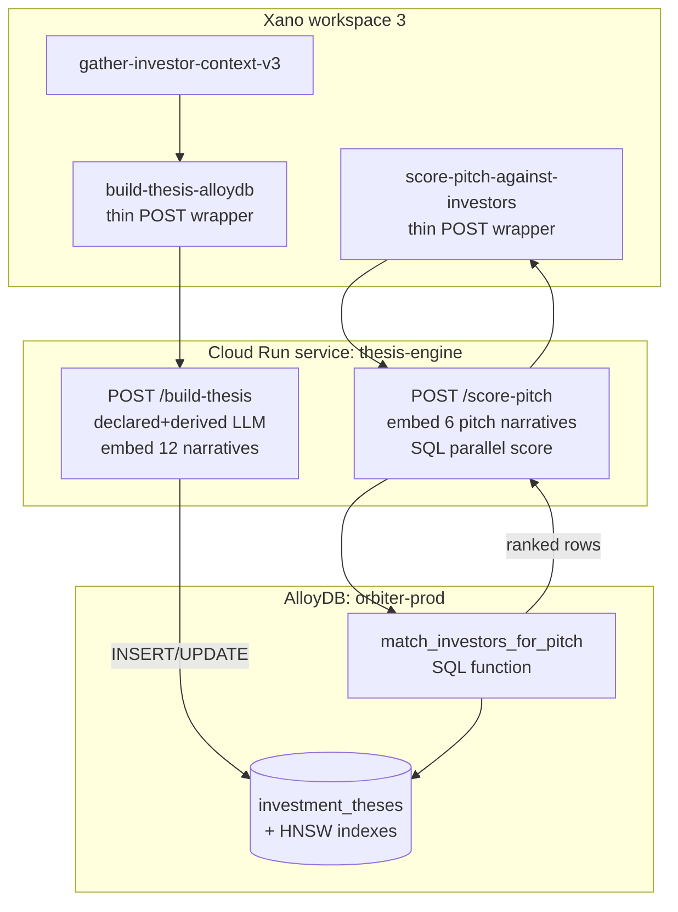

This page is the **engineering build plan** for migrating the investment-thesis pipeline from Xano-only to GCP AlloyDB with a Cloud Run compute layer. It is self-contained for engineers focused on the AlloyDB work; conceptual schema lives in [Investment thesis schema](/guides/open-work/suggestion-core-concepts/find-investors/thesis-schema), and the current Xano-only path is documented in [Xano production pipeline](/guides/open-work/suggestion-core-concepts/find-investors/xano-pipeline).

The Xano-only pipeline is the v1 dev/prototype path. Production matching runs on **GCP AlloyDB** with native pgvector, parallel SQL scoring, and an external compute layer (Cloud Run) for LLM orchestration. This section documents the migration design and the scoring engine that Xano calls into.

### Why move to AlloyDB

| Concern | Xano today | AlloyDB target |
|---|---|---|
| Vector storage | `json` column (1536 floats) | `vector(1536)` with HNSW indexes |
| Similarity search | None (would need full-table scan in JS lambda) | Native `<=>` operator + HNSW; subsecond at 1M+ rows |
| LLM call duration | ~30-90s in `api.request`, near Xano timeout for big funds | Cloud Run service with no platform timeout; declared + derived run in parallel |
| Model flexibility | Hardcoded in XanoScript | Env var in Cloud Run; swap DeepSeek↔Claude↔Gemini without function rewrite |
| Scoring throughput | Not feasible per-query | One SQL with 6 vector compares; CTE prefilter scales to millions |
| Source of truth | Single `investment_theses` row in Xano | AlloyDB is canonical; Xano keeps `master_*` + `fundable_*` |

### Architecture overview



Xano stays the gather layer (it owns `master_*` and `fundable_*`). Cloud Run owns LLM + embedding orchestration. AlloyDB owns persistence and scoring.

### Step 1: Clone the table in AlloyDB

Create the schema with proper `vector` columns and HNSW indexes. Run once on a fresh AlloyDB cluster.

```sql
-- Required extensions (AlloyDB has pgvector preinstalled)
CREATE EXTENSION IF NOT EXISTS vector;
CREATE EXTENSION IF NOT EXISTS pgcrypto;  -- for gen_random_uuid()

-- Main table — schema parity with Xano table 709
CREATE TABLE investment_theses (
  id                                    UUID PRIMARY KEY DEFAULT gen_random_uuid(),
  xano_id                               INTEGER UNIQUE,  -- backref during dual-write phase
  created_at                            TIMESTAMPTZ NOT NULL DEFAULT NOW(),
  updated_at                            TIMESTAMPTZ NOT NULL DEFAULT NOW(),
  node_uuid                             TEXT,

  -- Identity (one MUST be non-null; enforced via CHECK below)
  master_person_id                      INTEGER,
  master_company_id                     INTEGER,

  -- Layer 1: structured filter
  firm_name                             TEXT,
  investor_type                         TEXT CHECK (investor_type IN
    ('vc_fund','angel','family_office','corporate_vc','syndicate','other')),
  industries                            JSONB,
  stage_focus                           JSONB,
  geography                             JSONB,
  check_size_min                        NUMERIC,
  check_size_max                        NUMERIC,
  check_size_sweet_spot                 NUMERIC,
  total_deals_count                     INTEGER,
  lead_deals_count                      INTEGER,
  lead_ratio                            NUMERIC,
  frequent_co_investors                 JSONB,
  partner_deal_attribution              JSONB,
  sector_evolution_timeline             JSONB,
  recent_36mo_focus                     JSONB,
  deal_size_stats                       JSONB,
  geographic_distribution               JSONB,
  last_lead_date                        DATE,
  last_investment_date                  DATE,

  -- Layer 2: declared (6 narrative + 6 vector)
  founder_fit_declared_narrative        TEXT,
  founder_fit_declared_vector           VECTOR(1536),
  problem_market_declared_narrative     TEXT,
  problem_market_declared_vector        VECTOR(1536),
  competitive_moat_declared_narrative   TEXT,
  competitive_moat_declared_vector      VECTOR(1536),
  traction_momentum_declared_narrative  TEXT,
  traction_momentum_declared_vector     VECTOR(1536),
  business_model_declared_narrative     TEXT,
  business_model_declared_vector        VECTOR(1536),
  expansion_roadmap_declared_narrative  TEXT,
  expansion_roadmap_declared_vector     VECTOR(1536),

  -- Layer 2: derived (6 narrative + 6 vector)
  founder_fit_derived_narrative         TEXT,
  founder_fit_derived_vector            VECTOR(1536),
  problem_market_derived_narrative      TEXT,
  problem_market_derived_vector         VECTOR(1536),
  competitive_moat_derived_narrative    TEXT,
  competitive_moat_derived_vector       VECTOR(1536),
  traction_momentum_derived_narrative   TEXT,
  traction_momentum_derived_vector      VECTOR(1536),
  business_model_derived_narrative      TEXT,
  business_model_derived_vector         VECTOR(1536),
  expansion_roadmap_derived_narrative   TEXT,
  expansion_roadmap_derived_vector      VECTOR(1536),

  -- Layer 3: synthesis
  declared_thesis_summary               TEXT,
  derived_thesis_summary                TEXT,
  declared_vs_derived_delta             JSONB,
  implicit_lenses                       JSONB,
  thesis_drift_signals                  JSONB,
  partner_specialization                JSONB,
  syndicate_tier                        TEXT CHECK (syndicate_tier IN ('tier_1','tier_2','emerging')),
  data_sources                          JSONB,
  last_validated_date                   DATE,

  CONSTRAINT one_identity CHECK (
    (master_person_id IS NOT NULL AND master_company_id IS NULL) OR
    (master_company_id IS NOT NULL AND master_person_id IS NULL)
  )
);

-- Lookup indexes
CREATE INDEX investment_theses_company_idx
  ON investment_theses (master_company_id) WHERE master_company_id IS NOT NULL;
CREATE INDEX investment_theses_person_idx
  ON investment_theses (master_person_id)  WHERE master_person_id  IS NOT NULL;
CREATE UNIQUE INDEX investment_theses_xano_id_uidx
  ON investment_theses (xano_id) WHERE xano_id IS NOT NULL;

-- HNSW indexes — one per vector column we plan to query.
-- Scoring uses derived vectors as the ground-truth (declared = stated, derived = revealed).
-- Index only the 6 derived vectors initially; add declared indexes later if scoring needs them.
CREATE INDEX founder_fit_derived_hnsw       ON investment_theses USING hnsw
  (founder_fit_derived_vector       vector_cosine_ops) WITH (m = 16, ef_construction = 64);
CREATE INDEX problem_market_derived_hnsw    ON investment_theses USING hnsw
  (problem_market_derived_vector    vector_cosine_ops) WITH (m = 16, ef_construction = 64);
CREATE INDEX competitive_moat_derived_hnsw  ON investment_theses USING hnsw
  (competitive_moat_derived_vector  vector_cosine_ops) WITH (m = 16, ef_construction = 64);
CREATE INDEX traction_momentum_derived_hnsw ON investment_theses USING hnsw
  (traction_momentum_derived_vector vector_cosine_ops) WITH (m = 16, ef_construction = 64);
CREATE INDEX business_model_derived_hnsw    ON investment_theses USING hnsw
  (business_model_derived_vector    vector_cosine_ops) WITH (m = 16, ef_construction = 64);
CREATE INDEX expansion_roadmap_derived_hnsw ON investment_theses USING hnsw
  (expansion_roadmap_derived_vector vector_cosine_ops) WITH (m = 16, ef_construction = 64);

-- Updated-at trigger
CREATE OR REPLACE FUNCTION touch_updated_at() RETURNS TRIGGER AS $$
BEGIN NEW.updated_at = NOW(); RETURN NEW; END; $$ LANGUAGE plpgsql;

CREATE TRIGGER investment_theses_touch
  BEFORE UPDATE ON investment_theses
  FOR EACH ROW EXECUTE FUNCTION touch_updated_at();
```

**One-shot bulk export from Xano (during cutover):**

```sql
-- Run from a Cloud Run job that pages Xano's getTableContent and INSERTs in batches of 100.
-- The xano_id column lets dual-write phase reconcile by lookup.
INSERT INTO investment_theses (
  xano_id, master_person_id, master_company_id, firm_name, ...
  founder_fit_derived_vector, ...  -- vectors arrive as text "[0.1, 0.2, ...]" cast to vector
)
VALUES ($1, $2, $3, $4, ..., $N::vector(1536), ...)
ON CONFLICT (xano_id) DO UPDATE SET
  firm_name = EXCLUDED.firm_name,
  -- ... all updatable columns
  updated_at = NOW();
```

### Step 2: Refactor build pipeline (Xano → Cloud Run → AlloyDB)

The Xano orchestrator becomes a **thin wrapper** that gathers context and POSTs to Cloud Run. All LLM and DB writes happen downstream.

#### Xano: `thesis/build-investment-thesis-alloydb`

```xanoscript
function "thesis/build-investment-thesis-alloydb" {
  input {
    int master_person_id?
    int master_company_id?
  }

  stack {
    precondition ($input.master_person_id != null || $input.master_company_id != null) {
      error_type = "inputerror"
      error = "Either master_person_id or master_company_id must be provided"
    }

    // Same gather as today — Xano still owns master_* + fundable_*
    function.run "thesis/gather-investor-context-v3" {
      input = {
        master_person_id : $input.master_person_id
        master_company_id: $input.master_company_id
        max_deals        : 100
        recency_months   : 36
      }
    } as $context

    // Hand off to Cloud Run; Cloud Run does LLM + embedding + AlloyDB write
    api.request {
      url = "https://thesis-engine-XXXX-uc.a.run.app/build-thesis"
      method = "POST"
      params = {}
        |set:"master_person_id":$input.master_person_id
        |set:"master_company_id":$input.master_company_id
        |set:"context":$context
      headers = []
        |push:"Content-Type: application/json"
        |push:("Authorization: Bearer KEY"|replace:"KEY":$env.cloudRunThesisToken)
      timeout = 300
    } as $cr_response

    var $result {
      value = $cr_response|get:"response":null
    }
  }

  response = $result
}
```

#### Cloud Run: `POST /build-thesis`

A small Node or Python service (Node shown). Lives in a private VPC peered with AlloyDB.

```javascript
// thesis-engine / src/build-thesis.js
import OpenAI from 'openai';
import { Pool } from 'pg';

const pool = new Pool({
  host: process.env.ALLOYDB_HOST,
  database: 'orbiter',
  user: 'thesis_engine',
  password: process.env.ALLOYDB_PASSWORD,
  ssl: { rejectUnauthorized: true, ca: process.env.ALLOYDB_CA_CERT }
});

const openrouter = new OpenAI({
  baseURL: 'https://openrouter.ai/api/v1',
  apiKey: process.env.OPENROUTER_API_KEY
});

const DECLARED_PROMPT = `...`; // same as v21 declared_system_prompt
const DERIVED_PROMPT  = `...`; // same as v21 derived_system_prompt

export async function buildThesis(req, res) {
  const { master_person_id, master_company_id, context } = req.body;

  // Run declared + derived LLM calls in parallel (Xano can't do this cleanly)
  const [declared, derived] = await Promise.all([
    callLLM(DECLARED_PROMPT, declaredUserText(context)),
    callLLM(DERIVED_PROMPT,  derivedUserText(context))
  ]);

  if (declared._error || derived._error) {
    return res.status(200).json({
      success: false,
      declared_error: declared._error,
      derived_error: derived._error
    });
  }

  // Embed all 12 narratives in one OpenRouter call (batch up to 2048 inputs)
  const narratives = [
    declared.founder_fit, declared.problem_market, declared.competitive_moat,
    declared.traction_momentum, declared.business_model, declared.expansion_roadmap,
    derived.founder_fit, derived.problem_market, derived.competitive_moat,
    derived.traction_momentum, derived.business_model, derived.expansion_roadmap
  ];
  const embeddings = await embed(narratives);  // returns 12 × float[1536]

  const dealStats = computeDealStats(context.deals);
  const normalizedGeo = normalizeGeo(derived.geographic_distribution);
  const dataSources = buildDataSources(context.entity_type);

  const sql = `
    INSERT INTO investment_theses (
      master_person_id, master_company_id, firm_name, investor_type,
      industries, stage_focus, geography,
      total_deals_count, lead_deals_count, lead_ratio,
      sector_evolution_timeline, recent_36mo_focus, frequent_co_investors,
      deal_size_stats, geographic_distribution, partner_deal_attribution,
      last_investment_date, last_lead_date,
      founder_fit_declared_narrative, founder_fit_declared_vector,
      problem_market_declared_narrative, problem_market_declared_vector,
      /* ... 22 more narrative+vector pairs ... */
      declared_thesis_summary, derived_thesis_summary,
      declared_vs_derived_delta, implicit_lenses, thesis_drift_signals,
      partner_specialization, syndicate_tier,
      data_sources, last_validated_date
    ) VALUES (
      $1, $2, $3, $4, $5::jsonb, $6::jsonb, $7::jsonb,
      $8, $9, $10, /* ... */
      $N::vector(1536), /* ... 11 more ::vector casts ... */
      /* ... */, CURRENT_DATE
    )
    ON CONFLICT (master_company_id) WHERE master_company_id IS NOT NULL
      DO UPDATE SET firm_name = EXCLUDED.firm_name, /* ... all cols ... */
                    updated_at = NOW()
    RETURNING id, firm_name`;

  const { rows } = await pool.query(sql, [
    master_person_id, master_company_id, declared.firm_name, declared.investor_type,
    JSON.stringify(declared.industries), JSON.stringify(declared.stage_focus),
    JSON.stringify(declared.geography),
    dealStats.total, dealStats.lead, dealStats.ratio,
    /* ... */
    `[${embeddings[0].join(',')}]`,  // pgvector text format
    /* ... 11 more ... */
    /* ... */
  ]);

  return res.json({
    success: true,
    thesis_id: rows[0].id,
    firm_name: rows[0].firm_name,
    declared_summary: declared.declared_summary,
    derived_summary: derived.derived_summary
  });
}

async function callLLM(systemPrompt, userText) {
  try {
    const r = await openrouter.chat.completions.create({
      model: 'deepseek/deepseek-v3.2',
      messages: [
        { role: 'system', content: systemPrompt },
        { role: 'user', content: userText }
      ],
      max_tokens: 8000,
      temperature: 0.3
    });
    const content = r.choices[0].message.content;
    const cleaned = repairJson(sanitizeRoman(stripFences(content)));
    return JSON.parse(cleaned);
  } catch (e) {
    return { _error: e.message };
  }
}

async function embed(texts) {
  const r = await openrouter.embeddings.create({
    model: 'openai/text-embedding-3-small',
    input: texts
  });
  return r.data.map(d => d.embedding);
}
```

**Wins over the Xano-only path:**
- Declared + derived LLM calls run in parallel (saves 30-60s on big funds)
- No 240s api.request ceiling
- `repairJson`, `sanitizeRoman`, `stripFences` are normal JS modules — easier to test, version, swap
- Direct SQL `INSERT ... ON CONFLICT` is one round-trip; Xano's `db.add_or_edit` was two

### Step 3: Pitch profile scoring (the match engine)

When a founder triggers a `find-investors` outcome, their pitch deck is parsed into an `investment_pitch_profile` (mirror schema with the same 6 narrative dimensions). Xano hands that off to Cloud Run, Cloud Run vectorizes it and runs the parallel SQL scorer.

#### Xano: `pitch/score-against-investors`

```xanoscript
function "pitch/score-against-investors" {
  input {
    object pitch_profile      // {founder_fit, problem_market, competitive_moat,
                              //  traction_momentum, business_model, expansion_roadmap}
    int    top_n?             // default 50
    object filters?           // optional Layer 1 prefilters: stage, geography, check_size
  }

  stack {
    api.request {
      url = "https://thesis-engine-XXXX-uc.a.run.app/score-pitch"
      method = "POST"
      params = {}
        |set:"pitch_profile":$input.pitch_profile
        |set:"top_n":($input.top_n|default:50)
        |set:"filters":$input.filters
      headers = []
        |push:"Content-Type: application/json"
        |push:("Authorization: Bearer KEY"|replace:"KEY":$env.cloudRunThesisToken)
      timeout = 30
    } as $cr_response

    var $result { value = $cr_response|get:"response":null }
  }

  response = $result
}
```

#### Cloud Run: `POST /score-pitch`

```javascript
export async function scorePitch(req, res) {
  const { pitch_profile, top_n = 50, filters = {} } = req.body;

  // Embed the 6 pitch narratives in a single batch
  const pitchVectors = await embed([
    pitch_profile.founder_fit,
    pitch_profile.problem_market,
    pitch_profile.competitive_moat,
    pitch_profile.traction_momentum,
    pitch_profile.business_model,
    pitch_profile.expansion_roadmap
  ]);

  // Call the SQL scorer (Strategy B by default — see below)
  const { rows } = await pool.query(
    'SELECT * FROM match_investors_for_pitch($1, $2, $3, $4, $5, $6, $7, $8, $9)',
    [
      `[${pitchVectors[0].join(',')}]`,
      `[${pitchVectors[1].join(',')}]`,
      `[${pitchVectors[2].join(',')}]`,
      `[${pitchVectors[3].join(',')}]`,
      `[${pitchVectors[4].join(',')}]`,
      `[${pitchVectors[5].join(',')}]`,
      top_n,
      filters.stage_focus  ? JSON.stringify(filters.stage_focus)  : null,
      filters.geography    ? JSON.stringify(filters.geography)    : null
    ]
  );

  return res.json({ success: true, matches: rows });
}
```

### Vector comparison: parallel SQL strategies

The match engine runs **6 parallel cosine-distance comparisons** (one per narrative dimension), then composites them with the published weights. There are three strategies in increasing scale-tolerance.

**Distance operator:** `<=>` is pgvector's cosine *distance* (0 = identical, 2 = opposite). Similarity score = `1 - (a <=> b)`.

**Weights** (from §"Vector Search & Multi-Dimensional Ranking" above):

| Dimension | Weight |
|---|---|
| founder_fit | 0.30 |
| problem_market | 0.20 |
| competitive_moat | 0.15 |
| traction_momentum | 0.15 |
| business_model | 0.12 |
| expansion_roadmap | 0.08 |

#### Strategy A — Single-pass exact (use ≤ ~50K rows)

One sequential scan, all 6 cosines computed per row, sort by composite. No HNSW used; planner picks seq scan.

```sql
WITH p AS (
  SELECT
    $1::vector(1536) AS founder_fit,
    $2::vector(1536) AS problem_market,
    $3::vector(1536) AS competitive_moat,
    $4::vector(1536) AS traction_momentum,
    $5::vector(1536) AS business_model,
    $6::vector(1536) AS expansion_roadmap
)
SELECT
  t.id, t.master_company_id, t.master_person_id, t.firm_name, t.investor_type,
  1 - (t.founder_fit_derived_vector       <=> p.founder_fit)       AS founder_fit_score,
  1 - (t.problem_market_derived_vector    <=> p.problem_market)    AS problem_market_score,
  1 - (t.competitive_moat_derived_vector  <=> p.competitive_moat)  AS competitive_moat_score,
  1 - (t.traction_momentum_derived_vector <=> p.traction_momentum) AS traction_momentum_score,
  1 - (t.business_model_derived_vector    <=> p.business_model)    AS business_model_score,
  1 - (t.expansion_roadmap_derived_vector <=> p.expansion_roadmap) AS expansion_roadmap_score,
  ( 0.30*(1-(t.founder_fit_derived_vector       <=> p.founder_fit))
  + 0.20*(1-(t.problem_market_derived_vector    <=> p.problem_market))
  + 0.15*(1-(t.competitive_moat_derived_vector  <=> p.competitive_moat))
  + 0.15*(1-(t.traction_momentum_derived_vector <=> p.traction_momentum))
  + 0.12*(1-(t.business_model_derived_vector    <=> p.business_model))
  + 0.08*(1-(t.expansion_roadmap_derived_vector <=> p.expansion_roadmap))
  ) AS composite_score
FROM investment_theses t, p
WHERE t.founder_fit_derived_vector IS NOT NULL
ORDER BY composite_score DESC
LIMIT $7;
```

#### Strategy B — 6-CTE candidate union, exact rerank (50K-1M rows; recommended default)

Each of 6 CTEs uses its own HNSW index to grab top-K candidates fast (parallel within Postgres). Union them, then exact-score the ~3-6K survivors.

```sql
CREATE OR REPLACE FUNCTION match_investors_for_pitch(
  p_founder_fit       vector(1536),
  p_problem_market    vector(1536),
  p_competitive_moat  vector(1536),
  p_traction_momentum vector(1536),
  p_business_model    vector(1536),
  p_expansion_roadmap vector(1536),
  p_top_n             INTEGER DEFAULT 50,
  p_stage_filter      JSONB   DEFAULT NULL,
  p_geo_filter        JSONB   DEFAULT NULL
) RETURNS TABLE (
  id UUID, node_uuid TEXT,
  master_company_id INTEGER, master_person_id INTEGER,
  firm_name TEXT, investor_type TEXT,
  founder_fit_score NUMERIC, problem_market_score NUMERIC,
  competitive_moat_score NUMERIC, traction_momentum_score NUMERIC,
  business_model_score NUMERIC, expansion_roadmap_score NUMERIC,
  composite_score NUMERIC
) LANGUAGE sql STABLE PARALLEL SAFE AS $$
  WITH
    -- 6 HNSW lookups, each independent — Postgres can parallelize via gather
    ff AS (SELECT id FROM investment_theses
           WHERE founder_fit_derived_vector IS NOT NULL
           ORDER BY founder_fit_derived_vector       <=> p_founder_fit       LIMIT 500),
    pm AS (SELECT id FROM investment_theses
           WHERE problem_market_derived_vector IS NOT NULL
           ORDER BY problem_market_derived_vector    <=> p_problem_market    LIMIT 500),
    cm AS (SELECT id FROM investment_theses
           WHERE competitive_moat_derived_vector IS NOT NULL
           ORDER BY competitive_moat_derived_vector  <=> p_competitive_moat  LIMIT 500),
    tm AS (SELECT id FROM investment_theses
           WHERE traction_momentum_derived_vector IS NOT NULL
           ORDER BY traction_momentum_derived_vector <=> p_traction_momentum LIMIT 500),
    bm AS (SELECT id FROM investment_theses
           WHERE business_model_derived_vector IS NOT NULL
           ORDER BY business_model_derived_vector    <=> p_business_model    LIMIT 500),
    er AS (SELECT id FROM investment_theses
           WHERE expansion_roadmap_derived_vector IS NOT NULL
           ORDER BY expansion_roadmap_derived_vector <=> p_expansion_roadmap LIMIT 500),
    candidates AS (
      SELECT id FROM ff UNION
      SELECT id FROM pm UNION
      SELECT id FROM cm UNION
      SELECT id FROM tm UNION
      SELECT id FROM bm UNION
      SELECT id FROM er
    )
  SELECT
    t.id, t.node_uuid,
    t.master_company_id, t.master_person_id, t.firm_name, t.investor_type,
    1 - (t.founder_fit_derived_vector       <=> p_founder_fit)       AS founder_fit_score,
    1 - (t.problem_market_derived_vector    <=> p_problem_market)    AS problem_market_score,
    1 - (t.competitive_moat_derived_vector  <=> p_competitive_moat)  AS competitive_moat_score,
    1 - (t.traction_momentum_derived_vector <=> p_traction_momentum) AS traction_momentum_score,
    1 - (t.business_model_derived_vector    <=> p_business_model)    AS business_model_score,
    1 - (t.expansion_roadmap_derived_vector <=> p_expansion_roadmap) AS expansion_roadmap_score,
    ( 0.30*(1-(t.founder_fit_derived_vector       <=> p_founder_fit))
    + 0.20*(1-(t.problem_market_derived_vector    <=> p_problem_market))
    + 0.15*(1-(t.competitive_moat_derived_vector  <=> p_competitive_moat))
    + 0.15*(1-(t.traction_momentum_derived_vector <=> p_traction_momentum))
    + 0.12*(1-(t.business_model_derived_vector    <=> p_business_model))
    + 0.08*(1-(t.expansion_roadmap_derived_vector <=> p_expansion_roadmap))
    ) AS composite_score
  FROM investment_theses t
  JOIN candidates c ON c.id = t.id
  WHERE
    (p_stage_filter IS NULL OR t.stage_focus ?| ARRAY(SELECT jsonb_array_elements_text(p_stage_filter)))
    AND (p_geo_filter IS NULL OR t.geographic_distribution ?| ARRAY(SELECT jsonb_array_elements_text(p_geo_filter)))
  ORDER BY composite_score DESC
  LIMIT p_top_n;
$$;
```

**Why this is the right default:** each CTE costs ~5-15ms with HNSW. The 6 of them run in parallel under `PARALLEL SAFE`. The union is bounded (≤3000 rows), so the rerank is cheap. Worst case: an investor strong in 5 dimensions but absent from the 6th HNSW top-500 won't surface; tunable via the `LIMIT 500` per CTE.

##### Example result: Orbiter.io pitch matched against the investor pool

Pitch input is the 6 narrative dimensions extracted from the Orbiter.io Series A deck (relationship-intelligence SaaS — see [thesis schema → Orbiter.io pitch profile](/guides/open-work/suggestion-core-concepts/find-investors/thesis-schema#example-orbiter-io-relationship-intelligence-seed-pitch)). Each narrative is embedded with `text-embedding-3-small`, then passed to `match_investors_for_pitch` as a `vector(1536)`.

The canonical response shape is **JSON** — that's what crosses every wire (AlloyDB → Cloud Run → Xano → founder UI). Each match row carries the AlloyDB primary key (`id`), the **graph node uuid** (`node_uuid` — required for downstream graph lookups, intro-routing, connection paths), and the original Xano FK (`master_person_id` *or* `master_company_id`, exactly one is non-null), alongside the 6 individual cosine similarity scores and their weighted composite. The psql table format shown after the JSON is dev-time only — it's what an engineer sees when running the SQL function manually for debugging.

**Cloud Run's response to Xano** (canonical — 6 parallel cosine scores per row + composite):

```json
{
  "success": true,
  "scoring_strategy": "B-6cte-union",
  "candidates_evaluated": 2847,
  "elapsed_ms": 287,
  "matches": [
    {
      "id": "9f2c3e1a-0b7d-4e5a-8f1c-aa11bb22cc33",
      "node_uuid": "node_inv_e2a78c5b1f9d4a82",
      "master_company_id": 4221,
      "master_person_id": null,
      "firm_name": "Notation Capital",
      "investor_type": "vc_fund",
      "scores": {
        "founder_fit":       0.88,
        "problem_market":    0.84,
        "competitive_moat":  0.79,
        "traction_momentum": 0.71,
        "business_model":    0.82,
        "expansion_roadmap": 0.74
      },
      "composite_score": 0.81,
      "explanation": [
        "Founder fit (0.88): operator-pedigree founders, prior tech exits — matches portfolio pattern",
        "Problem/market (0.84): network-effect SaaS targeting professional connectors — recurring portfolio thesis",
        "Business model (0.82): SaaS land-and-expand at a per-seat price point — common GTM in their portfolio"
      ]
    },
    {
      "id": "fe4a8b12-3c5d-4e6f-9a07-1b2c3d4e5f60",
      "node_uuid": "node_inv_a3f51e9c4b6d2871",
      "master_company_id": 396,
      "master_person_id": null,
      "firm_name": "Cowboy Ventures",
      "investor_type": "vc_fund",
      "scores": {
        "founder_fit": 0.82, "problem_market": 0.78, "competitive_moat": 0.83,
        "traction_momentum": 0.65, "business_model": 0.85, "expansion_roadmap": 0.71
      },
      "composite_score": 0.78,
      "explanation": [
        "Competitive moat (0.83): network-effect/data-network defensibility — strong overlap with Cowboy's recent infra/AI thesis",
        "Business model (0.85): per-seat SaaS with land-and-expand — matches recent vintage (Hone, LaunchNotes, Aviso)"
      ]
    },
    {
      "id": "12abc34d-...",
      "node_uuid": "node_inv_c8b724a9d5e1f036",
      "master_company_id": 1872,
      "master_person_id": null,
      "firm_name": "First Round Capital",
      "investor_type": "vc_fund",
      "scores": {
        "founder_fit": 0.86, "problem_market": 0.74, "competitive_moat": 0.71,
        "traction_momentum": 0.72, "business_model": 0.81, "expansion_roadmap": 0.68
      },
      "composite_score": 0.77,
      "explanation": [
        "Founder fit (0.86): operator-led syndicate signal — strong pattern across portfolio",
        "Business model (0.81): per-seat SaaS at seed stage — fits early-revenue investment cadence"
      ]
    },
    {
      "id": "7e8d9f1a-...",
      "node_uuid": "node_inv_b612f49a3c8e0d57",
      "master_company_id": null,
      "master_person_id": 8412,
      "firm_name": "Maya Patel (Angel)",
      "investor_type": "angel",
      "scores": {
        "founder_fit": 0.79, "problem_market": 0.76, "competitive_moat": 0.75,
        "traction_momentum": 0.68, "business_model": 0.74, "expansion_roadmap": 0.65
      },
      "composite_score": 0.74,
      "explanation": [
        "Problem/market (0.76): pro-network SaaS thesis aligns with prior angel checks",
        "Founder fit (0.79): backs technical+GTM duos with prior exits"
      ]
    },
    {
      "id": "ab1c2d3e-...",
      "node_uuid": "node_inv_f4e3c2b1a0d9876e",
      "master_company_id": 5104,
      "master_person_id": null,
      "firm_name": "Slack Fund",
      "investor_type": "corporate_vc",
      "scores": {
        "founder_fit": 0.71, "problem_market": 0.79, "competitive_moat": 0.73,
        "traction_momentum": 0.62, "business_model": 0.78, "expansion_roadmap": 0.63
      },
      "composite_score": 0.72,
      "explanation": [
        "Problem/market (0.79): collaboration/network-effect plays — core Slack Fund thesis"
      ]
    }
  ]
}
```

Notes on the shape:
- `master_company_id` and `master_person_id` are mutually exclusive (the AlloyDB CHECK constraint enforces it). Always check which is non-null when joining back to Xano `master_*` tables for related signals (cap-table data, recent activity, partner names).
- `node_uuid` is required for **graph lookups** — connection paths from the founder, mutual contacts, recent activity in the relationship graph. The UI's "warm intro" surface joins on `node_uuid` against FalkorDB / AlloyDB graph nodes.
- `scores` is the 6-dim raw cosine similarity (0-1, higher = closer). `composite_score` is the weighted sum (weights from the table above).
- `explanation` is computed by Cloud Run, not the SQL function. It picks the top 2-3 highest-scoring dimensions per investor and formats a one-line reason from the matching narrative excerpt — lets the founder UI render *why* each investor scored where it did, not just *that* it scored.

**The same data, as a `psql` table** (dev-time inspection only; the wire format is always JSON):

```
 firm_name           | type     | ff   | pm   | cm   | tm   | bm   | er   | composite
---------------------+----------+------+------+------+------+------+------+-----------
 Notation Capital    | vc_fund  | 0.88 | 0.84 | 0.79 | 0.71 | 0.82 | 0.74 |     0.81
 Cowboy Ventures     | vc_fund  | 0.82 | 0.78 | 0.83 | 0.65 | 0.85 | 0.71 |     0.78
 First Round Capital | vc_fund  | 0.86 | 0.74 | 0.71 | 0.72 | 0.81 | 0.68 |     0.77
 Maya Patel (Angel)  | angel    | 0.79 | 0.76 | 0.75 | 0.68 | 0.74 | 0.65 |     0.74
 Slack Fund          | corp_vc  | 0.71 | 0.79 | 0.73 | 0.62 | 0.78 | 0.63 |     0.72
(5 rows)

Time: 287.412 ms  (planning: 12.108 ms; execution: 275.304 ms)
```

Composite math verification for the top row (Notation Capital):

```
0.30·(0.88) + 0.20·(0.84) + 0.15·(0.79) + 0.15·(0.71) + 0.12·(0.82) + 0.08·(0.74)
= 0.264   + 0.168   + 0.1185  + 0.1065  + 0.0984  + 0.0592
= 0.8146  → 0.81
```

`EXPLAIN ANALYZE` for the call typically shows:

```
Limit  (cost=... rows=10)
  ->  Sort  (... Sort Method: top-N heapsort  Memory: 28kB)
        ->  Hash Join  (...)
              ->  Append (HashAggregate over 6 CTEs)
                    ->  Index Scan using founder_fit_derived_hnsw  (rows=500)
                    ->  Index Scan using problem_market_derived_hnsw  (rows=500)
                    ->  Index Scan using competitive_moat_derived_hnsw  (rows=500)
                    ->  Index Scan using traction_momentum_derived_hnsw  (rows=500)
                    ->  Index Scan using business_model_derived_hnsw  (rows=500)
                    ->  Index Scan using expansion_roadmap_derived_hnsw  (rows=500)
```

All 6 HNSW index scans run before the union/hash-aggregate; with `PARALLEL SAFE` set on the function and `max_parallel_workers_per_gather >= 4`, AlloyDB fans them out across worker processes — the bulk of the 287ms is the 6 HNSW lookups happening in parallel, not in series. Each of those `Index Scan` rows is one of the 6 vector comparisons; their results are unioned into the candidate pool that gets exact-rescored against all 6 dimensions.

#### Strategy C — Single-dim prefilter (1M+ rows, cost-sensitive)

When even 6 HNSW lookups are too expensive, prefilter on the highest-weight dimension only (`founder_fit`, weight 0.30) and exact-score the rest.

```sql
WITH ff_top AS (
  SELECT id FROM investment_theses
  WHERE founder_fit_derived_vector IS NOT NULL
  ORDER BY founder_fit_derived_vector <=> $1
  LIMIT 1000
)
SELECT
  t.id, t.firm_name,
  /* full 6-dim composite as in Strategy A, applied only to the 1000 candidates */
FROM investment_theses t
JOIN ff_top c ON c.id = t.id
ORDER BY composite_score DESC
LIMIT $7;
```

Less precise (an investor weak on founder_fit but stellar on the other 5 won't make the top 1000), but cuts cost by ~5×.

### Indexes & tuning

- **HNSW params:** `m = 16` (graph fanout), `ef_construction = 64` (build-time accuracy). Bump to `m = 32, ef_construction = 128` if recall@K is low.
- **Query-time:** `SET hnsw.ef_search = 100` (default 40) inside the function for higher recall on the per-CTE LIMIT 500.
- **VACUUM / ANALYZE** after the bulk import — pgvector statistics matter.
- **Ivfflat alternative:** if dataset is mostly static and you need lower memory, `ivfflat` with `lists = sqrt(n)` is cheaper. HNSW recommended for this read-heavy workload.

### Migration sequencing

| Phase | Action | Cutover criterion |
|---|---|---|
| 0 | Stand up AlloyDB cluster + run DDL above | DDL succeeds, extensions confirmed |
| 1 | One-shot bulk export from Xano `investment_theses` → AlloyDB (carry `xano_id`) | Row counts match; 5 random `id` lookups produce identical narratives |
| 2 | Deploy Cloud Run `thesis-engine`. Xano's `build-investment-thesis-alloydb` calls Cloud Run. **Keep `build-investment-thesis-v21` running in parallel** — dual-write so both stores stay in sync | One week of dual-write with zero divergence in random spot-checks |
| 3 | Cut Xano writes — `build-investment-thesis-v21` retires; AlloyDB is canonical | Match engine (`/score-pitch`) live and serving traffic |
| 4 | Drop the Xano `investment_theses` table; downstream consumers point to AlloyDB via Cloud Run | All consumers migrated |

### Cost & latency targets

| Operation | Xano-only today | AlloyDB target |
|---|---|---|
| Build one thesis | 30-90s, ~$0.005 | 15-45s (parallel LLM), ~$0.005 (same model cost) |
| Score pitch vs. all investors | N/A | `<500ms` p95 at 100K rows; `<2s` at 1M (Strategy B) |
| Embed pitch profile | N/A | `<800ms` (single batch of 6) |

