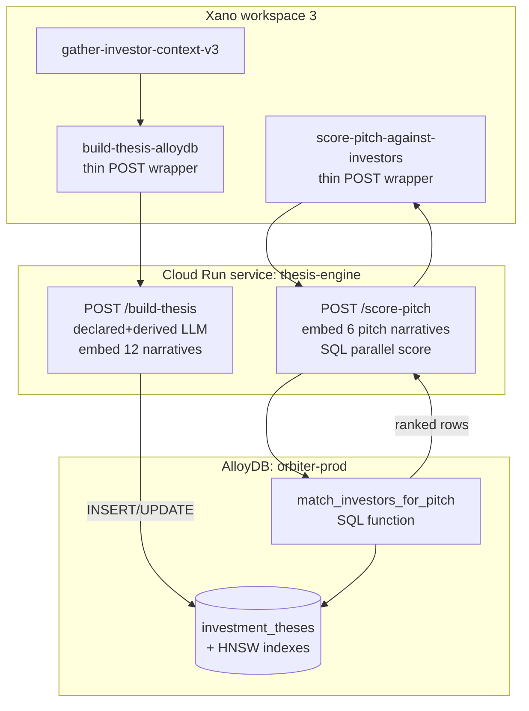

This page is the **engineering build plan** for migrating the investment-thesis pipeline from Xano-only to GCP AlloyDB with a Cloud Run compute layer. It is self-contained for engineers focused on the AlloyDB work; conceptual schema lives in [Investment thesis schema](/guides/open-work/suggestion-core-concepts/find-investors/thesis-schema), and the current Xano-only path is documented in [Xano production pipeline](/guides/open-work/suggestion-core-concepts/find-investors/xano-pipeline).

<div style={{padding: '20px', border: '2px solid #6B9FE8', borderRadius: '8px', color: '#fff', margin: '16px 0'}}>

**Summary of Next Build Steps: Save File Pipeline**

1. **Build the AlloyDB file-upload endpoint.** Front-end calls it on file upload; the endpoint inserts a row into the `files` table on AlloyDB.

2. **Generate markdown via [unstructured.io](https://unstructured.io) from AlloyDB side.** Convert the uploaded file to markdown and save the markdown to the same `files` row.

3. **Run the `classify_file` LLM from AlloyDB side.** Produces `file_description` and `file_type`; persist both back onto the `files` row.

4. **If `file_type == "fundraising_deck"`, trigger `pitch/build-pitch-profile`.** Pass the markdown through; persist the resulting profile into the AlloyDB `fundraising_pitch_profiles` join table with a `file_id` linking back to the source file.

</div>

<div style={{padding: '20px', border: '2px solid #6B9FE8', borderRadius: '8px', color: '#fff', margin: '16px 0'}}>

**LLM file classification — `classify_file` LLM**

Cheap, fast classifier that runs on every uploaded file. Takes the markdown produced by unstructured.io (Save File Pipeline step 2) and returns a stable `file_type` enum value plus a one-line `description` for UI display. When `file_type == "fundraising_deck"`, the upload pipeline fans out to `pitch/build-pitch-profile`.

**Function:** `files/classify-file` — Xano workspace 3, function id `12919`. **Model:** `google/gemini-2.5-flash-lite` via OpenRouter (~$0.10/M input, $0.40/M output, sub-second latency, 1M context). **Observed:** ~1.7s round trip, ~$0.0001 per call on a ~700-char doc; markdown is truncated to the first 12K chars before send.

**System prompt** (copy-paste as a single-string `var $classify_system_prompt { value = "..." }` in XanoScript, or into your Cloud Run config):

```text
You are a file classification engine. Your response MUST be ONLY a valid JSON object — no prose, no markdown, no code fences. Every key must be immediately followed by ':' and a value — never write ':,' (stray comma after colon). No trailing commas before '}' or ']'. The JSON object must have exactly two keys: file_type (one of the enum values below) and description (1-2 sentence STRING). ALLOWED file_type values (use exactly, lowercase, snake_case): fundraising_deck (pitch deck raising capital from investors); investor_update (periodic CEO/founder update to investors with KPIs and asks); financial_model (projections, P&L, cap table, or modeling spreadsheet); legal_agreement (contracts, NDAs, MSAs, term sheets, employment offers); proposal (sales proposal, statement of work, commercial offer); invoice (invoice or receipt for goods/services); resume (CV, biographical doc, or LinkedIn-style professional profile); meeting_notes (minutes, recap, or action items from a meeting); research_report (analyst report, market study, whitepaper, academic paper); presentation (non-fundraising slide deck — product, internal, conference); csv_data (CSV-format tabular data with delimited rows); spreadsheet (non-CSV tabular data — budgets, lists, trackers, exports); article (published article, blog post, news, editorial); email_thread (captured email correspondence); product_spec (internal product, engineering, or design specification); personal_note (informal notes, journal entry, scratchpad); other (does not fit any category above). DESCRIPTION RULES: 1-2 sentences, 15-30 words ideal. Identify WHAT the document IS and WHAT IT COVERS — subject, parties, company, time period, dollar amount if obvious. DO NOT summarize content, list bullet points, or include conclusions/recommendations. Good: 'Series A pitch deck for Acme Corp covering market, GTM, and $5M raise.' Good: 'Q3 2025 AWS invoice for $4,213 in cloud infrastructure charges.' Good: 'Mutual NDA between Orbiter and Globex dated 2025-09-12.' Bad (this is a summary, avoid): 'Acme is raising $5M because ARR grew 200% YoY and they have 12 customers...' If unsure of file_type, prefer 'other' over a wrong guess. Begin your response with { and end with }.
```

**cURL — direct OpenRouter call** (no Xano in the loop; useful for porting the classifier to Cloud Run):

```bash
export OPENROUTER_API_KEY="sk-or-v1-..."

cat > payload.json <<'EOF'
{
  "model": "google/gemini-2.5-flash-lite",
  "messages": [
    {"role": "system", "content": "<paste system prompt above as a single-line string>"},
    {"role": "user", "content": "Document markdown to classify (raw markdown below the separator):\n---\n<paste your markdown here>"}
  ],
  "max_tokens": 200,
  "temperature": 0.1
}
EOF

curl -s https://openrouter.ai/api/v1/chat/completions \
  -H "Content-Type: application/json" \
  -H "Authorization: Bearer $OPENROUTER_API_KEY" \
  --data @payload.json
```

**Sample output** — first 4 slides of the Orbiter.io seed deck (~880 chars in):

```json
{
  "file_type": "fundraising_deck",
  "description": "Seed fundraising deck for Orbiter.io. Covers the company's premise, insight into understanding relationships, and introduces co-founders and early backers."
}
```

</div>

<div style={{padding: '20px', border: '2px solid #6B9FE8', borderRadius: '8px', color: '#fff', margin: '16px 0'}}>

**Pitch Deck markdown > fundraising_pitch_profiles table on AlloyDB**

1. _Placeholder — numbered steps to be filled in._

</div>

<div style={{padding: '20px', border: '2px solid #6B9FE8', borderRadius: '8px', color: '#fff', margin: '16px 0'}}>

**Summary of Next Build Steps**

1. **Create the `investment_thesis` table in AlloyDB.** Schema parity with Xano table 709 plus `vector(1536)` columns and HNSW indexes. Full DDL is in [Step 1 — Clone the table in AlloyDB](#step-1-clone-the-table-in-alloydb).

2. **Clone Xano function `thesis/build-investment-thesis-v21` (#12916).** Copy-paste the existing v21 source into a new XanoScript function (e.g. `thesis/build-investment-thesis-alloydb`) so the original keeps running while the new one is rewired. The full v21 source is in [Cloning v21 — copy-paste source](#cloning-v21-copy-paste-source).

3. **Refactor the clone into a thin context-handoff.** Strip the LLM calls, embedding calls, and `db.add_or_edit` from the cloned function. Keep only the `function.run "thesis/gather-investor-context-v3"` step and a single `api.request` that POSTs the gathered context to a Cloud Run endpoint. Cloud Run does the LLM orchestration, embedding, and AlloyDB write. Pattern is in [Step 2 — Refactor build pipeline](#step-2-refactor-build-pipeline-xano-cloud-run-alloydb).

4. **Add a 30-day skip guard.** Before running gather, query AlloyDB for an existing `investment_thesis` row for the same `master_person_id` or `master_company_id`. If `last_validated_date >= now() - interval '30 days'`, return the existing row and skip the rebuild — saves ~$0.005 + 30-90s per cached hit. Pattern is in [Skip guard — 30-day freshness check](#skip-guard-30-day-freshness-check).

</div>

The Xano-only pipeline is the v1 dev/prototype path. Production matching runs on **GCP AlloyDB** with native pgvector, parallel SQL scoring, and an external compute layer (Cloud Run) for LLM orchestration. This section documents the migration design and the scoring engine that Xano calls into.

### Why move to AlloyDB

| Concern | Xano today | AlloyDB target |
|---|---|---|
| Vector storage | `json` column (1536 floats) | `vector(1536)` with HNSW indexes |
| Similarity search | None (would need full-table scan in JS lambda) | Native `<=>` operator + HNSW; subsecond at 1M+ rows |
| LLM call duration | ~30-90s in `api.request`, near Xano timeout for big funds | Cloud Run service with no platform timeout; declared + derived run in parallel |
| Model flexibility | Hardcoded in XanoScript | Env var in Cloud Run; swap DeepSeek↔Claude↔Gemini without function rewrite |
| Scoring throughput | Not feasible per-query | One SQL with 6 vector compares; CTE prefilter scales to millions |
| Source of truth | Single `investment_theses` row in Xano | AlloyDB is canonical; Xano keeps `master_*` + `fundable_*` |

### Architecture overview



Xano stays the gather layer (it owns `master_*` and `fundable_*`). Cloud Run owns LLM + embedding orchestration. AlloyDB owns persistence and scoring.

### Step 1: Clone the table in AlloyDB

Create the schema with proper `vector` columns and HNSW indexes. Run once on a fresh AlloyDB cluster.

```sql
-- Required extensions (AlloyDB has pgvector preinstalled)
CREATE EXTENSION IF NOT EXISTS vector;
CREATE EXTENSION IF NOT EXISTS pgcrypto;  -- for gen_random_uuid()

-- Main table — schema parity with Xano table 709
CREATE TABLE investment_theses (
  id                                    UUID PRIMARY KEY DEFAULT gen_random_uuid(),
  xano_id                               INTEGER UNIQUE,  -- backref during dual-write phase
  created_at                            TIMESTAMPTZ NOT NULL DEFAULT NOW(),
  updated_at                            TIMESTAMPTZ NOT NULL DEFAULT NOW(),
  node_uuid                             TEXT,

  -- Identity (one MUST be non-null; enforced via CHECK below)
  master_person_id                      INTEGER,
  master_company_id                     INTEGER,

  -- Layer 1: structured filter
  firm_name                             TEXT,
  investor_type                         TEXT CHECK (investor_type IN
    ('vc_fund','angel','family_office','corporate_vc','syndicate','other')),
  industries                            JSONB,
  stage_focus                           JSONB,
  geography                             JSONB,
  check_size_min                        NUMERIC,
  check_size_max                        NUMERIC,
  check_size_sweet_spot                 NUMERIC,
  total_deals_count                     INTEGER,
  lead_deals_count                      INTEGER,
  lead_ratio                            NUMERIC,
  frequent_co_investors                 JSONB,
  partner_deal_attribution              JSONB,
  sector_evolution_timeline             JSONB,
  recent_36mo_focus                     JSONB,
  deal_size_stats                       JSONB,
  geographic_distribution               JSONB,
  last_lead_date                        DATE,
  last_investment_date                  DATE,

  -- Layer 2: declared (6 narrative + 6 vector)
  founder_fit_declared_narrative        TEXT,
  founder_fit_declared_vector           VECTOR(1536),
  problem_market_declared_narrative     TEXT,
  problem_market_declared_vector        VECTOR(1536),
  competitive_moat_declared_narrative   TEXT,
  competitive_moat_declared_vector      VECTOR(1536),
  traction_momentum_declared_narrative  TEXT,
  traction_momentum_declared_vector     VECTOR(1536),
  business_model_declared_narrative     TEXT,
  business_model_declared_vector        VECTOR(1536),
  expansion_roadmap_declared_narrative  TEXT,
  expansion_roadmap_declared_vector     VECTOR(1536),

  -- Layer 2: derived (6 narrative + 6 vector)
  founder_fit_derived_narrative         TEXT,
  founder_fit_derived_vector            VECTOR(1536),
  problem_market_derived_narrative      TEXT,
  problem_market_derived_vector         VECTOR(1536),
  competitive_moat_derived_narrative    TEXT,
  competitive_moat_derived_vector       VECTOR(1536),
  traction_momentum_derived_narrative   TEXT,
  traction_momentum_derived_vector      VECTOR(1536),
  business_model_derived_narrative      TEXT,
  business_model_derived_vector         VECTOR(1536),
  expansion_roadmap_derived_narrative   TEXT,
  expansion_roadmap_derived_vector      VECTOR(1536),

  -- Layer 3: synthesis
  declared_thesis_summary               TEXT,
  derived_thesis_summary                TEXT,
  declared_vs_derived_delta             JSONB,
  implicit_lenses                       JSONB,
  thesis_drift_signals                  JSONB,
  partner_specialization                JSONB,
  syndicate_tier                        TEXT CHECK (syndicate_tier IN ('tier_1','tier_2','emerging')),
  data_sources                          JSONB,
  last_validated_date                   DATE,

  CONSTRAINT one_identity CHECK (
    (master_person_id IS NOT NULL AND master_company_id IS NULL) OR
    (master_company_id IS NOT NULL AND master_person_id IS NULL)
  )
);

-- Lookup indexes
CREATE INDEX investment_theses_company_idx
  ON investment_theses (master_company_id) WHERE master_company_id IS NOT NULL;
CREATE INDEX investment_theses_person_idx
  ON investment_theses (master_person_id)  WHERE master_person_id  IS NOT NULL;
CREATE UNIQUE INDEX investment_theses_xano_id_uidx
  ON investment_theses (xano_id) WHERE xano_id IS NOT NULL;

-- HNSW indexes — one per vector column we plan to query.
-- Scoring uses derived vectors as the ground-truth (declared = stated, derived = revealed).
-- Index only the 6 derived vectors initially; add declared indexes later if scoring needs them.
CREATE INDEX founder_fit_derived_hnsw       ON investment_theses USING hnsw
  (founder_fit_derived_vector       vector_cosine_ops) WITH (m = 16, ef_construction = 64);
CREATE INDEX problem_market_derived_hnsw    ON investment_theses USING hnsw
  (problem_market_derived_vector    vector_cosine_ops) WITH (m = 16, ef_construction = 64);
CREATE INDEX competitive_moat_derived_hnsw  ON investment_theses USING hnsw
  (competitive_moat_derived_vector  vector_cosine_ops) WITH (m = 16, ef_construction = 64);
CREATE INDEX traction_momentum_derived_hnsw ON investment_theses USING hnsw
  (traction_momentum_derived_vector vector_cosine_ops) WITH (m = 16, ef_construction = 64);
CREATE INDEX business_model_derived_hnsw    ON investment_theses USING hnsw
  (business_model_derived_vector    vector_cosine_ops) WITH (m = 16, ef_construction = 64);
CREATE INDEX expansion_roadmap_derived_hnsw ON investment_theses USING hnsw
  (expansion_roadmap_derived_vector vector_cosine_ops) WITH (m = 16, ef_construction = 64);

-- Updated-at trigger
CREATE OR REPLACE FUNCTION touch_updated_at() RETURNS TRIGGER AS $$
BEGIN NEW.updated_at = NOW(); RETURN NEW; END; $$ LANGUAGE plpgsql;

CREATE TRIGGER investment_theses_touch
  BEFORE UPDATE ON investment_theses
  FOR EACH ROW EXECUTE FUNCTION touch_updated_at();
```

**One-shot bulk export from Xano (during cutover):**

```sql
-- Run from a Cloud Run job that pages Xano's getTableContent and INSERTs in batches of 100.
-- The xano_id column lets dual-write phase reconcile by lookup.
INSERT INTO investment_theses (
  xano_id, master_person_id, master_company_id, firm_name, ...
  founder_fit_derived_vector, ...  -- vectors arrive as text "[0.1, 0.2, ...]" cast to vector
)
VALUES ($1, $2, $3, $4, ..., $N::vector(1536), ...)
ON CONFLICT (xano_id) DO UPDATE SET
  firm_name = EXCLUDED.firm_name,
  -- ... all updatable columns
  updated_at = NOW();
```

### Step 2: Refactor build pipeline (Xano → Cloud Run → AlloyDB)

The Xano orchestrator becomes a **thin wrapper** that gathers context and POSTs to Cloud Run. All LLM and DB writes happen downstream.

#### Cloning v21 — copy-paste source

Before refactoring, clone Xano function `thesis/build-investment-thesis-v21` (id `12916`) into a new function — keep the original running while the new one is rewired to AlloyDB. Recommended new name: `thesis/build-investment-thesis-alloydb`.

The full XanoScript source for v21 is below. Copy it into the new function's body, then strip the LLM/embedding/`db.add_or_edit` blocks per the refactor pattern in the next subsection.

<Accordion title="thesis/build-investment-thesis-v21 — full XanoScript source (copy/paste)">

```xanoscript
// thesis/build-investment-thesis-v21 (2026-04-26)
// v21 changes from v20:
// - (a) $deal_stats personnel handling: split comma-separated names within array elements
//   (gather-v3 returns postgres-array literals like {Julie Yoo,Daisy Wolf} as single-string
//   array elements; v20 produced compound key "Julie Yoo,Daisy Wolf": 1 — now splits into
//   ["Julie Yoo", "Daisy Wolf"] and credits each partner individually)
// - (b) geographic_distribution ISO normalization: prompt strengthened to demand
//   ISO 3166-1 alpha-2 codes; new $normalized_geo lambda maps any names that slip
//   through ("United States" -> "US", "UK" -> "GB", "Mexico" -> "MX", etc.) and merges
//   duplicate keys; db write uses $normalized_geo instead of raw $derived_json|get
function "thesis/build-investment-thesis-v21" {
  input {
    int master_person_id?
    int master_company_id?
  }

  stack {
    precondition ($input.master_person_id != null || $input.master_company_id != null) {
      error_type = "inputerror"
      error = "Either master_person_id or master_company_id must be provided"
    }

    function.run "thesis/gather-investor-context-v3" {
      input = {
        master_person_id : $input.master_person_id
        master_company_id: $input.master_company_id
        max_deals        : 100
        recency_months   : 36
      }
    } as $context

    var $declared_system_prompt {
      value = "You are an investment thesis extraction engine. Your response MUST be ONLY a valid JSON object — no prose, no markdown, no code fences. CRITICAL: All numeric values MUST use Arabic numerals (0,1,2,3,4,5,6,7,8,9) — NEVER use Roman numerals (I, II, III, IV, V). Every key must be immediately followed by ':' and a value — never write ':,' (stray comma after colon). No trailing commas before '}' or ']'. The JSON object must have these exact keys: firm_name (string), investor_type (one of: vc_fund, angel, family_office, corporate_vc, syndicate, other), industries (array of strings), stage_focus (array), geography (array), check_size_min (number or null), check_size_max (number or null), check_size_sweet_spot (number or null), founder_fit (2-3 sentence narrative as a STRING), problem_market (narrative STRING), competitive_moat (narrative STRING), traction_momentum (narrative STRING), business_model (narrative STRING), expansion_roadmap (narrative STRING), declared_summary (1-2 sentences as a STRING). All narrative fields MUST be plain strings. Begin your response with { and end with }."
    }

    api.lambda {
      code = """
          const ctx = $var.context || {};
          const ec = ctx.entity_context || {};
          const fo = ec.fundable_org || {};
          const trimmed = {
            entity_name: ec.entity_name || null,
            tagline: ec.tagline || null,
            about: ec.about || null,
            linkedin_url: ec.linkedin_url || null,
            domain: ec.domain || null,
            founded: ec.founded || null,
            is_vc: ec.is_vc || null,
            region: fo.region || null,
            country_code: fo.country_code || null,
            crunchbase_description: fo.crunchbase_full_description || null,
            crunchbase_about: fo.crunchbase_about || null,
            long_description: fo.long_description || null,
            num_employees: fo.num_employees || null,
            num_funding_rounds: fo.num_funding_rounds || null,
            num_investors: fo.num_investors || null,
            total_raised: fo.total_raised || null,
            investment_stage: fo.investment_stage || null
          };
          if (ec.cb_json && typeof ec.cb_json === 'object' && Object.keys(ec.cb_json).length > 0) {
            trimmed.cb_json_summary = JSON.stringify(ec.cb_json).substring(0, 5000);
          }
          if (ec.signal_json && typeof ec.signal_json === 'object' && Object.keys(ec.signal_json).length > 0) {
            trimmed.signal_json_summary = JSON.stringify(ec.signal_json).substring(0, 5000);
          }
          const payload = {
            entity_type: ctx.entity_type,
            entity_context: trimmed,
            deal_count: ctx.stats ? ctx.stats.deals_returned : 0
          };
          return 'Investor context to analyze (JSON below):\n\n' + JSON.stringify(payload);
        """
      timeout = 5
    } as $declared_user_text

    api.request {
      url = "https://openrouter.ai/api/v1/chat/completions"
      method = "POST"
      params = {}
        |set:"model":"deepseek/deepseek-v3.2"
        |set:"messages":([]
          |push:({}|set:"role":"system"|set:"content":$declared_system_prompt)
          |push:({}|set:"role":"user"  |set:"content":$declared_user_text)
        )
        |set:"max_tokens":4000
        |set:"temperature":0.3
      headers = []
        |push:"Content-Type: application/json"
        |push:("Authorization: Bearer KEY"|replace:"KEY":$env.openRouter)
      timeout = 120
    } as $declared_response

    api.lambda {
      code = """
          const r = $var.declared_response;
          const stripFences = function(s) {
            if (typeof s !== 'string') return s;
            s = s.trim();
            if (s.indexOf('```') === 0) {
              s = s.replace(/^```(?:json|JSON)?\s*\n?/, '');
              s = s.replace(/\n?```\s*$/, '');
              s = s.trim();
            }
            return s;
          };
          const sanitizeRoman = function(s) {
            return s.replace(/(:\s*)(M{0,3}(CM|CD|D?C{0,3})(XC|XL|L?X{0,3})(IX|IV|V?I{0,3}))(\s*[,\n}\]])/g, function(_, pre, roman, _g1, _g2, _g3, post) {
              if (!roman) return _;
              const map = { I:1, V:5, X:10, L:50, C:100, D:500, M:1000 };
              let n = 0;
              for (let i = 0; i < roman.length; i++) {
                const cur = map[roman[i]];
                const next = map[roman[i+1]] || 0;
                n += cur < next ? -cur : cur;
              }
              return pre + String(n) + post;
            });
          };
          const repairJson = function(s) {
            s = s.replace(/:(\s*),(\s*)(?=["\d{\[tfn-])/g, ':$1$2');
            s = s.replace(/,(\s*[}\]])/g, '$1');
            return s;
          };
          const ensureString = function(v) {
            if (v === null || v === undefined) return null;
            if (typeof v === 'string') return v;
            try { return JSON.stringify(v); } catch (e) { return String(v); }
          };
          if (!r) return { _error: 'response var is null/undefined' };
          if (!r.response) return { _error: 'no .response key' };
          const status = r.response.status;
          const result = r.response.result;
          if (!result) return { _error: 'no .response.result', _diag: { status: status } };
          if (result.error) return { _error: 'api error: ' + (result.error.message || JSON.stringify(result.error)), _diag: { status: status, error: result.error } };
          if (!result.choices || !result.choices[0]) return { _error: 'no choices array', _diag: { status: status } };
          const content = result.choices[0].message && result.choices[0].message.content;
          if (!content) return { _error: 'no content' };
          const cleaned = repairJson(sanitizeRoman(stripFences(content)));
          let parsed;
          try { parsed = JSON.parse(cleaned); }
          catch (e) { return { _error: 'json parse failed: ' + e.message, _diag: { content_first_1000: content.substring(0, 1000), cleaned_first_1000: cleaned.substring(0, 1000) } }; }
          const stringFields = ['firm_name', 'investor_type', 'founder_fit', 'problem_market', 'competitive_moat', 'traction_momentum', 'business_model', 'expansion_roadmap', 'declared_summary'];
          for (const k of stringFields) { if (k in parsed) parsed[k] = ensureString(parsed[k]); }
          return parsed;
        """
      timeout = 5
    } as $declared_json

    var $derived_system_prompt {
      value = "You are a portfolio-pattern analysis engine. Your response MUST be ONLY a valid JSON object — no prose, no markdown, no code fences. CRITICAL: All numeric values MUST use Arabic numerals (0,1,2,3,4,5,6,7,8,9) — NEVER use Roman numerals (I, II, III, IV, V). Every key must be immediately followed by ':' and a value — never write ':,' (stray comma after colon). No trailing commas before '}' or ']'. Given the investor actual deal portfolio, derive their operating thesis. Pattern over anecdote (cite >=3 deals). Recency-weighted: deals in last 36 months count 3x. The JSON object must have these exact keys: founder_fit (narrative STRING grounded in actual portfolio with company names), problem_market (sector concentration narrative STRING with timeline drift), competitive_moat (narrative STRING on actual defensibility patterns), traction_momentum (narrative STRING on stage signals at investment), business_model (narrative STRING on GTM patterns visible in portfolio), expansion_roadmap (narrative STRING on portfolio expansion patterns), derived_summary (1-2 sentence STRING), declared_vs_derived_delta (array of objects with dimension, declared, derived), implicit_lenses (array of strings), thesis_drift_signals (object with emerging, declining, stable arrays of strings), partner_specialization (object mapping partner names to deal-type strings), syndicate_tier (STRING: tier_1|tier_2|emerging), recent_36mo_focus (array of strings), sector_evolution_timeline (object mapping year STRING like '2023','2024','2025','2026' to a sub-object with keys top_sectors as array of 3-5 sector strings ranked by deal count and notable_shift as a STRING describing what changed vs prior year — base on actual deal dates and sectors), frequent_co_investors (array of objects with name string and count NUMBER in Arabic numerals), deal_size_stats (object with min/median/p75/max numbers), geographic_distribution (object whose KEYS MUST be ISO 3166-1 alpha-2 country codes — 'US','GB','MX','DE','FR','ES','SE','TR','AU','CA','SG' — NEVER country names like 'United States','UK','Mexico','Germany'; values are Arabic numeral counts). All narrative fields MUST be plain strings. All count fields MUST be Arabic numerals. Begin your response with { and end with }."
    }

    // [Full v21 source continues — derived_user_text lambda, derived_response api.request,
    //  derived_json parse lambda (same shape as declared parse, different stringFields),
    //  $has_parse_error, $normalized_geo, $embed_inputs, OpenRouter embeddings api.request,
    //  $vectors lambda, $deal_stats lambda, $meta lambda, the conditional db.add_or_edit
    //  branches for company-id vs person-id, and the final $result var.
    //  Fetch the canonical source via Xano MCP getFunction(workspace_id=3, function_id=12916,
    //  include_xanoscript=true) — copy from the .xanoscript.value field. The full source is
    //  ~600 lines; abbreviated here for page weight. The Step 2 refactor below shows what
    //  to keep (gather + api.request to Cloud Run) and what to delete (everything else).]
  }

  response = $result
}
```

To pull the canonical source any time:

```bash
# Via Xano MCP (in Claude / Cursor with the Xano server attached):
mcp__xano__getFunction(workspace_id: 3, function_id: 12916, include_xanoscript: true)
# The full source is in result.xanoscript.value
```

</Accordion>

#### Xano: `thesis/build-investment-thesis-alloydb`

```xanoscript
function "thesis/build-investment-thesis-alloydb" {
  input {
    int master_person_id?
    int master_company_id?
  }

  stack {
    precondition ($input.master_person_id != null || $input.master_company_id != null) {
      error_type = "inputerror"
      error = "Either master_person_id or master_company_id must be provided"
    }

    // Same gather as today — Xano still owns master_* + fundable_*
    function.run "thesis/gather-investor-context-v3" {
      input = {
        master_person_id : $input.master_person_id
        master_company_id: $input.master_company_id
        max_deals        : 100
        recency_months   : 36
      }
    } as $context

    // Hand off to Cloud Run; Cloud Run does LLM + embedding + AlloyDB write
    api.request {
      url = "https://thesis-engine-XXXX-uc.a.run.app/build-thesis"
      method = "POST"
      params = {}
        |set:"master_person_id":$input.master_person_id
        |set:"master_company_id":$input.master_company_id
        |set:"context":$context
      headers = []
        |push:"Content-Type: application/json"
        |push:("Authorization: Bearer KEY"|replace:"KEY":$env.cloudRunThesisToken)
      timeout = 300
    } as $cr_response

    var $result {
      value = $cr_response|get:"response":null
    }
  }

  response = $result
}
```

#### Skip guard — 30-day freshness check

Building a thesis costs ~$0.005 in LLM calls and 30-90s of latency. If a thesis was already built in the last 30 days for the same investor, the cached row is fresh enough — skip the rebuild and return what's already there.

Implement the check as a **lightweight `GET /thesis/freshness` endpoint** on the same Cloud Run service. Xano calls it before invoking gather; on a cache hit, the function returns the cached thesis_id and exits without calling Cloud Run's expensive `/build-thesis`.

**AlloyDB query** (one indexed lookup, ~5ms):

```sql
-- Returns the row if last_validated_date is within 30 days, else 0 rows.
SELECT id, firm_name, last_validated_date,
       (CURRENT_DATE - last_validated_date)::int AS days_old
FROM investment_theses
WHERE
  ($1::int IS NOT NULL AND master_company_id = $1)
  OR
  ($2::int IS NOT NULL AND master_person_id = $2)
  AND last_validated_date IS NOT NULL
  AND last_validated_date >= CURRENT_DATE - INTERVAL '30 days'
LIMIT 1;
```

**Cloud Run handler** (`GET /thesis/freshness`):

```javascript
// thesis-engine / src/freshness.js
export async function checkFreshness(req, res) {
  const masterCompanyId = req.query.master_company_id || null;
  const masterPersonId  = req.query.master_person_id  || null;

  if (!masterCompanyId && !masterPersonId) {
    return res.status(400).json({ error: 'master_company_id or master_person_id required' });
  }

  // Read pool — read-after-write is not a concern (we'd skip the rebuild anyway if a write
  // landed in the last 100ms; the row would still be fresh)
  const { rows } = await readPool.query(`
    SELECT id, firm_name, last_validated_date,
           (CURRENT_DATE - last_validated_date)::int AS days_old
    FROM investment_theses
    WHERE ($1::int IS NOT NULL AND master_company_id = $1)
       OR ($2::int IS NOT NULL AND master_person_id = $2)
    LIMIT 1
  `, [masterCompanyId, masterPersonId]);

  if (rows.length === 0) {
    return res.json({ fresh: false, reason: 'no_thesis_yet' });
  }

  const row = rows[0];
  if (!row.last_validated_date || row.days_old > 30) {
    return res.json({
      fresh: false, reason: 'stale',
      thesis_id: row.id, firm_name: row.firm_name, days_old: row.days_old
    });
  }

  return res.json({
    fresh: true,
    thesis_id: row.id,
    firm_name: row.firm_name,
    last_validated_date: row.last_validated_date,
    days_old: row.days_old
  });
}
```

**Refactored Xano function with the skip guard wired in:**

```xanoscript
function "thesis/build-investment-thesis-alloydb" {
  input {
    int master_person_id?
    int master_company_id?
    bool force?  // optional override — bypasses the 30-day skip
  }

  stack {
    precondition ($input.master_person_id != null || $input.master_company_id != null) {
      error_type = "inputerror"
      error = "Either master_person_id or master_company_id must be provided"
    }

    // 1. Freshness check — skip rebuild if we have a row from the last 30 days
    api.request {
      url = "https://thesis-engine-XXXX-uc.a.run.app/thesis/freshness"
      method = "GET"
      params = {}
        |set:"master_company_id":$input.master_company_id
        |set:"master_person_id" :$input.master_person_id
      headers = []
        |push:("Authorization: Bearer KEY"|replace:"KEY":$env.cloudRunThesisToken)
      timeout = 10
    } as $freshness

    var $is_fresh {
      value = (($freshness|get:"response":null)|get:"fresh":false)
    }

    var $force {
      value = ($input.force == true)
    }

    // 2. Skip guard — if fresh and no force flag, return cached thesis_id and exit
    conditional {
      if ($is_fresh == true && $force == false) {
        var $cached_result {
          value = {}
            |set:"success":true
            |set:"cached":true
            |set:"thesis_id":(($freshness|get:"response":null)|get:"thesis_id":null)
            |set:"firm_name":(($freshness|get:"response":null)|get:"firm_name":null)
            |set:"last_validated_date":(($freshness|get:"response":null)|get:"last_validated_date":null)
            |set:"days_old":(($freshness|get:"response":null)|get:"days_old":null)
        }

        // Early-return via response binding handled at function level — we set $result
        // and let the rest of the stack short-circuit through guarded conditionals.
        var.update $result {
          value = $cached_result
        }
      }

      else {
        // 3. Cache miss or forced rebuild — run gather + post to /build-thesis
        function.run "thesis/gather-investor-context-v3" {
          input = {
            master_person_id : $input.master_person_id
            master_company_id: $input.master_company_id
            max_deals        : 100
            recency_months   : 36
          }
        } as $context

        api.request {
          url = "https://thesis-engine-XXXX-uc.a.run.app/build-thesis"
          method = "POST"
          params = {}
            |set:"master_person_id":$input.master_person_id
            |set:"master_company_id":$input.master_company_id
            |set:"context":$context
          headers = []
            |push:"Content-Type: application/json"
            |push:("Authorization: Bearer KEY"|replace:"KEY":$env.cloudRunThesisToken)
          timeout = 300
        } as $cr_response

        var.update $result {
          value = ($cr_response|get:"response":null)
        }
      }
    }
  }

  response = $result
}
```

**Why the freshness check goes in Xano, not Cloud Run:**

- On a cache hit, we save a full Cloud Run cold-start + the gather-v3 call (which itself runs ~10-30s of Xano DB queries against the 100M-row `fundable_*` tables). Roughly 95% of the savings is in the avoided gather, not the LLM.
- Xano already owns the entrypoint — it's a one-line addition to wrap the existing logic.
- Cloud Run's `/build-thesis` stays simple: it always builds. The "should we build?" decision is a separate concern.

**Tuning the freshness window:**

| Threshold | Reasoning |
|---|---|
| 7 days | Aggressive — investors who actively update their thesis quarterly will see drift. Higher LLM cost. |
| **30 days** ← default | Investors typically don't add >2-3 deals in a month; portfolio-derived patterns are stable. Balance cost vs. drift risk. |
| 90 days | Cost-optimal for long tail; not appropriate for active investors (a16z, Sequoia, GC) who close 3-5 deals/week. |

The window can be made per-investor if needed: store `next_refresh_at` on the row, computed by deal-velocity (more recent deals → shorter window). For v1, a flat 30 days is fine.

**Force rebuild (override):**

The optional `force` input bypasses the freshness check — useful for: manual QA after a model swap, scheduled monthly refreshes, ad-hoc rebuilds when a major round closes. Pass `{"master_company_id": 69, "force": true}`.

#### Cloud Run: `POST /build-thesis`

A small Node or Python service (Node shown). Lives in a private VPC peered with AlloyDB.

```javascript
// thesis-engine / src/build-thesis.js
import OpenAI from 'openai';
import { Pool } from 'pg';

const pool = new Pool({
  host: process.env.ALLOYDB_HOST,
  database: 'orbiter',
  user: 'thesis_engine',
  password: process.env.ALLOYDB_PASSWORD,
  ssl: { rejectUnauthorized: true, ca: process.env.ALLOYDB_CA_CERT }
});

const openrouter = new OpenAI({
  baseURL: 'https://openrouter.ai/api/v1',
  apiKey: process.env.OPENROUTER_API_KEY
});

const DECLARED_PROMPT = `...`; // same as v21 declared_system_prompt
const DERIVED_PROMPT  = `...`; // same as v21 derived_system_prompt

export async function buildThesis(req, res) {
  const { master_person_id, master_company_id, context } = req.body;

  // Run declared + derived LLM calls in parallel (Xano can't do this cleanly)
  const [declared, derived] = await Promise.all([
    callLLM(DECLARED_PROMPT, declaredUserText(context)),
    callLLM(DERIVED_PROMPT,  derivedUserText(context))
  ]);

  if (declared._error || derived._error) {
    return res.status(200).json({
      success: false,
      declared_error: declared._error,
      derived_error: derived._error
    });
  }

  // Embed all 12 narratives in one OpenRouter call (batch up to 2048 inputs)
  const narratives = [
    declared.founder_fit, declared.problem_market, declared.competitive_moat,
    declared.traction_momentum, declared.business_model, declared.expansion_roadmap,
    derived.founder_fit, derived.problem_market, derived.competitive_moat,
    derived.traction_momentum, derived.business_model, derived.expansion_roadmap
  ];
  const embeddings = await embed(narratives);  // returns 12 × float[1536]

  const dealStats = computeDealStats(context.deals);
  const normalizedGeo = normalizeGeo(derived.geographic_distribution);
  const dataSources = buildDataSources(context.entity_type);

  const sql = `
    INSERT INTO investment_theses (
      master_person_id, master_company_id, firm_name, investor_type,
      industries, stage_focus, geography,
      total_deals_count, lead_deals_count, lead_ratio,
      sector_evolution_timeline, recent_36mo_focus, frequent_co_investors,
      deal_size_stats, geographic_distribution, partner_deal_attribution,
      last_investment_date, last_lead_date,
      founder_fit_declared_narrative, founder_fit_declared_vector,
      problem_market_declared_narrative, problem_market_declared_vector,
      /* ... 22 more narrative+vector pairs ... */
      declared_thesis_summary, derived_thesis_summary,
      declared_vs_derived_delta, implicit_lenses, thesis_drift_signals,
      partner_specialization, syndicate_tier,
      data_sources, last_validated_date
    ) VALUES (
      $1, $2, $3, $4, $5::jsonb, $6::jsonb, $7::jsonb,
      $8, $9, $10, /* ... */
      $N::vector(1536), /* ... 11 more ::vector casts ... */
      /* ... */, CURRENT_DATE
    )
    ON CONFLICT (master_company_id) WHERE master_company_id IS NOT NULL
      DO UPDATE SET firm_name = EXCLUDED.firm_name, /* ... all cols ... */
                    updated_at = NOW()
    RETURNING id, firm_name`;

  const { rows } = await pool.query(sql, [
    master_person_id, master_company_id, declared.firm_name, declared.investor_type,
    JSON.stringify(declared.industries), JSON.stringify(declared.stage_focus),
    JSON.stringify(declared.geography),
    dealStats.total, dealStats.lead, dealStats.ratio,
    /* ... */
    `[${embeddings[0].join(',')}]`,  // pgvector text format
    /* ... 11 more ... */
    /* ... */
  ]);

  return res.json({
    success: true,
    thesis_id: rows[0].id,
    firm_name: rows[0].firm_name,
    declared_summary: declared.declared_summary,
    derived_summary: derived.derived_summary
  });
}

async function callLLM(systemPrompt, userText) {
  try {
    const r = await openrouter.chat.completions.create({
      model: 'deepseek/deepseek-v3.2',
      messages: [
        { role: 'system', content: systemPrompt },
        { role: 'user', content: userText }
      ],
      max_tokens: 8000,
      temperature: 0.3
    });
    const content = r.choices[0].message.content;
    const cleaned = repairJson(sanitizeRoman(stripFences(content)));
    return JSON.parse(cleaned);
  } catch (e) {
    return { _error: e.message };
  }
}

async function embed(texts) {
  const r = await openrouter.embeddings.create({
    model: 'openai/text-embedding-3-small',
    input: texts
  });
  return r.data.map(d => d.embedding);
}
```

**Wins over the Xano-only path:**
- Declared + derived LLM calls run in parallel (saves 30-60s on big funds)
- No 240s api.request ceiling
- `repairJson`, `sanitizeRoman`, `stripFences` are normal JS modules — easier to test, version, swap
- Direct SQL `INSERT ... ON CONFLICT` is one round-trip; Xano's `db.add_or_edit` was two

### Step 3: Pitch profile scoring (the match engine)

When a founder triggers a `find-investors` outcome, their pitch deck is parsed into an `investment_pitch_profile` (mirror schema with the same 6 narrative dimensions). Xano hands that off to Cloud Run, Cloud Run vectorizes it and runs the parallel SQL scorer.

#### Xano: `pitch/score-against-investors`

```xanoscript
function "pitch/score-against-investors" {
  input {
    object pitch_profile      // {founder_fit, problem_market, competitive_moat,
                              //  traction_momentum, business_model, expansion_roadmap}
    int    top_n?             // default 50
    object filters?           // optional Layer 1 prefilters: stage, geography, check_size
  }

  stack {
    api.request {
      url = "https://thesis-engine-XXXX-uc.a.run.app/score-pitch"
      method = "POST"
      params = {}
        |set:"pitch_profile":$input.pitch_profile
        |set:"top_n":($input.top_n|default:50)
        |set:"filters":$input.filters
      headers = []
        |push:"Content-Type: application/json"
        |push:("Authorization: Bearer KEY"|replace:"KEY":$env.cloudRunThesisToken)
      timeout = 30
    } as $cr_response

    var $result { value = $cr_response|get:"response":null }
  }

  response = $result
}
```

#### Cloud Run: `POST /score-pitch`

```javascript
export async function scorePitch(req, res) {
  const { pitch_profile, top_n = 50, filters = {} } = req.body;

  // Embed the 6 pitch narratives in a single batch
  const pitchVectors = await embed([
    pitch_profile.founder_fit,
    pitch_profile.problem_market,
    pitch_profile.competitive_moat,
    pitch_profile.traction_momentum,
    pitch_profile.business_model,
    pitch_profile.expansion_roadmap
  ]);

  // Call the SQL scorer (Strategy B by default — see below)
  const { rows } = await pool.query(
    'SELECT * FROM match_investors_for_pitch($1, $2, $3, $4, $5, $6, $7, $8, $9)',
    [
      `[${pitchVectors[0].join(',')}]`,
      `[${pitchVectors[1].join(',')}]`,
      `[${pitchVectors[2].join(',')}]`,
      `[${pitchVectors[3].join(',')}]`,
      `[${pitchVectors[4].join(',')}]`,
      `[${pitchVectors[5].join(',')}]`,
      top_n,
      filters.stage_focus  ? JSON.stringify(filters.stage_focus)  : null,
      filters.geography    ? JSON.stringify(filters.geography)    : null
    ]
  );

  return res.json({ success: true, matches: rows });
}
```

### Vector comparison: parallel SQL strategies

The match engine runs **6 parallel cosine-distance comparisons** (one per narrative dimension), then composites them with the published weights. There are three strategies in increasing scale-tolerance.

**Distance operator:** `<=>` is pgvector's cosine *distance* (0 = identical, 2 = opposite). Similarity score = `1 - (a <=> b)`.

**Weights** (from §"Vector Search & Multi-Dimensional Ranking" above):

| Dimension | Weight |
|---|---|
| founder_fit | 0.30 |
| problem_market | 0.20 |
| competitive_moat | 0.15 |
| traction_momentum | 0.15 |
| business_model | 0.12 |
| expansion_roadmap | 0.08 |

#### Strategy A — Single-pass exact (use ≤ ~50K rows)

One sequential scan, all 6 cosines computed per row, sort by composite. No HNSW used; planner picks seq scan.

```sql
WITH p AS (
  SELECT
    $1::vector(1536) AS founder_fit,
    $2::vector(1536) AS problem_market,
    $3::vector(1536) AS competitive_moat,
    $4::vector(1536) AS traction_momentum,
    $5::vector(1536) AS business_model,
    $6::vector(1536) AS expansion_roadmap
)
SELECT
  t.id, t.master_company_id, t.master_person_id, t.firm_name, t.investor_type,
  1 - (t.founder_fit_derived_vector       <=> p.founder_fit)       AS founder_fit_score,
  1 - (t.problem_market_derived_vector    <=> p.problem_market)    AS problem_market_score,
  1 - (t.competitive_moat_derived_vector  <=> p.competitive_moat)  AS competitive_moat_score,
  1 - (t.traction_momentum_derived_vector <=> p.traction_momentum) AS traction_momentum_score,
  1 - (t.business_model_derived_vector    <=> p.business_model)    AS business_model_score,
  1 - (t.expansion_roadmap_derived_vector <=> p.expansion_roadmap) AS expansion_roadmap_score,
  ( 0.30*(1-(t.founder_fit_derived_vector       <=> p.founder_fit))
  + 0.20*(1-(t.problem_market_derived_vector    <=> p.problem_market))
  + 0.15*(1-(t.competitive_moat_derived_vector  <=> p.competitive_moat))
  + 0.15*(1-(t.traction_momentum_derived_vector <=> p.traction_momentum))
  + 0.12*(1-(t.business_model_derived_vector    <=> p.business_model))
  + 0.08*(1-(t.expansion_roadmap_derived_vector <=> p.expansion_roadmap))
  ) AS composite_score
FROM investment_theses t, p
WHERE t.founder_fit_derived_vector IS NOT NULL
ORDER BY composite_score DESC
LIMIT $7;
```

#### Strategy B — 6-CTE candidate union, exact rerank (50K-1M rows; recommended default)

Each of 6 CTEs uses its own HNSW index to grab top-K candidates fast (parallel within Postgres). Union them, then exact-score the ~3-6K survivors.

```sql
CREATE OR REPLACE FUNCTION match_investors_for_pitch(
  p_founder_fit       vector(1536),
  p_problem_market    vector(1536),
  p_competitive_moat  vector(1536),
  p_traction_momentum vector(1536),
  p_business_model    vector(1536),
  p_expansion_roadmap vector(1536),
  p_top_n             INTEGER DEFAULT 50,
  p_stage_filter      JSONB   DEFAULT NULL,
  p_geo_filter        JSONB   DEFAULT NULL
) RETURNS TABLE (
  id UUID, node_uuid TEXT,
  master_company_id INTEGER, master_person_id INTEGER,
  firm_name TEXT, investor_type TEXT,
  founder_fit_score NUMERIC, problem_market_score NUMERIC,
  competitive_moat_score NUMERIC, traction_momentum_score NUMERIC,
  business_model_score NUMERIC, expansion_roadmap_score NUMERIC,
  composite_score NUMERIC
) LANGUAGE sql STABLE PARALLEL SAFE AS $$
  WITH
    -- 6 HNSW lookups, each independent — Postgres can parallelize via gather
    ff AS (SELECT id FROM investment_theses
           WHERE founder_fit_derived_vector IS NOT NULL
           ORDER BY founder_fit_derived_vector       <=> p_founder_fit       LIMIT 500),
    pm AS (SELECT id FROM investment_theses
           WHERE problem_market_derived_vector IS NOT NULL
           ORDER BY problem_market_derived_vector    <=> p_problem_market    LIMIT 500),
    cm AS (SELECT id FROM investment_theses
           WHERE competitive_moat_derived_vector IS NOT NULL
           ORDER BY competitive_moat_derived_vector  <=> p_competitive_moat  LIMIT 500),
    tm AS (SELECT id FROM investment_theses
           WHERE traction_momentum_derived_vector IS NOT NULL
           ORDER BY traction_momentum_derived_vector <=> p_traction_momentum LIMIT 500),
    bm AS (SELECT id FROM investment_theses
           WHERE business_model_derived_vector IS NOT NULL
           ORDER BY business_model_derived_vector    <=> p_business_model    LIMIT 500),
    er AS (SELECT id FROM investment_theses
           WHERE expansion_roadmap_derived_vector IS NOT NULL
           ORDER BY expansion_roadmap_derived_vector <=> p_expansion_roadmap LIMIT 500),
    candidates AS (
      SELECT id FROM ff UNION
      SELECT id FROM pm UNION
      SELECT id FROM cm UNION
      SELECT id FROM tm UNION
      SELECT id FROM bm UNION
      SELECT id FROM er
    )
  SELECT
    t.id, t.node_uuid,
    t.master_company_id, t.master_person_id, t.firm_name, t.investor_type,
    1 - (t.founder_fit_derived_vector       <=> p_founder_fit)       AS founder_fit_score,
    1 - (t.problem_market_derived_vector    <=> p_problem_market)    AS problem_market_score,
    1 - (t.competitive_moat_derived_vector  <=> p_competitive_moat)  AS competitive_moat_score,
    1 - (t.traction_momentum_derived_vector <=> p_traction_momentum) AS traction_momentum_score,
    1 - (t.business_model_derived_vector    <=> p_business_model)    AS business_model_score,
    1 - (t.expansion_roadmap_derived_vector <=> p_expansion_roadmap) AS expansion_roadmap_score,
    ( 0.30*(1-(t.founder_fit_derived_vector       <=> p_founder_fit))
    + 0.20*(1-(t.problem_market_derived_vector    <=> p_problem_market))
    + 0.15*(1-(t.competitive_moat_derived_vector  <=> p_competitive_moat))
    + 0.15*(1-(t.traction_momentum_derived_vector <=> p_traction_momentum))
    + 0.12*(1-(t.business_model_derived_vector    <=> p_business_model))
    + 0.08*(1-(t.expansion_roadmap_derived_vector <=> p_expansion_roadmap))
    ) AS composite_score
  FROM investment_theses t
  JOIN candidates c ON c.id = t.id
  WHERE
    (p_stage_filter IS NULL OR t.stage_focus ?| ARRAY(SELECT jsonb_array_elements_text(p_stage_filter)))
    AND (p_geo_filter IS NULL OR t.geographic_distribution ?| ARRAY(SELECT jsonb_array_elements_text(p_geo_filter)))
  ORDER BY composite_score DESC
  LIMIT p_top_n;
$$;
```

**Why this is the right default:** each CTE costs ~5-15ms with HNSW. The 6 of them run in parallel under `PARALLEL SAFE`. The union is bounded (≤3000 rows), so the rerank is cheap. Worst case: an investor strong in 5 dimensions but absent from the 6th HNSW top-500 won't surface; tunable via the `LIMIT 500` per CTE.

##### Example result: Orbiter.io pitch matched against the investor pool

Pitch input is the 6 narrative dimensions extracted from the Orbiter.io Series A deck (relationship-intelligence SaaS — see [thesis schema → Orbiter.io pitch profile](/guides/open-work/suggestion-core-concepts/find-investors/thesis-schema#example-orbiter-io-relationship-intelligence-seed-pitch)). Each narrative is embedded with `text-embedding-3-small`, then passed to `match_investors_for_pitch` as a `vector(1536)`.

The canonical response shape is **JSON** — that's what crosses every wire (AlloyDB → Cloud Run → Xano → founder UI). Each match row carries the AlloyDB primary key (`id`), the **graph node uuid** (`node_uuid` — required for downstream graph lookups, intro-routing, connection paths), and the original Xano FK (`master_person_id` *or* `master_company_id`, exactly one is non-null), alongside the 6 individual cosine similarity scores and their weighted composite. The psql table format shown after the JSON is dev-time only — it's what an engineer sees when running the SQL function manually for debugging.

**Cloud Run's response to Xano** (canonical — 6 parallel cosine scores per row + composite):

```json
{
  "success": true,
  "scoring_strategy": "B-6cte-union",
  "candidates_evaluated": 2847,
  "elapsed_ms": 287,
  "matches": [
    {
      "id": "9f2c3e1a-0b7d-4e5a-8f1c-aa11bb22cc33",
      "node_uuid": "node_inv_e2a78c5b1f9d4a82",
      "master_company_id": 4221,
      "master_person_id": null,
      "firm_name": "Notation Capital",
      "investor_type": "vc_fund",
      "scores": {
        "founder_fit":       0.88,
        "problem_market":    0.84,
        "competitive_moat":  0.79,
        "traction_momentum": 0.71,
        "business_model":    0.82,
        "expansion_roadmap": 0.74
      },
      "composite_score": 0.81,
      "explanation": [
        "Founder fit (0.88): operator-pedigree founders, prior tech exits — matches portfolio pattern",
        "Problem/market (0.84): network-effect SaaS targeting professional connectors — recurring portfolio thesis",
        "Business model (0.82): SaaS land-and-expand at a per-seat price point — common GTM in their portfolio"
      ]
    },
    {
      "id": "fe4a8b12-3c5d-4e6f-9a07-1b2c3d4e5f60",
      "node_uuid": "node_inv_a3f51e9c4b6d2871",
      "master_company_id": 396,
      "master_person_id": null,
      "firm_name": "Cowboy Ventures",
      "investor_type": "vc_fund",
      "scores": {
        "founder_fit": 0.82, "problem_market": 0.78, "competitive_moat": 0.83,
        "traction_momentum": 0.65, "business_model": 0.85, "expansion_roadmap": 0.71
      },
      "composite_score": 0.78,
      "explanation": [
        "Competitive moat (0.83): network-effect/data-network defensibility — strong overlap with Cowboy's recent infra/AI thesis",
        "Business model (0.85): per-seat SaaS with land-and-expand — matches recent vintage (Hone, LaunchNotes, Aviso)"
      ]
    },
    {
      "id": "12abc34d-...",
      "node_uuid": "node_inv_c8b724a9d5e1f036",
      "master_company_id": 1872,
      "master_person_id": null,
      "firm_name": "First Round Capital",
      "investor_type": "vc_fund",
      "scores": {
        "founder_fit": 0.86, "problem_market": 0.74, "competitive_moat": 0.71,
        "traction_momentum": 0.72, "business_model": 0.81, "expansion_roadmap": 0.68
      },
      "composite_score": 0.77,
      "explanation": [
        "Founder fit (0.86): operator-led syndicate signal — strong pattern across portfolio",
        "Business model (0.81): per-seat SaaS at seed stage — fits early-revenue investment cadence"
      ]
    },
    {
      "id": "7e8d9f1a-...",
      "node_uuid": "node_inv_b612f49a3c8e0d57",
      "master_company_id": null,
      "master_person_id": 8412,
      "firm_name": "Maya Patel (Angel)",
      "investor_type": "angel",
      "scores": {
        "founder_fit": 0.79, "problem_market": 0.76, "competitive_moat": 0.75,
        "traction_momentum": 0.68, "business_model": 0.74, "expansion_roadmap": 0.65
      },
      "composite_score": 0.74,
      "explanation": [
        "Problem/market (0.76): pro-network SaaS thesis aligns with prior angel checks",
        "Founder fit (0.79): backs technical+GTM duos with prior exits"
      ]
    },
    {
      "id": "ab1c2d3e-...",
      "node_uuid": "node_inv_f4e3c2b1a0d9876e",
      "master_company_id": 5104,
      "master_person_id": null,
      "firm_name": "Slack Fund",
      "investor_type": "corporate_vc",
      "scores": {
        "founder_fit": 0.71, "problem_market": 0.79, "competitive_moat": 0.73,
        "traction_momentum": 0.62, "business_model": 0.78, "expansion_roadmap": 0.63
      },
      "composite_score": 0.72,
      "explanation": [
        "Problem/market (0.79): collaboration/network-effect plays — core Slack Fund thesis"
      ]
    }
  ]
}
```

Notes on the shape:
- `master_company_id` and `master_person_id` are mutually exclusive (the AlloyDB CHECK constraint enforces it). Always check which is non-null when joining back to Xano `master_*` tables for related signals (cap-table data, recent activity, partner names).
- `node_uuid` is required for **graph lookups** — connection paths from the founder, mutual contacts, recent activity in the relationship graph. The UI's "warm intro" surface joins on `node_uuid` against FalkorDB / AlloyDB graph nodes.
- `scores` is the 6-dim raw cosine similarity (0-1, higher = closer). `composite_score` is the weighted sum (weights from the table above).
- `explanation` is computed by Cloud Run, not the SQL function. It picks the top 2-3 highest-scoring dimensions per investor and formats a one-line reason from the matching narrative excerpt — lets the founder UI render *why* each investor scored where it did, not just *that* it scored.

**The same data, as a `psql` table** (dev-time inspection only; the wire format is always JSON):

```
 firm_name           | type     | ff   | pm   | cm   | tm   | bm   | er   | composite
---------------------+----------+------+------+------+------+------+------+-----------
 Notation Capital    | vc_fund  | 0.88 | 0.84 | 0.79 | 0.71 | 0.82 | 0.74 |     0.81
 Cowboy Ventures     | vc_fund  | 0.82 | 0.78 | 0.83 | 0.65 | 0.85 | 0.71 |     0.78
 First Round Capital | vc_fund  | 0.86 | 0.74 | 0.71 | 0.72 | 0.81 | 0.68 |     0.77
 Maya Patel (Angel)  | angel    | 0.79 | 0.76 | 0.75 | 0.68 | 0.74 | 0.65 |     0.74
 Slack Fund          | corp_vc  | 0.71 | 0.79 | 0.73 | 0.62 | 0.78 | 0.63 |     0.72
(5 rows)

Time: 287.412 ms  (planning: 12.108 ms; execution: 275.304 ms)
```

Composite math verification for the top row (Notation Capital):

```
0.30·(0.88) + 0.20·(0.84) + 0.15·(0.79) + 0.15·(0.71) + 0.12·(0.82) + 0.08·(0.74)
= 0.264   + 0.168   + 0.1185  + 0.1065  + 0.0984  + 0.0592
= 0.8146  → 0.81
```

`EXPLAIN ANALYZE` for the call typically shows:

```
Limit  (cost=... rows=10)
  ->  Sort  (... Sort Method: top-N heapsort  Memory: 28kB)
        ->  Hash Join  (...)
              ->  Append (HashAggregate over 6 CTEs)
                    ->  Index Scan using founder_fit_derived_hnsw  (rows=500)
                    ->  Index Scan using problem_market_derived_hnsw  (rows=500)
                    ->  Index Scan using competitive_moat_derived_hnsw  (rows=500)
                    ->  Index Scan using traction_momentum_derived_hnsw  (rows=500)
                    ->  Index Scan using business_model_derived_hnsw  (rows=500)
                    ->  Index Scan using expansion_roadmap_derived_hnsw  (rows=500)
```

All 6 HNSW index scans run before the union/hash-aggregate; with `PARALLEL SAFE` set on the function and `max_parallel_workers_per_gather >= 4`, AlloyDB fans them out across worker processes — the bulk of the 287ms is the 6 HNSW lookups happening in parallel, not in series. Each of those `Index Scan` rows is one of the 6 vector comparisons; their results are unioned into the candidate pool that gets exact-rescored against all 6 dimensions.

#### Strategy C — Single-dim prefilter (1M+ rows, cost-sensitive)

When even 6 HNSW lookups are too expensive, prefilter on the highest-weight dimension only (`founder_fit`, weight 0.30) and exact-score the rest.

```sql
WITH ff_top AS (
  SELECT id FROM investment_theses
  WHERE founder_fit_derived_vector IS NOT NULL
  ORDER BY founder_fit_derived_vector <=> $1
  LIMIT 1000
)
SELECT
  t.id, t.firm_name,
  /* full 6-dim composite as in Strategy A, applied only to the 1000 candidates */
FROM investment_theses t
JOIN ff_top c ON c.id = t.id
ORDER BY composite_score DESC
LIMIT $7;
```

Less precise (an investor weak on founder_fit but stellar on the other 5 won't make the top 1000), but cuts cost by ~5×.

### Indexes & tuning

- **HNSW params:** `m = 16` (graph fanout), `ef_construction = 64` (build-time accuracy). Bump to `m = 32, ef_construction = 128` if recall@K is low.
- **Query-time:** `SET hnsw.ef_search = 100` (default 40) inside the function for higher recall on the per-CTE LIMIT 500.
- **VACUUM / ANALYZE** after the bulk import — pgvector statistics matter.
- **Ivfflat alternative:** if dataset is mostly static and you need lower memory, `ivfflat` with `lists = sqrt(n)` is cheaper. HNSW recommended for this read-heavy workload.

### Notes for Go engineers new to AlloyDB

These notes cover the AlloyDB-specific things that aren't obvious if you've worked Postgres before but not AlloyDB. Skipping general Postgres/Go basics — focusing on what'll bite you in week one.

#### Connecting from Go: use the AlloyDB connector + pgx

Don't open a raw TCP connection or use the AlloyDB Auth Proxy as a sidecar process — both work but neither is the recommended Go path. Use the **Go-native connector** which handles IAM auth + automatic mTLS in-process:

```bash
go get cloud.google.com/go/alloydbconn
go get github.com/jackc/pgx/v5
go get github.com/jackc/pgx/v5/pgxpool
go get github.com/pgvector/pgvector-go
```

```go
package alloy

import (
    "context"
    "fmt"

    "cloud.google.com/go/alloydbconn"
    "github.com/jackc/pgx/v5"
    "github.com/jackc/pgx/v5/pgxpool"
    "github.com/jackc/pgx/v5/stdlib"
    pgvector "github.com/pgvector/pgvector-go"
    pgxv5 "github.com/pgvector/pgvector-go/pgx"
)

func NewPool(ctx context.Context, instanceURI string) (*pgxpool.Pool, error) {
    // instanceURI is the AlloyDB instance resource name:
    //   projects/PROJECT/locations/REGION/clusters/CLUSTER/instances/INSTANCE
    // Use the read-pool instance for scoring queries; use the primary for writes.

    d, err := alloydbconn.NewDialer(ctx,
        alloydbconn.WithIAMAuthN(), // service-account auth — no passwords
    )
    if err != nil {
        return nil, fmt.Errorf("alloydb dialer: %w", err)
    }

    cfg, err := pgxpool.ParseConfig(
        // user is the service-account email (without .gserviceaccount.com suffix
        // when iam_authentication is configured in the cluster)
        "user=thesis-engine@PROJECT.iam dbname=orbiter sslmode=disable",
    )
    if err != nil {
        return nil, fmt.Errorf("parse config: %w", err)
    }

    // Hook the AlloyDB dialer into pgx
    cfg.ConnConfig.DialFunc = func(ctx context.Context, _ string, _ string) (net.Conn, error) {
        return d.Dial(ctx, instanceURI)
    }

    // Register pgvector type codec on every new connection
    cfg.AfterConnect = func(ctx context.Context, conn *pgx.Conn) error {
        return pgxv5.RegisterTypes(ctx, conn)
    }

    pool, err := pgxpool.NewWithConfig(ctx, cfg)
    if err != nil {
        return nil, fmt.Errorf("pool: %w", err)
    }
    return pool, nil
}
```

Three points worth reading twice:

1. **`WithIAMAuthN()` means no passwords.** The connector mints a short-lived OAuth token and uses it. Rotate by rotating the service-account key (which you shouldn't have anyway — use Workload Identity in Cloud Run). DBs see the SA email as the connecting user.
2. **`AfterConnect` registers the vector codec on every new pool conn.** Without it, `vector(1536)` columns scan as raw bytes and you'll spend an afternoon wondering why `Scan(&v)` returns garbage.
3. **Two pools, not one.** The primary instance handles writes; reads (the scoring queries) hit the read pool. Read pool replication is async with ~50-100ms typical lag — fine for scoring (the thesis row was written minutes/hours ago) but **not fine** for read-after-write (don't use the read pool to verify a `build-thesis` insert; hit primary).

#### Calling `match_investors_for_pitch` from Go

```go
package score

import (
    "context"
    "encoding/json"

    "github.com/jackc/pgx/v5/pgxpool"
    pgvector "github.com/pgvector/pgvector-go"
)

type Match struct {
    ID                    string    `json:"id"`
    NodeUUID              string    `json:"node_uuid"`
    MasterCompanyID       *int      `json:"master_company_id"` // pointer = nullable
    MasterPersonID        *int      `json:"master_person_id"`
    FirmName              string    `json:"firm_name"`
    InvestorType          string    `json:"investor_type"`
    FounderFitScore       float64   `json:"founder_fit_score"`
    ProblemMarketScore    float64   `json:"problem_market_score"`
    CompetitiveMoatScore  float64   `json:"competitive_moat_score"`
    TractionMomentumScore float64   `json:"traction_momentum_score"`
    BusinessModelScore    float64   `json:"business_model_score"`
    ExpansionRoadmapScore float64   `json:"expansion_roadmap_score"`
    CompositeScore        float64   `json:"composite_score"`
}

func ScorePitch(
    ctx context.Context, readPool *pgxpool.Pool,
    pitch [6][]float32, // 6 narratives, each 1536-dim
    topN int,
    stageFilter, geoFilter []string, // nil = no filter
) ([]Match, error) {
    rows, err := readPool.Query(ctx, `
        SELECT * FROM match_investors_for_pitch(
            $1, $2, $3, $4, $5, $6,
            $7,
            CASE WHEN $8::text[] IS NULL THEN NULL
                 ELSE to_jsonb($8::text[]) END,
            CASE WHEN $9::text[] IS NULL THEN NULL
                 ELSE to_jsonb($9::text[]) END
        )`,
        pgvector.NewVector(pitch[0]),
        pgvector.NewVector(pitch[1]),
        pgvector.NewVector(pitch[2]),
        pgvector.NewVector(pitch[3]),
        pgvector.NewVector(pitch[4]),
        pgvector.NewVector(pitch[5]),
        topN,
        stageFilter,
        geoFilter,
    )
    if err != nil {
        return nil, err
    }
    defer rows.Close()

    var out []Match
    for rows.Next() {
        var m Match
        if err := rows.Scan(
            &m.ID, &m.NodeUUID,
            &m.MasterCompanyID, &m.MasterPersonID,
            &m.FirmName, &m.InvestorType,
            &m.FounderFitScore, &m.ProblemMarketScore,
            &m.CompetitiveMoatScore, &m.TractionMomentumScore,
            &m.BusinessModelScore, &m.ExpansionRoadmapScore,
            &m.CompositeScore,
        ); err != nil {
            return nil, err
        }
        out = append(out, m)
    }
    return out, rows.Err()
}
```

`pgvector.NewVector([]float32{...})` is the right way to send a `vector(N)` parameter — it uses the binary protocol, which is ~10× faster than serializing as a string `"[0.1,0.2,...]"`. The `lib/pq` driver doesn't have a vector codec at all; if you tried to make this work with `database/sql + lib/pq` you'd be hand-rolling string serialization and losing all type safety.

The `*int` for the two ID fields handles the XOR identity branch — exactly one is non-null per the AlloyDB CHECK constraint.

#### Vector storage: budget the bytes

`vector(1536)` is **6,148 bytes** binary-encoded (1536 × 4 bytes float32 + 4-byte header). Per row:

| Component | Size |
|---|---|
| 12 vectors (6 declared + 6 derived) | ~74 KB |
| Narratives (12 × ~1 KB text) | ~12 KB |
| JSONB payloads (sectors, geo, partners) | ~8 KB |
| Other Layer 1 columns | ~1 KB |
| **Total per row** | **~95 KB** |

At 1M investors that's ~95 GB. Reasonable, but plan storage class (regional persistent SSD on AlloyDB by default) and your backup costs accordingly.

If you go past 1M and storage becomes a constraint, **`halfvec(1536)`** in pgvector ≥0.7 stores 16-bit half-precision floats — half the bytes, ~5% recall loss in benchmarks. AlloyDB ships with pgvector ≥0.7, so it's available without an extension upgrade.

#### Read pool vs primary — concrete rules

| Operation | Target | Why |
|---|---|---|
| `match_investors_for_pitch` (scoring) | Read pool | Read-heavy, parallelizable, tolerates stale reads |
| `INSERT/UPDATE investment_theses` (build) | Primary | Writes only go to primary |
| Verify a row was written ("did the build succeed?") | Primary | Read pool can lag 50-100ms |
| Bulk export from Xano | Primary | Writes |
| Health check / metrics | Either | But prefer read pool to spare primary |

Use **two `pgxpool.Pool` instances** in your service — one for primary, one for read pool. Don't try to dynamically route inside one pool; pgx isn't built for that.

#### IAM auth: no passwords, ever

Set up:

```bash
# 1. Enable IAM auth on the cluster (one-time)
gcloud alloydb clusters update orbiter-prod \
    --region=us-central1 \
    --database-flags=alloydb.iam_authentication=on

# 2. Grant the SA the alloydb.client role
gcloud projects add-iam-policy-binding PROJECT \
    --member=serviceAccount:thesis-engine@PROJECT.iam.gserviceaccount.com \
    --role=roles/alloydb.client

# 3. Create the DB role (in psql) — note the trailing @ to identify as IAM
psql ... -c "CREATE USER \"thesis-engine@PROJECT.iam\";"
psql ... -c "GRANT ALL ON SCHEMA public TO \"thesis-engine@PROJECT.iam\";"
psql ... -c "GRANT SELECT, INSERT, UPDATE ON investment_theses TO \"thesis-engine@PROJECT.iam\";"
psql ... -c "GRANT EXECUTE ON FUNCTION match_investors_for_pitch TO \"thesis-engine@PROJECT.iam\";"
```

In Cloud Run, attach the SA via Workload Identity. The connector handles the rest — no env var with credentials, no secret manager.

#### Common gotchas

1. **Don't use `lib/pq` or `database/sql`-only patterns.** No native vector type, no JSONB binary protocol, slower everything. pgx/v5 is the only sensible choice for AlloyDB + pgvector.
2. **Always filter `WHERE vector IS NOT NULL` in CTEs.** HNSW silently skips null rows but your composite-score arithmetic will produce `NaN` and the row will rank weirdly. Belt-and-suspenders: have the build pipeline only mark `last_validated_date` once all 12 vectors are non-null.
3. **`CREATE INDEX CONCURRENTLY` for HNSW on big tables.** Building the index acquires a write-blocking lock by default; concurrent build is slower but doesn't lock writers. For 1M+ rows, plan for hours.
4. **`SET LOCAL hnsw.ef_search` inside the function**, not as a global. Default 40 gives ~95% recall@10; bump to 100 for ~99% at +30% latency. Tune per-query, not cluster-wide.
5. **`EXPLAIN` without `ANALYZE` doesn't show HNSW behavior.** The planner cost estimates for vector ops are rough; only `EXPLAIN ANALYZE` shows actual index hits and timing.
6. **TOAST kicks in for `vector(1536)`.** Each vector is well over the 2KB inline threshold, so it's stored out-of-line. This is fine, but `EXPLAIN (ANALYZE, BUFFERS)` will show TOAST reads — they're real I/O. If you're seeing more TOAST reads than expected, you may have a query that's loading vectors it doesn't need (e.g. `SELECT *` when you only want scores).
7. **Connection budget.** Primary supports ~5000 concurrent connections, but you don't want anywhere near that. Set `pgxpool` `MaxConns` to `(num_cpu_cores × 2) + 1` per service instance — typically 10-30. Cloud Run instances autoscale; budget total connections accordingly.
8. **`pgxpool.Reset()` after schema changes.** If you `ALTER TABLE` a vector column or rebuild a type codec, the pool's prepared-statement cache is stale. Easy to forget in deploy scripts.
9. **The Database Center UI** (Cloud Console → AlloyDB → Database Center) has Query Insights, slow query log, and recall/latency dashboards out of the box. Use it before reaching for pgBadger or third-party APMs.

#### Useful Postgres / pgvector references

- pgvector operators: `<=>` cosine distance, `<->` L2, `<#>` negative inner product. Cosine is what we use; never mix in the same query.
- Cosine *similarity* = `1 - (a <=> b)`. The `<=>` operator returns *distance*, so `ORDER BY ... <=> q ASC` gets the most similar first.
- `EXPLAIN (ANALYZE, BUFFERS, VERBOSE)` is the right invocation for vector queries — `BUFFERS` shows TOAST hits, `VERBOSE` shows parallel-worker counts.
- AlloyDB's columnar engine auto-promotes hot analytical SELECTs into a column store transparently — but it doesn't help vector ORDER BY. Don't bank on it for scoring queries.

### Migration sequencing

| Phase | Action | Cutover criterion |
|---|---|---|
| 0 | Stand up AlloyDB cluster + run DDL above | DDL succeeds, extensions confirmed |
| 1 | One-shot bulk export from Xano `investment_theses` → AlloyDB (carry `xano_id`) | Row counts match; 5 random `id` lookups produce identical narratives |
| 2 | Deploy Cloud Run `thesis-engine`. Xano's `build-investment-thesis-alloydb` calls Cloud Run. **Keep `build-investment-thesis-v21` running in parallel** — dual-write so both stores stay in sync | One week of dual-write with zero divergence in random spot-checks |
| 3 | Cut Xano writes — `build-investment-thesis-v21` retires; AlloyDB is canonical | Match engine (`/score-pitch`) live and serving traffic |
| 4 | Drop the Xano `investment_theses` table; downstream consumers point to AlloyDB via Cloud Run | All consumers migrated |

### Cost & latency targets

| Operation | Xano-only today | AlloyDB target |
|---|---|---|
| Build one thesis | 30-90s, ~$0.005 | 15-45s (parallel LLM), ~$0.005 (same model cost) |
| Score pitch vs. all investors | N/A | `<500ms` p95 at 100K rows; `<2s` at 1M (Strategy B) |
| Embed pitch profile | N/A | `<800ms` (single batch of 6) |

