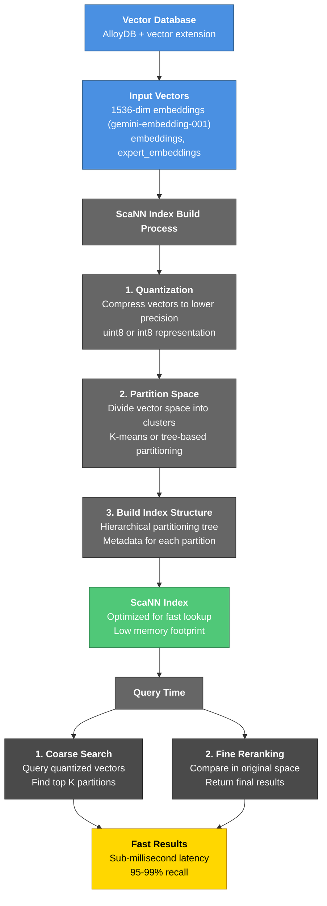

<Info>
  **Decision (LOCKED): ScaNN is Orbiter's vector index on AlloyDB.** Every vector column uses `alloydb_scann` — HNSW and IVFFlat are not used. ScaNN is the only AlloyDB index that supports inline metadata filtering (the load-bearing requirement for the find-investors / find-people engines) and it clears pgvector's 2000-dim index cap. Vectors are `gemini-embedding-001`, **1536-dim, cosine, L2-normalized** (standard updated 2026-07-06 — was 3072); store the column `vector(1536)` with `STORAGE EXTERNAL` and enable ScaNN **re-ranking** for near-exact recall. The HNSW comparison below is kept as rationale, not as an open option.
</Info>

<Warning>
  **Standard change (2026-07-06): every Gemini embedding is now 1536-dim (was 3072).** All `gemini-embedding-001` vectors on every surface — the FalkorDB properties (`embeddings`, `expert_embeddings`), future AlloyDB columns, and every query-side embed — are requested with `dimensions: 1536` and **L2-normalized before storing or comparing** (Gemini pre-normalizes only its 3072 output; the shared wrapper `vectors/create-gemini-vectors` #13114 v2 handles both). The FalkorDB indexes were rebuilt @1536 and all ~12.3k stored Gemini vectors were prefix-truncated \+ renormalized on live, staging, and sandbox on 2026-07-06. Read any remaining `3072` / `vector(3072)` on this page as `1536` / `vector(1536)`.
</Warning>

## Splitting Natural Language Queries

The trick: a natural language query has two parts, and you split them before hitting the database.

```text
"Find me male film directors in NYC who worked on indie horror"
                │
                ▼
        ┌───────┴────────┐
        │                │
   Hard filters      Semantic
   sex='M'           "indie horror film work"
   role='director'        │
   city='New York'        ▼
        │            embed → vector
        │                │
        └────► SQL ◄─────┘
                 │
                 ▼
           SQL Results
           (top-N candidates)
                 │
                 ▼
            Graph RAG
       (traverse relationships,
        gather context)
                 │
                 ▼
        Reason "WHY" from
        graph RAG results
                 │
                 ▼
          Final Results
         (with reasoning)
```

### Step 1: Extract filters with an LLM

Use structured output (function calling / JSON schema). Give the model a list of filterable fields it's allowed to return — anything else stays in the semantic query.

```python
schema = {
  "filters": {
    "sex": "M | F | null",
    "city": "string | null",
    "role": "string | null"
  },
  "semantic_query": "string"  # whatever's left
}
```

LLM output:

```json
{
  "filters": {"sex": "M", "city": "New York", "role": "director"},
  "semantic_query": "indie horror film work"
}
```

Use a fast cheap model here — this is a routing decision, not the answer.

#### Model Selection for Filter Extraction

You want **structured output \+ speed \+ cost**, not reasoning depth.

| Model | Input/Output (\$/1M) | TTFT | Notes |
| --- | --- | --- | --- |
| **DeepSeek V4-Flash** | 0.95s | Cheapest, open source (MIT), JSON \+ tools |
| **Gemini 2.5 Flash** | ~0.5s | Fastest TTFT, excellent JSON adherence |
| **Claude Haiku 4.5** | ~0.6s | Best tool-use reliability |

**Recommendation for Orbiter:** Start with **DeepSeek V4-Flash** (cheapest at high volume) or **Gemini 2.5 Flash** (lowest latency for real-time chat UX). Skip V4-Pro and frontier-tier models — overkill for a routing decision.

**Validation:** A/B test on 50 real queries with edge cases ("experienced engineer", "senior at FAANG", etc.) — measure recall on filter classification, not vibes.

### Step 2: Embed the leftover

```python
vec = embed(parsed.semantic_query)
```

### Step 3: Compose the SQL

Build the `WHERE` clause from the filters dict, the `ORDER BY` from the vector:

```sql
SELECT master_person_id, node_uuid,
       biography_embedding <=> $1 AS score
FROM people
WHERE sex   = $2
  AND city  = $3
  AND role  = $4
ORDER BY biography_embedding <=> $1
LIMIT 50;
```

AlloyDB's planner sees the B-tree filters \+ ScaNN `ORDER BY` and fuses them via inline filtering. One round trip.

### Two Important Guardrails

**1. Whitelist your filterable fields.** Don't let the LLM invent `WHERE shoe_size = 11`. Pass the model the exact list of indexed columns and tell it everything else goes in `semantic_query`. Validate before building SQL — basic injection hygiene.

**2. When in doubt, semantic.** "Experienced engineer" — is that a `years > 10` filter or fuzzy semantics? Default to leaving fuzzy phrases in the semantic query. Only extract filters when the user uses an unambiguous tag ("male", "in NYC", "at Disney"). Over-extracting is what breaks recall — you'll filter out the right person because the LLM guessed `seniority='senior'` and they're listed as `'staff'`.

### Bonus: Confidence-Tiered Filters

For Orbiter specifically, you might want the LLM to return:

```json
{
  "hard_filters": {"sex": "M"},
  "soft_hints":   {"role": "director"},
  "semantic_query": "indie horror"
}
```

- **Hard filters** → SQL `WHERE`
- **Soft hints** → either appended to the semantic query string (`"director indie horror"`) or used as a re-rank signal after retrieval

Keeps the `WHERE` clause honest while still using everything the user told you.

---

## What is ScaNN?

**Scalable Nearest Neighbor (ScaNN)** is Google's vector search algorithm optimized for fast approximate nearest neighbor queries at scale. AlloyDB integrates ScaNN through the `vector` extension, providing a modern alternative to traditional HNSW indexes for vector similarity search.

ScaNN achieves its speed through a two-stage search strategy:

1. **Coarse quantization** — quickly narrow down candidate vectors
2. **Fine-grained reranking** — refine results among top candidates

This approach trades perfect accuracy for dramatic speed improvements, making it ideal for large-scale vector searches over millions of embeddings.

---

## Why ScaNN over HNSW?

| Aspect | ScaNN | HNSW |
| --- | --- | --- |
| **Memory Usage** | Lower (quantization reduces footprint) | Higher (keeps all vector data in memory) |
| **Query Speed** | Faster on large datasets (\>1M vectors) | Good for small-medium datasets |
| **Build Time** | Faster (single pass) | Slower (hierarchical graph construction) |
| **Accuracy** | 95-99% recall (configurable) | 100% recall |
| **Update Performance** | Efficient incremental updates | Requires rebuild |
| **Best For** | Large-scale production, real-time search | Small-medium, ultra-high precision |

---

## Index Architecture



---

## ScaNN Index Types on AlloyDB

AlloyDB supports multiple ScaNN configurations for different use cases:

### Tree Index (Default)

- Uses hierarchical tree for partitioning
- Balanced between memory and speed
- Best for: Most general-purpose vector searches
- Build overhead: Medium
- Query latency: Fast (10-100ms for 1M vectors)

```sql
CREATE INDEX idx_name_embedding_scann 
  ON persons USING scann (name_embedding)
  WITH (tree_depth=15);
```

### Flat Index

- Linear scan with quantization only
- Lower memory, slower queries
- Best for: Small datasets or maximum recall
- Build overhead: Minimal
- Query latency: Slower (100ms\+)

```sql
CREATE INDEX idx_name_embedding_flat 
  ON persons USING scann (name_embedding)
  WITH (quantization_type='int8');
```

### Hybrid Approach

- Combine ScaNN with scalar filters
- Filter by categorical properties first, then vector search
- Best for: Filtered searches (e.g., "find similar people in California")

---

## How Queries Work

### Basic Vector Similarity Query

```sql
-- Find 10 most similar persons to a query embedding
SELECT id, name, name_embedding <-> query_vector AS distance
FROM persons
ORDER BY name_embedding <-> query_vector
LIMIT 10;
```

**Query Execution:**

1. Quantize the query vector using same method as index
2. Search coarse tree structure (fast)
3. Identify top K candidate partitions
4. Rerank candidates in original vector space
5. Return top N results sorted by distance

### With Scalar Filters (Hybrid)

```sql
-- Find similar persons with demographic filters
SELECT id, name, country, name_embedding <-> query_vector AS distance
FROM persons
WHERE country = 'United States'
  AND years_experience > 5
ORDER BY name_embedding <-> query_vector
LIMIT 10;
```

**Optimization Strategy:**

- Apply scalar filters first (reduces candidate set)
- Then perform vector search on filtered results
- Can reduce index search space by 50-90%

---

## Index Performance Characteristics

### Memory Footprint (per 1M vectors)

_Figures below are illustrative at 384-dim. Orbiter's production vectors are **1536-dim** (`gemini-embedding-001`, standard since 2026-07-06), so raw vector storage scales ~4× — budget **~6 GB per 1M vectors per column** before the index. ScaNN's quantized index stays far smaller than the raw vectors._

| Index Type | Original Size | Index Size | Total |
| --- | --- | --- | --- |
| No Index | ~1.5 GB | — | 1.5 GB |
| Tree (int8 quantized) | 1.5 GB | 200 MB | 1.7 GB |
| Flat (int8 quantized) | 1.5 GB | 50 MB | 1.55 GB |
| HNSW Reference | 1.5 GB | 600 MB | 2.1 GB |

### Query Latency (1M vectors, p99)

| Query Type | Tree Index | Flat Index | HNSW |
| --- | --- | --- | --- |
| Top-10 | 5ms | 80ms | 8ms |
| Top-100 | 8ms | 150ms | 12ms |
| Top-1K | 15ms | 250ms | 25ms |
| With filters | 2-5ms | 30-80ms | 5-10ms |

---

## Related

- [Vectors on AlloyDB](/guides/open-work/vectors-alloydb/graph-vectors) — migration planning and current vector creation inventory
- [Indexes](/guides/ontology/all-indexes) — FalkorDB scalar \+ HNSW index reference and scoring thresholds
- [AlloyDB Documentation](https://cloud.google.com/alloydb/docs) — official AlloyDB vector extension docs