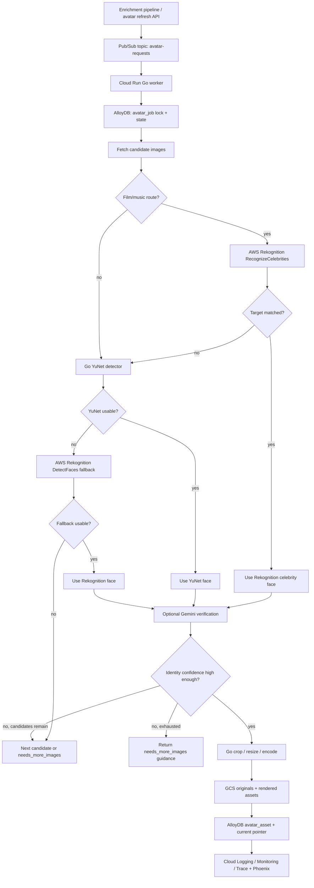

<Info>
  **Status:** Full GCP / AlloyDB build plan. No Xano orchestration, no Xano persistence, no Python service, no Node adapter. The production worker is written in **Go** and deployed on Cloud Run.
</Info>

## Intent

Build the avatar pipeline directly on GCP with AlloyDB as the source of truth. The service turns enrichment-sourced image candidates into square headshot avatars, using YuNet as the primary detector, Rekognition only for fallback + film/music celebrity routing, Gemini only when identity needs verification, and GCS for all image storage.

The plan intentionally removes Xano from the implementation path:

- **No Xano queue.** Use Pub/Sub or Cloud Tasks.
- **No Xano tables.** Use AlloyDB/Postgres tables.
- **No Xano file storage.** Use GCS buckets.
- **No Xano functions/lambdas.** Use Go Cloud Run services/jobs.
- **No Python/Node image worker.** Use Go as the production language.

## Inputs And Outputs

This service runs **after** an upstream resolver has already proposed one or more candidate images for a person. It does not perform web image search itself. Its job is to evaluate the proposed images, produce an avatar when confidence is high enough, or return a structured signal that the caller should run another web image search and re-submit better candidates.

The minimum useful request is: **one proposed image candidate, a person's name, and enough identity context to decide whether the face plausibly belongs to that person**. In the common enrichment case we will have several image URLs plus a short biography, role, industry, and source URLs.

### Input Contract

```json
{
  "subject_type": "master_person",
  "subject_id": "mp_12345",
  "target": {
    "name": "Jane Example",
    "aliases": ["Jane Example", "J. Example"],
    "short_biography": "Jane Example is a Grammy-nominated songwriter and record producer known for collaborations with independent pop artists in Los Angeles.",
    "descriptors": {
      "industry": "music",
      "occupations": ["songwriter", "record producer"],
      "known_for": ["independent pop", "Los Angeles music scene"],
      "company": "Example Songs",
      "location": "Los Angeles, CA"
    },
    "source_urls": [
      "https://musicbrainz.org/artist/example",
      "https://www.wikidata.org/wiki/Q123456"
    ]
  },
  "images": [
    {
      "source_url": "https://example-cdn.com/jane-example-press.jpg",
      "source_kind": "serper",
      "source_trust": "scraped",
      "rank": 1
    },
    {
      "source_url": "https://example-cdn.com/jane-example-profile.jpg",
      "source_kind": "enrich_layer",
      "source_trust": "semi_trusted",
      "rank": 2
    }
  ],
  "verification_required": true,
  "request_source": "enrichment",
  "priority": 10,
  "options": {
    "allow_rekognition_fallback": true,
    "allow_film_music_celebrity_route": true,
    "allow_gemini_verification": true,
    "request_more_images_on_low_confidence": true,
    "allow_monogram_fallback": false,
    "store_original": true,
    "auto_promote": true
  }
}
```

Input field rules:

| Field | Required | Notes |
|-------|----------|-------|
| `subject_type` | Yes | Stable owner type for the avatar pointer, e.g. `master_person`, `contact`, `external_person` |
| `subject_id` | Yes | Stable ID in the caller's graph/entity system |
| `target.name` | Yes | Main identity string for Rekognition/Gemini matching |
| `target.aliases` | No | Use for nickname/stage-name/legal-name variants |
| `target.short_biography` | Strongly recommended | Helps Gemini verify identity when the image is scraped or ambiguous |
| `target.descriptors` | Recommended | Industry, occupation, company, location, known-for context |
| `target.source_urls` | Recommended | IMDb/MusicBrainz/Wikidata/Wikipedia/LinkedIn/etc.; also powers film/music routing |
| `images[]` | Yes | One or more already-proposed candidate images, ordered by upstream source confidence |
| `verification_required` | Yes | `true` for scraped/multi-source images, `false` only for trusted single-source avatars |
| `options.request_more_images_on_low_confidence` | Recommended | If true, low confidence across all proposed images returns `needs_more_images` instead of silently falling to monogram |
| `options.allow_monogram_fallback` | Recommended | If false, the service asks for better images before creating a non-photo fallback |
| `options` | No | Feature gates and rollout controls |

The worker normalizes this request into:

- one `avatar_job`
- one `avatar_candidate` per image
- zero or one promoted `avatar_asset`
- one `avatar_current` pointer if promotion succeeds

### Output Contract

The synchronous request API returns job state immediately:

```json
{
  "job_id": 98231,
  "status": "pending",
  "already_existed": false,
  "subject": {
    "type": "master_person",
    "id": "mp_12345"
  },
  "current_avatar": null
}
```

When the job succeeds, `GET /internal/avatar/jobs/98231` returns the selected result:

```json
{
  "job_id": 98231,
  "status": "succeeded",
  "subject": {
    "type": "master_person",
    "id": "mp_12345"
  },
  "selected_candidate": {
    "source_url": "https://example-cdn.com/jane-example-press.jpg",
    "source_kind": "serper",
    "det_route": "film_music",
    "det_provider": "rekognition",
    "fallback_reason": null,
    "face_box": [320, 110, 260, 310],
    "det_confidence": 99.1,
    "celebrity_match": "Jane Example",
    "celebrity_match_confidence": 98.4,
    "gemini_verified": true,
    "gemini_confidence": 0.86,
    "quality_flags": []
  },
  "avatar": {
    "asset_id": 44192,
    "quality_flag": "ok",
    "crop_params": {
      "left": 190,
      "top": 70,
      "side": 620,
      "k": 2.0,
      "eye_top_frac": 0.4
    },
    "uris": {
      "webp_800": "gs://orbiter-avatar-assets-prod/avatars/master_person/mp_12345/44192/avatar_800.webp",
      "webp_400": "gs://orbiter-avatar-assets-prod/avatars/master_person/mp_12345/44192/avatar_400.webp",
      "webp_128": "gs://orbiter-avatar-assets-prod/avatars/master_person/mp_12345/44192/avatar_128.webp",
      "jpeg_800": "gs://orbiter-avatar-assets-prod/avatars/master_person/mp_12345/44192/avatar_800.jpg",
      "jpeg_400": "gs://orbiter-avatar-assets-prod/avatars/master_person/mp_12345/44192/avatar_400.jpg",
      "jpeg_128": "gs://orbiter-avatar-assets-prod/avatars/master_person/mp_12345/44192/avatar_128.jpg"
    },
    "metadata_stripped": true,
    "audit_state": "not_required"
  }
}
```

If the pipeline processes all proposed images and confidence is too low, it returns `needs_more_images`. The upstream caller should run another web image search, append new image candidates, and submit a new request or retry linked to the same subject.

```json
{
  "job_id": 98232,
  "status": "needs_more_images",
  "reason": "All proposed images were low-confidence, ambiguous, low-resolution, or failed identity verification.",
  "recommended_action": {
    "type": "web_image_search",
    "min_new_candidates": 3,
    "search_queries": [
      "\"Jane Example\" songwriter headshot",
      "\"Jane Example\" \"Example Songs\"",
      "\"Jane Example\" record producer Los Angeles"
    ],
    "avoid_urls": [
      "https://example-cdn.com/jane-example-press.jpg",
      "https://example-cdn.com/jane-example-profile.jpg"
    ],
    "preferred_sources": [
      "official site",
      "LinkedIn",
      "IMDb",
      "MusicBrainz",
      "Wikidata",
      "press kit"
    ]
  },
  "best_candidate": {
    "source_url": "https://example-cdn.com/jane-example-press.jpg",
    "det_provider": "yunet",
    "det_route": "default",
    "face_box": [320, 110, 260, 310],
    "det_confidence": 0.72,
    "gemini_verified": false,
    "gemini_confidence": 0.54,
    "quality_flags": ["multi_face_ambiguous"],
    "decision_reason": "Face detected, but identity confidence is below the auto-promote and manual-review thresholds."
  },
  "candidate_summary": {
    "submitted_count": 2,
    "processed_count": 2,
    "rejected_count": 2,
    "rejection_reasons": {
      "identity_low_confidence": 1,
      "low_res": 1
    }
  }
}
```

If confidence is borderline but a human could plausibly decide, it returns `needs_review`:

```json
{
  "job_id": 98233,
  "status": "needs_review",
  "reason": "Gemini verification confidence below auto-promote threshold",
  "best_candidate": {
    "det_provider": "yunet",
    "det_route": "default",
    "gemini_verified": false,
    "gemini_confidence": 0.54,
    "quality_flags": ["multi_face_ambiguous"]
  }
}
```

Output invariants:

- Every promoted avatar has 800/400/128 WebP outputs and JPEG fallbacks.
- Every promoted avatar has stored crop params.
- Every selected face can be traced back to a source URL, detector route, provider payload, and verification decision.
- Rendered images have metadata stripped.
- The current avatar is represented by `avatar_current`, not by overwriting prior assets.
- Low-confidence candidate exhaustion returns `needs_more_images` with web-search guidance; the service does not hide that condition behind a generic failure.

## Architecture



## Go Service Boundaries

One Go codebase can expose two deployable shapes:

| Binary | Deployment | Role |
|--------|------------|------|
| `avatar-api` | Cloud Run service | Internal authenticated API for request creation, status, manual review, and asset promotion |
| `avatar-worker` | Cloud Run service or job | Processes Pub/Sub/Cloud Tasks jobs, runs detection/verification/rendering/storage |

For MVP, these can be one Cloud Run service with separate HTTP handlers. Split them only when queue load and API traffic deserve independent scaling.

Recommended Go package layout:

```text
cmd/avatar-api/main.go
cmd/avatar-worker/main.go
internal/config
internal/httpapi
internal/worker
internal/jobs
internal/candidates
internal/cv
internal/crop
internal/rekognition
internal/gemini
internal/storage
internal/db
internal/telemetry
internal/audit
```

## Go Dependency Choices

Use boring, actively maintained Go packages where possible. The exact CV binding should be chosen during Phase 0.

| Concern | Go choice | Notes |
|---------|-----------|-------|
| HTTP server | `net/http` or `chi` | Keep API small; avoid framework weight |
| AlloyDB/Postgres | `pgx/v5` + `pgxpool` | Prepared queries, transactions, row locking |
| GCS | `cloud.google.com/go/storage` | Upload originals and derivatives |
| Pub/Sub | `cloud.google.com/go/pubsub` or push subscription handler | Pull worker or push HTTP endpoint |
| Cloud Tasks | `cloud.google.com/go/cloudtasks` | Use if explicit rate limiting / per-job scheduling is better than Pub/Sub |
| Rekognition | AWS SDK for Go v2 `service/rekognition` | `RecognizeCelebrities`, `DetectFaces`, `CompareFaces`, `DetectModerationLabels` |
| Gemini/OpenRouter | Go `net/http` client | Keep model call wrapped behind a small interface |
| YuNet inference | GoCV **or** ONNX Runtime Go binding | Decide in Phase 0; see [CV Runtime Decision](#cv-runtime-decision) |
| Image processing | Go image stack plus chosen encoder, or OpenCV/libvips via Go binding | Must support crop, resize, WebP, JPEG, metadata stripping |
| Telemetry | OpenTelemetry Go SDK | Export to Cloud Trace/Monitoring/Logging; Phoenix for LLM spans |

Primary references: [Google Cloud Storage Go client](https://pkg.go.dev/cloud.google.com/go/storage), [AWS Rekognition Go SDK v2](https://pkg.go.dev/github.com/aws/aws-sdk-go-v2/service/rekognition), [pgx v5](https://pkg.go.dev/github.com/jackc/pgx/v5).

## CV Runtime Decision

The build is Go-language, but YuNet still needs an inference/runtime strategy. Pick one during Phase 0 and freeze it before service wiring.

| Path | What it means | Pros | Risks |
|------|---------------|------|-------|
| **GoCV + OpenCV YuNet** | Go code calls OpenCV's `FaceDetectorYN` through GoCV | Closest to the existing scope; OpenCV handles model preprocessing/postprocessing | Larger container, cgo/native OpenCV dependency, verify `FaceDetectorYN` binding in chosen GoCV version |
| **ONNX Runtime Go binding** | Go loads `face_detection_yunet_2023mar.onnx` and implements pre/post-processing | Smaller conceptual CV surface, no OpenCV API dependency | More custom math; must verify YuNet preprocessing, output decoding, NMS, landmark mapping |
| **Rekognition-only detector** | Go calls Rekognition for all detection | Simplest Go service; no local model | Violates YuNet-primary scope, adds AWS cost/dependency, weaker deterministic control |

Recommendation: start Phase 0 with **GoCV + OpenCV YuNet** if the binding supports `FaceDetectorYN` cleanly. If not, switch to ONNX Runtime Go and keep the same internal `Detector` interface.

```go
type Detector interface {
    Detect(ctx context.Context, img Image) ([]FaceDetection, error)
}

type FaceDetection struct {
    Provider   string
    Confidence float64
    Box        Rect
    Landmarks  Landmarks
    Quality    []string
}
```

Everything above the `Detector` interface should be blind to GoCV vs ONNX Runtime.

## AlloyDB Data Model

Use Postgres enums for stable states and JSONB for provider payloads. Store provider payloads, but never store raw image bytes in AlloyDB.

### Enums

```sql
create type avatar_job_status as enum (
  'pending', 'processing', 'succeeded', 'needs_review', 'needs_more_images', 'failed', 'skipped'
);

create type avatar_route as enum (
  'default', 'film_music', 'fallback'
);

create type avatar_provider as enum (
  'yunet', 'rekognition', 'gemini', 'monogram', 'none'
);

create type avatar_decision as enum (
  'accepted', 'rejected', 'needs_review', 'needs_more_images', 'next_candidate'
);

create type avatar_quality_flag as enum (
  'ok', 'low_res', 'occluded', 'blurry', 'edge_clipped', 'manual_review', 'needs_more_images', 'fallback_monogram'
);
```

### `avatar_job`

One row per avatar request. The queue message points to this row; the row is the durable source of truth.

```sql
create table avatar_job (
  id bigserial primary key,
  created_at timestamptz not null default now(),
  updated_at timestamptz not null default now(),
  status avatar_job_status not null default 'pending',
  priority int not null default 0,
  request_source text not null,
  subject_type text not null,
  subject_id text not null,
  target_name text not null,
  target_aliases jsonb not null default '[]',
  routing_hints jsonb not null default '{}',
  candidate_urls jsonb not null default '[]',
  known_good_reference_asset_id bigint,
  verification_required boolean not null default true,
  idempotency_key text not null unique,
  attempt_count int not null default 0,
  locked_at timestamptz,
  locked_by text,
  last_error_code text,
  last_error_message text,
  selected_asset_id bigint,
  selected_candidate_id bigint,
  best_candidate_id bigint,
  recommended_action jsonb,
  confidence_summary jsonb not null default '{}',
  completed_at timestamptz
);

create index avatar_job_status_priority_idx
  on avatar_job (status, priority desc, created_at asc);
create index avatar_job_subject_idx
  on avatar_job (subject_type, subject_id);
create index avatar_job_locked_at_idx
  on avatar_job (locked_at);
```

`subject_type` / `subject_id` keeps this independent from Xano-era integer IDs. It can point to a user contact, master person, imported enrichment entity, or future graph node. `selected_candidate_id` and `best_candidate_id` can receive foreign keys after `avatar_candidate` exists, or remain nullable audit pointers in v1.

### `avatar_candidate`

One row per candidate image evaluated for a job.

```sql
create table avatar_candidate (
  id bigserial primary key,
  created_at timestamptz not null default now(),
  avatar_job_id bigint not null references avatar_job(id) on delete cascade,
  source_url text not null,
  source_kind text not null,
  source_rank int not null,
  source_trust text not null default 'unknown',
  fetch_status text not null default 'pending',
  image_sha256 text,
  width int,
  height int,
  content_type text,
  gcs_original_uri text,
  det_route avatar_route,
  det_provider avatar_provider,
  fallback_reason text,
  face_count int,
  selected_face_index int,
  det_confidence double precision,
  face_box jsonb,
  landmarks jsonb,
  provider_payload jsonb,
  quality_flags jsonb not null default '[]',
  gemini_verified boolean,
  gemini_confidence double precision,
  compare_similarity double precision,
  celebrity_match text,
  celebrity_match_confidence double precision,
  overall_confidence double precision,
  confidence_breakdown jsonb not null default '{}',
  decision avatar_decision,
  decision_reason text
);

create index avatar_candidate_job_rank_idx
  on avatar_candidate (avatar_job_id, source_rank);
create index avatar_candidate_decision_idx
  on avatar_candidate (decision);
create index avatar_candidate_sha_idx
  on avatar_candidate (image_sha256);
```

### `avatar_asset`

One row per rendered avatar set.

```sql
create table avatar_asset (
  id bigserial primary key,
  created_at timestamptz not null default now(),
  avatar_job_id bigint not null references avatar_job(id),
  avatar_candidate_id bigint references avatar_candidate(id),
  subject_type text not null,
  subject_id text not null,
  asset_status text not null default 'active',
  gcs_master_uri text not null,
  gcs_webp_800_uri text,
  gcs_webp_400_uri text,
  gcs_webp_128_uri text,
  gcs_jpeg_800_uri text,
  gcs_jpeg_400_uri text,
  gcs_jpeg_128_uri text,
  crop_params jsonb not null,
  source_url text,
  source_sha256 text,
  metadata_stripped boolean not null default true,
  quality_flag avatar_quality_flag not null default 'ok',
  audit_state text not null default 'not_required'
);

create index avatar_asset_subject_active_idx
  on avatar_asset (subject_type, subject_id, asset_status);
create index avatar_asset_audit_idx
  on avatar_asset (audit_state);
create index avatar_asset_source_sha_idx
  on avatar_asset (source_sha256);
```

### `avatar_current`

Small pointer table for the current selected avatar per subject.

```sql
create table avatar_current (
  subject_type text not null,
  subject_id text not null,
  avatar_asset_id bigint not null references avatar_asset(id),
  updated_at timestamptz not null default now(),
  primary key (subject_type, subject_id)
);
```

### `avatar_pipeline_event`

Append-only operational/audit log.

```sql
create table avatar_pipeline_event (
  id bigserial primary key,
  created_at timestamptz not null default now(),
  avatar_job_id bigint references avatar_job(id),
  avatar_candidate_id bigint references avatar_candidate(id),
  event_type text not null,
  severity text not null default 'info',
  provider text not null,
  duration_ms int,
  cost_units numeric,
  payload jsonb not null default '{}'
);

create index avatar_pipeline_event_job_idx
  on avatar_pipeline_event (avatar_job_id, created_at);
create index avatar_pipeline_event_type_idx
  on avatar_pipeline_event (event_type, created_at);
create index avatar_pipeline_event_severity_idx
  on avatar_pipeline_event (severity, created_at);
```

## Request And Queue Flow

### Request Creation

The enrichment pipeline or app calls `POST /internal/avatar/request` on `avatar-api`.

Input:

```json
{
  "subject_type": "master_person",
  "subject_id": "mp_123",
  "target_name": "Jane Example",
  "target_aliases": ["Jane Example", "J. Example"],
  "routing_hints": {
    "industry": "music",
    "source_urls": ["https://musicbrainz.org/artist/..."]
  },
  "candidate_urls": [
    "https://example.com/jane.jpg"
  ],
  "verification_required": true,
  "priority": 10,
  "request_source": "enrichment"
}
```

Handler responsibilities:

1. Validate internal auth.
2. Normalize subject, aliases, hints, candidate URLs.
3. Compute `idempotency_key`.
4. Insert `avatar_job` with `on conflict (idempotency_key) do update/returning`.
5. Publish `{avatar_job_id}` to Pub/Sub or enqueue Cloud Task.
6. Return job state.

### Queue Choice

| Option | Use when | Notes |
|--------|----------|-------|
| Pub/Sub push to Cloud Run | Default | Simple, high-throughput, at-least-once delivery |
| Pub/Sub pull in Cloud Run job | Batch/backfill | Better for controlled drains |
| Cloud Tasks | Per-job rate limits, scheduled retries, provider throttling | More explicit pacing and retry control |

Recommended MVP: **Pub/Sub push** for normal requests, **Cloud Run job** for backfills. Add Cloud Tasks later if Rekognition/OpenRouter rate limiting needs per-task scheduling.

## Worker Transaction Pattern

The worker must be idempotent. Pub/Sub is at-least-once.

Processing pattern:

```sql
update avatar_job
set status = 'processing',
    locked_at = now(),
    locked_by = $worker_id,
    attempt_count = attempt_count + 1
where id = $job_id
  and status in ('pending', 'failed')
  and (locked_at is null or locked_at < now() - interval '10 minutes')
returning *;
```

Then process in Go. On success, update `succeeded`. On recoverable failure, update `pending` or `failed` depending on attempts. On manual-review output, update `needs_review`. On exhausted low-confidence candidate sets, update `needs_more_images`.

`needs_more_images` is a terminal state for the current candidate set, not a provider failure. The worker should set it only after all submitted candidates have been processed and no candidate is strong enough for auto-promotion or human review. A later retry with newly discovered images should append or replace candidates, clear the low-confidence recommendation, and move the job back to `pending` through an explicit API action.

Every external call gets:

- context timeout
- retry budget
- pipeline event row
- structured error code
- redacted provider payload

## Go Interfaces

Keep provider code replaceable.

```go
type JobStore interface {
    LockJob(ctx context.Context, jobID int64, workerID string) (*AvatarJob, error)
    SaveCandidate(ctx context.Context, candidate *CandidateResult) error
    SaveAsset(ctx context.Context, asset *AvatarAsset) error
    PromoteAsset(ctx context.Context, subject SubjectRef, assetID int64) error
    MarkNeedsReview(ctx context.Context, jobID int64, assetID int64, reason string) error
    MarkNeedsMoreImages(ctx context.Context, jobID int64, rec MoreImagesRecommendation) error
    RequeueWithNewCandidates(ctx context.Context, jobID int64, candidates []CandidateInput) error
    MarkFailed(ctx context.Context, jobID int64, code, message string) error
    LogEvent(ctx context.Context, event PipelineEvent) error
}

type ImageFetcher interface {
    Fetch(ctx context.Context, url string) (*FetchedImage, error)
}

type Detector interface {
    Detect(ctx context.Context, img *DecodedImage) ([]FaceDetection, error)
}

type Renderer interface {
    Render(ctx context.Context, img *DecodedImage, face FaceDetection, opts CropOptions) (*RenderedSet, error)
}

type RekognitionClient interface {
    RecognizeCelebrity(ctx context.Context, img []byte, aliases []string) (*CelebrityMatch, error)
    DetectFaces(ctx context.Context, img []byte) ([]FaceDetection, error)
    CompareFaces(ctx context.Context, reference, target []byte) (*CompareResult, error)
    Moderate(ctx context.Context, img []byte) (*ModerationResult, error)
}

type GeminiVerifier interface {
    Verify(ctx context.Context, req VerifyRequest) (*VerifyResult, error)
}
```

## Detection Routes

### Film/Music Route

Call Rekognition `RecognizeCelebrities` before YuNet only when routing hints strongly indicate film or music:

- IMDb URL
- MusicBrainz URL
- Spotify / Apple Music / Discogs URL
- Wikidata/Wikipedia occupations like actor, actress, film director, musician, singer, composer, songwriter, DJ, producer
- Enrichment source says film, music, recording artist, actor, band, composer, director

Accept only when:

1. Normalized Rekognition `Name` matches a target alias, or
2. Returned Rekognition URLs overlap known target URLs, and
3. Match confidence exceeds the tuned threshold.

If not accepted, continue to YuNet.

### YuNet Default Route

Use YuNet for everything after the optional film/music check.

Usability gates:

- confidence >= tuned threshold, initially `0.70`
- face height >= `90px`
- plausible eye landmarks
- not badly edge-clipped
- single face, or unambiguous multi-face selection
- crop square can be composed without obvious face cutoff

### Rekognition Fallback Route

Call `DetectFaces` only when YuNet is weak.

Fallback reasons:

- `no_face`
- `low_confidence`
- `bad_landmarks`
- `edge_clipped`
- `multi_face_ambiguous`
- `decode_disagreement`

Store `fallback_reason`, `det_provider = rekognition`, and the raw Rekognition face payload in `provider_payload`.

## Crop And Render In Go

The crop algorithm is deterministic:

1. Decode and normalize orientation.
2. Select face.
3. Anchor on eye midpoint when both eyes exist.
4. Compute square side `S = min(k * face_h, image_w, image_h)`.
5. Place eye line at `eye_top_frac`, initially `0.40`.
6. Clamp square inside image.
7. Resize to 800, 400, 128.
8. Encode WebP and JPEG.
9. Strip metadata.
10. Upload to GCS.

If GoCV is chosen, use OpenCV image matrices and Go wrappers. If ONNX Runtime is chosen, keep rendering in the Go image stack or a Go binding to a production image library. The output contract must not change.

## GCS Layout

Buckets:

| Bucket | Purpose |
|--------|---------|
| `orbiter-avatar-originals-{env}` | Optional originals/source-normalized copies |
| `orbiter-avatar-assets-{env}` | Rendered WebP/JPEG derivatives |

Object keys:

```text
originals/{subject_type}/{subject_id}/{source_sha256}.{ext}
avatars/{subject_type}/{subject_id}/{asset_id}/avatar_800.webp
avatars/{subject_type}/{subject_id}/{asset_id}/avatar_400.webp
avatars/{subject_type}/{subject_id}/{asset_id}/avatar_128.webp
avatars/{subject_type}/{subject_id}/{asset_id}/avatar_800.jpg
avatars/{subject_type}/{subject_id}/{asset_id}/avatar_400.jpg
avatars/{subject_type}/{subject_id}/{asset_id}/avatar_128.jpg
```

Storage rules:

- Use uniform bucket-level access.
- Service account can write; app reads through signed URLs or CDN.
- Do not overwrite rendered objects; create a new `asset_id`.
- Set lifecycle policy for originals if retention is not needed.
- Keep derivatives as long as the asset row exists.

## Gemini Verification

Use Gemini via OpenRouter only for:

- scraped candidates
- multi-face ambiguity
- low-confidence fallback
- film/music celebrity miss where source is still plausible
- manual refreshes that request strict identity verification

Response contract:

```json
{
  "match": true,
  "confidence": 0.82,
  "face_box": [265, 122, 483, 515],
  "reason": "The selected face matches the target descriptors and source context."
}
```

Store:

- `gemini_verified`
- `gemini_confidence`
- response reason in `provider_payload`
- Phoenix trace ID where available

## Low-Confidence Search Feedback Contract

The avatar pipeline is not the web image searcher. It is the evaluator that runs after a search/resolution layer has proposed one or more images. That means low confidence should be returned as an actionable search signal, not hidden as a generic failure and not immediately replaced by a monogram.

### Confidence Inputs

Compute `overall_confidence` for each candidate from these signals:

| Signal | Source | Notes |
|--------|--------|-------|
| `detector_confidence` | YuNet or Rekognition | Face detector score after provider normalization |
| `face_quality_score` | local quality gates + Rekognition quality where available | Penalizes low resolution, blur, occlusion, edge clipping, tiny face |
| `identity_confidence` | Gemini, Rekognition celebrity match, or trusted source policy | Highest-value signal for scraped web images |
| `source_trust_score` | caller-provided `source_trust` + known domains | Official/structured sources beat generic scraped pages |
| `ambiguity_penalty` | candidate loop | Multi-face images, mismatched boxes, conflicting provider signals |
| `prior_candidate_penalty` | previous attempts | Penalizes URLs already rejected for the same subject |

Store the numeric score in `avatar_candidate.overall_confidence` and the parts in `avatar_candidate.confidence_breakdown`.

Example:

```json
{
  "overall_confidence": 0.54,
  "confidence_breakdown": {
    "detector_confidence": 0.72,
    "face_quality_score": 0.68,
    "identity_confidence": 0.54,
    "source_trust_score": 0.45,
    "ambiguity_penalty": 0.15,
    "reason_codes": ["scraped_source", "identity_low_confidence", "multi_face_ambiguous"]
  }
}
```

### Default Thresholds

Start with conservative thresholds, then tune from reviewed data:

| Outcome | Initial rule | Job status |
|---------|--------------|------------|
| Auto-promote | `overall_confidence >= 0.80`, identity accepted, no severe quality flags | `succeeded` |
| Human review | `0.60 <= overall_confidence < 0.80`, candidate is visually usable, identity is plausible | `needs_review` |
| More web images needed | all candidates below `0.60`, no usable face, or identity is implausible | `needs_more_images` |
| Monogram | caller declines additional search or retry budget is exhausted | `succeeded` with `fallback_monogram`, or `failed` if monograms are disabled |

Do not make `needs_review` the dumping ground for bad images. Use it only when a human can plausibly make a decision from the available candidate. Use `needs_more_images` when the image set itself is the problem.

### `needs_more_images` Decision Rules

Set job status to `needs_more_images` when all of these are true:

1. Every submitted candidate has reached a terminal candidate decision.
2. No candidate qualifies for auto-promotion.
3. No candidate qualifies for useful human review.
4. `options.request_more_images_on_low_confidence` is true.
5. The job is not past the caller-defined retry/search budget.

Use these reason codes:

- `no_face_detected`
- `all_faces_low_resolution`
- `identity_low_confidence`
- `celebrity_mismatch`
- `multi_face_unresolved`
- `source_untrusted`
- `detector_disagreement`
- `all_candidate_urls_previously_rejected`

### Recommended Action Payload

Persist `avatar_job.recommended_action` and return it from the status API.

```json
{
  "type": "web_image_search",
  "min_new_candidates": 3,
  "max_new_candidates": 10,
  "search_queries": [
    "\"Jane Example\" songwriter headshot",
    "\"Jane Example\" \"Example Songs\"",
    "\"Jane Example\" record producer Los Angeles"
  ],
  "avoid_urls": [
    "https://example-cdn.com/jane-example-press.jpg",
    "https://example-cdn.com/jane-example-profile.jpg"
  ],
  "preferred_sources": [
    "official site",
    "LinkedIn",
    "IMDb",
    "MusicBrainz",
    "Wikidata",
    "press kit"
  ],
  "reason_codes": ["identity_low_confidence", "source_untrusted"],
  "retry_policy": {
    "submit_new_candidates_to": "POST /internal/avatar/jobs/{id}/candidates",
    "preserve_prior_rejections": true
  }
}
```

Search query generation rules:

1. Always include exact quoted `target.name`.
2. Add role/industry terms from descriptors.
3. Add organization, band, label, production company, film, or album context when present.
4. Prefer source-specific queries when identity is ambiguous, e.g. `site:imdb.com`, `site:musicbrainz.org`, `site:wikidata.org`, or official domain hints.
5. Add `headshot`, `portrait`, or `press` when the rejected images had no usable face.
6. Include already rejected URLs in `avoid_urls`.
7. Include already rejected image hashes in internal state so redirected duplicate files can be skipped.

### Caller Reprocessing Loop

The upstream caller should treat `needs_more_images` as a normal control-flow result:

1. Read `recommended_action`.
2. Run a new web image search outside this service.
3. Filter out `avoid_urls` and duplicate image hashes where possible.
4. Submit the new images to the same job through `POST /internal/avatar/jobs/{id}/candidates`, or create a new request with `previous_job_id`.
5. The API inserts new `avatar_candidate` rows and changes the job from `needs_more_images` to `pending`.
6. The worker processes only new or explicitly reset candidates.
7. If the retry budget is exhausted, the caller can choose monogram, manual research, or no avatar.

This keeps responsibilities crisp: search finds candidates, this pipeline verifies and renders them, and the output tells the caller when the candidate set is insufficient.

## Observability

Use OpenTelemetry in the Go service.

Traces:

- `avatar.request`
- `avatar.worker.process`
- `candidate.fetch`
- `detector.yunet`
- `rekognition.recognize_celebrities`
- `rekognition.detect_faces`
- `gemini.verify`
- `render.crop_resize_encode`
- `gcs.upload`
- `alloydb.write`

Metrics:

- jobs processed
- jobs succeeded / failed / needs review / needs more images
- detection hit rate
- YuNet usable rate
- Rekognition fallback rate
- film/music celebrity match rate
- Gemini verification rate
- low-res rate
- low-confidence search request rate
- monogram fallback rate
- p50/p95 latency by stage
- provider cost units
- DLQ count

Logs:

- structured JSON
- include `avatar_job_id`, `avatar_candidate_id`, `subject_type`, `subject_id`, `det_route`, `det_provider`, `fallback_reason`
- never log raw image bytes

## Security And IAM

Cloud Run service account:

- read/write only the avatar GCS buckets
- connect to AlloyDB
- publish/ack Pub/Sub or run Cloud Tasks
- read Secret Manager entries for OpenRouter and AWS credentials
- write Cloud Logging/Trace/Monitoring

AWS:

- Prefer Workload Identity Federation from GCP to AWS IAM role.
- If not available for MVP, use short-lived AWS credentials in Secret Manager and rotate aggressively.
- Allow only:
  - `rekognition:RecognizeCelebrities`
  - `rekognition:DetectFaces`
  - `rekognition:CompareFaces`
  - `rekognition:DetectModerationLabels`

Network:

- Cloud Run reaches AlloyDB through Direct VPC egress or a Serverless VPC Access connector.
- Set request timeouts on all external calls.
- Reject private/network-local source URLs during image fetch to prevent SSRF.

## Three-Week Accelerated Build Plan

This is the locked execution plan for building a production-lean v1 in **3 weeks** by using AI agents in parallel. The detailed runbook below remains the source of implementation truth; this section defines the schedule, agent boundaries, gates, and what must be deferred to keep the build fast.

### Three-Week Target

The 3-week target is not "perfect platform complete." It is:

- Go Cloud Run API + worker running in staging.
- AlloyDB schema for jobs, candidates, assets, current pointer, and events.
- GCS storage for originals and rendered derivatives.
- Pub/Sub request processing with idempotent worker locking.
- Secure image fetch with SSRF protections.
- YuNet primary detection in Go through the chosen runtime.
- Rekognition selective path for film/music and fallback detection.
- Gemini verification for ambiguous/scraped candidates.
- Deterministic crop/render/store/promote path.
- `needs_more_images` output and candidate re-submit loop.
- Basic review endpoints, not a full operator UI.
- Basic backfill job, not broad automated historical reprocessing.
- Metrics/logs/traces sufficient for a limited production cohort.

The v1 success criterion is: **given proposed image URLs plus a name and biography, the system can produce a photo avatar, request better images, or safely route to review/fallback with full audit state.**

### Acceleration Principles

1. **Contract first.** Freeze interfaces, JSON contracts, SQL states, and provider result structs before implementation work fans out.
2. **Fake adapters first.** Build API, DB, queue, worker, candidate loop, render, and state transitions against fake YuNet/Rekognition/Gemini/GCS adapters on day 1 to day 3.
3. **One vertical slice by day 5.** A fake-detector image request must travel API -> queue -> worker -> candidate -> render -> GCS fake/real -> AlloyDB -> status response before provider work is complete.
4. **CV runtime is the only true spike.** Everything else builds behind stable interfaces while GoCV vs ONNX Runtime is decided.
5. **Parallelize by package boundary.** Agents own packages and contracts, not random files.
6. **Merge daily.** Every track lands small working increments behind feature flags or fake adapters.
7. **Use real cloud late, not last.** Local/fake tests come first, but staging Cloud Run/AlloyDB/GCS must be live by the middle of week 2.
8. **Tune after it works.** Thresholds start conservative; deep threshold optimization happens only after the end-to-end path is stable.

### Assumptions

This 3-week schedule assumes:

- One lead engineer owns architecture, reviews, and merge order.
- Two to four AI coding agents can run in parallel, each with a narrow package scope.
- GCP project, billing, Artifact Registry, Cloud Run, Pub/Sub, GCS, AlloyDB access, and Secret Manager access are available by day 2.
- AWS Rekognition credentials or GCP-to-AWS workload identity path is available by week 2.
- OpenRouter/Gemini credentials are available by week 2.
- The upstream image search/resolution layer already exists or can submit candidate URLs manually during testing.
- The first production cohort is small, for example 50 to 200 subjects, not a full database backfill.

If any cloud/provider access is delayed, the build still proceeds with fake adapters and local Postgres, but production validation shifts later.

### Parallel Agent Workstreams

| Track | Owner | Package area | Primary output | Can start | Blocks |
|-------|-------|--------------|----------------|-----------|--------|
| Architecture Lead | lead dev | all | contracts, merge order, risk control | day 1 | everyone |
| DB Agent | agent A | `internal/db`, `migrations` | AlloyDB schema, pgx store, state transitions | day 1 | API, worker |
| API Agent | agent B | `internal/httpapi`, `internal/config` | request/status/retry/review endpoints | day 1 after contracts | staging smoke tests |
| Worker Agent | agent C | `internal/worker`, `internal/jobs` | Pub/Sub handler, lock loop, candidate state machine | day 1 after contracts | end-to-end flow |
| Fetch Agent | agent D | `internal/candidates`, `internal/security` | URL normalization, SSRF-safe fetch, hashing, decode | day 1 | detector/candidate loop |
| Render/GCS Agent | agent E | `internal/crop`, `internal/gcs`, `internal/render` | crop math, WebP/JPEG derivatives, GCS object keys | day 1 | avatar promotion |
| CV Agent | agent F | `internal/cv`, `cmd/avatar-cli` | GoCV/ONNX YuNet decision and detector adapter | day 1 | real face detection |
| Rekognition Agent | agent G | `internal/rekognition` | celebrity route and fallback adapter | week 2 | film/music/fallback route |
| Gemini Agent | agent H | `internal/gemini` | verification adapter and JSON parser | week 2 | identity confidence |
| Test/Ops Agent | agent I | `testdata`, CI, telemetry | fake providers, integration tests, dashboards, deploy scripts | day 1 | release confidence |

Do not let agents edit each other's core package without lead approval. Shared structs belong in small contract packages, for example `internal/jobs`, `internal/providers`, or `internal/types`.

### Day 1 Contract Freeze

By the end of day 1, lock these artifacts:

1. Go module skeleton.
2. Package boundaries.
3. `AvatarRequest`, `AvatarJob`, `AvatarCandidate`, `AvatarAsset`, `SubjectRef`.
4. Provider interfaces:
   - `Detector`
   - `RekognitionClient`
   - `GeminiVerifier`
   - `Renderer`
   - `Storage`
   - `JobStore`
5. SQL enum values:
   - `pending`
   - `processing`
   - `succeeded`
   - `needs_review`
   - `needs_more_images`
   - `failed`
   - `skipped`
6. Request API response shapes.
7. Job status API response shapes.
8. `needs_more_images` recommendation JSON.
9. Candidate decision rules.
10. Fake provider behavior.

No downstream agent should wait for real providers. Every interface must have a deterministic fake implementation immediately.

### Fake Adapter Requirements

Fake adapters are not throwaway toys; they are the contract test harness.

| Fake | Behavior | Required fixtures |
|------|----------|-------------------|
| Fake detector | returns one face, no face, low confidence, multi-face, or bad landmarks based on fixture filename | `clean_face.jpg`, `no_face.jpg`, `low_confidence.jpg`, `multi_face.jpg` |
| Fake Rekognition | returns celebrity match, celebrity mismatch, fallback face, or no face based on test case | film/music sample cases |
| Fake Gemini | returns accepted, rejected, borderline review, malformed JSON, timeout | identity verification tests |
| Fake GCS | records object key, content type, bytes length, metadata | render/storage tests |
| Fake Pub/Sub | captures published job IDs and lets tests invoke worker directly | API/worker integration tests |

Every major state transition must be testable with fakes before real YuNet/Rekognition/Gemini is wired.

### Week 1 - Contracts, Skeleton, And End-To-End Fake Pipeline

Goal: by Friday, one local/staging request can move through the whole system with fake providers and produce a stored avatar asset row.

| Day | Lead focus | Parallel work | Exit gate |
|-----|------------|---------------|-----------|
| Day 1 | Freeze contracts and repo skeleton | DB migrations draft, API handler stubs, worker state machine skeleton, fake providers, CV spike starts | `go test ./...` passes with no-op/fake providers |
| Day 2 | Review SQL + state transitions | `internal/db` pgx store, request validation, idempotency key, fake Pub/Sub publish, SSRF URL validator | request creates job and fake queue message |
| Day 3 | Build candidate loop | worker lock query, candidate expansion, fake fetch/decode, fake detector decisions, event logging | worker processes fake job once and handles duplicate delivery |
| Day 4 | Build render/promote path | crop math tests, fake/real image resize, GCS fake, `avatar_asset`, `avatar_current`, status response | fake accepted candidate produces current avatar pointer |
| Day 5 | First vertical slice | local Postgres or dev AlloyDB, fake detector, real image fixture, render derivatives, status API | API -> worker -> asset -> current pointer works end to end |

Week 1 must not wait for:

- Rekognition credentials
- Gemini credentials
- final YuNet runtime decision
- production IAM
- backfill
- review UI

Week 1 definition of done:

- Contracts compile.
- Migrations run on a disposable Postgres-compatible database.
- `POST /internal/avatar/request` works.
- `GET /internal/avatar/jobs/{id}` works.
- Worker locking is idempotent.
- Candidate loop can return `succeeded`, `needs_review`, `needs_more_images`, and `failed` using fakes.
- Rendered derivative records are written.
- At least 15 unit tests and 3 integration tests exist.

### Week 2 - Real Providers, Staging Cloud, And Confidence Decisions

Goal: by Friday, staging Cloud Run can process real candidate images using YuNet, selective Rekognition, Gemini verification, GCS, and AlloyDB.

| Day | Lead focus | Parallel work | Exit gate |
|-----|------------|---------------|-----------|
| Day 6 | Freeze YuNet runtime | CV agent completes GoCV vs ONNX decision, API/worker deploy scaffolding, GCS bucket setup | real detector returns boxes for fixture images |
| Day 7 | Wire staging infrastructure | Cloud Run service/job, Pub/Sub topic/subscription, AlloyDB connectivity, GCS write path, Secret Manager config | staging `/healthz` and `/readyz` pass |
| Day 8 | Add Rekognition | film/music route, fallback route, provider payload storage, concurrency/rate caps | known music/film fixture can use celebrity route |
| Day 9 | Add Gemini | prompt contract, strict JSON parser, IoU reconciliation, identity confidence decision | scraped ambiguous fixture can accept/reject/review |
| Day 10 | Close confidence loop | `overall_confidence`, `needs_more_images`, candidate append endpoint, retry with new images | low-confidence job returns search guidance and reprocesses new candidates |

Week 2 definition of done:

- Staging Cloud Run can process a real image URL.
- GCS contains rendered WebP/JPEG outputs.
- AlloyDB has job, candidate, asset, current pointer, and event rows.
- YuNet runs on at least 25 real fixture images.
- Rekognition is called only for film/music or YuNet fallback.
- Gemini is called only for verification-required or ambiguous cases.
- `needs_more_images` includes search queries, preferred sources, avoid URLs, best candidate, and rejection summary.
- Candidate re-submit moves `needs_more_images` to `pending` and processes only new candidates.
- Basic structured logs include job/candidate/provider IDs.

### Week 3 - Hardening, Review, Backfill, And Limited Production Cohort

Goal: by Friday, the service is safe enough for a small production cohort and has enough observability to decide whether to expand.

| Day | Lead focus | Parallel work | Exit gate |
|-----|------------|---------------|-----------|
| Day 11 | Security hardening | SSRF tests, timeout budgets, image size caps, provider error taxonomy, panic recovery | malicious/private URLs are rejected in tests |
| Day 12 | Review and operations | review endpoints, retry endpoints, DLQ basics, dashboard draft, alert draft | operator can approve/reject/retry via API |
| Day 13 | Backfill basics | Cloud Run backfill job, dry-run mode, caps, provider spend guardrails, subject mode | backfill can enqueue bounded jobs and stop safely |
| Day 14 | Real-data tuning | run 50 to 100 staging subjects, inspect false accepts/rejects, tune thresholds, update fixtures | metrics and reviewed sample are acceptable |
| Day 15 | Production cohort | deploy production revision, enable small cohort, monitor logs/cost/errors, write rollout notes | 24-hour limited cohort decision is ready |

Week 3 definition of done:

- Limited production cohort is deployed or ready for same-day deploy.
- Provider spend caps exist.
- DLQ exists and can be inspected manually.
- Backfill dry-run and capped real-run work.
- Review endpoints work.
- Monogram fallback is behind explicit option.
- Observability covers success/failure/review/needs-more-images counts, provider calls, provider costs, latency, and DLQ count.
- Rollback steps are documented.

### Daily Merge Protocol

Each workstream must produce a small mergeable increment every day.

Daily checklist:

1. Pull latest main branch.
2. Run unit tests for owned package.
3. Run contract tests that use fakes.
4. Update package README or inline docs only when behavior changed.
5. Open a small PR or patch set.
6. Lead reviews public interfaces first, implementation second.
7. Merge behind feature flags if real provider behavior is incomplete.
8. Run `go test ./...` after merge.

No large end-of-week integration merge. That is how the schedule slips.

### Critical Path

The critical path is:

```text
contracts
  -> DB schema
  -> request API
  -> worker lock
  -> candidate loop
  -> detector interface
  -> crop/render
  -> GCS/store/promote
  -> real YuNet
  -> Rekognition/Gemini confidence
  -> staging run
  -> production cohort
```

Only real YuNet can threaten the schedule materially. If GoCV or ONNX is blocked by day 6, switch to a temporary Rekognition-only detector behind the same `Detector` interface for staging while continuing the YuNet adapter in parallel. The public contract does not change, and YuNet remains the target primary detector before broad rollout.

### Scope Deferred Beyond Three Weeks

Defer these unless they become mandatory for the limited cohort:

- Full operator UI.
- Broad historical backfill.
- Advanced DLQ replay UI.
- CDN/public URL polish.
- Sophisticated duplicate image clustering across all subjects.
- Perfect threshold tuning by cohort/industry.
- Full Terraform/IaC polish if manual setup is faster for v1.
- Advanced Phoenix dashboards beyond essential LLM trace IDs.
- Multi-region deployment.
- Automated model/provider A/B experiments.

### Three-Week Acceptance Gate

The build is considered complete for the 3-week plan when:

1. A proposed image, name, and biography can be submitted through the API.
2. The job processes asynchronously.
3. YuNet is the primary detector for normal candidates.
4. Rekognition is used only for film/music celebrity routing or fallback.
5. Gemini is used only for ambiguous/verification-required candidates.
6. A high-confidence candidate produces 800/400/128 WebP and JPEG assets in GCS.
7. `avatar_current` points to the selected asset.
8. Low-confidence candidate exhaustion returns `needs_more_images`.
9. New image candidates can be appended and reprocessed.
10. Borderline candidates can be routed to review.
11. Expected failures are typed and observable.
12. Provider calls are traceable and cost-counted.
13. Backfill can run in dry-run and capped modes.
14. A limited production cohort can be paused or rolled back.

## Detailed Step-by-Step Implementation Runbook

This is the build order a Go agent or engineer should follow. Each step produces a concrete artifact and has a clear exit check. Do not skip ahead to backfill before the single-job path is boring.

### Step 1 - Lock Product And Runtime Decisions

Decisions to record before writing production code:

| Decision | Recommended v1 value | Why |
|----------|----------------------|-----|
| App language | Go | User-selected production language |
| Orchestration | Cloud Run + Pub/Sub push | Simple async request path, at-least-once with explicit idempotency |
| Batch/backfill | Cloud Run jobs | Bounded, pausable, rerunnable |
| Database | AlloyDB PostgreSQL | Durable state, auditability, migration target from Scope |
| File storage | GCS | Native GCP object storage for originals and derivatives |
| Primary detector | YuNet in Go | Cheap/local deterministic detector |
| YuNet runtime | GoCV first, ONNX Runtime Go fallback | Decide empirically in Phase 0 |
| Fallback detector | Rekognition `DetectFaces` | Only when YuNet is weak |
| Film/music route | Rekognition `RecognizeCelebrities` | Only for strong film/music hints |
| Identity verifier | Gemini via OpenRouter | Only for ambiguous/scraped/verification-required cases |
| Public reads | Signed URL or CDN URL | Decide with frontend/security |
| Current avatar pointer | `avatar_current` | Avoid mutating source entity tables initially |

Exit check:

- The owner accepts that the first build is **Go + GCP + AlloyDB**, not Xano.
- The owner accepts that Rekognition is selective.
- The owner accepts one of GoCV or ONNX Runtime will be frozen after the spike.

### Step 2 - Create Repo Skeleton

Create a Go module dedicated to the avatar service. Example:

```text
avatar-pipeline/
  go.mod
  go.sum
  Dockerfile
  Makefile
  migrations/
    0001_avatar_enums.sql
    0002_avatar_tables.sql
    0003_avatar_indexes.sql
  cmd/
    avatar-api/
      main.go
    avatar-worker/
      main.go
    avatar-cli/
      main.go
  internal/
    audit/
    candidates/
    config/
    crop/
    cv/
    db/
    gemini/
    gcs/
    httpapi/
    jobs/
    rekognition/
    security/
    telemetry/
    worker/
  testdata/
    images/
    golden/
```

Rules:

- `cmd/avatar-cli` is for Phase 0 local experiments and golden crop generation.
- `cmd/avatar-api` handles request/status/review endpoints.
- `cmd/avatar-worker` handles Pub/Sub messages and backfill execution.
- `internal/cv` exposes the detector interface and hides GoCV vs ONNX Runtime.
- `internal/crop` contains deterministic crop math with pure unit tests.
- `internal/db` is the only package that knows SQL.
- `internal/gcs` is the only package that knows bucket names/object keys.

Exit check:

- `go test ./...` runs even before most packages have implementation.
- `go vet ./...` is wired in the Makefile.
- The service compiles locally with a no-op detector.

### Step 3 - Define Configuration

Use environment variables for deploy-time config and Secret Manager for secrets.

Required environment variables:

```text
APP_ENV=dev|staging|prod
GCP_PROJECT_ID=...
GCP_REGION=...
SERVICE_NAME=avatar-api|avatar-worker
ALLOYDB_HOST=...
ALLOYDB_PORT=5432
ALLOYDB_DATABASE=...
ALLOYDB_USER=...
ALLOYDB_SSLMODE=disable|require
GCS_ORIGINALS_BUCKET=orbiter-avatar-originals-dev
GCS_ASSETS_BUCKET=orbiter-avatar-assets-dev
PUBSUB_TOPIC_AVATAR_REQUESTS=avatar-requests
PUBSUB_DLQ_AVATAR_REQUESTS=avatar-requests-dlq
OPENROUTER_SECRET_NAME=...
AWS_REGION=us-east-1
AWS_ROLE_ARN=...
REKOGNITION_ENABLED=true
GEMINI_VERIFY_ENABLED=true
MAX_IMAGE_BYTES=10485760
FETCH_TIMEOUT_MS=8000
DETECT_TIMEOUT_MS=5000
REKOGNITION_TIMEOUT_MS=5000
GEMINI_TIMEOUT_MS=12000
RENDER_TIMEOUT_MS=8000
```

Config loading rules:

1. Parse env at process start.
2. Fail fast if required env is missing.
3. Load secrets once on startup, then refresh only on process restart for v1.
4. Log config shape, never secret values.
5. Expose `/healthz` for process health and `/readyz` for DB/GCS readiness.

Exit check:

- Local `.env.example` exists with every variable.
- Missing required variables fail at startup.
- Secret values never appear in logs.

### Step 4 - Provision GCP Infrastructure

Create infrastructure before writing worker code that depends on it.

GCP resources:

1. Artifact Registry repository for the Go container image.
2. Cloud Run service `avatar-api`.
3. Cloud Run service `avatar-worker` or a single service with `/pubsub/avatar`.
4. Cloud Run job `avatar-backfill`.
5. Pub/Sub topic `avatar-requests`.
6. Pub/Sub subscription `avatar-requests-push` or pull subscription.
7. Pub/Sub dead-letter topic `avatar-requests-dlq`.
8. GCS bucket `orbiter-avatar-originals-{env}`.
9. GCS bucket `orbiter-avatar-assets-{env}`.
10. Secret Manager secrets for OpenRouter and AWS config.
11. AlloyDB database/user/schema.
12. Cloud Monitoring alert policies.

Cloud Run settings:

| Setting | Initial value | Notes |
|---------|---------------|-------|
| CPU | 2 vCPU | YuNet/rendering are CPU-bound |
| Memory | 2GiB | Increase if large images or OpenCV require it |
| Concurrency | 4 to 8 | Keep low until image memory profile is known |
| Timeout | 300s | Worker needs enough time for slow images/providers |
| Min instances | 0 for dev, 1 for prod if latency matters | Avoid cold starts only if needed |
| Max instances | Start low, e.g. 10 | Protect providers and DB |
| VPC egress | Direct VPC or connector | Required for private AlloyDB |

Exit check:

- Cloud Run can start and serve `/healthz`.
- Cloud Run can connect to AlloyDB.
- Cloud Run can write a test object to GCS.
- Pub/Sub can invoke worker and receive 2xx.

### Step 5 - Write AlloyDB Migrations

Create migrations in this order:

1. `0001_avatar_enums.sql`
2. `0002_avatar_tables.sql`
3. `0003_avatar_indexes.sql`
4. `0004_avatar_updated_at_triggers.sql` if using DB-side updated timestamps
5. `0005_avatar_review_views.sql` for operator queries

Migration rules:

- Every enum value used by Go constants must exist in SQL.
- Every job transition query must use indexed predicates.
- `avatar_current` is the only current pointer.
- Provider payloads go into JSONB, never raw bytes.
- Any row that references an asset uses `bigint`.

Add review views:

```sql
create view avatar_review_queue as
select
  j.id as avatar_job_id,
  j.subject_type,
  j.subject_id,
  j.target_name,
  a.id as avatar_asset_id,
  a.quality_flag,
  a.audit_state,
  c.det_route,
  c.det_provider,
  c.fallback_reason,
  c.gemini_confidence,
  c.celebrity_match,
  a.created_at
from avatar_asset a
join avatar_job j on j.id = a.avatar_job_id
left join avatar_candidate c on c.id = a.avatar_candidate_id
where a.audit_state in ('queued', 'not_required')
  and (
    a.quality_flag <> 'ok'
    or c.det_route = 'fallback'
    or c.gemini_confidence < 0.75
  );
```

Exit check:

- Migrations run cleanly against empty dev AlloyDB.
- Migrations can be re-run in CI against a disposable Postgres-compatible database.
- `explain` shows indexed access for job claim and review queries.

### Step 6 - Implement `internal/db`

Use `pgxpool`.

Functions to implement first:

```go
func InsertOrGetJob(ctx context.Context, req AvatarRequest) (*AvatarJob, bool, error)
func PublishableJobPayload(job *AvatarJob) PubSubPayload
func LockJob(ctx context.Context, jobID int64, workerID string) (*AvatarJob, error)
func MarkJobSucceeded(ctx context.Context, jobID int64, assetID int64) error
func MarkJobNeedsReview(ctx context.Context, jobID int64, assetID int64, reason string) error
func MarkJobNeedsMoreImages(ctx context.Context, jobID int64, rec MoreImagesRecommendation) error
func RequeueJobWithNewCandidates(ctx context.Context, jobID int64, candidates []CandidateInput) error
func MarkJobFailed(ctx context.Context, jobID int64, code, message string) error
func InsertCandidate(ctx context.Context, candidate CandidateRow) (int64, error)
func UpdateCandidateDecision(ctx context.Context, id int64, decision CandidateDecision) error
func InsertAsset(ctx context.Context, asset AssetRow) (int64, error)
func PromoteAsset(ctx context.Context, subject SubjectRef, assetID int64) error
func LogEvent(ctx context.Context, event PipelineEvent) error
```

Transaction rules:

- `InsertOrGetJob` and Pub/Sub publish should be made safe with an outbox or status field if exactly-once publish is required later. MVP can publish after commit and rely on a sweeper for `pending` unpublished jobs.
- `LockJob` must be a single SQL update with `returning`.
- Candidate and asset writes can be separate transactions, but promotion must be atomic with `avatar_current` upsert.
- Any terminal state update must clear `locked_at` and `locked_by`.

Exit check:

- Unit tests cover idempotent insert.
- Unit tests cover double lock attempt.
- Unit tests cover promotion superseding old active asset.

### Step 7 - Implement Request API

Endpoint: `POST /internal/avatar/request`

Handler steps:

1. Read JSON with max body limit.
2. Authenticate internal caller.
3. Validate `subject_type`, `subject_id`, `target_name`.
4. Normalize aliases.
5. Normalize URLs:
   - trim
   - reject empty
   - reject non-HTTP(S)
   - de-dupe preserving order
   - cap candidate count
6. Normalize routing hints.
7. Compute idempotency key:
   - subject ref
   - target name
   - sorted/hashed candidate URLs
   - requested pipeline version
8. Insert or get job.
9. Publish `{avatar_job_id, idempotency_key}` to Pub/Sub if new or if existing is retryable.
10. Return response.

Response:

```json
{
  "job_id": 123,
  "status": "pending",
  "already_existed": false,
  "current_avatar_asset_id": null
}
```

Exit check:

- Bad auth returns 401/403.
- Invalid input returns 400 with machine-readable code.
- Duplicate request does not create duplicate jobs.
- New request creates Pub/Sub message.

Endpoint: `POST /internal/avatar/jobs/{id}/candidates`

Use this endpoint when a job is in `needs_more_images` and the upstream caller has completed another web image search.

Handler steps:

1. Authenticate internal caller.
2. Load job and verify it is not already `succeeded`.
3. Require at least one new candidate URL.
4. De-dupe against existing `avatar_candidate.source_url`.
5. De-dupe against known `image_sha256` if the caller already has hashes.
6. Insert only new candidate rows with the next `source_rank` values.
7. Clear `recommended_action`, `last_error_code`, and `last_error_message`.
8. Preserve prior rejected candidates for audit and `avoid_urls`.
9. Move job to `pending`.
10. Publish `{avatar_job_id, idempotency_key}` to Pub/Sub.
11. Return the new job state and inserted candidate count.

Response:

```json
{
  "job_id": 123,
  "status": "pending",
  "inserted_candidates": 4,
  "skipped_duplicates": 1
}
```

Exit check:

- Re-submitting the same rejected URLs does not loop forever.
- Adding new candidates to `needs_more_images` requeues exactly once.
- Adding candidates to `succeeded` is rejected unless a manual refresh flag is present.

### Step 8 - Implement Pub/Sub Worker Handler

Endpoint: `POST /pubsub/avatar`

Handler steps:

1. Verify request is from Pub/Sub/authorized invoker.
2. Decode Pub/Sub envelope.
3. Parse `avatar_job_id`.
4. Start trace span `avatar.worker.process`.
5. Call `LockJob`.
6. If no row returned, ack with 204 because another worker owns it or it is already terminal.
7. Process job.
8. On success, ack with 204.
9. On recoverable error, update job and return 2xx if retry is scheduled by DB/backfill, or non-2xx if Pub/Sub retry should handle it.
10. On permanent error, mark failed and ack with 204.

Worker rule:

- Never let an unclassified panic decide retry semantics. Recover panic, log event, mark job failed/retryable based on attempt count, then return a controlled response.

Exit check:

- Duplicate Pub/Sub deliveries are harmless.
- Worker returns 2xx for already-processed jobs.
- DLQ receives messages only for infrastructure-level failures, not expected candidate rejections.

### Step 9 - Implement Secure Image Fetch

Package: `internal/candidates`

Fetch steps:

1. Parse URL.
2. Require `https` unless an allowlist says otherwise.
3. Resolve DNS.
4. Reject private, loopback, link-local, multicast, and metadata IP ranges.
5. Send request with:
   - timeout
   - max redirects, e.g. 3
   - size-limited body reader
   - acceptable content types
6. Re-check final redirect host/IP.
7. Hash bytes with SHA-256.
8. Decode dimensions.
9. Store original in GCS if configured.

Failure codes:

- `fetch_invalid_url`
- `fetch_private_ip`
- `fetch_timeout`
- `fetch_too_large`
- `fetch_unsupported_content_type`
- `fetch_decode_failed`

Exit check:

- SSRF tests reject `localhost`, RFC1918, and metadata service IPs.
- Oversized body is stopped before full read.
- Redirect to private IP is rejected.

### Step 10 - Implement YuNet Detector

Package: `internal/cv`

Detector steps:

1. Load YuNet model once at process startup.
2. Validate model checksum.
3. Decode image into runtime format.
4. Normalize orientation before detection.
5. Set input size to actual image dimensions.
6. Run detection.
7. Convert output to shared `FaceDetection`.
8. Sort faces by confidence/area/centrality.
9. Return all faces with landmarks.

Usability scoring:

```go
type Usability struct {
    Usable         bool
    FallbackReason string
    QualityFlags   []string
}
```

Rules:

- no faces -> fallback `no_face`
- confidence below threshold -> fallback `low_confidence`
- eye landmarks missing or implausible -> fallback `bad_landmarks`
- face height less than 90 px -> quality `low_res`; prefer next candidate
- box clipped near image edge -> fallback `edge_clipped`
- multiple faces close in size/centrality -> Gemini or fallback `multi_face_ambiguous`

Exit check:

- Golden images produce stable boxes within tolerance.
- Low-res samples are flagged.
- Multi-face samples do not silently choose the wrong face without verification.

### Step 11 - Implement Film/Music Rekognition Route

Package: `internal/rekognition`

Route classifier steps:

1. Inspect `routing_hints.industry`.
2. Inspect `routing_hints.occupation`.
3. Inspect `routing_hints.known_for`.
4. Inspect URLs for IMDb, MusicBrainz, Spotify, Apple Music, Discogs, Wikipedia, Wikidata.
5. Return `film_music = true` only for strong hints.

`RecognizeCelebrities` steps:

1. Call AWS SDK with image bytes.
2. Normalize returned `Name`.
3. Compare against normalized target aliases.
4. If no name match, compare returned URLs to known target URLs.
5. Require match confidence threshold.
6. Convert Rekognition face box to pixel box.
7. Store raw response redacted in `provider_payload`.

Exit check:

- Non-film/music samples do not call celebrity recognition.
- Known film/music sample can match by alias.
- Mismatched celebrity result falls back to YuNet.

### Step 12 - Implement Rekognition Fallback

Call only after YuNet is not usable.

Steps:

1. Pass image bytes to `DetectFaces`.
2. Request useful attributes, including quality/occlusion where available.
3. Convert normalized boxes to pixels.
4. Clamp boxes inside image dimensions.
5. Convert landmarks to shared format.
6. Score fallback result.
7. If usable, mark `det_provider = rekognition`, `det_route = fallback`.
8. If not usable, move to next candidate.

Exit check:

- Clean YuNet success does not call fallback.
- YuNet failure calls fallback once.
- Partial edge Rekognition boxes are clamped.

### Step 13 - Implement Gemini Verification

Package: `internal/gemini`

Call Gemini only when policy requires:

- `verification_required == true`
- scraped source
- multi-face ambiguity
- Rekognition fallback
- low confidence
- film/music celebrity miss but candidate still plausible

Steps:

1. Build prompt with target name, aliases, descriptors, source context, selected face box.
2. Attach image or image URL depending on the OpenRouter/Gemini path.
3. Require JSON output.
4. Parse response strictly.
5. Validate `confidence` range.
6. Convert Gemini normalized box to pixels if returned.
7. IoU-match Gemini box against selected detector box.
8. Accept/reject/needs-review based on threshold.
9. Store Phoenix trace ID if available.

Exit check:

- Malformed JSON is handled.
- Refusal/empty content is handled.
- Low-confidence match rejects the candidate; only borderline, human-actionable matches become `needs_review`.

### Step 14 - Implement Crop Math

Package: `internal/crop`

Pure function:

```go
func ComposeSquare(imageW, imageH int, face FaceDetection, opts Options) (Square, Quality)
```

Algorithm:

1. Use eye midpoint if both eyes exist.
2. If eyes missing, use face-box center with conservative top padding.
3. Compute `S = min(k * faceH, imageW, imageH)`.
4. Compute `left = eyeX - 0.5*S`.
5. Compute `top = eyeY - eyeTopFrac*S`.
6. Clamp left/top to image bounds.
7. Round deterministically.
8. Return square crop.
9. Flag if crop touches too many edges.

Unit tests:

- centered face
- face near left edge
- face near top edge
- portrait image
- landscape image
- missing landmarks
- tiny face
- huge face close-up

Exit check:

- Crop math has no provider dependency.
- All tests pass with exact expected squares.

### Step 15 - Implement Renderer

Package: `internal/cv` or `internal/render`

Steps:

1. Decode normalized source image.
2. Apply square crop.
3. Resize to 800, 400, 128.
4. Encode WebP.
5. Encode JPEG fallback.
6. Strip metadata.
7. Return byte arrays and MIME types.

Quality checks:

- Ensure output dimensions are exact.
- Ensure alpha is flattened if JPEG.
- Ensure metadata is not copied.
- Ensure output byte size is sane.

Exit check:

- Golden render test compares output dimensions and basic perceptual sanity.
- EXIF orientation test renders upright.
- Animated image test picks first frame or rejects explicitly.

### Step 16 - Implement GCS Storage

Package: `internal/gcs`

Steps:

1. Build deterministic object keys.
2. Upload original if retained.
3. Upload derivatives.
4. Set content type.
5. Set cache control.
6. Record generation/metageneration if needed.
7. Return `gs://` URIs and optional signed/CDN URLs.

Object metadata:

- `avatar_job_id`
- `avatar_candidate_id`
- `subject_type`
- `subject_id`
- `source_sha256`
- `pipeline_version`

Exit check:

- GCS object exists after upload.
- Content type is correct.
- Re-running same job does not overwrite active asset objects unless explicitly designed.

### Step 17 - Implement Candidate Loop

Worker candidate algorithm:

1. Load job.
2. Expand candidate URLs in rank order.
3. Initialize:
   - `best_candidate` as nil
   - `best_overall_confidence` as 0
   - `processed_count` as 0
   - `rejected_count` as 0
   - `reviewable_candidate` as nil
   - `avoid_urls` from prior candidates for the same subject/job
   - `reason_counts` as an empty map
4. For each candidate:
   - fetch
   - maybe upload original
   - maybe run film/music Rekognition
   - run YuNet unless film/music accepted
   - run Rekognition fallback if needed
   - run Gemini if required
   - compute `overall_confidence`
   - update `best_candidate` when this candidate has the highest usable score
   - decide accepted/rejected/review/needs-more-images
   - render only when accepted or reviewable
   - store asset only when a photo asset is actually usable
   - promote, queue review, or continue
5. Stop immediately at first auto-promoted asset.
6. If a candidate is borderline and human-actionable, store the asset and mark `needs_review`.
7. If all candidates are exhausted with no accepted/reviewable asset:
   - when `request_more_images_on_low_confidence = true`, mark `needs_more_images`
   - when `allow_monogram_fallback = true`, create monogram fallback
   - when neither is allowed, mark `failed` with `last_error_code = candidate_exhausted`

Exit check:

- Candidate 1 failure proceeds to candidate 2.
- Accepted candidate stops the loop.
- Reviewable candidate stops only if policy says so.
- Low-confidence exhaustion returns `needs_more_images` with actionable search guidance.
- Monogram fallback only happens when explicitly allowed or after the caller stops requesting more image searches.

### Step 18 - Implement Low-Confidence Search Feedback

Package: `internal/jobs` and `internal/httpapi`

Build a `MoreImagesRecommendation` struct:

```go
type MoreImagesRecommendation struct {
    Type             string            `json:"type"`
    MinNewCandidates int               `json:"min_new_candidates"`
    MaxNewCandidates int               `json:"max_new_candidates"`
    SearchQueries    []string          `json:"search_queries"`
    AvoidURLs        []string          `json:"avoid_urls"`
    PreferredSources []string          `json:"preferred_sources"`
    ReasonCodes      []string          `json:"reason_codes"`
    BestCandidate    *CandidateSummary `json:"best_candidate,omitempty"`
    CandidateSummary CandidateCounts   `json:"candidate_summary"`
}
```

Implementation steps:

1. Collect every processed candidate for the job.
2. Pick `best_candidate_id` by highest `overall_confidence`, even if rejected.
3. Count rejection reason codes.
4. Build `avoid_urls` from all submitted candidates.
5. Add prior rejected URLs for the same subject when available.
6. Generate exact-name search queries from:
   - `target_name`
   - aliases
   - occupation
   - industry
   - company/organization
   - location
   - known works, albums, films, labels, or press-kit hints
7. Add preferred sources from routing hints:
   - film subjects: IMDb, official site, Wikidata, Wikipedia, press kit
   - music subjects: MusicBrainz, Discogs, Spotify, official site, Wikidata, press kit
   - general business subjects: LinkedIn, company site, conference speaker pages, author pages
8. Write `avatar_job.status = 'needs_more_images'`.
9. Write `avatar_job.best_candidate_id`.
10. Write `avatar_job.confidence_summary`.
11. Write `avatar_job.recommended_action`.
12. Clear job lock fields.
13. Emit `avatar.needs_more_images` event.
14. Return the same payload from `GET /internal/avatar/jobs/{id}`.

Exit check:

- `needs_more_images` response includes at least one query.
- Response includes every rejected candidate URL in `avoid_urls`.
- Best candidate details are visible enough for operators to understand why it was rejected.
- A caller can append new candidates and move the job back to `pending`.

### Step 19 - Implement Monogram Fallback

Steps:

1. Generate initials from target name.
2. Choose deterministic color from subject hash.
3. Render 800/400/128 WebP/JPEG.
4. Store in GCS.
5. Insert `avatar_asset` with `quality_flag = fallback_monogram`.
6. Promote only when no real candidate is usable and the caller allows monogram fallback.

Exit check:

- Empty/weird names produce safe fallback.
- Same subject gets same monogram style.
- `needs_more_images` takes precedence over monogram when the caller wants more web search attempts.

### Step 20 - Implement Review API

Endpoints:

- `GET /internal/avatar/review?status=queued`
- `POST /internal/avatar/assets/{id}/approve`
- `POST /internal/avatar/assets/{id}/reject`
- `POST /internal/avatar/jobs/{id}/retry`
- `POST /internal/avatar/jobs/{id}/candidates`

Approval steps:

1. Verify internal/admin auth.
2. Load asset and job.
3. Set `audit_state = approved`.
4. Set asset active.
5. Upsert `avatar_current`.
6. Supersede other active assets for subject.
7. Log event.

Exit check:

- Approval changes current pointer.
- Rejection does not delete files.
- Retry creates or reuses a job safely.
- Adding candidates to `needs_more_images` requeues the job safely.

### Step 21 - Implement Backfill

Cloud Run job modes:

```text
avatar-backfill --mode=missing --limit=100 --priority=0
avatar-backfill --mode=low-quality --limit=50 --priority=5
avatar-backfill --mode=needs-more-images --limit=50 --priority=5
avatar-backfill --mode=subject --subject-type=master_person --subject-id=mp_123
```

Backfill rules:

- Hard cap per run.
- Hard cap per provider call type.
- Do not enqueue if active high-quality asset exists.
- Enqueue lower priority than user-triggered refresh.
- Do not blindly requeue `needs_more_images` jobs without new candidate URLs.
- Export `needs_more_images` subjects to the upstream web-search process when that process is available.
- Emit summary metrics.

Exit check:

- Dry run prints exact enqueue count.
- Real run enqueues bounded jobs.
- Backfill can be stopped without losing state.
- `needs-more-images` mode reports search-needed subjects instead of retrying stale candidates.

### Step 22 - Testing Matrix

Unit tests:

- config validation
- idempotency key generation
- route classifier
- SSRF URL rejection
- crop math
- Rekognition response normalization
- Gemini JSON parsing
- GCS key generation
- DB state transitions

Integration tests:

- API creates job and publishes message
- worker locks job
- candidate fetch writes candidate row
- fake detector success creates asset
- fake detector failure calls fake Rekognition
- fake Gemini reject moves to next candidate
- all low-confidence candidates mark job `needs_more_images`
- appended new candidates move job from `needs_more_images` to `pending`
- promotion writes `avatar_current`

Golden image tests:

- single clean headshot
- press photo with multiple people
- low-res thumbnail
- film/music celebrity image
- image with EXIF rotation
- transparent PNG
- no-face image
- duplicate rejected URL submitted on retry

Exit check:

- CI runs unit tests on every change.
- Integration tests run against disposable Postgres-compatible DB and fake GCS/provider clients.
- Real-provider tests are opt-in and never run by default in CI.

### Step 23 - Deployment Pipeline

Build:

1. Run `go test ./...`.
2. Run `go vet ./...`.
3. Build container.
4. Push to Artifact Registry.
5. Run migrations.
6. Deploy Cloud Run services.
7. Deploy Cloud Run job.
8. Update Pub/Sub subscription target.
9. Smoke test request API.
10. Smoke test one worker job.

Rollback:

- Cloud Run revision rollback for code.
- Migrations must be backward-compatible within one release.
- Disable Pub/Sub subscription or set max instances to zero to pause processing.
- Backfill job can be stopped independently.

Exit check:

- One staging job processes end to end.
- One staging review job can be approved.
- Dashboards show traces/logs/metrics.

### Step 24 - Production Rollout

Rollout stages:

1. **Shadow sample:** run on real candidates, do not promote.
2. **Manual review cohort:** generate assets but require approval.
3. **Trusted-source auto-promote:** auto-promote trusted single-face sources only.
4. **Fallback-enabled cohort:** allow Rekognition fallback with review threshold.
5. **Film/music route cohort:** enable celebrity recognition for film/music subjects.
6. **Limited backfill:** 100 subjects.
7. **Expanded backfill:** increase only if review/failure/cost metrics are healthy.

Stop conditions:

- false accept found
- low-res rate above threshold
- provider spend above cap
- DLQ count above threshold
- p95 processing latency too high
- GCS upload errors
- AlloyDB connection pool saturation

Exit check:

- Production metrics stay within thresholds for 24 to 48 hours before expanding.

## Phased Delivery

### Phase 0 - Go Spike And CV Decision

Goal: prove the Go runtime path before building platform wiring.

Tasks:

1. Create a small Go CLI that reads local image files and URL samples.
2. Test GoCV + OpenCV YuNet.
3. If GoCV binding is weak, test ONNX Runtime Go.
4. Render contact sheets with boxes/landmarks/crops.
5. Test WebP + JPEG output in Go.
6. Run Rekognition on only:
   - YuNet failures
   - film/music sample rows
7. Tune:
   - detector threshold
   - `face_h < 90px`
   - `k`
   - `eye_top_frac`
   - fallback triggers
   - film/music route rules

Exit criteria:

- Go can detect, crop, resize, encode, and strip metadata.
- CV runtime choice is frozen.
- 50 to 100 real enrichment images reviewed.
- Rekognition selective route has clear triggers.

### Phase 1 - AlloyDB Schema And API Skeleton

Goal: create durable state and a request endpoint.

Tasks:

1. Create migrations for enums and tables.
2. Build Go `internal/db` with `pgxpool`.
3. Implement `POST /internal/avatar/request`.
4. Implement `GET /internal/avatar/jobs/{id}`.
5. Implement idempotency.
6. Publish job message to Pub/Sub.
7. Add structured logging and basic health checks.

Exit criteria:

- Request creates an AlloyDB job.
- Duplicate request returns the same job.
- Pub/Sub message is published.
- No image processing yet.

### Phase 2 - Worker Locking And Candidate Fetch

Goal: process a job safely once.

Tasks:

1. Implement Pub/Sub push handler or pull worker.
2. Implement transactional job lock.
3. Expand `candidate_urls` into `avatar_candidate` rows.
4. Fetch images with SSRF protections.
5. Decode dimensions and hash bytes.
6. Optionally upload normalized original to GCS.
7. Write pipeline events.

Exit criteria:

- At-least-once Pub/Sub delivery is safe.
- Duplicate delivery does not double-process active jobs.
- Candidate fetch failures move to next candidate.

### Phase 3 - YuNet Detection In Go

Goal: primary local detector works in production service.

Tasks:

1. Add chosen YuNet runtime to Cloud Run image.
2. Implement `Detector` interface.
3. Normalize output into shared face contract.
4. Implement usability gates.
5. Store candidate geometry in AlloyDB.
6. Add unit tests for crop math and detector response normalization.

Exit criteria:

- YuNet handles trusted single-face samples.
- Weak detections are marked with explicit fallback reasons.
- No Rekognition call happens on clean YuNet successes.

### Phase 4 - Selective Rekognition

Goal: add film/music identity assist and fallback detector.

Tasks:

1. Add AWS SDK for Go v2 Rekognition client.
2. Implement `RecognizeCelebrities` film/music route.
3. Implement `DetectFaces` fallback route.
4. Implement optional `CompareFaces`.
5. Store provider payloads and cost units.
6. Add rate limiting / concurrency caps.

Exit criteria:

- Film/music candidates call `RecognizeCelebrities` first.
- Non-film/music candidates call Rekognition only after YuNet weakness.
- Every Rekognition call has a stored reason.

### Phase 5 - Gemini Verification

Goal: prevent false accepts.

Tasks:

1. Implement OpenRouter/Gemini client.
2. Add structured prompt/response contract.
3. Add IoU reconciliation against selected detector boxes.
4. Trace calls to Phoenix.
5. Store verification result.
6. Add thresholds for auto-accept vs review vs `needs_more_images`.

Exit criteria:

- Trusted single-face candidates can skip Gemini.
- Scraped and ambiguous candidates are verified.
- Rejected candidates move to next source.
- Exhausted low-confidence candidate sets return `needs_more_images`.

### Phase 6 - Render, GCS Store, Promote

Goal: produce production avatar assets.

Tasks:

1. Implement crop/resize/encode renderer.
2. Generate 800/400/128 WebP and JPEG outputs.
3. Strip metadata.
4. Upload to GCS.
5. Insert `avatar_asset`.
6. Upsert `avatar_current`.
7. Supersede older assets.
8. Add low-confidence `needs_more_images` output before monogram fallback.
9. Add monogram fallback for callers that decline additional image search.

Exit criteria:

- Successful job yields GCS-backed avatar assets.
- Current pointer resolves to the new asset.
- Old assets are not overwritten.
- Low-confidence candidate exhaustion returns web-search guidance.
- Monogram fallback works only when explicitly allowed.

### Phase 7 - Backfill, Review, And Operations

Goal: run safely at volume.

Tasks:

1. Add Cloud Run job for capped backfills.
2. Add DLQ and replay workflow.
3. Add review API for `needs_review`.
4. Add candidate-append API for `needs_more_images`.
5. Add dashboards and alerts.
6. Add provider spend caps.
7. Add load test with representative image sizes.

Exit criteria:

- Backfill can be paused/resumed.
- DLQ records can be inspected and replayed.
- Operator can approve/reject assets.
- Upstream search can re-submit new images for `needs_more_images` jobs.
- Alerts fire on failure rate, DLQ count, latency, and provider spend.

## Acceptance Checklist

- Go is the only application language in the production worker/API.
- Xano is not part of queueing, persistence, file storage, or orchestration.
- AlloyDB stores all job/candidate/asset/current/audit state.
- GCS stores originals and derivatives.
- YuNet is the primary detector.
- Rekognition is selective: fallback + film/music only.
- Gemini is selective: identity ambiguity only.
- Pub/Sub/Cloud Tasks delivery is idempotent.
- Crop params are deterministic and stored.
- Metadata is stripped from rendered images.
- Current avatar is a pointer, not an overwrite.
- Low-confidence exhaustion returns `needs_more_images` with search queries, preferred sources, and avoid URLs.
- Monogram fallback never masks a candidate set that should trigger another web image search.
- Every provider call has trace/log/event records.
- Backfill has caps and a DLQ.

## Open Decisions

- GoCV vs ONNX Runtime Go for YuNet.
- WebP encoder/image library choice in Go.
- Pub/Sub-only vs Cloud Tasks for provider rate limiting.
- GCS signed URLs vs CDN public derivative URLs.
- Whether to retain originals or only normalized hashes + derivatives.
- Exact subject ID format for current avatar pointers.
- Exact Gemini threshold for auto-accept vs review vs `needs_more_images`.
- Retry/search budget before monogram or manual research.
- Owner and format of the upstream web image search process.
- Rekognition daily spend cap.
- Backfill priority order.

## Suggested Agent Build Order

1. Build Phase 0 Go CLI spike and freeze CV runtime.
2. Add AlloyDB migrations.
3. Build request API and Pub/Sub publish.
4. Build worker lock/fetch loop.
5. Add YuNet detection.
6. Add selective Rekognition.
7. Add Gemini verification.
8. Add `needs_more_images` feedback and candidate re-submit flow.
9. Add render/GCS/promote.
10. Add review/backfill/DLQ/observability.
11. Run a capped production cohort and tune thresholds before broad rollout.
